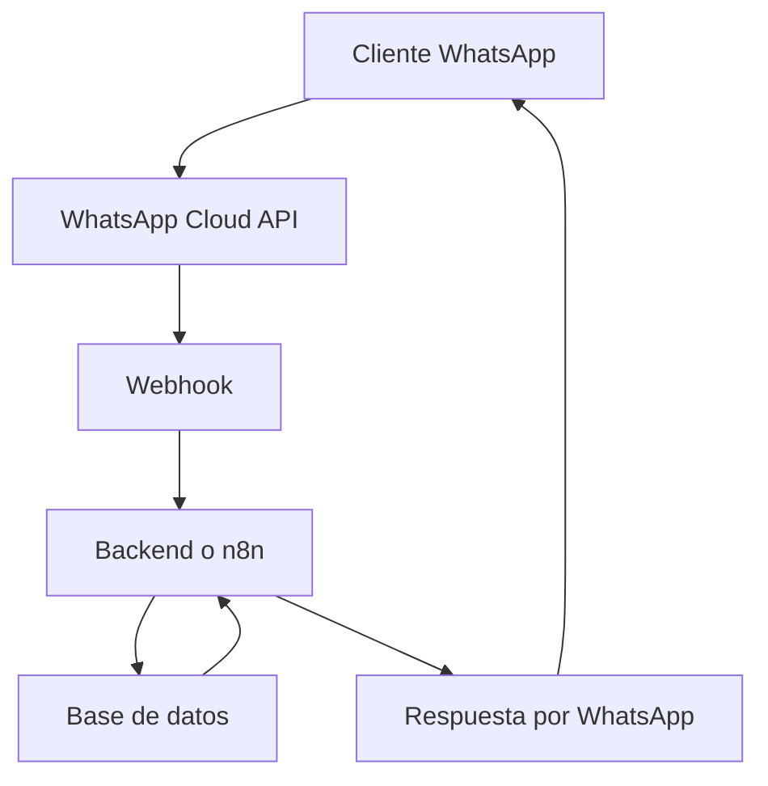
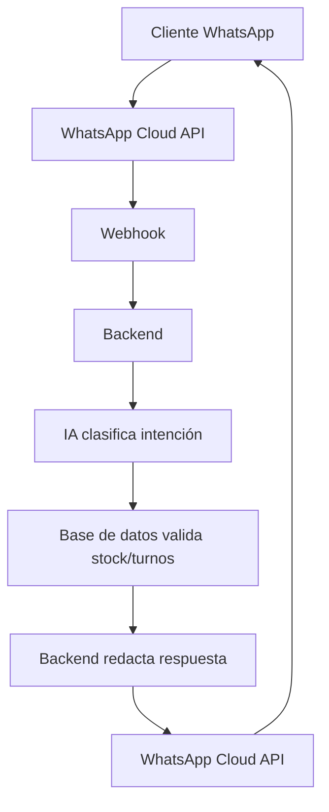

# 🤖 Guía completa para crear un bot de WhatsApp económico para comercios chicos

> **Idea central:** un comercio chico no necesita una app propia para empezar a automatizar. Necesita un asistente por WhatsApp que entienda pedidos, consulte stock, saque turnos y derive a una persona cuando haga falta.

---

## 📋 Índice

1. [Qué puede hacer un bot de WhatsApp moderno](#1-qué-puede-hacer-un-bot-de-whatsapp-moderno)
2. [Analogía simple para entenderlo](#2-analogía-simple-para-entenderlo)
3. [Conceptos clave que tenés que saber](#3-conceptos-clave-que-tenés-que-saber)
4. [Stacks económicos recomendados](#4-stacks-económicos-recomendados)
5. [Arquitectura simple y profesional](#5-arquitectura-simple-y-profesional)
6. [Modelo de datos básico](#6-modelo-de-datos-básico)
7. [Ejemplos de conversaciones](#7-ejemplos-de-conversaciones)
8. [Técnicas conversacionales](#8-técnicas-conversacionales)
9. [Cómo implementar paso a paso](#9-cómo-implementar-paso-a-paso)
10. [IA: cómo usarla sin que invente](#10-ia-cómo-usarla-sin-que-invente)
11. [Errores comunes](#11-errores-comunes)
12. [Checklist para lanzar un MVP](#12-checklist-para-lanzar-un-mvp)

---

## 1. Qué puede hacer un bot de WhatsApp moderno

Un bot de WhatsApp para un comercio chico puede actuar como una mezcla entre **recepcionista**, **vendedor**, **cajero**, **encargado de stock** y **asistente de turnos**.

Puede hacer tareas como:

- 📅 Asignar turnos.
- 🛒 Recibir pedidos.
- 🧾 Consultar stock.
- 🔎 Saber si existe un producto.
- 🏷️ Mostrar catálogo o promociones.
- 📦 Informar estado de entrega.
- 💬 Derivar a una persona cuando sea necesario.
- 🔔 Enviar recordatorios automáticos.

La clave es no intentar construir un sistema gigante desde el primer día. Lo moderno y económico es empezar con un **MVP útil**.

### 🎯 MVP ideal para un comercio chico

Para empezar, alcanza con estas 4 funciones:

```text
1. Consultar stock
2. Hacer pedido simple
3. Sacar turno
4. Derivar a humano
```

Con eso ya se resuelve gran parte del trabajo repetitivo.

---

## 2. Analogía simple para entenderlo

Un bot de WhatsApp es como una **recepcionista digital con un cuaderno de pedidos**.

Antes, una persona hacía esto:

```text
Atendía WhatsApp
Anotaba pedidos
Consultaba estantes
Miraba disponibilidad
Confirmaba turnos
Avisaba al dueño
```

Ahora el bot hace lo mismo, pero con:

```text
WhatsApp API
Base de datos
Reglas automáticas
IA opcional
Notificaciones
```

No reemplaza al comercio. Lo ayuda a responder más rápido, vender más y perder menos tiempo en preguntas repetidas.

### Comparación rápida

| Antes | Ahora con bot |
|---|---|
| El dueño responde todo manualmente | El bot responde consultas frecuentes |
| El stock se consulta a mano | El bot consulta la base de datos |
| Los turnos se anotan en agenda | El bot guarda turnos automáticamente |
| Los pedidos se pierden entre mensajes | El bot crea pedidos con estado |
| El cliente espera | El cliente recibe respuesta inmediata |

---

## 3. Conceptos clave que tenés que saber

### 3.1 WhatsApp Business App

La **WhatsApp Business App** es la app gratuita o económica para negocios.

Sirve para:

- Tener catálogo.
- Usar respuestas rápidas.
- Etiquetar clientes.
- Organizar conversaciones.
- Atender manualmente.

Es útil para comercios muy chicos, pero no es ideal para un bot real con stock, pedidos y turnos automáticos.

#### ✅ Ventajas

- Gratis o muy barata.
- Fácil de usar.
- No requiere programación.
- Ideal para validar demanda.

#### ⚠️ Limitaciones

- No permite automatización oficial avanzada.
- No es buena opción para bots complejos.
- Automatizaciones no oficiales pueden violar reglas de WhatsApp.

---

### 3.2 WhatsApp Cloud API

La **WhatsApp Cloud API** es la forma oficial de Meta para automatizar WhatsApp.

Permite:

- Recibir mensajes por webhook.
- Enviar respuestas automáticas.
- Usar plantillas aprobadas.
- Integrar con backend.
- Conectar IA.
- Escalar a más volumen.

Es la opción recomendada si querés construir algo serio.

---

### 3.3 Webhook

Un webhook es como un **timbre digital**.

Cuando un cliente escribe al negocio, WhatsApp toca ese timbre y avisa al servidor:

```text
Llegó un mensaje nuevo.
Acá está el texto.
Acá está el número del cliente.
```

Luego el servidor responde.

Flujo:

```text
Cliente escribe
   ↓
WhatsApp recibe
   ↓
WhatsApp avisa al webhook
   ↓
Backend procesa
   ↓
Backend responde
```

Ejemplo:

```text
Cliente: tenés arroz?
Bot: Sí 🍚. Tengo arroz blanco 1kg. Stock: 18 unidades. Precio: $1.900.
```

---

### 3.4 Base de datos

La base de datos es el **cuaderno digital** del comercio.

Guarda:

- Productos.
- Precios.
- Stock.
- Clientes.
- Pedidos.
- Turnos.
- Estados.
- Historial de conversaciones.

Opciones económicas:

| Herramienta | Cuándo usarla |
|---|---|
| Google Sheets | Prototipo muy simple |
| Airtable | Catálogo visual y fácil de editar |
| Supabase | MVP moderno y potente |
| SQLite | Proyecto pequeño o local |
| PostgreSQL | Producción más robusta |

Para un proyecto serio pero económico, una muy buena opción es:

```text
Supabase + PostgreSQL
```

---

### 3.5 Catálogo

El catálogo es la lista de productos que el bot puede vender o consultar.

Debe tener al menos:

```text
Nombre
Descripción
Precio
Stock
Categoría
Código o SKU
Disponible sí/no
Imagen opcional
```

Ejemplo:

| Producto | Precio | Stock | Categoría |
|---|---:|---:|---|
| Yerba Mate 1kg | $3.200 | 12 | Almacén |
| Pan Francés x6 | $1.800 | 30 | Panadería |
| Corte de cabello | $12.000 | 8 turnos | Servicio |

---

### 3.6 Flujo conversacional

Un flujo conversacional es el camino que sigue la conversación.

Ejemplo para sacar turno:

```text
Cliente: quiero turno
Bot: ¿para qué servicio?
Cliente: corte
Bot: ¿qué día?
Cliente: mañana
Bot: ¿qué horario?
Cliente: 17
Bot: Confirmo mañana a las 17?
Cliente: sí
Bot: Turno confirmado ✅
```

Los flujos pueden ser:

- Con menú numérico.
- Con botones.
- Con texto libre.
- Con IA.
- Mixtos.

---

### 3.7 Intención

Una intención es lo que el cliente quiere hacer.

Ejemplos:

```text
crear_turno
consultar_stock
hacer_pedido
ver_catalogo
estado_pedido
hablar_con_humano
```

Si el cliente escribe:

```text
tenés harina?
```

La intención probable es:

```text
consultar_stock
```

---

### 3.8 Entidades

Las entidades son los datos concretos dentro del mensaje.

Ejemplo:

```text
Quiero turno mañana a las 17 para corte
```

Entidades:

```json
{
  "servicio": "corte",
  "fecha": "mañana",
  "hora": "17:00"
}
```

---

### 3.9 Estado de conversación

El bot debe recordar en qué parte del proceso está cada cliente.

Ejemplo:

```text
Cliente: quiero turno
Bot: ¿para qué servicio?

Cliente: corte
Bot: ¿qué día?

Cliente: mañana
Bot: ¿qué horario?
```

El sistema debe recordar:

```json
{
  "usuario": "Juan",
  "intencion": "crear_turno",
  "servicio": "corte",
  "fecha": "mañana"
}
```

---

### 3.10 Plantillas de WhatsApp

Las plantillas son mensajes aprobados por Meta para iniciar conversaciones fuera de la ventana de atención.

Sirven para:

- 📅 Recordatorios de turno.
- 📦 Estados de pedido.
- 🎉 Promociones.
- ✅ Confirmaciones.

Ejemplo:

```text
Hola {{1}}, te recordamos tu turno de {{2}} mañana a las {{3}}.
Respondé 1 para confirmar o 2 para cancelar.
```

---

### 3.11 IA vs reglas

Hay dos formas de construir un bot.

#### Bot con reglas

Funciona con menús y comandos:

```text
1. Ver catálogo
2. Consultar stock
3. Hacer pedido
4. Sacar turno
5. Hablar con humano
```

Ventajas:

- Más barato.
- Más controlado.
- Menos errores.
- Fácil de mantener.

Desventajas:

- Menos flexible.
- El cliente debe aprender el menú.

#### Bot con IA

El cliente habla natural:

```text
Che, ¿me conseguís harina y leche para mañana?
```

La IA interpreta:

```json
{
  "intencion": "hacer_pedido",
  "productos": ["harina", "leche"],
  "fecha": "mañana"
}
```

Ventajas:

- Más natural.
- Mejor experiencia.
- Puede entender frases variadas.

Desventajas:

- Puede equivocarse.
- Puede inventar si no está bien controlada.
- Necesita validación con datos reales.

Regla de oro:

```text
La IA interpreta.
La base de datos confirma.
```

---

## 4. Stacks económicos recomendados

### 4.1 Stack mínimo viable

Para un comercio chico que quiere empezar sin gastar mucho:

```text
WhatsApp Cloud API
+
Node.js o Python
+
Supabase
+
Vercel, Render, Railway o Fly.io
+
Google Sheets opcional
+
n8n opcional
```

---

### 4.2 Opción A: muy económica y rápida

```text
WhatsApp Business App
+
Google Sheets
+
Respuestas rápidas
+
Catálogo de WhatsApp
```

Ideal para:

- Comercios que recién empiezan.
- Pocos mensajes diarios.
- Dueños que no quieren programar.
- Validar si realmente necesitan automatización.

No es un bot real, pero es una excelente primera etapa.

---

### 4.3 Opción B: económica y profesional

```text
WhatsApp Cloud API
+
n8n
+
Supabase
+
Google Sheets o Airtable
```

Ideal para:

- Automatizar stock.
- Automatizar pedidos simples.
- Automatizar turnos.
- Mantener bajo costo.
- No escribir demasiado código.

n8n funciona como el **cerebro de automatización**.

Flujo:

```text
WhatsApp recibe mensaje
   ↓
n8n detecta intención
   ↓
n8n consulta Supabase
   ↓
n8n responde al cliente
   ↓
n8n avisa al vendedor
```

---

### 4.4 Opción C: profesional y escalable

```text
WhatsApp Cloud API
+
Backend en Node.js o Python
+
PostgreSQL
+
Redis
+
IA
+
Panel administrativo
+
Pasarela de pago
```

Ideal para:

- Muchas ventas.
- Varias sucursales.
- Catálogo grande.
- Pedidos frecuentes.
- Integraciones internas.
- Pagos online.
- Métricas avanzadas.

---

## 5. Arquitectura simple y profesional

### 5.1 Arquitectura básica



---

### 5.2 Arquitectura con IA



Importante:

```text
La IA no debe ser la fuente de verdad del stock.
La IA no debe inventar precios.
La IA no debe confirmar pedidos sin validación.
```

---

### 5.3 Arquitectura recomendada para empezar

```text
WhatsApp Cloud API
   ↓
n8n
   ↓
Supabase
   ↓
Google Sheets opcional para editar catálogo
   ↓
WhatsApp Cloud API responde
```

Esta arquitectura es económica, visual y fácil de modificar.

---

## 6. Modelo de datos básico

### 6.1 Tabla productos

```sql
id
nombre
descripcion
precio
stock
categoria
activo
imagen_url
created_at
updated_at
```

Ejemplo:

```json
{
  "nombre": "Yerba Mate 1kg",
  "descripcion": "Yerba tradicional con palo",
  "precio": 3200,
  "stock": 12,
  "categoria": "Almacén",
  "activo": true
}
```

---

### 6.2 Tabla clientes

```sql
id
telefono
nombre
direccion
created_at
updated_at
```

---

### 6.3 Tabla pedidos

```sql
id
cliente_id
estado
total
direccion
created_at
updated_at
```

Estados posibles:

```text
creado
confirmado
en_preparacion
en_camino
entregado
cancelado
```

---

### 6.4 Tabla items_pedido

```sql
id
pedido_id
producto_id
cantidad
precio_unitario
```

---

### 6.5 Tabla turnos

```sql
id
cliente_id
servicio
fecha
hora
estado
created_at
```

Estados posibles:

```text
pendiente
confirmado
cancelado
finalizado
```

---

## 7. Ejemplos de conversaciones

### 7.1 Consultar stock

```text
Cliente: tenés arroz?
Bot: Sí 🍚. Tengo arroz blanco 1kg. Precio: $1.900. Stock: 18 unidades. ¿Querés que lo reserve?
Cliente: sí, dame 2
Bot: Perfecto ✅ Reservé 2 unidades por 30 minutos. ¿Querés retirar o envío?
```

---

### 7.2 Producto inexistente

```text
Cliente: tenés shampoo azul?
Bot: No encuentro un producto llamado “shampoo azul” en el catálogo 🧴.
Bot: ¿Querés que te pase con alguien para consultarlo?
```

---

### 7.3 Pedido simple

```text
Cliente: quiero 2 coca y 1 bolsa de papas
Bot: Tengo:
- Coca 2.25L x2: $4.600
- Papas fritas x1: $2.300
Total: $6.900 💵
¿Confirmás el pedido?
Cliente: sí
Bot: Listo ✅ Pedido #184. ¿Retiro o envío?
```

---

### 7.4 Turno

```text
Cliente: quiero sacar turno
Bot: Claro 📅 ¿Para qué servicio?
Cliente: corte
Bot: ¿Qué día preferís?
Cliente: mañana
Bot: Tengo estos horarios: 16:30, 17:00 y 18:00.
Cliente: 17
Bot: Turno confirmado ✅ Mañana 17:00 para corte. Te esperamos.
```

---

### 7.5 Recordatorio

Plantilla oficial:

```text
Hola {{1}}, te recordamos tu turno de {{2}} mañana a las {{3}}.
Respondé 1 para confirmar o 2 para cancelar.
```

---

### 7.6 Promoción

```text
Cliente: hay promos?
Bot: Sí 🎉 Hoy tenemos:
- Café + medialuna: $2.500
- 2 cafés: $3.000
¿Querés reservar algo?
```

---

### 7.7 Estado de pedido

```text
Cliente: cómo va mi pedido?
Bot: Tu pedido #142 está en preparación 🍳. Estimo entrega en 35 minutos.
```

---

### 7.8 Derivar a humano

```text
Cliente: quiero reclamar
Bot: Entiendo 😔. Para ayudarte mejor, te paso con una persona.
Bot: Un vendedor te responderá en breve.
```

---

## 8. Técnicas conversacionales

### 8.1 Menús numéricos

Ejemplo:

```text
Elegí una opción:
1. Ver catálogo
2. Consultar stock
3. Hacer pedido
4. Sacar turno
5. Hablar con humano
```

Ventaja: fácil, barato y estable.

---

### 8.2 Comandos rápidos

Ejemplo:

```text
/stock arroz
/pedido
/turno
/catalogo
/ayuda
```

Ventaja: rápido para clientes frecuentes.

---

### 8.3 Botones de WhatsApp

Ejemplo:

```text
¿Querés confirmar el pedido?
[Confirmar] [Cancelar]
```

Ventaja: reduce errores y acelera la decisión.

---

### 8.4 Listas interactivas

Ejemplo:

```text
Elegí categoría:
- Almacén
- Bebidas
- Limpieza
- Verdulería
```

Ventaja: ideal para catálogos grandes.

---

### 8.5 Reglas de negocio

El bot debe respetar reglas del comercio.

Ejemplos:

- No vender si el stock es 0.
- No confirmar turno fuera de horario.
- No aceptar pedidos si el comercio está cerrado.
- Reservar stock por 15 minutos.
- Pedir dirección solo si es envío.
- Derivar a humano si el cliente está enojado.

---

### 8.6 Validación de datos

Antes de confirmar, el bot debe validar:

- Producto existe.
- Stock disponible.
- Precio actual.
- Horario disponible.
- Teléfono válido.
- Dirección completa.
- Método de pago elegido.

---

### 8.7 Manejo de errores

Ejemplo:

```text
Bot: no entendí bien 😅. ¿Querés consultar stock, hacer un pedido o sacar un turno?
```

Si falla dos veces:

```text
Bot: prefiero pasarte con una persona para ayudarte mejor.
```

---

### 8.8 Reservar stock temporalmente

Cuando un cliente quiere comprar, el sistema puede reservar stock por unos minutos.

Ejemplo:

```text
Stock real: 10
Stock reservado: 2
Stock disponible: 8
```

Si el cliente no confirma, la reserva expira.

---

### 8.9 Notificaciones

Tipos útiles:

- ✅ Pedido confirmado.
- 🍳 Pedido en preparación.
- 📦 Pedido en camino.
- 📅 Turno confirmado.
- 🔔 Recordatorio de turno.
- ⚠️ Stock bajo para el dueño.
- 🛒 Pedido nuevo para el vendedor.

---

### 8.10 Derivación a humano

El bot no debe intentar resolver todo.

Debe derivar cuando:

- El cliente está molesto.
- Hay reclamos.
- Hay pagos conflictivos.
- La consulta es muy específica.
- El cliente pide “persona”.
- El bot no entiende después de 2 intentos.

Siempre debe existir una opción:

```text
Escribí “persona” para hablar con alguien.
```

---

## 9. Cómo implementar paso a paso

### Paso 1: definir tareas

Elegir máximo 3 tareas para empezar.

Ejemplo:

```text
1. Consultar stock
2. Hacer pedido
3. Sacar turno
```

No conviene empezar con 20 funciones.

---

### Paso 2: armar catálogo

Crear una tabla o planilla con:

```text
Nombre
Precio
Stock
Categoría
Código
Disponible
```

Ejemplo:

| Código | Nombre | Precio | Stock |
|---|---|---:|---:|
| YERBA1 | Yerba Mate 1kg | 3200 | 12 |
| PAN6 | Pan Francés x6 | 1800 | 30 |
| LECHE1 | Leche Sin Lactosa | 2400 | 6 |

---

### Paso 3: configurar WhatsApp Cloud API

Necesitás:

- Cuenta de Meta Business.
- Número de WhatsApp Business.
- App en Meta Developers.
- Token temporal o permanente.
- Webhook.

El webhook recibe eventos de mensajes entrantes.

---

### Paso 4: crear backend o automatización

El sistema debe:

1. Recibir webhook.
2. Verificar token o firma.
3. Leer mensaje.
4. Identificar intención.
5. Consultar base de datos.
6. Responder por API.

---

### Paso 5: crear base de datos

Tablas mínimas:

```text
productos
clientes
pedidos
items_pedido
turnos
conversaciones
```

---

### Paso 6: diseñar flujos

Ejemplo básico:

```text
Si mensaje contiene "stock", "tenés", "hay", "disponible":
  consultar_stock

Si mensaje contiene "turno", "hora", "reservar":
  crear_turno

Si mensaje contiene "quiero", "comprar", "pedido":
  hacer_pedido

Si mensaje contiene "persona", "humano", "dueño":
  derivar_humano
```

---

### Paso 7: agregar IA opcional

La IA puede recibir:

```text
Mensaje del cliente
Catálogo resumido
Lista de intenciones posibles
Historial reciente
```

Y devolver JSON:

```json
{
  "intencion": "consultar_stock",
  "producto": "arroz",
  "cantidad": 1
}
```

---

### Paso 8: probar conversaciones

Probar con frases reales:

```text
tenés arroz?
me das turno
quiero comprar yerba
no hay stock?
quiero hablar con una persona
```

---

### Paso 9: medir resultados

Métricas importantes:

- Mensajes recibidos.
- Pedidos generados.
- Turnos creados.
- Consultas resueltas por bot.
- Derivaciones a humano.
- Errores de interpretación.
- Tiempo promedio de respuesta.
- Ventas atribuibles al bot.

---

## 10. IA: cómo usarla sin que invente

La IA es útil para entender lenguaje natural, pero no debe ser la fuente de verdad.

### Forma correcta

```text
Cliente escribe
   ↓
IA clasifica intención
   ↓
Backend consulta base de datos
   ↓
Base de datos confirma stock, precio y disponibilidad
   ↓
Bot responde
```

### Forma incorrecta

```text
Cliente escribe
   ↓
IA inventa respuesta
   ↓
Bot responde sin validar
```

---

### Prompt para clasificar mensajes

```text
Sos un asistente que clasifica mensajes de clientes de un comercio por WhatsApp.

Devolve únicamente JSON válido.

Intenciones posibles:
- crear_turno
- consultar_stock
- hacer_pedido
- ver_catalogo
- estado_pedido
- derivar_humano
- desconocido

Mensaje del cliente:
"{{mensaje}}"

Reglas:
- Si el cliente pide hablar con persona, reclamar o quejarse, usa derivar_humano.
- Si pregunta si hay un producto, usa consultar_stock.
- Si quiere comprar, usa hacer_pedido.
- Si quiere sacar turno, usa crear_turno.
- Si no hay información suficiente, usa desconocido.

Salida esperada:
{
  "intencion": "...",
  "producto": "...",
  "cantidad": 1,
  "fecha": "...",
  "hora": "...",
  "servicio": "..."
}
```

---

### Prompt para redactar respuesta asistida

```text
Sos un asistente de WhatsApp para un comercio.

Tu tarea es redactar respuestas amables y cortas.

Reglas:
- No inventes precios.
- No inventes stock.
- No confirmes pedidos sin validación.
- Usá emojis con moderación.
- Si faltan datos, preguntalos.
- Si hay reclamo, derivá a humano.

Datos reales del sistema:
{{datos_validados}}

Mensaje del cliente:
{{mensaje}}

Historial:
{{historial}}

Respondé solo el mensaje para enviar por WhatsApp.
```

---

## 11. Errores comunes

### 11.1 Automatizar demasiado pronto

No conviene automatizar todo si todavía no sabés qué preguntas recibe el comercio.

Primero hay que observar:

- Qué preguntan los clientes.
- Qué productos se venden.
- Qué horarios se reservan.
- Qué problemas se repiten.

---

### 11.2 Usar IA sin validación

La IA puede inventar precios o stock.

Incorrecto:

```text
La IA decide si hay stock.
```

Correcto:

```text
La IA interpreta la intención.
La base de datos confirma stock real.
```

---

### 11.3 No tener salida a humano

Un bot que nunca deriva a una persona frustra al cliente.

Siempre debe existir una opción:

```text
Escribí “persona” para hablar con alguien.
```

---

### 11.4 No mantener el catálogo

Un bot con stock desactualizado genera mala experiencia.

El comercio debe tener una forma simple de actualizar:

- Precios.
- Stock.
- Productos nuevos.
- Productos agotados.

---

### 11.5 No cumplir reglas de WhatsApp

Usar herramientas no oficiales para simular WhatsApp Web puede terminar en bloqueo.

Para automatización seria, conviene usar API oficial.

---

## 12. Checklist para lanzar un MVP

### Funcional

- [ ] Consultar stock.
- [ ] Crear pedido simple.
- [ ] Crear turno.
- [ ] Derivar a humano.
- [ ] Registrar clientes.
- [ ] Registrar productos.
- [ ] Registrar pedidos.
- [ ] Registrar turnos.
- [ ] Enviar confirmaciones.
- [ ] Manejar errores.

### Técnico

- [ ] Webhook funcionando.
- [ ] Base de datos configurada.
- [ ] Catálogo cargado.
- [ ] Validación de stock.
- [ ] Logs de conversaciones.
- [ ] Tests con frases reales.
- [ ] Control de errores.
- [ ] Monitoreo básico.

### Negocio

- [ ] Definir horario de atención.
- [ ] Definir métodos de pago.
- [ ] Definir política de entregas.
- [ ] Definir quién responde cuando deriva a humano.
- [ ] Definir cómo se actualiza stock.
- [ ] Definir responsables del catálogo.

---

## Conclusión

Un bot de WhatsApp para comercio chico debe ser simple, útil y confiable.

La mejor fórmula actual es:

```text
WhatsApp oficial
+
base de datos real
+
flujos claros
+
IA opcional
+
salida a humano
```

No se trata de reemplazar al comercio, sino de darle un asistente disponible 24/7 para responder rápido, vender más y reducir trabajo repetitivo.
