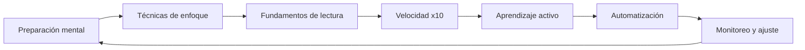
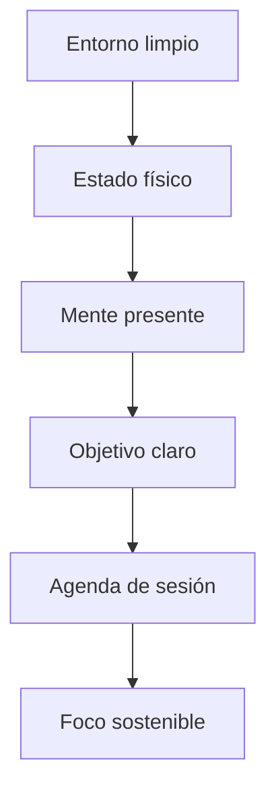
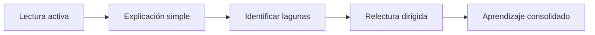

## Qué vas a aprender

En esta guía desarrollarás un sistema completo para concentrarte y leer más rápido sin perder comprensión:

- Técnicas para eliminar distracciones y generar un estado de atención sostenida.
- Métodos progresivos para aumentar tu velocidad sin sacrificar comprensión.
- Rutinas sencillas que entrenan tu mente para leer en bloques y no palabra por palabra.
- Cómo aprender activamente mientras lees, memorizar más y olvidar menos.
- Herramientas y métricas para medir tu progreso semana a semana.


# Guía Definitiva: Concentración y Lectura x10

> 💡 **En esta guía aprenderás**: Cómo mantener el foco por sesiones largas, aplicar técnicas de lectura veloz con comprensión, y aprender activamente mientras lees textos técnicos.

---

## Introducción: ¿Por qué esta guía es diferente?

La mayoría de guías de productividad entregan trucos aislados. Esta guía propone un sistema integrado basado en neurociencia, psicología cognitiva y práctica deliberada. El objetivo no es correr más, sino entender cómo funciona tu atención y cómo entrenarla.

> **La clave**: Un cerebro bien preparado puede leer diez veces más rápido y recordar diez veces mejor.

---

## Mapa del sistema



---

## Parte 1: Preparación mental — el estado atencional

### 1.1 El cerebro no está diseñado para la concentración

Tu mente está diseñada para detectar cambios. Para concentrarte debes preparar el entorno, el cuerpo y la intención antes de abrir un documento.



### 1.2 Checklist previa a leer

| Elemento | Acción | Tiempo |
|----------|--------|--------|
| Entorno | Silencia notificaciones y elimina distracciones visuales | 2 min |
| Físico | Hidratación, postura vertical, luz directa | 3 min |
| Mental | Respiración consciente de 5 minutos | 5 min |
| Objetivo | Define lo que debes extraer del texto | 1 min |
| Agenda | Bloque de 25 a 60 minutos sin interrupciones | 1 min |

### 1.3 Activación sensorial simple

La técnica 5-4-3-2-1 reduce la carga cognitiva de atención:

```
5 cosas que ves
4 que puedes tocar
3 que escuchas
2 que hueles
1 que saboreas
```

> **📌 Idea clave** — Estar presente no es abstracto; es una preparación concreta que reduce la fatiga al principio de la sesión.

---

## Parte 2: Técnicas de enfoque — sostener la atención

### 2.1 Pomodoro adaptado a lectura técnica

No todas las sesiones son iguales. La duración depende de la dificultad del texto.

| Técnica | Duración | Descanso | Uso recomendado |
|---------|----------|----------|-----------------|
| Foco intenso | 25 minutos | 5 minutos | Lectura ligera |
| Deep work | 45 a 60 minutos | 15 minutos | Textos técnicos densos |
| Flow state | 90 minutos | 30 minutos | Práctica avanzada |

### 2.2 Anclaje de atención

Cada vez que tu mente divague, vuelve suavemente a una palabra ancla.

```python
def attention_anchor(anchor_word="ancla"):
    """Vuelve al punto de foco sin culpa."""
    return f"Regresa a {anchor_word} y continúa."
```

No pelees con el pensamiento intrusivo; redirígelo con suavidad.

### 2.3 Señales de pérdida de foco

| Señal | Acción correctiva |
|-------|-------------------|
| Relectura automática | Usa ruler, finger o pointer guide |
| Pensamientos intrusivos | Ancla + regresa al texto sin culpa |
| Fatiga visual | Descanso de 20 segundos con ojos cerrados |
| Dificultad para entender | Divide el párrafo en oraciones aisladas |

---

## Parte 3: Fundamentos de lectura — sistema visual

### 3.1 La física de la lectura

Tu ojo no lee palabra por palabra. Realiza registros saccádicos. La técnica x10 imita este movimiento natural.

| Registro | Tamaño caracteres | Palabras aprox. |
|----------|------------------|----------------|
| Saccádico corto | 7 a 10 | 1 a 2 |
| Saccádico medio | 15 a 20 | 3 a 4 |
| Saccádico amplio | 30 a 40 | 6 a 8 |

### 3.2 Código base: Técnica Pointer

```python
class PointerTechnique:
    def __init__(self, words_per_gaze=4):
        self.gaze_width = words_per_gaze
        self.speed = 200  # ppm objetivo inicial
    
    def practice_session(self, text, duration_minutes=10):
        # Guía visual con dedo, ruler o puntero digital
        # Evita relectura y reduce subvocalización
        pass
```

> **📌 Idea clave** — La velocidad no se gana con esfuerzo, se optimiza eliminando movimientos innecesarios.

---

## Parte 4: Velocidad x10 — métodos progresivos

### 4.1 Método incremental

Aumentar la velocidad sin estrategia genera caos. Hazlo en niveles.

| Nivel | Técnica | Velocidad objetivo |
|-------|---------|-------------------|
| 1 | Subrayado activo | Baseline inicial |
| 2 | Pointer + sin regresión | +20% |
| 3 | Mini-span: bloques de 3 a 4 palabras | +50% |
| 4 | Chunking visual de párrafos | +100% |
| 5 | Skimming + scanning selectivo | +200% |
| 6 | Preview + metalectura previa | +500% |
| 7 | Lectura x10 combinada | +1000% |

### 4.2 Tabla de técnicas x10

| Técnica | Mecánica | Cuándo usar |
|---------|----------|-------------|
| Preview | Tres pasadas previas: portada, índices, summary | Textos técnicos largos |
| Metalectura | Preguntas antes de leer | Material complejo |
| Skimming | Lectura diagonal de encabezados | Búsqueda rápida |
| Chunking | Bloques de 5 a 7 palabras visuales | Texto denso |
| Visual span | Ampliar registros oculares | Practica diaria |

### 4.3 Ejercicio práctico de chunking

```text
Texto original:
"La neuroplasticidad es la capacidad del cerebro para modificar su estructura y función en respuesta a la experiencia."

Chunking:
"La neuroplasticidad | es la capacidad | del cerebro para | modificar su estructura | y función en respuesta | a la experiencia."
```

Cada bloque debe ser una imagen mental, no una palabra aislada.

> **📌 Idea clave** — Deja de procesar palabras. Empieza a procesar bloques.

---

## Parte 5: Aprendizaje activo — leer para recordar

### 5.1 Técnica Feynman en 3 pasos



Primero lees, luego explicas en voz alta como si fueras profesor, luego completas huecos, luego repasas solo lo necesario.

### 5.2 Tabla de interacción lectura-ejercicio

| Momento | Acción | Herramienta |
|---------|--------|-------------|
| 1 | Preguntas previas | Hoja de mapa mental |
| 2 | Lectura activa | Subrayado con propósito |
| 3 | Parada cada 10 min | Ejercicio de recall |
| 4 | Conexión conceptos | Analogías personales |
| 5 | Resumen final | Explicación en voz alta |

### 5.3 Micro-práctica durante lectura

```python
def micro_practice(text_block, questions):
    """
    Cada bloque de texto:
    1. Lee la pregunta
    2. Busca la respuesta en el bloque
    3. Resume en 1 oración
    4. Conecta con conocimiento previo
    """
    return "Respuesta + conexión + acción"
```

> **📌 Idea clave** — La lectura solo consolida cuando la pruebas, no cuando la repites.

---

## Parte 6: Automatización — rutinas que funcionan

### 6.1 Rutina matutina de foco

```
5:30 - Despertar + agua
5:35 - Respiración 4-7-8 (3 ciclos)
5:40 - Revisar objetivos del día
5:45 - Lectura técnica bloque 1
6:00 - Ejercicio de recall
6:05 - Descanso activo
```

### 6.2 Rutina pre-lectura en 5 pasos

| Paso | Acción | Duración |
|------|--------|----------|
| 1 | Hidratación consciente | 30 segundos |
| 2 | Postura óptima | 30 segundos |
| 3 | Ancla atencional | 1 minuto |
| 4 | Preview del texto | 2 minutos |
| 5 | Intención de aprendizaje | 30 segundos |

### 6.3 Checklist de hábitos

| Hábito | Frecuencia | Medición |
|--------|------------|----------|
| Sesión sin distracciones | Diaria | Tiempo bloqueado |
| Practica técnica lectura | Diaria | ppm logrados |
| Recall post-lectura | Cada sesión | Calidad de respuesta |
| Revisión de notas | Semanal | Conexiones nuevas |
| Ajuste de rutina | Mensual | % de mejora |

> **📌 Idea clave** — La automatización no elimina la intención, la prepara para cuando más la necesitas.

---

## Parte 7: Monitoreo y ajuste — bucle de mejora

### 7.1 Métricas de progreso

| Métrica | Fórmula | Meta |
|---------|---------|------|
| PPM efectivo | Palabras leídas / tiempo | +10% semanal |
| Comprensión % | Conceptos recordados / total | > 80% |
| Retención 24 h | Recordado 24 h después | > 70% |
| Fatiga visual | Escala 1 a 10 | < 4 promedio |

### 7.2 Señales de alerta

| Señal | Acción |
|-------|--------|
| PPM baja + fatiga alta | Descanso + ajuste de técnica |
| Comprensión < 70% | Menos ppm, más interactividad |
| Retención < 50% | Más ejercicios de recall |
| Postura deteriorada | Recordatorio cada 20 min |

### 7.3 Prueba de diagnóstico semanal

```python
def weekly_check():
    return {
        "ppm_baseline": measure_reading_speed(),
        "comprehension": quick_quiz(),
        "retention": recall_test(),
        "energy": fatigue_scale(),
        "adjustment_needed": ppm_improvement_rate() < 0.1
    }
```

---

## Parte 8: I Do / We Do / You Do

### 8.1 I Do — Lectura guiada con Pointer

Objetivo: usar guía visual sin regresión.

| Paso | Acción | Resultado |
|------|--------|-----------|
| 1 | Usar ruler o finger | Guía visible |
| 2 | Evitar relectura | Contar veces que regresas |
| 3 | Mantener 200 ppm | Cronómetro |
| 4 | Recall inmediato | 3 conceptos clave |

### 8.2 We Do — Preguntas activas

Ejercicio colaborativo: mientras lees un texto técnico, formula preguntas.

| Tipo de pregunta | Ejemplo |
|------------------|---------|
| ¿Qué problema resuelve? | ¿Qué falla resuelve este patrón? |
| ¿Cómo funciona? | ¿Cuál es el flujo de datos? |
| ¿Por qué importa? | ¿Qué consecuencia práctica tiene? |
| ¿Qué falta? | ¿Qué caso límite no considera? |

### 8.3 You Do — Rutina personalizada de 7 días

Tarea: diseña tu rutina personalizada.

| Día | Técnica | Objetivo |
|-----|---------|----------|
| 1 | Baseline + preview | Medir punto de inicio |
| 2 | Pointer + recall | +20% velocidad |
| 3 | Chunking + ejemplos | +50% comprensión |
| 4 | Skimming + objetivos | +30% eficiencia |
| 5 | Lectura x10 parcial | +50% velocidad |
| 6 | Full x10 + Feynman | +100% aprendizaje |
| 7 | Monitoreo + ajuste | Consolidar rutina |

> **📌 Idea clave** — Siete días intensivos generan más hábito que meses de esfuerzo inconsistente.

---

## Parte 9: Herramientas y recursos

### 9.1 Herramientas digitales

| Herramienta | Uso | Plataforma |
|-------------|-----|------------|
| Spreeder | Entrenamiento visual | Web |
| Acceleread | Técnicas guiadas | iOS |
| BeeLine Reader | Mejora del tracking | Extensión |
| Readlang | Lectura + vocabulario | Web |
| Anki | Recall espaciado | Multiplataforma |

### 9.2 Configuración visual ideal

```css
.article-content {
  font-size: 18px;
  line-height: 1.75;
  max-width: 65ch;
}
```

---

## Checklist final

| Bloque | Confirmación |
|--------|--------------|
| Preparación | Checklist previa completada |
| Técnica | Pointer dominada sin regresión |
| Velocidad | +50% sin perder comprensión |
| Aprendizaje | Ejercicios de recall activos |
| Rutina | Automatizada y registrada |
| Monitoreo | Métricas semanales seguidas |
| Ajuste | Mejora continua basada en datos |

---

## Preguntas de verificación

1. Si tu velocidad actual es 200 ppm, ¿qué técnica aplicas primero para llegar a 400?
2. ¿Cómo afecta la subvocalización a la velocidad? Propón un método para reducirla.
3. Diseña una rutina de 30 minutos para estudiar un manual técnico.
4. ¿Qué es más importante, velocidad o retención? Justifica.
5. ¿Cómo combinas anclaje atencional y lectura x10?

---

## Glosario rápido

| Término | Definición |
|---------|------------|
| PPM | Palabras por minuto leídas |
| Saccádico | Registro ocular de un movimiento |
| Subvocalización | Pronunciar mentalmente cada palabra |
| Chunking | Agrupar palabras en bloques visuales |
| Preview | Lectura previa para mapear contenido |
| Recall | Recuperar información sin mirar el texto |
| Ancla | Punto de retorno cuando la mente divaga |
| Metalectura | Preguntas antes de leer para preparar la mente |