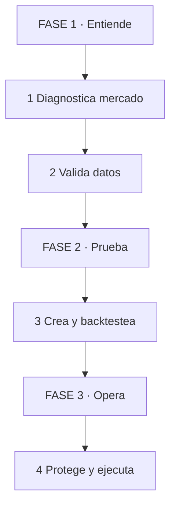
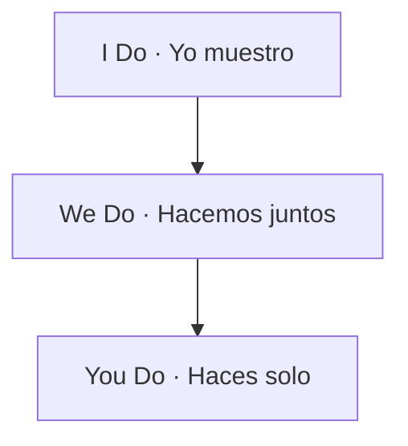
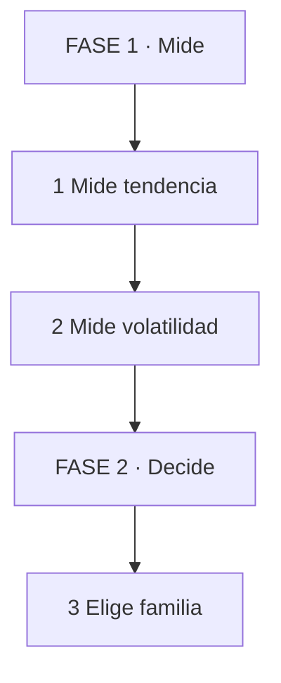
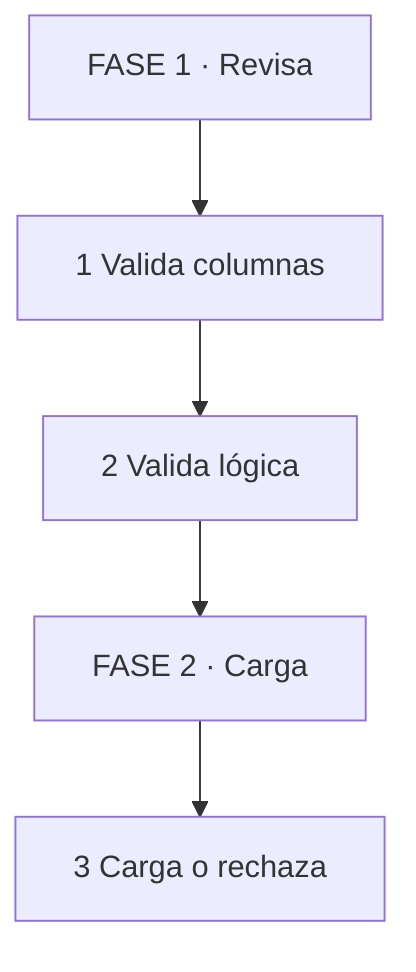
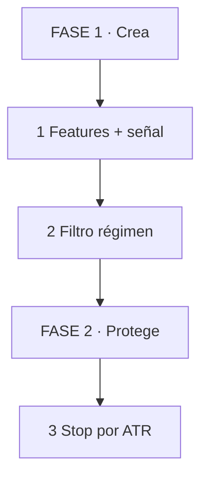
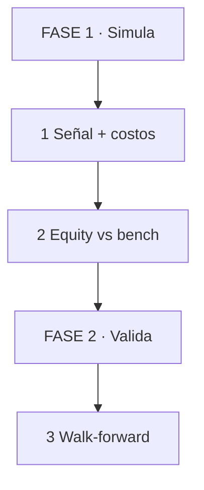
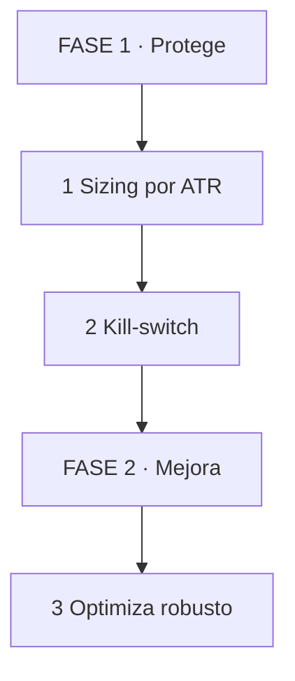
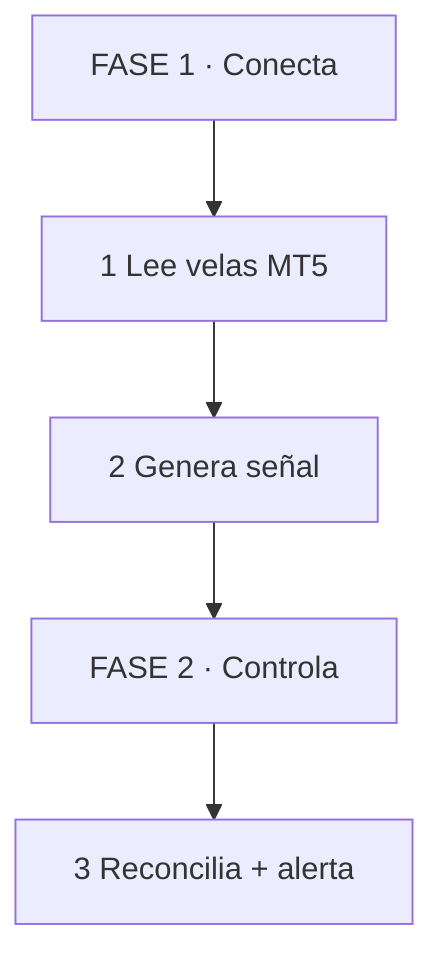

# Guía Masterclass Progresiva: Tu Fábrica de Estrategias Algorítmicas

No necesitas aprender todo el trading cuantitativo hoy.

Necesitas un sistema para avanzar de a poco sin autoengañarte.

Esta guía toma el workflow completo de `skill.md` y lo convierte en escalera.

> **Objetivo de Aprendizaje** — Al terminar, sabrás diagnosticar un mercado, validar datos, armar una estrategia simple, backtestearla con costos, aplicar riesgo y llevarla a MT5 en modo paper.

> **Advertencia educativa** — Contenido formativo. Nada aquí es recomendación financiera. Opera siempre con gestión de riesgo y validación.

## Cómo usar esta guía (léeme 2 minutos)

Analogía en 1 línea: es como aprender a cocinar por recetas cortas, no leyendo todo el libro el día 1.

| Paso | Tú ves | Qué pasa dentro | Ejemplo |
|------|--------|-----------------|---------|
| 1 Pide | Lees 1 PARTE por día | Carga cognitiva baja | Hoy solo PARTE 1 |
| 2 Trabaja | Haces el micro-ejercicio | Evocación activa | Respondes sin releer |
| 3 Valida | Revisas Idea clave | Cierre de memoria | ¿Puedes explicarlo? |
| 4 Repite | Vuelves en 2 días | Repetición espaciada | Quiz de 5 min |



*Cómo leerlo: empiezas arriba en FASE 1, bajas hasta FASE 3. No vuelves al inicio.*

| Fase | Qué logras | Habilidad |
|------|------------|-----------|
| **FASE 1 · Entiende** | Leer régimen y desconfiar del dato sucio | Diagnosticar sin autoengaño |
| **FASE 2 · Prueba** | Convertir idea en backtest con costos | Validar estrategias |
| **FASE 3 · Opera** | Optimizar poco, proteger mucho, ejecutar en MT5 | Operar con control |



*Cómo leerlo: de arriba hacia abajo, sueltas apoyo progresivamente.*

### Tu escalera de 5 niveles

No saltes niveles.

| Nivel | Meta | Tiempo | Sales cuando... |
|-------|------|--------|-----------------|
| 1 Superviviente | Entiendes régimen y costos | 4 horas | Clasificas 3 activos sin mirar solución |
| 2 Validador | Detectas datos rotos | 4 horas | Tu validator rechaza CSV sucio |
| 3 Constructor | Armas 1 estrategia SMA + filtro | 6 horas | Tu backtest incluye comisión + slippage |
| 4 Guardián | Aplicas riesgo antes de optimizar | 4 horas | Rechazas un Sharpe 3.0 por overfitting |
| 5 Operador | Corres paper en MT5 con kill-switch | 2 horas | Explicas tu sistema en 1 minuto (Feynman) |

> **📌 Idea clave** — Modela 1 vez, practica contigo 1 vez, suéltate siempre. Enseñar es soltar progresivamente.

---

## PARTE 1: Diagnostica antes de operar

Analogía en 1 línea: oficina médica + triaje antes de recetar; primero mides fiebre, no operas.

Una estrategia vive dentro de un clima.

Tendencia suave premia momentum.

Rango lateral premia reversión.

Volatilidad extrema castiga a todos.

El error novato es buscar la señal perfecta.

El hábito pro es preguntar: ¿en qué clima estoy?

| Paso | Tú ves | Qué pasa dentro | Ejemplo |
|------|--------|-----------------|---------|
| 1 Clima | ¿Tendencia o rango? | SMA corta vs larga | EURUSD H1 plano = rango |
| 2 Fiebre | ¿Cuánto se mueve? | Volatilidad anualizada | 12% = calmo, 40% = fiebre |
| 3 Costo | ¿Me deja ganar? | Spread vs edge | Spread > edge = descarta |
| 4 Veredicto | ¿Qué familia pruebo? | Regla régimen → familia | Rango = mean-reversion |



*Cómo leerlo: mides arriba, decides abajo en solo 3 pasos.*

```python
# Mínimo viable: ¿tendencia o no?
short = df['close'].rolling(20).mean()
long = df['close'].rolling(100).mean()
trend_score = (short - long) / long
print(trend_score.iloc[-1])  # >0.03 tendencia, ~0 rango
```

**Mejor práctica:** nunca propongas estrategia sin escribir régimen en 1 línea. Ej: `EURUSD H1: rango, vol media, spread 1.2 pips → candidato mean-reversion`.

> **📌 Idea clave** — Sin diagnóstico, toda estrategia es lotería con código.

**Recall 30 segundos:** cierra los ojos. ¿Qué 3 cosas mide un diagnóstico? Sin releer.

---

## PARTE 2: Datos que no mienten

Analogía en 1 línea: balanza de cocina calibrada; si pesa mal, toda receta falla.

Si el dato está roto, el backtest miente.

Duplicados inflan ganancias.

Precios cero crean retornos infinitos.

High < Low es físicamente imposible.

Antes de alpha, responde 4 preguntas.

| Paso | Tú ves | Qué pasa dentro | Ejemplo |
|------|--------|-----------------|---------|
| 1 Completos | ¿Faltan columnas? | Chequea OHLCV | Sin `volume` = rechaza |
| 2 Lógicos | ¿Precios posibles? | High>=Low, >0 | High 1.08, Low 1.09 = error |
| 3 Ordenados | ¿Sin duplicados? | Índice único y sort | 2 velas 10:00 = error |
| 4 Finitos | ¿Retornos reales? | pct_change no inf | Precio 0 = retorno inf |



*Cómo leerlo: revisas arriba, solo cargas abajo si pasa todo.*

```python
# Detalle completo en skill.md PARTE 2
assert (df['high'] >= df['low']).all(), "vela imposible"
assert not df.index.has_duplicates, "duplicados"
```

Estructura mínima recomendada:

```text
data/raw/ data/processed/
src/data_loader.py src/diagnostics.py
tests/test_data_quality.py
```

**Mejor práctica:** regla de oro poco a poco. Semana 1: solo implementa 3 checks. Semana 2: agrega gaps y calendario. No intentes el pipeline perfecto día 1.

> **📌 Idea clave** — Dato sucio = equity falsa. Valida primero, sueña después.

**Recall:** ¿qué síntoma da un duplicado en el backtest?

---

## PARTE 3: De hipótesis a estrategia

Analogía en 1 línea: línea de ensamblaje, no caja de herramientas sueltas.

Hipótesis → Features → Señal → Filtro → Sizing.

La factory te deja probar 50 variaciones sin reescribir todo.

Cambias ventanas, no código.

| Paso | Tú ves | Qué pasa dentro | Ejemplo |
|------|--------|-----------------|---------|
| 1 Transforma | Precio → indicador | SMA, RSI, ATR | SMA 10 vs 50 |
| 2 Decide | Long / Short / Flat | Cruce + filtro | Cruce alcista + vol baja = long |
| 3 Protege | Dónde salgo si fallo | Stop por ATR | Entrada - 2*ATR |
| 4 Mide | ¿Vale la pena? | Backtest + métricas | Sharpe, drawdown |



*Cómo leerlo: creas arriba, proteges abajo. Sin stop no hay estrategia.*

```python
# Idea completa en skill.md PARTE 3
# Aquí solo el corazón:
signal = 1 if sma_short > sma_long else -1
if atr_ratio > 1.5: signal = 0  # filtro: no operes caos
```

Elige familia por régimen:

| Familia | Mejor clima | Peligro |
|---------|-------------|---------|
| Trend | Tendencia suave | Serruchos en rango |
| Mean-reversion | Rango estable | Ruptura violenta |
| Breakout | Vol creciendo | Falsa ruptura |

**Mejores prácticas para no ahogarte:**

1. Una sola familia por semana. Empieza con cruce de medias.
2. Máximo 3 parámetros al inicio. Más = overfitting.
3. Usa prompt AI como asistente, no como oráculo. Ver `skill.md 3.5`.

> **📌 Idea clave** — Buena factory = muchas ideas probadas rápido, pocas aprobadas lento.

**Recall:** si ves `volatile_range`, ¿qué familia evitas y por qué?

---

## PARTE 4: Backtest sin autoengaño

Analogía en 1 línea: simulacro de vuelo con turbulencia incluida, no en cielo perfecto.

El backtest perfecto no existe.

Es una simulación con supuestos.

Si ignoras costos, el resultado es optimista.

Si usas futuro en la señal, es fraude involuntario.

| Paso | Tú ves | Qué pasa dentro | Ejemplo |
|------|--------|-----------------|---------|
| 1 Retrasa | Señal de ayer opera hoy | `shift(1)` | Sin shift = look-ahead |
| 2 Resta | Comisión + slippage | turnover * costo | 0.0005 + 0.0002 realista |
| 3 Separa | Train vs Test | Walk-forward | Optimizas en 1, validas en otro |
| 4 Compara | ¿Mejor que nada? | vs benchmark | Si no gana a buy-hold, duda |



*Cómo leerlo: simulas arriba con costos, validas abajo fuera de muestra.*

```python
# Código completo en skill.md PARTE 4
df['position'] = df['signal'].shift(1)  # clave anti-trampa
costs = df['position'].diff().abs() * (0.0005 + 0.0002)
```

Métricas mínimas (no solo CAGR):

Sharpe, Max Drawdown, Profit Factor, Trade Count.

Señal de overfitting: Sharpe 2.4 con 18 trades en 5 años = suerte, no edge.

**Mejor práctica progresiva:**

1. Corre 3 escenarios: ingenuo (0 costo), realista, conservador. Ver `10.4`.
2. Regla: <30 trades = muestra insuficiente, no optimices.
3. Interleaving: concepto → ejemplo bueno → contra-ejemplo malo. Nunca 3 teorías seguidas.

> **📌 Idea clave** — Costos y walk-forward destruyen edges falsos antes que el mercado destruya tu cuenta.

**Recall:** ¿por qué `shift(1)` evita look-ahead bias?

---

## PARTE 5: Riesgo primero, optimización después

Analogía en 1 línea: cinturón + frenos antes de tunear el motor.

Optimizar sin riesgo crea monstruos rentables.

Mejora Sharpe pero concentra ruina en un evento raro.

Por eso riesgo va antes.

| Paso | Tú ves | Qué pasa dentro | Ejemplo |
|------|--------|-----------------|---------|
| 1 Limita | ¿Cuánto pierdo si fallo? | 0.5% por trade | 100k * 0.005 = $500 |
| 2 Frena | ¿Cuándo paro todo? | Kill-switch | DD diario 3% = off |
| 3 Estresa | ¿Aguanta shock? | Vol 2x, spread 3x | Si no, reduce size |
| 4 Optimiza | Busca zona robusta | Genético + heatmap | Meseta ancha, no isla |



*Cómo leerlo: proteges arriba, recién optimizas abajo.*

```python
risk_amount = equity * 0.01
units = risk_amount / abs(entry - stop)  # simple y sobrevive
```

Reglas por defecto:

Riesgo 0.25-1% por trade. DD estrategia 10-20% = revisión obligatoria. Correlación <0.70.

En optimización genética busca mesetas, no picos. Isla pequeña con Sharpe alto = overfitting. Meseta amplia = robusto.

**Mejor práctica:** fitness nunca solo CAGR. Usa 30% Sharpe OOS + 25% drawdown + resto. Ver `skill.md 6.2`. Y early stopping: si 5 generaciones no mejoran OOS, para.

> **📌 Idea clave** — Optimizar sin riesgo es fabricar curvas bonitas para perder dinero real.

**Recall:** ¿qué heatmap prefieres: isla o meseta? ¿Por qué?

---

## PARTE 6: MT5 + Producción controlada

Analogía en 1 línea: piloto automático + copiloto que puede apagarlo.

MT5 es tu terminal de ejecución.

Python piensa, MT5 ejecuta.

Nunca pases de notebook a real directo.

| Paso | Tú ves | Qué pasa dentro | Ejemplo |
|------|--------|-----------------|---------|
| 1 Conecta | Python → MT5 | `initialize + login` | Demo primero, nunca real |
| 2 Concilia | ¿Lo que pienso = real? | Local vs positions | Señal flat pero posición abierta = alerta |
| 3 Simula | Paper 2-4 semanas | Sin `order_send` real | Loguea, no envíes |
| 4 Monitorea | ¿Se degradó? | Sharpe rolling, fills | Sharpe -50% = reduce tamaño |



*Cómo leerlo: conectas y generas arriba, controlas abajo siempre.*

```python
# Adapter completo en skill.md PARTE 8
adapter.connect()  # demo
bars = adapter.rates('EURUSD', mt5.TIMEFRAME_H1, 500)
# En paper: comenta send_order, solo print(signal)
```

Roadmap: prototipo → modular → tests → paper → live pequeño 4-8 sem → escalar o retirar.

Runbook mínimo: si `retcode != DONE`, lee filling mode, ajusta, registra, actualiza test.

**Mejores prácticas operativas:**

1. Kill-switch externo siempre. Si no hay datos 5 min, apaga.
2. Dashboard mínimo: equity, posiciones, rechazos, latencia, última vela, drawdown.
3. Post-mortem al retirar: ¿régimen cambió o edge murió?

> **📌 Idea clave** — En producción no gana el más inteligente, gana el mejor monitoreado.

**Recall:** nombra 2 alertas que apagarían tu sistema hoy.

---

## Tu plan de 20 horas (Pareto 80/20)

No necesitas 200 horas. Necesitas 20 bien puestas.

| Bloque | Horas | Haces |
|--------|-------|-------|
| Diagnóstico | 4 | Clasificas 5 activos, eliges familia |
| Datos | 4 | Validator de 4 checks pasa/falla |
| Estrategia + Backtest | 6 | 1 SMA + costos + métricas |
| Riesgo + Optimización | 4 | Sizing + 1 heatmap leído |
| MT5 paper | 2 | Conectas demo, logueas sin operar |

Cada bloque de 2h: 1h45 práctica + 15 min mini-revisión escrita. Sin revisión no cuenta.

Prompts listos para copiar (variables `[tema]`):

* Miniguía 1 página: `Resume [cruce de medias] en 1 página con viñetas y ejemplo para repasar en 5 min.`
* Quiz: `Ya estudié [walk-forward]. Hazme 10 preguntas cada vez más difíciles y corrígeme.`
* Feynman: `Explica [drawdown] simple como a un niño y pregúntame para detectar huecos.`

## I Do / We Do / You Do — Práctica guiada

**I Do — Yo muestro (5 min):** diagnostico EURUSD H1 → `trend 0.002, vol media` → elijo mean-reversion. Tú solo miras.

**We Do — Hacemos juntos:** te doy plantilla con hueco: `z = (close - mean)/___`. Tú completas `std` y explicas por qué `z<-2` es entrada.

**You Do — Haces solo con red:** arma factory de 1 familia con sizing ATR + checklist. Auto-corrección abajo: si tu Sharpe >3 con <30 trades → rechaza, es overfitting.

| Nivel | Debes poder hacer |
|-------|-------------------|
| I Do | Seguir diagnóstico + backtest con costos sin perderte |
| We Do | Ajustar un parámetro y explicar el porqué |
| You Do | Entregar factory + monitoreo mínimo que otro pueda correr |

## Checklist final

| Bloque | Check |
|--------|-------|
| Datos | Validado, sin duplicados, ordenado |
| Diagnóstico | Régimen escrito en 1 línea |
| Estrategia | Hipótesis + filtro + stop claros |
| Backtest | Con costos, shift(1), walk-forward |
| Riesgo | Sizing ≤1%, kill-switch definido |
| Optimización | Meseta robusta, no isla |
| MT5 | Demo, reconciliación, logs |
| Producción | Paper 2+ semanas, runbook, alertas |
| Retiro | Criterio de pausa escrito |

---

## Preguntas de Verificación

1. **Aplica:** régimen `volatile_range`, vol 40%. ¿Qué familia eliges y por qué? ¿Qué tamaño usas?
2. **Analiza:** ¿cómo mata el slippage a una estrategia intradía de alta frecuencia? Propón estimación percentil 95.
3. **Diseña:** breakout para activo líquido. Define features, filtro horario y niveles ATR en 4 líneas.
4. **Reflexiona:** ¿más peligroso overfitting o underfitting al inicio? Justifica.
5. **Calcula:** 100 trades, PF 1.5, win 45%. Si win cae a 40% con mismo payoff, ¿PF sigue >1? Muestra cálculo.
6. **Evalúa:** ¿qué pasa si optimizas en toda la muestra sin separar test?
7. **Conecta:** ¿qué pasa si optimizas genético sin pasar por riesgo primero?
8. **Propón:** diseña 3 alertas de degradación con umbral numérico.
9. **Síntesis:** toma tu última idea y pásala por FASE 1→3. ¿Dónde se rompe?
10. **Feynman:** explica drawdown a un niño en 1 línea.

---

## Glosario

| Término | Definición en 1 línea |
|---------|-----------------------|
| **Alpha** | Ganancia extra real después de restar costos |
| **OHLCV** | Velas con apertura, máximo, mínimo, cierre y volumen |
| **Régimen** | Clima del mercado: tendencia, rango o caos |
| **Sharpe** | Cuánto ganas por cada unidad de susto (volatilidad) |
| **Drawdown** | Caída desde tu pico más alto hasta el valle |
| **Backtest** | Probar tu idea en el pasado con costos incluidos |
| **Look-ahead bias** | Hacer trampa viendo el futuro sin querer |
| **Overfitting** | Memorizar ruido pasado creyendo que es patrón |
| **Walk-forward** | Entrenar en un pedazo y probar en el siguiente, avanzando |
| **Strategy Factory** | Molde para crear muchas estrategias sin reescribir |
| **ATR** | Cuánto se mueve en promedio para poner stops |
| **Position sizing** | Cuánto apuestas por trade según tu riesgo |
| **Slippage** | Lo que pierdes entre precio esperado y real |
| **MT5 Adapter** | Cable que conecta tu Python con el broker |
| **Kill-switch** | Botón que apaga todo si algo sale mal |
| **Paper trading** | Practicar con dinero falso antes del real |

---

## Anexo: mejores prácticas de formato aplicadas aquí

Esta guía aplica lo que pide `skill.md` ANEXO:

* `max-width: 65ch`, `font-size: 18px`, `line-height: 1.75` para lectura larga.
* Secciones 200-400 palabras, párrafos cortos, tablas ≤4 filas, diagramas TD ≤4 pasos.
* Patrón Concepto → Analogía → Tabla → Micro-diagrama → Idea clave en cada PARTE.
* Código completo queda en `skill.md`; aquí solo mínimos viables para no saturar.
* Glosario 16 términos, 1 por concepto clave, después de preguntas.

```css
.article-content {
  max-width: 65ch;
  font-size: 18px;
  line-height: 1.75;
}
```
