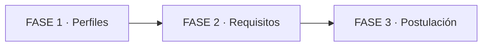

# 🛢️ Cómo entrar a YPF, Pampa o Vista en sistemas

> Perfil claro + evidencia + canal oficial: así se entra.

## 🗺️ Mapa de 3 FASES

*Se lee de izquierda a derecha. 3 fases en orden fácil → difícil.*



*Se lee de izquierda a derecha: primero entendés perfiles, luego reunís requisitos, luego postulás.*

**Niveles:** FASE 1 es Nivel 1/5, FASE 2 es Nivel 3/5, FASE 3 es Nivel 5/5.

## 📚 Pre-training: 7 palabras antes de empezar

- 🔹 **upstream:** exploración y producción de petróleo y gas, como la fábrica del negocio.
- 🔹 **SAP:** sistema de gestión empresarial, como el cerebro administrativo.
- 🔹 **inglés B2:** inglés intermedio independiente, como manejarte solo en una reunión.
- 🔹 **perfil IT:** conjunto de puesto + skills + experiencia, como tu ficha de jugador.
- 🔹 **canal oficial:** portal o LinkedIn verificado de la empresa, como la ventanilla real.
- 🔹 **screening:** primer filtro de CV por RRHH, como el control de entrada.
- 🔹 **evidencia:** prueba concreta de tu experiencia, como fotos de obra terminada.

> ⚠️ YPF advierte de ofertas falsas por WhatsApp. Solo valen canales oficiales.

---

## 🧩 PARTE 1: Perfiles IT que contratan (Nivel 1/5)

1. ❓ PRETEST — ¿Qué 3 áreas IT aparecen más en avisos de estas energéticas?
    > Respuesta esperada: datos, infraestructura/cloud y ciberseguridad o SAP. Cualquiera de esas vale.
    > Si acertás: camino rápido → andá al punto 7.

2. 🎯 POR QUÉ + LOGRO — Importa porque el perfil equivocado es el rechazo más común. Vas a elegir 1 perfil entre 3 rutas.

3. ⚡ VICTORIA RÁPIDA (<5 min) — Escribí tu perfil en 1 línea: puesto + años + tecnología. 🎉

4. 💡 CONCEPTO — Analogía: el perfil IT es tu ficha de jugador: posición y nivel. Definición: suelen buscar infra, datos y SAP/seguridad, cada uno con su stack.

Rutas frecuentes en avisos:

- 🔹 Infraestructura y cloud: redes, soporte, operaciones, nube.
- 🔹 Datos y reporting: tableros, SQL, automatización de reportes.
- 🔹 SAP y seguridad: usuario clave SAP, accesos, ciberseguridad.

5. 👀 EJEMPLO RESUELTO — I Do: técnico con 2 años en soporte. Caso: Soporte IT.
    > Pasos: 1 Listo lo que tengo. 2 Comparo con 1 aviso oficial. 3 Elijo la ruta con más coincidencias.

    | Paso | Qué hago | Resultado |
    |------|----------|-----------|
    | 1 | Invento nada, listo real | 2 años soporte |
    | 2 | Leo 1 aviso oficial | piden redes + inglés |
    | 3 | Elijo ruta | infraestructura |

    ```mermaid
    flowchart TD
        A["lo que tengo"] --> B["1 aviso oficial"] --> C["1 ruta elegida"]
    ```

    *Se lee de arriba hacia abajo. 3 pasos para elegir perfil.*

6. ⚠️ CONTRA-EJEMPLO / ERROR TÍPICO — Mismo CV genérico para todo → Corrección: 1 perfil, 1 CV con palabras del aviso. 📄

7. 🧪 PRÁCTICA — We Do: 3 coincidencias con un aviso. You Do: repetí con otro aviso.
    > Respuesta esperada / criterio: 3 coincidencias escritas + 1 ruta elegida con nombre. ✅

8. 🔁 RECALL — Sin mirar: ¿cuáles son las 3 rutas y por qué una sola? (Nivel Bloom: comprender)
    > Respuesta: infra/cloud, datos/reporting, SAP/seguridad; una sola para enfocar evidencia.

9. 📌 IDEA CLAVE — 📌 Un perfil enfocado entra; diez difusos rebotan.

10. ✅ AUTO-CHEQUEO + SIGUIENTE — [ ] 1 ruta. [ ] 3 coincidencias. [ ] Línea de perfil. Siguiente: requisitos. ➡️

---

## 🏗️ PARTE 2: Requisitos y evidencia (Nivel 3/5)

1. ❓ PRETEST — ¿Qué patrón se repite en avisos IT: título, experiencia e idioma?
    > Respuesta esperada: título en Sistemas/Software o afín, ~2 años de experiencia e inglés intermedio.
    > Si acertás: camino rápido → andá al punto 7.

2. 🎯 POR QUÉ + LOGRO — Importa porque el screening filtra en segundos. Vas a armar tu tabla de brechas.

3. ⚡ VICTORIA RÁPIDA (<5 min) — Anotá tu inglés real y 1 certificado. 🚀

4. 💡 CONCEPTO — Analogía: la evidencia es la foto de la obra. Definición: cada requisito pide prueba: título, años con logros, inglés B2 y 2 skills con ejemplos. Vuelve tu ruta de PARTE 1.

Patrón frecuente en avisos (verificar en cada aviso):

- 🔹 Formación: título en Sistemas/Software o carrera afín.
- 🔹 Experiencia: ~2 años en la posición o similar, con logros.
- 🔹 Idioma y skills: inglés B2 más 2 skills de tu ruta.

5. 👀 EJEMPLO RESUELTO — I Do: analista reporting. Caso: SQL + tableros + B2.
    > Pasos: 1 Copio requisitos. 2 Marco tengo/falta. 3 Defino evidencia de 30 días.

    | Paso | Qué hago | Resultado |
    |------|----------|-----------|
    | 1 | Copio 3 requisitos | SQL, tablero, B2 |
    | 2 | Marco brecha | me falta B2 |
    | 3 | Plan 30 días | curso + tablero demo |

    ```mermaid
    flowchart TD
        A["3 requisitos"] --> B["tengo o falta"] --> C["plan 30 días"]
    ```

    *Se lee de arriba hacia abajo. 3 pasos para cerrar brechas.*

6. ⚠️ CONTRA-EJEMPLO / ERROR TÍPICO — Poner "avanzado" sin prueba → Corrección: nivel real + certificado. 🗣️

7. 🧪 PRÁCTICA — We Do: 1 skill con logro medido. You Do: otra distinta.
    > Respuesta esperada / criterio: 2 skills con 1 logro medido cada una, sin frases vacías. ✅

8. 🔁 RECALL — Sin mirar: ¿qué 4 pruebas pide el screening? (Nivel Bloom: recordar)
    > Respuesta: formación, experiencia, inglés y skills; nombro mi brecha mayor.

9. 📌 IDEA CLAVE — 📌 Sin evidencia, el requisito es solo un deseo. (Heurística Feynman | Heurística)

10. ✅ AUTO-CHEQUEO + SIGUIENTE — [ ] Tabla lista. [ ] 2 evidencias. [ ] Plan 30 días. Siguiente: postulación. ➡️

---

## 🌍 PARTE 3: Postulación y selección (Nivel 5/5)

1. ❓ PRETEST — ¿Por dónde postulás y qué hacés con WhatsApp?
    > Respuesta esperada: canal oficial; WhatsApp se ignora.
    > Si acertás: camino rápido → andá al punto 7.

2. 🎯 POR QUÉ + LOGRO — Importa porque el canal falso roba datos. Vas a tener un circuito semanal.

3. ⚡ VICTORIA RÁPIDA (<5 min) — Guardá los 3 canales oficiales en favoritos. 🎧

4. 💡 CONCEPTO — Analogía: postular es regar semanal. Definición: CV de 1 perfil + mensaje de 5 líneas + seguimiento. Se juntan ruta, evidencia y canal oficial.

Circuito semanal:

- 🔹 2 postulaciones con CV adaptado.
- 🔹 1 mensaje de 5 líneas.
- 🔹 1 hora de brecha, con registro.

5. 👀 EJEMPLO RESUELTO — I Do: semana 1 Soporte IT.
    > Pasos: 1 CV adaptado. 2 Mensaje. 3 Registro.

    | Paso | Qué hago | Resultado |
    |------|----------|-----------|
    | 1 | CV adaptado | 3 coincidencias |
    | 2 | Mensaje | 5 líneas |
    | 3 | Planilla | fecha + estado |

    ```mermaid
    flowchart LR
        A["CV adaptado"] --> B["mensaje 5 líneas"] --> C["planilla + seguimiento"]
    ```

    *Se lee de izquierda a derecha. 3 movimientos por semana.*

6. ⚠️ CONTRA-EJEMPLO / ERROR TÍPICO — Dar datos por WhatsApp → Corrección: cortar y usar canal oficial. 🔒

7. 🧪 PRÁCTICA — Mixta: CV + mensaje + 3 respuestas.
    > Respuesta esperada / criterio: 3 coincidencias + 5 líneas + 3 logros. ✅

8. 🔁 RECALL — Sin mirar: ¿ruta, brecha y canal de esta semana? (Nivel Bloom: aplicar)
    > Respuesta: nombro ruta, brecha con plan y canal oficial usado.

9. 📌 IDEA CLAVE — 📌 Canal oficial y ritmo semanal con evidencia.

10. ✅ AUTO-CHEQUEO + SIGUIENTE — [ ] 2 postulaciones. [ ] 1 mensaje. [ ] 1 hora de brecha. Siguiente: 12 semanas. 🎙️

---

## 🏁 Cierre: tu prueba de 7 días

🧪 En 7 días: 2 postulaciones + 1 mensaje + 1 evidencia.

> Respuesta esperada: planilla con fechas, canales y respuestas; si no hay entrevista, ajusto ruta o evidencia.

✅ Checklist final: [ ] 1 ruta [ ] tabla de brechas [ ] canales oficiales [ ] ritmo semanal.

*Guía educativa: no garantiza empleo; cada aviso se verifica en su canal oficial. Diseño con pretest, fading I Do → We Do → You Do, recall espaciado y práctica mixta.*
