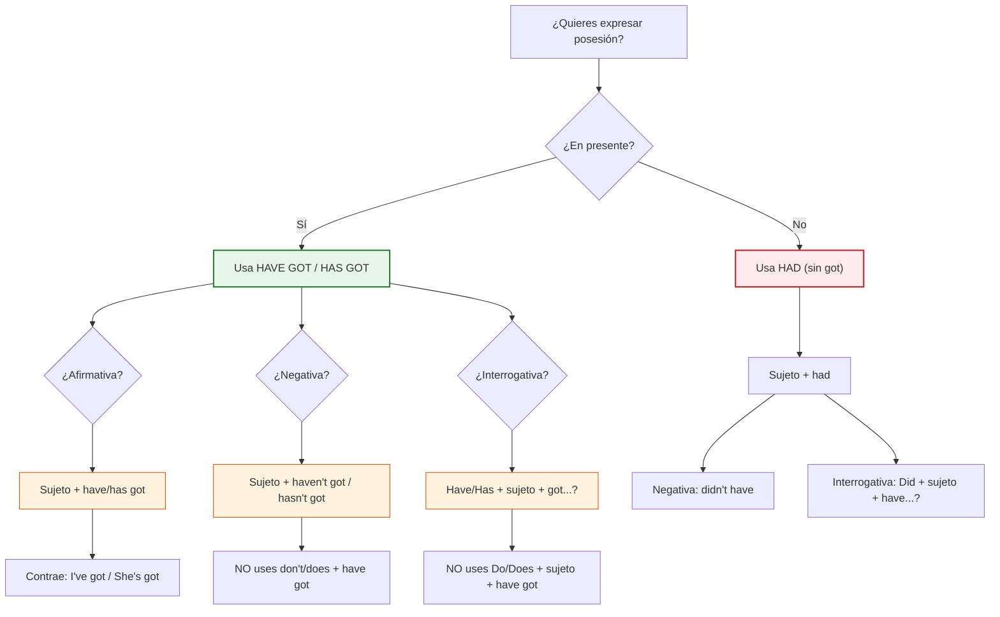

# 🇬🇧 MASTERCLASS: Have Got en Inglés Británico — La Estructura Que Realmente Usan

## 🔑 INTRODUCCIÓN: ¿POR QUÉ "HAVE GOT"?

Si aprendiste inglés con libros de texto americanos, probablemente conoces **"have"** como verbo de posesión: *"I have a car"*, *"She has a dog"*. Pero si escuchas a un británico en la vida real, casi nunca lo dice así. En su lugar, usan **"have got"** — y es la forma más natural, común y cotidiana de expresar posesión en el inglés británico.

> **Objetivo de Aprendizaje** — Al final de esta guía, podrás usar `have got` / `has got` con confianza en afirmativas, negativas e interrogativas, entender las contracciones que los nativos usan a diario, y distinguir cuándo usar `have got` vs. `have` vs. `had`.

> **Advertencia educativa** — Este contenido es formativo. Tanto `have got` como `have` significan exactamente lo mismo ("tener"). La diferencia es de registro y región, no de significado.

---

## 🧠 EL CONCEPTO CENTRAL

| Forma | Significado | Registro |
|-------|-------------|----------|
| **have got** / **has got** | Tener (posesión) | 🇬🇧 Británico — natural y cotidiano |
| **have** / **has** | Tener (posesión) | 🇺🇸 Americano — estándar en EE.UU. |
| **had** | Tuve (pasado) | Universal — pasado simple |

```text
I have got a car.     =  I have a car.       (🇬🇧 británico)  (🇺🇸 americano)
She has got a dog.    =  She has a dog.      (🇬🇧 británico)  (🇺🇸 americano)
```

> **Regla de oro** — `have got` = `have`. Siempre. La única diferencia es la estructura gramatical para negativas e interrogativas.

---

## 📋 ESTRUCTURA COMPLETA DE HAVE GOT

### 📊 Cuadro Explicativo Completo

| Tipo de Oración | Pronombres / Sujeto | Estructura | Ejemplo |
|-----------------|---------------------|------------|---------|
| **Afirmativa** | I / You / We / They | Sujeto + **have got** (o **'ve got**) | We **have got** a meeting. / I**'ve got** a new laptop. |
| | He / She / It | Sujeto + **has got** (o **'s got**) | She **has got** a desk. / He**'s got** a promotion. |
| **Negativa** | I / You / We / They | Sujeto + **haven't got** | I **haven't got** a new email. |
| | He / She / It | Sujeto + **hasn't got** | He **hasn't got** a company email. |
| **Interrogativa** | I / You / We / They | **Have** + Sujeto + **got...?** | **Have** you got a minute? |
| | He / She / It | **Has** + Sujeto + **got...?** | **Has** she got the report? |

---

## ✅ AFIRMATIVA

### Cómo formar oraciones afirmativas

| Sujeto | Contracción | Ejemplo |
|--------|-------------|---------|
| **I** | I**'ve** got | I**'ve got** a meeting tomorrow. |
| **You** | You**'ve** got | You**'ve got** great taste. |
| **We** | We**'ve** got | We**'ve got** enough time. |
| **They** | They**'ve** got | They**'ve got** three cats. |
| **He** | He**'s** got | He**'s got** a new job. |
| **She** | She**'s** got | She**'s got** a promotion. |
| **It** | It**'s** got | It**'s got** a nice view. |

### 💡 Puntos clave

1. **`'ve got`** = I / You / We / They — la contracción de `have got`
2. **`'s got`** = He / She / It — la contracción de `has got`
3. **⚠️ No confundas `She's got` con `She is`** — el contexto lo aclara: *"She's got a car"* (tiene un coche) vs. *"She's happy"* (está feliz)
4. En el **hablado británico**, las contracciones son prácticamente obligatorias — decir *"I have got"* completo suena formal y un poco extraño

```text
Afirmativa completa:  I have got a new laptop.
Afirmativa contraída: I've got a new laptop.  ← 🇬🇧 Natural
```

---

## ❌ NEGATIVA

### Cómo formar oraciones negativas

| Sujeto | Contracción | Ejemplo |
|--------|-------------|---------|
| **I** | I**haven't got** (o **haven't**) | I**haven't got** a car. |
| **You** | You**haven't got** | You**haven't got** any money. |
| **We** | We**haven't got** | We**haven't got** time. |
| **They** | They**haven't got** | They**haven't got** a printer. |
| **He** | He**hasn't got** (o **hasn't**) | He**hasn't got** a key. |
| **She** | She**hasn't got** | She**hasn't got** a passport. |
| **It** | It**hasn't got** | It**hasn't got** a charger. |

### 💡 Puntos clave

1. **Para la negativa NO usas `do not` ni `does not`** — es un error común
   - ❌ *I don't have got a car* — INCORRECTO
   - ✅ *I haven't got a car* — CORRECTO
2. **`haven't`** = I / You / We / They + negativa
3. **`hasn't`** = He / She / It + negativa
4. En el **hablado**, se suele omitir `got`: *"I haven't a car"* también es válido y muy británico

```text
❌ I don't have got a car.
✅ I haven't got a car.
✅ I haven't a car. (más formal / británico clásico)
```

---

## ❓ INTERROGATIVA

### Cómo formar preguntas

| Sujeto | Estructura | Ejemplo |
|--------|------------|---------|
| **I** | **Have** + I + **got...?** | **Have** I got your number? |
| **You** | **Have** + you + **got...?** | **Have** you got a minute? |
| **We** | **Have** + we + **got...?** | **Have** we got enough food? |
| **They** | **Have** + they + **got...?** | **Have** they got the tickets? |
| **He** | **Has** + he + **got...?** | **Has** he got a car? |
| **She** | **Has** + she + **got...?** | **Has** she got the report? |
| **It** | **Has** + it + **got...?** | **Has** it got a screen? |

### 💡 Puntos clave

1. **Para la interrogativa NO usas `do` ni `does`** — otro error frecuente
   - ❌ *Do you have got a car?* — INCORRECTO
   - ❌ *Does he have got a car?* — INCORRECTO
   - ✅ *Have you got a car?* — CORRECTO
   - ✅ *Has he got a car?* — CORRECTO
2. El **orden** es: **Have/Has + sujeto + got + resto**
3. Las contracciones en respuesta:
   - *"Have you got...?"* → *"Yes, I**'ve** got..."* / *"No, I**haven't** got..."*
   - *"Has she got...?"* → *"Yes, she**'s** got..."* / *"No, she**hasn't** got..."*

```text
❌ Do you have got a car?
❌ Does he have got a car?
✅ Have you got a car?
✅ Has he got a car?
```

---

## 🔄 CONTRACCIONES EN PROFUNDIDAD

### La tabla de contracciones que los nativos usan

| Original | Contracción | Pronunciación | Ejemplo |
|----------|-------------|---------------|---------|
| I have got | **I've got** | /aɪv ɡɒt/ | I've got a idea. |
| You have got | **You've got** | /juːv ɡɒt/ | You've got mail. |
| We have got | **We've got** | /wiːv ɡɒt/ | We've got time. |
| They have got | **They've got** | /ðeɪv ɡɒt/ | They've got tickets. |
| He has got | **He's got** | /hiːz ɡɒt/ | He's got a phone. |
| She has got | **She's got** | /ʃiːz ɡɒt/ | She's got a job. |
| It has got | **It's got** | /ɪts ɡɒt/ | It's got a problem. |
| I have not got | **I haven't got** | /aɪ hævnt ɡɒt/ | I haven't got a clue. |
| He has not got | **He hasn't got** | /hiːz hænt ɡɒt/ | He hasn't got a clue. |

### ⚠️ Trampa común: `She's got` vs. `She is`

| Oración | Significado | Cómo distinguir |
|---------|-------------|-----------------|
| **She's got** a new phone | Ella tiene un teléfono nuevo | Después viene un sustantivo |
| **She's** happy | Ella está feliz | Después viene un adjetivo |
| **She's** going home | Ella se va a casa | Después viene un gerundio |

> **Regla rápida** — Si después de `she's` viene un sustantivo → es `has got`. Si viene un adjetivo o verbo → es `is`.

---

## 📝 PRÁCTICA GUIADA

### Ejercicio 1: Completa con have got / has got

| # | Oración | Respuesta |
|---|---------|-----------|
| 1 | I ______ a new laptop. | **'ve got** |
| 2 | She ______ a meeting at 3pm. | **'s got** |
| 3 | We ______ enough money. | **'ve got** |
| 4 | He ______ a red car. | **'s got** |
| 5 | They ______ three children. | **'ve got** |
| 6 | It ______ a beautiful garden. | **'s got** |
| 7 | You ______ a great sense of humor. | **'ve got** |

### Ejercicio 2: Negativa — Corrige los errores

| # | Incorrecto | Correcto |
|---|------------|----------|
| 1 | I don't have got a car. | **I haven't got a car.** |
| 2 | She doesn't have got a key. | **She hasn't got a key.** |
| 3 | We don't have got any plans. | **We haven't got any plans.** |
| 4 | He don't have got a phone. | **He hasn't got a phone.** |
| 5 | They doesn't have got tickets. | **They haven't got tickets.** |

### Ejercicio 3: Interrogativa — Reescribe

| # | Afirmativa | Interrogativa |
|---|------------|---------------|
| 1 | You have got a dog. | **Have you got a dog?** |
| 2 | She has got a passport. | **Has she got a passport?** |
| 3 | They have got enough time. | **Have they got enough time?** |
| 4 | He has got a meeting. | **Has he got a meeting?** |
| 5 | I have got your number. | **Have I got your number?** |

### Ejercicio 4: Contracciones — Escribe la forma contraída

| # | Original | Contracción |
|---|----------|-------------|
| 1 | I have got | **I've got** |
| 2 | She has got | **She's got** |
| 3 | They have not got | **They haven't got** |
| 4 | He has not got | **He hasn't got** |
| 5 | We have got | **We've got** |

---

## ⏰ HAVE GOT EN PRESENTE vs. HAD EN PASADO

### La regla fundamental

| Tiempo | Estructura | Ejemplo |
|--------|------------|---------|
| **Presente** | have got / has got | I **have got** a car. |
| **Pasado** | **had** (sin got) | I **had** a car. |

### 💡 Puntos clave

1. **`Have got` SOLO se usa en presente** — nunca en pasado
2. Para hablar del pasado, usa la forma tradicional **`had`**
3. No existe *"had got"* — es un error

```text
✅ I have got a car.          (Presente — lo tengo ahora)
✅ I had a car.               (Pasado — lo tuve antes)
❌ I have got a car yesterday. (INCORRECTO — mezcla presente y pasado)
❌ I had got a car.           (INCORRECTO — no existe "had got")
```

### Comparación temporal

| Tiempo | Afirmativa | Negativa | Interrogativa |
|--------|------------|----------|---------------|
| **Presente** | I **have got** a phone | I **haven't got** a phone | **Have** you got a phone? |
| **Pasado** | I **had** a phone | I **didn't have** a phone | **Did** you **have** a phone? |

> **Nota** — En pasado, vuelves a la estructura tradicional con `do/does` para negativas e interrogativas, porque `had` no funciona como auxiliar en pasado.

---

## 🇬🇧 HAVE GOT EN EL INGLÉS BRITÁNICO REAL

### C lo usan los británicos en la vida cotidiana

| Situación | Forma | Ejemplo |
|-----------|-------|---------|
| Conversación informal | **'ve got** / **'s got** | *"I've got no idea"* |
| Negativa rápida | **haven't** / **hasn't** (sin `got`) | *"I haven't a clue"* |
| Pregunta educada | **Have you got...?** | *"Have you got the time?"* |
| Formal / escrito | **have got** / **has got** completo | *"The company has got a new CEO"* |
| British English clásico | **haven't got** / **hasn't got** | *"She hasn't got any brothers"* |

### 🎯 Diferencias culturales clave

| Aspecto | 🇬🇧 Británico | 🇺🇸 Americano |
|---------|---------------|----------------|
| Forma principal | **have got** | **have** |
| Contracción natural | **'ve got** / **'s got** | **'ve** / **'s** (sin `got`) |
| Negativa | **haven't got** | **don't have** |
| Interrogativa | **Have you got...?** | **Do you have...?** |
| Sin `got` en negativa | *"I haven't a car"* | No se usa |
| Registro | Cotidiano y natural | Neutral y estándar |

---

## 🧩 RESUMEN VISUAL: LA ESTRUCTURA COMPLETA



---

## ✅ CHECKLIST FINAL

| Concepto | Check | Regla |
|----------|-------|-------|
| Afirmativa | ☐ | Sujeto + have/has got (o contracciones) |
| Negativa | ☐ | Sujeto + haven't/hasn't got (sin `do/does`) |
| Interrogativa | ☐ | Have/Has + sujeto + got...? (sin `do/does`) |
| Contracciones | ☐ | I've got, She's got, We've got, They've got |
| Pasado | ☐ | Usar `had` (sin `got`) — nunca `had got` |
| No confundir | ☐ | `She's got` ≠ `She is` — mira lo que viene después |
| Británico vs. Americano | ☐ | `Have got` = británico natural / `Have` = americano estándar |

---

## 📝 Preguntas de Verificación

1. **Aplica**: Escribe 3 oraciones afirmativas usando `have got` con contracciones para I, She y They.

2. **Corrige**: Encuentra y corrige el error: *"Do she has got a car?"*

3. **Diferencia**: ¿Cuál es la diferencia entre *"I haven't got a phone"* y *"I don't have a phone"*? ¿Son intercambiables?

4. **Transforma**: Convierte estas oraciones a interrogativa:
   - a) He has got a meeting.
   - b) They have got tickets.
   - c) She has got a new job.

5. **Tiempo**: ¿Por qué *"I had got a car yesterday"* es incorrecto? ¿Cuál es la forma correcta?

6. **Cultura**: ¿Por qué un británico diría *"I haven't a clue"* en lugar de *"I don't have a clue"*? ¿Es esto válido en inglés americano?

7. **Contracción**: ¿Cuál es la diferencia entre *"She's got"* y *"She is"*? ¿Cómo sabes cuál se está usando en una conversación?

8. **Producción**: Escribe un diálogo breve (4-6 líneas) entre dos personas británicas usando `have got` en afirmativa, negativa e interrogativa.

9. **Comparación**: Compara cómo expresarías "I don't have any money" en inglés británico vs. inglés americano. ¿Cuál es la diferencia de estructura?

10. **Reflexión**: ¿Por qué crees que el inglés británico prefiere `have got` mientras que el americano usa `have` directamente? ¿Qué ventajas o desventajas tiene cada forma?

---

## 🧠 GLOSARIO RÁPIDO

| Término | Definición |
|---------|------------|
| **Have got** | Estructura británica para expresar posesión en presente (= "tener") |
| **Has got** | Forma de `have got` para he / she / it |
| **'ve got** | Contracción de I / you / we / they + have got |
| **'s got** | Contracción de he / she / it + has got |
| **Haven't got** | Negativa de have got para I / you / we / they |
| **Hasn't got** | Negativa de has got para he / she / it |
| **Posesión** | El estado de tener algo como propio |
| **Contracción** | Forma abreviada de dos palabras combinadas con apóstrofo |
| **Auxiliar** | Verbo auxiliar que ayuda a formar tiempos, negativas e interrogativas |
| **Registro** | El nivel de formalidad de un idioma o expresión |

---

## 🏁 CIERRE

`Have got` no es una estructura separada de `have` — es **la misma idea** con una **estructura gramatical diferente** para negativas e interrogativas. Una vez que domines el patrón de no usar `do/does` y de mover `have/has` al inicio en preguntas, todo encaja.

> *"En el inglés británico, have got es tan natural como respirar. Úsalo, contrae it, y sonará como un nativo."* 🇬🇧

Practica todos los días. Empieza con las afirmativas, luego añade las negativas, y finalmente las interrogativas. En pocas semanas, `have got` será automático. 🚀


[ROL]
Actúa como un diseñador de rutinas de estudio y tutor de inglés conversacional experto.

[CONTEXTO]
- Nivel actual estimado: [A1 / A2 / B1 / B2]
- Mi mayor reto actual: [ej. Me cuesta entender cuando me hablan / Me tranco al hacer preguntas]
- Mi objetivo principal: [ej. Ganar fluidez conversacional / Mejorar pronunciación]
- Disponibilidad real: [ej. 25 minutos al día, 5 días a la semana]

[TAREA]
Diseña una rutina personalizada de práctica de inglés de 4 semanas dividida en bloques diarios de 25 minutos (enfoque de baja carga cognitiva y alta constancia).

[ESTRUCTURA EXIGIDA POR SEMANA]
- Lunes: Vocabulario activo y collocations (10 min) + producción (15 min).
- Martes: Estructura y gramática en contexto (10 min) + ejercicios prácticos (15 min).
- Miércoles: Escucha activa / shadowing con contenido real (25 min).
- Jueves: Simulación conversacional e interacción (25 min).
- Viernes: Revisión de errores de la semana + ajuste de objetivos (25 min).

[REGLAS Y LÍMITES]
1. Haz la rutina en un formato de tabla claro, scannable y fácil de seguir.
2. Incluye prompts específicos que yo pueda usar contigo durante cada día de la semana para ejecutar las actividades.
3. Al final, indícame 3 señales claras de cuándo debería consultar a un profesor humano y cuándo avanzar al siguiente nivel.


---