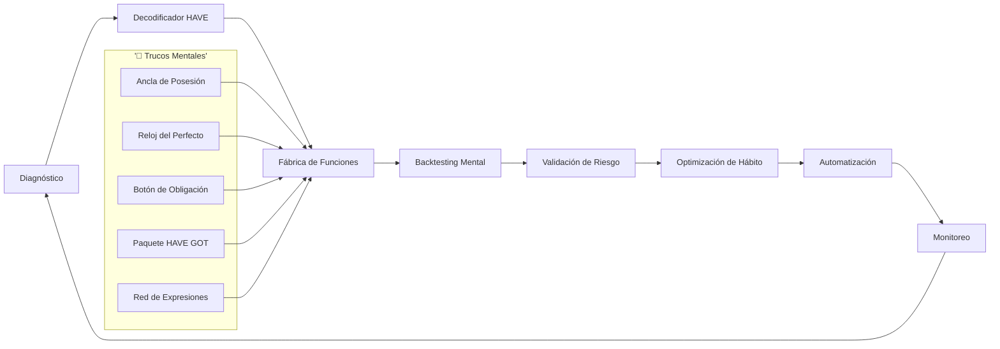
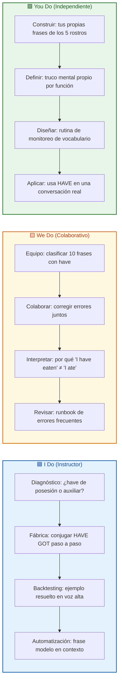
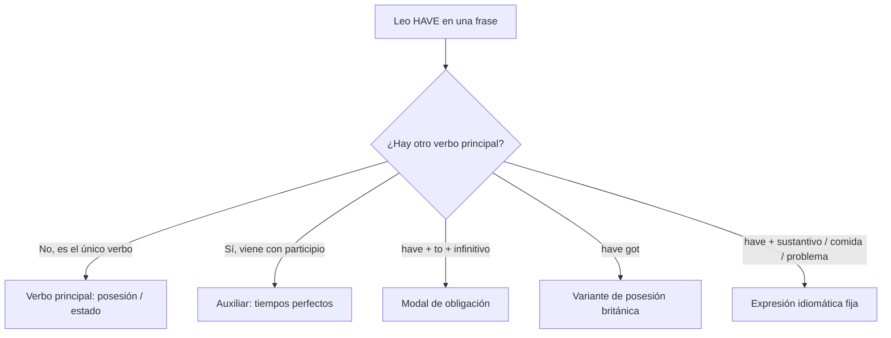
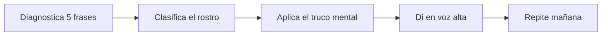
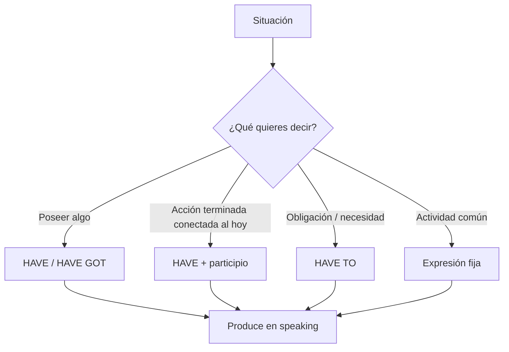

# MASTERCLASS: El Verbo HAVE 🧠⚙️ — Fábrica Mental para Dominar el Verbo Más Versátil del Inglés

## INTRODUCCIÓN: POR QUÉ ESTE MASTERCLASS ES DIFERENTE 🚀

Aprender vocabulario suelto rara vez funciona. El cerebro olvida palabras aisladas porque no tiene "gancho" donde colgarlas. El principiante estudia *have = tener* y se queda ahí. El estudiante avanzado descubre que **have** es una navaja suiza: sirve para poseer, para construir tiempos perfectos, para obligar (have to), para describir estados (have got) y para montones de expresiones fijas.

Este masterclass propone otro camino: una **fábrica mental de HAVE** donde la gramática, los trucos mnemotécnicos, la práctica guiada y la automatización de hábitos trabajan como un sistema integrado.

La meta no es memorizar 50 frases de have. La meta es construir un **proceso repetible** para reconocer, recordar y producir have en cualquier situación real.

> **Objetivo de Aprendizaje** 🎯 — Al final de esta guía, podrás diagnosticar qué función cumple *have* en una frase, usar los 5 rostros del verbo, aplicar trucos mentales para no olvidarlo y entrenarlo con ejercicios progresivos I Do / We Do / You Do.

> **Advertencia educativa** ⚠️ — Este contenido es formativo. Ninguna regla debe interpretarse como "la única forma correcta"; el inglés natural tolera variaciones (sobre todo entre británico y americano). Usa lo que te funcione y practica con contexto real.

---

## MAPA DEL WORKFLOW 🗺️



| Fase | Pregunta que responde | Output principal |
|------|-----------------------|------------------|
| **Diagnóstico** | ¿De qué tipo de have estamos hablando? | Etiqueta: posesión / auxiliar / obligación / got / frase hecha |
| **Decodificador** | ¿Qué función cumple en la oración? | Lectura correcta de la estructura |
| **Fábrica de Funciones** | ¿Cómo se conjuga y combina? | Reglas y trucos por función |
| **Backtesting Mental** | ¿Lo recuerdas bajo presión? | Recuerdo rápido y sin traducción |
| **Validación de Riesgo** | ¿Dónde se equivoca la gente? | Errores típicos evitados |
| **Optimización de Hábito** | ¿Cómo lo haces automático? | Rutina de repaso |
| **Automatización** | ¿Dónde lo usas en la vida real? | Producción en speaking/listening |
| **Monitoreo** | ¿Sigue vivo tu conocimiento? | Señales de olvido y refuerzo |



---

## PARTE 1: DIAGNÓSTICO — LEER EL HAVE ANTES DE USARLO 🔍

### 1.1 Principio Central 💡

El primer error del estudiante es traducir *have* siempre como "tener". El primer hábito del estudiante pro es **diagnosticar la función** antes de traducir. Una sola palabra, cinco trabajos distintos:



### 1.2 Los 5 rostros de HAVE 🎭

| Rostro | Qué significa | Traducción útil | Ejemplo |
|--------|---------------|-----------------|---------|
| **1. Posesión** | Tener algo | tener / poseer | *I have a car* 🚗 |
| **2. Auxiliar perfecto** | Une tiempos con participio | (no se traduce solo) | *I have eaten* 🍽️ |
| **3. Obligación** | Tener que | tener que / deber | *I have to go* 🏃 |
| **4. HAVE GOT** | Posesión (británico) | tener | *I've got a dog* 🐕 |
| **5. Expresión fija** | Frase hecha | varía | *have a break* ☕ |

### 1.3 Truco Mental #1 — El Ancla de Posesión 🔗

> **🧠 TRUCO:** Imagina que *have* es un **gancho 🪝**. Si tras have viene un sustantivo ("a car", "a dog", "money"), el gancho está colgando algo: es **posesión**. Si tras have viene un participio ("eaten", "finished", "been"), el gancho está enganchado a una acción terminada: es **perfecto**.

| Señal tras HAVE | Diagnóstico | Truco visual |
|-----------------|-------------|--------------|
| Sustantivo 📦 | Posesión / estado | Gancho colgando objeto |
| Participio (-ed / -en) ⚙️ | Perfecto | Gancho enganchado a acción |
| "to" + verbo 🚦 | Obligación | Gancho empujando a una acción |
| "got" 🇬🇧 | Variante británica | Gancho con acento inglés |
| Sustantivo abstracto 🍵 | Expresión fija | Gancho con frase hecha |

---

## PARTE 2: FÁBRICA DE FUNCIONES — CONVERTIR EL DIAGNÓSTICO EN USO ✅

### 2.1 Regla de Oro 🏆

Si no diagnosticas bien, dicen "tengo comido" en español mental y te bloqueas. La fábrica convierte cada diagnóstico en una estructura repetible:

```text
Diagnóstico → Estructura → Conjugación → Truco → Práctica
```

### 2.2 Rostro 1 — HAVE de posesión 📦

| Componente | Fórmula | Ejemplo |
|------------|---------|---------|
| Afirmativo | I/You/We/They **have** + objeto | *We have time* ⏰ |
| Afirmativo (he/she/it) | **has** + objeto | *She has a plan* 📋 |
| Negativo | don't/doesn't **have** + objeto | *I don't have money* 💸 |
| Pregunta | Do/Does + have + objeto? | *Do you have a pen?* 🖊️ |

**Truco Mental #2 — El Espejo de HAS 👯:** *He, She, It* son "tercera persona", suenan a "Él, Ella, Eso". Como necesitan atención especial, se llevan la **S** de *has*. Recuerda: **H-S-H** = *He/She/It → has*.

### 2.3 Rostro 2 — HAVE como auxiliar de perfecto ⚙️

| Tiempo | Estructura | Truco del reloj 🕐 |
|--------|------------|--------------------|
| Present Perfect | have/has + **past participle** | Acción conectada al ahora |
| Past Perfect | had + past participle | "El pasado del pasado" |
| Future Perfect | will have + past participle | Antes de un punto futuro |

**Truco Mental #3 — El Reloj del Perfecto 🕰️:** *Have* en el perfecto es un **puente 🌉**. Une el pasado con el presente. Si la acción "todavía pesa hoy", usa *have + participio*. Si preguntas "¿Cuándo?" y quieres una fecha concreta, mejor usa pasado simple (*I ate*, no *I have eaten*).

| Frase | ¿Perfecto o Simple? | Por qué |
|-------|---------------------|---------|
| *I have lost my keys* 🔑 | Perfecto | El problema existe AHORA |
| *I lost my keys yesterday* | Simple | Hay fecha concreta |
| *She has lived here* 🏠 | Perfecto | Experiencia hasta hoy |
| *She lived there in 2020* | Simple | Periodo cerrado |

### 2.4 Rostro 3 — HAVE TO de obligación 🚦

| Forma | Estructura | Equivalente mental |
|-------|------------|--------------------|
| Afirmativo | have/has **to** + verbo | tener que |
| Negativo | don't/doesn't have **to** | no tener que (libertad) |
| Pregunta | Do/Does + have **to**? | ¿tener que? |

**Truco Mental #4 — El Botón de Obligación 🔘:** Visualiza *have to* como un semáforo en rojo 🔴 que te obliga a moverte. Ojo: *must* es obligación del hablante; *have to* suele ser una regla externa. Y el negativo *don't have to* NO significa "no puedes", significa "no es obligatorio" (libertad, no prohibición).

| Frase | Significado real | Error típico |
|-------|------------------|--------------|
| *I have to work* 💼 | Debo trabajar (regla) | Confundir con "me gusta" |
| *I don't have to go* 🆓 | No es obligatorio | Creer que = "no puedo ir" |
| *She has to study* 📚 | Ella debe estudiar | Olvidar el "has" |

### 2.5 Rostro 4 — HAVE GOT (británico) 🇬🇧

| Forma | Estructura | Nota |
|-------|------------|------|
| Afirmativo | I've/He's/We've **got** + objeto | Muy común en UK |
| Negativo | haven't/hasn't **got** | Equivale a don't have |
| Pregunta | Have/Has + got? | ¿Tienes? |

**Truco Mental #5 — El Paquete HAVE GOT 🎁:** *Got* es como decir "ya lo agarré". *I've got* = "ya tengo". En EE.UU. prefieren *I have*; en UK prefieren *I've got*. Ambos valen. Pero ojo: **have got NO se usa para el perfecto**. *I've got eaten* ❌ no existe.

### 2.6 Rostro 5 — Expresiones fijas 🍵

| Expresión | Significado | Truco de imagen |
|-----------|-------------|-----------------|
| *have a break* ☕ | tomar un descanso | Agarras el descanso |
| *have fun* 🎉 | divertirse | Abrazas la diversión |
| *have a shower* 🚿 | ducharse | Posees el momento |
| *have lunch* 🍴 | almorzar | "Tener" una comida |
| *have a problem* ⚠️ | tener un problema | Cargas el problema |
| *have a look* 👀 | echar un vistazo | Tomas una mirada |

**Truco Mental #6 — La Red de Expresiones 🕸️:** Estas frases no se traducen palabra por palabra. Grábalas como **bloques pegados**: *have + (sustantivo de actividad)*. No pienses "tener diversión", piensa el bloque "have fun" como una unidad.

---

## PARTE 3: BACKTESTING MENTAL — PROBAR SIN AUTOENGAÑO 🧪

### 3.1 El recuerdo perfecto no existe 🤯

Al igual que un backtest financiero, tu memoria es una simulación. Si practicas solo leyendo, el "test de la vida real" (hablar) te sorprende. Los errores comunes:

- traducir *have* siempre como "tener" 🚫
- usar *has* con "I/you/we" 🚫
- decir *have ate* en vez de *have eaten* 🚫
- confundir *don't have to* con *mustn't* 🚫
- mezclar *have got* con el perfecto 🚫

### 3.2 Métricas mínimas de tu dominio 📊

| Métrica | Qué mide | Meta |
|---------|----------|------|
| **Velocidad** | ¿Respondes sin traducir? | < 2 segundos |
| **Precisión** | ¿Acertaste el rostro? | 90%+ |
| **Contexto** | ¿Usaste la forma correcta? | Nativo-like |
| **Retención** | ¿Lo recuerdas a la semana? | Sin repaso masivo |
| **Producción** | ¿Lo deciste en voz alta? | Sí en conversación |

### 3.3 Ejercicio resuelto (I Do) 🟦

**Frase:** *"I have been to London three times."*

| Paso | Decodificación |
|------|----------------|
| 1. ¿Hay participio? | Sí: *been* |
| 2. ¿Es posesión? | No, va con acción |
| 3. Diagnóstico | Auxiliar → Present Perfect |
| 4. Truco | Reloj del Perfecto: experiencia hasta hoy 🌉 |
| 5. Traducción natural | "He estado en Londres tres veces" (experiencia) |

**Interpretación:** No usamos pasado simple porque enfatizamos la **experiencia acumulada**, no una fecha.

---

## PARTE 4: VALIDACIÓN DE RIESGO — DÓNDE SE EQUIVOCA LA GENTE ⚠️

### 4.1 El riesgo no es una sección final 🛡️

Igual que en trading, el error sin validación produce desastres. Aquí el "drawdown" es quedar en silencio en una conversación.

### 4.2 Errores típicos y prevención 🚑

| Error | Síntoma | Truco de prevención |
|-------|---------|---------------------|
| *He have a dog* | Olvida 3ª persona | Espejo H-S-H 👯 |
| *I have ate* | Participio mal | Tabla de irregulares 📑 |
| *I don't have to* = "no puedo" | Falso amigo | Botón libre 🆓 |
| *Have got eaten* | Mezcla funciones | Paquete got ≠ perfecto 🎁 |
| *Have a fun* (con "a") | Artículo de más | Bloque pegado: "have fun" 🕸️ |

### 4.3 Tabla de "falsos amigos" 🚨

| Ingles | Traducción literal errónea | Realidad |
|--------|----------------------------|----------|
| *I have to* | "Yo tengo a..." | "Tengo que..." |
| *You don't have to* | "No tienes a..." | "No tienes que (es opcional)" |
| *Have got* | "Tener conseguido" | "Tengo" (UK) |
| *Have a baby* | "Tener un bebé" | "Dar a luz / tener un hijo" |

---

## PARTE 5: OPTIMIZACIÓN DE HÁBITO — REPASO QUE PEGA 🔁

### 5.1 Fitness de tu vocabulario 💪

Usa una "función de aptitud" para decidir qué repasar:

| Componente | Peso | Motivo |
|------------|------|--------|
| Frecuencia de uso | 30% | Lo que usas más, repasa más |
| Tasa de error | 30% | Lo que fallas, necesita refuerzo |
| Contexto real | 20% | Usarlo en vida real, no solo leer |
| Variedad de rostros | 20% | No domines solo posesión |

### 5.2 Rutina de 5 minutos ⏱️



| Día | Micro-hábito |
|-----|--------------|
| Lunes | 5 frases de posesión + Espejo H-S-H |
| Martes | 5 frases de perfecto + Reloj 🕰️ |
| Miércoles | 5 frases de have to + Botón 🔘 |
| Jueves | 5 frases de have got + Paquete 🎁 |
| Viernes | 5 expresiones fijas + Red 🕸️ |
| Fin de semana | Conversación real con todo |

---

## PARTE 6: AUTOMATIZACIÓN — LLEVAR HAVE A LA VIDA REAL 🤖

### 6.1 ¿Dónde usar cada rostro? 🎯



| Contexto | Mejor rostro | Ejemplo hablado |
|----------|--------------|-----------------|
| En el trabajo 💼 | have to | *I have to send this email* |
| Con amigos 🎉 | have fun / have a look | *Have fun tonight!* |
| Viajes ✈️ | present perfect | *I have visited Paris* |
| UK 🇬🇧 | have got | *I've got two tickets* |
| Descripción 👤 | have (posesión) | *She has blue eyes* |

### 6.2 Checklist de producción ✅

| Check | Requisito |
|-------|-----------|
| Diagnóstico claro | Sabes qué rostro usas |
| Conjugación correcta | has/have/had según sujeto |
| Truco aplicado | Usaste tu ancla mental |
| Voz alta | Lo dijiste, no solo leíste |
| Contexto real | En conversación o writing |
| Sin traducción | Pensaste en bloque inglés |

---

## PARTE 7: MONITOREO — QUE TU HAVE NO SE OXIDE 📡

### 7.1 Señales de degradación 📉

| Señal | Interpretación | Acción |
|-------|----------------|--------|
| Repites "tener" siempre | Hábito de traducción | Vuelve al diagnóstico |
| Confundes has/have | 3ª persona olvidada | Espejo H-S-H 👯 |
| Callas en conversación | Falta producción | Habla 5 frases hoy |
| Olvidas expresiones | Red desactivada | Repasa bloques 🕸️ |

### 7.2 Dashboard mínimo de vocabulario 📊

| Widget | Métrica | Alerta |
|--------|---------|--------|
| Rostros | % de uso de los 5 | Usar solo 1 = desequilibrio |
| Errores | Fallos por sesión | >3 = repaso |
| Voz | Frases dichas en alto | 0 = riesgo |
| Retención | Recuerdo a 7 días | <70% = refuerzo |

---

## PARTE 8: I DO / WE DO / YOU DO — EJERCICIOS PROGRESIVOS 🏋️

### 8.1 I Do — Diagnóstico guiado 🟦

**Objetivo:** etiquetar el rostro de have en frases.

| Frase | Rostro | Truco |
|-------|--------|-------|
| *I have a sister* 👩 | Posesión | Gancho 🪝 |
| *I have finished* ✅ | Perfecto | Reloj 🕰️ |
| *I have to leave* 🚪 | Obligación | Botón 🔘 |
| *I've got a cat* 🐈 | Have got | Paquete 🎁 |
| *Have a seat* 🪑 | Expresión | Red 🕸️ |

**Interpretación:** El diagnóstico toma <1 segundo cuando el truco está interiorizado.

### 8.2 We Do — Clasificar en equipo 🟨

**Escenario:** Reciben 10 frases con have. Decidan el rostro y corrijan errores juntos.

| Decisión | Opción recomendada | Justificación |
|----------|--------------------|---------------|
| Frase con "to" | Obligación | Botón 🔘 |
| Frase con participio | Perfecto | Reloj 🕰️ |
| Frase con "got" | Have got | Paquete 🎁 |
| Frase con objeto | Posesión | Gancho 🪝 |
| Frase con comida | Expresión | Red 🕸️ |

### 8.3 You Do — Construye tu fábrica 🟩

**Tarea:** escribe 2 frases propias de cada rostro y tu truco mental personal.

| Rostro | Tu frase 1 | Tu frase 2 |
|--------|-----------|-----------|
| Posesión | | |
| Perfecto | | |
| Obligación | | |
| Have got | | |
| Expresión | | |

**Regla:** No aceptes una frase si no puedes decir por qué usaste ese rostro y qué truco te lo recordó.

### 8.4 I Do — Perfecto vs Simple resuelto 🟦

**Caso:** *"I have lost my wallet"* vs *"I lost my wallet yesterday"*.

| Pregunta | Respuesta |
|----------|-----------|
| ¿Hay conexión con hoy? | Sí → perfecto |
| ¿Hay fecha concreta? | No → perfecto |
| ¿El problema existe ahora? | Sí → perfecto |

### 8.5 We Do — Interpretar errores 🟨

**Caso:** Un estudiante escribe *"She have a dog"*.

| Paso | Acción |
|------|--------|
| 1 | Detectar sujeto: She = 3ª persona |
| 2 | Aplicar Espejo H-S-H 👯 |
| 3 | Corregir: *She has a dog* |
| 4 | Explicar el truco |
| 5 | Practicar 3 más |

### 8.6 You Do — Diseña tu monitoreo 🟩

**Tarea:** diseña un dashboard mínimo de tu vocabulario have.

| Widget | Métrica | Alerta |
|--------|---------|--------|
| Rostros usados | Conteo de 5 | Desequilibrio |
| Errores | Por sesión | >3 |
| Voz | Frases en alto | 0 = riesgo |

### 8.7 Cierre práctico 🏁

| Nivel | Debes poder hacer |
|-------|-------------------|
| **I Do** | Seguir un ejemplo completo de diagnóstico y uso de have |
| **We Do** | Clasificar frases, corregir errores y decidir el rostro |
| **You Do** | Construir tus frases, trucos propios y rutina de monitoreo |

---

## CHECKLIST FINAL DE LA FÁBRICA DE HAVE 🏭

| Bloque | Check |
|--------|-------|
| Diagnóstico | Identificas los 5 rostros al leer |
| Posesión | Usas has/have según sujeto |
| Perfecto | Usas participio y entiendes el "puente" |
| Obligación | Distinguues have to de must |
| Have got | Sabes que es variante de posesión |
| Expresiones | Usas bloques pegados |
| Riesgo | Evitas los 5 errores típicos |
| Hábito | Repasas 5 min diarios |
| Automatización | Produces en conversación real |
| Monitoreo | Detectas y corriges olvido |

---

## PREGUNTAS DE VERIFICACIÓN 📝

Responde usando los trucos mentales. Escribe tus respuestas para profundizar.

### Sobre Diagnóstico

1. **Aplica:** En *"They have a big house"*, ¿qué rostro es y qué truco usas? 🪝

2. **Analiza:** ¿Por qué *"I have eaten sushi yesterday"* está mal? ¿Qué reloj 🕰️ se rompe?

### Sobre Fábrica de Funciones

3. **Diseña:** Escribe una frase con *have to* y explica el botón 🔘 de obligación.

4. **Reflexiona:** ¿Prefieres *I have* o *I've got*? ¿En qué contexto cambias? 🇬🇧

### Sobre Backtesting Mental

5. **Calcula:** Si aciertas 18 de 20 diagnósticos, ¿cuál es tu precisión % y qué meta falta?

6. **Evalúa:** ¿Por qué es crucial separar "posesión" de "perfecto"? ¿Qué pasa si no lo haces? 🚫

### Integradoras

7. **Conecta:** Explica cómo el Truco #1 (Ancla de Posesión) se relaciona con el Reloj del Perfecto. ¿Qué pasaría si los mezclas? 🔗🕰️

8. **Propón:** Diseña un sistema de monitoreo para no olvidar los 5 rostros. ¿Qué alertas pondrías? 📡

9. **Síntesis:** Toma una conversación real y aplica el framework completo: diagnóstico → fábrica → riesgo → monitoreo.

10. **Reflexión final:** De los 5 rostros de HAVE, ¿cuál consideras más crítico para sonar natural? Justifica. 🌟

---

## GLOSARIO RÁPIDO 📚

| Término | Definición |
|---------|------------|
| **Have** | Verbo para posesión, auxiliar, obligación y expresiones |
| **Has** | Forma de 3ª persona (he/she/it) |
| **Past Participle** | Forma del verbo para el perfecto (eaten, finished) |
| **Present Perfect** | have/has + participio; acción conectada al presente |
| **Have to** | Modal de obligación externa ("tener que") |
| **Have got** | Variante británica de posesión |
| **Expression** | Bloque fijo tipo "have fun" |
| **False friend** | Palabra que parece significar otra (don't have to ≠ no puedo) |
| **H-S-H** | Truco: He/She/It → has |
| **Ancla mental** | Imagen para recordar sin traducir |

---

## RESUMEN DE TRUCOS MENTALES 🧠✨

| # | Truco | Para qué |
|---|-------|----------|
| 1 | 🪝 Ancla de Posesión | Gancho colgando objeto = posesión |
| 2 | 👯 Espejo H-S-H | He/She/It llevan "has" |
| 3 | 🕰️ Reloj del Perfecto | Have + participio = puente al presente |
| 4 | 🔘 Botón de Obligación | have to = semáforo rojo de "tener que" |
| 5 | 🎁 Paquete HAVE GOT | "Ya lo agarré" = posesión UK |
| 6 | 🕸️ Red de Expresiones | Bloques pegados, no traducir |

> 🚀 **Cierre:** El verbo HAVE no se domina memorizando. Se domina **diagnosticando, anclando y produciendo**. Usa los 6 trucos, repasa 5 minutos al día y llévalo a una conversación real esta semana. ¡Tú puedes! 💪🌟
