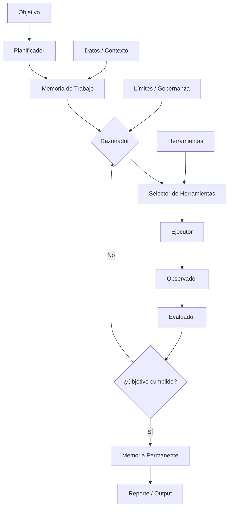
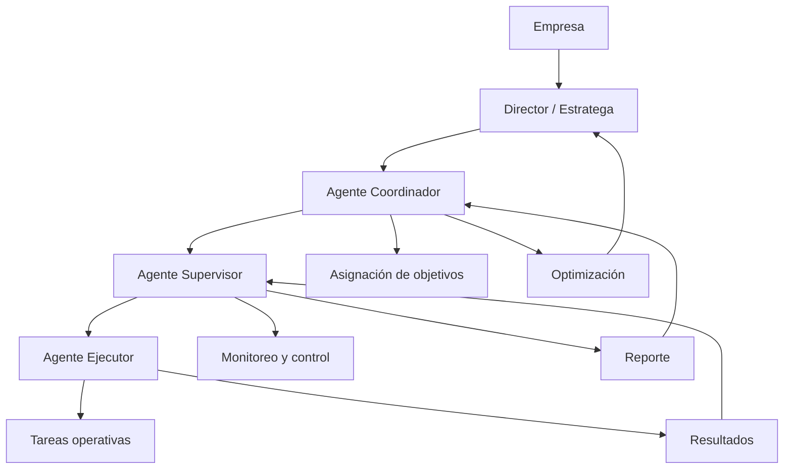
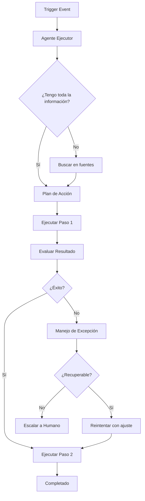
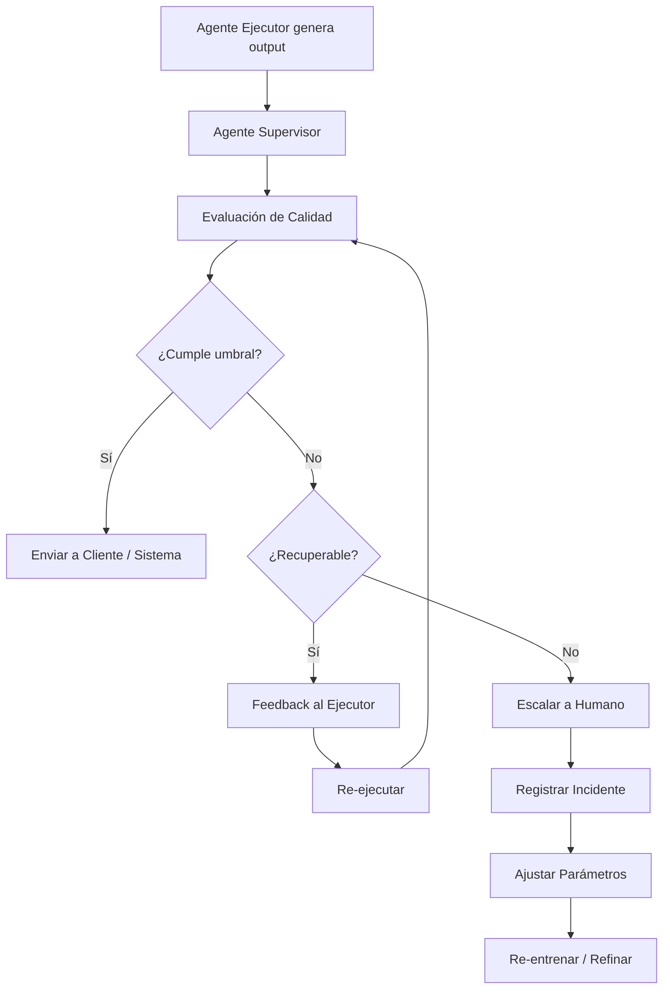
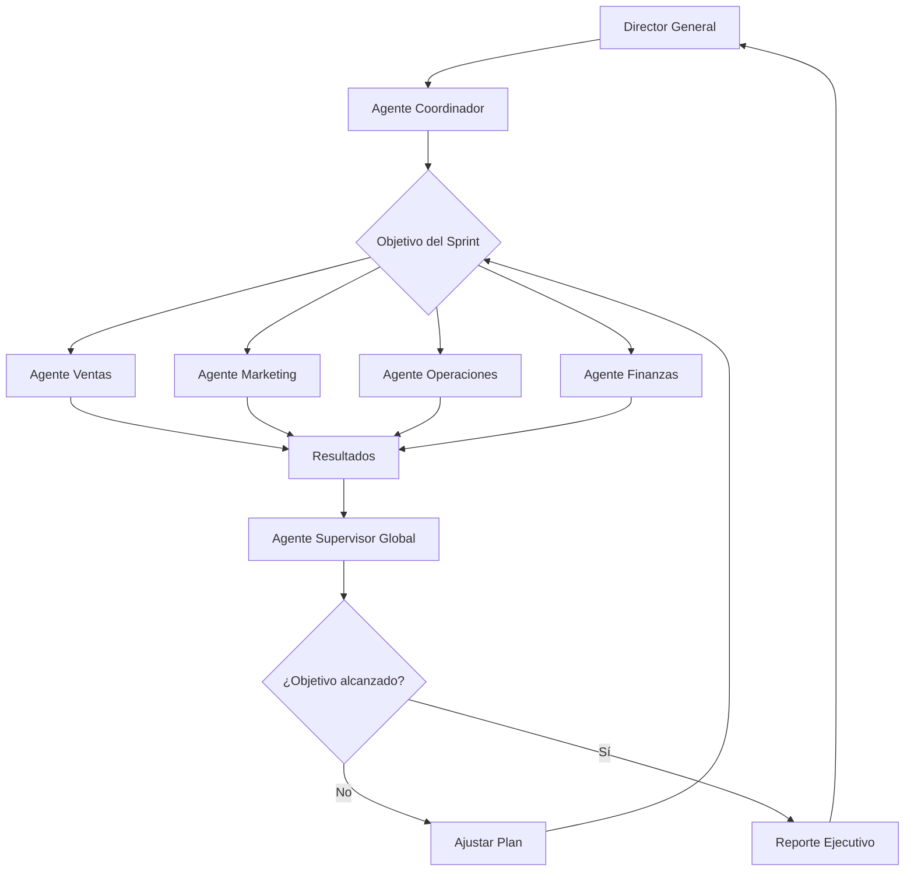
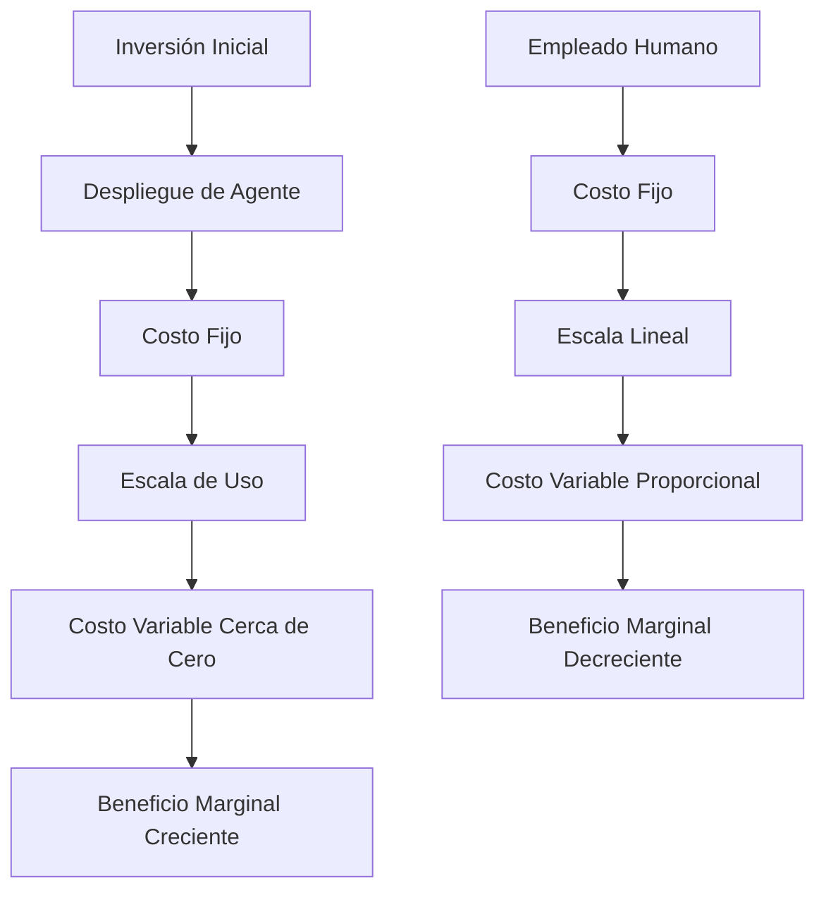
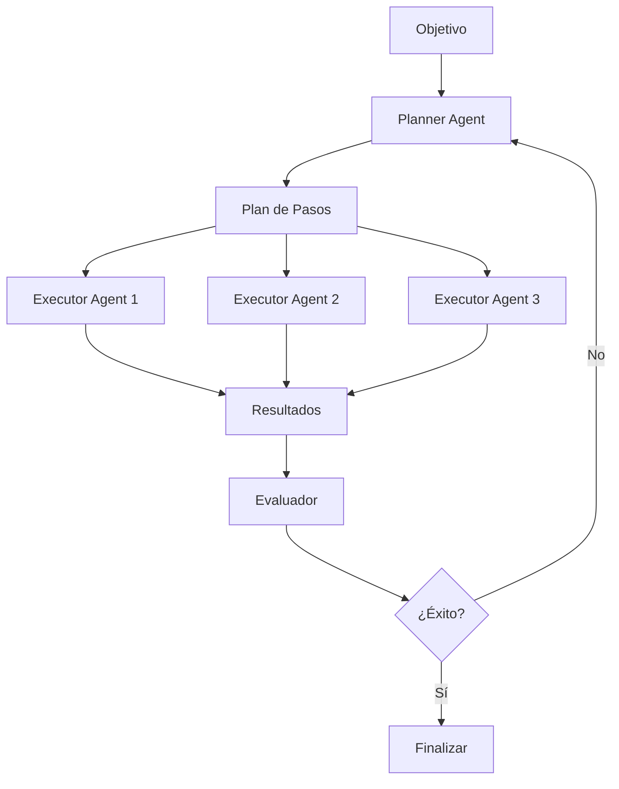
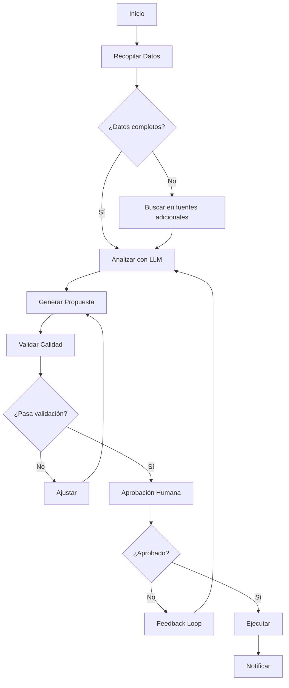

# MASTERCLASS: Estratega de Eficiencia Operativa con IA — Arquitectura y Agentes Autónomos

> **Prerrequisito** — Esta guía asume dominio de los conceptos de `ia-mentalidad-estratega.md` e `ia-mapeo-arquitectura-procesos.md`. Aquí se pasa del diagnóstico a la construcción del sistema vivo de la empresa.

---

# MÓDULO 4: ARQUITECTURA DE AGENTES AUTÓNOMOS

## QUÉ ES UN AGENTE (Y QUÉ NO ES)

En el contexto empresarial, un agente es un sistema computacional que percibe su entorno, razona sobre él y ejecuta acciones para alcanzar objetivos definidos, con cierto grado de autonomía.

### Definición formal para empresas

```text
Agente empresarial = LLM (cerebro) + Herramientas (manos) + Memoria (experiencia) + Objetivo (propósito) + Límites (gobernanza)
```

Un agente no es:
- Un chatbot: el chatbot conversa. El agente ejecuta procesos completos.
- Un script: el script tiene lógica rígida. El agente razona y adapta su comportamiento.
- Un assistant virtual: el assistant responde preguntas. El agente resuelve problemas de negocio de principio a fin.

| Característica | Chatbot | Script | Agente empresarial |
|-----------------|---------|--------|--------------------|
| Comprensión de contexto | Media | Nula | Alta |
| Toma de decisiones | Limitada | Predefinida | Razonada |
| Ejecución de acciones | Limitada | Estricta | Amplia y flexible |
| Adaptación a excepciones | Manual | Imposible | Probabilística |
| Memoria de interacciones | Corta | Nula | Persistente |
| Delegación | No | No | Sí |
| Escalabilidad | Lineal | Lineal | No lineal |

### Anatomía de un agente empresarial



---

## TIPOS DE AGENTES

### Clasificación por jerarquía operativa



| Tipo | Función | Nivel de autonomía | Ejemplo empresarial |
|------|---------|-------------------|---------------------|
| **Asistente** | Responde preguntas, genera documentos | Bajo | Asistente legal que redacta cláusulas bajo supervisión |
| **Ejecutor** | Ejecuta tareas operativas de principio a fin | Medio | Agente de cobranza que gestiona facturas vencidas completo |
| **Supervisor** | Monitorea, valida y deriva excepciones | Alto | Agente de calidad que revisa piezas de contenido antes de publicación |
| **Coordinador** | Asigna objetivos, prioriza recursos, delega | Muy alto | Director de proyectos que distribuye tareas entre agentes de ventas, marketing y operaciones |
| **Multiagente** | Conjunto de agentes que colaboran | Variable | Sistema de atención al cliente donde un agente clasifica, otro responde y otro escala |
| **Meta-agente** | Diseña, prueba y despliega otros agentes | Crítico | Arquitecto de IA que crea y optimiza agentes según cambios del negocio |

---

## AGENTES ASISTENTES

Los agentes asistentes son el punto de entrada más común y más rápido de implementar. No requieren arquitectura compleja ni cambios organizacionales profundos. Su función es amplificar la capacidad cognitiva de una persona o equipo específico.

### Características

| Característica | Descripción |
|----------------|-------------|
| **Contexto limitado** | Trabaja sobre un dominio específico (legal, contable, comercial) |
| **Interacción humana** | Siempre tiene un humano en el loop para validación final |
| **Herramientas predefinidas** | Acceso a un conjunto fijo de sistemas (CRM, ERP, documentos) |
| **Baja autonomía** | Requiere prompting explícito o triggers preconfigurados |
| **Fácil despliegue** | Se puede implementar en horas o días con herramientas existentes |

### Ejemplos de agentes asistentes

| Agente | Rol | Herramientas | Flujo |
|--------|-----|--------------|-------|
| **Asistente Legal** | Revisa contratos, detecta cláusulas riesgosas, sugiere modificaciones | LLM + gestor documental + base de datos de precedentes | 1. Recibe contrato → 2. Compara con plantillas → 3. Marca anomalías → 4. Sugiere cambios → 5. Abogado valida |
| **Asistente Financiero** | Analiza estados financieros, genera presupuestos, alerta desvíos | LLM + ERP + hojas de cálculo | 1. Extrae datos del ERP → 2. Calcula ratios → 3. Compara con presupuesto → 4. Genera informe → 5. CFO revisa |
| **Asistente de Comunicación** | Borra correos, redacta respuestas, resume reuniones | LLM + email + grabaciones de reuniones | 1. Lee emails entrantes → 2. Clasifica por urgencia → 3. Redacta borrador → 4. Usuario edita y envía |
| **Asistente de Producto** | Analiza feedback de clientes, genera requisitos, prioriza backlog | LLM + Helpdesk + encuestas + docs | 1. Recopila feedback → 2. Clusteriza temas → 3. Genera historias de usuario → 4. Product Manager prioriza |

### Prompt de diseño de agente asistente

```text
Diseña un agente asistente para el rol de [ROL] en una empresa de [SECTOR].

Contexto:
- Procesos actuales: [lista]
- Herramientas disponibles: [lista]
- Volumen de tareas: [por día/semana]
- Dolor principal: [descripción]

Especificaciones del agente:
1. Nombre sugerido
2. Rol y objetivo principal
3. Herramientas que debe tener acceso
4. Flujo de interacción humano-agente (cuándo interviene el humano)
5. Prompt del sistema (system prompt) de 300 palabras
6. 3 tareas específicas que ejecutará
7. Métricas de éxito (tiempo ahorrado, errores reducidos)
8. Nivel de autonomía sugerido (0-4)
9. Primer paso de implementación (esta semana)
```

---

## AGENTES EJECUTORES

Los agentes ejecutores son el salto cualitativo. No asisten: realizan tareas completas de forma autónoma, con supervisión humana por excepción. Son los primeros agentes que generan ROI medible en semanas.

### Características

| Característica | Descripción |
|----------------|-------------|
| **Tareas completas** | Resuelven un problema de principio a fin, no solo generan borradores |
| **Herramientas dinámicas** | Seleccionan herramientas según el contexto |
| **Razonamiento encadenado** | Ejecutan planes con múltiples pasos y decisiones |
| **Manejo de excepciones** | Detectan anomalías y las derivan a humanos |
| **Memoria persistente** | Aprenden de interacciones previas |

### Arquitectura de un agente ejecutor



### Ejemplos de agentes ejecutores

| Agente | Función empresarial | Entrada | Salida | Herramientas |
|--------|---------------------|---------|--------|--------------|
| **Agente de Ventas** | Gestión completa de leads desde captura hasta cierre | Lead nuevo en CRM | Reunión agendada o cliente fidelizado | CRM, email, calendar, LinkedIn |
| **Agente de Cobranza** | Gestión de facturas vencidas y acuerdos de pago | Factura vencida | Pago recibido o acuerdo documentado | ERP, email, WhatsApp, CRM |
| **Agente de Onboarding** | Activación y capacitación de clientes nuevos | Contrato firmado | Cliente operando en < 7 días | Email, videos, LMS, CRM |
| **Agente de Compras** | Gestión de proveedores, órdenes de compra y seguimiento | Solicitud de material | Orden aprobada, proveedor notificado, entrega agendada | ERP, email, portal proveedores |
| **Agente de Reportes** | Compilación y generación de informes ejecutivos | Trigger semanal/mensual | Informe ejecutivo en PDF/dashboard | ERP, CRM, hojas de cálculo, LLM |

---

## AGENTES SUPERVISORES

Los agentes supervisores elevan la confiabilidad del sistema. Su función no es ejecutar tareas operativas, sino monitorear, validar y controlar la calidad de los agentes ejecutores y asistentes.

### Funciones principales

| Función | Descripción | Ejemplo práctico |
|---------|-------------|------------------|
| **Control de calidad** | Valida la salida de agentes ejecutores antes de que llegue al cliente | Un agente supervisor revisa todo correo generado por el agente de ventas |
| **Detección de anomalías** | Identifica desviaciones en tiempo real | El supervisor detecta que un agente está enviando precios incorrectos |
| **Derivación inteligente** | Decide si un caso lo resuelve un agente o requiere un humano | Clasifica tickets de soporte por complejidad |
| **Escalamiento automático** | Activa protocolos ante eventos críticos | Si un agente detecta una posible estafa, deriva inmediatamente a compliance |
| **Monitoreo de desempeño** | Evalúa métricas continuamente y alerta ante degradación | Detecta que el tiempo de respuesta del agente de soporte aumentó un 40% |

### Patrón de diseño de agente supervisor



### Ejemplo práctico: Supervisor de agente de contenido

Una agencia de marketing digital implementó un agente de contenido que generaba 80 artículos semanales para clientes. Un agente supervisor revisaba:
- Tono de marca (coincidencia con guía)
- Plagio (comparación con fuentes indexadas)
- Exactitud factual (cruce de datos)
- Cumplimiento normativo (sin afirmaciones médicas sin fuente)

Si el supervisor detectaba un problema, corregía automáticamente los errores menores o derivaba al editor humano los artículos con desviaciones de marca.

**Resultado:** 94% de los artículos se aprobaban automáticamente. El 6% restante requería intervención humana, reduciendo la carga editorial en un 85%.

---

## AGENTES COORDINADORES

Los agentes coordinadores son la capa de inteligencia organizacional. No ejecutan tareas operativas: asignan objetivos, priorizan recursos, gestionan dependencias y delegan a agentes especializados.

### Funciones de un coordinador

| Función | Descripción empresarial | Métrica de éxito |
|---------|------------------------|------------------|
| **Planificación dinámica** | Divide objetivos de alto nivel en tareas ejecutables | % de objetivos cumplidos a tiempo |
| **Asignación de recursos** | Distribuye trabajo entre agentes disponibles | Throughput del sistema |
| **Resolución de conflictos** | Cuando dos agentes necesitan el mismo recurso, decide | Tiempo de espera promedio |
| **Aprendizaje organizacional** | Extrae patrones de éxito y fracaso y ajusta la estrategia | Mejora continua en productividad |
| **Comunicación bidireccional** | Reporta al director y transmite directivas a agentes | Información fluida sin burocracia |

### Arquitectura de coordinación



---

## MEMORIA, CONTEXTO Y RAZONAMIENTO

Los tres pilares técnicos que diferencian un agente simple de uno verdaderamente útil.

### Memoria: corto plazo, largo plazo y episódica

| Tipo de memoria | Función | Implementación típica |
|-----------------|---------|----------------------|
| **Memoria de trabajo** | Contexto inmediato de la tarea actual | Ventana de contexto LLM (hasta 128K tokens) |
| **Memoria episódica** | Historial de interacciones específicas | Base de datos vectorial (Chroma, Pinecone) |
| **Memoria semántica** | Conocimiento general del negocio y reglas | Prompt del sistema + archivos FAISS/RAG |
| **Memoria procedural** | Cómo ejecutar tareas paso a paso | Chain-of-Thought en prompts o LangChain |
| **Memoria de usuario** | Preferencias y contexto de cada cliente | CRM + perfil en base de datos |

---

## DELEGACIÓN Y COORDINACIÓN MULTIAGENTE

Los agentes empresariales no operan en soledad. Un sistema multiagente es una organización en miniatura donde cada agente tiene un rol especializado.

### Patrones de coordinación

| Patrón | Descripción | Cuándo usarlo | Ejemplo |
|--------|-------------|---------------|---------|
| **Pipeline secuencial** | Agente A → Agente B → Agente C | Flujos simples con pasos fijos | Captura lead → Clasifica → Nutre → Cierra |
| **Competencia (routing)** | Un dispatcher envía a diferentes agentes según el tipo | Múltiples casos con categorización | Soporte: técnico, comercial, facturación |
| **Consenso** | Agentes debaten y votan | Decisiones que requieren múltiples perspectivas | Evaluación de riesgo crediticio |
| **Jerárquico** | Coordinador → Ejecutores → Supervisores | Organizaciones complejas | Empresa completa operada por agentes |
| **Emergente** | No hay coordinador central | Nichos específicos, simulación | Mercado de agentes que negocian precios entre sí |

---

## ESCALABILIDAD DE AGENTES

La escalabilidad es la razón fundamental por la que las empresas adoptan agentes autónomos. Un agente ejerce costos marginales casi nulos después de su despliegue.

### Modelo de costo



| Límite | Descripción | Mitigación |
|--------|-------------|------------|
| **Contexto** | Ventana de LLM limitada | RAG, chunking, memoria jerárquica |
| **Herramientas** | Rate limits en APIs externas | Colas de eventos, caching, batch processing |
| **Tokens / costo** | Cada inferencia tiene costo | Prompts más cortos, fine-tuning, modelos locales |
| **Latencia** | Tiempo de respuesta del LLM | Agentes paralelos, streaming, modelos pequeños para tareas simples |
| **Calidad en bordes** | Excepciones no vistas en entrenamiento | Supervisión humana, kill-switch, aprendizaje activo |
| **Gobernanza** | Escala sin supervisión es peligrosa | Políticas claras, auditorías periódicas |

---

## PATRONES DE ARQUITECTURA PARA AGENTES

### Patrón 1: Agente con herramientas (Tool Calling)

```python
# Pseudocódigo conceptual
tools = [
    Tool("buscar_cliente", "Busca un cliente por ID en el CRM"),
    Tool("crear_factura", "Genera una factura en el ERP"),
    Tool("enviar_email", "Envía un email a través del servicio de email"),
    Tool("consultar_saldo", "Obtiene el saldo actual del cliente"),
]

agente = Agent(
    objective="Gestionar la cobranza de facturas vencidas",
    tools=tools,
    context=crm_data + erp_data,
    limits=["no_enviar_email_sin_aprobacion_humana", "monto_maximo_10000"],
)

result = agente.execute("Procesa las facturas vencidas de los últimos 15 días")
```

### Patrón 2: Agente con planificación (Planner + Executor)



### Patrón 3: Orquestación con grafo (LangGraph / CrewAI)



LangGraph define el flujo como un grafo con nodos y aristas condicionales. Permite ciclos de retroalimentación, reintentos y estados persistentes. Es el estándar de facto para agentes empresariales en producción.

---

## CASO PRÁCTICO: AGENTE EJECUTOR DE COBRANZA PARA UNA PYMES DE SERVICIOS

### Contexto

**Empresa:** Servicios Profesionales del Sur S.R.L.  
**Sector:** Consultoría tributaria y contable  
**Empleados:** 35  
**Facturación:** USD 2,2M/año  
**Problema:** 38% de las facturas emitidas superaban los 30 días de vencimiento. La gestión de cobranza tomaba 2,5 empleados equivalentes completos.

### Resultados a 3 meses

| Métrica | Antes | Después | Cambio |
|---------|-------|---------|--------|
| Facturas vencidas >30 días | 38% | 16% | -58% |
| Monto en cartera vencida | USD 340.000 | USD 142.000 | -58% |
| Horas/hombre en cobranza | 200 h/mes | 28 h/mes | -86% |
| Costo mensual en cobranza | USD 9.000 | USD 1.260 | -86% |
| Tasa de recuperación >60 días | 22% | 61% | +177% |
| Días promedio de mora | 47 días | 24 días | -49% |
| Cash flow recuperado (primeros 90 días) | — | USD 198.000 | — |

### Lecciones clave

1. **La personalización marca la diferencia.** Los recordatorios personalizados con el nombre del cliente y el detalle de la factura tienen 3 veces más respuesta que los genéricos.
2. **Los perfiles de riesgo permiten trato diferenciado.** No se trata de perseguir a todos por igual. Los clientes con historial impecable reciben recordatorios suaves; los reincidentes reciben gestión más firme.
3. **El humano supervisa excepciones, no el 100%.** El gerente financiero dedicaba 1 hora/día a revisar las excepciones, no a procesar facturas.
4. **La medición inicial es crítica.** La línea base de 47 días de mora permitió demostrar el impacto en 30 días.

---

# MÓDULO 5: AGENTES PARA EMPRESAS

### Agente de Ventas Autónomo

Arquitectura: Lead → Clasificador → Perfilamiento → Nutricion/Educación → Agenda o Newsletter → CRM actualizado.

Herramientas: CRM (HubSpot, Salesforce), Email (Gmail, Outlook), Calendar, LinkedIn API, Web scraper, LLM (OpenAI, Claude).

Prompt base - Agente de Nutrición:

```text
Actúa como un agente de ventas consultivo especializado en [SECTOR].
Tu objetivo es convertir leads en reuniones calificadas mediante comunicación personalizada, relevante y en el momento oportuno.
Reglas:
1. No satures: máximo 2 toques por semana, con valor añadido en cada uno.
2. Personaliza cada mensaje con datos específicos de la empresa (novedades, posts recientes, industria).
3. Si el lead responde, deriva inmediatamente al vendedor humano.
4. Detecta señales de intención de compra (preguntas de precio, plazo, implementación) y escala.
Entrada disponible:
- Lead: {nombre, cargo, empresa, industria}
- Historial: {emails abiertos, clicks, página visitada}
- Contexto de empresa: {datos de LinkedIn, noticias recientes, tamaño}
Genera:
1. Asunto de email (máximo 8 palabras, personalizado)
2. Cuerpo del email (máximo 120 palabras)
3. Llamada a la siguiente acción concreta
4. Puntuación de intención de compra (1-5)
```

### Finanzas: Agente de Control Financiero

| Herramienta | Función |
|-------------|---------|
| ERP (Odoo, QuickBooks, Xero) | Datos contables en tiempo real |
| Bancos (APIs) | Movimientos, saldos, conciliación |
| LLM | Análisis de tendencias, generación de informes |
| Data warehouse (PostgreSQL) | Almacenamiento histórico |
| Dashboard (Metabase, Looker) | Visualización ejecutiva |

Prompt base - Agente de Análisis Financiero:

```text
Actúa como CFO virtual inteligente.
Contexto:
- Empresa: [nombre, sector, tamaño]
- Período analizado: [mes/trimestre]
- Datos disponibles: [ingresos, costos fijos, costos variables, márgenes por línea]
- Objetivos del período: [presupuestos, metas]
- Contexto externo: [cambios de mercado, estacionalidad]
Genera:
1. Vista ejecutiva (máximo 3 párrafos)
2. Tabla de variaciones real vs presupuesto por línea
3. Análisis de desvíos con 3 causas probables cada uno
4. Alertas de riesgo (máximo 3)
5. Oportunidades identificadas (máximo 2)
6. Recomendación de acción prioritaria para esta semana
7. Top 5 KPIs a monitorear
Formato: Ejecutivo, con cifras destacadas, tablas limpias, y un resumen de una página al final.
```

### RRHH: Agente de Reclutamiento

| Característica | Especificación |
|----------------|---------------|
| **Redactor de Job Descriptions** | Genera descripciones atractivas y no sesgadas |
| **Difusor** | Publica en múltiples portales automáticamente |
| **Preselección** | Filtra CVs por requisitos excluyentes |
| **Evaluador** | Puntúa candidatos por skills, experiencia y cultura |
| **Entrevista IA** | Entrevista técnica inicial con preguntas adaptativas |
| **Reporte** | Genera informe comparativo para humanos |

Prompt base - Evaluador de CV:

```text
Actúa como evaluador de talento especializado en [ROL] para [SECTOR].
Vacante: {descripción}
Requisitos excluyentes: {lista}
Requisitos deseables: {lista}
Cultura empresa: {valores}
Candidato: {CV, LinkedIn, respuestas}
Evalúa:
1. Adecuación por skills (1-5)
2. Experiencia relevante (1-5)
3. Potencial de crecimiento cultural (1-5)
4. Señales de alerta (lista o "ninguna")
5. Preguntas sugeridas para entrevista humana
6. Recomendación: Aceptar / Evaluar / Rechazar
No uses criterios demográficos. Solo skills, experiencia y cultura.
```

### Operaciones: Agente de Gestión de Inventario

```text
Actúa como gerente de operaciones con acceso a datos históricos de demanda, proveedores y precios.
Analiza el stock de [LISTA_DE_PRODUCTOS] con los datos adjuntos y genera:
1. Predicción de demanda para los próximos 30/60/90 días por SKU
2. Puntos de reorden sugeridos
3. Cantidad económicamente óptima (EOQ) por SKU
4. Alertas de riesgo (lead time largo, proveedor único, estacionalidad)
5. Plan de compras para las próximas 2 semanas
Considera:
- Demanda histórica: {datos}
- Lead time por proveedor: {datos}
- Costos de almacenamiento: {datos}
- Presupuesto disponible: {USD}
- Acuerdos con proveedores: {condiciones}
```

### Compliance: Agente de Revisión de Cumplimiento

```text
Actúa como agente de compliance para [EMPRESA], especializado en [NORMATIVA: GDPR, ley 25.250, normas contables, etc.]
Tarea: Revisar el siguiente documento/acción contra las políticas corporativas y normativa aplicable.
{Documento o descripción de la acción}
Genera:
1. Checklist de cumplimiento aplicable
2. Hallazgos de conformidad / no conformidad
3. Nivel de riesgo por hallazgo (bajo, medio, alto)
4. Acciones correctivas sugeridas
5. Feedback para el equipo responsable
6. Próximo paso y deadline sugerido
No emitas juicios legales definitivos. Marca como "requiere validación humana" todo hallazgo con impacto legal potencial.
```

---

## CHECKLIST: EVALUACIÓN DE VIABILIDAD DE UN AGENTE

### Viabilidad de negocio

| Check | Estado |
|-------|--------|
| El proceso objetivo está bien definido (entradas, pasos, salidas) | ☐ |
| Existe una línea base de KPIs del proceso actual | ☐ |
| El ahorro de tiempo/costo justifica la inversión | ☐ |
| El impacto en el cliente es positivo | ☐ |
| El sponsor ejecutivo está alineado | ☐ |

### Viabilidad técnica

| Check | Estado |
|-------|--------|
| Los datos de entrada están disponibles en formato accesible | ☐ |
| Existe API o forma de acceso programático a los sistemas | ☐ |
| El dominio del problema es suficientemente predecible | ☐ |
| No requiere creatividad sin restricciones (riesgo de alucinaciones) | ☐ |
| El LLM base cubre el dominio (idioma, jerga, normativa) | ☐ |
| Se pueden definir reglas de gobernanza claras | ☐ |

### Operativa

| Check | Estado |
|-------|--------|
| Hay un responsable humano asignado (owner) | ☐ |
| Existe un kill-switch probado | ☐ |
| Los logs y la trazabilidad están definidos | ☐ |
| El equipo acepta el cambio de rol | ☐ |
| Existe presupuesto para mantenimiento mensual | ☐ |

---

## ERRORES COMUNES EN LA IMPLEMENTACIÓN DE AGENTES

| Error | Síntoma | Consecuencia | Antídoto |
|--------|---------|--------------|----------|
| **Agente generalista** | Un solo agente que "hace todo" | Rendimiento pobre en todas las tareas | Especializar agentes por dominio |
| **Subestimar la calidad del prompt** | Prompt vago de 2 líneas | Resultados impredecibles | Invertir en ingeniería de prompts y testing |
| **Sin memoria persistente** | El agente "olvida" interacciones previas | Experiencia fragmentada | Implementar memoria episódica y semántica |
| **Sin pruebas con datos reales** | Solo probar con ejemplos ideales | El agente falla en el 30% de casos reales | Probar con datos reales del último trimestre |
| **Delegar sin gobernanza** | El agente opera sin límites | Riesgo reputacional y legal | Kill-switch, políticas, auditorías |
| **Ignorar la latencia** | El agente tarda 30 segundos en responder | Mala experiencia de usuario | Seleccionar modelo adecuado (pequeño para tareas simples) |
| **Esperar perfección desde el día 1** | Demoras infinitas por afinación | Proyecto cancelado por no ver resultados | Desplegar en versión MVP, iterar con datos |
| **Confundir automatización con autonomía** | El agente se detiene en cualquier excepción | El humano termina haciendo el trabajo | Diseñar manejo de excepciones y planes de contingencia |

---

## RESUMEN EJECUTIVO

Este tercer archivo de la master class profundiza en la construcción del sistema vivo de la empresa:

1. **Los agentes son sistemas autónomos, no herramientas.** Tienen objetivo, memoria, herramientas, razonamiento y límites. Esta definición separa un proyecto serio de un chatbot experimental.
2. **La jerarquía es crítica.** Asistentes, ejecutores, supervisores y coordinadores tienen roles y niveles de autonomía muy distintos. Mezclarlos produce caos organizativo.
3. **La memoria y el contexto son diferenciadores.** Un agente sin memoria es un prompt repetido. Un agente con memoria episódica y semántica es un empleado que aprende con el tiempo.
4. **El multiagente es el modelo estándar.** Las empresas reales no tienen un solo agente; tienen ecosistemas de agentes especializados coordinados entre sí.
5. **La escalabilidad es el negocio.** El costo marginal casi nulo de los agentes permite escalar transacciones sin escala lineal de costos.

**Próximo paso:** De los agentes a la aplicación específica por área funcional en `ia-marketing-seo-automatizacion.md` (Módulos 6 y 7).