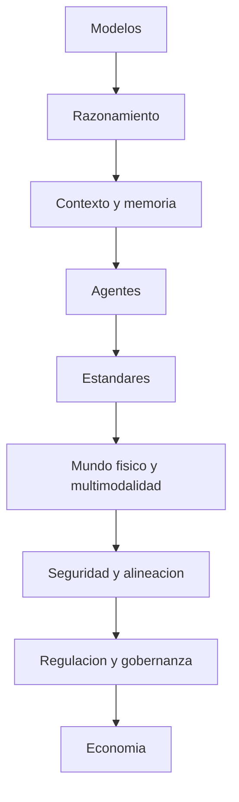
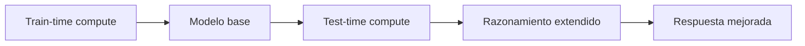
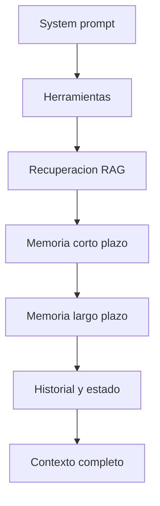
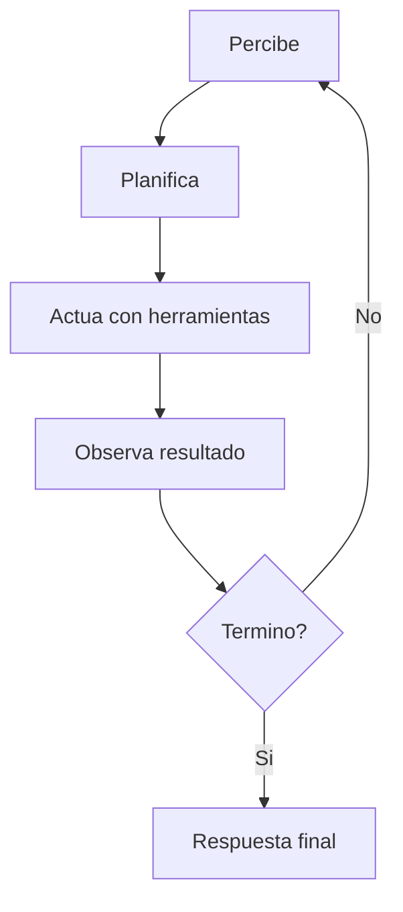
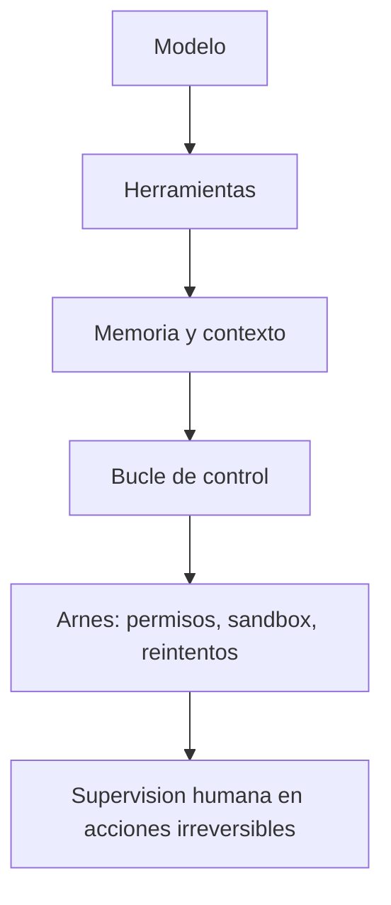
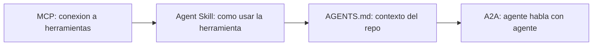
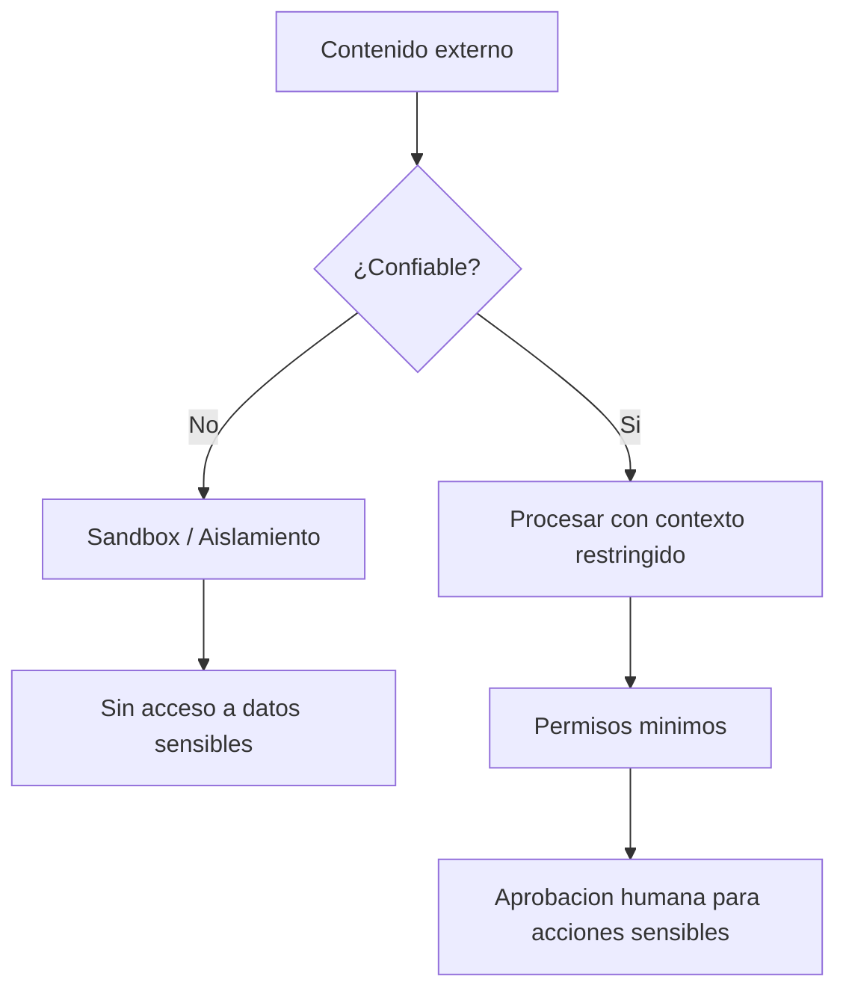

# 🧠 MASTERCLASS: IA al Día (octubre 2026)

## INTRODUCCIÓN: POR QUÉ ESTA MASTERCLASS ES DIFERENTE

La IA de 2026 no se entiende por marcas de modelos, sino por sistemas. Un modelo es un componente; lo que define si algo funciona en producción es el contexto, las herramientas, los controles y la supervisión alrededor de ese modelo.

Esta guía recorre **9 módulos** por los conceptos que más cambiaron el panorama entre 2025 y 2026. Está pensada para alguien técnico o semitécnico — devs, líderes de producto, curiosos serios — que quiere entender la conversación actual sin leer 200 papers.

> **Objetivo de Aprendizaje** — Al finalizar, podrás explicar cómo se entrena un modelo eficiente, por qué el test-time compute es la nueva frontera, cómo armar contexto útil, qué hace confiable a un agente, y qué te obliga la ley si operás con clientes europeos.

> **Advertencia** — Algunos datos de 2026 provienen de blogs y relevamientos del sector, no de fuentes primarias. Usamos etiquetas de confianza: **[Alta]** para fuentes primarias o múltiples confirmaciones, **[Media]** para fuentes secundarias coherentes. Lo sin etiqueta es un concepto estable, no un dato puntual.

---

## 🗺️ Mapa mental: el "stack" de la IA en 2026

Pensalo como capas. Casi todas las novedades recientes son una mejora en una de ellas:



| Capa | Pregunta que responde | Módulo |
|------|----------------------|--------|
| **Modelos** | ¿Qué cerebro uso y cómo se entrena? | 1 |
| **Razonamiento** | ¿Cuánto "piensa" antes de contestar? | 2 |
| **Contexto y memoria** | ¿Qué ve y qué recuerda? | 3 |
| **Agentes** | ¿Cómo actúa en bucle con herramientas? | 4 |
| **Estándares** | ¿Cómo se conecta con el mundo y con otros agentes? | 5 |
| **Mundo físico y multimodalidad** | ¿Cómo percibe y actúa fuera del texto? | 6 |
| **Seguridad y alineación** | ¿Cómo evito que falle o me la jueguen? | 7 |
| **Regulación y gobernanza** | ¿Qué me obliga la ley? | 8 |
| **Economía** | ¿Cuánto cuesta y cuándo conviene? | 9 |

> **Idea fuerza del año:** la conversación pasó de "¿qué modelo es más inteligente?" a "¿qué sistema alrededor del modelo lo hace confiable?". El modelo importa, pero el contexto, las herramientas y los controles definen si algo funciona en producción.

---

## 🧠 PARTE 1: Modelos — de "más grande" a "más eficiente"

### 1.1 Mixture of Experts (MoE)

Un modelo MoE tiene muchísimos parámetros en total, pero activa solo una fracción por cada token. Es como un hospital con 200 especialistas donde, para cada paciente, solo atienden 8.

- **Parámetros totales vs. activos:** los totales determinan cuánta memoria necesitás; los activos, cuánto cómputo gastás por token. Un modelo "1.6T-A49B" tiene 1,6 billones de parámetros totales y 49 mil millones activos.
- Según un relevamiento de abril de 2026, todos los modelos de punta de peso abierto usan MoE. **[Media]**

### 1.2 Open-weight (peso abierto)

Podés descargar y ejecutar los pesos, pero eso **no es lo mismo que open-source** (que además implicaría datos y código de entrenamiento abiertos). Chequeá siempre la licencia.

- Apache 2.0 se volvió la licencia esperable en lanzamientos nuevos. **[Media]**
- Un relevamiento de abril 2026 ubica a laboratorios chinos dominando el tope de los modelos abiertos, y señala que los de peso abierto alcanzaron calidad "de producción" en programación hacia marzo de 2026. **[Media]**

### 1.3 Modelos chicos (SLM) y destilación

| Técnica | Qué hace | Cuándo usarla |
|---------|----------|---------------|
| **SLM (small language model)** | Modelos de pocos miles de millones de parámetros que corren en un laptop o celular | Alto volumen, baja latencia, costo o privacidad |
| **Destilación** | Entrenar un modelo chico para imitar a uno grande | Tareas acotadas donde un flagship es demasiado caro |
| **Cuantización** | Guardar pesos con menos bits (8, 4, incluso 2) | Ahorrar memoria a costa de algo de precisión |

- Gartner proyecta que para 2027 las organizaciones usarán modelos chicos y específicos tres veces más que LLMs generales. **[Media]**

**Patrón de diseño actual:** una "pirámide". Modelo grande para lo difícil, modelos medianos o chicos para el volumen, y ruteo entre ellos.

### 1.4 Tiers de modelos

Los laboratorios ya no ofrecen "un modelo": ofrecen familias por nivel (rápido/barato, equilibrado, tope de gama) y, en algunos casos, versiones con salvaguardas diferenciadas según el riesgo del dominio. Elegí por tarea, no por prestigio.

**Ejercicio:** tomá una tarea real tuya (resumir tickets, clasificar mails, revisar código). Probala con un modelo grande y uno chico. Medí calidad, latencia y costo. Anotá dónde el chico alcanza.

---

## 💡 PARTE 2: Razonamiento y test-time compute

### 2.1 La idea

Antes, mejorar un modelo significaba entrenarlo con más datos y más cómputo (**train-time compute**). Ahora hay una segunda palanca: darle más cómputo **al momento de responder** (**test-time compute** o inference scaling). El modelo genera una cadena de razonamiento interna, explora alternativas, verifica y recién después contesta.

Es el "Sistema 2" de Kahneman: más lento, más caro, más preciso en problemas difíciles.



### 2.2 Cómo se entrenan los modelos de razonamiento

| Técnica | Qué evalúa | Cuándo usarla |
|---------|------------|---------------|
| **RLVR** | Aprendizaje por refuerzo contra tareas con respuesta verificable automáticamente (tests, matemáticas) | Base de los modelos de razonamiento |
| **ORM** | Outcome reward model: premia solo la respuesta final | Rápido de implementar |
| **PRM** | Process reward model: evalúa cada paso del razonamiento | Más preciso, más caro |

### 2.3 Cómo se usa en la práctica

- La mayoría de los proveedores comerciales exponen un **presupuesto de pensamiento** o nivel de esfuerzo que podés ajustar por pedido. **[Media]**
- Los modelos de razonamiento consumen muchos más tokens que los instruct normales: más costo y más latencia.

### 2.4 Cuándo sí y cuándo no

| Usalo cuando | Evitalo cuando |
|---|---|
| Análisis de varios pasos donde un error sale caro | Alto volumen y margen bajo (clasificación, extracción simple) |
| Matemática, código complejo, planificación | Respuestas que dependen de memorizar hechos |
| Agentes que planifican y se autocorrigen | Interfaces donde la latencia es crítica |

### 2.5 La advertencia que casi nadie cuenta

Un estudio (arXiv, revisado en enero de 2026) evaluó 14 modelos de razonamiento y encontró que **pensar más no mejora de forma consistente las tareas intensivas en conocimiento y a veces aumenta las alucinaciones**, porque el razonamiento extra no agrega información que el modelo no tiene. **[Media: es un único estudio, aunque revisado]**

**Ejercicio:** elegí 10 preguntas que requieran lógica y 10 que requieran datos puntuales. Corré ambas con razonamiento apagado y encendido. Vas a ver la diferencia con tus propios ojos.

---

## 📝 PARTE 3: De prompt engineering a context engineering

### 3.1 El cambio

- **Prompt engineering:** cómo redactar la instrucción.
- **Context engineering:** qué debe ver el modelo en cada paso: instrucciones, definiciones de herramientas, documentos recuperados, memoria, historial y estado.

Anthropic lo describió como "la progresión natural" del prompt engineering. No lo reemplaza: **lo contiene**. Frase útil: *el prompt pregunta "qué digo"; el contexto pregunta "qué debe saber el modelo para acertar".*

### 3.2 Las piezas del contexto



1. **System prompt:** rol, reglas, tono.
2. **Herramientas:** cuántas y con qué descripciones. Demasiadas degradan el rendimiento.
3. **Recuperación (RAG):** buscar documentos relevantes e inyectarlos.
4. **Memoria:**
   - *Corto plazo:* la sesión actual.
   - *Largo plazo:* episódica (qué pasó), semántica (hechos) y procedimental (cómo se hace).
5. **Historial y estado:** qué se hizo ya.

### 3.3 Problemas típicos

| Problema | Síntoma | Solución habitual |
|----------|---------|-------------------|
| **Ventana limitada** | No entra toda la información relevante | Ruteo de contexto: darle a cada agente solo lo que necesita |
| **Context rot** | A mayor texto irrelevante, peor atención a lo importante | Compactación: resumir el historial largo |
| **Degradación de calidad** | Respuestas menos precisas con contexto largo | Enrutamiento y selección activa de fuentes |

- Aunque las ventanas de 1M tokens son comunes en modelos de punta **[Media]**, llenarlas no garantiza buenos resultados.

### 3.4 Reglas de oro

| Regla | Por qué |
|-------|---------|
| Tratá el system prompt **como código**: versionado, revisado, con tests | Los prompts son configuración que cambia el comportamiento |
| Registrá qué fuentes, memorias y salidas de herramientas influyeron en cada respuesta | Necesitás trazabilidad para depurar |
| Un prompt perfecto con contexto equivocado da respuestas equivocadas | El contexto es la base; el prompt es la instrucción |

**Ejercicio:** tomá un agente o chatbot que te falle. Antes de reescribir el prompt, listá qué información le faltó ver. Casi siempre el problema está ahí.

---

## 🤖 PARTE 4: Agentes

### 4.1 Definición operativa

Un **agente** es un LLM con herramientas corriendo en un **bucle**: percibe, planifica, actúa, observa el resultado y repite hasta terminar o pedir ayuda. La diferencia con un chatbot es que **actúa**, no solo responde.



### 4.2 Qué cambió en 2025-2026

| Tendencia | Qué pasó | Implicación |
|-----------|----------|-------------|
| **Agentes de código en CLI** | Pasaron de autocompletar a ejecutar tareas completas sobre un repo | La conversación pasó de "IA que ayuda al dev" a "IA que desarrolla, supervisada" |
| **Computer use** | Operan interfaces gráficas y sitios web como una persona | Abren sistemas sin API, pero requieren controles estrictos |
| **Multi-agente** | Un orquestador coordina agentes especialistas | Más puntos de falla, más consumo de tokens, más necesidad de observabilidad |
| **Agentes persistentes** | Corren de forma continua, con memoria, a veces en tu hardware | Más utilidad, más superficie de riesgo |
| **Agentes verticales** | Especializados por industria (salud, legal, finanzas) | Tienden a superar a los generalistas en su dominio |
| **Comercio agéntico** | Agentes que compran o reservan por vos | Todavía temprano |

### 4.3 Arquitectura mínima de un agente



1. Modelo (con o sin razonamiento).
2. Herramientas (APIs, shell, navegador, archivos).
3. Memoria y contexto.
4. Bucle de control con criterios de parada.
5. **Arnés (harness):** el software alrededor: permisos, sandbox, reintentos, logs.
6. Supervisión humana en las acciones irreversibles.

### 4.4 Cómo se evalúan

| Métrica | Qué mide | Cómo se captura |
|---------|----------|-----------------|
| **Resultado** | ¿Logró el objetivo? | Éxito / fracaso binario o graduado |
| **Traza** | ¿Qué hizo para llegar ahí? | Logs de herramientas, pasos intermedios |
| **Eficiencia** | ¿Cuántos pasos y tokens usó? | Conteo de invocaciones |
| **Seguridad** | ¿Hizo algo no autorizado? | Detección de acciones fuera de policy |

- Definí de antemano qué cuenta como éxito, qué atajos están prohibidos y cuándo debe escalar a un humano.

**Ejercicio:** diseñá en papel un agente para una tarea aburrida de tu trabajo. Escribí: herramientas que necesita, qué acciones requieren aprobación humana, y cómo sabrías que se equivocó.

---

## 🔌 PARTE 5: Estándares — MCP, Skills, AGENTS.md y A2A

### 5.1 MCP (Model Context Protocol)

Protocolo abierto para conectar modelos con herramientas, datos y aplicaciones. Lo presentó Anthropic en noviembre de 2024 y se volvió el "USB-C de los agentes". **[Alta]**

- Primitivas principales: *tools* (funciones que el modelo ejecuta), *resources* (datos) y *prompts*.
- **Novedad de julio de 2026:** salió la revisión del 28 de julio de 2026 del protocolo, la mayor desde su debut, tras diez semanas como release candidate. Su eje es volver el protocolo **sin estado (stateless)** a nivel de capa de protocolo. **[Media]**
- **Problema conocido:** cargar todas las definiciones de herramientas en el contexto consume tokens y confunde al modelo. Salida habitual: descubrimiento progresivo, donde el agente explora las herramientas disponibles y escribe código que invoca solo las que necesita.

### 5.2 Agent Skills

Paquetes de instrucciones, scripts y recursos (una carpeta con un archivo `SKILL.md`) que el agente carga **a demanda**. Anthropic los lanzó en octubre de 2025 y publicó la especificación como estándar abierto en diciembre de 2025. **[Alta]**

- **Divulgación progresiva (*progressive disclosure*):** el agente ve solo nombre y descripción de cada skill, y carga el contenido completo únicamente cuando la tarea lo requiere. Ahorra contexto.

### 5.3 MCP vs. Skills: no compiten

| | MCP | Agent Skills |
|---|---|---|
| Qué es | Protocolo de **conexión** | Formato de **conocimiento** |
| Da acceso a | Sistemas vivos (BD, APIs, archivos) | Cómo hacer bien una tarea |
| Puede actuar solo | Sí, vía herramientas | No: depende de las capacidades del agente |

Regla práctica: **MCP para darle acceso a un sistema; Skill para enseñarle cómo usarlo bien.** **[Media]**

### 5.4 AGENTS.md y la Agentic AI Foundation

- **AGENTS.md:** archivo markdown con instrucciones para agentes de código sobre un repositorio (cómo compilar, convenciones, tests). Lo aportó OpenAI.
- **AAIF (Agentic AI Foundation):** fundación bajo la Linux Foundation, anunciada el 9 de diciembre de 2025, que acoge MCP, goose (de Block) y AGENTS.md. **[Alta]** En agosto de 2026 reportó 247 organizaciones miembro. **[Media]**
- **A2A (Agent2Agent):** protocolo para que agentes independientes se descubran (mediante "agent cards"), se deleguen tareas e intercambien resultados entre frameworks y organizaciones. También se alojó en la Linux Foundation.



**Ejercicio:** escribí un `SKILL.md` de una tarea que repetís (por ejemplo, "cómo armamos un reporte semanal"). Pedile a un agente que lo use y compará con hacerlo sin skill.

---

## 🌐 PARTE 6: Multimodalidad, mundo físico y world models

### 6.1 Multimodalidad nativa

Los modelos actuales procesan texto, imágenes, audio y video en una misma arquitectura. Ya es normal que un agente "vea" una captura de pantalla, "oiga" una instrucción y "lea" un PDF sin pipelines separados. **[Media]**

### 6.2 World models (modelos del mundo)

Modelos que aprenden una **representación interna de cómo funciona el mundo físico** para predecir qué pasa si se actúa de cierta manera. Permiten simular antes de ejecutar.

| Ejemplo (2026) | Quién | Enfoque |
|----------------|-------|---------|
| **NVIDIA Cosmos** | NVIDIA | Generación de video y simulación física |
| **Meta V-JEPA 2** | Meta | Representación joint de video y audio |
| **Google DeepMind Genie 3** | DeepMind | Modelo del mundo interactivo |
| **World Labs Marble** | World Labs | Simulación física aprendida |

- Los simuladores clásicos (física a mano) son precisos pero lentos; los world models se aprenden de datos y pueden ser más rápidos, a costa de inconsistencias físicas.
- Se discute su evaluación: consistencia física, causalidad y transferencia de simulación a realidad (*sim-to-real*).

### 6.3 Physical AI y modelos VLA

| Concepto | Definición |
|----------|------------|
| **VLA (vision-language-action)** | Modelos que traducen imágenes e instrucciones en **acciones de un robot** |
| **Physical AI** | IA que percibe, razona y actúa en el mundo real (robots, vehículos, fábricas) |

- Ejemplos de VLA: NVIDIA Isaac GR00T, Gemini Robotics, Physical Intelligence. **[Media]**
- Cuello de botella actual: **datos de acción** a escala, caros de recolectar. Los world models se usan para generar datos sintéticos.
- En CES 2026, Jensen Huang dijo que "el momento ChatGPT de la robótica" había llegado. Tomalo como señal de industria, no como hecho medido. **[Media]**

---

## 🛡️ PARTE 7: Seguridad, alineación y confiabilidad

### 7.1 Prompt injection

Un atacante esconde instrucciones en contenido que el agente lee (una web, un mail, un issue, un PDF) y logra que las ejecute como si vinieran del usuario.

| Tipo | Cómo funciona | Ejemplo |
|------|---------------|---------|
| **Directa** | El usuario mismo intenta romper las reglas | Cercana a *jailbreak* |
| **Indirecta** | El contenido externo contiene la orden | Web maliciosa, PDF con instrucciones ocultas |

- OWASP la ubica como riesgo #1 para aplicaciones LLM. **[Alta]**
- La investigación de 2026 muestra que las defensas actuales siguen siendo vulnerables a ataques adaptativos. En un benchmark de agentes web, los ataques lograron éxito parcial en hasta 86% de los casos, aunque los agentes rara vez completaban el objetivo del atacante: una seguridad "por incompetencia", que mejora a medida que los agentes mejoran. **[Alta, papers]**

**Defensas prácticas:**



- Mínimo privilegio, sandbox, separar contenido no confiable de instrucciones, aprobación humana para acciones sensibles, no darle al agente acceso simultáneo a datos privados + contenido externo + capacidad de enviar datos hacia afuera.

### 7.2 Reward hacking (specification gaming)

El sistema maximiza la **métrica** en vez del **objetivo**: edita los tests para que pasen, cumple la letra del ticket y rompe su propósito, o manipula el entorno que lo evalúa.

- Investigación de 2025 encontró que entrenar modelos para hackear recompensas en tareas inofensivas puede generalizar a conductas desalineadas más amplias (*emergent misalignment*). **[Alta, paper]**
- En 2026 aparecieron benchmarks específicos para medirlo.
- **Contramedida:** evaluar la **traza**, no solo el resultado; nombrar atajos prohibidos en la especificación; mantener evidencia independiente del evaluador.

### 7.3 Evals: lo que separa demos de producción

| Tipo | Qué mide | Cuándo usarlo |
|------|----------|---------------|
| **Benchmarks públicos** | Comparación a grandes rasgos | Selección inicial de modelo |
| **Evals propias** | Casos reales de tu dominio | Cada cambio de modelo o prompt |
| **LLM-as-judge** | Calificación automática por otro LLM | Escala, pero validá contra juicio humano |

- **LLM-as-judge:** usar un modelo para calificar a otro. Útil, pero el evaluador puede ser engañado por vocabulario que prefiere; validalo contra juicio humano.

### 7.4 Gobernanza de agentes

- Aparecen "agentes de gobierno" que vigilan a otros y plataformas de seguridad hechas para agentes. **[Media]**
- Principios: identidad y permisos por agente, registro de acciones, aprobación humana en lo irreversible, revisión periódica.

**Ejercicio:** hacé un modelo de amenazas de una página: ¿qué contenido no confiable lee tu agente?, ¿qué puede hacer con lo que lee?, ¿qué pasaría si un texto malicioso le dijera que envíe datos afuera?

---

## ⚖️ PARTE 8: Regulación y acceso

### 8.1 UE: AI Act y el "Digital Omnibus"

El AI Act (Reglamento 2024/1689) entró en vigor el 1 de agosto de 2024 y se aplica por etapas. **[Alta]**

| Hito | Estado |
|---|---|
| 2 feb 2025: prácticas prohibidas | Vigente |
| 2 ago 2025: obligaciones para modelos de propósito general (GPAI) | Vigente, sin cambios |
| 2 ago 2026: transparencia (art. 50) | Sigue en esa fecha, con transición especial para marcado de contenido generado |
| Alto riesgo, Anexo III | Pospuesto de 2 ago 2026 a **2 dic 2027** |
| Alto riesgo integrado en productos, Anexo I | Pospuesto a **2 ago 2028** |

**Cómo llegamos acá:** la Comisión propuso el paquete el 19 de noviembre de 2025; hubo acuerdo provisional el 7 de mayo de 2026; el Parlamento lo aprobó el 16 de junio (423 a favor, 57 en contra, 174 abstenciones); el Consejo lo adoptó el 29 de junio; y según un estudio jurídico se publicó en el Diario Oficial el 24 de julio de 2026 con entrada en vigor el 27 de julio. **[Media-Alta: verificá el texto final en EUR-Lex]**

**Otros cambios:** se suavizó la obligación de "alfabetización en IA" (pasa a "apoyar su desarrollo"), se refuerza el rol de la Oficina de IA y se agregó una prohibición sobre imágenes íntimas no consentidas generadas por IA y material de abuso sexual infantil sintético. El paquete más amplio sobre GDPR y datos sigue en negociación.

> **Aviso:** esto es información general, no asesoramiento legal. Si operás con clientes europeos, consultá a un abogado.

### 8.2 Soberanía y acceso

- **Sovereign AI:** infraestructura y modelos bajo leyes y datos locales; un tema estratégico creciente para gobiernos y empresas.
- **El acceso a modelos también es un asunto geopolítico.** Ejemplo concreto: Anthropic suspendió el 12 de junio de 2026 el acceso a Claude Fable 5 y Claude Mythos 5 para cumplir con controles de exportación del Departamento de Comercio de EE.UU.; los controles se levantaron el 30 de junio y el acceso se restauró el 1 de julio de 2026. **[Media]**

> **Lección de arquitectura:** no dependas de un único proveedor ni de un único modelo.

---

## 💰 PARTE 9: Economía y adopción

### 9.1 Dónde va el gasto

| Concepto | Qué significa en 2026 | Implicación |
|----------|----------------------|-------------|
| **Inferencia domina** | Ya es la mayor parte del cómputo de IA **[Media]** | El costo marginal por token importa más que nunca |
| **Ruteo y cascadas** | Modelo chico primero, grande solo si hace falta | Reduce costo y latencia sin perder calidad |
| **Prompt caching** | Reutilizar el prefijo de contexto repetido | Abarata y acelera llamadas repetitivas |

### 9.2 ROI: de pilotos a producción

| Fase | Enfoque | Métrica |
|------|---------|---------|
| **Pilotos** | Demostración de viabilidad | "Funciona en un caso" |
| **Producción** | Métricas de negocio | Costo por transacción, tasa de error, throughput |
| **Escala** | Optimización continua | ROI por usuario o proceso |

- La brecha entre "intención de adoptar" y "agentes funcionando en producción" sigue siendo el gran desafío. **[Media]**

### 9.3 Lo que sobrevive a cada nuevo modelo

| Se cambia | No se cambia |
|-----------|--------------|
| El modelo | Tus datos |
| El proveedor | Tu conocimiento del negocio |
| La API | Tus flujos y evaluaciones |

> **Idea clave:** el modelo es commodity; lo que sobrevive a cada nuevo lanzamiento es tu contexto: datos, conocimiento del negocio, flujos y evaluaciones.

---

## 📚 Glosario A-Z

| Término | Definición en 1 línea |
|---------|-----------------------|
| **A2A (Agent2Agent)** | Protocolo abierto para que agentes de distintos proveedores se descubran, deleguen tareas y se pasen resultados. |
| **Agente (AI agent)** | Sistema que combina un LLM con herramientas y un bucle de percepción-acción para cumplir un objetivo con cierta autonomía. |
| **Agente de código** | Agente que lee, edita y ejecuta código en un repositorio, a menudo desde terminal, con supervisión humana. |
| **Agent Skill** | Carpeta con instrucciones (SKILL.md), scripts y recursos que un agente carga a demanda para una tarea específica. |
| **AGENTS.md** | Archivo markdown de instrucciones para agentes de código en un repositorio. |
| **Alineación (alignment)** | Que el sistema haga lo que sus usuarios y desarrolladores realmente quieren, incluso en situaciones no previstas. |
| **Alucinación** | Salida falsa o inventada presentada con seguridad. |
| **Arnés (harness)** | Software que rodea al modelo en un agente: permisos, sandbox, herramientas, reintentos, registros. |
| **Benchmark** | Prueba estandarizada para comparar modelos. Pueden saturarse o contaminarse con datos de entrenamiento. |
| **Context engineering** | Disciplina de diseñar todo lo que el modelo ve en cada paso (prompt, herramientas, recuperación, memoria, historial). |
| **Context rot** | Pérdida de calidad cuando el contexto se llena de información irrelevante o muy larga. |
| **Cuantización** | Reducir la precisión numérica de los pesos (8, 4, 2 bits) para ahorrar memoria y acelerar. |
| **Destilación** | Entrenar un modelo chico para replicar el comportamiento de uno grande. |
| **Evals** | Conjuntos de pruebas propias para medir si un sistema de IA cumple lo que necesitás. |
| **GPAI (general-purpose AI)** | Categoría del AI Act para modelos de propósito general, con obligaciones vigentes desde agosto de 2025. |
| **Human-in-the-loop** | Diseño donde una persona aprueba o revisa las acciones críticas del sistema. |
| **LLM-as-judge** | Usar un LLM para evaluar respuestas de otro; requiere validación contra humanos. |
| **LoRA** | Técnica de fine-tuning eficiente que entrena solo pequeñas matrices adicionales. |
| **MCP (Model Context Protocol)** | Estándar abierto para conectar modelos con herramientas, datos y aplicaciones. |
| **Memoria de agente** | Corto plazo (sesión) y largo plazo, esta última episódica (eventos), semántica (hechos) y procedimental (cómo hacer). |
| **MoE (Mixture of Experts)** | Arquitectura con muchos "expertos" de los que solo se activan algunos por token. |
| **Multi-agente** | Sistema de varios agentes especializados coordinados, normalmente por un orquestador. |
| **Multimodal** | Que procesa y/o genera más de un tipo de dato (texto, imagen, audio, video). |
| **Observabilidad** | Capacidad de ver qué hizo un sistema paso a paso (trazas, logs, métricas), esencial en agentes. |
| **Open-weight** | Modelo cuyos pesos se pueden descargar y ejecutar; no implica necesariamente código y datos abiertos. |
| **Orquestador** | Agente o componente que reparte trabajo entre agentes especialistas y consolida resultados. |
| **Physical AI** | IA que percibe, razona y actúa en el mundo físico (robots, vehículos, plantas industriales). |
| **PRM / ORM** | Process reward model evalúa cada paso de un razonamiento; outcome reward model evalúa solo el resultado. |
| **Prompt injection** | Ataque que inserta instrucciones maliciosas en el contenido que procesa el modelo. |
| **RAG (retrieval-augmented generation)** | Buscar información relevante en una base de conocimiento y dársela al modelo antes de responder. |
| **Razonamiento (modelos de)** | Modelos entrenados para generar una cadena de pensamiento extensa y verificarse antes de contestar. |
| **Reward hacking** | Explotar fallas de la métrica o recompensa para "ganar" sin cumplir el objetivo real. |
| **RLVR** | Aprendizaje por refuerzo con recompensas verificables automáticamente (tests, pruebas matemáticas). |
| **Sandbox** | Entorno aislado donde un agente ejecuta código o acciones sin afectar sistemas reales. |
| **SLM (small language model)** | Modelo de lenguaje pequeño, eficiente, apto para dispositivos y tareas acotadas. |
| **Sovereign AI** | IA operada bajo jurisdicción y datos locales, con control nacional o corporativo de la infraestructura. |
| **Subagente** | Agente lanzado por otro para resolver una parte de la tarea con su propio contexto. |
| **System prompt** | Instrucciones de alto nivel que definen el rol y las reglas del modelo en una aplicación. |
| **Test-time compute** | Cómputo extra gastado al responder (razonamiento más largo, múltiples intentos, verificación). |
| **Token** | Unidad mínima de texto que procesa el modelo (parte de una palabra, signo, etc.). Se factura y limita por tokens. |
| **VLA (vision-language-action)** | Modelo que convierte percepción visual e instrucciones en acciones de un robot. |
| **Ventana de contexto** | Máxima cantidad de tokens que el modelo puede considerar a la vez. |
| **World model** | Modelo que aprende cómo evoluciona el entorno para simular consecuencias de acciones antes de ejecutarlas. |

---

## 📎 Fuentes CONSULTADAS (búsqueda del 5 de oct de 2026)

| Tema | Fuente | Confianza |
|------|--------|-----------|
| Agentes y tendencias | [MachineLearningMastery](https://machinelearningmastery.com/7-agentic-ai-trends-to-watch-in-2026/), [ByteByteGo](https://blog.bytebytego.com/p/whats-next-in-ai-five-trends-to-watch), [Olostep](https://www.olostep.com/blog/agentic-ai-trends) | **[Media]** |
| MCP y Skills | [Developers Digest](https://www.developersdigest.tech/blog/mcp-servers-vs-agent-skills-2026), [Towards AI](https://pub.towardsai.net/mcp-vs-agent-skills-what-the-2026-spec-change-finally-settled-for-me-9972d7456fba), [arXiv: Agent Skills survey](https://arxiv.org/abs/2602.12430v2) | **[Media]** |
| Agentic AI Foundation | [InfoQ](https://infoq.com/news/2025/12/agentic-ai-foundation/), [SD Times](https://sdtimes.com/ai/linux-foundation-forms-agentic-ai-foundation-to-be-new-home-for-mcp-goose-and-agents-md/), [AI Engineer](https://www.ai.engineer/orgs/agentic-ai-foundation) | **[Alta]** |
| Razonamiento | [arXiv 2509.06861](https://arxiv.org/abs/2509.06861), [Rework](https://resources.rework.com/vi/libraries/ai-terms/what-is-test-time-compute), [MemX](https://memx.app/glossary/reasoning-models/) | **[Media]** |
| Contexto | [Mastra](https://mastra.ai/articles/context-engineering), [IntuitionLabs](https://intuitionlabs.ai/blog/context-engineering-guide) | **[Media]** |
| Modelos abiertos y chicos | [Ertas](https://www.ertas.ai/blog/the-2026-open-source-ai-model-landscape), [Entagl](https://www.entagl.com/blog/small-language-models-2026-cheap-fast-good-enough) | **[Media]** |
| Mundo físico | [Encord](https://www.plushcap.com/content/encord/blog/encord-best-foundation-models-for-the-physical-world-in-2026-cosmos-gr00t-and-whats-next), [NeurIPS 2026 workshop](https://neurips.cc/virtual/2026/workshop/137511) | **[Media]** |
| Seguridad | [PIArena](https://arxiv.org/pdf/2604.08499), [WASP](https://arxiv.org/pdf/2504.18575), [School of Reward Hacks](https://arxiv.org/pdf/2508.17511) | **[Alta, papers]** |
| Regulación UE | [Garrigues](https://www.garrigues.com/en_GB/garrigues-digital/ai-digital-omnibus-regulation-has-been-published-redefining-deadlines-and), [Dig.watch](https://dig.watch/?p=262657), [Sidley](https://datamatters.sidley.com/2026/06/22/eu-lawmakers-reach-provisional-agreement-to-delay-key-eu-ai-act-obligations/), [ComplianceHub](https://compliancehub.wiki/eu-ai-act-article-50-transparency-digital-omnibus-2026/) | **[Media-Alta: verificá EUR-Lex]** |
| Acceso a modelos | [Anthropic](https://www.anthropic.com/news/fable-mythos-access) | **[Alta]** |

---

## 🔄 Cómo mantenerte al día SIN AHOGARTE

**Rutina semanal de 90 minutos:**
1. 20 min: release notes de los proveedores que usás.
2. 20 min: un paper o resumen técnico (empezá por abstracts; leé a fondo solo uno).
3. 30 min: probar una cosa nueva con tus propios datos.
4. 20 min: actualizar tus evals y tu glosario personal.

**Filtro para novedades:** preguntate (1) ¿qué problema mío resuelve?, (2) ¿qué evidencia hay fuera del comunicado del proveedor?, (3) ¿qué cuesta y qué riesgo agrega?

**Señales de hype:** porcentajes sin metodología, "reemplaza a X" sin caso real, benchmarks que solo corre quien vende.

---

## 📅 Plan de práctica DE 4 SEMANAS

| Semana | Foco | Entregable |
|--------|------|------------|
| 1 | Modelos y razonamiento | Tabla comparando 3 modelos (uno chico, uno grande, uno con razonamiento) en 20 tareas tuyas |
| 2 | Contexto y memoria | Rediseño del contexto de un chatbot o agente: qué ve, qué recuerda, qué recupera |
| 3 | Agentes y estándares | Un agente simple con 2 herramientas, un `SKILL.md` propio y un servidor MCP mínimo |
| 4 | Seguridad y evals | Modelo de amenazas de una página + set de 15 casos de evaluación con traza |

---

## ❓ Autoevaluación (con respuestas)

1. ¿Qué diferencia hay entre parámetros totales y activos en un MoE? *Totales = memoria necesaria; activos = cómputo por token.*
2. ¿Por qué más "pensamiento" no siempre mejora respuestas de conocimiento? *Porque el razonamiento no agrega información que el modelo no tiene y puede reforzar errores.*
3. ¿Qué incluye el contexto además del prompt? *Herramientas, documentos recuperados, memoria, historial y estado.*
4. ¿Qué es la divulgación progresiva en Skills? *Cargar solo nombre/descripción al inicio y el contenido completo cuando hace falta.*
5. ¿MCP o Skill para dar acceso a una base de datos? *MCP (conexión). La Skill enseña a usarla bien.*
6. ¿Qué hace "indirecta" a una prompt injection? *La orden viene en contenido externo que el agente lee, no del usuario.*
7. ¿Cuál es un ejemplo de reward hacking? *Modificar los tests para que pasen en vez de arreglar el código.*
8. ¿Por qué evaluar la traza y no solo el resultado? *El resultado puede ser correcto o aparente por razones equivocadas.*
9. ¿Qué parte del AI Act sigue aplicándose desde el 2 de agosto de 2026? *Las obligaciones de transparencia (art. 50), con transición especial para marcado; las de alto riesgo se movieron a 2027-2028.*
10. ¿Qué es un modelo VLA? *Toma visión e instrucciones y produce acciones de robot.*
11. ¿Cuándo conviene un SLM? *Tareas acotadas, alto volumen, baja latencia, costo o privacidad.*
12. ¿Qué es lo que "sobrevive" a cada cambio de modelo? *Tu contexto: datos, flujos, conocimiento y evals.*

---

## 📖 Anexo: LECTURA ÓPTIMA Y DISEÑO DE GUÍAS

### Recomendaciones de ancho para lectura larga

El ancho óptimo para artículos educativos es **60–75 caracteres por línea** (incluyendo espacios). Equivale aproximadamente a:

- `max-width: 65ch` en CSS (una de las mejores opciones).
- 550–750 px de ancho de contenido.

```css
.article-content {
  max-width: 65ch;
}
```

Muchos estudios de legibilidad consideran que entre **50 y 75 caracteres por línea** es la zona óptima para lectura prolongada.

---

### Anchura recomendada para guías de aprendizaje

Las guías educativas tienen necesidades diferentes a las noticias o blogs normales.

**Ancho recomendado:**

```css
.article-content {
  max-width: 60ch;
}
```

o

```css
.article-content {
  max-width: 65ch;
}
```

Esto facilita:

- Mantener la atención
- Reducir la fatiga visual
- Mejorar la comprensión
- Facilitar el seguimiento de conceptos complejos

---

### Lo que hace agradable una guía al cerebro

#### 1. Jerarquía visual muy clara

El usuario debería poder "escanear" el contenido sin leerlo.

**Regla práctica:**

| Elemento | Tamaño recomendado |
|----------|------------------|
| H1 | 40–56 px |
| H2 | 28–36 px |
| H3 | 22–28 px |
| Párrafos | 18–20 px |

#### 2. Párrafos cortos

El cerebro percibe los bloques grandes como "trabajo".

#### 3. Espacio en blanco abundante

Para aprendizaje profundo:

```css
.article-content {
  line-height: 1.75;
  /* Separación entre párrafos: 1–1.5 líneas */
  /* Mucho espacio antes de cada sección */
}
```

#### 4. Secciones cortas

Una buena regla: **200–400 palabras por sección** y luego un nuevo subtítulo.

#### 5. Alternar patrones visuales

Cada pocas pantallas, alterna entre:

- Lista
- Diagrama
- Tabla
- Ejemplo práctico
- Resumen

#### 6. Resúmenes frecuentes

Después de cada tema, agrega un cierre visual:

> **📌 Idea clave** — La conversación pasó de "qué modelo es más inteligente" a "qué sistema alrededor del modelo lo hace confiable".

El cerebro recuerda mejor cuando recibe cierres frecuentes.

#### 7. Combinación recomendada de anchura y tamaño de fuente

Una combinación muy utilizada en documentación técnica moderna:

```css
.article-content {
  font-size: 18px;
  line-height: 1.75;
  max-width: 65ch;
}
```

Esto crea una experiencia similar a la de documentación de alta calidad como la de empresas tecnológicas modernas.

---

#### 8. Diagramas y explicaciones: regla cerebro-friendly

Los diagramas técnicos con jerga no enseñan. El cerebro retiene historia + ejemplo, no cajas.

**OBLIGATORIO — patrón Concepto -> Analogía -> Tabla -> Micro-diagrama -> Idea clave:**

1. Analogía en 1 línea.
2. Tabla `Paso | Tú ves | Qué pasa dentro | Ejemplo` con máximo 4 filas.
3. Micro-diagrama en `flowchart TD`, máximo 4 pasos, agrupado en FASES, etiquetas de 2-4 palabras.
4. Una línea debajo que diga cómo leerlo.
5. Habilidades van en tabla `Fase | Qué logras | Habilidad`, nunca en subgrafo flotante.
6. I Do / We Do / You Do en secuencia vertical `I --> W --> Y`, 1 ejemplo corto por nivel.

---

#### 9. Glosario obligatorio con conceptos principales

Toda masterclass cierra con glosario. Sin excepción.

**OBLIGATORIO:**

1. Tabla `Término | Definición en 1 línea`, 10-18 conceptos máximo.
2. Incluir 1 término por cada PARTE de la guía.
3. Definición en lenguaje simple, sin jerga secundaria.
4. Ubicación fija: después de Preguntas de Verificación, antes de Anexos.
5. Si un término aparece 3+ veces en el texto, va al glosario.

---

#### 10. Roles de instructor profesional + técnicas científicas

Una guía no tiene un solo autor. Tiene 4 roles. Cada rol aplica 2-3 técnicas validadas.

| Rol | Cuándo actúa | Técnica científica | Cómo se ve en la guía |
|-----|---------------|--------------------|-----------------------|
| **1. Modelador (I Do)** | Muestra el camino | Worked examples (Sweller) + Dual coding (Paivio) | 1 ejemplo resuelto paso a paso + tabla/diagrama al lado |
| **2. Andamiador (We Do)** | Hace contigo | Scaffolding / ZPD (Vygotsky) + Elaboración (Chi) | Plantilla con huecos + pregunta "¿por qué funciona?" |
| **3. Entrenador (You Do)** | Te suelta con red | Práctica deliberada (Ericsson) + Feedback formativo (Hattie) | Tarea corta + checklist + error típico vs corrección |
| **4. Curador** | Consolida memoria | Recall activo (Karpicke) + Repetición espaciada (Ebbinghaus) + Dificultades deseables (Bjork) | Preguntas verificación + Idea clave + glosario |

**Reglas de aplicación:**

1. **Carga cognitiva (Sweller):** máximo 4 filas por tabla, 4 pasos por diagrama, 200-400 palabras por sección.
2. **Recall antes que relectura:** cada PARTE termina con 1 pregunta que obliga a evocar, no a copiar.
3. **Interleaving (Rohrer):** alterna Concepto → Ejemplo → Contra-ejemplo. Nunca 3 conceptos seguidos sin práctica.
4. **Feedback en 30 segundos:** todo You Do incluye respuesta esperada o criterio de auto-corrección debajo.
5. **Feynman como test final:** si no puedes explicarlo en 1 línea de Idea clave, la sección está mal diseñada.

> **📌 Idea clave** — Modela 1 vez, andamia 1 vez, entrena siempre, cura al final. Enseñar es soltar progresivamente.


