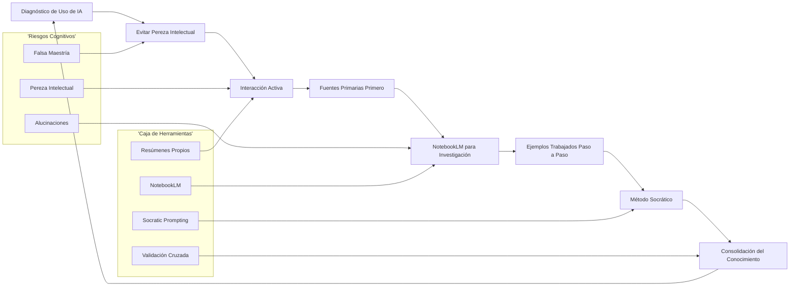
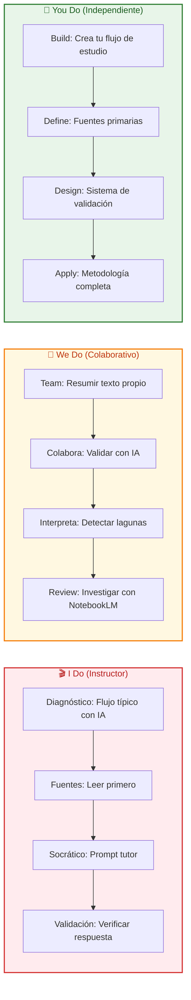

# IA como Herramienta de Aprendizaje: La Masterclass para No Dejar que laIA Piense por Ti 🤖📚

## INTRODUCCIÓN: POR QUÉ ESTA MASTERCLASS ES DIFERENTE

La inteligencia artificial ha democratizado el acceso al conocimiento. Cualquiera puede pedirle a unaIA que resuelva un problema, genere un resumen o explique un concepto en segundos. Pero existe un peligro silencioso: la **falsa maestría**.

Obtener soluciones rápidas genera una alta productividad aparente, pero si no va acompañada de euerzo cognitivo propio, el conocimiento no se arraiga. Puedes tener la respuesta correcta sin haber comprendido nada.

Esta masterclass no te enseña a evitar laIA. Te ensaea a **utilizarla como herramienta de aprendizaje efectiva**, sin delegarle tu proceso de pensamiento.

> **🎯 Objetivo de Aprendizaje** — Al final de esta guía, tendrás 6 estrategias prácticas para integrar laIA en tu estudio sin caer en pereza intelectual, evitando alucinaciones y construyendo conocimiento sólido.

> **⚠️ Advertencia educativa** — Este contenido es formativo. LaIA es un complemento, no un sustituto del pensamiento crítico. Verifica siempre la información con fuentes primarias.

---

## 🗺️ MAPA DEL WORKFLOW DE APRENDIZAJE CON IA



| Fase | Pregunta que responde | Output principal |
|------|-----------------------|------------------|
| **Diagnóstico** | ¿Cómo estoy usando laIA actualmente? | Mapa de hábitos deIA |
| **Pereza** | ¿En qué momento laIA está pensando por mí? | Detección de falsa maestría |
| **Fuentes** | ¿Qué información primaria debo consumir primero? | Base de conocimiento propio |
| **Interacción** | ¿Cómo vuelvo activa mi interacción con laIA? | Flujo inverso de trabajo |
| **NotebookLM** | ¿Cómo investigo sin alucinaciones? | Base indexada de fuentes |
| **Ejemplos** | ¿Cómo desgloso conceptos técnicos complejos? | Comprensión paso a paso |
| **Socrático** | ¿Cómo uso laIA para evaluar mi comprensión? | Detección de lagunas |
| **Consolidación** | ¿Cómo sé que realmente aprendí? | Evidencia tangible de dominio |



---

## 🚨 PARTE 1: EL RIESGO DE LA PRODUCTIVIDAD SIN APRENDIZAJE — LA FALSA MAESTRÍA

### 1.1 La Trampa de la Respuesta Inmediata 🕳️

LaIA ofrece respuestas instantández. Esto genera una sensación de progreso que no siempre coincide con la realidad del aprendizaje.

```
Productividad sin aprendizaje:
// Pido a laIA un resumen de un capítulo
// Leo el resumen generado por laIA
// Siento que entendí el concepto
// ... pero mi cerebro no hizo el trabajo de conexión
// Cuando me preguntan, no puedo explicarlo

La verdad:
// La productividad no es aprendizaje
// El conocimiento no se transfiere
// Se construye con esfuerzo cognitivo
// LaIA puede acelerar, no reemplazar
```

> **💡 Concepto Clave**: LaIA es un **potenciador de aprendizaje**, no un sustituto del euerzo humano necesario para crecer profesionalmente.

### 1.2 La Falsa Maestría: Por Qué Sentimos que Sabemos Cuando No Sabemos 🎭

Existe un fenómeno llamado "ilusión de competencia": cuando consumes información procesada por otra persona (o por unaIA), tu cerebro genera la sensaciónde haber aprendido.

```
Mecanismo de la falsa maestría:
// 1. LaIA genera texto coherente
// 2. Leo el texto y reconozco las palabras
// 3. Mi cerebro confunde "reconocimiento" con "comprensión"
// 4. Siento confianza sin haber hecho el trabajo mental
// 5. Cuando me enfrento al problema real, fallo
```

### 1.3 Tabla de Detección de Falsa Maestría 🚩

| Señal de Alerta | Síntoma Real | Prueba de Verificación |
|-----------------|--------------|------------------------|
| **Reconozco pero no explico** | Puedo leer pero no enseñar | Intenta explicarlo sin apuntes |
| **Confianza excesiva** | Siento que sé mucho | Responde una pregunta fuera de contexto |
| **Dependencia deIA** | SinIA no puedo empezar | Resuelve sinIA primero |
| **Respuesta genérica** | Lo que digo es vago | Pide ejemplos concretos |
| **No puedo conectar** | Veo conceptos aislados | Explica la relación entre dos conceptos |

### 1.4 Código de Detección de Pereza Intelectual 🖥️

```python
from dataclasses import dataclass
from datetime import date
from typing import Optional

@dataclass
class IALearningSession:
    topic: str
    date: str
    used_ai_first: bool
    read_primary_source: bool
    asked_ai_to_summarize: bool
    asked_own_summary_validation: bool
    socratic_questions_asked: int
    can_explain_without_help: bool

class IntellectualLazinessDetector:
    def __init__(self):
        self.sessions: list[IALearningSession] = []
    
    def log_session(self, topic: str, used_ai_first: bool, 
                    read_primary: bool, ai_summarized: bool,
                    own_summary_validated: bool, socratic_count: int,
                    can_explain: bool) -> dict:
        session = IALearningSession(
            topic=topic,
            date=date.today().isoformat(),
            used_ai_first=used_ai_first,
            read_primary_source=read_primary,
            asked_ai_to_summarize=ai_summarized,
            asked_own_summary_validation=own_summary_validated,
            socratic_questions_asked=socratic_count,
            can_explain_without_help=can_explain
        )
        self.sessions.append(session)
        return self._risk_assessment(session)
    
    def _risk_assessment(self, session: IALearningSession) -> dict:
        risk_score = 0
        if session.used_ai_first:
            risk_score += 3
        if not session.read_primary_source:
            risk_score += 2
        if session.asked_ai_to_summarize:
            risk_score += 2
        if session.socratic_questions_asked == 0:
            risk_score += 1
        if not session.can_explain_without_help:
            risk_score += 3
        
        level = "ALTO" if risk_score >= 6 else "MODERADO" if risk_score >= 3 else "BAJO"
        return {
            "topic": session.topic,
            "risk_score": risk_score,
            "risk_level": level,
            "recommendation": self._get_recommendation(level)
        }
    
    def _get_recommendation(self, level: str) -> str:
        recommendations = {
            "ALTO": "Cierra laIA. Lee la fuente primaria. Haz tu resumen. Vuelve cuando tengas algo propio que validar.",
            "MODERADO": "Estás en el límite. Asegúrate de hacer tu resumen ANTES de pedir ayuda a laIA.",
            "BAJO": "Buen flujo. Sigue preguntando de forma socrática para detectar lagunas."
        }
        return recommendations.get(level, "")
```

---

## 📖 PARTE 2: LAS 6 ESTRATEGIAS DE APRENDIZAJE CON IA — DEL CONSUMIDOR AL CREADOR

### 2.1 Estrategia 1: Las Fuentes Primarias Primero 📜

Leer las fuentes primarias antes de pedir resúmenes a laIA es el hábito que separa el aprendizaje superficial del aprendizaje profundo.

```
Flujo incorrecto:
// 1. Encuentro un tema nuevo
// 2. Pido a laIA que me explique todo
// 3. Leo la respuesta generada
// 4. Siento que aprendí
// 5. ... pero no puedo conectar con nada previo

Flujo correcto:
// 1. Encuentro un tema nuevo
// 2. Busco y leo 1-2 fuentes primarias (artículos, papers, docs oficiales)
// 3. Tomo notas propias, con mis palabras
// 4. Pido a laIA que valide mi comprensión
// 5. Corrijo lo que no entendí bien
// 6. Mi conocimiento ahora tiene raíces
```

> **🎯 Regla de Oro**: No le pidas a laIA que lea por ti. LaIA valida, laIA complementa, pero laIA no reemplaza tu primera interacción con la fuente.

### 2.2 Estrategia 2: Interacción Activa — El Flujo Inverso 🔄

En lugar de pedirle a laIA que genere un resumen genérico, haz tu propio resumen primero y luego pídele a laIA que lo valide o responda preguntas específicas.

```
Flujo activo:
// Paso 1: Lees el material original
// Paso 2: Escribes TU resumen (sinIA)
// Paso 3: Pides a laIA: "¿Qué me faltó? ¿Dónde me equivoqué?"
// Paso 4: LaIA señala lagunas específicas
// Paso 5: Corriges tu resumen
// Paso 6: Tu comprensión se profundiza

Vs. Flujo pasivo:
// Paso 1: Lees el material original (o ni eso)
// Paso 2: Pides resumen a laIA
// Paso 3: Lees el resumen de laIA
// Paso 4: ... y sigues sin procesamiento propio
```

### 2.3 Tabla de Flujos de Interacción

| Flujo | Responsable del Pensamiento | Retención | Comprensión Profunda | Riesgo de Alucinación |
|-------|----------------------------|-----------|----------------------|----------------------|
| ResumenIA directo | IA | Baja | Baja | Alto |
| Fuente primero,IA después | Usuario + IA | Alta | Alta | Bajo |
| Resumen propio + validaciónIA | Usuario + IA | Muy alta | Muy alta | Muy bajo |
| Preguntas específicas aIA | Usuario guiado | Alta | Alta | Bajo |
| Método Socrático conIA | Usuario + IA | Muy alta | Muy alta | Muy bajo |

### 2.4 Estrategia 3: NotebookLM — Investigación sin Alucinaciones 🔍

NotebookLM es una herramienta gratuita de Google que indexa fuentes específicas (documentos, videos, repositorios) y permite consultas basadas exclusivamente en esa informació, reduciendo drásticamente las alucinaciones.

```
Qué hace NotebookLM:
// Indexa SOLO las fuentes que tú subes
// Responde basado en TU informació, no en todo internet
// Genera resúmenes, FAQ, guías de estudio
// Permite preguntar sobre contenido específico
// Ideal para: papers, documentació, videos de curso

Flujo recomendado:
// 1. Subes tus fuentes (PDF, audio, texto, video)
// 2. Dejas que indexe
// 3. Preguntas específicas sobre el contenido
// 4. LaIA responde con citas a tus fuentes
// 5. Tú verificas y complementas
```

### 2.5 Estrategia 4: Ejemplos Trabajados Paso a Paso 🧮

Para temas técnicos, pedirle a laIA que desglose algoritmos o problemas paso a paso reduce la carga cognitiva sin reducir el aprendizaje.

```
Pedir ejemplos trabajados:
// ❌ "Explícame el algoritmo de QuickSort"
// ✅ "Muéstrame QuickSort paso a paso con el array [5, 3, 8, 1, 2]"
// ✅ "Para cada paso: escribe el array actual, el pivote, las particiones"

Pedir variaciones:
// "Ahora aplica QuickSort al array [9, 4, 6, 2, 7]"
// "¿Qué pasa si el array ya está ordenado?"
// "¿Y si todos los elementos son iguales?"

Pedir visualización:
// "Genera un diagrama de esta iteració"
// "Muestra el estado de la pila en cada llamada recursiva"
```

### 2.6 Estrategia 5: El Método Socrático con IA 🎓

Configura laIA para que actúe como un tutor socrático que, mediante preguntas, ayuda a evaluar si realmente se ha comprendido un concepto o a identificar lagunas.

```
Configuración del tutor socrático:
// Rol: "Actúa como tutor socrático de [tema]"
// Regla 1: No des la respuesta directamente
// Regla 2: Haz preguntas que me hagan pensar
// Regla 3: Si me equivoco, señálalo con otra pregunta
// Regla 4: Solo dame la respuesta después de 3 intentos míos

Ejemplo de prompt:
```
Actúa como tutor socrático de machine learning.
Estoy estudiando el concepto de gradient descent.
No me des la definición directamente.
Hazme preguntas que me ayuden a descubrir:
1. Qué es una función de costo
2. Por qué queremos minimizarla
3. Qué significa "descenso" en el gradiente
Si me equivoco, usa contraejemplos.
Solo explica formalmente después de que yo haya intentado 3 veces.
```
```

### 2.7 Estrategia 6: Validación Cruzada y Cierre de Ciclo 🔄

Ninguna respuesta de laIA debe aceptarse como verdad absoluta. La validación cruzada con fuentes primarias y la capacidad de explicar el concepto sin ayuda son los cierres de ciclo que consolidan el conocimiento.

```
Checklist de validació:
// 1. ¿Puedo explicarlo sin ver la respuesta?
// 2. ¿Puedo aplicar el concepto a un problema nuevo?
// 3. ¿Puedo enseñárselo a otra persona?
// 4. ¿La respuesta de laIA coincide con mis fuentes?
// 5. ¿Identifico las limitaciones de este conocimiento?

Cierre de ciclo:
// Cierras el ciclo cuando TRANSFIERES el conocimiento
// Explicarlo a alguien más
// Escribir un tutorial propio
// Aplicarlo en un proyecto real
```

---

## 🧠 PARTE 3: LA NEUROCIENCÍA DETRÁS DEL APRENDIZAJE CON IA

### 3.1 Por Qué laIA Hace que el Cerebro se Relaje Demasiado 🧠😴

```
Procesamiento propio:
// Esfuerzo cognitivo → Conexiones neuronales → Memoria duradera
// Mientras más trabajo mental hagas, más se fortalece la red

Procesamiento conIA:
//IA genera respuesta → Cerebro la consume → Poco esfuerzo cognitivo
// La red neuronal no se fortalece igual
// El conocimiento se desvanece rápidamente

La soluciopara usarIA sin pagar este costo:
// Haz el trabajo mental PRIMERO
// UsaIA para validar, no para generar desde cero
// SiIA te da la respuesta, TU haces el ejercicio de entenderla
```

### 3.2 Código de Evaluación de Sesiones de Estudio 📊

```python
import json
from datetime import date
from dataclasses import dataclass, field
from typing import Optional

@dataclass
class StudySession:
    topic: str
    date: str
    primary_source_read: bool
    own_summary_before_ai: bool
    ai_used_for_validation: bool
    socratic_mode: bool
    can_explain_now: bool
    taught_someone: bool

class LearningQualityAnalyzer:
    def __init__(self):
        self.sessions: list[StudySession] = []
    
    def log_study(self, topic: str, read_primary: bool, own_summary: bool,
                  ai_validated: bool, socratic: bool, can_explain: bool,
                  taught: bool) -> dict:
        session = StudySession(
            topic=topic,
            date=date.today().isoformat(),
            primary_source_read=read_primary,
            own_summary_before_ai=own_summary,
            ai_used_for_validation=ai_validated,
            socratic_mode=socratic,
            can_explain_now=can_explain,
            taught_someone=taught
        )
        self.sessions.append(session)
        return self._learning_score(session)
    
    def _learning_score(self, session: StudySession) -> dict:
        score = 0
        if session.primary_source_read:
            score += 2
        if session.own_summary_before_ai:
            score += 2
        if session.ai_used_for_validation:
            score += 1
        if session.socratic_mode:
            score += 2
        if session.can_explain_now:
            score += 2
        if session.taught_someone:
            score += 1
        
        max_score = 10
        percentage = (score / max_score) * 100
        
        level = "Excelente" if percentage >= 80 else "Bueno" if percentage >= 60 else "Regular" if percentage >= 40 else "Insuficiente"
        
        return {
            "topic": session.topic,
            "score": score,
            "max_score": max_score,
            "percentage": round(percentage, 1),
            "level": level
        }
    
    def weekly_report(self) -> dict:
        if not self.sessions:
            return {"error": "No data yet"}
        recent = self.sessions[-7:]
        scores = [self._learning_score(s)["score"] for s in recent]
        avg = sum(scores) / len(scores)
        return {
            "week_avg_score": round(avg, 1),
            "max_possible": 10,
            "topics_covered": len(set(s.topic for s in recent)),
            "sessions_analyzed": len(recent)
        }
```

---

## ⚡ PARTE 4: LOS TRES MODOS DE APRENDIZAJE — I DO / WE DO / YOU DO

### 4.1 I Do — Flujo Correcto de Aprendizaje con IA 🎬

**Objetivo**: experimentar el flujo completo de aprendizaje profundo conIA.

| Paso | Acción | Resultado esperado |
|------|--------|--------------------|
| 1 | Lee la fuente primaria (artículo, paper, doc) | Base propia de conocimiento |
| 2 | Escribe TU resumen sinIA | Procesamiento cognitivo activo |
| 3 | Pide a laIA validar tu resumen | Retroalimentació especifica |
| 4 | Corrige tu resumen con feedback | Correcció de errores conceptuales |
| 5 | Pide a laIA que te haga preguntas socráticas | Evaluació de comprensión |
| 6 | Responde sin ver | Prueba de dominio real |

```python
# Ejemplo de sesion de estudio usandoIA
analyzer = LearningQualityAnalyzer()

result = analyzer.log_study(
    topic="Gradient Descent",
    read_primary=True,
    own_summary=True,
    ai_validated=True,
    socratic=True,
    can_explain_now=True,
    taught_someone=False
)

print(json.dumps(result, indent=2))
```

> **🎥 Interpretación guiada**: Después de completar el flujo, intenta explicar el concepto a alguien sin consultar tus apuntes. Si no puedes, volver a la fuente primaria.

### 4.2 We Do — Investigación Colaborativa con NotebookLM 🤝

**Escenario**: un equipo de estudio quiere aprender sobre un tema técnico nuevo usandoIA como herramienta de apoyo.

**Flujo colaborativo**:

| Paso | Acción del Equipo | Rol de laIA |
|------|------------------|-------------|
| 1 | Cada miembro lee una secció del material | — |
| 2 | Cada uno escribe su resumen individual | — |
| 3 | Compilan los resúmenes en un documento grupal | — |
| 4 | Suben el documento a NotebookLM | Indexa las fuentes |
| 5 | Cada miembro hace una pregunta específica | Responde con base en el material |
| 6 | El equipo identifica lagunas comunes | Ayuda a delimitarlas |
| 7 | Cada uno ensea una parte a los demás | Consolida el aprendizaje |

### 4.3 You Do — Construye tu Sistema de Aprendizaje con IA 🔨

**Tarea**: crea tu sistema personalizado.

| Fase | Acción | Entregable |
|------|--------|-----------|
| **Diagnóstico** | Identifica 3 temas que hayas estudiado conIA recientemente | Mapa de uso actual |
| **Fuentes** | Para cada tema, encuentra 1 fuente primaria confiable | Base de conocimiento propio |
| **Resúmenes** | Escribe tu resumen de cada tema antes de usarIA | Comprensión personal |
| **Validación** | Pide a laIA que critique tu resumen | Retroalimentació especifica |
| **Socrático** | Configura a laIA como tutor para cada tema | Preguntas generadas |
| **Tracking** | Implementa LearningQualityAnalyzer por 30 días | Datos de calidad de aprendizaje |

---

## 📓 PARTE 5: ANEXOS Y RECURSOS

### Anexo A: Plantilla de Sesió de Estudio con IA 📝

```
TEMA: [Nombre del tema]

FUENTE PRIMARIA:
- Título: [Título del artículo/paper/documento]
- Autor/Fuente: [Nombre del autor o site oficial]
- Páginas leídas: [Rango o secciones]
- Notas propias: [Tus notas SIN ayuda deIA]

MI RESUMEN (antes deIA):
[Escribe 3-5 párrafos con tus propias palabras]

VALIDACIÓ CON IA:
- Pregunta específica que hice: [Tu pregunta]
- Respuesta de laIA: [Resumen de la respuesta]
- Correcciones a mi resumen: [Qué cambié]

PREGUNTAS SOCRÁTICAS:
1. [Pregunta 1 que me hizo laIA]
2. [Pregunta 2]
3. [Pregunta 3]

PUEDO EXPLICARLO SIN AYUDA:
[ ] Sí
[ ] No - necesito repasar

EVIDENCIA DE DOMINIO:
[Escribe una explicació que le darias a alguien que no sabe nada del tema]
```

### Anexo B: Checklist de Aprendizaje Consciente con IA ✅

| Item | Check | Frecuencia |
|------|-------|-----------|
| Fuente primaria leída antes deIA | ☐ | Cada sesión |
| Resumen propio antes de pedir ayuda | ☐ | Cada sesión |
| IA usada para validar, no generar | ☐ | Cada sesión |
| Preguntas socráticas realizadas | ☐ | Cada sesión |
| Respuesta explicada sin consultar | ☐ | Cada sesión |
| Concepto ensedo a alguien más | ☐ | Semanal |
| NotebookLM configurado con fuentes | ☐ | Por proyecto |
| Sesión registrada en LearningQualityAnalyzer | ☐ | Cada sesión |

### Anexo C: Prompts Útiles por Estrategia ⚡

**Validació de resumen propio:**
```
Acabo de leer sobre [tema]. Este es mi resumen:
"[tu resumen aquí]
Por favor:
1. Señala errores conceptuales
2. Indica qué me faltó cubrir
3. Propón 2 preguntas para verificar mi comprensión
```

**Tutor socrático:**
```
Actúa como tutor de [tema]. No des respuestas directas.
Hazme preguntas que me ayuden a descubrir:
- [concepto 1]
- [concepto 2]
- [cómo se relacionan]

Si me equivoco, usa contraejemplos.
Solo explícame formalmente después de 3 intentos.
```

**NotebookLM - Análisis de fuentes:**
```
Basándote en los documentos subidos, responde:
1. ¿Cuáles son los 3 conceptos clave?
2. ¿Cómo se relacionan entre sí?
3. Dame un ejemplo práctico de aplicación
4. Señala si hay contradicciones entre fuentes
```

---

## 📚 GLOSARIO RÁPIDO

| Término | Definición |
|---------|------------|
| **Falsa maestría** | Sensaciónde haber aprendido sin comprensión real |
| **Pereza intelectual** | Delegar el pensamiento a herramientas externas |
| **Fuente primaria** | Material original: papers, docs oficiales, libros |
| **Método Socrático** | Aprendizaje mediante preguntas, no respuestas directas |
| **NotebookLM** | Herramienta de Google para investigar con fuentes indexadas |
| **Alucinació** | Respuesta deIA inventada pero plausible |
| **Validació cruzada** | Verificació de informació con múltiples fuentes |
| **Resumen propio** | Síntesis escrita por el estudiante antes de usarIA |
| **Cierre de ciclo** | Capacidad de explicar y aplicar el conocimiento sin ayuda |
| **Esuerzo cognitivo** | Trabajo mental activo requerido para aprender |

---

## 📝 PREGUNTAS DE VERIFICACIÓN

Responde cada pregunta basándote en los conceptos de esta master class. Escribe tus respuestas o compártelas para profundizar tu aprendizaje.

### Preguntas sobre el Riesgo de la Falsa Maestría

1. **Define**: ¿Qué es la "falsa maestría" según esta guía? ¿Por qué laIA la potencia?

2. **Analiza**: ¿Por qué leer un resumen generado por laIA no genera el mismo aprendizaje que leer la fuente primaria? Explica el mecanismo cognitivo.

### Preguntas sobre las Estrategias

3. **Explica**: ¿Por qué el flujo inverso (resumen propio → validació conIA) es más efectivo que pedirle resúmenes directos a laIA?

4. **Aplica**: Toma un tema que hayas estudiado recientemente. Diseña un prompt para que NotebookLM te ayude a identificar lagunas en tu conocimiento.

5. **Reflexiona**: ¿Qué ventajas tiene el método socrático sobre pedirle a laIA explicaciones directas?

6. **Diseña**: Crea un ejercicio paso a paso para aprender un concepto técnico usando la estrategia de ejemplos trabajados.

### Preguntas sobre Evaluació

7. **Analiza**: Usando el código `IntellectualLazinessDetector`, ¿qué métricas usarías para medir la calidad de tu aprendizaje conIA?

8. **Aplica**: Diseña una sesió de estudio completa para un tema nuevo usando todas las 6 estrategias.

### Preguntas Integradoras

9. **Conecta**: ¿Cómo se relacionan las fuentes primarias (Parte 2) con el método socrático (Parte 2)? ¿Qué pasaría si usas solo una de las dos?

10. **Síntesis**: Diseña un sistema de aprendizaje semanal para alguien que estudia programación. Incluye: fuentes primarias, flujo conIA, validació y métricas.

11. **Reflexión final**: ¿Cuál de las 6 estrategias consideras más crítica para evitar la pereza intelectual? ¿Por qué?

---

## 🌍 ANEXO: FORMATO IDEAL PARA ARTÍCULOS EDUCATIVOS

### Recomendaciones de ancho para lectura larga

El ancho óptimo para artículos educativos es **60–75 caracteres por línea** (incluyendo espacios). Equivale aproximadamente a:

- `max-width: 65ch` en CSS (una de las mejores opciones).
- 550–750 px de ancho de contenido.

```css
.article-content {
  max-width: 65ch;
}
```

Muchos estudios de legibilidad consideran que entre **50 y 75 caracteres por línea** es la zona óptima para lectura prolongada.

---

### Anchura recomendada para guías de aprendizaje

Las guías educativas tienen necesidades diferentes a las noticias o blogs normales.

**Ancho recomendado:**

```css
.article-content {
  max-width: 60ch;
}
```

o

```css
.article-content {
  max-width: 65ch;
}
```

Esto facilita:

- Mantener la atención
- Reducir la fatiga visual
- Mejorar la comprensión
- Facilitar el seguimiento de conceptos complejos

---

### Lo que hace agradable una guía al cerebro

- Jerarquía visual clara (títulos, subtítulos, listas)
- Pausas de descanso (más espacios entre bloques grandes)
- Variedad de formatos (texto, tablas, código, listas)
- Transiciones explícitas entre conceptos
- Ritmo de dificultad: fácil → medio → retador

---

*¿Cómo usas laIA para aprender? Cuéntame en los comentarios.*
