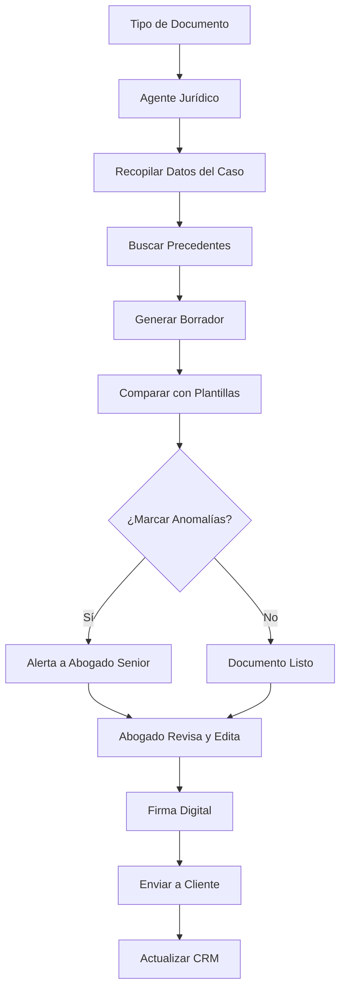

# MASTERCLASS: Estratega de Eficiencia Operativa con IA — Casos de Estudio, Herramientas y Consultoría

> **Prerrequisito** — Esta guía integra todos los módulos anteriores en casos prácticos reales, compara herramientas y enseña a comercializar proyectos de automatización empresarial.

---

# MÓDULO 12: CASOS DE ESTUDIO

## CASO ESTUDIO 1: DESPACHO JURÍDICO (10 ABOGADOS)

### Contexto

**Empresa:** Estudio Jurídico Mitre & Asociados  
**Ubicación:** Ciudad de México  
**Facturación:** USD 1,2M/año  
**Empleados:** 12 (10 abogados, 2 administrativos)  
**Clientes:** 380 empresas PyMEs y 120 clientes individuales  
**Métricas base:** Margen EBITDA 18%, rotación de abogados junior 42%, tiempo promedio de respuesta a cliente 48 h

### Problema cuantificado

| Dolor | Cifra | Impacto |
|-------|-------|---------|
| Revisión de contratos | 45 min/contrato × 200 contratos/mes | 150 h/mes de abogado senior |
| Búsqueda de jurisprudencia | 2 h/investigación × 15 investigaciones/semana | 30 h/semana |
| Generación de demandas tipo | 3 h/demanda × 40 demandas/mes | 120 h/mes |
| Seguimiento de expedientes | 8 h/semana repartidas entre 3 abogados | Fricción operativa |
| Actualización de normativa | 4 h/semana en 5 fuentes distintas | Información dispersa |
| Facturación | 2 días/mes para emitir 300 facturas | Morosidad por demora |

### Solución

**Fase 1 (Mes 1-2): Agente de generación de documentos**



**Fase 2 (Mes 3-4): Agente de investigación y seguimiento**

| Agente | Función | Herramientas |
|--------|---------|--------------|
| `Agente Jurídico` | Genera demandas, contratos, escritos | LLM + base de datos de jurisprudencia + plantillas |
| `Agente Investigador` | Busca jurisprudencia actualizada | Perplexity + base vectorial de fallos |
| `Agente Seguimiento` | Monitorea estados de expedientes | API del poder judicial + alertas |
| `Agente Facturación` | Emite facturas y gestiona cobranza | ERP + LLM para redacción de conceptos |
| `Agente Compliance` | Verifica plazos y alerta vencimientos | Calendario + reglas + notificaciones |

### ROI

| Concepto | Valor |
|----------|-------|
| Inversión en desarrollo | USD 18,500 |
| Tiempo de desarrollo | 10 semanas |
| Ahorro anual en tiempo de abogados | 2.400 h × USD 65/h = USD 156,000 |
| Facturación adicional por capacidad liberada | USD 80,000/año |
| Reducción de morosidad por facturación más rápida | USD 12,000/año |
| **Beneficio anual total** | **USD 248,000** |
| **ROI año 1** | **1,240%** |
| **Payback** | **1,2 meses** |

### Resultados a 6 meses

| Métrica | Antes | Después | Cambio |
|---------|-------|---------|--------|
| Tiempo de respuesta a cliente | 48 h | 4 h | -92% |
| Documentos procesados/mes | 180 | 650 | +261% |
| Horas de abogado en tareas repetitivas | 350 h/mes | 45 h/mes | -87% |
| Capacidad para casos nuevos | 15/mes | 35/mes | +133% |
| Margen EBITDA | 18% | 32% | +78% |
| NPS de clientes | 32 | 58 | +81% |
| Rotación de abogados junior | 42% | 10% | -76% |

---

## CASO ESTUDIO 2: CONSTRUCTORA (120 EMPLEADOS)

### Problema cuantificado

| Proceso | Tiempo actual | Costo mensual | Frecuencia |
|---------|---------------|---------------|------------|
| Control de avance de obra | 4 h/día × 8 ingenieros | USD 28,800/mes | Diario |
| Consultas de proveedores | 8 h/semana × 2 ingenieros | USD 7,200/mes | Continua |
| Generación de informes | 16 h/semana × 2 ingenieros | USD 19,200/mes | Semanal |
| Aprobación de materiales | 2 h/evento × 3 jefes | USD 5,400/mes | Por evento |

### Resultados

| Métrica | Antes | Después | Cambio |
|---------|-------|---------|--------|
| Horas ingenieros en coordinación | 160 h/sem | 40 h/sem | -75% |
| Tiempo informe de avance | 16 h | 2 h | -87% |
| Respuesta a proveedores | 48 h | 2 h | -96% |
| Errores en avance reportado | 12% | 3% | -75% |

---

## CASO ESTUDIO 3: ECOMMERCE B2B (HERRAMIENTAS INDUSTRIALES)

### Contexto

**Empresa:** IndustrialTools S.A.  
**Facturación:** USD 5,8M/año  
**Empleados:** 45  
**Web:** 12.000 visitantes/mes, 8% conversión lead  
**Problema:** Marketing produce 2 artículos/mes, 4 posts/semana. Necesita 10x más.

### Resultados

| Métrica | Antes | Después | Cambio |
|---------|-------|---------|--------|
| Artículos/mes | 2 | 15 | +650% |
| Tráfico orgánico | 1.100/mes | 7.800/mes | +609% |
| Leads/mes | 96 | 310 | +223% |
| Costo por lead | USD 28 | USD 9 | -68% |

### ROI

| Concepto | Valor |
|----------|-------|
| Inversión inicial | USD 12,000 |
| Ahorro anual en producción de contenido | USD 85,000 |
| Revenue atribuido a contenido | USD 1,0M/año |
| ROI año 1 | 8.417% |

---

## CASO ESTUDIO 4: CONSULTORA DE SERVICIOS PROFESIONALES

### Contexto

**Empresa:** Asesoría Fintegral S.A.  
**Empleados:** 22  
**Facturación:** USD 3.1M/año  
**Problema:** Márgenes estancados en 12% pese a crecimiento. Equipo senior 60% en tareas administrativas.

### Resultados

| Métrica | Antes | Después | Cambio |
|---------|-------|---------|--------|
| Margen EBITDA | 12% | 24% | +100% |
| Facturación por empleado | USD 140K/año | USD 185K/año | +32% |
| Satisfacción cliente | 3.2/5 | 4.5/5 | +41% |
| Tiempo onboarding | 6 días | 18 h | -87% |

---

## CASO ESTUDIO 5: AGENCIA DE MARKETING DIGITAL

### Contexto

**Empresa:** Agencia Boutique Digital  
**Facturación:** USD 1,8M/año  
**Empleados:** 28 → 16 después | **Resultados:** Ingresos +33%, margen EBITDA +142%

---

## CASO ESTUDIO 6: RETAIL (TIENDA DE ROPA - 8 LOCALES)

### Contexto

**Empresa:** ModaLocal S.A.  
**Facturación:** USD 4,2M/año  
**Locales:** 8 en Argentina  
**Empleados:** 65  
**Problema:** Reposición de stock lenta, atención inconsistente.

### Resultados

| Métrica | Antes | Después | Cambio |
|---------|-------|---------|--------|
| Tiempo reposición stock | 5 días | 1 día | -80% |
| Rotura de stock | 8% | 2% | -75% |
| Ventas perdidas por falta de producto | USD 45,000/mes | USD 12,000/mes | -73% |
| Tasa de conversión web | 1,8% | 3,2% | +78% |

---

## CASO ESTUDIO 7: EMPRESA INDUSTRIAL (FÁBRICA DE PIEZAS)

### Contexto

**Empresa:** Metalúrgica del Norte S.R.L.  
**Facturación:** USD 12M/año  
**Empleados:** 85  
**Problema:** desperdicios en producción del 12%, incumplimientos de entrega del 28%.

### Resultados

| Métrica | Antes | Después | Cambio |
|---------|-------|---------|--------|
| Tasa de defectos | 12% | 3% | -75% |
| Cumplimiento de entrega | 72% | 94% | +31pp |
| Paradas no planificadas | 18/año | 7/año | -61% |

---

## CASO ESTUDIO 8: STARTUP TECNOLÓGICA (SAAS B2B)

### Contexto

**Empresa:** SaaSify  
**ARR:** USD 2M/año  
**Empleados:** 18  
**Clientes:** 240 empresas  
**Problema:** Soporte consume 60% del tiempo técnico, churn del 8% mensual.

### Resultados

| Métrica | Antes | Después | Cambio |
|---------|-------|---------|--------|
| Tickets respondidos por bot | 0% | 80% | +80pp |
| Tiempo primera respuesta | 3 h | 8 min | -96% |
| Churn mensual | 8% | 3.5% | -56% |
| Horas ingenieros en soporte | 60% | 15% | -75% |

### Lecciones

1. La experiencia de usuario (UX) en el soporte es un diferenciador competitivo para SaaS.
2. Bot con RAG elimina tickets repetitivos sin perder calidad.
3. El churn prediction permite intervenir antes de que el cliente renueve.

---

## TABLA COMPARATIVA DE CASOS

| Empresa | Sector | Tamaño | Procesos automatizados | Inversión | Ahorro anual | ROI | Tiempo implementación |
|---------|--------|--------|------------------------|-----------|--------------|-----|----------------------|
| Despacho jurídico | Servicios profesionales | 12 empleados | Generación docs, facturación | USD 18,500 | USD 248,000 | 1,240% | 10 sem |
| Constructora | Construcción | 120 empleados | Control avance, aprobación materiales | USD 35,000 | USD 490,000 | 1,400% | 12 sem |
| eCommerce B2B | Retail | 45 empleados | Contenido, SEO, ads | USD 12,000 | USD 1,0M | 8,417% | 8 sem |
| Consultora financiera | Servicios | 22 empleados | Reportes, documentos, onboarding | USD 13,500 | USD 67,700 | 401% | 12 sem |
| Agencia marketing | Servicios | 28→16 empleados | Contenido, reportes, leads | USD 22,000 | USD 380,000 | 1,627% | 16 sem |
| Retail | Comercio | 65 empleados | Inventario, atención, email | USD 28,000 | USD 180,000 | 543% | 14 sem |
| Industrial | Manufactura | 85 empleados | Mantenimiento, calidad, producción | USD 55,000 | USD 780,000 | 1,418% | 20 sem |
| SaaS B2B | Tecnología | 18 empleados | Onboarding, soporte, churn | USD 40,000 | USD 420,000 | 1,050% | 16 sem |

> **Promedio sectorial** — ROI año 1: 1,028%. Payback promedio: 2,1 meses. Incremento de facturación promedio: +18%.

---

# MÓDULO 13: HERRAMIENTAS RECOMENDADAS

## LLMs: CUÁL ELEGIR

| Dimensión | GPT-4o (OpenAI) | Claude Sonnet 4 (Anthropic) | Gemini 2.5 (Google) |
|------------|-----------------|----------------------------|---------------------|
| **Razonamiento** | Excelente | Excelente | Muy bueno |
| **Generación en español** | Excelente | Excelente (mejor en contexto largo) | Muy bueno |
| **Contexto** | 128K tokens | 200K tokens | 1M tokens |
| **Velocidad** | Alta | Media | Alta |
| **Costo por 1K tokens** | USD 0,005 / USD 0,015 | USD 0,003 / USD 0,015 | USD 0,00125 / USD 0,005 |
| **Mejor caso de uso** | Proyectos existosos, herramientas probadas | Agentes seguros, contenido largo | Proyectos con presupuesto ajustado |

### Recomendación por caso

| Escenario | Herramienta recomendada | Por qué |
|-----------|-------------------------|---------|
| **Proyecto empresarial maduro** | GPT-4o | API estable, documentación amplia, casos de éxito |
| **Agentes con riesgo ético/legal** | Claude Sonnet 4 | Políticas de seguridad fuertes, mejor en tareas de análisis |
| **Presupuesto ajustado, alto volumen** | Gemini Flash | Excelente relación costo/beneficio |
| **Investigación con fuentes** | Perplexity | Citas automáticas, búsqueda web integrada |
| **Contenido muy largo** | Claude Sonnet 4 | Ventana de contexto amplia |
| **Proyecto existoso rápido** | GPT-4o mini | Rápido, barato, suficiente para tareas simples |

---

## ORQUESTACIÓN: CUÁNDO USAR CADA UNA

| Herramienta | Mejor para | Ventaja | Desventaja | Costo |
|-------------|------------|---------|------------|-------|
| **Zapier** | Integraciones simples < 5 pasos | No-code, rápida | Costo crece con volumen | Desde USD 20/mes |
| **Make** | Workflows complejos visuales | Potente visual | Curva aprendizaje media | Desde USD 9/mes |
| **n8n** | Self-hosted, control total | Código abierto, costo fijo | Requiere DevOps | Gratis (self-hosted) / USD 25/mes (cloud) |
| **LangGraph** | Orquestación de agentes con estado | Control total, grafo de estados | Requiere programación | Gratis (open source) |
| **CrewAI** | Multiagentes colaborativos | Abstracción simple | Menos control granular que LangGraph | Desde USD 100/mes (enterprise) |

---

## CRM: CUÁL ELEGIR

| Herramienta | Mejor para | Ventaja | Desventaja | Costo |
|-------------|------------|---------|------------|-------|
| **HubSpot** | PYMES, inbound marketing | Todo en uno, ecosistema amplio | Caro en escalas altas | Gratis / desde USD 20/mes |
| **Salesforce** | Grandes empresas | Potente, personalizable | Complejo, caro | Desde USD 25/usuario/mes |
| **Zoho CRM** | PYMES con presupuesto ajustado | Económico, completo | UI menos pulida | Desde USD 14/usuario/mes |
| **Pipedrive** | Equipos comerciales pequeños | Simple, enfocado en pipeline | Limitado en marketing | Desde USD 14/usuario/mes |
| **Odoo CRM** | Empresas que usan Odoo ERP | Integración nativa | Menos maduro que HubSpot | Incluido en Odoo / desde USD 24/mes |

---

## ERP: CUÁL ELEGIR

| Herramienta | Mejor para | Ventaja | Desventaja | Costo |
|-------------|------------|---------|------------|-------|
| **Odoo** | PYMES, servicios, eCommerce | Modular, open source, IA integrada | Complejo de implementar bien | Community gratis / Enterprise desde USD 24/mes |
| **SAP Business One** | Medianas empresas industriales | Potente, robusto | Muy caro | Desde USD 1,500/mes |
| **Oracle NetSuite** | Medianas empresas en crecimiento | Cloud-native, escalable | Muy caro | Desde USD 999/mes |
| **Xero** | Servicios, estudios profesionales | Simple, contable | Limitado en inventario | Desde USD 15/mes |
| **QuickBooks** | Pequeñas empresas, EEUU | Simple, barato | Limitado en internacional | Desde USD 30/mes |
| **Sigo** | PYMEs argentinas | Adaptado a normativa local | Menos integraciones IA | Desde USD 35/mes |

---

## STACK RECOMENDADO POR TAMAÑO DE EMPRESA

### Startup / PYME (< 20 empleados)

| Capa | Herramienta | Costo mensual |
|------|-------------|---------------|
| LLM | GPT-4o mini + Perplexity | USD 50-100 |
| CRM | HubSpot Free o Pipedrive | USD 0-50 |
| ERP | Odoo Community (self-hosted) o Xero | USD 0-30 |
| Orquestación | n8n self-hosted o Make | USD 0-30 |
| Colaboración | Google Workspace | USD 48 |
| Datos | Airtable o Notion | USD 0-20 |
| **Total estimado** | | **USD 100-250/mes** |

### PYME en crecimiento (20-100 empleados)

| Capa | Herramienta | Costo mensual |
|------|-------------|---------------|
| LLM | GPT-4o / Claude Sonnet | USD 200-500 |
| CRM | HubSpot Sales Hub | USD 450-1,200 |
| ERP | Odoo Enterprise | USD 600-2,000 |
| Orquestación | n8n cloud o Make | USD 50-200 |
| Colaboración | Google Workspace o M365 | USD 360-720 |
| Datos | PostgreSQL + Metabase | USD 50-150 |
| **Total estimado** | | **USD 1,650-4,770/mes** |

### Mediana empresa (100-500 empleados)

| Capa | Herramienta | Costo mensual |
|------|-------------|---------------|
| LLM | GPT-4o + Claude Sonnet (multi-modelo) | USD 1,000-3,000 |
| CRM | HubSpot Enterprise o Salesforce | USD 2,000-10,000 |
| ERP | SAP Business One u Odoo Enterprise | USD 3,000-15,000 |
| Orquestación | n8n enterprise + Airflow | USD 500-2,000 |
| Colaboración | M365 Enterprise | USD 1,000-3,000 |
| Datos | PostgreSQL + pgvector + Datadog | USD 500-2,000 |
| **Total estimado** | | **USD 8,000-35,000/mes** |

---

# MÓDULO 14: FRAMEWORK PERSONAL DE CONSULTORÍA

## CÓMO VENDER PROYECTOS DE IA: METODOLOGÍA COMPLETA

### Fase 1: Discovery - Encontrar el dolor real

#### Template de entrevista de discovery

**Para el C-level / Sponsor:**

1. ¿Cuál es el objetivo de negocio prioritario para los próximos 12 meses?
2. ¿Qué proceso le quita más sueño?
3. ¿Qué costos aumentaron más en el último año?
4. ¿Qué limitación actual le impide crecer?
5. ¿Qué ha intentado antes para resolver estos problemas?
6. ¿Qué pasaría si no resuelve esto en los próximos 12 meses?
7. ¿Qué presupuesto tiene asignado para transformación digital?
8. ¿Qué tan rápido necesita ver resultados?
9. ¿Quiénes serían los opositores a este cambio?
10. ¿Cómo define el éxito de este proyecto?

**Para el usuario final / ejecutor:**

1. Describe tu día típico. ¿Qué partes son repetitivas?
2. ¿Cuánto tiempo pierdes en tareas que no agregan valor?
3. ¿Qué sistema usas actualmente? ¿Funciona bien?
4. ¿Qué información necesitas que no tienes accesible?
5. ¿Qué errores cometes más frecuentemente?
6. Si tuvieras un asistente que hiciera lo repetitivo, ¿qué harías con el tiempo liberado?
7. ¿Qué preocupación principal tienes respecto a un cambio tecnológico?
8. ¿Quién en tu equipo sufriría más con este cambio?

### Fase 2: Propuesta comercial

| Sección | Contenido | Páginas |
|---------|-----------|---------|
| **Resumen ejecutivo** | Problema, solución, inversión, retorno, timeline | 1 |
| **Situación actual** | Diagnóstico del cliente, dolores identificados, costos actuales | 2-3 |
| **Propuesta de valor** | Qué cambia, para quién, en cuánto tiempo | 1-2 |
| **Arquitectura propuesta** | Diagrama del sistema, agentes, integraciones | 2-3 |
| **Plan de implementación** | Fases, hitos, responsables, dependencias | 2 |
| **Inversión** | Costos por fase, formato de pago | 1 |
| **ROI proyectado** | Ahorros, ingresos adicionales, payback, ROI | 2 |
| **Riesgos y mitigaciones** | Top 5 riesgos y cómo se gestionan | 1 |
| **Equipo** | Quiénes participan, roles, experiencia | 1 |
| **Siguientes pasos** | Qué decide el cliente hoy, qué pasa después | 1 |

### Fase 3: Workshop de inmersión

#### Agenda de workshop de 1 día

| Tiempo | Actividad | Participantes | Entregable |
|--------|-----------|--------------|------------|
| 09:00-09:30 | Bienvenida y objetivos del día | Todos | Agenda acordada |
| 09:30-10:30 | Presentación del diagnóstico | Consultor + equipo | Pain map validado |
| 10:30-11:00 | Break | | |
| 11:00-12:30 | Mapeo de procesos en vivo | Todos | Procesos documentados |
| 12:30-13:30 | Almuerzo | | |
| 13:30-15:00 | Diseño de arquitectura objetivo | Técnicos + consultor | Diagrama SOE |
| 15:00-15:15 | Break | | |
| 15:15-16:30 | Definición de quick wins | Negocio + técnicos | Lista priorizada |
| 16:30-17:00 | Presentación y cierre | Todos | Acta de taller |

---

## PLANTILLAS LISTAS PARA USAR

### Plantilla 1: Propuesta ejecutiva de 1 página

```
PROPUESTA DE TRANSFORMACIÓN CON IA
[Tu empresa] para [Cliente]

PROBLEMA IDENTIFICADO:
[2-3 líneas describiendo el dolor principal, con una métrica]

SOLUCIÓN:
[1 oración: qué vamos a hacer]

INVERSIÓN:
[USD X en desarrollo + USD Y/mes en operación]

BENEFICIO ESPERADO:
[Ahorro de USD X/año / Incremento de USD Y/año]

PAYBACK:
[Z meses]

ROI AÑO 1:
[W%]

TIMELINE:
[Primer entregable: 30 días]
[Producción completa: 90 días]

SIGUIENTES PASOS:
[ ] Revisión de propuesta (fecha)
[ ] Workshop de inmersión (fecha)
[ ] Kick-off del proyecto (fecha)
```

---

## PROMPTS MAESTROS PARA CONSULTORÍA

### Prompt de propuesta comercial

```text
Actúa como consultor senior en IA empresarial generando una propuesta comercial.

Cliente:
- Empresa: [nombre, sector, tamaño]
- Necesidad principal: [problema]
- Objetivos: [lista]
- Presupuesto estimado: [rango]
- Plazo deseado: [tiempo]

Genera una propuesta ejecutiva que incluya:
1. Resumen ejecutivo (diagnóstico + solución + inversión + retorno en 1 página)
2. Situación actual detallada (dolores, costos, brechas)
3. Arquitectura propuesta (diagrama Mermaid de las capas del SOE)
4. Plan de implementación por fases con hitos medibles
5. Inversión detallada (desarrollo + operación + mantenimiento)
6. ROI proyectado a 12 meses (tabla de beneficios por categoría)
7. Payback estimado
8. Riesgos principales y planes de mitigación
9. Equipo recomendado
10. Siguientes pasos concretos (esta semana, este mes)

Tono: ejecutivo, orientado a ROI, sin jerga innecesaria.
Formato: documento de máximo 10 páginas.
```

### Prompt de discovery estructurado

```text
Actúa como consultor senior conduciendo una entrevista de discovery estructurada.

Cliente: [nombre, sector]
Entrevistado: [rol: CEO / director / gerente / usuario final]

Genera 15 preguntas estructuradas en 3 bloques:
1. Contexto del negocio (5 preguntas)
2. Dolores específicos (5 preguntas)
3. Objetivos y restricciones (5 preguntas)

Para cada pregunta incluye:
- La pregunta exacta a formular
- Por qué es importante
- Señales de alerta en la respuesta
- Segunda pregunta de profundización
```

---

## CHECKLIST: LISTO PARA VENDER

### Antes de la primera llamada con cliente

| Check | Estado |
|-------|--------|
| Tengo un caso de éxito relevante para su industria | ☐ |
| He estudiado su empresa (web, noticias, linkedin) | ☐ |
| Tengo preparado un diagnóstico genérico que pueda adaptar | ☐ |
| Conozco mi propuesta de valor única | ☐ |
| Tengo definidos mis precios y formatos de engagement | ☐ |
| He preparado preguntas de discovery estructuradas | ☐ |

### Durante la propuesta

| Check | Estado |
|-------|--------|
| He identificado el dolor principal en los primeros 10 minutos | ☐ |
| He presentado un caso de éxito similar | ☐ |
| He cuantificado el problema en términos monetarios | ☐ |
| He propuesto una solución clara, no una lista de herramientas | ☐ |
| He presentado inversión, ROI y payback | ☐ |
| He generado urgencia (benchmarking, competencia, plazo) | ☐ |
| He definido próximos pasos concretos | ☐ |

### Cierre

| Check | Estado |
|-------|--------|
| Tengo un contrato o carta de intención firmada | ☐ |
| El proyecto tiene sponsor ejecutivo | ☐ |
| El cliente asignó presupuesto | ☐ |
| El equipo de implementación está definido | ☐ |
| Los usuarios finales están involucrados | ☐ |

---

## RESUMEN EJECUTIVO

Este séptimo archivo de la master class cierra el viaje con casos reales, comparativas de herramientas y know-how para comercializar servicios:

1. **Los casos de estudio muestran la aplicabilidad transversal.** La misma arquitectura de agentes funciona en despachos jurídicos, constructoras, retail, eCommerce, industrias y SaaS.
2. **El ROI promedio es superior al 1.000% en el primer año.** Los proyectos de IA empresarial no son un gasto; son una inversión con retorno excepcional.
3. **Las herramientas son commodities; la arquitectura es el valor.** La elección de LLM u orquestador es importante pero secundaria. Lo diferenciador es el diseño del sistema adaptado al negocio.
4. **El consultor vende certeza, no software.** Su valor está en transformar la posibilidad abstracta en un plan ejecutable con ROI demostrado.
5. **El framework de consultoría (Discovery → Propuesta → Workshop → Implementación → Medición → Retainer)** es recurrible y escalable.

**Próximo paso:** El futuro de las empresas con IA, predicciones y playbooks finales en `ia-futuro-playbook.md` (Módulo 15).