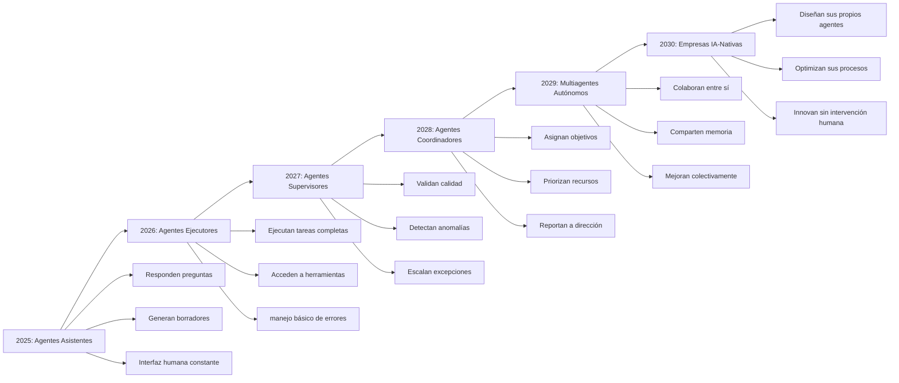
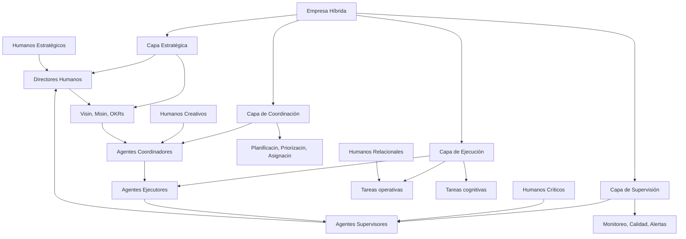
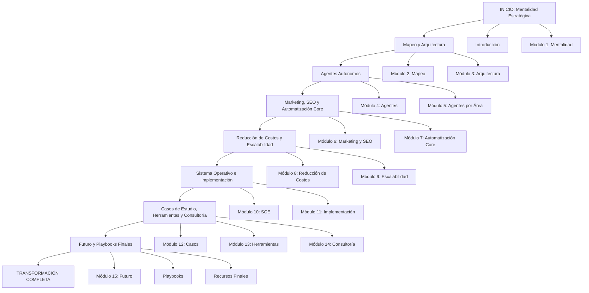

# MASTERCLASS: Estratega de Eficiencia Operativa con IA — Futuro y Playbooks Finales

> **Prerrequisito** — Esta guía cierra la master class. Asume dominio de los 7 archivos anteriores. Aquí integramos todo en playbooks accionables y proyectamos la evolución empresarial hacia 2030.

---

# MÓDULO 15: FUTURO DE LAS EMPRESAS CON IA

## AGENTES AUTÓNOMOS: LA NUEVA FUERZA DE TRABAJO

Los agentes autónomos no son el futuro; son el presente. Lo que cambiará en los próximos años es su capacidad de coordinación, memoria y adaptación. Las empresas que construyan ecosistemas de agentes en los próximos 24 meses tendrán una ventaja estructural insuperable.

### Evolución de agentes: 2025 → 2030



---

## ORGANIZACIONES HÍBRIDAS: HUMANOS + AGENTES

La organización híbrida no es seres humanos que usan herramientas de IA. Es una simbiosis donde cada parte hace lo que mejor sabe hacer.

### Modelo de organización híbrida



### Roles humanos en la organización híbrida

| Rol humano | Función irreducible | Por qué no lo puede hacer un agente |
|------------|---------------------|--------------------------------------|
| **Director general** | Visión, ética, cultura | Definir el porqué, no el qué |
| **Estratega** | Diseño del SOE, arquitectura | Pensamiento sistémico y creatividad |
| **Creativo** | Innovación, diferenciación | Imaginación sin límites contextuales |
| **Relacional** | Clientes clave, partnerships | Empatía, confianza, negociación compleja |
| **Crítico** | Auditoría, compliance, ética | Juicio moral y responsabilidad legal |
| **Experto profundo** | Estado del arte, rupturas | Conocimiento frontera que no está en datos |

> **Principio** — Los agentes ejecutan. Los humanos diseñan, aprueban y transforman. La mejor empresa híbrida maximiza la productividad de ambos.

---

## EMPRESAS IA-FIRST: EL NUEVO ESTÁNDAR

Una empresa IA-first no es una empresa que usa IA. Es una empresa que diseña todos sus procesos alrededor de la capacidad de la IA desde el día uno.

### Características de empresas IA-first

| Característica | Tradicional | IA-first |
|-----------------|------------|----------|
| **Procesos** | Definidos por limitaciones humanas | Diseñados para agentes + humanos |
| **Documentación** | Opcional o arcaica | Requisito de diseño, no posterior |
| **Datos** | Subproducto | Activo estratégico |
| **Decisiones** | Jerárquicas y secuenciales | Distribuidas y en tiempo real |
| **Escalabilidad** | Lineal con personal | Elástica con agentes |
| **Innovación** | Proyectos largos con recursos | Experimentos rápidos con agentes |
| **Riesgo** | Mitigado por procedimientos | Mitigado por gobernanza + supervisión |
| **Cultura** | "Así se hace aquí" | "Así lo hacemos mejor" |

### Empresas IA-first exitosas hoy

| Empresa | Sector | Estrategia IA | Resultado |
|---------|--------|---------------|-----------|
| **Klarna** | Finanzas | AI para aprobación de crédito, soporte, personalización | 40% reducción en costos operativos, desacoplamiento de gasto e ingreso |
| **Notion** | Productividad | IA nativa para generación y organización de contenido | Mejora de 10x en retención por usuario activo |
| **Stripe** | Finanzas | IA para detección de fraude, onboarding, soporte | Mejora de 90% en tiempo de onboarding |
| **Shopify** | eCommerce | AI para personalización, pricing, logística predictiva | +30% conversión, +15% ticket promedio |
| **Zoom** | Comunicación | AI para resúmenes, traducción, asistentes | Retención enterprise mejorada en 25% |
| **Grammarly** | Productividad | AI nativa desde el día uno | Crecimiento orgánico masivo, 30M usuarios activos |

> **Lección** — Las empresas IA-first no son startups tecnológicas. Son empresas tradicionales que diseñan sus procesos considerando la IA como un componente desde el día 1.

---

## NUEVOS PUESTOS Y NUEVOS MODELOS DE NEGOCIO

### Nuevos puestos que emergen

| Puesto | Función | Cuándo surge |
|--------|---------|--------------|
| **Estratega de Eficiencia Operativa con IA** | Arquitecto de la transformación | Inmediatamente |
| **Entrenador de Agentes** | Diseña prompts, fine-tuning, ejemplos de entrenamiento | Cuando hay >5 agentes |
| **Arquitecto de SOE** | Diseña capas, integraciones y gobernanza | Cuando hay >3 sistemas integrados |
| **Analista de Ética en IA** | Revisa sesgos, cumplimiento, riesgos éticos | Cuando hay agentes con datos sensibles |
| **Especialista en RAG** | Diseña bases vectoriales y pipelines de conocimiento | Cuando el conocimiento es el activo principal |
| **Ingeniero de Confiabilidad de IA** | Monitorea, alerta y mitiga fallos de agentes | Cuando hay agentes en producción |
| **Gerente de Adopción** | Gestiona cambio, capacitación y resistencia | Cuando la empresa escala IA |
| **Prompt Engineer** | Optimiza interacción humano-agente | Cuando hay agentes asistentes a escala |

### Nuevos modelos de negocio habilitados por IA

| Modelo | Descripción | Ejemplo |
|---------|-------------|---------|
| **Servicios infinitos** | Capacidad de atender demanda variable sin costo lineal | Agencia de marketing que escala a 100 clientes con el mismo equipo |
| **Hyper-personalización** | Cada cliente recibe producto/servicio único a costo de producción masiva | Planes de entrenamiento personalizados por IA |
| **Marketplaces de agentes** | Plataforma donde empresas contratan agentes especializados | Agencia que provee agentes de cobranza a múltiples clientes |
| **IA como barrera de entrada** | La curva de automatización es tan pronunciada que nuevos entrantes no pueden competir | Firma legal con agentes especializados vs despacho tradicional |
| **Economía de datos** | Los datos generados por agentes entrenan agentes mejores que generan más datos | Plataforma de IA que mejora con cada transacción |
| **Servicios predictivos** | Vender certeza futura en lugar de reacción presente | Agente de mantenimiento predictivo vendido como servicio |
| **Dobles digitales empresariales** | Réplica digital completa de la empresa para simulación y optimización | Digital twin de cadena de suministro |

---

## PREDICCIONES A 5 AÑOS: 2026-2031

### Tecnológicas

1. **Los agentes multiagente serán el estándar.** No habrá aplicaciones empresariales sin al menos 3 agentes colaborando.
2. **El contexto de 1M tokens será común.** Los agentes procesarán documentos completos, historiales de clientes y bases de conocimiento en una sola inferencia.
3. **El fine-tuning será accesible para pymes.** No solo grandes empresas podrán entrenar modelos específicos de su dominio.
4. **Los embeddings semánticos reemplazarán búsquedas por palabras clave** en el 80% de las búsquedas empresariales.
5. **La verificación automática de hechos (fact-checking) será nativa** en los LLMs empresariales, reduciendo alucinaciones a <0,01%.

### Empresariales

6. **El 60% de los procesos de back office estarán automatizados** en medianas empresas (vs 35% en 2025).
7. **El costo marginal de atender un ticket de soporte será <50 centavos de dólar** en sectores de alto volumen.
8. **Los call centers tradicionales se replantearán:** operarán con 10% de humanos + 90% agentes de voz IA.
9. **Las empresas que no adopten IA en escala tendrán márgenes brutos 20 puntos porcentuales menores** que sus competidores.
10. **El rol de "consultor en IA" será uno de los 10 más demandados** según proyecciones del World Economic Forum.

### Regulatorias

11. **La mayoría de los países tendrán regulación específica sobre IA empresarial** (similar al GDPR).
12. **Las empresas deberán demostrar auditoría de sus agentes** para obtener certificaciones industriales.
13. **El "derecho a la explicación" extendido** obligará a que cada decisión automatizada con impacto en personas tenga trazabilidad.

---

## PREDICCIONES A 10 AÑOS: 2026-2036

### Tecnológicas

1. **Los agentes autónomos diseñarán, probarán y desplegarán otros agentes** sin intervención humana.
2. **El 90% del código empresarial será generado por agentes**, con humanos supervisando arquitectura y estándares.
3. **La IA general débil (AGI light) estará disponible comercialmente**, transformando radicalemente la economía del conocimiento.
4. **Los interfaces entre humanos y sistemas serán conversacionales por defecto.** Las pantallas con botones serán obsoletas para tareas empresariales.
5. **Los contratos inteligentes (smart contracts)** ejecutarán acuerdos comerciales automáticamente con validación IA.

### Empresariales

6. **Las pymes tendrán la misma capacidad analítica que las grandes corporaciones** porque accederán a la misma potencia de IA por costo marginal.
7. **La ventaja competitiva será la velocidad de adaptación, no el tamaño del equipo.** Las empresas de 10 personas competirán con empresas de 1.000.
8. **El rol de "operador de procesos" desaparecerá.** Será reemplazado por "diseñador de agentes y procesos".
9. **La educación formal en gestión incluirá IA como competencia básica** desde el pregrado.
10. **Los directivos que no entiendan arquitectura de agentes serán considerados analfabetos operativos**, similar a un director que no entienda contabilidad básica hoy.

---

## RETOS ÉTICOS Y RESPONSABILIDAD

A medida que los agentes toman más decisiones empresariales, la responsabilidad se difumina. Las empresas deben anticipar estos retos.

### Retos éticos principales

| Reto | Riesgo empresarial | Mitigación |
|------|-------------------|------------|
| **Sesgo en modelos** | Decisiones discriminatorias en contratación, scoring, precios | Auditorías periódicas, datos diversos, monitoreo continuo |
| **Transparencia** | Imposibilidad de explicar decisiones a clientes/reguladores | Explicabilidad por diseño, logs detallados |
| **Responsabilidad legal** | "El agente lo hizo, no yo" no es defensa válida | Matriz RACI clara, seguros específicos, documentación |
| **Privacidad** | Uso de datos sensibles sin consentimiento explícito | Políticas estrictas, minimización de datos, consentimiento granular |
| **Desplazamiento laboral** | Impacto social y reputacional del cambio | Plan de recolocación, capacitación, comunicación transparente |
| **Concentración de poder** | Solo empresas con acceso a IA avanzada compiten | Democratización, open source, acceso equitativo |
| **Autonomía descontrolada** | Agentes que toman decisiones imprevistas con impacto real | Gobernanza, kill-switches, límites claros |

### Principios rectores

```
1. Los agentes deben ser auditables: toda acción debe ser trazable.
2. Los humanos deben ser responsables: la IA no exime de accountability.
3. La transparencia es no negociable: clientes y reguladores tienen derecho a saber.
4. La mejora continua es obligatoria: los sistemas se degradan sin mantenimiento.
5. La equidad es un requisito de diseño, no un afterthought.
```

---

## PLAYBOOKS EJECUTIVOS

Estos playbooks son guías rápidas para acciones específicas. Úsalos como referencia durante la implementación.

---

### PLAYBOOK 1: PRIMER AGENTE EN PRODUCCIÓN EN 7 DÍAS

Objetivo: Tener tu primer agente autónomo funcionando en menos de una semana generando ahorro demostrable.

#### Día 1: Selección del proceso

| Criterio | Mínimo |
|----------|--------|
| Frecuencia | Mínimo 4 veces por semana |
| Volumen | Mínimo 20 ejecuciones/mes |
| Tiempo por ejecución | Mínimo 15 minutos |
| Error actual | Mínimo 5% de tasa de error |
| Datos disponibles | Sí, accesibles desde al menos un sistema |

**Ejemplo ideal:** Gestión de cobranza de facturas vencidas, generación de informes semanales, clasificación de leads, respuesta a FAQ.

#### Días 2-3: Diseño del agente

```
Step 1: Definir el objetivo en una frase
   "Mi agente hace [acción concreta] cuando [trigger], usando [herramientas], para [resultado medible]."

Step 2: Inventariar herramientas disponibles
   - CRM: [nombre]
   - ERP: [nombre]
   - Email: [nombre]
   - Documentos: [nombre]
   - Datos: [nombre]

Step 3: Definir el flujo
   1. Trigger: ¿Qué evento inicia el agente?
   2. Input: ¿Qué datos necesito?
   3. Proceso: ¿Qué pasos sigue?
   4. Output: ¿Qué produce?
   5. Excepción: ¿Qué pasa si algo falla?

Step 4: Escribir el system prompt (150-250 palabras)
   - Rol del agente
   - Objetivo específico
   - Reglas de comportamiento
   - Herramientas disponibles
   - Manejo de excepciones
   - Formato de salida
```

#### Días 4-5: Desarrollo rápido

Herramientas recomendadas para MVP:
- Orquestación: n8n (self-hosted) o Make
- LLM: GPT-4o mini, Claude Haiku o Gemini Flash
- Datos: SQLite (n8n) o Google Sheets
- Comunicación: Gmail o Slack

Criterios de aceptación del MVP:
- [ ] El agente completa el flujo completo sin intervención humana
- [ ] Los errores se registran en un log
- [ ] Existe un kill-switch manual
- [ ] El output es coherente en 5 pruebas consecutivas

#### Días 6-7: Prueba y despliegue

| Día 6 | Actividad |
|-------|-----------|
| Mañana | Prueba en entorno de staging con datos reales |
| Tarde | Ajustes basados en errores encontrados |
| Noche | Documentación básica (flujo, prompts, incidencias) |
| | |
| Día 7 | Actividad |
| Mañana | Rollout a 20% del volumen real |
| Tarde | Monitoreo intensivo, corrección de errores |
| Cierre | Presentación de primeros resultados |

---

### PLAYBOOK 2: ARQUITECTURA DE AGENTES MULTIAGENTE EN 30 DÍAS

Objetivo: Pasar de agente único a sistema de 3-5 agentes colaborando con memoria compartida.

#### Semana 1: Definición de roles

```
Ejercicio: Dibuja tu organización objetivo de agentes
- ¿Qué 3-5 procesos críticos quieres automatizar?
- ¿Qué agentes especializados necesitas?
- ¿Qué necesitan compartir entre sí (datos, contexto, estado)?
- ¿Quién define prioridades: un coordinador o cada agente independientemente?
```

#### Semana 2: Arquitectura técnica

| Componente | Opción económica | Opción estándar |
|------------|------------------|-----------------|
| Orquestación | n8n self-hosted | n8n cloud / LangGraph |
| Memoria compartida | SQLite (n8n) | PostgreSQL + pgvector |
| Event bus | Colas de n8n | Redis |
| LLM | GPT-4o mini / Claude Haiku | GPT-4o / Claude Sonnet |
| Logs | Archivos locales | Elasticsearch / Datadog |

#### Semana 3: Desarrollo de agentes

| Día | Actividad |
|-----|-----------|
| 1-2 | Agente 1: el más simple (ej.: clasificador) |
| 3-4 | Agente 2: el más crítico (ej.: ejecutor principal) |
| 5-6 | Agente 3: coordinador o supervisor |
| 7 | Prueba de integración entre los 3 agentes |

#### Semana 4: Pruebas y optimización

| Día | Actividad |
|-----|-----------|
| 8-10 | Pruebas de integración: ¿los agentes comparten contexto correctamente? |
| 11-12 | Pruebas de fallo: ¿qué pasa cuando un agente falla? |
| 13-14 | Pruebas de carga: ¿cuántas ejecuciones simultáneas soporta? |
| 15 | Documentación y presentación |

---

### PLAYBOOK 3: REDUCCIÓN DE COSTOS EN 90 DÍAS

Objetivo: Implementar un programa estructurado de reducción de costos con IA, generando ahorros demostrables en el primer mes.

#### Mes 1: Diagnóstico y quick wins

| Semana | Actividad | Entregable |
|--------|-----------|------------|
| 1 | Time and motion study de 5 procesos críticos | Informe de desperdicio |
| 2 | Análisis de Pareto de costos | Lista priorizada |
| 3 | Selección y desarrollo de 2-3 quick wins | MVPs en producción |
| 4 | Medición de resultados iniciales | Informe de ahorro del mes 1 |

#### Mes 2: Arquitectura base

| Semana | Actividad | Entregable |
|--------|-----------|------------|
| 5 | Diseño de arquitectura de datos | Diagrama de integraciones |
| 6 | Implementación de data warehouse simple | Datos consolidados |
| 7 | Desarrollo de segundo agente | Agente ejecutor operativo |
| 8 | Diseño de dashboard de monitoreo | KPIs en tiempo real |

#### Mes 3: Escalamiento y consolidación

| Semana | Actividad | Entregable |
|--------|-----------|------------|
| 9 | Rollout de quick wins a 100% del volumen | Procesos automatizados |
| 10 | Desarrollo de agente supervisor | Calidad garantizada |
| 11 | Capacitación del equipo | Equipo autónomo |
| 12 | Presentación de resultados trimestrales | ROI demostrado |

---

### PLAYBOOK 4: DISEÑO DE PROPUESTA COMERCIAL EN 48 HORAS

Objetivo: Tener una propuesta lista para enviar a un cliente potencial en 2 días.

#### Día 1: Diagnóstico express

| Hora | Actividad | Entregable |
|------|-----------|------------|
| 09:00-10:00 | Revisión pública de la empresa (web, LinkedIn, noticias) | Contexto |
| 10:00-12:00 | Entrevista de discovery estructurada (60 min) | Pain map |
| 12:00-13:00 | Almuerzo | |
| 13:00-14:30 | Análisis de sistemas y procesos detectados | Mapa de sistemas |
| 14:30-16:30 | Identificación de oportunidades | 3-5 iniciativas priorizadas |
| 16:30-18:00 | Cálculo de ROI preliminar | Caso de negocio |

#### Día 2: Diseño y redacción

| Hora | Actividad | Entregable |
|------|-----------|------------|
| 09:00-11:00 | Diseño de arquitectura propuesta | Diagrama SOE |
| 11:00-13:00 | Definición de plan de implementación | Roadmap 90/180 días |
| 13:00-14:00 | Almuerzo | |
| 14:00-15:30 | Redacción de propuesta ejecutiva | Documento de 5-8 páginas |
| 15:30-17:00 | Cálculo de inversión y ROI detallado | Tabla financiera |
| 17:00-18:00 | Revisión y ajustes | Propuesta lista para presentar |

---

### PLAYBOOK 5: GESTIÓN DE CRisis EN AGENTES

Objetivo: Protocolo de respuesta ante fallos, errores críticos o comportamientos inesperados de agentes en producción.

#### Protocolo de respuesta inmediata (primeros 30 minutos)

| Tiempo | Acción | Responsable |
|--------|--------|-------------|
| 0-5 min | Detectar: identificar el agente afectado y el síntoma | Monitoring system / equipo |
| 5-10 min | Aislar: activar kill-switch del agente o flujo afectado | Arquitecto / líder técnico |
| 10-15 min | Evaluar: determinar impacto en cliente, datos, sistema | Arquitecto + responsable de área |
| 15-20 min | Comunicar: notificar a clientes afectados si corresponde | Comunicaciones + CS |
| 20-30 min | Documentar: registrar incidente en log inmutable | Equipo técnico |

#### Protocolo de investigación (próximas 4 horas)

| Paso | Acción | Responsable |
|------|--------|-------------|
| 1 | Revisar logs del agente: razón del fallo | Técnico |
| 2 | Evaluar integridad de datos: ¿algún dato se corrompió? | Técnico + área |
| 3 | Identificar causa raíz | Arquitecto |
| 4 | Determino si fue un error aislado o sistémico | Arquitecto |
| 5 | Decidir: reintentar, reemplazar, o rediseñar | Líder técnico + sponsor |

#### Protocolo de recuperación (próximas 24-48 horas)

| Tiempo | Acción |
|--------|--------|
| 24 horas | Solución temporal (manual o revertida) |
| 24-48 horas | Solución definitiva implementada y probada |
| 48-72 horas | Presentación de post-mortem |
| 72-96 horas | Plan de prevención para evitar recurrencia |

#### Post-mortem

```
POST-MORTEM: [Nombre del incidente]
Fecha: [fecha]
Severidad: [bajo / medio / alto / crítico]
Duración: [tiempo total afectado]
Clientes afectados: [cantidad, lista si aplica]

Resumen:
[2-3 líneas: qué pasó y cuándo]

Causa raíz:
[Análisis de 5 porqués]

Impacto:
- Operacional: [descripción]
- Financiero: [USD X]
- Reputacional: [descripción]

Acciones correctivas:
1. [Acción] — Responsable: [nombre] — Fecha: [fecha]
2. [Acción] — Responsable: [nombre] — Fecha: [fecha]

Acciones preventivas:
1. [Acción] — Responsable: [nombre] — Fecha: [fecha]
2. [Acción] — Responsable: [nombre] — Fecha: [fecha]
```

---

## CHECKLETS DE IMPLEMENTACIÓN RÁPIDA

### Checklist: Primer agente en 7 días

| Día | Check | Estado |
|-----|-------|--------|
| 1 | Proceso seleccionado con métricas claras | ☐ |
| 1 | System prompt redactado y aprobado | ☐ |
| 1 | Herramientas de acceso definidas | ☐ |
| 2 | Flujo del agente diagramado | ☐ |
| 2 | Herramientas conectadas | ☐ |
| 3 | MVP desarrollado en staging | ☐ |
| 4 | Pruebas con datos reales | ☐ |
| 5 | Ajustes y mejoras aplicadas | ☐ |
| 5 | Documentación básica | ☐ |
| 6 | Prueba en producción 20% | ☐ |
| 7 | Rollout completo | ☐ |
| 7 | Presentación de resultados | ☐ |

### Checklist: Arquitectura multiagente

| Componente | Check | Estado |
|-------------|-------|--------|
| Orquestación | Herramienta seleccionada (n8n, LangGraph) | ☐ |
| Memoria | Base de datos (SQLite, PostgreSQL) | ☐ |
| Eventos | Cola de eventos implementada | ☐ |
| Agente 1 | Diseñado, testeado, en producción | ☐ |
| Agente 2 | Diseñado, testeado, en producción | ☐ |
| Agente coordinador | Coordina > 2 agentes | ☐ |
| Supervisor | Monitorea calidad de salidas | ☐ |
| Kill-switches | Todos los agentes tienen parada de emergencia | ☐ |
| Logs | Sistema de logging inmutable | ☐ |
| Dashboard | Visualiza estado de agentes | ☐ |

---

## PROMPTS MAESTROS PARA ESTA FASE

### Prompt: Evaluación de proveedores de IA

```text
Actúa como arquitecto de IA evaluando proveedores para un proyecto empresarial.

Empresa:
- Sector: [industria]
- Proceso a automatizar: [descripción]
- Volumen estimado: [transacciones/mes]
- Presupuesto mensual: [USD]
- Restricciones: [cumplimiento, latencia, privacidad, etc.]

Evalúa 3 proveedores: OpenAI, Claude (Anthropic), Gemini (Google)

Para cada proveedor incluye:
1. Ranking general (1-5 estrellas)
2. Fortalezas específicas para mi caso
3. Debilidades específicas
4. Análisis de costo mensual proyectado
5. Casos de éxito similares
6. Riesgos de dependencia
7. Sugerencias de arquitectura recomendada

Al final, emite una recomendación final con justificación.

Formato: tabla comparativa + recomendación en 2 párrafos.
```

### Prompt: Crear playbook de mantenimiento de agentes

```text
Actúa como ingeniero de confiabilidad de IA.

Agente: [tipo, función, herramientas]
Volumen: [ejecuciones/día]
Stack técnico: [herramientas]

Genera un playbook de mantenimiento mensual que incluya:
1. Checklist diario (qué revisar cada mañana)
2. Checklist semanal (qué revisar cada lunes)
3. Checklist mensual (qué revisar la primera semana de cada mes)
4. Alertas críticas a configurar
5. Procedimiento para actualizar el prompt
6. Procedimiento para corregir errores detectados
7. Plan de mejora continua (cada 3 meses)
8. Métricas que deben mantenerse en rangos saludables
9. Umbrales de escalación a humano
10. Contactos de soporte por herramienta

Formato: guía de 1 página, lista de verificación práctica.
```

### Prompt: Proyectar roadmap de IA a 12 meses

```text
Actúa como Estratega de Eficiencia Operativa con IA.

Empresa:
- Sector: [industria]
- Tamaño actual: [empleados, facturación]
- Etapa de madurez IA: [inicial / intermedia / avanzada]
- Recursos disponibles: [equipo, presupuesto]
- Objetivos estratégicos: [lista]

Genera un roadmap de IA a 12 meses que incluya:
1. Visión general: ¿dónde estará la empresa en 12 meses?
2. Hitos trimestrales con entregables concretos
3. Proyectos por trimestre (quick wins primero, estratégicos después)
4. Métricas de éxito por hito
5. Recursos necesarios por trimestre
6. Riesgos por trimestre y planes de contingencia
7. Capacitación del equipo por trimestre
8. Presupuesto acumulado por trimestre
9. Hitos de arquitectura (datos, integraciones, agentes)
10. Hitos de cultura (adopción, comunicación, celebración)

Formato: documento ejecutivo con diagrama Gantt simplificado.
```

### Prompt: Evaluación de madurez de SOE

```text
Actúa como auditor de Sistemas Operativos Empresariales con IA.

Empresa:
- Sector: [industria]
- Tamaño: [empleados]
- Sistemas: [lista]
- Procesos automatizados: [lista]
- Agentes desplegados: [lista]

Evalúa la madurez del SOE en las 7 capas:
1. Dirección estratégica: ¿Existen OKRs alineados con IA?
2. Gobernanza: ¿Hay políticas, matrices RACI, kill-switches?
3. Orquestación: ¿Los agentes están coordinados o aislados?
4. Motor de IA: ¿Hay un stack LLM unificado o disperso?
5. Automatización inteligente: ¿Qué % de procesos core están automatizados?
6. Automatización tradicional: ¿Hay RPA o solo scripts sueltos?
7. Datos y sistemas: ¿Los datos están integrados o en silos?

Por cada capa:
- Puntaje 1-5
- Hallazgos específicos
- Acciones de mejora priorizadas

Al final:
- Puntaje global sobre 35
- Recomendación de hoja de ruta
- Benchmarking contra industria
```

---

## TABLA DE CONTENIDOS MAESTRA DE LA MASTER CLASS

### Mapa completo del viaje



### Archivos de la master class

| # | Archivo | Módulos | Tema principal | Lectura |
|---|---------|---------|----------------|---------|
| 1 | `ia-mentalidad-estratega.md` | Intro, 1 | Mentalidad estratégica, ventaja competitiva | inicio |
| 2 | `ia-mapeo-arquitectura-procesos.md` | 2, 3 | Mapeo de procesos, arquitectura de automatización | 2 |
| 3 | `ia-agentes-autonomos.md` | 4, 5 | Agentes autónomos, aplicaciones por área | 3 |
| 4 | `ia-marketing-seo-automatizacion.md` | 6, 7 | Marketing IA, SEO, automatización core | 4 |
| 5 | `ia-reduccion-costos-escalabilidad.md` | 8, 9 | Reducción de costos, escalabilidad | 5 |
| 6 | `ia-sistema-operativo-implementacion.md` | 10, 11 | SOE, implementación paso a paso | 6 |
| 7 | `ia-casos-estudio-herramientas.md` | 12, 13, 14 | Casos reales, herramientas, consultoría | 7 |
| 8 | `ia-futuro-playbook.md` | 15, playbooks | Futuro, playbooks, recursos | 8 (final) |

---

## RECURSOS ADICIONALES PARA CONSULTA

### Libros recomendados

| Tema | Libro | Autor |
|------|-------|-------|
| Estrategia y negocios | Good Strategy Bad Strategy | Richard Rumelt |
| Sistemas operativos | The Goal | Eliyahu M. Goldratt |
| Mentalidad estratégica | The Art of War | Sun Tzu |
| Gestión del cambio | Leading Change | John P. Kotter |
| Automatización | The One Thing | Gary Keller |
| Arquitectura empresarial | Enterprise Architecture as Strategy | Ross, Weill, Robertson |
| Agentes y IA | Engineering Trustworthy Systems | Michael J. Fischer |
| Innovación | The Innovator's Dilemma | Clayton Christensen |

### Cursos y certificaciones

| Tema | Certificación / Curso | Plataforma |
|------|-----------------------|------------|
| IA empresarial | AI for Everyone | Coursera (Andrew Ng) |
| Agentes autónomos | LangChain Academy / LlamaIndex | Online |
| Arquitectura de datos | Data Engineering Nanodegree | Udacity |
| Prompt engineering | Prompt Engineering for Developers | DeepLearning.AI |
| Gestión de proyectos | PMP o Agile | PMI / Scrum.org |
| Liderazgo | Leadership in la era de la IA | INSEAD / Coursera |
| Consultoría | Consulting Practice Management | CMC |

### Comunidades y fuentes de información

| Recurso | Tipo | URL |
|---------|------|-----|
| LangChain Docs | Documentación técnica | https://python.langchain.com |
| n8n Community | Foro y ejemplos | https://community.n8n.io |
| HubSpot Academy | Formación marketing y CRM | https://academy.hubspot.com |
| Anthropic News | Papers y novedades IA | https://www.anthropic.com/news |
| OpenAI Blog |Papers y best practices | https://openai.com/blog |
| McKinsey Digital | Informes de industria | https://www.mckinsey.com/capabilities/mckinsey-digital |
| MIT Technology Review | Tendencias tecnológicas | https://www.technologyreview.com |

---

## PREGUNTAS FRECUENTES (FAQ)

### General

**1. ¿Cuánto tiempo toma implementar un Sistema Operativo Empresarial con IA?**

Depende del tamaño de la empresa y su madurez digital. Para una PYME de 20-50 empleados: 6-9 meses para un SOE básico funcional. Para una mediana empresa de 100-200 empleados: 12-18 meses para una cobertura amplia.

**2. ¿Necesito un equipo técnico interno?**

Sí, al menos 1 persona con habilidades técnicas (desarrollador o analista) para mantener y evolucionar los agentes. Sin equipo interno, el proyecto depende 100% del proveedor externo.

**3. ¿Qué presupuesto inicial necesito?**

Para una PYME: USD 15,000-35,000 en desarrollo inicial + USD 500-2,000/mes en operación. Para una mediana empresa: USD 50,000-150,000 inicial + USD 3,000-10,000/mes.

**4. ¿La IA reemplaza empleados?**

No necesariamente. La historia muestra que la automatización crea más empleos de los que destruye, pero de naturaleza diferente. Lo que sí hace es transformar roles: de ejecutores a diseñadores y supervisores. La planificación de recolocación es responsabilidad de la dirección.

**5. ¿Qué pasa si los agentes cometen errores?**

Los agentes cometen errores, como cualquier sistema. La diferencia es que los agentes bien diseñados: (1) tienen kill-switches, (2) registran cada acción para auditoría, (3) learn de errores y mejoran, (4) escalan excepciones a humanos. Sin gobernanza, los errores son riesgos. Con gobernanza, son oportunidades de mejora.

**6. ¿Es seguro poner datos sensibles en LLMs externos?**

Depende de la sensibilidad. Para datos públicos o internos no sensibles, sí. Para datos sensibles (financieros, legales, de salud), existen opciones: modelos locales (Llama, Mistral), acuerdos de confidencialidad con proveedores, y arquitecturas donde los datos sensibles no salen de la empresa (RAG con base vectorial interna).

**7. ¿Qué herramienta de IA debo usar primero?**

Comienza por un use case específico y medible (ej.: agente de reportes). Luego elige la herramienta que mejor se adapte: n8n para orquestación, GPT-4o mini o Claude Haiku para tareas simples, Perplexity para investigación, HubSpot para CRM. No hay herramienta universal.

**8. ¿Cómo mido el éxito?**

Medible obedece a los OKRs. Define: objetivo de negocio, métricas de línea base, métricas de éxito y plazo de medición. Ejemplo: "Reducir tiempo de generación de informes de 8h a 15min, medido en 4 semanas, con target de ahorro de 20h/semana."

**9. ¿Qué hago si la dirección no apoya?**

Presenta un caso de negocio con datos: costo actual, ahorro esperado, ROI, payback. Los directores responden a números. Si aún no hay apoyo, empieza por un quick win pequeño (USD <5,000, < 30 días) para demostrar valor.

**10. ¿Cómo evito sobre-optimizar?**

Establece límites y criterios de parada. Ejemplo: "No invertir más de X horas en optimizar un proceso que ya ahorra Y horas por semana." La optimización tiene rendimientos decrecientes. El equilibrio es clave.

---

## CHECKLIST FINAL: MASTER CLASS COMPLETADA

### Contenido dominado

| Módulo | Tema | Dominio |
|--------|------|---------|
| Introducción | Mentalidad estratégica, ventaja competitiva, empresas operadas por IA | ☐ |
| 1 | Mentalidad del Estratega: automatizar vs transformar, nuevos modelos operativos | ☐ |
| 2 | Mapeo de procesos: SIPOC, VSM, BPM, cuellos de botella | ☐ |
| 3 | Arquitectura de automatización: APIs, eventos, integraciones, herramientas | ☐ |
| 4 | Agentes autónomos: tipos, patrones, memoria, razonamiento, multiagente | ☐ |
| 5 | Agentes por área: ventas, marketing, finanzas, operaciones, RRHH, compliance | ☐ |
| 6 | Marketing y SEO con IA: keywords, clusters, contenido, dashboards | ☐ |
| 7 | Automatización core: back office, front office, bots, KPIs, SLA | ☐ |
| 8 | Reducción de costos: detección de desperdicios, framework DCAV, ROI/TCO/payback | ☐ |
| 9 | Escalabilidad: capacidad elástica, modelo de costo, puntos de inflexión | ☐ |
| 10 | Sistema Operativo Empresarial: arquitectura de 7 capas, gobernanza, seguridad | ☐ |
| 11 | Implementación: diagnóstico, roadmap 90/180/12 meses, gestión del cambio | ☐ |
| 12 | Casos de estudio: 8 casos reales por industria | ☐ |
| 13 | Herramientas: LLMs, orquestadores, CRM, ERP, comparativas, stack por tamaño | ☐ |
| 14 | Consultoría: discovery, propuesta, workshop, implementación, retainer | ☐ |
| 15 | Futuro: agentes avanzados, empresas híbridas, predicciones, ética | ☐ |

### Habilidades prácticas adquiridas

| Habilidad | Nivel alcanzado |
|-----------|-----------------|
| Diagnosticar una empresa para IA | Avanzado |
| Mapear procesos empresariales | Avanzado|
| Diseñar arquitectura de agentes | Avanzado |
| Diseñar arquitectura de sistemas empresariales | Intermedio-avanzado |
| Implementar primer agente en producción | Avanzado |
| Medir ROI de proyectos de IA | Avanzado |
| Gestionar resistencia al cambio | Avanzado |
| Vender proyectos de automatización | Intermedio-avanzado |
| Elegir herramientas de IA para una empresa | Avanzado |
| Proyectar roadmap de transformación | Avanzado |

### Próximo paso recomendado

1. **Elige una empresa para aplicar todo el conocimiento.** Puede ser la tuya, de un cliente, o un proyecto personal.
2. **Completa el diagnóstico de madurez** (Playbook 1).
3. **Implementa tu primer agente en 7 días** (Playbook 2).
4. **Mide los resultados y documenta el caso.**
5. **Replica el modelo en áreas adicionales.**

---

## ÚLTIMO MENSAJE

La transformación con IA no es un proyecto. Es una competencia organizacional. Las empresas que ganen en esta década no serán las que tengan la mejor tecnología, sino las que mejor diseñen sus sistemas para aprender, adaptarse y ejecutar con inteligencia distribuida.

Tú tienes ahora el conocimiento para ser ese arquitecto. La ventaja competitiva que siempre buscaste no está en otra herramienta, otro curso o otro consultor. Está en implementar lo que ya sabes, medir lo que haces y mejorar lo que construyes.

**El futuro ya llegó. La pregunta es: quién lo va a operar, ¿tu competencia o tú?**

Bienvenido al Sistema Operativo Empresarial con IA.

---

*Fin de la Master Class: Estratega de Eficiencia Operativa con IA*