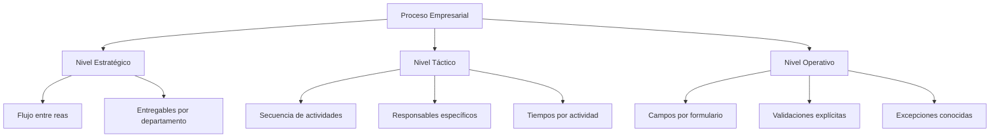
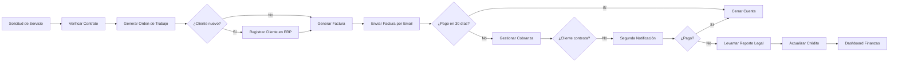
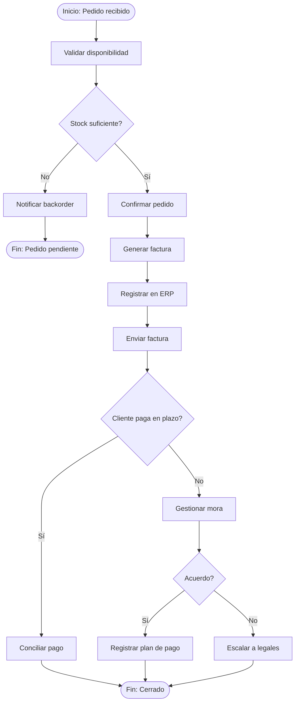
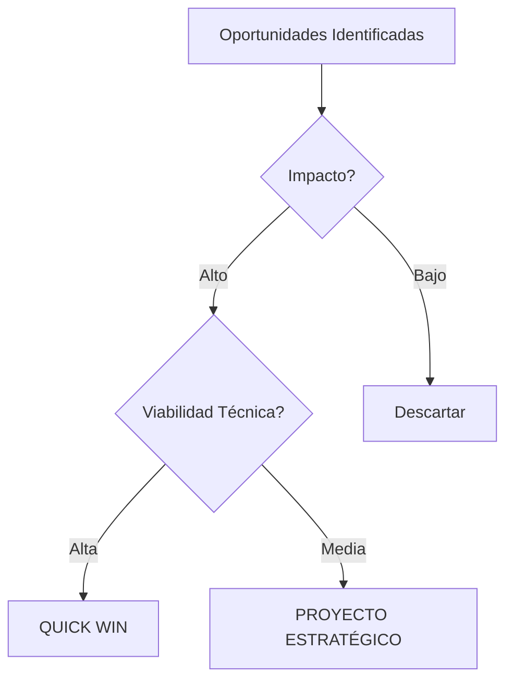

# MASTERCLASS: Estratega de Eficiencia Operativa con IA — Mapeo y Arquitectura de Procesos

> **Prerrequisito** — Esta guía asume que el lector ha completado `ia-mentalidad-estratega.md` o tiene experiencia práctica en diseño de procesos empresariales y nociones básicas de automatización.

---

# MÓDULO 2: MAPEO DE PROCESOS EMPRESARIALES

## CÓMO DOCUMENTAR PROCESOS

Un proceso no documentado es un proceso invisible para la automatización. Antes de aplicar IA, es indispensable mapear el flujo real —no el idealizado, no el que aparece en la descripción de puestos, sino el que efectivamente sucede día a día.

### Principio de documentación

La documentación de procesos debe ser:
- **Literal:** registrar lo que ocurre, no lo que debería ocurrir
- **Medible:** cada paso debe tener un tiempo, un costo y una frecuencia asociados
- **Observable:** cualquier persona nueva debe poder entender el proceso en menos de 30 minutos
- **Actualizable:** el documento está vivo; cambia cuando el proceso cambia

> **Regla de oro** — Si no puedes explicar el proceso en menos de 300 palabras, no lo has entendido lo suficiente como para automatizarlo.

### Métodos de documentación recomendados

| Método | Cuándo usarlo | Ventaja | Limitación |
|--------|---------------|---------|------------|
| **SIPOC** | Procesos nuevos o desconocidos | Vista de alto nivel sin entrar en detalle | No muestra secuencias ni decisiones |
| **Value Stream Mapping** | Procesos con desperdicio visible | Mide tiempo y fricción específica | Requiere datos cuantitativos |
| **BPMN** | Procesos complejos con múltiples caminos | Notación estándar internacional | Curva de aprendizaje alta |
| **Flujograma simple** | Documentación rápida interna | Fácil de crear y entender | No es estándar para proyectos grandes |
| **Grabación de pantalla / video** | Onboarding y validación | Capture 100% del flujo real | Dificulta extraer métricas |
| **Entrevista estructurada** | Contexto cualitativo | Captura conocimiento tácito | Subjetivo; requiere cruce de datos |

### Niveles de detalle



---

## SIPOC

SIPOC es la herramienta fundamental para iniciar cualquier mapeo de procesos. Provee una vista sistémica en 5 elementos antes de internarse en el detalle.

| Elemento | Pregunta que responde | Ejemplo: Proceso de Cobranza |
|----------|----------------------|------------------------------|
| **S** — Supplier (Proveedor) | ¿Quién o qué entrega la entrada? | Sistema ERP (facturas vencidas) |
| **I** — Input (Entrada) | ¿Qué recibe el proceso? | Facturas con > 30 días de vencimiento |
| **P** — Process (Proceso) | ¿Qué hace el sistema? | Clasifica, contacta, negocia, registra |
| **O** — Output (Salida) | ¿Qué produce? | Pagos recibidos, acuerdos de pago, actualización de cartera |
| **C** — Customer (Cliente) | ¿Quién recibe la salida? | Gerencia Financiera, área de Legales, el cliente deudor |

### Plantilla SIPOC reutilizable

| Proveedor | Entrada | Proceso (alto nivel) | Salida | Cliente |
|-----------|---------|----------------------|--------|---------|
| | | | | |
| | | | | |
| | | | | |

### Aplicación práctica

En una consultora de servicios profesionales, el proceso de generación de propuestas comerciales tenía el siguiente SIPOC:

- **Proveedor:** Director comercial y líder de práctica
- **Entrada:** Brief del cliente, información interna de proyectos similares, precios de referencia
- **Proceso:** Investigación de mercado, redacción de propuesta, revisión legal, aprobación comercial, envío al cliente
- **Salida:** Propuesta comercial firmada o rechazada, historial de versiones
- **Cliente:** Cliente potencial, director comercial, área de finanzas

> **Insight** — El SIPOC clarifica que el proceso no empieza cuando el equipo recibe el brief, sino antes: en la detección de la oportunidad. Eso abre una puerta para automatizar la detección de leads calificados, no solo la generación de propuestas.

---

## VALUE STREAM MAPPING (VSM)

El Value Stream Mapping mide el flujo de materiales e información en un proceso, identificando desperdicios (muda) en cada etapa. Es la herramienta más poderosa para detectar dónde aplicar IA porque convierte la fricción en datos.

### Símbolos básicos de VSM

| Símbolo | Significado | Uso en IA |
|---------|-------------|-----------|
| Círculo | Cliente / externo | Persona o sistema que recibe resultado |
| Cuadrado | Proceso / actividad | Paso donde se puede aplicar un agente |
| Triángulo | Inventario / espera | Cuello de botella detectable por IA |
| Flecha | Flujo / información | Integración por API |
| Rombo | Decisión | Punto donde un agente clasifica o deriva |
| Trapecio | Datos | Fuente de entrenamiento o input |

### Ejemplo de flujo de valor: Proceso de facturación en una pyme de servicios



### Tabla de detección de desperdicios (Muda)

| Tipo de desperdicio | En el flujo anterior | Oportunidad IA |
|---------------------|----------------------|----------------|
| **Sobreproducción** | Generar facturas antes de que el servicio se complete | Agente que valida hitos contractuales antes de facturar |
| **Espera** | El equipo espera aprobación de contratos nuevos | Agente que aprueba hasta un umbral automáticamente |
| **Transporte** | La información viaja por 3 departamentos antes de facturar | Integración directa CRM → ERP → Facturación |
| **Sobreprocesamiento** | Verificar información del cliente manualmente en cada facturación | Agente que alimenta datos desde el CRM maestro |
| **Inventario** | Clientes con facturas pendientes acumuladas sin acción | Agente de cobranza predictiva que prioriza por riesgo |
| **Movimiento** | El personal busca información en 4 sistemas distintos | Dashboard unificado con datos en tiempo real |
| **Defectos** | Facturas erróneas que requieren reemisión | Agente de validación previo al envío |
| **Talento no utilizado** | El equipo legal revisa contratos estándar | Agente de detección de anomalías en contratos |

> **Ejercicio para el lector:** Toma un proceso de tu empresa que tome más de 2 horas a la semana. Dibuja su Value Stream Map actual. Cuenta cuántos símbolos de espera (triángulos) aparecen. Esa es la oportunidad inicial más obvia.

---

## MAPEO DE PROCESOS (BPMN Y VARIANTES)

El Business Process Model and Notation (BPMN) es el estándar internacional para modelar procesos. No necesitas ser un experto en BPMN para documentar procesos; necesitas conocer los símbolos esenciales que permiten luego automatizarlos.

### Símbolos esenciales para IA

| Símbolo BPMN | Nombre | Aplicación en automatización |
|--------------|--------|------------------------------|
| `()` | Evento de inicio / fin | Trigger de automatización o punto de medición |
| `O` | Actividad / tarea | Paso candidato a agentes autónomos |
| `< >` | Puerta de decisión | Clasificación o branching por agente |
| `>` | Flujo de secuencia | Ejecución ordenada del workflow |
| `==` | Flujo paralelo | Ejecución concurrente de agentes |
| `//` | Subproceso | Orquestación de múltiples agentes |
| `(+)` | Conector de mensaje | Evento asincrónico o webhook |
| `@` | Pool / carril | Departamento o sistema externo |

### Ejemplo BPMN simplificado: Ciclo de pedido a cobro (Order-to-Cash)



### Checklist de documentación de procesos

| Pregunta | Respuesta esperada | ¿Documentado? |
|----------|-------------------|---------------|
| ¿Cuál es el propósito del proceso? | Un objetivo de negocio medible | ☐ |
| ¿Quiénes son los actores internos y externos? | Roles y sistemas claros | ☐ |
| ¿Cuáles son las entradas y salidas? | Dato o documento específico | ☐ |
| ¿Cuánto tiempo toma cada paso? | En minutos u horas | ☐ |
| ¿Cuál es la frecuencia del proceso? | Diaria, semanal, etc. | ☐ |
| ¿Qué sistemas se usan? | Herramientas específicas | ☐ |
| ¿Dónde ocurren los errores? | Tipos y frecuencias | ☐ |
| ¿Existe documentación escrita? | Sí / No | ☐ |
| ¿Qué decisiones requieren juicio humano? | Lista de excepciones | ☐ |
| ¿Qué información se pierde entre pasos? | Puntos de fricción | ☐ |

---

## IDENTIFICAR CUELLOS DE BOTELLA

Un cuello de botella es cualquier punto del proceso donde la capacidad de salida es menor que la demanda, generando espera. En el contexto de IA, los cuellos de botella son a su vez las mejores oportunidades de valor, porque aliviarlos desbloquea capacidad instalada sin contratar personal.

### Métodos de identificación

| Método | Herramienta | Señal de cuello de botella |
|--------|-------------|---------------------------|
| **Análisis de tiempos** | Cronometraje o registros de sistema | Un paso consume > 50% del tiempo total del proceso |
| **Análisis de colas** | ERP o sistema de tickets | Cola de espera creciente en un paso específico |
| **Análisis de capacidad** | Datos de producción | Throughput limitado por una sola persona o sistema |
| **Análisis de retrabajo** | Registros de errores | Un paso genera > 20% de retrabajo |
| **Análisis de experiencia del cliente** | Encuestas, NPS | El cliente percibe demora en un punto específico |
| **Análisis de costos** | Contabilidad de procesos | Un paso concentra > 40% del costo total |

### Tabla de evaluación de cuellos de botella

| Cuello de botella | Causa raíz | Impacto en el negocio | Viabilidad de automatización | Esfuerzo estimado |
|-------------------|------------|-----------------------|-------------------------------|-------------------|
| El equipo legal revisa contratos uno por uno | Volumen creciente, capacidad fija | Demora en cierre de ventas, oportunistas de mercado | Alta (contratos estandarizados) | Medio |
| La generación de informes consume 4 días | Datos en 5 sistemas, extracción manual | Decisiones tardías, desempeño no medido | Alta (ETLs + LLM) | Bajo |
| La atención al cliente responde en 48 horas | Solo 2 personas, volumen variable | Deserción de clientes, mala reputación | Media (chatbot + humano) | Medio |
| La conciliación bancaria toma 15 días/mes | 3.000 movimientos mensuales | Cash flow mal gestionado | Alta (OCR + conciliador) | Bajo |

> **Ejercicio:** Enumera los 3 cuellos de botella más importantes de tu empresa. Para cada uno, define: (1) el tiempo actual, (2) el tiempo objetivo con automatización, (3) el costo de implementación, (4) el ahorro anual estimado. Esto constituye tu hoja de ruta inicial.

---

## DÓNDE APLICAR IA: MATRIZ DE OPORTUNIDAD

No todos los pasos de un proceso son igualmente automatizables ni igualmente valiosos. Esta matriz ayuda a priorizar.

### Matriz: Impacto de negocio vs Viabilidad técnica



| Viabilidad tecnológica | Impacto alto | Impacto medio | Impacto bajo |
|-------------------------|--------------|---------------|--------------|
| **Alta** | **Quick win** | **Proyecto estándar** | Postergar |
| **Media** | **Proyecto estratégico** | Proyecto planificado | Postergar |
| **Baja** | Investigación / POC | Investigación / POC | Descartar |

### Criterios de viabilidad técnica

| Criterio | Evaluación | Peso |
|----------|-----------|------|
| Volumen suficiente | > 100 ejecuciones/mes | 25% |
| Datos disponibles y limpios | Sí / No / Parcial | 25% |
| Existencia de estándares | Formato predecible | 20% |
| Sensibilidad / riesgo | Bajo, medio o alto | 20% |
| Dependencia de juicio humano | Poca, media o mucha | 10% |

> **Nota** — Un proceso de alto impacto pero baja viabilidad no se descarta. Se convierte en un proyecto de investigación o se mejora la viabilidad mediante digitalización previa de las entradas.

---

## PLANTILLAS Y DIAGRAMAS DE MAPEO

### Plantilla: Mapa de procesos por departamento

| ID | Proceso | Departamento | Frecuencia | Tiempo actual | Costo (USD) | Tasa de error | Cuello de botella | Candidato IA | Prioridad |
|----|---------|--------------|------------|---------------|--------------|---------------|-------------------|--------------|-----------|
| P01 | | | | | | | | | |
| P02 | | | | | | | | | |
| P03 | | | | | | | | | |
| P04 | | | | | | | | | |
| P05 | | | | | | | | | |

### Plantilla: Ficha de proceso detallada

```text
Nombre del proceso: [nombre]
Objetivo: [qué logra y para quién]
Límites: [entrada y salida claras]
Dueño del proceso: [rol / persona]
Frecuencia: [continua, diaria, semanal, etc.]
Volumen: [tareas por periodo]
Duración total: [tiempo promedio]
Actores: [lista de roles/áreas]
Herramientas: [sistemas y software]

Pasos:
1. [Nombre] — [Responsable] — [Tiempo] — [Sistema] — [Tasa de error]
2. ...
3. ...

Puntos de decisión humana: [lista]
Reglas explícitas: [sí/no, lista]
Reglas implícitas: [sí/no, lista]

Problemas conocidos:
- [Problema] [Frecuencia] [Impacto]
```

---

## EJERCICIO 2.1: MAPEO COMPLETO DE UN PROCESO CRÍTICO

### Contexto
Elige uno de estos tres procesos (o el tuyo propio):
1. Generación y envío de presupuestos
2. Onboarding de clientes nuevos
3. Gestión de cobranza de deudas vencidas
4. Proceso de compras a proveedores
5. Proceso de control de calidad de entregables

### Instrucciones

**Paso A — SIPOC (15 minutos):**
Completa la tabla SIPOC para el proceso elegido.

| Proveedor | Entrada | Proceso | Salida | Cliente |
|-----------|---------|---------|--------|---------|
| | | | | |

**Paso B — Value Stream Map (20 minutos):**
Dibuja el flujo de valor. Marca con `[?]` cualquier dato que necesites validar con observación real.

**Paso C — Cuadro de desperdicios (10 minutos):**
Identifica al menos 5 desperdicios (muda) en el proceso.

| Desperdicio | Dónde ocurre | Frecuencia | Impacto económico estimado |
|-------------|-------------|------------|----------------------------|
| Sobreproducción | | | |
| Espera | | | |
| Transporte | | | |
| Sobreprocesamiento | | | |
| Inventario | | | |
| Movimiento | | | |
| Defectos | | | |
| Talento no utilizado | | | |

**Paso D — Oportunidades IA (15 minutos):**

| ID | Paso del proceso | Oportunidad de IA | Impacto esperado | Viabilidad |
|----|------------------|-------------------|------------------|------------|
| | | | | |

**Entrega:** Documento de 1 a 2 páginas con tu análisis completo.

---

## EJERCICIO 2.2: PRIORIZACIÓN DE PROCESOS

Usa esta matriz para priorizar los procesos de tu empresa.

| Proceso | Frecuencia (veces/mes) | Tiempo total (horas/mes) | Costo operativo (USD/mes) | Tasa de error | Impacto en el cliente | Viabilidad de automatización | Puntaje total |
|---------|------------------------|--------------------------|---------------------------|---------------|------------------------|-------------------------------|--------------|
| | | | | | | | |
| | | | | | | | |
| | | | | | | | |

**Fórmula de puntaje:**
- Frecuencia × 2
- Tiempo total × 3
- Costo operativo × 1
- Tasa de error × 5
- Impacto en el cliente × 4
- Viabilidad de automatización × 3

Ordena por puntaje descendente. Los primeros 3 son tus candidatos a quick wins.

---

## PROMPT LISTO PARA USAR: MAPEO DE PROCESOS

```text
Actúa como consultor BPM especializado en transformación digital.

Proceso a evaluar: [nombre del proceso]
Sector: [industria]
Volumen: [cantidad por mes]
Sistemas involucrados: [lista]

Genera un análisis completo del proceso que incluya:
1. SIPOC detallado (tabla)
2. Value Stream Map en Mermaid con símbolos VSM
3. Lista de desperdicios (muda) identificados con impacto estimado
4. Cuadro de cuellos de botella con causa raíz
5. Matriz de oportunidades de IA (impacto vs viabilidad)
6. Requisitos de datos para cada oportunidad
7. Primer paso concreto para automatizar el primer desperdicio

Usa lenguaje ejecutivo. Incluye al menos 3 ejemplos específicos con métricas. Estructura la salida como un documento que pueda presentarse al director general.
```

---

## ERRORES COMUNES EN EL MAPEO DE PROCESOS

| Error | Síntoma | Consecuencia | Antídoto |
|--------|---------|--------------|----------|
| **Mapear el proceso ideal, no el real** | El documentado no coincide con lo que la gente hace realmente | Automatización que no funciona porque nadie la usa | Observar el proceso en acción; entrevistar a los ejecutores |
| **Saltar directamente a la solución** | Empezar a evaluar herramientas antes de terminar el mapa | Solución parcial a un problema mal entendido | Establecer una regla: el mapa debe estar validado antes de continuar |
| **Documentar para archivo, no para operationalizar** | El documento se guarda y nunca se actualiza | La automatización se desfase de la realidad | Designar un owner que mantenga el documento vivo |
| **Ignorar las excepciones** | Mapear solo el camino feliz | Agentes que fallan en el 5% de casos que concentran el 80% del costo | Documentar excepciones explícitamente |
| **Sobredocumentar** | 50 páginas de BPMN para un proceso simple | Nadie lo lee, nadie lo usa | Aplicar la regla de 300 palabras; si no cabe, está sobredocumentado |
| **Mapear procesos aislados** | Cada departamento mapea lo suyo | Se pierden las interdependencias | Usar SIPOC como puente entre departamentos |

---

## CHECKLIST: MAPEO DE PROCESOS COMPLETO

### Antes de automatizar

| Check | Estado |
|-------|--------|
| El proceso objetivo está mapeado con SIPOC | ☐ |
| Existe un Value Stream Map con tiempos y desperdicios | ☐ |
| Las excepciones y reglas implícitas están documentadas | ☐ |
| La línea base de KPIs (tiempo, costo, error) está medida | ☐ |
| El dueño del proceso está identificado y participa | ☐ |
| Las herramientas actuales están inventariadas | ☐ |
| Los datos de entrada están identificados y su calidad evaluada | ☐ |
| El impacto del proceso en el negocio está cuantificado | ☐ |

### Calidad del mapeo

| Check | Estado |
|-------|--------|
| Al menos 2 ejecutores del proceso validaron el mapa | ☐ |
| Las decisiones humanas están explícitamente marcadas | ☐ |
| Los cuellos de botella están cuantificados | ☐ |
| Las oportunidades de IA están priorizadas | ☐ |
| Existe un quick win identificado para < 30 días | ☐ |

---

# MÓDULO 3: ARQUITECTURA DE AUTOMATIZACIÓN EMPRESARIAL

## CAPAS DE LA ARQUITECTURA MODERNA

Una arquitectura empresarial de automatización no es un solo software. Es un stack de capas que se integran.

```mermaid
flowchart TD
    subgraph "Capa 5: Gobernanza y Observabilidad"
        G1[Auditoría]
        G2[Métricas]
        G3[Políticas de IA]
        G4[Seguridad]
    end
    
    subgraph "Capa 4: Agentes Autónomos"
        A1[Agentes de Negocio]
        A2[Agentes de Supervisión]
        A3[Agentes de Coordinación]
    end
    
    subgraph "Capa 3: Orquestación de Workflows"
        O1[n8n / Make / LangGraph]
        O2[Event Bus]
        O3[Scheduler]
    end
    
    subgraph "Capa 2: Automatización Inteligente"
        I1[LLMs (OpenAI, Claude, Gemini)]
        I2[Modelos de Visión]
        I3[Modelos de Audio]
    end
    
    subgraph "Capa 1: Automatización Tradicional"
        T1[RPA]
        T2[Scripts / APIs]
        T3[Integraciones]
    end
    
    subgraph "Capa 0: Datos y Sistemas"
        D1[CRM]
        D2[ERP]
        D3[Bases de Datos]
        D4[Email / Chat]
        D5[Documentos]
    end
    
    D1 --> T1
    D2 --> T1
    D3 --> T1
    D4 --> T1
    D5 --> T1
    
    T1 --> I1
    T2 --> I2
    T3 --> I3
    
    I1 --> O1
    I2 --> O2
    I3 --> O3
    
    O1 --> A1
    O2 --> A2
    O3 --> A3
    
    A1 --> G1
    A2 --> G2
    A3 --> G3
    G1 --> G2 --> G3 --> G4
```

---

## AUTOMATIZACIÓN TRADICIONAL VS INTELIGENTE

| Dimensión | Automatización Tradicional | Automatización Inteligente |
|-----------|----------------------------|-----------------------------|
| **Lógica** | Reglas if-then explícitas | Razonamiento probabilístico y generativo |
| **Manejo de excepciones** | Fallo o desvío a humano | Clasifica y deriva con confianza |
| **Evolución** | Requiere reprogramación | Mejora con datos y retroalimentación |
| **Entradas** | Datos estructurados | Datos estructurados + texto + imágenes + voz |
| **Necesidad humana** | Ejecución constante | Supervisión y diseño del sistema |
| **Casos de uso típicos** | Facturación, backups, envíos | Atención al cliente, análisis legal, creación de contenido |

---

## SISTEMAS MÁS COMUNES Y SU FUNCIÓN

| Sistema | Función principal | Datos clave | Conexión crítica hacia |
|---------|-----------------|-------------|------------------------|
| **CRM** (HubSpot, Salesforce, Zoho) | Relación con clientes y pipeline | Leads, oportunidades, interacciones | Marketing, Ventas, Atención |
| **ERP** (Odoo, SAP, Oracle) | Operaciones, finanzas, inventario | Facturas, órdenes, pagos, stock | Todas las áreas |
| **ATS** (Workable, Greenhouse) | Reclutamiento y RRHH | candidatos, entrevistas, ofertas | RRHH, Toda empresa |
| **CMS** (WordPress, Contentful) | Contenido digital | Páginas, posts, activos | Marketing, SEO |
| **Helpdesk** (Zendesk, Intercom) | Atención al cliente | Tickets, soluciones, SLA | Clientes, Producto |
| **Finanzas** (Xero, QuickBooks, Sigo) | Contabilidad y tesorería | Asientos, conciliaciones, presupuestos | Dirección, Auditoría |
| **Comunicación** (Slack, Teams, Email) | Coordinación y notificaciones | Conversaciones, decisiones | Todos los agentes |
| **Almacenamiento** (Google Drive, SharePoint) | Documentos y archivos | Contratos, propuestas, informes | Legal, Ventas, Finanzas |

---

## INTEGRACIONES: APIS Y WEBHOOKS

### Tipos de API

| Tipo de API | Uso empresarial | Ejemplo |
|-------------|-----------------|---------|
| **REST** | Consulta y modificación de recursos estándar | Obtener cliente por ID desde HubSpot |
| **GraphQL** | Consultas flexibles y eficientes | Obtener datos de ventas, marketing y soporte en una sola llamada |
| **Webhook** | Reacción en tiempo real a eventos externos | Ejecutar una automatización cuando llega un nuevo lead |
| **SOAP** | Integraciones enterprise legacy | Conectar con ERP SAP on-premise |
| **gRPC / streaming** | Alta performance y baja latencia | Transmitir eventos de trading en tiempo real |

### Eventos vs APIs síncronas

| Patrón | Cuándo usarlo | Ventaja | Ejemplo |
|--------|---------------|---------|---------|
| **API síncrona (request → response)** | Necesitas el resultado antes de continuar | Control centralizado | Consultar stock antes de generar factura |
| **Evento asíncrono (evento → trigger)** | El resultado no es inmediato o el emisor no debe esperar | Desacoplamiento, resiliencia | Cuando un lead entra en el CRM, disparar workflow |
| **Webhook** | Un tercero notifica a tu sistema | Baja latencia, sin polling | Stripe notifica pago exitoso al ERP |
| **Polling** | El tercero no soporta webhooks y necesitas datos periódicos | Compatibilidad universal | Consultar cada 5 minutos si hay nuevos correos |

> **Principio de arquitectura** — Para automatizaciones empresariales, prioriza eventos y webhooks sobre polling. Los eventos eliminan la latencia, reducen consumo de API y crean un flujo real.

---

## ORQUESTACIÓN: CUÁNDO USAR CADA HERRAMIENTA

| Herramienta | Tipo | Mejor para | Ventaja principal | Limitación |
|-------------|------|------------|-------------------|------------|
| **Zapier** | No-code / low-code | Integraciones simples (< 5 pasos) | Rapidez de despliegue | Costo crece con volumen |
| **Make** | Visual / low-code | Workflows complejos con lógica condicional | Potencia y flexibilidad visual | Curva de aprendizaje media |
| **n8n** | Self-hosted / low-code | Automatizaciones completas en servidor propio | Control total, costo fijo | Requiere DevOps básico |
| **LangGraph** | Código (Python/TS) | Orquestación de agentes con estado | Control de grafo, memoria, reintentos | Requiere programación |
| **CrewAI** | Framework (Python) | Multiagentes colaborativos | Abstracción de roles y tareas | Menos control granular que LangGraph |
| **Airflow** | Código (Python) | Orquestación de data pipelines | Fiabilidad en data engineering | Overhead para workflows simples |

### Matriz de selección de herramienta de orquestación

| Necesidad | Herramienta recomendada |
|-----------|-------------------------|
| Conectar WhatsApp con CRM, sin programar | Make |
| Automatizar facturación end-to-end con lógica condicional | n8n |
| Orquestar agentes que conversan entre sí | CrewAI o LangGraph |
| Procesar 10.000 documentos/mes con pipeline ETL | Airflow + Python |
| Integrar eventos en tiempo real desde múltiples fuentes | n8n webhooks + Redis/SQLite |
| Presupuesto cero y máximo control | n8n self-hosted |

---

## ARQUITECTURA DE REFERENCIA: EMPRESA MEDIANA B2B

### Stack tecnológico recomendado para PYMEs

| Capa | Opción económica | Opción estándar | Opción enterprise |
|------|------------------|-----------------|-------------------|
| **Orquestación** | n8n self-hosted | n8n cloud / Make | Workato / Tray.io |
| **LLMs** | OpenAI GPT-4o mini | GPT-4o / Claude Sonnet | Modelos privados / fine-tuned |
| **Base de datos de contexto** | SQLite (n8n) | PostgreSQL + pgvector | Pinecone / Weaviate |
| **CRM** | HubSpot gratis / Zoho | HubSpot Sales Hub | Salesforce |
| **ERP** | Odoo Community | Odoo Enterprise | SAP / Oracle |
| **Comunicación** | Slack free / Discord | Slack Business | Microsoft Teams Enterprise |
| **Documentos** | Google Drive | SharePoint / Notion | Confluence / Salesforce Files |
| **Monitoreo** | UptimeRobot / Alertas n8n | Datadog | New Relic |

---

## CASO PRÁCTICO: INTEGRACIÓN DE AGENTES EN UNA CONSTRUCTORA

### Contexto

**Empresa:** Constructora Valdés S.A.  
**Sector:** Construcción de obra civil y vivienda  
**Ubicación:** Santiago, Chile  
**Empleados:** 120  
**Proyectos activos:** 12  
**Problema:** 40% del tiempo de ingenieros se pierde en coordinación, consultas de estado y generación de documentos administrativos.

### Resultados a 6 meses

| Métrica | Antes | Después | Cambio |
|---------|-------|---------|--------|
| Horas de ingenieros en coordinación | 160 h/semana | 40 h/semana | -75% |
| Tiempo de informe de avance | 16 h | 2 h | -87% |
| Tiempo de respuesta a proveedores | 48 h | 2 h | -96% |
| Tiempo de aprobación de materiales | 2 h | 15 min | -88% |
| Errores en avance reportado | 12% | 3% | -75% |

### Lección de arquitectura

El gran error fue intentar automatizar el informe de avance sin antes limpiar los datos en Odoo. La primera lección fue invertir 3 semanas en normalizar la entrada de datos en obra. Una vez que los datos entraron limpios, el agente de generación de informes funcionó desde la primera semana.

> **Máxima del arquitecto** — Garbage in, garbage out. La automatización inteligente amplifica la calidad de los datos, no la corrige.

---

## EJERCICIO 3.1: DISEÑO DE ARQUITECTURA INTEGRADA

### Contexto
Tu empresa tiene los siguientes sistemas:
- CRM: HubSpot
- ERP: Odoo
- Comunicación: Slack + Gmail
- Archivos: Google Drive
- Atención al cliente: Zendesk
- Marketing: WordPress + ActiveCampaign

### Tarea
Dibuja la arquitectura integrada que permitiría:
1. Un nuevo lead en HubSpot active una secuencia personalizada en ActiveCampaign.
2. Cuando el lead responde, se cree un ticket en Zendesk si requiere soporte técnico, o se actualice la etapa del pipeline en HubSpot si está listo para comprar.
3. Cuando se cierra una venta, se cree el cliente en Odoo y se genere la primera factura automáticamente.
4. Si el cliente no paga en 30 días, se active un agente de cobranza que envía recordatorios por email y actualiza el CRM.
5. Todo flujo quede registrado en un data warehouse para análisis posterior.

**Entregable:** Diagrama en Mermaid que muestre fuentes, capa de orquestación, lógica de branching y sistemas de salida.

---

## ERRORES COMUNES EN ARQUITECTURA DE AUTOMATIZACIÓN

| Error | Síntoma | Consecuencia | Antídoto |
|--------|---------|--------------|----------|
| **Integrar todo con todo** | Mapas con demasiadas conexiones | Mantenimiento infinito, puntos de fallo ocultos | Definir core graph; todo lo demás es excepción |
| **Subestimar la calidad de API** | Timeouts, rate limits, errores 500 | Workflows que fallan silenciosamente | Implementar retry, circuit breaker y monitoreo obligatorios |
| **Olvidar el estado** | Workflows sin memoria | Agentes que toman decisiones inconsistentes | Usar bases de datos o stores de estado explícitos |
| **Ignorar la seguridad** | APIs expuestas, datos en claro | Brechas de seguridad, incumplimiento normativo | HTTPS, OAuth, cifrado, segregación de entornos |
| **Monitoreo reactivo** | Solo detectar fallos cuando el usuario se queja | Daño reputacional antes de intervenir | Dashboards proactivos y alertas predictivas |
| **Inmutabilidad** | Cambiar la arquitectura constantemente | Caos en producción, datos inconsistentes | Versionar workflows y contratos de API |
| **Single point of failure** | Todo depende de una sola cuenta de servicio | Caída total si la cuenta se desactiva | Principio de redundancia y claves rotativas |
| **Olvidar la capa de gobernanza** | Agentes autónomos sin supervisión | Decisiones ilegales, éticas o ruinosas | Política de IA y auditorías obligatorias |

---

## CHECKLIST: ARQUITECTURA DE AUTOMATIZACIÓN EMPRESARIAL

### Infraestructura técnica

| Check | Estado |
|-------|--------|
| Los sistemas objetivo tienen API documentada | ☐ |
| Los webhooks relevantes están habilitados | ☐ |
| Existe una base de datos centralizada o datalake | ☐ |
| La orquestación está definida (n8n, Make, Airflow, etc.) | ☐ |
| Los agentes tienen acceso a los datos necesarios | ☐ |
| Existe un plano de red y seguridad definido | ☐ |
| Los entornos de prueba y producción están separados | ☐ |
| Las credenciales se almacenan en un vault o gestión de secretos | ☐ |

### Datos

| Check | Estado |
|-------|--------|
| Los datos están normalizados (formato, nombres, fechas) | ☐ |
| Existe un dueño de cada conjunto de datos | ☐ |
| Se han definido reglas de calidad (completitud, validez) | ☐ |
| Los datos sensibles están clasificados | ☐ |
| El backup y recuperación están probados | ☐ |

### Gobernanza

| Check | Estado |
|-------|--------|
| Política de IA escrita y aprobada | ☐ |
| Roles de aprobación definidos para cada tipo de automatización | ☐ |
| Existe un plan de respuesta ante fallos de agente | ☐ |
| Los logs son inmutables y conservados por 12 meses | ☐ |
| Se realizan auditorías periódicas de desempeño de agentes | ☐ |

### Operaciones

| Check | Estado |
|-------|--------|
| Existe un runbook para cada workflow crítico | ☐ |
| Los SLA están monitoreados automáticamente | ☐ |
| Existen alertas ante fallos de integración | ☐ |
| El equipo puede gestionar la plataforma sin el proveedor | ☐ |
| Los agentes tienen un kill-switch probado | ☐ |

---

## RESUMEN EJECUTIVO

Este segundo archivo de la master class cubre los cimientos técnicos y operativos del Estratega de Eficiencia Operativa con IA:

1. **Mapeo de procesos** es el paso previo obligatorio a cualquier automatización. Sin un mapa literal, medible y actualizado del proceso, la automatización es cara, lenta y fracasa.
2. **SIPOC, VSM y BPMN** son las herramientas de mapeo que todo estratega debe dominar. La elección depende del nivel de detalle requerido, pero todas comparten el objetivo de convertir la realidad operativa en un modelo accionable.
3. **Los cuellos de botella son oportunidades de IA.** Un buen mapeo revela desperdicios (muda) que, al aliviarlos, desbloquean capacidad sin costo adicional.
4. **La arquitectura empresarial es por capas:** datos → automatización tradicional → LLMs y modelos → orquestación → agentes autónomos → gobernanza. Cada capa tiene su herramienta óptima.
5. **Las integraciones deben ser eventos y webhooks, no polling constante.** Los eventos desacoplan sistemas, reducen latencia y crean un flujo real.
6. **La gobernanza no es un freno; es una garantía de sostenibilidad.** Sin políticas de IA, kill-switches y auditorías, la automatización puede generar riesgos mayores que los beneficios que resuelve.

**Próximo paso:** Arquitectura de agentes autónomos y su aplicación por área funcional en `ia-agentes-autonomos.md` (Módulos 4 y 5).

---

## PROMPTS ADICIONALES

### Prompt de mapeo de proceso estructurado

```text
Actúa como consultor BPM especializado en transformación digital.

Proceso a evaluar: [nombre del proceso]
Sector: [industria]
Volumen: [cantidad por mes]
Sistemas involucrados: [lista]

Genera un análisis completo que incluya:
1. SIPOC detallado (tabla)
2. Value Stream Map en formato Mermaid mostrando tiempos y desperdicios
3. Análisis de cuellos de botella con causa raíz usando 5 porqués
4. Lista de desperdicios (muda) con impacto cuantificado
5. Matriz de oportunidades IA (impacto vs viabilidad)
6. Propuesta de arquitectura técnica inicial
7. Primer piloto recomendado (30 días, < USD 5.000)
8. Métricas de éxito del piloto

Formato ejecutivo: máximo 2 páginas. Usa tablas y diagramas. Lenguaje claro, sin jerga innecesaria.
```

### Prompt de evaluación de herramientas de orquestación

```text
Actúa como arquitecto de automatización empresarial.

Contexto:
- Empresa: [tamaño, sector]
- Procesos a automatizar: [lista]
- Volumen estimado: [ejecuciones/mes]
- Presupuesto mensual: [USD]
- Capacidad técnica interna: [ninguna / junior / senior]
- Restricciones: [cumplimiento, latencia, etc.]

Evalúa 3 opciones de orquestación (n8n, Make, Zapier) y recomienda una.

Incluye:
1. Comparativa en tabla (costo, flexibilidad, curva de aprendizaje, escalabilidad)
2. Arquitectura de referencia para cada opción
3. Costo total de propiedad a 12 meses
4. Riesgos principales y mitigaciones
5. Recomendación final con justificación
6. Plan de implementación en 4 semanas
```