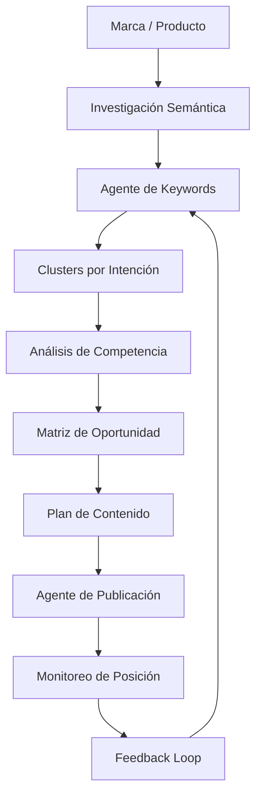
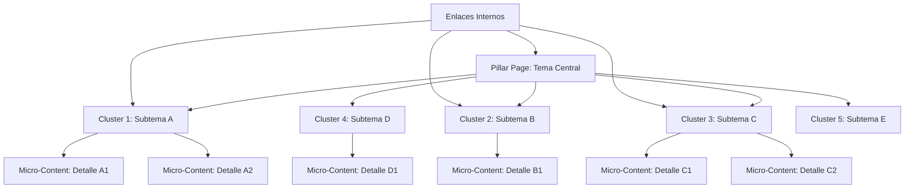
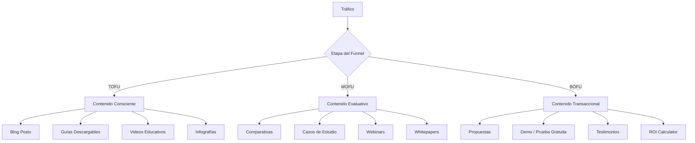
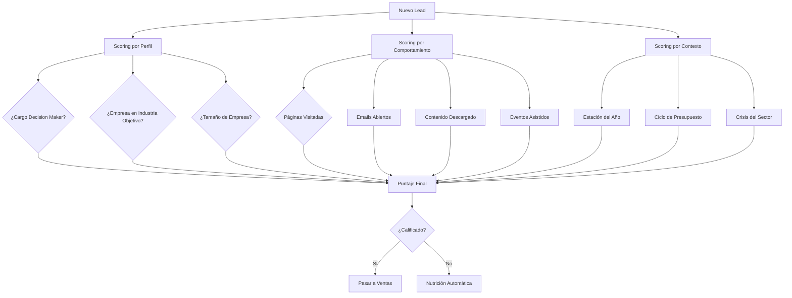
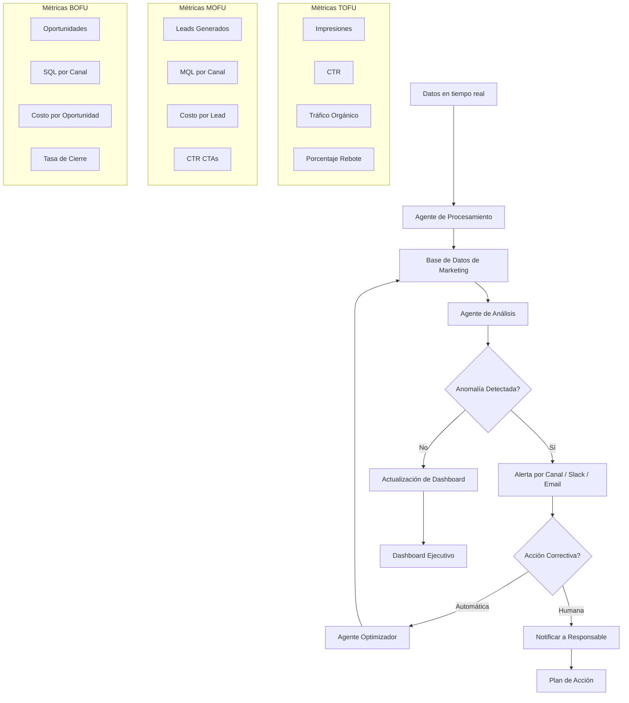
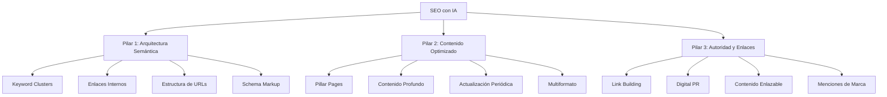
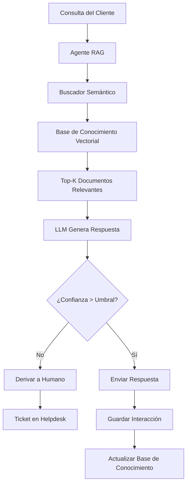
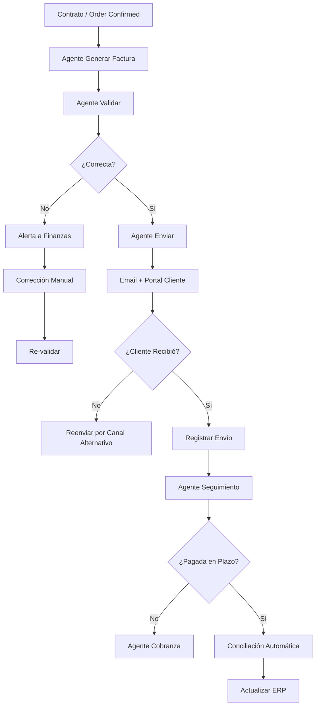

# MASTERCLASS: Estratega de Eficiencia Operativa con IA — Marketing, SEO y Automatización Core

> **Prerrequisito** — Esta guía asume dominio de los conceptos de las partes anteriores: mentalidad estratégica, mapeo de procesos, arquitectura de automatización y diseño de agentes autónomos.

---

# MÓDULO 6: IA PARA MARKETING Y SEO

## PRINCIPIO: EL MARKETING COMO SISTEMA, NO COMO CAMPAÑAS

La mayoría de las empresas trata el marketing como una sucesión de campañas: lanzar una campaña, medir resultados, planificar la siguiente. Este modelo genera picos de actividad, caídas de rendimiento y dependencia de la creatividad individual.

El marketing operado por IA es un **sistema continuo** donde cada actividad alimenta a las demás, donde los datos de performance retroalimentan la generación de contenido, donde la personalización escala sin costo adicional y donde el SEO se construye con disciplina arquitectónica, no con trucos.

### Modelo tradicional vs modelo aumentado

| Dimensión | Marketing Tradicional | Marketing Operado por IA |
|-----------|----------------------|--------------------------|
| Frecuencia de publicación | Campaña por campaña | Continua, optimizada por datos |
| Personalización | Segmentos amplios (3-5) | Hiperpersonalización individual |
| Investigación de keywords | Cada 3-6 meses | Continua, con detección de tendencias en tiempo real |
| Contenido | Generado por humanos (lento) | Generado por agentes (rápido), supervisado por humanos |
| Medición | Mensual o trimestral | Tiempo real, con ajuste automático de parámetros |
| Responsable | Equipo reducido | Arquitecto de marketing + agentes |

---

## INVESTIGACIÓN Y KEYWORDS CON IA

### Flujo de investigación estratégica



### Tipos de intención de búsqueda

| Intención | Características | Ejemplo | Prioridad para negocio |
|-----------|-----------------|---------|------------------------|
| **Informacional** | El usuario busca aprender | "qué es CRM" | Media (TOFU) |
| **Navegacional** | El usuario busca un sitio específico | "HubSpot login" | Alta (retención) |
| **Transaccional** | El usuario busca comprar | "mejor CRM para pymes" | Muy alta (BOFU) |
| **Comparación** | El usuario evalúa opciones | "HubSpot vs Zoho CRM" | Alta (MOFU/BOFU) |
| **Local** | El usuario busca cerca | "consultoría IA Madrid" | Alta (negocios locales) |

> **Regla de oro** — El 80% del valor de SEO está en las keywords transaccionales y de comparación. Las keywords informacionales generan tráfico pero no ingresos directos. Prioriza siempre la intención de compra.

---

## CLUSTERS DE CONTENIDO: ARQUITECTURA SEMÁNTICA

### Estructura de cluster



### Ejemplo de cluster para una consultora de IA empresarial

| Tipo | Título | Keywords objetivo |
|------|--------|-------------------|
| **Pillar** | Guía Definitiva de IA para Empresas 2026 | "IA para empresas", "inteligencia artificial empresarial", "IA en pymes" |
| **Cluster A** | Qué es un agente autónomo empresarial | "agente autónomo", "agente IA", "agentes para empresas" |
| **Cluster B** | Cómo automatizar procesos con IA | "automatización con IA", "RPA con IA", "automatizar procesos empresariales" |
| **Cluster C** | ROI de proyectos de IA en empresas | "ROI IA empresarial", "retorno inversión IA", "IA para reducir costos" |
| **Cluster D** | Casos de éxito de IA en B2B | "casos IA b2b", "IA en consultoras", "IA en servicios profesionales" |
| **Cluster E** | Cómo elegir herramientas de IA para tu empresa | "herramientas IA empresarial", "mejor IA para empresas", "stack IA PYMES" |

### Prompt para generación de clusters

```text
Actúa como SEO strategist senior especializado en arquitectura de contenido.

Empresa: {nombre, sector, buyer persona}
Pillar page existente: {URL o tema}
Objetivo: Expandir la autoridad temática de {TEMA_PRINCIPAL}

Genera una arquitectura de cluster completa:
1. Pillar page actualizada (título H1, meta description, outline de 2.000 palabras)
2. 8 cluster pages (título H1, meta description, outline de 1.200 palabras cada uno)
3. 12 micro-content pieces (título H1, outline de 600 palabras)
4. Mapa de enlaces internos (qué página enlaza a cuál)
5. Keywords por URL (principal + 3 secundarias)
6. Timeline de publicación sugerido
7. Prompt listo para generar cada pieza con IA

Considera:
- Competencia actual en el pillar page
- Keywords que rankean actualmente
- Keywords objetivo que queremos posicionar
- Intención de búsqueda por keyword
```

---

## CONTENIDO GENERADO CON IA: EMBUDOS, COPYWRITING Y FORMATOS

### Mapa de contenido por etapa del funnel



### Copywriting con IA

| Elemento | Función | Prompt base |
|----------|---------|-------------|
| **Headline** | Captar atención en 3 segundos | "Genera 10 headlines para {PÚBLICO} que quieren {RESULTADO}. Cada headline debe usar uno de estos formatos: {lista}. Incluye el dolor principal en el título." |
| **Hook** | Mantener la lectura en los primeros 100 caracteres | "Escribe un hook de 80 palabras para un email de {TEMA}. Debe contener: dato impactante, pregunta retórica, promesa específica." |
| **CTA** | Convertir interés en acción | "Genera 5 CTAs para {CONTEXTO}. Cada uno debe: usar verbo imperativo, especificar el beneficio, crear urgencia sutil. Variantes para frío, tibio y caliente." |
| **Email body** | Nutrir leads hasta la venta | "Escribe un email de nutrición para leads {ETAPA}. Incluye: personalización con {DATO}, historia relatable, prueba social, CTA suave." |
| **Social copy** | Generar engagement en redes | "Genera 5 posts para LinkedIn sobre {TEMA}. Cada uno: hook en primera línea, valor concreto, CTA de comentario. Longitud: 100-150 palabras." |

---

## LEAD SCORING Y CRM CON IA

### Modelo de lead scoring híbrido



### Variables de scoring por categoría

| Categoría | Variable | Puntos |
|-----------|----------|--------|
| **Perfil** | Cargo decision-maker (CEO, director) | +30 |
| | Empresa > 50 empleados | +20 |
| | Industria objetivo | +20 |
| | País objetivo | +10 |
| **Comportamiento** | Visitó pricing 3+ veces | +40 |
| | Descargó caso de éxito | +25 |
| | Asistió a webinar | +20 |
| | Solicitó demo | +35 |
| | Abrió 5+ emails | +15 |
| **Contexto** | Temporada alta de compras (según industria) | +15 |
| | Mencionó dolor en formulario de contacto | +20 |
| | Referido por cliente actual | +25 |
| | Visitó comparativa de competencia | +15 |

> **Nota** — Los pesos deben calibrarse históricamente. Después de 3 meses de operación, usa los datos de conversión para ajustar los puntajes. Un lead con 60 puntos que convierte en el 40% de los casos vale más que uno con 80 que convierte en el 5%.

---

## DASHBOARDS DE MARKETING CON IA

### Arquitectura de dashboard inteligente



### KPIs por etapa del funnel (con umbrales de alerta)

| Etapa | KPI | Frecuencia | Umbral de alerta | Meta |
|--------|-----|------------|------------------|------|
| **TOFU** | Tráfico orgánico | Semanal | Caída > 15% vs semana anterior | +20% mensual |
| **TOFU** | CTR orgánico | Semanal | CTR < 3% en keyword objetivo | CTR > 5% |
| **MOFU** | Leads generados | Diario | Caída > 25% vs promedio | Crecimiento 10% mensual |
| **MOFU** | Tasa de conversión landing | Diario | < 2% | > 5% |
| **MOFU** | Costo por lead | Semanal | > presupuesto por 20% | Disminuir 5% mensual |
| **BOFU** | Oportunidades creadas | Semanal | Caída > 20% | Crecimiento 15% mensual |
| **BOFU** | SQL por canal | Semanal | Canal con 0 SQL en 14 días | Revisar o pausar |
| **BOFU** | Costo por oportunidad | Mensual | > umbral de rentabilidad | Reducir 10% trimestral |
| **BOFU** | Revenue por canal | Mensual | Canal con revenue decreciente | Analizar y optimizar |

---

## SEO CON IA

### Los 3 pilares del SEO con IA



### Agente SEO autónomo

| Responsabilidad | Acción | Herramienta | Frecuencia |
|-----------------|--------|-------------|-----------|
| **Investigación** | Keywords nuevas, tendencias, cluster expansion | Perplexity, Ahrefs API | Semanal |
| **Auditoría técnica** | Crawling, indexación, Core Web Vitals | Screaming Frog, PageSpeed Insights | Quincenal |
| **Generación** | Artículos optimizados, meta tags, schema | LLM + plantillas | Según calendario |
| **Enlaces internos** | Sugerencias de linking entre páginas | Análisis de contenido + LLM | Mensual |
| **Monitoreo** | Posiciones, tráfico, errores | Search Console API, Ahrefs | Diario |
| **Reporte** | Informe ejecutivo con recomendaciones | LLM + datos | Semanal |

---

## PROMPTS ESPECIALIZADOS PARA MARKETING Y SEO

### Prompt para generación de calendario de contenido

```text
Actúa como director de contenido para {EMPRESA}, {SECTOR}.
Contexto:
- Buyer persona principal: {Rol, dolores, canales preferidos}
- Objetivos: {Leads, ventas, autoridad, comunidad}
- Palabras clave principales: {Lista de 10-15}
- Recursos disponibles: {Redactor interno, diseñador, presupuesto}
- Calendario: {Semanas a planificar}
Genera:
1. Calendario de contenido para {N} semanas (formato semanal)
   - Por cada semana: 1 artículo blog (2.000 palabras, SEO optimizado) + 5 posts redes + 2 emails
2. Para cada artículo: título SEO, meta description, outline completo, keywords objetivo, cluster interno sugerido
3. Para cada post social: plataforma, texto, hashtags sugeridos, hora recomendada
4. Para cada email: asunto, preview text, resumen del contenido
5. Matriz de contenido por etapa del funnel (TOFU, MOFU, BOFU)
6. Prompt listo para generar cada pieza con LLM
7. Plan de distribución automática
Incluye 2 piezas virales potenciales identificadas por tendencias actuales.
```

### Prompt para análisis de competencia SEO

```text
Actúa como SEO analyst senior.
Empresa objetivo: {URL}
Competidores principales: {URLs}
Keywords objetivo: {lista de 10}
Para cada keyword, analiza las 3 primeras posiciones y genera:
1. Título y meta description actuales
2. Tipo de contenido (blog, landing, herramienta, etc.)
3. Longitud del contenido (palabras)
4. Estructura de encabezados (H1, H2, H3)
5. Schema markup detectado
6. Backlinks estimados (si disponible)
7. Puntuación de contenido en escala 1-10
8. Brecha detectada (qué falta para superarlos)
9. Contenido que podríamos crear para rankear #1
Conclusiones finales:
- Top 3 keywords prioritarias a atacar
- Estrategia de contenido recomendada para cada una
- Timeline estimado para posicionar
```

---

# MÓDULO 7: AUTOMATIZACIÓN CORE DEL NEGOCIO

## CLASIFICACIÓN DE PROCESOS

| Tipo | Definición | Ejemplos | Nivel de automatización típico |
|------|------------|----------|-------------------------------|
| **Core** | Generan ingresos directos | Ventas, entrega de servicio, desarrollo de producto | Media-alta (diferencia competitiva) |
| **Core soporte** | Habilitan el core | RRHH, IT, legal | Media |
| **Back office** | No vinculan directamente con clientes | Contabilidad, finanzas, administrativo | Alta (quick wins) |
| **Estratégico** | Definen rumbo | Planificación, análisis, dirección | Baja (soporte solamente) |

> **Principio** — Automatiza primero el back office (quick wins, ROI rápido), pero no descuides el core. La automatización del back office paga la automatización del core, donde está la verdadera ventaja competitiva.

## PROCESOS REPETITIVOS: IDENTIFICACIÓN Y AUTOMATIZACIÓN

| Criterio | Síntoma | Umbral |
|----------|---------|--------|
| **Frecuencia** | Se ejecuta semanal, diaria o múltiples veces al día | > 4 veces/mes |
| **Volumen** | Consume tiempo significativo del equipo | > 8 horas/mes |
| **Reglas claras** | Las reglas de decisión son conocidas y estables | > 80% de casos siguen la regla |
| **Datos estructurados** | La información de entrada es accesible y limpia | Datos en sistema, no en papel |
| **Error predecible** | Los errores son conocidos y cuantificables | Tasa de error medible |

## BACK OFFICE AUTOMATIZADO

| Proceso | Herramientas base | Agente sugerido | Ahorro típico |
|---------|-------------------|-----------------|---------------|
| **Conciliación bancaria** | ERP + extractos | Agente conciliador | 80-90% del tiempo |
| **Facturación recurrente** | ERP + contratos | Agente facturador | 95% del tiempo |
| **Cobranza automática** | ERP + email | Agente cobrador | 70-85% del tiempo |
| **Control de gastos** | Expense management | Agente auditor | 60-75% del tiempo |
| **Gestión de documentación** | Drive, SharePoint | Agente documentalista | 90% del tiempo |
| **Reportes financieros** | ERP + hoja de cálculo | Agente reportero | 85% del tiempo |
| **Gestión de proveedores** | ERP + portal | Agente compras | 50-70% del tiempo |
| **Onboarding administrativo** | ATS + email | Agente onboarding | 80% del tiempo |

## FRONT OFFICE Y ATENCIÓN AL CLIENTE

### Niveles de automatización en atención al cliente

| Nivel | Automatización | Interacción humana | Caso de uso típico |
|-------|----------------|-------------------|--------------------|
| **1 - FAQ básico** | Chatbot con respuestas predefinidas | Solo si no encuentra respuesta | Consultas frecuentes simples |
| **2 - IA generativa** | LLM entrenado en base de conocimiento | Derivación por tema o sentimiento | Soporte nivel 1 completo |
| **3 - Contextual** | Agente con acceso a CRM y datos del cliente | Casos complejos, quejas, ventas | Soporte personalizado |
| **4 - Proactivo** | Agente detecta problemas antes de que el cliente se queje | Solo escalaciones | Post-venta, mantenimiento predictivo |

### Agente de atención al cliente con RAG



---

## CASO PRÁCTICO: AGENTE DE CONTENIDO PARA ECOMMERCE B2B

### Contexto

**Empresa:** IndustrialTools S.A.  
**Sector:** Venta de herramientas industriales B2B  
**Facturación:** USD 5,8M/año  
**Empleados:** 45  
**Web:** 12.000 visitantes/mes, 8% conversión en lead  
**Problema:** El equipo de marketing (2 personas) no puede generar contenido suficiente para alimentar el funnel. Produce 2 artículos/mes, 4 posts por semana. Necesita 10 artículos/mes y 20 posts.

### Resultados a 4 meses

| Métrica | Antes | Después | Cambio |
|---------|-------|---------|--------|
| Artículos/mes | 2 | 15 | +650% |
| Posts en redes/mes | 16 | 60 | +275% |
| Tráfico orgánico | 1.100/mes | 7.800/mes | +609% |
| Leads/mes | 96 | 310 | +223% |
| Costo por lead | USD 28 | USD 9 | -68% |
| Revenue atribuido a contenido | USD 45.000/mes | USD 168.000/mes | +273% |
| Horas de marketing en contenido | 120 h/mes | 35 h/mes | -71% |

---

## FACTURACIÓN AUTOMATIZADA

### Flujo automatizado de facturación



---

## KPI, SLA Y DASHBOARDS OPERATIVOS

### Matriz KPI por área

| Área | KPI de eficiencia | KPI de calidad | KPI de costo | SLA típico |
|------|-------------------|----------------|--------------|------------|
| **Ventas** | Leads procesados / h | Tasa de conversión | Costo por lead | Respuesta a lead < 2 h |
| **Marketing** | Piezas publicadas / semana | CTR, tasa de conversión | CPA | Revisión de campaña semanal |
| **Finanzas** | Cierres contables / mes | Tasa de error | Costo de procesamiento | Cierre mensual en < 5 días |
| **RRHH** | Tiempo de contratación | Satisfacción del candidato | Costo por contratación | Respuesta a candidato < 48 h |
| **Operaciones** | Ordenes procesadas / día | Tasa de defectos | Costo por transacción | Tiempo de ciclo < X horas |
| **Atención al cliente** | Tickets resueltos / h | CSAT, NPS | Costo por ticket | Primer respuesta < 1 h |

---

## EJERCICIO 6.1: DISEÑO DE ARQUITECTURA DE CONTENIDO

| Actividad | Entregable | Tiempo estimado |
|-----------|------------|-----------------|
| 1. Análisis de contenido actual | Auditoría de 20 artículos existentes | 30 min |
| 2. Investigación de keywords | 30 keywords priorizadas por intención | 45 min |
| 3. Diseño de arquitectura de cluster | Pillar page + 5 clusters | 60 min |
| 4. Prompt para generación de contenido | Prompt base para redactor IA | 20 min |
| 5. Diseño de dashboard | KPIs + alerts + frecuencia | 30 min |

---

## EJERCICIO 7.1: MAPA DE PROCESOS CORE Y BACK OFFICE

| ID | Proceso | Tipo | Volumen/mes | Tiempo actual | Costo mensual | Tasa de error | Candidato a automatización | Quick win? |
|----|---------|------|-------------|---------------|---------------|---------------|---------------------------|------------|
| | | | | | | | | |
| | | | | | | | | |
| | | | | | | | | |

**Priorización:**
1. Ordena por ROI estimado (ahorro anual / costo de automatización) descendente.
2. Los primeros 3 son tus proyectos prioritarios del trimestre.
3. El primero debe ser un quick win (< 30 días, < USD 5.000).

---

## ERRORES COMUNES EN MARKETING Y AUTOMATIZACION CORE

| Error | Síntoma | Consecuencia | Antídoto |
|--------|---------|--------------|----------|
| **Marketing = Campañas aisladas** | No hay coordinación entre contenido, SEO, email y publicidad | Inconsistencia, bajo rendimiento | Diseñar sistema orquestado, no tácticas dispersas |
| **SEO de Keywords sin clusters** | Artículos sobre keywords relacionadas pero sin conexión | Autoridad fragmentada, competencia duplicada | Arquitectura de cluster antes de escribir |
| **Automatizar sin línea base** | No medir el antes; no poder demostrar ROI | Proyecto sin patrocinio continuo | Medir KPIs actuales antes de cualquier automatización |
| **Bot como único canal de soporte** | Eliminar contacto humano para reducir costo | Clientes frustrados, churn aumentado | Modelo híbrido: bot para consultas simples, humano para complejas |
| **Facturar sin validar** | Enviar facturas con errores fiscales | Multas, descuentos forzosos, mala reputación | Agente validador previo al envío |
| **Olvidar el mantenimiento** | Bots y agentes se degradan con el tiempo sin supervisión | Calidad cae, clientes se quejan | Mantenimiento mensual: actualizar base de conocimiento, revisar log |
| **Generar contenido sin estrategia** | Artículos sin conexión con el funnel | Tráfico sin conversión | Cada pieza debe tener objetivo, buyer persona y CTA definidos |

---

## CHECKLIST: SISTEMA DE MARKETING OPERADO POR IA

### Estrategia

| Check | Estado |
|-------|--------|
| Existe un mapa de buyer personas documentado | ☐ |
| Las keywords objetivo están clasificadas por intención y prioridad | ☐ |
| La arquitectura de clusters está diseñada | ☐ |
| El funnel tiene métricas definidas por etapa | ☐ |

### Contenido

| Check | Estado |
|-------|--------|
| El calendario de contenido está planificado a 90 días | ☐ |
| Los prompts de generación están documentados y versionados | ☐ |
| El proceso de revisión humana está definido | ☐ |
| La base de conocimiento del agente de contenido está actualizada | ☐ |

### SEO

| Check | Estado |
|-------|--------|
| El sitio tiene audit técnica completa | ☐ |
| Los clusters principales tienen pillar page | ☐ |
| El schema markup está implementado | ☐ |
| Las Core Web Vitals están en verde | ☐ |
| Existe un agente de monitoreo SEO diario | ☐ |

### Automatización Core

| Check | Estado |
|-------|--------|
| Los procesos core y back office están mapeados | ☐ |
| Los quick wins están identificados y en ejecución | ☐ |
| Los KPIs de cada proceso están medidos | ☐ |
| Los dashboards muestran datos en tiempo real | ☐ |
| Los kill-switches están probados | ☐ |

---

## RESUMEN EJECUTIVO

Este cuarto archivo de la master class cubre dos motores de crecimiento y eficiencia:

1. **Marketing con IA** no es hacer campañas más rápido. Es construir un sistema de generación, distribución y optimización de contenido que escala sin costo lineal, con personalización individual y mejora continua.
2. **SEO con IA** es arquitectura semántica + contenido profundo + autoridad. No es trucos. Es un sistema que gana posiciones con paciencia y consistencia.
3. **El core del negocio automatizado** libera a las personas de la fricción mecánica para que se enfoquen en la creatividad, la relación con el cliente y la mejora del sistema.
4. **Bots y agentes en front office** no reemplazan la calidez humana; la amplifican. Resuelven lo repetitivo para que las personas resuelvan lo complejo.
5. **Dashboards y alertas** cierran el ciclo de retroalimentación. Sin medición en tiempo real, la automatización es ciega.

**Próximo paso:** Reducción de costos, detección de desperdicios y escalabilidad sin aumento de personal en `ia-reduccion-costos-escalabilidad.md` (Módulos 8 y 9).