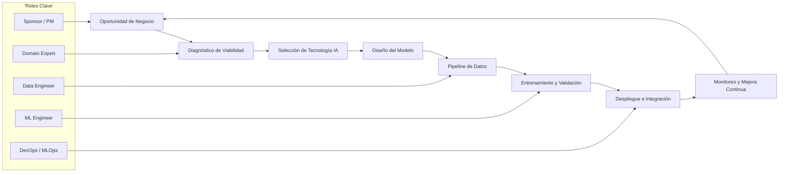
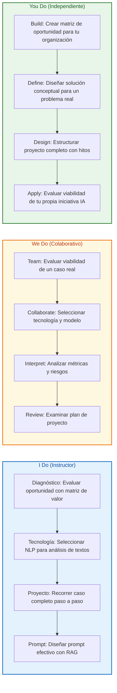
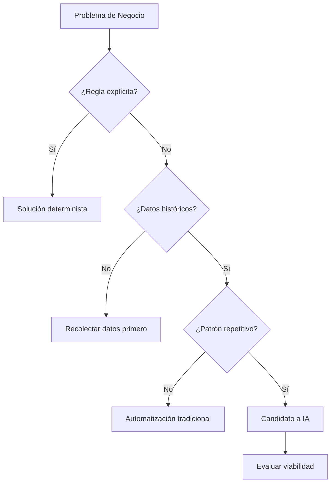
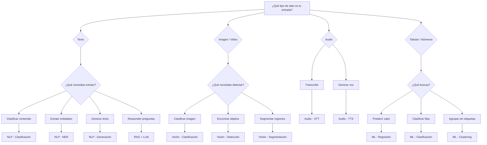
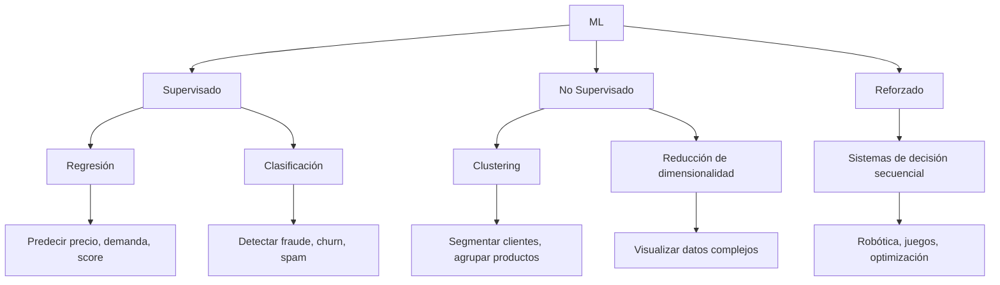
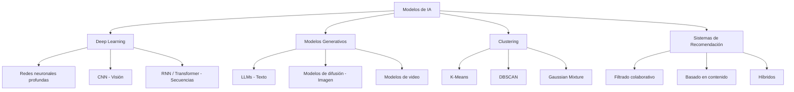
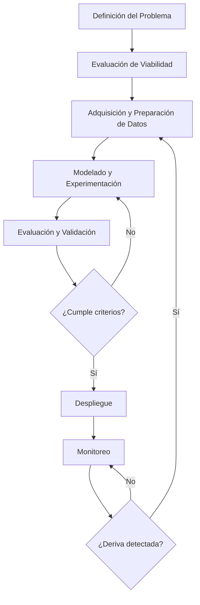
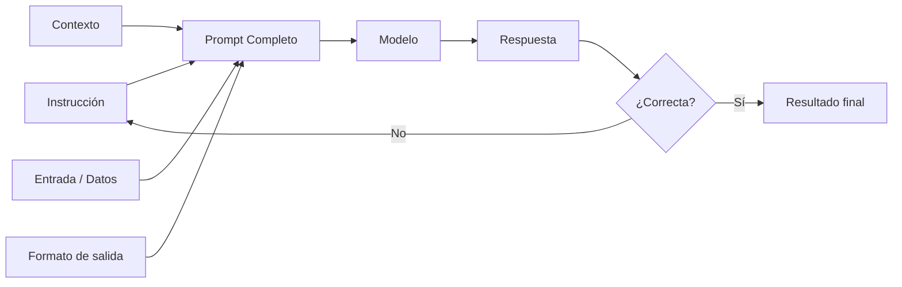
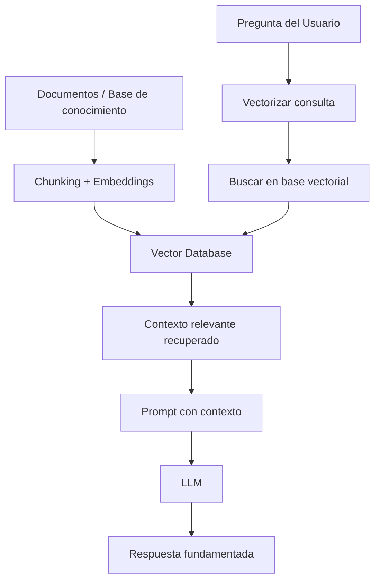
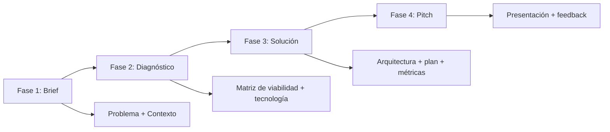

# MASTERCLASS: IA Empresarial — De la Estrategia a la Implementación

## INTRODUCCIÓN: POR QUÉ ESTE MASTERCLASS ES DIFERENTE

La inteligencia artificial está en todas partes. Cada semana aparece un nuevo modelo, una nueva herramienta, una nueva promesa. El ruido es ensordecedor. El resultado: empresas que saltan directo a la tecnología sin entender el problema, equipos que compran APIs sin tener datos, y ejecutivos que confunden un chatbot con una estrategia de IA.

Este masterclass propone otro camino: un **framework estructurado** para navegar desde la detección de oportunidades hasta la implementación de proyectos de IA, pasando por la selección de tecnología, la viabilidad de datos y la gestión del riesgo.

La meta no es convertirte en científico de datos. La meta es darte un proceso repetible para identificar, evaluar, diseñar y ejecutar soluciones basadas en IA con criterio empresarial.

> **Objetivo de Aprendizaje** — Al final de esta guía, podrás diagnosticar oportunidades de IA en tu organización, seleccionar la tecnología adecuada, estructurar un proyecto de principio a fin, aplicar modelos generativos con criterio, y evaluar la viabilidad técnica y de negocio de cualquier iniciativa de IA.

> **Advertencia educativa** — Este contenido es formativo. Ninguna herramienta, modelo o métrica debe interpretarse como recomendación de compra o implementación sin el debido análisis de contexto, datos y riesgos.

---

## MAPA DEL WORKFLOW



| Fase | Pregunta que responde | Output principal |
|------|-----------------------|------------------|
| **Oportunidad de Negocio** | ¿Vale la pena usar IA aquí? | Business case preliminar |
| **Diagnóstico de Viabilidad** | ¿Tenemos datos y capacidad? | Matriz de viabilidad |
| **Selección de Tecnología IA** | ¿Qué tipo de IA necesita el problema? | Árbol de decisión tecnológica |
| **Diseño del Modelo** | ¿Cómo resolvemos el problema? | Arquitectura del modelo |
| **Pipeline de Datos** | ¿Los datos son confiables? | Pipeline ETL validado |
| **Entrenamiento y Validación** | ¿El modelo funciona? | Métricas y sesgos documentados |
| **Despliegue e Integración** | ¿Cómo llega a producción? | API / workflow integrado |
| **Monitoreo y Mejora** | ¿El modelo sigue sirviendo? | Dashboard de deriva y retraining |



---

## PARTE 1: DIAGNÓSTICO DE OPORTUNIDADES IA

### 1.1 Principio Central

No todo problema necesita IA. De hecho, la mayoría de los problemas empresariales se resuelven mejor con una regla de negocio bien diseñada, una base de datos bien indexada o un proceso bien documentado.

El primer filtro no es técnico: es de valor. La pregunta no es "¿podemos usar IA?", sino "¿resuelve IA este problema mejor, más rápido o más barato que las alternativas?"



### 1.2 Matriz de Valor de Oportunidades IA

| Cuadrante | Impacto en negocio | Viabilidad técnica | Acción |
|-----------|-------------------|-------------------|--------|
| **Estrella** | Alto | Alta | Priorizar implementación |
| **Apuesta** | Alto | Baja | Invertir en datos o talento |
| **Rápidas** | Bajo | Alta | Automatizar con herramientas existentes |
| **Descartar** | Bajo | Baja | No perseguir |

### 1.3 Criterios para detectar oportunidades

| Criterio | Pregunta guía | Señal positiva |
|----------|---------------|----------------|
| **Volumen** | ¿Hay muchas instancias del mismo problema? | Miles de tickets, transacciones, documentos |
| **Patrón** | ¿El problema sigue un patrón reconocible? | Clientes similares, textos parecidos |
| **Datos** | ¿Tenemos ejemplos históricos? | Base de datos, logs, registros |
| **Costo actual** | ¿Resolverlo manualmente es caro? | Horas-hombre significativas |
| **Velocidad** | ¿Necesitamos responder en tiempo real? | Segundos, no horas |
| **Escalabilidad** | ¿El volumen crece más rápido que el equipo? | Contratación no da abasto |

### 1.4 Pseudocódigo: Evaluador de Oportunidad

```text
FUNCION evaluar_oportunidad(problema, datos_disponibles, impacto_estimado)
    
    SI problema.tiene_regla_explicita ENTONCES
        RETORNAR "No IA - Solución determinista"
    
    SI datos_disponibles.calidad == "insuficiente" ENTONCES
        RETORNAR "Inviable - Recolectar datos primero"
    
    SI impacto_estimado < umbral_minimo ENTONCES
        RETORNAR "Descartar - Impacto insuficiente"
    
    puntaje = 0
    
    SI problema.frecuencia > 1000_instancias_por_mes ENTONCES
        puntaje = puntaje + 25
    
    SI problema.sigue_patron ENTONCES
        puntaje = puntaje + 25
    
    SI datos_disponibles.ejemplos_etiquetados > 1000 ENTONCES
        puntaje = puntaje + 25
    
    SI problema.requiere_velocidad > "humano" ENTONCES
        puntaje = puntaje + 25
    
    RETORNAR puntaje
```

| Puntaje | Decisión |
|---------|----------|
| 75-100 | Prioridad alta — proceder a diseño |
| 50-74 | Prioridad media — profundizar análisis |
| 25-49 | Prioridad baja — monitorear, no invertir |
| 0-24 | Descartar — no es candidato a IA |

---

## PARTE 2: TECNOLOGÍAS DE IA — CUANDO USAR CADA UNA

### 2.1 Principio Central

La tecnología de IA no se elige por moda. Se elige por el tipo de dato que manejas y la pregunta que necesitas responder.

Cada tecnología resuelve una familia de problemas. Elegir la incorrecta es la fuente más común de fracaso en proyectos de IA.

### 2.2 Árbol de Decisión Tecnológica



### 2.3 Tecnologías y sus Aplicaciones

| Tecnología | Sub-área | Qué resuelve | Ejemplo de aplicación |
|------------|----------|--------------|-----------------------|
| **NLP** | Clasificación | Categorizar textos automáticamente | Tickets de soporte, correos, reseñas |
| **NLP** | Extracción (NER) | Identificar entidades en texto | Facturas, contratos, currículums |
| **NLP** | Generación | Producir texto coherente | Reportes, resúmenes, respuestas |
| **NLP** | Búsqueda semántica | Encontrar información por significado | Bases de conocimiento internas |
| **Visión** | Clasificación | Identificar qué hay en una imagen | Control de calidad visual |
| **Visión** | Detección de objetos | Localizar elementos en imagen | Inventario, seguridad |
| **Visión** | OCR | Extraer texto de imágenes | Digitalización de documentos |
| **Audio** | STT / TTS | Transcribir o sintetizar voz | Transcripción de reuniones, IVR |
| **Video** | Análisis temporal | Detectar eventos en secuencia | Monitoreo, deportes, seguridad |
| **Tabular** | ML clásico | Predecir o clasificar desde datos | Scoring crediticio, churn, demanda |
| **Tabular** | Clustering | Segmentar sin etiquetas | Segmentación de clientes |

### 2.4 Pseudocódigo: Seleccionar Tecnología

```text
FUNCION seleccionar_tecnologia(tipo_dato, objetivo, restricciones)
    
    SEGUN tipo_dato:
        CASO "texto":
            SEGUN objetivo:
                CASO "categorizar": RETORNAR "NLP Clasificación"
                CASO "extraer_info": RETORNAR "NLP - NER"
                CASO "generar": RETORNAR "LLM + Prompt Engineering"
                CASO "responder": RETORNAR "RAG + LLM"
        
        CASO "imagen":
            SEGUN objetivo:
                CASO "identificar": RETORNAR "Visión - Clasificación"
                CASO "localizar": RETORNAR "Visión - Detección"
                CASO "segmentar": RETORNAR "Visión - Segmentación"
        
        CASO "audio":
            SEGUN objetivo:
                CASO "transcribir": RETORNAR "STT (Speech-to-Text)"
                CASO "sintetizar": RETORNAR "TTS (Text-to-Speech)"
        
        CASO "tabular":
            SEGUN objetivo:
                CASO "predecir_numero": RETORNAR "ML - Regresión"
                CASO "clasificar": RETORNAR "ML - Clasificación"
                CASO "segmentar": RETORNAR "ML - Clustering"

    RETORNAR "Tecnología no identificada — consultar especialista"
```

### 2.5 Limitaciones por Tecnología

| Tecnología | No sirve para | Riesgo típico |
|------------|---------------|---------------|
| NLP | Razonamiento matemático preciso | Alucinaciones en generación |
| Visión | Detectar conceptos abstractos | Sesgo por dataset de entrenamiento |
| Audio | Distinguir voces similares | Ruido de fondo degrada precisión |
| ML tabular | Datos no estructurados | Overfitting con pocas muestras |
| LLMs | Tareas deterministas críticas | Costo y latencia elevados |

---

## PARTE 3: FUNDAMENTOS DE MACHINE LEARNING

### 3.1 Principio Central

El Machine Learning no es magia: es estadística aplicada a gran escala. Un modelo aprende patrones a partir de ejemplos, y esos patrones solo son útiles si los datos de entrenamiento representan fielmente la realidad donde el modelo va a operar.

### 3.2 Tipos de Aprendizaje



| Tipo | Necesita etiquetas | Ejemplos suficientes | Pregunta que responde |
|------|-------------------|---------------------|-----------------------|
| **Supervisado** | Sí | +1000 por clase | ¿Qué es esto? / ¿Cuánto vale? |
| **No supervisado** | No | +100 | ¿Cómo se agrupa esto? |
| **Reforzado** | No (usa recompensa) | Miles de simulaciones | ¿Qué acción tomar ahora? |

### 3.3 Requerimientos de Datos

| Condición | Mínimo aceptable | Ideal |
|-----------|------------------|-------|
| Ejemplos por clase (clasificación) | 100-500 | +5000 |
| Registros (regresión) | 1000 | +50000 |
| Calidad de etiquetas | 90% precisión | +99% |
| Balance de clases | Clase minoritaria > 10% | Proporción natural |
| Rango temporal | 1 ciclo completo | 3+ ciclos |
| Features relevantes | 5-10 | 20-50 |

### 3.4 Pipeline de ML

```text
ENTRADA: Datos crudos

1. RECOLECCIÓN
   - Fuente: base de datos, API, archivos
   - Formato: estructurado, semi-estructurado, no estructurado

2. LIMPIEZA
   - Valores nulos: imputar o descartar
   - Outliers: detectar y decidir tratamiento
   - Duplicados: eliminar
   - Errores: corregir o etiquetar

3. TRANSFORMACIÓN
   - Features numéricas: normalizar o estandarizar
   - Features categóricas: codificar
   - Features textuales: vectorizar
   - Reducción de dimensionalidad si aplica

4. DIVISIÓN
   - Entrenamiento: 70-80% (donde el modelo aprende)
   - Validación: 10-15% (para ajustar hiperparámetros)
   - Prueba: 10-15% (evaluación final, una sola vez)

5. ENTRENAMIENTO
   - Seleccionar algoritmo según problema
   - Entrenar con datos de entrenamiento
   - Evaluar en validación
   - Iterar hasta convergencia

6. EVALUACIÓN
   - Ejecutar UNA vez contra datos de prueba
   - Comparar métricas predefinidas
   - Documentar sesgos y limitaciones

SALIDA: Modelo entrenado + reporte de métricas
```

### 3.5 Pseudocódigo: Pipeline de ML

```text
FUNCION pipeline_ml(datos_crudos, tipo_problema, config)
    
    datos_limpios = limpiar(datos_crudos)
    datos_transformados = transformar(datos_limpios)
    
    train, val, test = dividir(datos_transformados, 
                               proporcion_train=0.75, 
                               proporcion_val=0.15)
    
    modelo = seleccionar_algoritmo(tipo_problema, config)
    modelo.entrenar(train.features, train.etiquetas)
    
    metricas_val = modelo.evaluar(val.features, val.etiquetas)
    
    SI metricas_val.no_alcanza_umbral ENTONCES
        RETORNAR "Fallo en validación — revisar datos o configuración"
    
    metricas_test = modelo.evaluar(test.features, test.etiquetas)
    
    RETORNAR {
        "modelo": modelo,
        "metricas_entrenamiento": metricas_train,
        "metricas_validacion": metricas_val,
        "metricas_prueba": metricas_test,
        "sesgos_detectados": detectar_sesgos(modelo, datos_transformados)
    }
```

### 3.6 Errores Comunes en ML

| Error | Síntoma | Prevención |
|-------|---------|------------|
| **Data leakage** | Métricas perfectas en prueba | Separar train/test ANTES de cualquier transformación |
| **Overfitting** | Perfecto en train, mal en test | Regularización, más datos, menos features |
| **Underfitting** | Malo en train y test | Más features, modelo más complejo |
| **Clase desbalanceada** | 99% de precisión pero no detecta la clase clave | Balanceo, métricas por clase |
| **Entrenar con futuro** | Resultados no replicables en producción | Línea de tiempo estricta en splits |

---

## PARTE 4: MODELOS DE IA — ALCANCE, LIMITACIONES Y SELECCIÓN

### 4.1 Principio Central

No existe un modelo universal. Cada familia de modelos tiene fortalezas y debilidades. La clave no es conocer todos los modelos, sino saber qué preguntas hacer para elegir el correcto.

### 4.2 Familias de Modelos



### 4.3 Tabla Comparativa

| Modelo | Cuándo usarlo | Ventaja | Limitación | Costo relativo |
|--------|---------------|---------|------------|----------------|
| **Deep Learning** | Grandes volúmenes de datos no estructurados | Precisión máxima | Requiere muchos datos y GPU | Alto |
| **LLMs** | Comprensión y generación de lenguaje natural | Flexibilidad, cero-shot | Alucinaciones, costo por llamada | Alto |
| **Difusión (imagen)** | Generación visual a partir de texto | Creatividad, calidad | Control limitado, coherencia | Medio-Alto |
| **K-Means** | Segmentación exploratoria | Simple, escalable | Forma de clusters fija | Bajo |
| **DBSCAN** | Anomalías o clusters irregulares | Sin K predefinido | Sensible a parámetros | Bajo |
| **Filtrado colaborativo** | Recomendación sin metadata del ítem | Descubre preferencias latentes | Cold start para nuevos ítems | Medio |
| **Regresión logística** | Clasificación binaria simple | Interpretable, rápido | Solo relaciones lineales | Muy bajo |

### 4.4 Criterios de Selección

```text
FUNCION seleccionar_modelo(tipo_problema, volumen_datos, 
                           requiere_explicabilidad, presupuesto)

    SI requiere_explicabilidad Y presupuesto == "bajo" ENTONCES
        RETORNAR "Regresión logística / Árbol de decisión"
    
    SI volumen_datos < 10000 Y tipo_problema == "tabular" ENTONCES
        RETORNAR "Random Forest / Gradient Boosting"
    
    SI tipo_problema == "texto" ENTONCES
        RETORNAR "LLM + Prompt Engineering / Fine-tuning"
    
    SI tipo_problema == "imagen" ENTONCES
        RETORNAR "CNN pre-entrenada + Transfer Learning"
    
    SI tipo_problema == "segmentar_sin_etiquetas" ENTONCES
        RETORNAR "K-Means o DBSCAN según forma esperada"
    
    SI tipo_problema == "recomendar" ENTONCES
        RETORNAR "Filtrado colaborativo + basado en contenido"
    
    RETORNAR "Evaluar caso con especialista"
```

### 4.5 Sesgos y Riesgos por Tipo de Modelo

| Familia | Sesgo común | Riesgo empresarial |
|---------|-------------|-------------------|
| DL / Visión | Sesgo demográfico en datasets públicos | Discriminación en selección o aprobación |
| LLMs | Sesgo de contenido en entrenamiento | Respuestas inapropiadas o inexactas |
| Clustering | Sesgo de escala (features dominantes) | Segmentación no representativa |
| Recomendación | Filtro burbuja | Experiencia de usuario empobrecida |
| Regresión/Clasificación | Sesgo en etiquetas históricas | Perpetuación de sesgos existentes |

---

## PARTE 5: PROYECTO DE IA EMPRESARIAL — PASO A PASO

### 5.1 Principio Central

Un proyecto de IA no es un proyecto de software normal. Tiene incertidumbre estadística, dependencia de datos y requiere iteración. Gestionarlo como un proyecto waterfall de IT es la receta más rápida para el fracaso.

### 5.2 Ciclo de Vida de un Proyecto IA



### 5.3 Etapas Detalladas

| Etapa | Actividades | Duración típica | Entregable |
|-------|-------------|-----------------|------------|
| **Definición** | Alinear con negocio, definir métrica de éxito, alcance | 1-2 semanas | Documento de requerimientos |
| **Viabilidad** | Evaluar datos disponibles, tecnología, equipo | 1 semana | Matriz de viabilidad |
| **Datos** | Recolectar, limpiar, etiquetar, validar | 2-8 semanas | Dataset curado |
| **Modelado** | Seleccionar, entrenar, iterar, comparar | 2-4 semanas | Modelo candidato |
| **Validación** | Evaluar en out-of-sample, test de sesgo, robustness | 1-2 semanas | Reporte de validación |
| **Despliegue** | API, integración, monitoreo, rollback | 2-4 semanas | Sistema en producción |
| **Monitoreo** | Deriva, rendimiento, alertas | Continuo | Dashboard operacional |

### 5.4 Roles del Equipo

| Rol | Responsabilidad | Pregunta clave |
|-----|-----------------|----------------|
| **Sponsor / Product Manager** | Define el problema y el éxito | ¿Qué problema de negocio resolvemos? |
| **Domain Expert** | Valida datos y resultados | ¿Tiene sentido esto para el negocio? |
| **Data Engineer** | Construye el pipeline de datos | ¿Los datos son confiables y accesibles? |
| **ML Engineer** | Diseña, entrena y evalúa modelos | ¿El modelo es preciso y robusto? |
| **MLOps / DevOps** | Despliega y monitorea | ¿El sistema es estable y escalable? |

### 5.5 Antipatrones Comunes

| Antipatrón | Señal | Corrección |
|------------|-------|------------|
| **"Primero el modelo"** | Empezar sin definir el problema | Volver a negocio primero |
| **"Más datos siempre es mejor"** | Recolectar sin criterio | Definir qué datos son necesarios |
| **"Buscar precisión perfecta"** | Perseguir el 99.9% sin necesidad | Fijar umbral de suficiencia |
| **"El modelo es el producto"** | Desplegar sin interfaz ni integración | Diseñar experiencia completa |
| **"Set and forget"** | No monitorear en producción | Establecer alertas desde el día 1 |

### 5.6 Pseudocódigo: Plan de Proyecto

```text
FUNCION planificar_proyecto_ia(problema, datos, equipo, plazo)

    plan = lista_vacia()
    
    agregar(plan, {"fase": "Definición", 
                   "duracion_dias": 10,
                   "dependencias": [],
                   "criterio_exito": "Problema y métrica acordados con negocio"})
    
    agregar(plan, {"fase": "Viabilidad",
                   "duracion_dias": 5,
                   "dependencias": ["Definición"],
                   "criterio_exito": "Matriz completada con decisión sí/no"})
    
    agregar(plan, {"fase": "Datos",
                   "duracion_dias": 20,
                   "dependencias": ["Viabilidad"],
                   "criterio_exito": "Pipeline ETL validado"})
    
    agregar(plan, {"fase": "Modelado",
                   "duracion_dias": 15,
                   "dependencias": ["Datos"],
                   "criterio_exito": "Métrica objetivo alcanzada en validación"})
    
    agregar(plan, {"fase": "Despliegue",
                   "duracion_dias": 15,
                   "dependencias": ["Modelado"],
                   "criterio_exito": "Sistema funcionando en producción"})
    
    agregar(plan, {"fase": "Monitoreo",
                   "duracion_dias": "continuo",
                   "dependencias": ["Despliegue"],
                   "criterio_exito": "Alertas configuradas y equipo entrenado"})
    
    RETORNAR plan
```

---

## PARTE 6: MODELOS GENERATIVOS Y APLICACIONES PRÁCTICAS

### 6.1 Principio Central

Los modelos generativos (especialmente los LLMs) han democratizado el acceso a la IA. Pero su facilidad de uso es engañosa. Un prompt mal diseñado produce resultados inconsistentes. Un sistema RAG mal implementado produce respuestas irrelevantes. La habilidad crítica hoy no es entrenar modelos, sino orquestarlos.

### 6.2 ChatGPT y la Ingeniería de Prompts



| Componente del prompt | Qué incluye | Ejemplo |
|-----------------------|-------------|---------|
| **Instrucción** | Qué debe hacer el modelo | "Clasifica el siguiente correo como queja, consulta o solicitud" |
| **Contexto** | Información de fondo relevante | "Eres un agente de soporte bancario" |
| **Entrada** | El dato a procesar | "Correo: No me reconocen mi saldo..." |
| **Formato** | Cómo debe estructurar la respuesta | "Devuelve JSON con: {categoria, prioridad, resumen}" |

### 6.3 Patrones de Prompt

| Patrón | Cuándo usarlo | Estructura |
|--------|---------------|------------|
| **Zero-shot** | Tarea simple, modelo conoce el dominio | Instrucción directa |
| **Few-shot** | Tarea con formato específico | Instrucción + 2-3 ejemplos + entrada |
| **Chain-of-thought** | Razonamiento paso a paso | "Piensa paso a paso" + pregunta |
| **Role** | Necesitas un tono o perspectiva | "Actúa como [rol]" + instrucción |
| **Structured output** | Necesitas formato máquina | "Devuelve JSON / XML / CSV" |
| **System + User** | Separar contexto de la instrucción | System prompt + user message |

### 6.4 RAG — Retrieval Augmented Generation



| Componente | Función | Herramienta típica |
|------------|---------|-------------------|
| **Chunking** | Dividir documentos en fragmentos manejables | RecursiveCharacterTextSplitter |
| **Embeddings** | Convertir texto a vectores semánticos | OpenAI / Cohere / SentenceTransformers |
| **Vector DB** | Almacenar y buscar vectores | Pinecone, Weaviate, Chroma |
| **Retrieval** | Encontrar fragmentos relevantes | Búsqueda por similitud coseno |
| **LLM** | Generar respuesta con contexto | GPT-4, Claude, Llama |

| Ventaja de RAG | Sin RAG (solo LLM) | Con RAG |
|----------------|-------------------|---------|
| Actualización de información | Modelo congelado en fecha de corte | Documentos siempre actualizados |
| Precisión factual | Alucinaciones frecuentes | Respuesta fundamentada en fuentes |
| Datos internos | No accede a información privada | Base de conocimiento corporativa |
| Costo de entrenamiento | Fine-tuning caro | Sin entrenamiento adicional |

### 6.5 Generación de Imágenes y Video

| Herramienta | Tipo de salida | Input | Caso de uso empresarial |
|-------------|---------------|-------|------------------------|
| **DALL-E / Midjourney** | Imagen | Texto descriptivo | Mockups, marketing, prototipos |
| **Stable Diffusion** | Imagen | Texto + imagen referencia | Catálogos, diseño conceptual |
| **Runway / Pika** | Video | Texto + imagen | Demos, publicidad corta |
| **HeyGen / Synthesia** | Video con avatar | Texto + script | Presentaciones corporativas |

### 6.6 Pseudocódigo: Sistema RAG Simple

```text
FUNCION responder_con_rag(pregunta, base_conocimiento, llm)

    // 1. Vectorizar la pregunta
    embedding_pregunta = modelo_embeddings.generar(pregunta)
    
    // 2. Recuperar fragmentos relevantes
    fragmentos = base_vectorial.buscar_similares(
        embedding_pregunta, 
        top_k=5,
        umbral_similitud=0.75
    )
    
    // 3. Verificar que hay contexto suficiente
    SI fragmentos.esta_vacia() ENTONCES
        RETORNAR "No tengo información suficiente para responder"
    
    // 4. Construir prompt con contexto
    contexto = unir(fragmentos, separador="\n---\n")
    
    prompt = formatear("""
        Contexto:
        {contexto}
        
        Pregunta: {pregunta}
        
        Responde solo con la información del contexto.
        Si el contexto no contiene la respuesta, di "No encontrado".
    """, contexto=contexto, pregunta=pregunta)
    
    // 5. Generar respuesta
    respuesta = llm.generar(prompt)
    
    RETORNAR respuesta
```

---

## PARTE 7: CLÍNICA DE CASOS DE IA EN LA INDUSTRIA

### 7.1 Principio Central

Los casos reales son la mejor fuente de aprendizaje. Pero analizarlos sin metodología lleva a conclusiones superficiales. Este framework permite extraer lecciones accionables de cualquier caso de IA.

### 7.2 Framework de Análisis

```text
1. CONTEXTO: Industria, tamaño de empresa, madurez digital
2. PROBLEMA: ¿Qué dolor buscaba resolver?
3. SOLUCIÓN: ¿Qué tecnología y enfoque usaron?
4. DATOS: ¿Qué datos tenían? ¿Cómo los obtuvieron?
5. RESULTADO: ¿Qué métricas mejoraron? ¿En cuánto?
6. FRACASOS: ¿Qué salió mal en el camino?
7. LECCIÓN: ¿Qué podemos aprender aplicable a otros casos?
```

### 7.3 Caso 1 — Centro de Contacto con NLP

| Dimensión | Detalle |
|-----------|---------|
| **Industria** | Banca / Seguros |
| **Problema** | 50,000 tickets de soporte al mes, solo 30% resueltos en primer contacto |
| **Solución** | Clasificación NLP + RAG sobre base de conocimiento interna |
| **Datos** | 200,000 tickets históricos etiquetados por tipo y resolución |
| **Resultado** | 72% resolución automática en primer contacto, reducción de 40% en tiempo promedio |
| **Fracaso** | Primer modelo clasificaba mal tickets ambiguos (12% de error en frontera) |
| **Lección** | El diseño del flujo de escalamiento es tan importante como la precisión del modelo |

### 7.4 Caso 2 — Visión Artificial en Control de Calidad

| Dimensión | Detalle |
|-----------|---------|
| **Industria** | Manufactura / Automotriz |
| **Problema** | Inspección visual manual de piezas: 15% de defectos pasaban a cliente |
| **Solución** | CNN clasificando imágenes de piezas en línea de producción |
| **Datos** | 50,000 imágenes etiquetadas (balanceadas: 50% OK, 50% defecto) |
| **Resultado** | 98% de detección de defectos, 0.5% de falsos positivos |
| **Fracaso** | Modelo entrenado solo con iluminación controlada de laboratorio falló en planta real |
| **Lección** | Los datos de entrenamiento deben capturar la variabilidad del entorno real de producción |

### 7.5 Caso 3 — Recomendación en E-commerce

| Dimensión | Detalle |
|-----------|---------|
| **Industria** | Retail / E-commerce |
| **Problema** | Tasa de conversión baja en visitantes nuevos (cold start) |
| **Solución** | Sistema híbrido: filtrado colaborativo + contenido (features de producto) |
| **Datos** | 5 millones de interacciones, 50,000 productos, 200,000 usuarios |
| **Resultado** | +18% en conversión, +25% en ticket promedio |
| **Fracaso** | Recomendaciones genéricas para usuarios nuevos sin historial |
| **Lección** | El cold start requiere un enfoque separado (populares, demográfico, onboarding) |

### 7.6 Patrones de Fracaso Recurrentes

| Patrón | Ocurre en | Síntoma temprano |
|--------|-----------|------------------|
| **Problema mal definido** | Todo tipo de proyecto | "Vamos a usar IA" sin especificar qué resuelve |
| **Datasets no representativos** | Visión, NLP | Modelo funciona en laboratorio, falla en producción |
| **Métrica incorrecta** | ML supervisado | Precisión alta pero impacto en negocio nulo |
| **Subestimación de integración** | Sistemas complejos | Modelo listo pero no hay forma de consumirlo |
| **Falta de monitoreo** | Producción | Modelo se degrada sin que nadie lo note |

---

## PARTE 8: TALLER "BUSCANDO SOLUCIONES BASADAS EN IA"

### 8.1 Metodología del Taller

El taller consiste en 4 fases para diseñar un proyecto de IA desde cero. Se trabaja en equipos multidisciplinarios.



### 8.2 Canvas de Proyecto IA

| Bloque | Preguntas guía | Respuesta del equipo |
|--------|---------------|---------------------|
| **Problema** | ¿Qué dolor resuelve? ¿A quién afecta? ¿Qué pasa si no lo resolvemos? | |
| **Datos** | ¿Qué datos tenemos? ¿Qué necesitamos? ¿Son suficientes? | |
| **Tecnología** | ¿NLP, visión, ML tabular, generativo? ¿Por qué? | |
| **Modelo** | ¿Pre-entrenado, fine-tuning, desde cero? ¿Criterio de selección? | |
| **Métrica de éxito** | ¿Cómo medimos que funciona? ¿Precisión, ingresos, tiempo ahorrado? | |
| **Riesgos** | ¿Sesgo, datos insuficientes, integración, escalabilidad? | |
| **Plan** | ¿Cuánto tiempo? ¿Qué equipo? ¿Hitos clave? | |

### 8.3 Criterios de Evaluación

| Criterio | Peso | Qué evalúa |
|----------|------|------------|
| **Definición del problema** | 20% | Claridad del dolor y la métrica de éxito |
| **Viabilidad técnica** | 25% | Realismo de datos y tecnología elegida |
| **Impacto potencial** | 20% | Valor de negocio si la solución funciona |
| **Gestión de riesgo** | 20% | Identificación de riesgos y plan de mitigación |
| **Presentación** | 15% | Claridad, estructura y defensa de decisiones |

### 8.4 Pseudocódigo: Evaluador de Proyecto

```text
FUNCION evaluar_proyecto_ia(canvas)
    
    puntaje_total = 0
    observaciones = lista_vacia()
    
    // Evaluar problema
    SI canvas.problema.impacto_cuantificado ENTONCES
        puntaje_total = puntaje_total + 20
    SINO
        agregar(observaciones, "Falta cuantificar el impacto del problema")
    
    // Evaluar datos
    SI canvas.datos.disponibles == "suficientes" ENTONCES
        puntaje_total = puntaje_total + 25
    SINO
        agregar(observaciones, "Los datos son insuficientes o no están disponibles")
    
    // Evaluar tecnología
    SI canvas.tecnologia != "no_definida" Y 
       canvas.tecnologia.coincide_con(canvas.problema) ENTONCES
        puntaje_total = puntaje_total + 25
    SINO
        agregar(observaciones, "La tecnología no está alineada con el problema")
    
    // Evaluar riesgos
    SI cantidad(canvas.riesgos) >= 3 ENTONCES
        puntaje_total = puntaje_total + 20
    
    // Evaluar plan
    SI canvas.plan.hitos_principales >= 3 ENTONCES
        puntaje_total = puntaje_total + 10
    
    RETORNAR {
        "puntaje": puntaje_total,
        "decision": "APROBADO" SI puntaje_total >= 70 SINO "REVISAR",
        "observaciones": observaciones
    }
```

---

## PARTE 9: I DO / WE DO / YOU DO — EJERCICIOS PROGRESIVOS

### 9.1 I Do — Diagnóstico de Oportunidad Guiado

**Objetivo:** evaluar una oportunidad de IA usando la matriz de valor.

| Paso | Acción | Resultado esperado |
|------|--------|--------------------|
| 1 | Identificar un problema repetitivo en tu organización | Descripción clara del problema |
| 2 | Aplicar el árbol de decisión (Parte 1) | Clasificación: candidato IA o no |
| 3 | Estimar volumen, frecuencia y costo actual | Impacto cuantificado |
| 4 | Evaluar disponibilidad de datos | Viabilidad preliminar |
| 5 | Posicionar en la matriz de valor | Cuadrante: estrella, apuesta, rápida o descartar |
| 6 | Decidir acción | Priorizar, diferir o descartar |

```text
problema = "Clasificar 500 consultas diarias de clientes por tipo"
datos = "10000 tickets históricos etiquetados"
volumen = 500_por_dia

resultado = evaluar_oportunidad(problema, datos, volumen)
// resultado esperado: "Estrella — priorizar implementación"
```

**Interpretación guiada:**

- Si el problema tiene reglas explícitas, no uses IA.
- Si los datos no existen, ese es tu primer proyecto (recolectar), no el modelo.
- Si el impacto es bajo, no importa qué tan bien funcione la IA.
- La viabilidad sin impacto es un experimento académico, no un proyecto empresarial.

### 9.2 We Do — Seleccionar Tecnología y Diseñar Solución

**Escenario:** una empresa de logística recibe 2,000 facturas de transporte al día en PDF. Quiere extraer automáticamente: fecha, monto, proveedor, origen y destino. Actualmente 3 personas dedican 4 horas diarias a ingresar estos datos manualmente.

**Tarea colaborativa:** diseñar la solución.

| Decisión | Opción recomendada | Justificación |
|----------|--------------------|---------------|
| Tecnología principal | Visión OCR + NLP (NER) | Facturas en PDF requieren extraer texto e identificar entidades |
| Modelo | LLM con pocos ejemplos (few-shot) + validación de formato | Sin necesidad de entrenar desde cero, adaptable a distintos formatos |
| Pipeline | PDF → OCR → Extracción NER → Validación → API | Flujo completo con punto de validación humano |
| Filtro de calidad | Si confianza < 90%, pasar a revisión manual | Evita errores en facturación |
| Métrica de éxito | 85% de extracción automática sin revisión humana | Reducción del 85% de tiempo manual |

```text
FUNCION extraer_factura(pdf, modelo_ocr, modelo_ner)
    texto = modelo_ocr.procesar(pdf)
    campos = modelo_ner.extraer(texto, entidades=["fecha", "monto", 
                                                  "proveedor", "origen", "destino"])
    puntaje_confianza = promedio(campos.confianza)
    
    SI puntaje_confianza >= 0.90 ENTONCES
        RETORNAR {campos, estado: "automatico"}
    SINO
        RETORNAR {campos, estado: "revision_humana"}
```

### 9.3 You Do — Proyecto Completo desde Cero

**Tarea:** diseñar un proyecto de IA para un problema real de tu organización o sector.

Debes entregar:

1. **Canvas de proyecto IA completo** (los 7 bloques de la Parte 8)
2. **Árbol de decisión tecnológica justificado**
3. **Plan de proyecto con hitos y duración estimada**
4. **Matriz de riesgos con mitigaciones**
5. **Métrica de éxito cuantificada**

| Criterio | Peso |
|----------|------|
| Claridad del problema | 20% |
| Justificación tecnológica | 25% |
| Plan realista | 20% |
| Gestión de riesgos | 20% |
| Métrica de éxito medible | 15% |

### 9.4 I Do — Evaluar Prompt con RAG

**Objetivo:** diseñar un prompt efectivo con contexto RAG.

| Paso | Acción | Resultado esperado |
|------|--------|--------------------|
| 1 | Definir la pregunta de negocio | Pregunta clara y específica |
| 2 | Identificar fuentes de conocimiento | Documentos, FAQs, base interna |
| 3 | Diseñar chunks de contexto | Fragmentos de 500-1000 caracteres |
| 4 | Escribir prompt con instrucción + contexto + formato | Prompt estructurado |
| 5 | Probar y refinar | Respuesta precisa y fundamentada |

```text
pregunta = "¿Cuál es el plazo de devolución para productos electrónicos?"
contexto = """
Política de Devoluciones (2026):
- Electrónicos: 30 días con embalaje original
- Ropa: 60 días con etiqueta
- Muebles: 15 días, costo de envío a cargo del cliente
"""

prompt = """
Eres un agente de servicio al cliente.
Contexto: {contexto}
Pregunta: {pregunta}

Responde SOLO con información del contexto.
Si la información no está disponible, responde:
"No tengo esa información disponible".

Incluye una referencia al documento fuente.
"""
```

### 9.5 We Do — Evaluar Viabilidad de un Caso

**Caso:** una startup quiere usar IA para predecir qué empleados renunciarán en los próximos 6 meses. Tienen 200 empleados en total y 3 años de datos de RRHH.

| Pregunta | Respuesta esperada |
|----------|--------------------|
| ¿El volumen de datos es suficiente? | No, 200 empleados es una muestra muy pequeña para ML |
| ¿Qué tecnología sería apropiada? | Regresión logística por su interpretabilidad |
| ¿Qué riesgo principal existe? | Sesgo en datos históricos y privacidad de datos personales |
| ¿Deberían implementarlo? | No sin antes recolectar más datos y evaluar marco regulatorio |
| ¿Qué recomendarías como alternativa? | Análisis estadístico descriptivo y entrevistas de salida |

### 9.6 You Do — Evaluar Viabilidad de Iniciativa Propia

**Tarea:** toma la iniciativa que diseñaste en 9.3 y evalúa su viabilidad con el evaluador de proyecto.

| Dimensión | Tu respuesta |
|-----------|-------------|
| Puntaje según evaluador | |
| Decisión (aprobado / revisar) | |
| Observaciones principales | |
| Próximo paso concreto | |

### 9.7 I Do — Construir un Prompt Sistemático

**Objetivo:** crear una plantilla de prompt reusable para una tarea empresarial.

```text
// Plantilla reusable para clasificación de tickets

SISTEMA: "Eres un clasificador de tickets de soporte técnico.
Clasifica cada ticket en una de estas categorías:
- FALLA_TECNICA: El sistema no funciona
- CONSULTA: El usuario pregunta cómo hacer algo
- FACTURACION: Problemas de pago o factura
- SOLICITUD: El usuario pide una nueva funcionalidad

Responde SOLO con el nombre de la categoría."

USUARIO: "Ticket: {texto_del_ticket}"
```

### 9.8 We Do — Analizar un Caso Real con Framework

**Escenario:** usando el framework de la Parte 7, analicen en equipo el Caso 1 (Centro de Contacto con NLP).

| Dimensión | Análisis del equipo |
|-----------|--------------------|
| ¿Qué habrían hecho diferente? | |
| ¿Qué riesgo adicional identifican? | |
| ¿Cómo escalarían esta solución a una empresa más grande? | |
| ¿Qué métrica adicional monitorearían? | |

### 9.9 You Do — Arquitectura de Sistema RAG

**Tarea:** diseña un sistema RAG para la base de conocimiento interna de tu organización.

| Componente | Tu diseño |
|------------|-----------|
| Fuentes de datos (qué documentos) | |
| Estrategia de chunking | |
| Modelo de embeddings | |
| Vector database | |
| LLM | |
| Estrategia de actualización | |
| Control de calidad de respuestas | |

### 9.10 Cierre Práctico

| Nivel | Debes poder hacer |
|-------|-------------------|
| **I Do** | Seguir un ejemplo completo de diagnóstico, selección tecnológica y diseño de prompt |
| **We Do** | Analizar un caso, seleccionar tecnología en equipo y evaluar viabilidad |
| **You Do** | Diseñar un proyecto IA completo desde el problema hasta el plan, con métricas y riesgos |

---

## CHECKLIST FINAL DE IA EMPRESARIAL

| Bloque | Check |
|--------|-------|
| **Problema** | Definido, acotado y cuantificado con métrica de éxito |
| **Oportunidad** | Evaluada con matriz de valor y justificada |
| **Tecnología** | Seleccionada según tipo de dato, objetivo y restricciones |
| **Datos** | Suficientes, representativos y con calidad validada |
| **Modelo** | Elegido según volumen, explicabilidad y presupuesto |
| **Riesgos** | Identificados: sesgo, datos, integración, escalabilidad |
| **Plan** | Hitos definidos, equipo asignado, duración estimada |
| **Prompt/RAG** | Diseñado con instrucción, contexto y formato claro |
| **Monitoreo** | Alertas de deriva, precisión y rendimiento configuradas |
| **Caso de negocio** | ROI estimado y criterio de éxito/fracaso documentado |

---

## PREGUNTAS DE VERIFICACIÓN

Responde cada pregunta basándote en los conceptos de esta masterclass. Escribe tus respuestas o compártelas para profundizar tu aprendizaje.

### Preguntas sobre Diagnóstico de Oportunidades

1. **Aplica:** Una empresa recibe 10,000 correos de soporte al mes. Hoy los clasifica manualmente 3 personas en 6 horas diarias. ¿Es candidato a IA? ¿Qué tecnología usarías?

2. **Analiza:** ¿Qué diferencia hay entre un problema que "parece" de IA y uno que realmente lo es? Da un ejemplo de cada uno.

### Preguntas sobre Tecnología de IA

3. **Diseña:** Una clínica quiere extraer automáticamente diagnósticos, medicamentos y fechas de recetas médicas escaneadas. ¿Qué combinación de tecnologías propones?

4. **Reflexiona:** ¿Cuándo conviene más un modelo de ML clásico (regresión logística, random forest) que un LLM? ¿Y al revés?

### Preguntas sobre Proyectos de IA

5. **Calcula:** Si etiquetar 1,000 documentos cuesta $500 y el proceso manual actual cuesta $2,000 al mes, ¿en cuántos meses se recupera la inversión en datos?

6. **Evalúa:** Un modelo de clasificación tiene 98% de precisión en pruebas, pero en producción solo resuelve el 40% de los casos. ¿Qué pudo salir mal?

### Preguntas Integradoras

7. **Conecta:** Explica cómo se relacionan la calidad de los datos con el riesgo de sesgo en un modelo de IA. ¿Qué pasa si los datos históricos tienen sesgos?

8. **Propón un sistema:** Diseña un flujo de escalamiento para un sistema de atención al cliente basado en RAG. ¿Cuándo pasa a un humano?

9. **Síntesis:** Toma un problema de tu organización y aplica el framework completo: diagnóstico → tecnología → datos → modelo → plan → riesgos. Identifica los puntos críticos.

10. **Reflexión final:** De los 8 bloques del workflow, ¿cuál consideras el más crítico para evitar fracasos en proyectos de IA empresarial? Justifica tu respuesta.

---

## GLOSARIO RÁPIDO

| Término | Definición |
|---------|------------|
| **IA** | Campo que busca crear sistemas capaces de realizar tareas que requieren inteligencia humana |
| **Machine Learning** | Subconjunto de IA donde los modelos aprenden patrones a partir de datos |
| **Deep Learning** | Subconjunto de ML que usa redes neuronales profundas para tareas complejas |
| **LLM** | Modelo de lenguaje grande entrenado con enormes volúmenes de texto |
| **NLP** | Procesamiento de lenguaje natural — IA aplicada al texto |
| **NER** | Reconocimiento de entidades nombradas — extraer nombres, fechas, lugares de texto |
| **OCR** | Reconocimiento óptico de caracteres — extraer texto de imágenes |
| **RAG** | Retrieval Augmented Generation — combinar búsqueda en base de conocimiento con generación de texto |
| **Prompt Engineering** | Diseño de instrucciones para modelos generativos |
| **Fine-tuning** | Ajuste de un modelo pre-entrenado con datos específicos de un dominio |
| **Embeddings** | Representación vectorial de texto que captura significado semántico |
| **Overfitting** | Modelo que memoriza los datos de entrenamiento pero no generaliza a nuevos datos |
| **Data leakage** | Uso accidental de información futura o del test set durante el entrenamiento |
| **Deriva (drift)** | Degradación del modelo porque los datos de producción cambian respecto a los de entrenamiento |
| **CNN** | Red neuronal convolucional — arquitectura especializada en datos con estructura espacial (imágenes) |
| **Transfer Learning** | Usar un modelo entrenado en una tarea como punto de partida para otra tarea similar |
| **Cold start** | Problema de sistemas de recomendación cuando no hay historial del usuario |
| **Alucinación** | Respuesta generada por un LLM que parece plausible pero es factualmente incorrecta |
