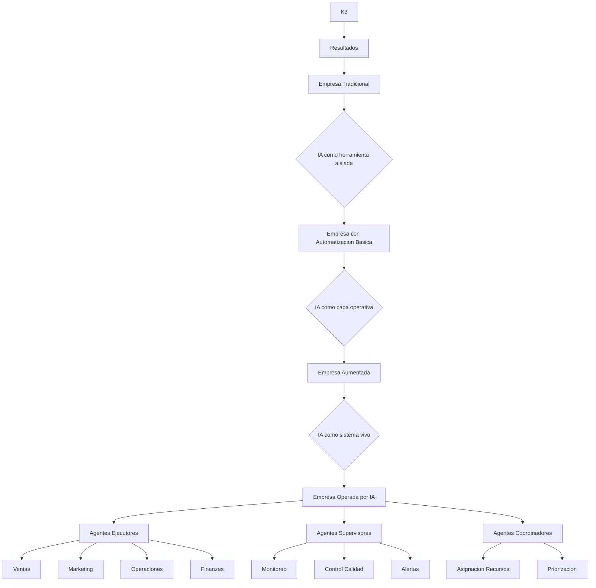
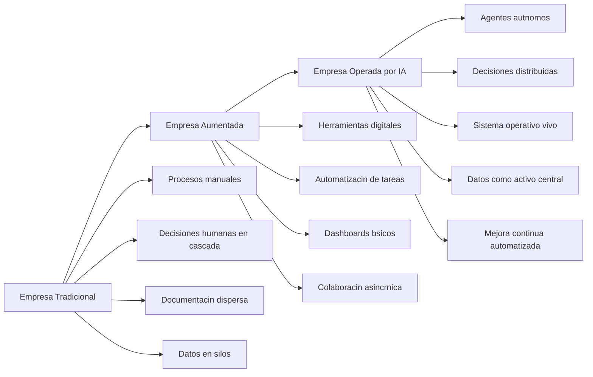
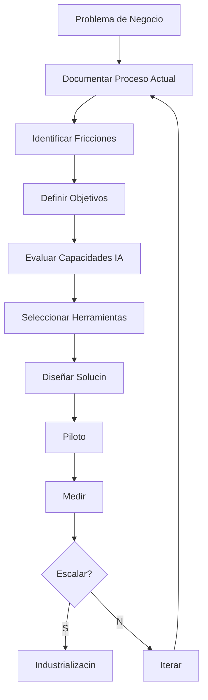
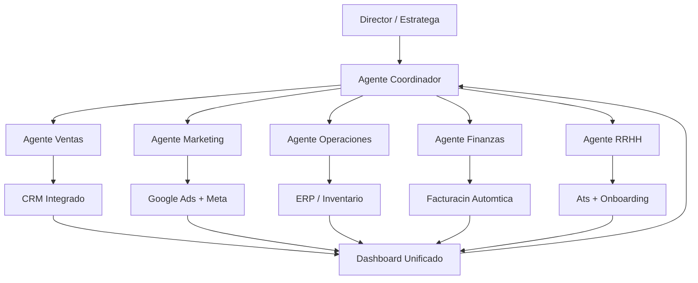
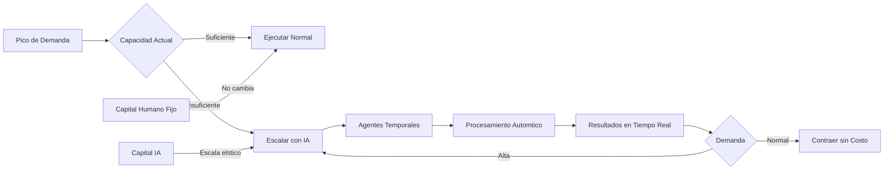
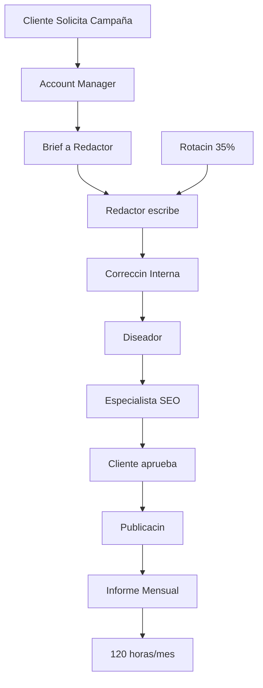
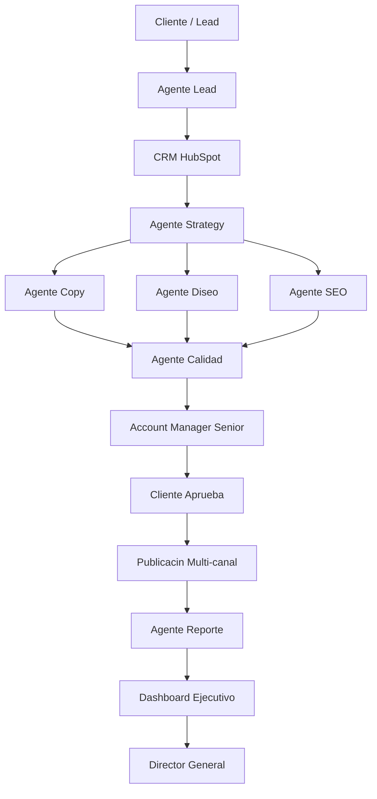

# MASTERCLASS: Estratega de Eficiencia Operativa con IA — Mentalidad y Estrategia

## INTRODUCCIÓN: QUÉ ESTÁ CAMBIANDO CON LA IA

La inteligencia artificial ha dejado de ser una promesa futurista para convertirse en una herramienta operativa concreta. En los últimos 24 meses, la adopción empresarial de IA ha pasado del 12% al 65% en medianas empresas del hemisferio occidental. No se trata de una moda: se trata de un cambio en los factores de producción tradicionales —tierra, trabajo, capital y tecnología— donde el factor "conocimiento" puede ejecutarse sin intervención humana directa.

Para un director general, esta transición no es opcional. La pregunta no es si adoptar IA, sino cómo estructurar la empresa para que la IA genere rentabilidad, escala y sostenibilidad antes que los competidores.

### Tres fuerzas que redefinen la ventaja competitiva

| Fuerza | Impacto empresarial | Implicación estratégica |
|--------|---------------------|------------------------|
| **Democratización del talento** | Las tareas que antes requerían 10 analistas ahora las ejecuta un agente autónomo en minutos | El costo marginal del conocimiento tiende a cero |
| **Velocidad de ejecución** | Los procesos que tomaban semanas ahora se completan en horas | La primera empresa en automatizar captura el mercado |
| **Personalización sin fricción** | Cada cliente puede recibir un tratamiento a escala sin costo adicional | El differentiation se traslada a la experiencia, no al precio |
| **Reducción de error humano** | Los procesos repetitivos dejan de tener fallos por fatiga, distracción o sesgo | La calidad se convierte en ventaja competitiva |

---

## MAPA DEL SISTEMA DE EFICIENCIA



---

## POR QUÉ LAS EMPRESAS TRADICIONALES PERDERÁN COMPETITIVIDAD

La mayoría de las empresas actuales operan sobre un modelo industrial heredado: jerarquías rígidas, procesos secuenciales, dependencia del conocimiento tácito individual y costo fijo creciente cada vez que la demanda aumenta. Este modelo tiene tres fatales vulnerabilidades en la era de la IA:

1. **Rigidez estructural:** Los organigramas no se adaptan en horas. Un pico de demanda requiere semanas de contratación o meses de reestructuración.
2. **Dependencia humana crítica:** Cuando un empleado clave abandona la empresa, se pierden procesos enteros. No hay un sistema documentado que permita replicar su rendimiento.
3. **Costo fijo inflado:** La mayoría de los costos "variables" en realidad son fijos en corto plazo. Cada nuevo cliente requiere atención personalizada, cada nueva transacción requiere revisión manual, cada nuevo mercado requiere investigación humana.

La evidencia empírica es contundente: según datos de McKinsey, las empresas que han implementado IA en escala reportan un aumento del 3-15% en márgenes EBITDA y una reducción del 20-40% en costos operativos en procesos de back office. Las empresas que no lo hacen enfrentan una desventaja creciente en costo unitario, velocidad de entrega y capacidad de personalización.

> **Insight ejecutivo** — La IA no es un gasto operativo. Es una inversión en infraestructura intangible que reduce el costo marginal de cada transacción adicional hacia cero. La pregunta correcta para el CFO no es "¿cuánto cuesta la IA?", sino "¿cuánto me cuesta NO tener IA?".

---

## LA NUEVA VENTAJA COMPETITIVA

En el modelo tradicional, la ventaja competitiva provenía de tres fuentes:

- **Escasez de recursos:** Controlar insumos, canales o capital.
- **Información asimétrica:** Saber algo que el competidor no sabe.
- **Eficiencia operativa:** Hacer lo mismo más barato.

En el modelo aumentado por IA, estas fuentes pierden relevancia relativa. La información es pública, la eficiencia se democratiza y los recursos pueden accederse globalmente. La nueva ventaja competitiva tiene cuatro pilares:

| Pilar | Descripción | Ejemplo práctico |
|-------|-------------|------------------|
| **Agilidad de adaptación** | La empresa ajusta ofertas, precios y procesos en horas, no en trimestres | Un eCommerce que ajusta precios y campañas cada 2 horas usando agentes autónomos |
| **Capacidad predictiva** | Anticipar demandas, problemas y oportunidades antes de que sucedan | Un agente de mantenimiento predictivo en una planta industrial |
| **Automatización cognitiva** | Procesos que requieren juicio humano se ejecutan automáticamente | Un agente legal que revisa contratos en minutos con precisión de abogado senior |
| **Escalabilidad elástica** | La empresa atiende 10 o 100 veces más clientes sin duplicar personal | Una agencia de marketing que sirve 50 clientes con 5 empleados usando agentes de contenido |

El competidor tradicional puede copiar tu tecnología. No puede copiar tu sistema operativo si está diseñado alrededor de agentes autónomos, datos integrados y procesos continuamente optimizados por IA. Esa es la verdadera barrera.

---

## EMPRESAS OPERADAS POR IA: EL NUEVO PARADIGMA

Una empresa operada por IA no es una empresa donde alguien usa ChatGPT de vez en cuando. Es una organización donde la capa de inteligencia artificial estructura, ejecuta, monitorea y mejora los procesos centrales del negocio de forma autónoma o semiautónoma.

### Características definitorias



| Nivel | Característica | Ejemplo |
|-------|----------------|---------|
| **Tradicional** | Procesos manuales, decisiones por personas, conocimiento tácito | Un abogado que redacta cada cláusula personalmente |
| **Aumentada** | Herramientas digitales, automatización de tareas repetitivas | Un abogado que usa Word y un buscador web |
| **Operada por IA** | Agentes autónomos ejecutando procesos completos, sistema operativo vivo | Un agente legal que redacta, revisa, compara precedentes y alerta riesgos, mientras el abogado supervisa excepciones |
| **IA Nativa** | La empresa nace digital desde el día uno sin procesos legacy | Una startup legaltech donde cada caso es procesado por agentes desde la captura del lead |

La clave no es el nivel máximo de sofisticación técnica, sino la **consistencia operativa**: una empresa operada por IA aplica el mismo estándar, la misma rapidez y la misma capacidad de mejora en cada proceso, en cada cliente, en cada transacción.

> **Principio fundacional** — Si un proceso no puede describirse, no puede automatizarse. Si no puede automatizarse, no puede escalar sin costo lineal. Por tanto, documentar procesos es el primer paso hacia una empresa operada por IA.

---

## EL DIRECTOR COMO ESTRATEGA Y NO COMO OPERADOR

En las empresas tradicionales, los directores pasan el 60-80% de su tiempo resolviendo problemas operativos: revisando reportes, aprobando gastos, resolviendo conflictos entre departamentos, gestionando excepciones. Este modelo consume el activo más valioso de la empresa: la capacidad de pensamiento estratégico del leadership.

La transformación con IA implica un cambio de rol:

| Rol tradicional | Rol con IA |
|-----------------|-----------|
| Resolver excepciones | Diseñar sistemas que prevengan excepciones |
| Aprobar transacciones | Establecer reglas y parámetros de riesgo |
| Reportar hacia arriba | Dashboards autónomos y alertas proactivas |
| Formar equipos | Diseñar agentes y arquitectura operativa |
| Resolver crisis | Anticipar crisis mediante señales tempranas |
| Controlar calidad | Monitorear el monitoreo del sistema |

Un director que adopta esta mentalidad no opera la empresa. La diseña.

### Checklist: Evaluación del rol directivo

| Pregunta | Indicador de madurez |
|----------|----------------------|
| Pasas más de 3 horas/semana en tareas repetitivas | Baja madurez |
| Tu equipo puede generar un reporte automático en menos de 5 minutos | Madurez media |
| Tienes un sistema que te alerta de problemas antes de que los veas | Alta madurez |
| Puedes cambiar una regla de negocio y verla aplicada en toda la empresa en < 48 horas | Madurez avanzada |
| Tu mejor empleado es indispensable porque posee conocimiento no documentado | Baja madurez |
| Tu mejor empleado es indispensable porque diseña y mejora los sistemas | Alta madurez |

---

# MÓDULO 1: MENTALIDAD DEL ESTRATEGA DE IA

## QUÉ HACE UN ESTRATEGA DE EFICIENCIA OPERATIVA

El Estratega de Eficiencia Operativa con IA no es un experto en programación ni un científico de datos. Es el arquitecto de la transformación empresaria, el puente entre la visión de negocio y la ejecución técnica. Sus responsabilidades son:

1. **Diagnosticar** dónde la empresa tiene fricción, desperdicio y dependencia humana innecesaria.
2. **Diseñar** la arquitectura de agentes, automatizaciones e integraciones que resuelven esos problemas.
3. **Priorizar** las iniciativas según impacto y viabilidad, generando quick wins mientras construye capacidades a largo plazo.
4. **Medir** el retorno de la inversión, no en teoría, sino en tiempo, costo y margen real.
5. **Escalar** lo que funciona, iterar lo que no, y construir la cultura organizacional que sostenga la mejora continua.

| Habilidad | Nivel requerido | Por qué importa |
|-----------|-----------------|-----------------|
| Pensamiento sistémico | Avanzado | Entender cómo interactúan procesos, personas, datos y tecnología |
| Gestión de cambio | Alto | La resistencia no es técnica; es cultural |
| Arquitectura de procesos | Medio | Saber documentar, modelar y rediseñar procesos antes de automatizarlos |
| Conocimiento de IA | Medio | Entender capacidades y limitaciones sin ser un ingeniero |
| Análisis financiero | Alto | Cada iniciativa debe justificarse con métricas de margen y cash flow |
| Liderazgo | Alto | Los directivos venderán la visión; los equipos la ejecutarán |

---

## DIFERENCIA ENTRE AUTOMATIZAR Y TRANSFORMAR

Esta distinción es la diferencia entre un proyecto exitoso a corto plazo y una revolución empresarial sostenible.

### Automatización: hacer más rápido lo que ya haces

La automatización tradicional toma un proceso existente y lo ejecuta más rápido, sin errores y sin intervención humana. Ejemplo:

- **Antes:** Un asistente recibe 100 correos, clasifica cada uno manualmente, responde en 30 minutos cada uno, con un 5% de error de clasificación.
- **Después:** Un filtro de reglas clasifica los 100 correos en 2 segundos, un asistente humano revisa las excepciones en 10 minutos, el error cae al 0,2%.

El resultado es productivo: la empresa hace lo mismo con menos costo. Pero el proceso es el mismo.

| Métrica | Antes | Después | Cambio |
|---------|-------|---------|--------|
| Tiempo por correo | 30 min | 0,2 min | 99,3% más rápido |
| Costo por correo | $3,00 | $0,15 | 95% más barato |
| Error de clasificación | 5% | 0,2% | -96% |
| Capacidad del sistema | 160/hora | 3.000/hora | +1775% |

**Resultado:** La empresa rivaliza en eficiencia. No lidera.

### Transformación: cambiar lo que se hace y cómo se hace

La transformación con IA cambia la naturaleza misma del trabajo. Ejemplo:

- **Antes:** Un director comercial revisa 200 leads por semana, los clasifica, decide a cuáles llamar, redacta correos de seguimiento y actualiza el CRM. Tasa de conversión: 3%.
- **Después:** Un agente de ventas autónomo recibe todos los leads, investiga cada empresa en tiempo real, clasifica por intención de compra, envía correos hiperpersonalizados, agenda llamadas solo con leads calificados y actualiza el CRM automáticamente. Tasa de conversión: 12%.

El proceso no es más rápido. Es diferente.

| Métrica | Antes | Después | Cambio |
|---------|-------|---------|--------|
| Leads procesados por semana | 200 | 1.000 | +400% |
| Llamadas por semana | 20 | 60 | +200% |
| Tasa de conversión | 3% | 12% | +300% |
| Revenue generado | $45.000 | $270.000 | +500% |
| Costo variable por lead | $25 | $2 | -92% |

**Resultado:** La empresa redefinió la categoría. Los competidores no pueden seguir el ritmo porque copian herramientas, no la arquitectura de agentes integrados.

> **Lección estratégica** — Automatizar es táctica indispensable. Transformar es estrategia. Todo proyecto de IA debe partir de la transformación. La automatización es un medio, no un fin.

---

## CÓMO PENSAR PROCESOS ANTES QUE HERRAMIENTAS

El error más recurrente en proyectos de IA es comprar herramientas antes de entender los problemas. La secuencia correcta es inversa y rigurosa:

### Fase 1: Mapa sin prejuicios tecnológicos

Antes de evaluar software, plataformas o modelos, documenta el proceso actual con la mayor fidelidad posible. Usa herramientas de mapeo tradicionales: SIPOC, flujos de valor (Value Stream Mapping), mapas de proceso BPMN o diagramas de flujo. El objetivo no es automatizar, sino entender.

En esta fase, documenta:
- **Entradas:** datos, documentos, señales, eventos externos
- **Pasos:** cada acción humana o sistémica del proceso
- **Decisiones:** puntos donde el curso del proceso cambia
- **Salidas:** resultados tangibles o intangibles
- **Actores:** quién hace qué, con qué frecuencia, en cuánto tiempo
- **Dolor points:** dónde se generan errores, retrasos, esperas y costos ocultos



### Fase 2: Medir la fricción

| Tipo de fricción | Cómo medirlo | Umbral crítico |
|------------------|------------|----------------|
| **Tiempo de espera** | Tiempo entre pasos donde nadie hace nada | > 10 minutos |
| **Tasa de error** | Errores por cada 100 ejecuciones | > 3% |
| **Retrabajo** | Porcentaje de salidas que deben corregirse | > 15% |
| **Dependencia humana** | Cantidad de personas necesarias para completar el proceso | > 2 personas |
| **Costo por transacción** | Costo total / número de transacciones | - |
| **Latencia de respuesta** | Tiempo desde que el evento sucede hasta que se resuelve | > 4 horas |
| **Duplicidad** | Cantidad de veces que la misma información se ingresa en sistemas distintos | > 1 |

### Fase 3: Priorizar por impacto y viabilidad

No todos los procesos son igualmente automatizables ni igualmente valiosos. Usa una matriz simple:

| | Alto impacto | Bajo impacto |
|--|--------------|--------------|
| **Alta viabilidad** | Prioridad 1: Quick wins | Prioridad 3: Oportunista |
| **Baja viabilidad** | Prioridad 2: Proyecto estratégico | Prioridad 4: Posponer |

- **Alto impacto, alta viabilidad:** Automatizar ahora. Estos son los quick wins que generan credibilidad para el resto del programa.
- **Alto impacto, baja viabilidad:** Diseñar como proyecto estratégico. Requieren arquitectura, presupuesto y tiempo. No los ignores: estos son los que cambian la empresa.

---

## LOS NUEVOS MODELOS OPERATIVOS

La introducción de agentes autónomos redefine las jerarquías y flujos de trabajo tradicionales. Nuevos modelos operativos exitosos comparten tres características: flexibilidad, autonomía limitada y gobernanza liviana.

### Modelo 1: Orquestación por agentes



El director no opera ningún sistema. Establece objetivos, parámetros de riesgo y límites presupuestarios. Los agentes ejecutan, reportan y aprenden.

### Modelo 2: Humanos en el loop para excepciones

No es realista ni deseable que los agentes operen sin supervisión humana en áreas de alta sensibilidad. El modelo híbrido define claramente qué decisiones son automáticas y cuáles requieren validación humana.

| Nivel de autonomía | Ejemplo | Supervisión humana |
|-------------------|---------|--------------------|
| **0 — Solo humano** | Contratación, auditoría legal | 100% |
| **1 — Asistido** | Generación de contratos, análisis financiero | Validación final |
| **2 — Recomendación** | Estrategia de contenido, pricing dinámico | Aprobación por desviación |
| **3 — Autónomo con monitoreo** | Campañas de email, actualización de inventario | Alertas por excepción |
| **4 — Autónomo** | Facturación recurrente, atención a FAQ | Sin intervención |
| **5 — Autónomo con mejora propia** | Optimización de campañas, ajuste de parámetros | Revisión trimestral humana |

> **Regla** — Ningún agente debe pasar del nivel 2 al nivel 3 sin un kill-switch probado y un periodo de paper trading ejecutivo de al menos 30 días.

### Modelo 3: Capacidad instalada elástica



La capacidad instalada humana es fija en corto plazo. La capacidad instalada de IA es elástica por definición. Un agente autónomo puede procesar 100 transacciones o 10.000 sin costo adicional de personal. Las empresas que diseñan su modelo operativo alrededor de esta elasticidad tienen una ventaja estructural insuperable.

---

## ERRORES COMUNES DE LOS DIRECTIVOS EN IA

| Error | Síntoma | Consecuencia | Antídoto |
|-------|----------|--------------|----------|
| **1. Proyecto piloto infinito** | Nunca se escala; siempre hay "una prueba más" | IA vista como costo sin retorno | Establecer criterios de éxito y fecha de evaluación |
| **2. Buscar la herramienta mágica** | Cambia de plataforma cada 6 meses | Fragmentación, datos en silos | Arquitectura primero, herramientas después |
| **3. Automatizar sin medir** | No hay KPIs claros del antes y después | No se puede demostrar ROI | Línea base obligatoria antes de cualquier automatización |
| **4. Delegar solo al proveedor** | El equipo interno aprende menos que el proveedor | Dependencia externa permanente | Equipo interno como arquitecto; proveedor como ejecutor |
| **5. Ignorar la resistencia cultural** | El equipo ve IA como amenaza | Sabotaje pasivo, errores de datos | Incluir a los empleados en el diseño, no solo en la ejecución |
| **6. Subestimar gobernanza** | Los agentes toman decisiones sin límites | Riesgo reputacional y legal | Definir política de IA antes de desplegar agentes |
| **7. Olvidar la calidad de datos** | Los agentes aprenden de suciedad | Resultados impredecibles | Pipeline de datos limpio como prerequisito |
| **8. Falta de patrocinio ejecutivo** | El proyecto pierde prioridad | Detención tras desvíos iniciales | Director general como sponsor activo |

---

## CASO PRÁCTICO: TRANSFORMACIÓN DE UNA AGENCIA DE MARKETING DIGITAL

### Contexto

**Empresa:** Agencia Boutique Digital S.A.  
**Ubicación:** Buenos Aires, Argentina  
**Facturación anual:** USD 1,8 millones  
**Empleados antes del proyecto:** 28 personas  
**Clientes:** 18 pymes regionales  
**Margen EBITDA:** 12%  
**Problema principal:** Costos operativos crecientes, rotación del 35% anual en puestos junior, incapacidad de aceptar nuevos clientes sin contratar más personal.

### Situación inicial

La agencia operaba así:
- Cada cliente tenía un equipo asignado: 1 account manager, 1 redactor, 1 diseñador, 1 especialista SEO.
- La rotación de redactores y diseñadores generaba pérdida de conocimiento y retrabajo del 30% en piezas de contenido.
- El proceso de aprobación de contenidos tomaba un promedio de 4 días entre escritura, corrección, diseño, aprobación del cliente y publicación.
- La generación de informes mensuales consumía 120 horas hombre/mes, con alta variabilidad en su calidad.
- El margen del negocio se mantuvo estable pero no creció en 4 años, a pesar de que la demanda aumentó un 25%.



### Solución implementada

El director general contrató un Estratega de Eficiencia Operativa y ejecutaron un plan en tres fases:

**Fase 1: Diagnóstico y documentación (30 días)**

El equipo documentó 47 procesos usando flujos de valor. Identificó que el 68% del tiempo se invertía en tareas repetitivas de generación, corrección y reporte de contenido, no en estrategia creativa.

**Fase 2: Arquitectura de agentes (60 días)**

Se implementaron los siguientes agentes autónomos:

| Agente | Función | Herramienta base | Frecuencia |
|--------|---------|-------------------|-----------|
| **Agente Lead** | Captura, clasifica y nutre leads desde LinkedIn y formularios web | n8n + OpenAI | Continua |
| **Agente Copy** | Genera borradores de contenido alineados a marca | OpenAI + Custom GPT | Bajo demanda |
| **Agente SEO** | Investiga keywords, genera clusters y optimiza meta etiquetas | Perplexity + LangChain | Semanal |
| **Agente Diseño** | Genera variaciones de diseño basados en guías de marca | Midjourney + Stable Diffusion | Por pieza |
| **Agente Reporte** | Recopila métricas de todas las plataformas y genera informes ejecutivos | Make + Google Sheets | Mensual |
| **Agente Calidad** | Revisa gramática, tono, plagio y cumplimiento normativo | Custom LLM | Automática/continua |

**Fase 3: Cambio de modelo operativo (90 días)**

Se rediseñó la estructura:
- De 18 equipos cliente a 5 agentes sectoriales supervisados por 2 account managers senior.
- De 28 a 16 empleados, con especialización en estrategia creativa y supervisión de agentes.
- Introducción de SLA interno de 24 horas para cualquier pieza generada por agente.

### Resultados a 12 meses

| Métrica | Antes | Después | Cambio |
|---------|-------|---------|--------|
| Ingresos anuales | USD 1,8 M | USD 2,4 M | +33% |
| Empleados | 28 | 16 | -43% |
| Margen EBITDA | 12% | 29% | +142% |
| Tiempo de entrega de contenido | 4 días | 4 horas | -95% |
| Clientes atendidos | 18 | 34 | +89% |
| Satisfacción del cliente (NPS) | 42 | 71 | +69% |
| Rotación de personal | 35% | 8% | -77% |
| Costo por campaña | USD 4.500 | USD 2.100 | -53% |
| Informes generados | 18/mes, 120 horas | 45/mes, 8 horas | -93% |

### Arquitectura final



### Lecciones clave

1. **Se empieza por los procesos, no por las herramientas.** La agencia evaluó 7 plataformas de IA antes de decidirse por una arquitectura basada en n8n para orquestación y modelos OpenAI para generación. Conocían el problema antes de buscar la solución.
2. **Los quick wins generan credibilidad política.** En 45 días, ya tenían un agente de reporte funcionando que eliminó 100 horas mensuales de trabajo tedioso. Eso facilitó el presupuesto para el resto.
3. **El equipo humano cambia de rol, no desaparece.** Los redactores y diseñeros se convirtieron en estrategas de marca y supervisores de calidad de agentes. La rotación cayó porque el trabajo es más creativo y menos repetitivo.
4. **La arquitectura puede replicarse.** Este diseño se implementó en otra agencia hermana en Uruguay con resultados comparables.

---

## EJERCICIO 1.1: DIAGNÓSTICO DE TU EMPRESA

### Instrucciones
Completa este ejercicio antes de diseñar cualquier estrategia de IA. Las respuestas deben ser específicas, numéricas y verificables. No digas "mucho tiempo"; di "18 horas por semana".

| Proceso | Horas/semana invertidas | Costo estimado (salario x horas) | Tasa de error o retrabajo | Sensibilidad del cliente a la velocidad |
|---------|------------------------|--------------------------------|--------------------------|----------------------------------------|
| Ej.: Respuesta de emails | 25 h | USD 1.250 | 8% emails mal clasificados | Media |
| | | | | |
| | | | | |
| | | | | |
| | | | | |

**Análisis:**
- Identifica el proceso con mayor costo de oportunidad: ___________
- Identifica el proceso más susceptible a error humano: ___________
- Identifica el proceso que tus clientes perciben más lento: ___________

**Punto de partida recomendado:** El proceso que aparece primero en dos de las tres categorías anteriores.

### Criterios de éxito del ejercicio
- [ ] Documentaste al menos 5 procesos
- [ ] Cada proceso tiene al menos una métrica cuantificable
- [ ] Identificaste un proceso candidato a quick win (< 30 días, < USD 5.000 inversión)
- [ ] El candidato tiene al menos 80% de viabilidad técnica

---

## EJERCICIO 1.2: MATRIZ DE MADUREZ IA

### Instrucciones
Califica tu empresa de 1 a 5 en cada dimensión. 1 = ausente, 3 = en desarrollo, 5 = optimizado.

| Dimensión | 1 | 2 | 3 | 4 | 5 |
|-----------|---|---|---|---|---|
| Documentación de procesos | | | | | |
| Completitud de datos | | | | | |
| Madurez digital | | | | | |
| Cultura de experimentación | | | | | |
| Patrocinio ejecutivo | | | | | |
| Capacidad técnica interna | | | | | |
| Gestión del cambio | | | | | |

**Interpretación:**
- **Total < 14:** Etapa inicial. El trabajo fundamental es documentar y digitalizar.
- **Total 14-28:** Etapa de adopción. Puede automatizar procesos repetitivos pero no aún agentes autónomos complejos.
- **Total 28-42:** Etapa de transformación. Arquitectura de agentes es viable.
- **Total > 42:** Etapa de optimización. Puede experimentar con metalearning y agentes que mejoran a otros agentes.

**Próximo paso:** Anota las 3 dimensiones con menor puntaje. Esas son tus barreras más importantes.

---

## PROMPT LISTO PARA USAR

### Prompt para Estratega de Eficiencia Operativa ( Diagnóstico inicial)

```text
Actúa como Estratega de Eficiencia Operativa con IA especializado en pymes de servicios y B2B.

Contexto de mi empresa:
- Sector: [definir]
- Tamaño: [empleados]
- Facturación anual: [USD]
- Principales procesos: [listar]
- Principales dolores: [listar]

Objetivo: Identificar las 5 mejores oportunidades para aplicar IA y automatización, priorizadas por impacto en ingresos o ahorro de costos y viabilidad técnica en < 6 meses.

Entrega para cada oportunidad:
1. Nombre del proceso
2. Estado actual (horas/semana, costo, errores)
3. Solución propuesta (qué automatizar, qué herramienta, qué agente)
4. Impacto estimado (ahorro en horas, reducción de costo, mejora en ingresos)
5. Viabilidad técnica (1-5)
6. Complejidad organizacional (baja/media/alta)
7. Quick win o estratégico
8. Primer paso concreto para empezar en 30 días
```

---

## ERRORES COMUNES EN LA FASE DE MENTALIDAD ESTRATÉGICA

| Error | Por qué sucede | Consecuencia | Cómo evitarlo |
|--------|----------------|--------------|---------------|
| **Copiar la competencia** | Ver que otra empresa usa IA y querer replicar | Inversión en tecnología no alineada con la estrategia propia | Empezar por el diagnóstico interno, no por la oferta del proveedor |
| **Subestimar la resistencia** | Creer que "la tecnología habla por sí sola" | Sabotaje pasivo, datos sucios, proyectos que fracasan culturalmente | Incluir a los empleados desde el día 1, con training y participación |
| **Buscar ROI rápido en proyectos estratégicos** | Querer mostrar resultados en semanas | Proyectos cancelados antes de madurar | Separar quick wins de proyectos estratégicos con métricas distintas |
| **Delegar la IA al área de TI** | Creer que es un problema técnico | Falta de alineación con negocio | La IA es un tema de director general, no de gerencia de sistemas |
| **No establecer gobernanza** | Lanzar agentes sin límites éticos y legales | Riesgo reputacional, multas, conflictos laborales | Política de IA escrita y aprobada antes de cualquier despliegue |
| **Medir solo costos, no valor** | El CFO solo mira el ticket de compra | Proyectos cancelados por no ver el ROI completo | Establecer métricas de valor (tiempo, ingresos, satisfacción) además de costo |
| **Sobre-ingeniería desde el día 1** | Creer que la primera versión debe ser perfecta | Parálisis por análisis, demoras infinitas | Ciclos cortos: 2 semanas de piloto, 4 semanas de iteración, medir, escalar |
| **Ignorar la arquitectura de datos** | Empezar por modelos en lugar de datos limpios | Agentes que aprenden basura y producen decisiones peores | Invertir primero en el 80% de limpieza de datos que produce el 20% del valor |

---

## CHECKLIST: PREPARACIÓN ESTRATÉGICA PARA IA

### Nivel Empresa

| Check | Estado |
|-------|--------|
| La dirección general ha definido un objetivo de negocio para la IA | ☐ |
| Hay un sponsor ejecutivo con presupuesto asignado | ☐ |
| Se han documentado al menos 3 procesos críticos | ☐ |
| Existe una línea base de KPIs para esos procesos | ☐ |
| El equipo directivo ha recibido formación básica en IA | ☐ |
| Hay un plan de comunicación interna sobre el programa de IA | ☐ |
| Se ha evaluado la madurez digital de la empresa | ☐ |
| Existe una política básica de protección de datos y uso de IA | ☐ |

### Nivel Proceso

| Check | Estado |
|-------|--------|
| El proceso está documentado con entradas, pasos, decisiones y salidas | ☐ |
| Se han medido tiempo, costo y error actuales | ☐ |
| Existe un owner del proceso (persona responsable) | ☐ |
| Las herramientas actuales están inventariadas | ☐ |
| Se han identificado al menos 3 quick wins potenciales | ☐ |
| El proceso tiene un volumen suficiente para justificar automatización | ☐ |

---

## RESUMEN EJECUTIVO

Esta primera parte de la master class establece los cimientos mentales y estratégicos del Estratega de Eficiencia Operativa con IA. Los conceptos fundamentales son:

1. **La IA redefine los factores de producción.** El costo marginal del conocimiento tiende a cero, permitiendo escalar sin costo lineal.
2. **La nueva ventaja competitiva no es la tecnología, es el sistema operativo.** Una empresa operada por IA puede adaptarse más rápido, ejecutar más inteligentemente y escalar elásticamente.
3. **Automatizar ≠ Transformar.** La automatización hace más eficiente un proceso existente. La transformación con IA cambia la naturaleza del proceso y crea ventajas insuperables.
4. **Procesos antes que herramientas.** Documentar, medir y priorizar son pasos previos obligatorios. Comprar software antes de entender el problema garantiza fracaso.
5. **El director cambia de rol.** De operador a estratega. No ejecuta; diseña arquitecturas, establece políticas y monitorea resultados.

**Próximo paso:** Aplicación del diagnóstico inicial y análisis de procesos críticos en `ia-mapa-arquitectura-procesos.md` (Módulos 2 y 3).

---

## PROMPTS ADICIONALES PARA ESTA FASE

### Prompt de autoevaluación cultural

```text
Actúa como consultor de transformación digital. Evalúa la cultura de mi empresa para la adopción de IA:

Contexto:
- Tipo de empresa: [servicios / industrial / retail / tecnología]
- Tamaño: [empleados]
- Antigüedad promedio: [años]
- Nivel de digitalización actual: [bajo / medio / alto]
- Incidentes recientes de resistencia al cambio: [sí/no, breve descripción]

Evalúa 5 dimensiones culturales:
1. Aversión al riesgo
2. Mentalidad de crecimiento
3. Transparencia de información
4. Experimentación
5. Liderazgo distribuido

Por cada dimensión entrega:
- Puntuación 1-5 con justificación
- Riesgo específico para proyectos de IA
- Acción concreta de mitigación

Final: Un diagnóstico ejecutivo de 3 párrafos y un plan de gestión del cambio de 90 días con 5 hitos medibles.
```

### Prompt de definición de quick wins

```text
Actúa como Estratega de Eficiencia Operativa con IA.

Mi empresa tiene esta situación:
- Procesos documentados: [sí/no]
- KPIs actuales: [listar]
- Herramientas digitales instaladas: [listar]
- Presupuesto para IA en el próximo semestre: [USD]

Genera 3 quick wins para IA con estas características:
- Implementación en máximo 30 días
- Inversión menor a USD 5.000
- ROI positivo medible en menos de 60 días
- Baja resistencia cultural

Por cada quick win incluye:
1. Descripción del problema actual
2. Solución IA propuesta
3. Métricas de antes y después
4. Herramienta recomendada
5. Primer paso concreto para esta semana
6. Responsable sugerido
```

### Prompt de presentación para director general

```text
Actúa como consultor senior presentando a un comité de dirección.

Situación: La empresa tiene la oportunidad de implementar un programa de IA para eficiencia operativa, pero el director general necesita convencer al board en 5 minutos.

Genera un pitch ejecutivo que incluya:
1. Problema cuantificado (3 datos duros: costo, tiempo, error)
2. Oportunidad (qué cambia con IA, en números)
3. Propuesta (qué hacemos, en qué tiempo, con qué inversión)
4. Riesgos y mitigaciones (máximo 3 riesgos)
5. Primer hito (qué entregamos en 30 días)
6. Llamada a la acción (qué decisión necesitamos hoy)

Tono: ejecutivo, sin jerga técnica, orientado a retorno de inversión.
```
