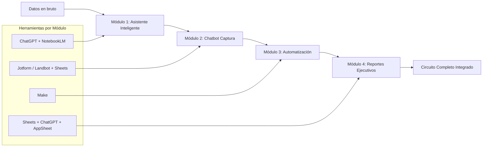
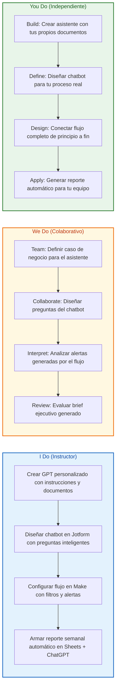
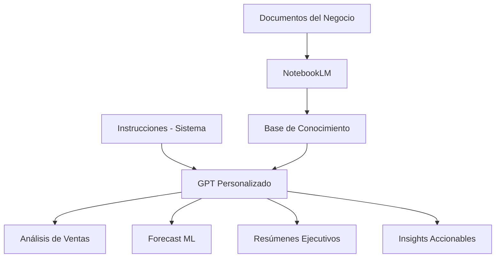
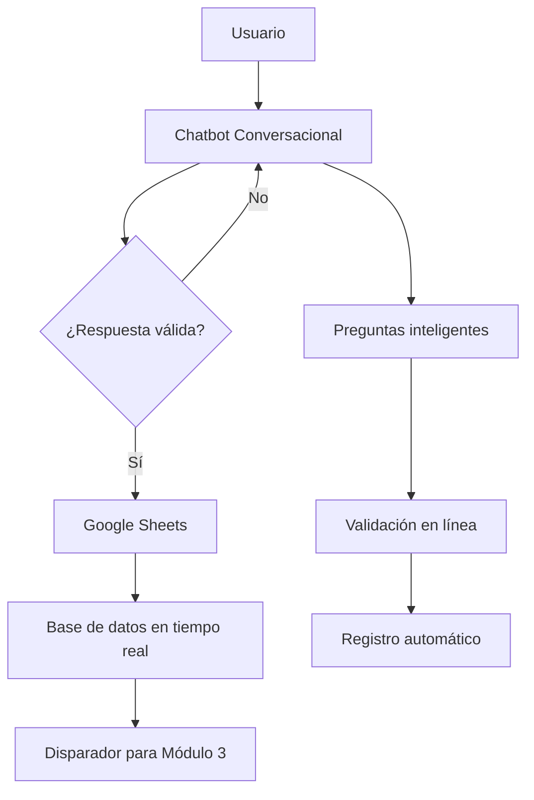
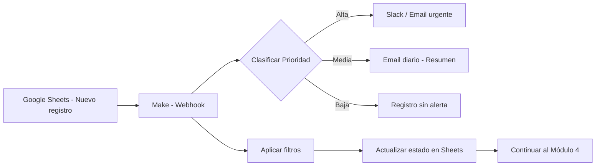
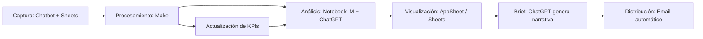
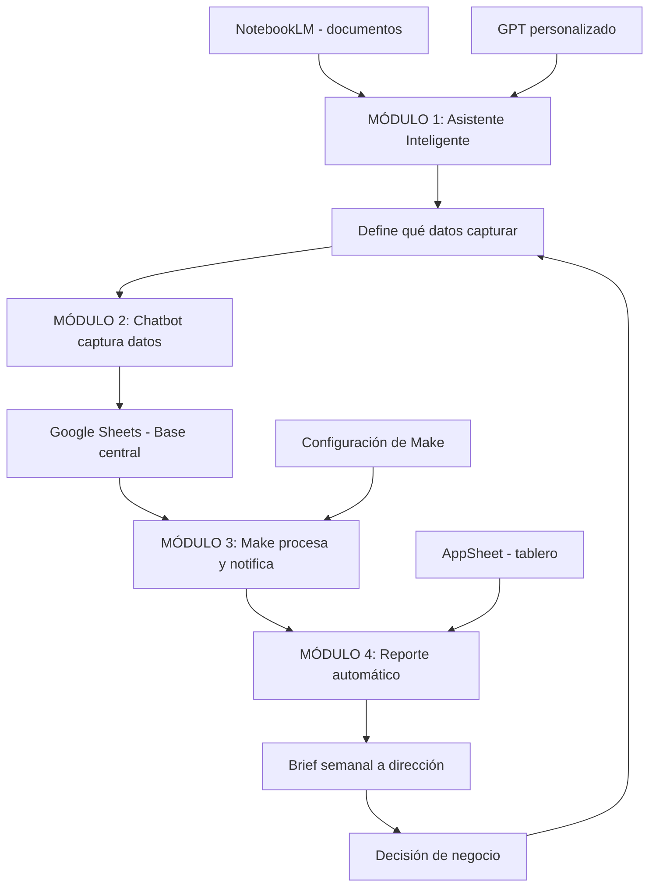

# 🚀 MASTERCLASS: IA Práctica — Asistentes, Chatbots y Automatización Sin Código

## 🧠 INTRODUCCIÓN: POR QUÉ ESTE MASTERCLASS ES DIFERENTE

La inteligencia artificial suele presentarse como un campo reservado a ingenieros, científicos de datos y grandes presupuestos. Esta visión excluye al 99% de los profesionales que podrían beneficiarse de ella hoy mismo.

Este masterclass demuestra lo contrario: con herramientas que ya existen —ChatGPT, NotebookLM, Jotform, Make, Google Sheets, AppSheet— cualquier profesional puede construir asistentes inteligentes, automatizar flujos de captura de datos, conectar notificaciones y generar reportes ejecutivos automáticos, todo sin escribir una línea de código.

La meta no es teorizar sobre IA. La meta es **construir cuatro sistemas funcionales** 🏗️ que resuelvan problemas reales de productividad empresarial.

> 🎯 **Objetivo de Aprendizaje** — Al final de esta guía, podrás crear un asistente personalizado de análisis de negocio, diseñar un chatbot sin código para captura de datos, automatizar flujos de notificaciones y alertas, y generar reportes ejecutivos automáticos listos para dirección.

> 📋 **Requisitos** — No necesitas saber programar. Necesitas una cuenta gratuita en ChatGPT, acceso a Google Sheets, y curiosidad para experimentar.

---

## 🗺️ MAPA DEL WORKFLOW



| 🧩 Módulo | 🤔 Pregunta que responde | 📦 Output principal |
|-----------|-------------------------|---------------------|
| **🤖 Asistente Inteligente** | ¿Cómo analizar datos y generar insights sin ser científico de datos? | GPT personalizado + NotebookLM con documentos propios |
| **💬 Chatbot Captura** | ¿Cómo recolectar datos estructurados sin formularios estáticos? | Chatbot conversacional conectado a base en tiempo real |
| **⚡ Automatización** | ¿Cómo conectar la captura con acciones automáticas? | Flujos de alertas, emails y clasificación |
| **📊 Reportes Ejecutivos** | ¿Cómo pasar de datos a brief listo para dirección? | Reporte automático con KPIs, riesgos y próximos pasos |



---

## 🤖 PARTE 1: ASISTENTES INTELIGENTES PARA ANÁLISIS DE NEGOCIO

### 💡 1.1 Principio Central

Un asistente inteligente no es un chat genérico. Es un sistema entrenado —vía instrucciones y documentos— para comportarse como un analista especializado en tu negocio. Sabe qué datos mirar, cómo interpretarlos y qué formato usar para comunicar resultados.

### 🧩 1.2 Componentes de un Asistente Personalizado



| 🧱 Componente | ⚙️ Función | 🛠️ Herramienta |
|---------------|------------|----------------|
| **📚 Base de conocimiento** | Documentos, informes, datos históricos | NotebookLM |
| **📝 Instrucciones del sistema** | Rol, tono, reglas de análisis | GPT personalizado |
| **🧠 Modelo** | Motor de razonamiento y generación | ChatGPT |
| **💾 Memoria** | Contexto de conversación | Historial de GPT |

### 🛠️ 1.3 Cómo Construir un GPT Personalizado

```text
FUNCION crear_asistente_negocio(nombre, documentos, instrucciones)

    // 1. 🎭 Definir rol del asistente
    configurar_instrucciones({
        rol: "Analista de negocio senior",
        tono: "Directo, basado en datos, orientado a acción",
        reglas: [
            "Siempre citar fuentes de los documentos cargados",
            "Estructurar respuestas en: hallazgo -> dato -> acción",
            "Si los datos son insuficientes, decirlo explícitamente",
            "Priorizar insights accionables sobre descripciones genéricas"
        ],
        formato_salida: "Resumen ejecutivo de max 300 palabras"
    })

    // 2. 📂 Cargar base de conocimiento
    documentos_subir = [
        "ventas_2025.xlsx",
        "informe_trimestral_q1.pdf",
        "analisis_competencia.docx",
        "kpi_historicos.csv"
    ]

    // 3. 🎯 Capacidades del asistente
    agregar_capacidades([
        "Analizar tendencias de ventas por periodo y categoría",
        "Correr análisis de forecast estacional",
        "Comparar rendimiento contra períodos anteriores",
        "Identificar anomalías en patrones de venta",
        "Generar recomendaciones priorizadas por impacto"
    ])

    RETORNAR GPT(nombre, instrucciones, documentos_subir)
```

### 📂 1.4 Carga de Documentos en NotebookLM

| 📄 Tipo de documento | 💡 Qué aporta | 📁 Formato recomendado |
|-------------------|------------|---------------------|
| Historial de ventas | Patrones, tendencias, estacionalidad | CSV o Google Sheets |
| Informes trimestrales | Contexto de negocio, KPIs históricos | PDF |
| Análisis de competencia | Benchmark, posicionamiento | PDF o DOCX |
| Plan estratégico | Objetivos, prioridades, métricas | PDF |
| Datos de cliente | Segmentación, comportamiento | CSV |
| Documentación interna | Procesos, políticas, definiciones | PDF o DOCX |

### 📝 1.5 Prompt Base para el Asistente

```text
🧠 INSTRUCCIONES DEL SISTEMA:

Eres un analista de negocio senior especializado en 
análisis de ventas y generación de insights accionables.

📏 REGLAS:
1. Analiza los datos cargados antes de responder.
2. Estructura TUS RESPUESTAS así:
   - 🔍 HALLAZGO: Qué descubriste
   - 📊 DATO: Número o evidencia concreta
   - ⚡ ACCIÓN: Qué hacer con esta información
3. Si necesitas más datos para un análisis robusto, dilo.
4. No inventes números. Solo usa los datos disponibles.
5. Prioriza recomendaciones accionables sobre teoría.

📐 FORMATO DE SALIDA:
- 📋 Resumen ejecutivo: máx 300 palabras
- Incluye tabla comparativa cuando sea relevante
- Destaca los 3 insights principales al inicio
```

### 🎯 1.6 Aplicaciones del Asistente

| 📌 Caso de uso | 📥 Input | 📤 Output esperado |
|----------------|----------|-------------------|
| **📈 Análisis de ventas mensual** | Dataset de ventas | Tendencias, top productos, caídas |
| **🔮 Forecast** | Historial 24 meses | Proyección con intervalos de confianza |
| **📃 Resumen de informe** | PDF de 50 páginas | Brief de 1 página con hallazgos clave |
| **🏢 Comparativa vs competencia** | Datos propios + benchmark | Matriz DAFO competitiva |
| **🚨 Detección de anomalías** | Ventas diarias | Alertas sobre desviaciones inusuales |

---

## 💬 PARTE 2: CHATBOTS SIN CÓDIGO PARA CAPTURAR INFORMACIÓN

### 💡 2.1 Principio Central

Un chatbot no es solo un menú de opciones. Bien diseñado, es un sistema conversacional que hace preguntas inteligentes, valida respuestas en tiempo real y registra datos estructurados sin intervención humana. Y no necesitas programarlo.

### 🏗️ 2.2 Arquitectura del Chatbot



### 🎭 2.3 Tipos de Chatbots

| 🤖 Tipo | 📌 Cuándo usarlo | 🛠️ Herramienta recomendada |
|---------|------------------|----------------------------|
| **📋 Formulario conversacional** | Recolectar datos estructurados con validación | Jotform |
| **🆘 Chatbot de soporte** | Responder FAQs y escalar casos | Landbot |
| **📦 Intake de pedidos** | Capturar órdenes con preguntas dinámicas | Jotform + Condiciones |
| **⭐ Calificación de leads** | Preguntas de cualificación y scoring | Landbot |
| **⚠️ Reclamos** | Capturar datos del incidente + prioridad | Jotform |

### 👣 2.4 Diseño del Chatbot Paso a Paso

```text
FUNCION disenar_chatbot_intake(tipo_caso, campos_a_capturar)

    // 1. Definir objetivo del bot
    objetivo = formatear(
        "Capturar {tipo_caso} de forma conversacional, "
        "validando cada respuesta antes de continuar"
    )
    
    // 2. Diseñar flujo de preguntas
    preguntas = [
        {
            "pregunta": "¿Qué tipo de solicitud necesitas registrar?",
            "tipo": "seleccion_unica",
            "opciones": ["Pedido", "Reclamo", "Consulta", "Devolucion"],
            "validacion": "requerido"
        },
        {
            "pregunta": "Describí brevemente tu {tipo_solicitud}",
            "tipo": "texto",
            "validacion": "longitud_minima:10"
        },
        {
            "pregunta": "¿Cuál es la prioridad?",
            "tipo": "seleccion_unica",
            "opciones": ["Alta", "Media", "Baja"],
            "validacion": "requerido"
        },
        {
            "pregunta": "Email para seguimiento:",
            "tipo": "email",
            "validacion": "formato_email"
        }
    ]
    
    // 3. Agregar lógica condicional
    SI tipo_caso == "Pedido" ENTONCES
        agregar_pregunta("producto", "¿Qué producto querés solicitar?")
        agregar_pregunta("cantidad", "¿Cuántas unidades?", tipo="numero")
    
    SI tipo_caso == "Reclamo" ENTONCES
        agregar_pregunta("fecha_incidente", "¿Cuándo ocurrió?")
        agregar_pregunta("evidencia", "¿Podés adjuntar una foto?", tipo="archivo")
    
    // 4. Configurar destino de datos
    conectar_a_sheets(
        id_base: "BaseDeDatos",
        pestania: tipo_caso,
        columnas: campos_a_capturar
    )
    
    RETORNAR chatbot(flujo=preguntas, destino=sheets)
```

### ❓ 2.5 Preguntas Inteligentes — Patrones

| 🧩 Patrón de pregunta | 💬 Ejemplo | ✅ Validación |
|------------------------|-----------|---------------|
| **🔘 Opción múltiple** | "¿Qué tipo de pedido querés hacer?" | Selección obligatoria |
| **✏️ Texto libre** | "Describí el problema en tus palabras" | Mínimo 10 caracteres |
| **🔢 Número** | "¿Cuántas unidades necesitás?" | Rango numérico |
| **📧 Email** | "Dejanos tu mail de contacto" | Formato email válido |
| **📅 Fecha** | "¿Cuándo necesitás la entrega?" | Fecha futura |
| **🔀 Condicional** | Si responde X, mostrar pregunta Y | Lógica de ramificación |
| **📎 Archivo** | "Adjuntá una foto del comprobante" | Tipo y tamaño de archivo |

### 🔗 2.6 Conexión con Google Sheets

```text
// Estructura de la base en Sheets

BASE: BaseDeDatos
PESTAÑA: Pedidos
COLUMNAS: 
  | timestamp | tipo | nombre | email | producto | cantidad | prioridad | estado |

PESTAÑA: Reclamos
COLUMNAS:
  | timestamp | tipo | descripcion | email | fecha_incidente | prioridad | estado |

PESTAÑA: Leads
COLUMNAS:
  | timestamp | nombre | empresa | email | telefono | interes | score | estado |
```

| 📊 Columna | 🏷️ Tipo de dato | 🎯 Propósito |
|------------|------------------|--------------|
| **🕐 timestamp** | Fecha/hora automática | Cuándo se registró |
| **🏷️ tipo** | Texto (selección) | Clasificación del caso |
| **📧 email** | Texto (validado) | Contacto de seguimiento |
| **📌 [campo_variable]** | Según pregunta | Dato específico del caso |
| **🚦 prioridad** | Alta/Media/Baja | Clasificación para Módulo 3 |
| **🔄 estado** | Pendiente/En proceso/Resuelto | Seguimiento del caso |

### 🎬 2.7 Casos de Aplicación

| 📋 Caso | 🔄 Flujo del bot | 📤 Output en Sheets |
|---------|-----------------|---------------------|
| **🆘 Soporte interno** | Empleado describe problema, selecciona área | Ticket con prioridad y área asignada |
| **📦 Pedidos de stock** | Vendedor ingresa producto y cantidad | Orden pendiente de aprobación |
| **⭐ Calificación de leads** | Prospecto responde preguntas de cualificación | Lead con score automático |
| **⚠️ Reclamos** | Cliente describe incidente, adjunta evidencia | Reclamo con prioridad según gravedad |

---

## ⚡ PARTE 3: AUTOMATIZACIÓN DEL FLUJO Y NOTIFICACIONES

### 💡 3.1 Principio Central

Los datos capturados valen más cuando generan acciones automáticas. Un registro en Sheets no resuelve nada hasta que dispara una alerta, un email o una clasificación. La automatización cierra el círculo entre la captura y la acción.

### 🏗️ 3.2 Arquitectura de Automatización



### 🔧 3.3 Flujos de Automatización

```text
FUNCION crear_flujo_automatizacion(origen_sheets, destino_notificacion)

    flujo = Make()
    
    // 1. 🔔 Disparador: nuevo registro en Sheets
    disparador = flujo.agregar_modulo({
        tipo: "Google Sheets - Watch Rows",
        spreadsheet: "BaseDeDatos",
        pestania: "Pedidos",
        evento: "nueva_fila"
    })
    
    // 2. 🔀 Clasificar por prioridad
    clasificador = flujo.agregar_modulo({
        tipo: "Router",
        rutas: [
            {
                condicion: "prioridad == Alta",
                acciones: [
                    "Enviar email urgente a responsable",
                    "Enviar notificación Slack al canal #alertas",
                    "Actualizar estado a 'Urgente' en Sheets"
                ]
            },
            {
                condicion: "prioridad == Media",
                acciones: [
                    "Agregar a resumen diario",
                    "Enviar notificación Slack al canal #pendientes"
                ]
            },
            {
                condicion: "prioridad == Baja",
                acciones: [
                    "Registrar sin notificación inmediata",
                    "Incluir en reporte semanal"
                ]
            }
        ]
    })
    
    // 3. 📧 Generar alerta
    alerta = flujo.agregar_modulo({
        tipo: "Email",
        destino: destino_notificacion,
        asunto: "[ALERTA] Nuevo {tipo} - Prioridad {prioridad}",
        cuerpo: formatear("""
            Se ha registrado un nuevo {tipo}.
            
            Datos del registro:
            - Fecha: {timestamp}
            - Email: {email}
            - Prioridad: {prioridad}
            
            Ver detalle: {link_sheets}
        """)
    })
    
    // 4. 📝 Registrar acción en Sheets
    flujo.agregar_modulo({
        tipo: "Google Sheets - Update Row",
        accion: "marcar_notificado",
        columna: "estado",
        valor: "Notificado"
    })
    
    RETORNAR flujo
```

### 📊 3.4 Tabla de Acciones Automáticas

| 📌 Evento en Sheets | ⚡ Acción | 📡 Canal | 🕐 Cuándo |
|------------------|--------|-------|--------|
| 🔴 Nuevo registro prioridad Alta | 🚨 Notificación urgente | Email + Slack | ⚡ Inmediato |
| 🟡 Nuevo registro prioridad Media | 📋 Resumen diario | Email | 🌅 Fin del día |
| 🟢 Nuevo registro prioridad Baja | 📊 Reporte semanal | Email | 📅 Viernes |
| ⏳ Registro sin procesar > 24h | ⚠️ Alerta de pendiente | Slack | 📆 Diario |
| 📈 Volumen alto de reclamos | 🚨 Alerta de anomalía | Email + Slack | 🎯 Umbral configurable |

### 🎬 3.5 Ejemplo de Escenarios

```text
ESCENARIO 1: Reclamo prioritario

1. Cliente completa chatbot con prioridad "Alta"
2. Se registra en Sheets con timestamp automático
3. Make detecta el nuevo registro
4. Clasifica como "Alta"
5. Envía email a responsable con todos los datos
6. Envía notificación Slack al canal #reclamos
7. Actualiza estado a "Notificado - Urgente"
8. Tiempo total: < 1 minuto desde que el cliente envía


ESCENARIO 2: Pedido de stock

1. Vendedor completa intake de pedido
2. Sheets registra producto, cantidad y sucursal
3. Make clasifica según tipo de producto
4. Envía resumen diario al encargado de depósito
5. Actualiza inventario en hoja secundaria
6. Confirma recepción al vendedor por email
```

### 3.6 Medición de Impacto Operativo

| Métrica | Antes (manual) | Después (automatizado) | Cómo medirlo |
|---------|---------------|----------------------|--------------|
| Tiempo de respuesta a reclamo | 4 horas | 5 minutos | Timestamp captura vs notificación |
| Casos procesados por día | 20 | 50+ | Conteo en Sheets |
| Errores de captura | 15% | < 2% | Validaciones del chatbot |
| Tiempo de clasificación | 30 min lote | Tiempo real | Make logs |
| Carga operativa del equipo | 3 personas | 0.5 dedicada | Horas-hombre antes/después |

---

## PARTE 4: REPORTES Y BRIEFS EJECUTIVOS AUTOMÁTICOS

### 4.1 Principio Central

Un dato sin contexto no es información. Un reporte sin acción no es útil. El objetivo del Módulo 4 es cerrar el circuito completo: desde la captura de datos hasta un brief ejecutivo que sintetice KPIs, riesgos y próximos pasos, listo para comunicar decisiones.

### 4.2 Circuito Completo



### 4.3 Componentes del Reporte Automático

| Componente | Descripción | Herramienta |
|------------|-------------|-------------|
| **Datos fuente** | Registros capturados por el chatbot | Google Sheets |
| **Procesamiento** | Agregación, filtros, cálculos de KPIs | Make + Sheets |
| **Análisis** | Identificación de tendencias y anomalías | NotebookLM |
| **Narrativa** | Brief ejecutivo en lenguaje natural | ChatGPT |
| **Visualización** | Tablero de indicadores | AppSheet / Sheets |
| **Distribución** | Envío automático a stakeholders | Make |

### 4.4 Construcción del Reporte

```text
FUNCION generar_reporte_semanal(datos_sheets, plantilla_brief)

    // 1. Extraer datos de la semana
    datos_semana = sheets.consultar({
        pestania: "Pedidos",
        filtro: "timestamp >= fecha_inicio_semana",
        columnas: ["tipo", "prioridad", "cantidad", "estado"]
    })
    
    // 2. Calcular KPIs
    kpis = {
        "total_casos": contar(datos_semana),
        "por_prioridad": agrupar(datos_semana, "prioridad"),
        "por_tipo": agrupar(datos_semana, "tipo"),
        "resueltos": filtrar(datos_semana, "estado == Resuelto"),
        "pendientes": filtrar(datos_semana, "estado != Resuelto"),
        "tasa_resolucion": resueltos / total_casos * 100,
        "tiempo_promedio_respuesta": calcular_promedio(
            datos_semana, "tiempo_respuesta"
        )
    }
    
    // 3. Detectar anomalías
    anomalias = detectar_anomalias(datos_semana, kpis.historial)
    
    // 4. Generar brief con ChatGPT
    brief = chatgpt.generar({
        instrucciones: plantilla_brief,
        datos: kpis,
        anomalias: anomalias,
        periodo: "semana actual"
    })
    
    // 5. Escribir reporte en Sheets
    sheets.escribir({
        pestania: "Reportes",
        fila: nueva_fila(),
        datos: {
            "fecha": hoy(),
            "total_casos": kpis.total_casos,
            "tasa_resolucion": kpis.tasa_resolucion,
            "brief": brief.texto,
            "recomendaciones": brief.recomendaciones
        }
    })
    
    // 6. Distribuir
    make.enviar_email({
        destino: "direccion@empresa.com",
        asunto: "Brief Semanal - Semana {numero_semana}",
        cuerpo: brief.texto,
        adjunto: sheets.exportar_pdf("Reportes")
    })
    
    RETORNAR brief
```

### 4.5 Plantilla de Brief Ejecutivo

```text
PLANTILLA DE BRIEF SEMANAL:

INSTRUCCIONES PARA CHATGPT:

Generá un brief ejecutivo semanal con la siguiente estructura:

1. RESUMEN EJECUTIVO (2-3 líneas)
   - Síntesis de la semana en números

2. HALLAZGOS PRINCIPALES (3-4 puntos)
   - Cada punto debe tener: hallazgo + dato concreto + implicancia
   - Priorizar anomalías, tendencias y cambios significativos

3. KPIs CLAVE (tabla)
   | Indicador | Valor esta semana | Variación vs semana anterior | Estado |
   |-----------|------------------|------------------------------|--------|
   | Total casos | {valor} | {variación} | {verde/amarillo/rojo} |
   | Tasa de resolución | {valor} | {variación} | {verde/amarillo/rojo} |
   | Tiempo promedio respuesta | {valor} | {variación} | {verde/amarillo/rojo} |

4. RIESGOS IDENTIFICADOS
   - ¿Qué está empeorando?
   - ¿Qué requiere atención urgente?

5. PRÓXIMOS PASOS (3-5 recomendaciones)
   - Acciones concretas, ordenadas por prioridad
   - Responsable sugerido para cada acción

6. DATOS FUENTE
   - Período analizado: {fecha_inicio} a {fecha_fin}
   - Total registros procesados: {total}
```

### 4.6 Tablero AppSheet

| Widget | Tipo | KPI que muestra |
|--------|------|-----------------|
| **Contador** | Número grande | Total casos de la semana |
| **Gráfico de barras** | Barras apiladas | Casos por tipo y prioridad |
| **Gráfico de línea** | Línea temporal | Tendencia diaria de casos |
| **Tabla** | Lista filtrable | Detalle de casos pendientes |
| **Semáforo** | Indicador RGB | Estado de cada KPI (verde/amarillo/rojo) |
| **Botón de acción** | Botón | Enviar brief, actualizar datos |

### 4.7 Automatización del Envío

```text
FUNCION programar_envio_brief(frecuencia, destinatarios)
    
    // Ejecutar todos los viernes a las 17:00
    programar({
        trigger: "cron",
        expresion: "0 17 * * 5",  // Viernes 17:00
        accion: "generar_reporte_semanal",
        parametros: {
            frecuencia: frecuencia,
            destinatarios: destinatarios
        }
    })
    
    // Si hay anomalía grave, enviar inmediato
    programar({
        trigger: "evento",
        condicion: "tasa_resolucion < 50%",
        accion: "generar_alerta_urgente",
        parametros: {
            destinatarios: "direccion@empresa.com",
            asunto: "[URGENTE] Caída en tasa de resolución"
        }
    })
```

---

## PARTE 5: INTEGRACIÓN DEL CIRCUITO COMPLETO

### 5.1 Principio Central

Cada módulo resuelve una parte del problema. Pero el valor real aparece cuando se integran: el asistente analiza, el chatbot captura, la automatización conecta y el reporte cierra el ciclo.

### 5.2 Arquitectura Integrada



### 5.3 Flujo de Datos entre Módulos

| Módulo | Entrada | Procesamiento | Salida | Conecta a |
|--------|---------|---------------|--------|-----------|
| **M1: Asistente** | Documentos + instrucciones | Análisis + generación de insights | Recomendaciones de captura | M2 |
| **M2: Chatbot** | Preguntas + validaciones | Captura conversacional | Registros en Sheets | M3 |
| **M3: Automatización** | Sheets - nuevos registros | Clasificación + notificaciones | Alertas + estados actualizados | M4 |
| **M4: Reportes** | Sheets + KPIs | Agregación + narrativa | Brief ejecutivo semanal | Stakeholders |

### 5.4 Ejemplo de Caso Completo

```text
CASO: Gestión de reclamos comerciales

DÍA 1 - CONFIGURACIÓN:
1. Asistente (M1): Se cargan políticas de devolución, 
   históricos de reclamos, catálogo de productos
2. Chatbot (M2): Se diseña flujo de captura de reclamos
   - Tipo de reclamo, producto, descripción, evidencia
3. Make (M3): Se configura:
   - Alta -> Email urgente a gerencia
   - Media -> Resumen diario a supervisor
   - Baja -> Reporte semanal
4. Reporte (M4): Se define plantilla de brief semanal

SEMANA 1 - OPERACIÓN:
- Cliente envía reclamo por chatbot
- Sheets registra: "Reclamo - Producto X - Prioridad Alta"
- Make detecta prioridad Alta
- Email urgente a gerencia con todos los datos
- Gerencia asigna responsable

SEMANA 2 - REPORTE:
- Sheets calcula: 45 reclamos, 78% resueltos
- ChatGPT genera brief identificando:
  * Producto X concentra 60% de reclamos
  * Tiempo de respuesta mejoró 40%
  * Recomendación: revisar lote del producto X
- Brief llega automático a dirección el viernes

SEMANA 3 - MEJORA CONTINUA:
- Dirección decide revisar producto X
- Asistente analiza datos y sugiere acciones correctivas
- Se ajustan preguntas del chatbot para producto X
- Ciclo se reinicia con mejora incorporada
```

### 5.5 Matriz de Integración

| Necesidad | M1: Asistente | M2: Chatbot | M3: Make | M4: Reporte |
|-----------|---------------|-------------|----------|-------------|
| Analizar tendencias | ✅ | ❌ | ❌ | ✅ |
| Capturar datos | ❌ | ✅ | ✅ | ❌ |
| Notificar en tiempo real | ❌ | ❌ | ✅ | ❌ |
| Generar brief semanal | ✅ | ❌ | ✅ | ✅ |
| Visualizar KPIs | ❌ | ✅ (AppSheet) | ❌ | ✅ |
| Detectar anomalías | ✅ | ❌ | ✅ | ✅ |

---

## PARTE 6: I DO / WE DO / YOU DO — EJERCICIOS PROGRESIVOS

### 6.1 I Do — Crear un Asistente Personalizado

**Objetivo:** construir un GPT personalizado con documentos propios.

| Paso | Acción | Resultado esperado |
|------|--------|--------------------|
| 1 | Seleccionar 3-5 documentos de tu negocio | Base de conocimiento lista |
| 2 | Definir instrucciones del sistema usando la plantilla de la Parte 1 | Prompt de sistema escrito |
| 3 | Cargar documentos en NotebookLM | Documentos indexados |
| 4 | Configurar GPT personalizado con instrucciones + NotebookLM | Asistente funcional |
| 5 | Hacer una consulta de prueba: "Analizá las tendencias del último trimestre" | Respuesta estructurada |

```text
// Plantilla rápida para el asistente

NOMBRE: "Asistente de Análisis [Tu Empresa]"
INSTRUCCIONES: Usar plantilla de la Parte 1.5
DOCUMENTOS: Cargar en NotebookLM:
  - ventas_2025.csv
  - informe_q1_2026.pdf
  - kpi_históricos.xlsx

PRIMERA CONSULTA:
"Resumí los hallazgos principales del último período.
Identificá tendencias, anomalías y recomendá 3 acciones."
```

### 6.2 We Do — Diseñar un Chatbot en Equipo

**Escenario:** el equipo de soporte recibe 30 reclamos diarios por email desestructurado. Cada reclamo requiere 3 intercambios para obtener todos los datos necesarios.

**Tarea colaborativa:** diseñar el chatbot de intake.

| Decisión | Opción recomendada | Justificación |
|----------|--------------------|---------------|
| Plataforma | Jotform (formulario conversacional) | Validación en línea, lógica condicional |
| Campos mínimos | Tipo, descripción, email, prioridad | Captura eficiente sin fricción |
| Preguntas condicionales | Si es reclamo técnico, pedir código de error | Segmentación automática |
| Validaciones | Email formato, descripción > 20 caracteres | Calidad de datos desde origen |
| Destino | Google Sheets con columnas fijas | Base accesible para Make |

```text
FLUJO DEL CHATBOT:

1. Bienvenida: "Hola, vamos a registrar tu reclamo en 2 minutos"
2. "¿Qué tipo de reclamo querés hacer?"
   - Técnico / Facturación / Producto / Otro
3. [Si Técnico] "¿Cuál es el código de error?"
   - Validación: formato "ERR-XXXXX"
4. "Describí brevemente el problema"
   - Validación: mínimo 20 caracteres
5. "¿Qué prioridad tiene para vos?"
   - Alta / Media / Baja
6. "Dejanos tu mail para hacer seguimiento"
   - Validación: formato email
7. Confirmación: "Listo, tu reclamo {id} fue registrado"
```

### 6.3 You Do — Conectar Chatbot con Automatización

**Tarea:** conectar el chatbot que diseñaron en 6.2 con Make para generar alertas automáticas.

| Componente | Tu diseño |
|------------|-----------|
| Disparador en Make | |
| Rutas de clasificación | |
| Acciones por prioridad | |
| Canales de notificación | |
| Actualización de estado en Sheets | |

### 6.4 I Do — Configurar un Flujo en Make

**Objetivo:** crear un flujo que envíe un email cuando se registre un reclamo prioritario.

| Paso | Acción | Resultado esperado |
|------|--------|--------------------|
| 1 | Crear cuenta en Make y conectar Google Sheets | Conexión exitosa |
| 2 | Agregar módulo "Watch Rows" en Sheets | Disparador configurado |
| 3 | Agregar módulo "Router" para filtrar por prioridad | Clasificación funcional |
| 4 | Agregar módulo "Email" para prioridad Alta | Email enviado al probar |
| 5 | Agregar módulo "Update Row" para marcar notificado | Estado actualizado |

```text
ESTRUCTURA DEL FLUJO EN MAKE:

1. Google Sheets - Watch Rows
   Spreadsheet: BaseDeDatos
   Sheet: Reclamos
   Trigger: New Row

2. Router
   Ruta 1: prioridad == "Alta"
   Ruta 2: prioridad == "Media"
   Ruta 3: prioridad == "Baja"

3. [Ruta 1] Gmail - Send Email
   To: gerencia@empresa.com
   Subject: "[URGENTE] Nuevo reclamo prioritario"
   Body: {descripción del reclamo}

4. Google Sheets - Update Row
   Column: estado
   Value: "Notificado - Urgente"
```

### 6.5 We Do — Interpretar un Brief Generado

**Caso:** el sistema generó el siguiente brief para la semana:

> *"Esta semana se registraron 52 reclamos, un 30% más que la semana anterior. El producto X concentra el 65% de los casos. La tasa de resolución cayó al 65%. Se recomienda revisar el lote 2045 del producto X y reforzar el equipo de soporte los lunes."*

| Pregunta | Respuesta esperada |
|----------|--------------------|
| ¿Cuál es la anomalía principal? | Producto X con 65% de reclamos |
| ¿Qué dato falta para tomar acción? | Naturaleza del problema del producto X |
| ¿Qué recomendación validar primero? | Revisar lote 2045 |
| ¿Qué KPI requiere atención urgente? | Tasa de resolución al 65% |
| ¿Qué harías con esta información? | Reunión con calidad y producción |

### 6.6 You Do — Generar tu Propio Brief Automático

**Tarea:** usando tus datos reales o simulados, completa el circuito:

| Paso | Tu implementación |
|------|-------------------|
| 1 | Datos en Sheets (simula 20+ registros) |
| 2 | Plantilla de brief adaptada a tu contexto |
| 3 | Prompt para ChatGPT con KPIs calculados |
| 4 | Brief generado (copia el resultado) |
| 5 | Una decisión que tomarías basada en el brief |

### 6.7 I Do — Tablero en AppSheet

**Objetivo:** crear un tablero visual con los KPIs del negocio.

| Widget | Dato que muestra | Fórmula en Sheets |
|--------|------------------|-------------------|
| Total casos | CONTAR(Semana!A:A) | =CONTAR.SI(Tabla!Prioridad; "Alta") |
| Tasa resolución | Resueltos / Totales | =CONTAR.SI.CONJUNTO(...) |
| Tendencia semanal | Gráfico de casos por día | Tabla dinámica por fecha |
| Top reclamos | Producto con más casos | =INDICE(MODA(...)) |

### 6.8 We Do — Revisar el Circuito Completo

**Escenario:** el equipo implementó los 4 módulos pero el brief semanal llega vacío.

| Posible causa | Diagnóstico | Solución |
|---------------|-------------|----------|
| Sheets no tiene datos nuevos | Verificar si el chatbot está registrando | Probar chatbot manualmente |
| Make no detecta nuevos registros | Verificar Watch Rows configurado | Re-conectar módulo |
| ChatGPT no recibe datos | Verificar formato de los KPIs | Revisar plantilla del prompt |
| Email no se envía | Verificar módulo de email en Make | Probar con email de prueba |

### 6.9 You Do — Proyecto Completo

**Tarea:** implementa los 4 módulos para UN caso real de tu organización o personal.

| Entregable | Descripción |
|------------|-------------|
| **M1: Asistente** | Captura de pantalla del GPT configurado + resultado de consulta |
| **M2: Chatbot** | Link al chatbot funcional + estructura de Sheets |
| **M3: Make** | Diagrama del flujo con rutas y acciones |
| **M4: Reporte** | Brief generado automáticamente |
| **Integración** | Diagrama del circuito completo con flechas de conexión |

### 6.10 Cierre Práctico

| Nivel | Debes poder hacer |
|-------|-------------------|
| **I Do** | Seguir un ejemplo completo de cada módulo y obtener resultados |
| **We Do** | Diseñar en equipo el flujo de un caso real, tomar decisiones justificadas |
| **You Do** | Implementar el circuito completo para un problema real de principio a fin |

---

## CHECKLIST FINAL DE IA PRÁCTICA

| Bloque | Check |
|--------|-------|
| **M1: Asistente** | GPT personalizado con instrucciones + documentos cargados en NotebookLM |
| **M2: Chatbot** | Chatbot funcional con preguntas inteligentes + validaciones + Sheets conectado |
| **M3: Automatización** | Flujo en Make con disparador, rutas y notificaciones probado |
| **M4: Reporte** | Plantilla de brief + generación automática + distribución programada |
| **Integración** | Los 4 módulos conectados en un circuito que funciona sin intervención manual |
| **Prueba** | Cada módulo probado con datos reales o simulados verificando salidas |
| **Documentación** | Instrucciones de uso y mantenimiento del sistema |
| **Métricas** | Impacto medido: tiempo ahorrado, casos procesados, errores reducidos |

---

## PREGUNTAS DE VERIFICACIÓN

Responde cada pregunta basándote en los conceptos de esta masterclass.

### Preguntas sobre Asistentes Inteligentes

1. **Aplica:** Tenés 5 informes trimestrales en PDF y un dataset de ventas en CSV. ¿Cómo configurarías un asistente para que genere un resumen ejecutivo semanal?

2. **Analiza:** ¿Qué diferencia hay entre usar ChatGPT genérico y un GPT personalizado con documentos cargados? ¿Cuándo justifica el esfuerzo?

### Preguntas sobre Chatbots

3. **Diseña:** Un comercio quiere que los clientes registren pedidos por chat. ¿Qué preguntas harías y qué validaciones pondrías en cada una?

4. **Reflexiona:** ¿En qué casos un chatbot es mejor que un formulario tradicional? ¿Y al revés?

### Preguntas sobre Automatización

5. **Calcula:** Si recibís 20 reclamos diarios y cada alerta manual toma 5 minutos, ¿cuántas horas ahorra la automatización por mes (22 días)?

6. **Evalúa:** Un flujo de Make no está enviando emails para registros de prioridad Alta. ¿Qué pasos seguirías para diagnosticar el problema?

### Preguntas sobre Reportes y Briefs

7. **Conecta:** Explica cómo se relacionan los datos capturados por el chatbot (M2) con la calidad del brief ejecutivo (M4). ¿Qué pasa si los datos de entrada son inconsistentes?

8. **Propón un sistema:** Diseñá un tablero AppSheet con 5 widgets para monitorear reclamos. ¿Qué KPI mostraría cada uno y qué alerta configurarías?

### Preguntas Integradoras

9. **Síntesis:** Tomá un proceso manual de tu trabajo y aplicá el circuito completo: ¿qué capturaría el chatbot, qué automatizaría Make, qué analizaría el asistente y qué mostraría el reporte?

10. **Reflexión final:** De los 4 módulos, ¿cuál creés que genera más impacto inmediato en productividad? ¿Por qué? ¿Y cuál requiere más planificación previa?

---

## GLOSARIO RÁPIDO

| Término | Definición |
|---------|------------|
| **GPT Personalizado** | Versión de ChatGPT configurada con instrucciones específicas y documentos propios |
| **NotebookLM** | Herramienta de Google para cargar documentos y hacer preguntas sobre su contenido |
| **Prompt del sistema** | Instrucciones iniciales que definen el rol, tono y reglas de un asistente IA |
| **Chatbot conversacional** | Bot que interactúa mediante preguntas y respuestas, no mediante formularios fijos |
| **Intake** | Proceso de captura inicial de datos al recibir una solicitud o pedido |
| **Validación en línea** | Verificación de datos en el momento en que el usuario los ingresa |
| **Jotform** | Plataforma no-code para crear formularios y chatbots con lógica condicional |
| **Landbot** | Plataforma de chatbots conversacionales sin código |
| **Make** | Plataforma de automatización visual que conecta aplicaciones sin código (antes Integromat) |
| **Router** | Módulo en Make que bifurca el flujo según condiciones |
| **Webhook** | Mecanismo para que una aplicación envíe datos a otra en tiempo real |
| **Disparador (Trigger)** | Evento que inicia un flujo de automatización |
| **AppSheet** | Plataforma no-code para crear aplicaciones móviles desde Google Sheets |
| **Brief ejecutivo** | Resumen conciso de información clave orientado a la toma de decisiones |
| **KPI** | Indicador clave de rendimiento — métrica que mide el éxito de un proceso |
| **FLujo (scenario)** | Serie de módulos conectados en Make que automatizan un proceso |
| **No-code / Low-code** | Plataformas que permiten crear aplicaciones y automatizaciones sin programar |
| **Circuito completo** | Integración de los 4 módulos funcionando como un sistema continuo |
