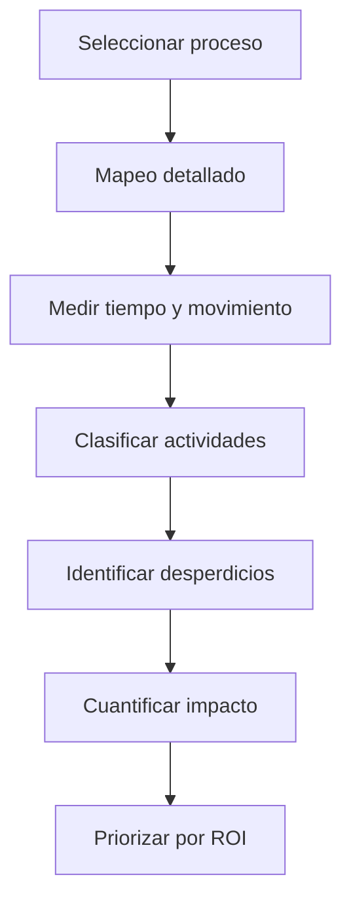
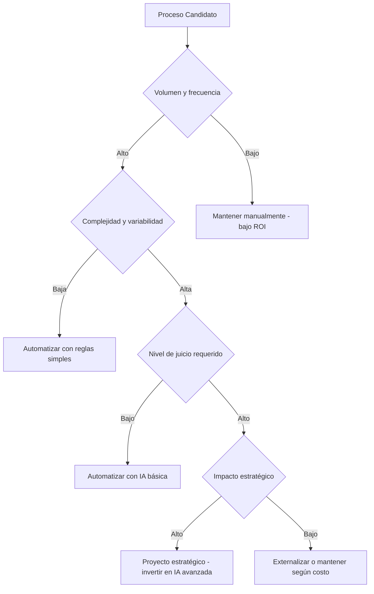
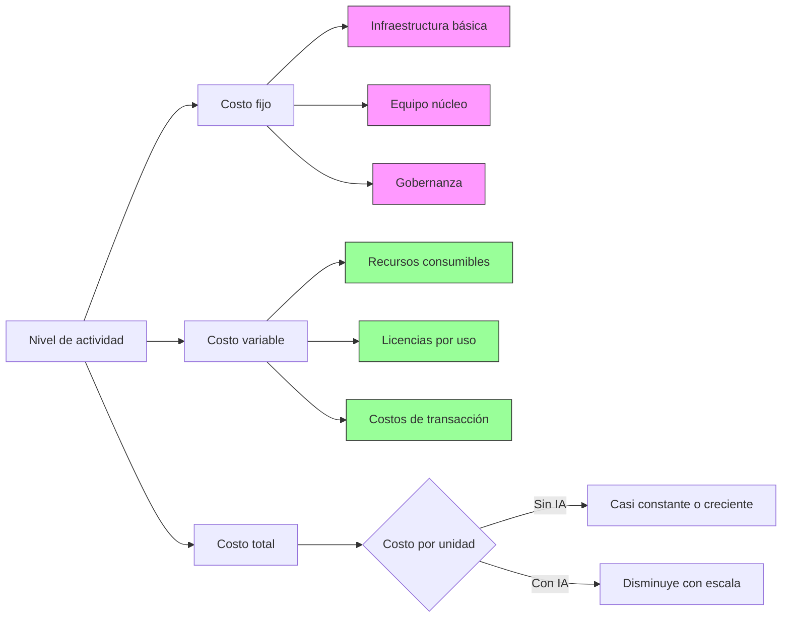
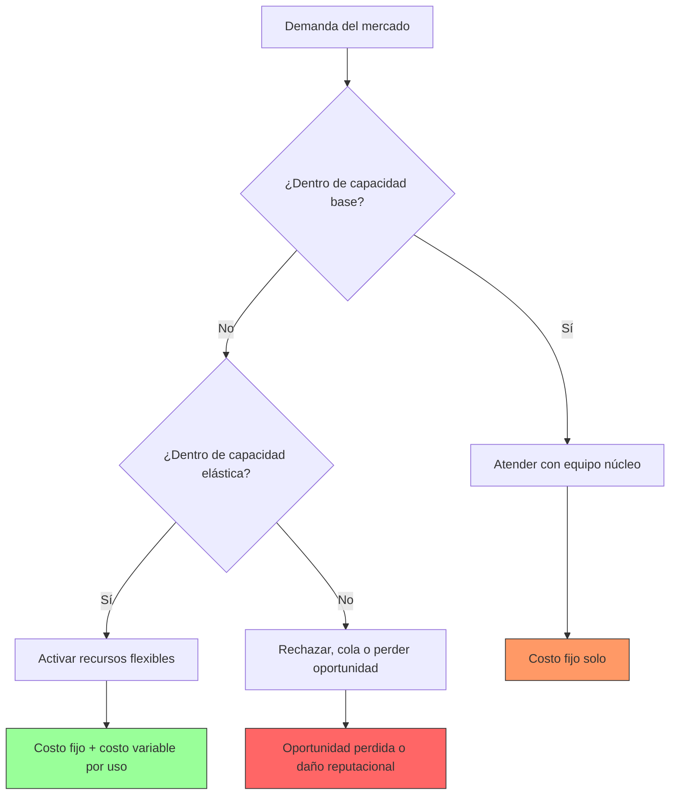

# MASTERCLASS: Estratega de Eficiencia Operativa con IA — Reducción de Costos y Escalabilidad

> **Prerrequisito** — Esta guía asume conocimiento de los módulos anteriores: mentalidad estratégica, mapeo de procesos, arquitectura de automatización, diseño de agentes y aplicaciones en marketing y operaciones core.

---

# MÓDULO 8: REDUCCIÓN DE COSTOS MEDIANTE IA

## PRINCIPIO: LA IA COMO MULTIPLICADOR DE EFICIENCIA

La reducción de costos con IA no consiste en despedir empleados para pagar suscripciones de software. Consiste en **eliminar el desperdicio** — tiempo, esfuerzo, recursos y oportunidades perdidas — para que el mismo equipo produzca más valor con las mismas o menos horas.

La mayoría de las empresas cree que ya es eficiente. La realidad es que estudios de McKinsey, Bain y Deloitte muestran que entre el 20% y el 40% de las actividades empresariales son desperdicio puro: no agregan valor al cliente, no son requeridas por regulación y no son necesarias para la operación.

### Tres tipos de desperdicio que la IA elimina

| Tipo de desperdicio | Descripción | Ejemplo | Cómo la IA lo reduce |
|---------------------|-------------|---------|----------------------|
| **Desperdicio de tiempo** | Actividades que consumen horas sin generar valor | Llenar formularios manualmente, buscar información en 5 sistemas | Automatización de tareas repetitivas, agentes de búsqueda inteligente |
| **Desperdicio de errores** | Trabajo que debe rehacerse por equivocaciones | Facturas incorrectas, entradas de datos erróneas, diagnósticos equivocados | Validación automática, detección de anomalías, corrección predictiva |
| **Desperdicio de oportunidad** | Valor potencial no capturado por ineficiencia | Leads no seguidos, clientes que se van por lentitud, inventario obsoleto | Predictive lead scoring, agentes de retención, optimización de inventario |

> **Lección fundamental** — La IA no reduce costos al reemplazar humanos por máquinas baratas. Reduce costos al eliminar actividades que nunca deberían haber sido realizadas por humanos en primer lugar.

---

## CÓMO DETECTAR DESPERDICIOS: METODOLOGÍAS PRÁCTICAS

### 1. Análisis de tiempo y movimiento (Time and Motion Study)

Esta técnica industrial observa y cronometra cada segundo que un empleado dedica a una tarea para identificar actividades de bajo valor.

#### Protocolo de medición

| Paso | Acción | Herramienta | Salida |
|------|--------|-------------|--------|
| 1. Selección del proceso | Elegir un proceso repetitivo con volumen significativo | - | Proceso objetivo definido |
| 2. Descomposición en elementos | Dividir el tarea en micro-acciones observables | Cronómetro, app de tracking | Lista de pasos con tiempo estimado |
| 3. Observación directa | Registrar lo que realmente sucede (no lo que debería) | Video, notas de campo | Tiempo real por actividad |
| 4. Clasificación por valor | Etiquetar cada acción como valor añadido, necesario o desperdicio | Matriz de valor | % de tiempo en cada categoría |
| 5. Análisis de variación | Medir la diferencia entre el mejor y peor desempeño | Desviación estándar | Oportunidad de estandarización |
| 6. Identificación de cuellos | Detectar puntos de espera o bloqueo | Diagrama de flujo | Cuellos de botella identificados |

#### Tabla de registro de tiempo y movimiento

| Actividad | Tiempo observado | % del total | Valor añadido? | Comentario |
|-----------|------------------|-------------|----------------|------------|
| Abrir email de cliente | 15 segundos | 2% | Necesario | - |
| Buscar historial en CRM | 45 segundos | 6% | Necesario | Lentitud del sistema |
| Copiar datos a Excel | 30 segundos | 4% | Desperdicio | Automatizable |
| Calcular total manualmente | 60 segundos | 8% | Desperdicio | Error-prone |
| Dar formato al reporte | 90 segundos | 12% | Desperdicio | Plantilla resolvería |
| Enviar email de respuesta | 20 segundos | 3% | Necesario | - |
| **Espera entre pasos** | **180 segundos** | **25%** | **Desperdicio** | **Dependencia manual** |
| ... | ... | ... | ... | ... |
| **TOTAL** | **12 minutos** | **100%** | | |

> **Interpretación** — En este ejemplo hipotético, el 29% del tiempo es desperdicio puro (copiar datos, calcular manualmente, dar formato). El 25% es espera que podría eliminarse con mejor flujo.

### 2. Análisis de Pareto (80/20) aplicado a costos

El principio de Pareto establece que aproximadamente el 80% de los efectos provienen del 20% de las causas. En gestión de costos, esto significa que el 80% de los costos innecesarios provienen del 20% de los procesos.

#### Pasos para aplicar Pareto a costos

1. **Lista todos los procesos recurrentes** de tu empresa (al menos 15-20)
2. **Estima el costo mensual** de cada uno (horas × costo horario + gastos directos)
3. **Ordena de mayor a menor** costo mensual
4. **Calcula el porcentaje acumulado**
5. **Identifica el 20% superior** que representa el 80% del costo total

#### Ejemplo de análisis de Pareto para costos operativos

| Proceso | Costo mensual (USD) | % del total | % acumulado |
|---------|---------------------|-------------|-------------|
| Generación de reportes manuales | 8.500 | 0, 35%0.34 | 34% |
| Gestión de cobranza | 6.200 |0.25 | 59% |
| Onboarding de clientes nuevos | 4.800 |0.19 | 78% |
| Conciliación bancaria | 3.600 |0.14 | 92% |
| Actualización de documentación | 2.400 |0.10 | 100% |
| Otros 15 procesos | 4.500 |0.18 | 118% |

> **Conclusión** — Los 4 primeros procesos (20% del total) representan el 78% del costo operativo. Enfocarse en ellos yield máximo retorno.

### 3. Mapeo de desperdicios (Muda) ampliado

Más allá de los 7 desperdicios clásicos de Lean, en la era del conocimiento identificamos formas específicas de desperdicio digital y cognitivo.

| Tipo de desperdicio | Manifestación empresarial | Detección | Solución IA típica |
|---------------------|---------------------------|-----------|--------------------|
| **Transporte de información** | Mover datos entre sistemas manualmente | Tiempo dedicado a exportar/importar CSV | Integración API nativa o middleware |
| **Espera por información** | Bloqueado esperando datos de otro departamento | Tickets pendientes, SLAs incumplidos | Agentes proactivos que anticipan necesidades |
| **Sobreprocesamiento** | Hacer más de lo necesario | Información duplicada, validaciones excesivas | Reglas de negocio simplificadas por ML |
| **Inventario de tareas** | Backlog creciendo sin límite | Lista de tareas pendientes creciente | Priorización automática y límite WIP |
| **Movimiento de contexto** | Cambiar constantemente entre tareas | Tiempo perdido en reenfoque | Agentes especializados por dominio |
| **Defectos de información** | Datos incorrectos, duplicados, desactualizados | Tasas de corrección, reclamos clientes | Limpieza automática y validación en tiempo real |
| **Talento subutilizado** | Personas capacitadas haciendo tareas básicas | Encuestas de satisfacción, rotación | Redeploy a actividades de alto valor |
| **Sobreproducción de informes** | Generar informes que nadie lee | Feedback nulo, métricas sin acción | Reportes on-demand y activados por evento |
| **Procesos no estandarizados** | Cada persona lo hace a su manera | Variabilidad en resultados, tiempo | Plantillas inteligentes y agentes guía |
| **Búsqueda de información** | Tiempo gastado buscando documentos o datos | Historial de navegación, consultas repetidas | Búsqueda semántica y agente de conocimiento |

### Cuadro de detección de desperdicios

Para cada proceso que analices, completa esta tabla:

| Desperdicio | Síntoma observado | Frecuencia | Impacto estimado (horas/semana) | Costo semanal (USD) |
|-------------|-------------------|------------|----------------------------------|---------------------|
| Transporte de información | Exportar/importar entre CRM y Excel | 10 veces/día | 5 h | 250 |
| Espera por información | Esperar aprobación de legal | 3 veces/día | 8 h | 400 |
| Sobreprocesamiento | Validar 3 veces lo mismo | 50 veces/día | 3 h | 150 |
| Inventario de tareas | Backlog de tickets sin priorizar | Constante | 10 h | 500 |
| Movimiento de contexto | Cambiar entre 4 sistemas diferentes | 20 veces/día | 4 h | 200 |
| Defectos de información | Facturas con errores | 5% de facturas | 6 h | 300 |
| Talento subutilizado | Analista senior ingresando datos | 2 horas/día | 2 h | 180 |
| Sobreproducción de informes | Reporte semanal que nadie lee | 1/semana | 2 h | 100 |
| Procesos no estandarizados | 3 formas diferentes de hacer lo mismo | En cada ejecución | 4 h | 200 |
| Búsqueda de información | Buscar mismos documentos semanalmente | 15 búsquedas/día | 6 h | 300 |
| **TOTAL** | | | **50 horas/semana** | **2,530 USD** |

---

## FRAMEWORK DE AHORRO: DETECTAR, CUANTIFICAR, AUTOMATIZAR, VERIFICAR (DCAV)

### Fase 1: Detectar - Mapeo sistemático de desperdicios



**Herramientas de detección:**
- Software de tracking de tiempo (Toggl, RescueTime)
- Observación directa con cronómetro
- Entrevistas estructuradas
- Análisis de logs de sistema
- Encuestas de auto-reporte

### Fase 2: Cuantificar - Convertir desperdicio en métricas financieras

Cada minuto de desperdicio tiene un costo. Para convertirlo:

```
Costo anual del desperdicio = 
    (Horas desperdiciadas por empleado por semana) 
    × (Número de empleados afectados) 
    × (Costo horario fully-loaded) 
    × (Semanas laborales al año)
```

#### Ejemplo de cálculo de costo anual

Situación: 5 empleados pasan 3 horas/semana cada uno buscando información en sistemas diferentes.

- Horas desperdiciadas/semana = 5 empleados × 3 h = 15 h
- Costo horario fully-loaded = USD 45 (incluye beneficios, espacio, etc.)
- Semanas laborales/año = 48
- **Costo anual = 15 × 45 × 48 = USD 32,400/año**

### Fase 3: Automatizar - Diseñar la solución

Para cada desperdicio identificado, pregunta:

1. ¿Puede eliminarse completamente? (ej.: generar informe que nadie lee)
2. ¿Puede automatizarse con reglas simples? (ej.: copiar datos entre sistemas)
3. ¿Requiere IA básica? (ej.: clasificar emails por intención)
4. ¿Requiere IA avanzada? (ej.: generar propuesta personalizada)
5. ¿Requiere cambio de proceso previo? (ej.: estandarizar formato de entrada)

### Fase 4: Verificar - Medir el impacto real

La verificación no es opcional. Sin medición posterior, no puedes saber si funcionó.

| Métrica | Antes (línea base) | Después (4 semanas) | Después (3 meses) | Comentario |
|---------|-------------------|---------------------|-------------------|------------|
| Horas/semana en tarea X | 20 h | 5 h | 3 h | Mejora sostenida |
| Errores por mes | 15 | 3 | 1 | Reducción continua |
| Tiempo de respuesta | 4 h | 45 min | 30 min | Cumple SLA |
| Costo por transacción | USD 12 | USD 3 | USD 2.50 | Economías de escala |
| Satisfacción del cliente | 3.2/5 | 4.1/5 | 4.5/5 | Mejora percibida |
| Horas disponibles para valor añadido | 10 h/sem | 25 h/sem | 27 h/sem | Reinversión en crecimiento |

---

## MODELO FINANCIERO: ROI, TCO Y PAYBACK PARA PROYECTOS DE IA

### Retorno de la Inversión (ROI)

El ROI mide la rentabilidad de una inversión. Para proyectos de IA, debe calcularse considerando tanto los beneficios directos como los indirectos.

```
ROI (%) = [(Beneficios anuales - Costos anuales) / Costos anuales] × 100
```

#### Componentes del beneficio anual

| Tipo | Ejemplo | Cómo medir |
|------|---------|------------|
| **Ahorro directo** | Reducción de horas hombre | Horas ahorradas × costo hourly |
| **Evitar costos** | Multas evitadas, trabajo repetido evitado | Costos que ya no ocurren |
| **Ingresos adicionales** | Ventas adicionales por mejor servicio | Incremento en ventas atribuible |
| **Valor de opción** | Capacidad de atender más clientes sin costo | Valor de la nueva capacidad |
| **Beneficios intangibles** | Mejora en moral, reducción de rotación | Encuestas, tasa de retention |

#### Componentes del costo anual

| Tipo | Ejemplo | Comentario |
|------|---------|------------|
| **Inversión inicial** | Desarrollo, integración, testing | Amortizar en 3-5 años |
| **Licencias de software** | Suscripciones a plataformas de IA | Costo recurrente anual |
| **Infraestructura** | Servidores, almacenamiento, bandwidth | Costos de operación |
| **Mantenimiento y soporte** | Actualizaciones, monitoreo, soporte | 15-25% de inversión inicial/año |
| **Capacitación** | Entrenamiento del equipo en nuevas herramientas | Costo único o anual según rol |
| **Gobernanza y compliance** | Auditorías, políticas, documentación | 5-10% del presupuesto de proyecto |

### Costo Total de Propiedad (TCO)

El TCO incluye todos los costos asociados a un activo durante su vida útil.

```
TCO = Costo de adquisición + Costos de operación + Costos de mantenimiento - Valor de rescate
```

#### Ejemplo TCO para agente de cobranza

| Concepto | Costo inicial | Costo anual | Comentario |
|----------|---------------|-------------|------------|
| Desarrollo y testing | USD 12,000 | - | Proyecto de 8 semanas |
| Licencias LLM (API) | - | USD 3,000 | Uso estimado: 50K tokens/mes |
| Orquestación (n8n cloud) | - | USD 600 | Plan profesional |
| Almacenamiento y compute | - | USD 400 | Base de datos pequeña |
| Mantenimiento y soporte | - | USD 2,400 | 20% del desarrollo/año |
| Capacitación del equipo | USD 1,500 | - | Taller de 4 horas |
| Gobernanza y documentación | - | USD 1,200 | Revisión trimestral de políticas |
| **TOTAL 1 AÑO** | **USD 13,500** | **USD 7,600** | |
| **TOTAL 3 AÑOS** | **USD 13,500** | **USD 22,800** | **TCO 3 años = USD 36,300** |

### Payback period (Periodo de recuperación de la inversión)

```
Payback (meses) = Inversión inicial / Ahorro mensual neto
```

Donde:
- Ahorro mensual neto = (Ahorro bruto mensual) - (Costos operacionales mensuales)

#### Ejemplo de cálculo de payback

Proyecto: Agente de facturación automático
- Inversión inicial: USD 8,000
- Ahorro bruto mensual: USD 3,200 (horas ahorradas × costo hourly)
- Costos operacionales mensuales: USD 400 (licencias, mantenimiento)
- Ahorro mensual neto: USD 2,800
- **Payback = 8,000 / 2,800 = 2.86 meses (~3 meses)**

### Umbrales de viabilidad para proyectos de IA

| Métrica | Mínimo aceptable | Excelente | Comentario |
|---------|------------------|-----------|------------|
| **Payback** | < 12 meses | < 4 meses | Proyectos con payback > 18 meses requieren justification estratégica fuerte |
| **ROI anual** | > 50% | > 200% | ROI < 30% suele indicar subestimación de costos o sobreestimación de beneficios |
| **TCO 3 años** | < 3× beneficio anual 1 | < 1.5× beneficio anual 1 | El TCO no debe superar los beneficios esperados |
| **Tasa de adopción** | > 70% del equipo usa la solución | > 90% | Baja adopción indica problema de cambio o usabilidad |
| **Reducción de error** | > 30% | > 80% | Medir antes y después en defects per million opportunities (DPMO) |

---

## MATRIZ DE DECISIÓN: CUÁNDO AUTOMATIZAR, EXTERNALIZAR O MANTENER

No todo debe automatizarse. Usa esta matriz para tomar decisiones estratégicas.



### Tabla de decisión por tipo de proceso

| Tipo de proceso | Características | Recomendación | Herramientas sugeridas |
|-----------------|-----------------|---------------|------------------------|
| **Alto volumen, baja complejidad** | Repetitivo, reglas claras, poca variación | Automatizar totalmente | RPA, workflows simples, scripts |
| **Alto volumen, alta complejidad** | Muchos casos, muchas excepciones, necesita juicio | Automatizar con supervisión | IA + humano en loop, agentes con confirmación |
| **Bajo volumen, baja complejidad** | Pocas instances, reglas simples | Mantener manualmente o externalizar | Bajo esfuerzo, alto costo de cambio |
| **Bajo volumen, alta complejidad** | Raras pero críticas, requiere expertise | Externalizar o centro de excelencia | Consultor especializado, equipo dedicado |
| **Alto impacto estratégico** | Define ventajas competitivas | Invertir en IA avanzada | Modelos custom, fine-tuning, equipo interno |
| **Alto riesgo regulatorio** | Errores tienen consecuencias legales | Automatizar con validación rígida | Blockchain, auditoría automática, doble контроль |

---

## ESCALABILIDAD SIN AUMENTO DE COSTOS FIJOS

### El mito de la escalabilidad lineal

En el modelo tradicional, escalar requiere aumentar linealmente los recursos:
- 2x clientes → 2x empleados de soporte
- 10x transacciones → 10x contadores
- 5x productos → 5x diseñadores

La ilusión es que el costo por unidad permanece constante. En realidad, hay economías y desconomías de escala.

### La realidad de la escalabilidad con IA

Con la arquitectura correcta, el costo marginal de atender una unidad adicional tiende a cero después de cierto umbral.



#### Modelo de costo con IA

```
Costo total = Costo fijo + (Costo variable por unidad × Unidades) − Economías de escala por aprendizaje
```

Donde:
- **Costo fijo** incluye: desarrollo inicial, gobernanza, equipo de mantenimiento
- **Costo variable por unidad** incluye: computación, almacenamiento, licencias por transacción
- **Economías de escala por aprendizaje** incluyen: mejora de modelos con más datos, mejor aprovechamiento de infraestructura

### Puntos de inflexión en la escalabilidad

| Etapa | Característica | Estrategia |
|-------|----------------|------------|
| **Fase 1: Operación manual** | Costo por unidad alto y creciente | Enfocarse en eficiencia individual |
| **Punto de inflexión 1** | Volumen donde la automatización supera al manual | Invertir en automatización básica |
| **Fase 2: Automatización básica** | Costo por unidad disminuye rápidamente | Escalar la automatización |
| **Punto de inflexión 2** | Volumen donde la IA supera a la automatización básica | Invertir en inteligencia artificial |
| **Fase 3: Inteligencia artificial** | Costo por unidad disminuye lentamente, tiende a cero | Aprovechar efectos de red de aprendizaje y datos |
| **Punto de inflexión 3** | Volumen donde los beneficios de red superan los costos | Innovación y nuevos modelos de negocio |

### Caso práctico: Escalabilidad en atención al cliente

Empresa de SaaS con crecimiento de 100% anual en tickets de soporte.

| Métrica | Año 1 (manual) | Año 2 (bot básico) | Año 3 (agente IA) | Tendencia |
|---------|----------------|--------------------|-------------------|-----------|
| Tickets/mes | 1.000 | 2.000 | 4.000 | +100% anual |
| Agentes humanos | 5 | 3 | 2 | -60% vs año 1 |
| Costo por ticket | USD 15 | USD 8 | USD 3 | -80% vs año 1 |
| Tiempo primera respuesta | 4 h | 45 min | 8 min | -96% vs año 1 |
| CSAT | 3.8/5 | 4.0/5 | 4.4/5 | +16% vs año 1 |
| % resuelto por bot/agente | 0% | 40% | 75% | +75pp vs año 1 |

> **Insight** — El costo por ticket no disminuye linealmente. En año 1 a año 2: de 15 a 8 (-47%). En año 2 a año 3: de 8 a 3 (-63%). La mejora acelerada viene del aprendizaje y la optimización continua.

---

## CAPACIDAD INSTALADA ELÁSTICA

La capacidad instalada elástica es la capacidad de atender variaciones en la demanda sin cambiar proporcionalmente los recursos fijos.

### Modelo de capacidad elástica



### Componentes de capacidad elástica con IA

| Componente | Fuente | Costo de activación | Tiempo de respuesta |
|------------|--------|---------------------|---------------------|
| **Equipo núcleo** | Empleados permanentes | Alto (fijo) | Inmediato |
| **Agentes IA escalables** | Instancias de computación | Bajo (por uso) | Segundos a minutos |
| **Almacenamiento elástico** | Cloud storage | Muy bajo | Milisegundos |
| **APIs de terceros** | Servicios externos | Variable | Segundo a minuto |
| **Outsourcing inteligente** | Red de freelancers especializados | Medio | Horas a días |
| **Automatización de flujo** | Workflows predefinidos | Bajo | Segundos |

### Ejemplo: Capac elástica en temporada alta

Empresa minorista con pico de ventas en diciembre (300% del volumen mensual promedio).

| Recurso | Capacidad base | Capacidad elástica | Costo marginal |
|---------|----------------|-------------------|----------------|
| Equipo de ventas núcleo | 10 personas | - | Fijo |
| Agentes de ventas IA | 0 (base) | Hasta 50 simultáneos | USD 0.02 por conversación |
| Soporte técnico núcleo | 3 personas | - | Fijo |
| Chatbot de soporte | 0 (base) | Hasta 200 concurrentes | USD 0.005 por interacción |
| Almacén de productos | Espacio físico | Alquiler temporal | USD por pallet/día |
| Equipo de logística | 5 personas | Contratación temporal | Costo horario temporal |

> **Resultado** — En diciembre, la empresa atiende 4x el volumen normal con solo un 25% aumento en costos fijos (almacén temporal + personal temporal de logística). El resto es capacidad elástica pagada por uso.

---

## PLAN DE ACCIÓN: 90 DÍAS PARA REDUCCIÓN DE COSTOS

### Semana 1-2: Diagnóstico y selección de quick wins

| Día | Actividad | Entregable |
|-----|-----------|------------|
| 1-2 | Capacitación al equipo en detección de desperdicios | Material de estudio distribuido |
| 3-5 | Mapeo de 5 procesos críticos con time and motion study | 5 formularios completados |
| 6-7 | Análisis de Pareto de costos operativos | Lista de procesos ordenados por costo |
| 8-9 | Entrevistas a responsables de procesos | Notas de captura de conocimiento tácito |
| 10-11 | Identificación de 3-5 quick wins candidatos | Lista con estimación de ahorro |
| 12-14 | Selección de 2 quick wins para piloto | Decisión basada en ROI estimado |

### Semana 3-6: Implementación de quick wins

| Semana | Actividad | Entregable |
|--------|-----------|------------|
| 3 | Diseño de solución para Quick Win 1 | Esquema técnico y flujo de trabajo |
| 4 | Desarrollo y testing interno | Versión lista para piloto |
| 5 | Piloto con grupo pequeño (20% volumen) | Resultados preliminares |
| 6 | Ajustes basados en feedback | Versión mejorada |
| 7 | Rollout completo a 100% volumen | Solución en producción |
| 8 | Medición de resultados post-implementación | Comparación con línea base |
| 9-10| Repetir proceso para Quick Win 2 | Segunda solución implementada |
| 11-12| Documentación y transferencia de conocimiento | Manual de operación y mantenimiento |

### Semana 7-12: Escalabilidad y gobernanza

| Semana | Actividad | Entregable |
|--------|-----------|------------|
| 7-8 | Diseño de arquitectura elástica para procesos críticos | Diagrama de componentes y escalado |
| 9 | Implementación de monitoreo y alertas | Dashboard operativo activo |
| 10 | Definición de políticas de gobernanza | Documento de uso responsable de IA |
| 11 | Simulación de carga y prueba de estrés | Informe de límites y puntos de ruptura |
| 12 | Revisión ejecutiva y planificación Q2 siguiente | Reporte de resultados y próximos pasos |

---

## CASO PRÁCTICO: REDUCCIÓN DE COSTOS EN UNA CONSULTORA FINANCIERA

### Contexto

**Empresa:** Asesoría Fintegral S.A.  
**Sector:** Consultoría financiera y tributaria  
**Empleados:** 22  
**Facturación:** USD 3.1M/año  
**Problema:** Márgenes estancados en 12% pese a crecimiento de facturación. Equipo senior pasando 60% del tiempo en tareas administrativas.

### Diagnóstico inicial

| Proceso | Horas/semana | Costo semanal | % tiempo equipo senior |
|---------|--------------|---------------|------------------------|
| Elaboración de reportes clientela | 18 h | USD 810 | 27% |
| Gestión de documentación | 15 h | USD 675 | 23% |
| Conciliación bancaria | 12 h | USD 540 | 18% |
| Onboarding de clientes | 10 h | USD 450 | 15% |
| Actualización de conocimiento tributario | 8 h | USD 360 | 12% |
| Otros | 17 h | USD 765 | 25% |
| **TOTAL** | **80 h** | **USD 3,600** | **120%** |

> **Nota** — El porcentaje supera 100% porque algunos procesos involucran a múltiples empleados simultáneamente.

### Solución implementada

#### Quick Win 1: Agente de reportes automatizados (Semanas 1-4)

- **Problema** — Los analistas senior pasaban 6 horas por cliente elaborando reportes personalizados de inversión.
- **Solución** — Agente que:
  1. Extrae datos de cartera del CRM
  2. Calcula métricas de performance (return, volatilidad, sharpe)
  3. Genera narrativas personalizadas usando LLM
  4. Aplica plantillas de diseño aprobadas por compliance
  5. Envía el reporte por email y lo sube al portal del cliente
- **Inversión** — USD 4,200 (3 semanas de desarrollo)
- **Ahorro** — 15 h/semana × USD 45/hour × 48 semanas = USD 32,400/año
- **Payback** — 1.6 meses

#### Quick Win 2: Sistema de gestión documental inteligente (Semanas 5-8)

- **Problema** — Los asistentes perdían 3-4 horas/día buscando, archivando y versiones de documentos.
- **Solución** — Sistema que:
  1. Clasifica automáticamente documentos entrantes por tipo (contrato, estado de cuenta, correo)
  2. Extrae metadata clave (cliente, fecha, tipo de operación)
  3. Almacena en estructura lógica (Año/Cliente/Tipo)
  4. Permite búsqueda semántica por contenido y metadata
  5. Alertas de vencimiento y renewals automáticos
- **Inversión** — USD 5,800 (4 semanas de desarrollo + integración)
- **Ahorro** — 12 h/semana × USD 35/hour × 48 semanas = USD 20,160/año
- **Payback** — 2.8 meses

#### Quick Win 3: Agente de onboarding de clientes (Semanas 9-12)

- **Problema** — El proceso de apertura de cuenta tomaba 5-7 días y requería 3 intervenciones humanas.
- **Solución** — Workflow que:
  1. Valida documentación electrónica contra listas de sanction
  2. Extrae y verifica información de identificación
  3. Realiza scoring de riesgo basado en reglas y ML ligero
  4. Genera contrato prellenado para firma electrónica
  5. Programa llamada de bienvenida y asigna asesor
- **Inversión** — USD 3,500 (2 semanas de desarrollo)
- **Ahorro** — 8 h/semana × USD 40/hour × 48 semanas = USD 15,360/año
- **Payback** — 2.3 meses

### Resultados a 6 meses

| Métrica | Antes | Después | Cambio |
|---------|-------|---------|--------|
| Horas/semana en tareas administrativas | 80 h | 32 h | -60% |
| Horas/semana disponibles para valor añadido | 24 h | 72 h | +200% |
| Satisfacción del cliente (NPS) | 38 | 52 | +37% |
| Tiempo medio de onboarding | 6 días | 18 horas | -87% |
| Errores en reportes entregados | 4% | 0.3% | -93% |
| Margen EBITDA | 12% | 24% | +100% |
| Facturación por empleado | USD 140.000/año | USD 185.000/año | +32% |
| Rotación de personal anual | 25% | 8% | -68% |

### Lecciones clave

1. **Empieza con lo visible, no con lo sexy.** Los reportes y documentos no son glamourosos, pero son donde se pierde el tiempo.
2. **La automatización de documentos es un multiplicador.** Un buen sistema de gestión documental mejora múltiples procesos simultáneamente.
3. **El onboarding es un momento de verdad.** Mejorarlo impacta retención, satisfacción y costo de adquisición.
4. **Los beneficios se multiplican.** Reducir tiempo administrativo no solo ahorra dinero; aumenta capacidad para ventas, mejora calidad y reduce estrés del equipo.

---

## ERRORES COMUNES EN REDUCCIÓN DE COSTOS CON IA

| Error | Síntoma | Consecuencia | Antídoto |
|--------|---------|--------------|----------|
| **Enfocarse solo en reducción de personal** | Despidos anunciados como beneficio principal | Moral baja, fuga de talento, conocimiento perdido | Enfocar en eliminar desperdicio, no en recortar plantilla |
| **No medir la línea base** | No se sabe cuánto se ahorró realmente | Proyecto sin evidencia de éxito | Medir KPIs actuales antes de cualquier cambio |
| **Automatizar lo incorrecto** | Optimizar un proceso que debería eliminarse | Inversión en solución al problema equivocado | Preguntar: "¿Este proceso debería existir?" antes de automatizar |
| **Subestimar el cambio cultural** | El equipo ve la IA como amenaza, no como ayuda | Sabotaje pasivo, datos intencionalmente incorrectos | Incluir al equipo en el diseño desde el día 1 |
| **Ignorar los costos ocultos** | Solo mirar el costo de la licencia de software | ROI inflado, sorpresas desagradables | Incluir capacitación, gobernanza, mantenimiento |
| **Esperar resultados lineales** | Asumir que cada dólar invertido da retorno proporcional | Desilusión cuando los retornos no aparecen | Modelar curvas de aprendizaje y efectos de red |
| **Olvidar la escalabilidad** | Diseñar para volumen actual sin pensar en crecimiento | Sistema obsoleto en 6 meses | Arquitectar desde el inicio para el doble o triple del volumen |
| **Falta de gobernanza** | Agentes operando sin límites ni supervisión | Riesgo reputacional, errores no detectados | Política de IA, kill-switch, auditorías obligatorias |

---

## CHECKLIST: FRAMEWORK DE REDUCCIÓN DE COSTOS

### Preparación

| Check | Estado |
|-------|--------|
| La dirección ejecutiva ha aprobado el programa de reducción de costos | ☐ |
| Se ha designado un sponsor ejecutivo con autoridad y tiempo | ☐ |
| Se ha formado un equipo interdepartamental para el diagnóstico | ☐ |
| Existe un presupuesto designado para quick wins y pilotos | ☐ |
| Se han definido métricas de éxito claras (ahorro, tiempo, calidad) | ☐ |

### Diagnóstico

| Check | Estado |
|-------|--------|
| Se han mapeado al menos 5 procesos críticos con time and motion | ☐ |
| Se ha realizado análisis de Pareto de costos operativos | ☐ |
| Se han identificado al menos 3 desperdicios específicos por proceso | ☐ |
| Se ha cuantificado el costo anual de cada desperdicio identificado | ☐ |
| Se han seleccionado 2-3 quick wins con ROI > 200% y payback < 4 meses | ☐ |

### Implementación

| Check | Estado |
|-------|--------|
| Cada quick win tiene un plan de implementación con hitos semanales | ☐ |
| Se han definido métricas de antes y después para cada iniciativa | ☐ |
| Existe un plan de comunicación interna para cada cambio | ☐ |
| Los usuarios finales han sido capacitados en el nuevo proceso | ☐ |
| Se ha implementado un sistema de recolección de feedback continuo | ☐ |

### Verificación

| Check | Estado |
|-------|--------|
| Se ha medido el impacto real 4 semanas después de la implementación | ☐ |
| Se ha validado que el ahorro neto supera los costos de operación | ☐ |
| Se ha documentado lecciones aprendidas y mejores prácticas | ☐ |
| Se ha actualizado la documentación de procesos afectados | ☐ |
| Se ha planeado el mantenimiento y mejora continua | ☐ |

---

## RESUMEN EJECUTIVO

Este quinto archivo de la master class presenta un marco integral para reducir costos operativos con IA sin comprometer calidad ni capacidad:

1. **La detección es el primer paso.** Sin un mapeo detallado y cuantificado del desperdicio, cualquier esfuerzo de reducción de costos es tiro al aire.
2. **El desperdicio es multifacético.** No es solo tiempo; es errores, oportunidades perdidas, talento subutilizado y fricción en el sistema.
3. **El framework DCAV (Detectar, Cuantificar, Automatizar, Verificar)** proporciona un método probado para identificar y eliminar desperdicios con medición rigurosa.
4. **Los modelos financieros (ROI, TCO, payback)** son esenciales para justificar inversiones y comparar alternativas. Un proyecto de IA debe pagar por sí mismo en menos de 12 meses para ser considerado viable operativamente.
5. **La escalabilidad elástica es la verdadera ventaja.** Con la arquitectura correcta, el costo marginal de atender una unidad adicional tiende a cero, permitiendo crecer sin aumentar linealmente los costos fijos.
6. **Los quick wins generan credibilidad política.** Los ahorros rápidos y demostrables financian los proyectos estratégicos a largo plazo.
7. **La gobernanza no es opcional.** Sin políticas claras, kill-switches y auditorías, los riesgos de la automatización pueden superar los beneficios.

**Próximo paso:** Diseño de implementación paso a paso, gestión del cambio y planes de acción a 90/180/360 días en `ia-sistema-operativo-implementacion.md` (Módulos 10 y 11).