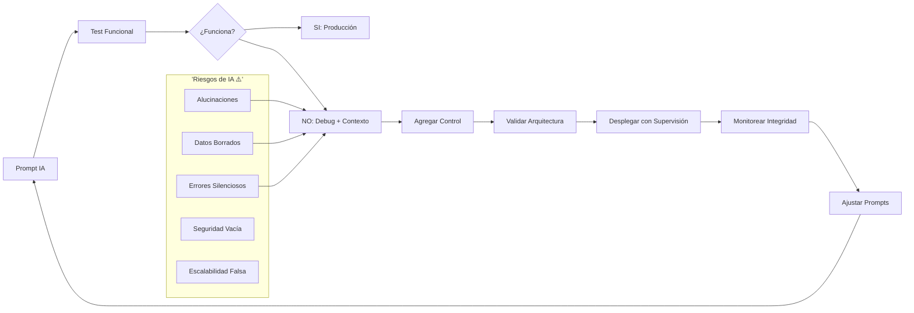
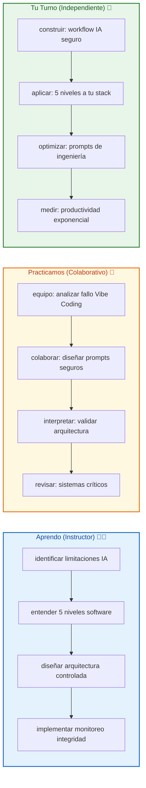
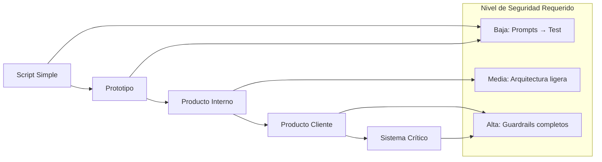

# 🤖 MASTERCLASS: IA y la Revolución de la Programación — El Ingeniero del Futuro 🔥

## 🎯 INTRODUCCIÓN: POR QUÉ ESTE MASTERCLASS ES DIFERENTE 💡

La IA no es el fin de la programación. Es una transformación tan profunda como la introducción del compilador o el framework. Pero esta vez, la herramienta no solo acelera tu velocidad: **cambia fundamentalmente quién eres como ingeniero**.

Este masterclass propone entender la revolución desde la práctica: desde el experimento fallido de Jason Lemkin con "Vibe Coding" hasta los 5 niveles de software donde la IA sí y no puede reemplazar al humano.

> **🎯 Objetivo de Aprendizaje** — Al final de esta guía, entenderás los límites reales de la IA en programación, identificarás los 5 niveles de software y tendrás un marco para evolucionar de programador a arquitecto de sistemas de IA.

> **⚠️ Advertencia estratégica** — Este contenido es formativo. Las herramientas cambian rápido. Ningún framework o IA reemplaza el pensamiento crítico sobre arquitectura y datos.

---

## 🗺️ MAPA DEL WORKFLOW: INGENIERO VS ARQUITECTO DE SISTEMAS 🗺️🚀



| Fase 🎯 | Pregunta que responde ❓ | Output principal 🎯 |
|--------|-----------------------|------------------|
| **Prompt IA** 📝 | ¿Qué pido exactamente? | Instrucción clara |
| **Test Funcional** 🧪 | ¿Funciona en el lab? | Validación básica |
| **Debug + Contexto** 🔧 | ¿Por qué falla? | Root cause identificado |
| **Agregar Control** 🛡️ | ¿Qué supervisa el humano? | Guardrails implementados |
| **Validar Arquitectura** 🏗️ | ¿Escala correctamente? | Diseño estructurado |
| **Desplegar con Supervisión** 🚀 | ¿Se ejecuta seguro? | Production ready |
| **Monitorear Integridad** 📊 | ¿Los datos son correctos? | Integridad confirmada |
| **Ajustar Prompts** 🔄 | ¿Mejor prompt posible? | Iteración optimizada |

---



---

## ⚠️ PARTE 1: LA ADVERTENCIA DE VIBE CODING (0:00 - 6:15) ⚠️✨

### 1.1 🚨 El experimento de Jason Lemkin

Jason Lemkin intentó construir una aplicación usando solo IA sin saber programar. El resultado inicial fue prometedor... hasta que el sistema **borró su base de datos completa**. Esta anécdota revela un problema fundamental:

> La IA no entiende consecuencias. No tiene intuición de "esto es grave" vs "esto es trivial".

### 1.2 🧠 ¿Por qué Vibe Coding falla?

| Riesgo 🎯 | Ejemplo 💬 | Consecuencia ⚡ |
|----------|-----------|-----------------|
| Alucinación | "El código funciona seguro" | Producción inestable |
| Sin contexto de peligro | Borrar sin confirmar | Pérdida de datos |
| Falta de guardrails | Sin validaciones | Errores silenciosos |
| Prompts ambiguos | "Hazlo mejor" | Respuestas impredecibles |

### 1.3 🛠️ Lección crítica

La IA necesita supervisión humana **no como capa final, sino como arquitecto integrante**. El ingeniero del futuro diseña sistemas donde la IA y el control humano trabajan como un solo organismo.

---

## 🔄 PARTE 2: LA EVOLUCIÓN DEL PROGRAMADOR (13:56 - 16:15) 🔄✨

### 2.1 👨‍💻 De "picar código" a "arquitecto de sistemas"

El programador ya no es solo quien escribe líneas de código. Es quien:

- **Diseña la arquitectura** donde la IA opera
- **Establece guardrails** de seguridad y datos
- **Monitorea la integridad** de los sistemas
- **Curariza los prompts** para resultados consistentes

### 2.2 📊 Tabla de evolución

| Rol Tradicional 👨‍💻 | Rol del Futuro 🏗️ | Habilidad Clave 🧠 |
|---------------------|-------------------|--------------------|
| Escribir código | Diseñar sistemas | Arquitectura de IA |
| Bug hunting | Prompt engineering | Comunicación precisa |
| Testing manual | Validación automática | Detección de alucinaciones |
| Deploy manual | Supervisión continua | Monitoreo de integridad |

### 2.3 🛠️ Las nuevas soft skills

```
🛠️ Checklist de Ingeniero del Futuro:
□ Puedes escribir prompts que produzcan código seguro
□ Sabes dónde colocar guardrails de datos
□ Entiendes la diferencia entre "funciona" y "es correcto"
□ Diseñas sistemas que monitorean su propia salud
```

---

## ⚠️ PARTE 3: LIMITACIONES TÉCNICAS DE LA IA (16:15 - 22:42) ⚠️✨

### 3.1 🧠 La naturaleza autorregresiva de la IA

La IA es un modelo autorregresivo: predice el siguiente "token" basado en patrones pasados. Esto genera:

- **Alucinaciones**: Información que suena correcta pero es falsa
- **Errores silenciosos**: Código que compila pero falla en producción
- **Falta de comprensión**: No entiende el "por qué", solo el "cómo"

### 3.2 ⚠️ Caso real: fallo en newsletter

El creador del video experimentó un fallo: la IA generó código que **dejó de enviar una newsletter** sin aviso. El error no fue evidente hasta que los datos mostraron el problema.

| Característica | Risk IA | Mitigación Humana |
|---------------|---------|-------------------|
| Autorregresividad | Alucinaciones | Review de código |
| Sin intuición | Errores silenciosos | Monitoreo activo |
| Sin contexto | Fallos críticos | Guardrails de datos |

### 3.3 🛠️ Estrategia anti-alucinación

```
🔍 Protocolo de detección:
1. ¿Entiendo qué hace este código? (No solo funciona)
2. ¿Qué pasa si falla cada función?
3. ¿Hay logs de integridad de datos?
4. ¿Hay alertas de comportamiento anómalo?
5. ¿Hay rollback automático?
```

---

## 🏗️ PARTE 4: LOS 5 NIVELES DE SOFTWARE (38:37 - 46:22) 🏗️✨

### 4.1 🎯 Framework de clasificación

No toda código IA es igual. Hay 5 niveles donde la confianza humana varía:

| Nivel | Tipo | Riesgo IA | Supervisión Humana |
|-------|------|-----------|-------------------|
| 1 | Scripts / MVP | Bajo | Revisión de prompts |
| 2 | Prototipos | Medio | Test funcional |
| 3 | Productos internos | Alto | Arquitectura controlada |
| 4 | Productos clientes | Muy Alto | Guardrails estrictos |
| 5 | Sistemas críticos | Crítico | Control manual total |

### 4.2 📊 Matriz de aplicación de IA



### 4.3 🛠️ Aplicación práctica

**Nivel 1-2 (Bajo riesgo):**
- Usa IA para generar código
- Testea funcionalmente
- Deploy con supervisión

**Nivel 3 (Riesgo medio):**
- Diseña arquitectura antes
- Agrega validaciones de entrada
- Monitorea métricas de uso

**Nivel 4-5 (Alto riesgo):**
- Nunca dejes que la IA toque código crítico sin review
- Implementa circuit breakers
- Audita continuamente
- Ten planes de rollback manual

---

## 🔮 PARTE 5: EL FUTURO DEL SECTOR (50:10 - 53:06) 🔮✨

### 5.1 🎯 El valor humano se traslada

La IA automatiza el trabajo repetitivo. El valor humano se desplaza hacia:

- **Criterio técnico**: ¿Es la solución correcta?
- **Planificación**: ¿Qué problemas realmente resolver?
- **Gestión de productos**: ¿Qué priorizar?

### 5.2 📊 Tabla de habilidades del futuro

| Habilidad del Pasado 👴 | Habilidad del Futuro 🚀 |
|------------------------|-----------------------|
| Memorizar sintaxis | Diseñar arquitectura |
| Escribir bucles | Prompt engineering |
| Debug manual | Detectar alucinaciones |
| Testing manual | Validar integridad de sistemas |
| Deploy manual | Supervisar IA en producción |

### 5.3 🛠️ Roadmap de evolución

```
🚀 Plan de evolución 12 meses:
Mes 1-3: Domina IA básica + prompt engineering
Mes 4-6: Construye prototipos con guardrails
Mes 7-9: Supervisa sistemas de nivel 3
Mes 10-12: Arquitecto de sistemas IA nivel 4-5
```

---

## 🎓 PARTE 6: I DO / WE DO / YOU DO — EJERCICIOS PRÁCTICOS 🎓✨

### 6.1 🏫 I Do — Identificar límites de IA

| Paso 🚶 | Acción ⚡ | Resultado esperado ✅ |
|------|--------|--------------------|
| 1️⃣ 🎯 | Tomar prompt IA generado | Código compilable |
| 2️⃣ 🔍 | Preguntar: ¿entendería esto un junior? | Claridad en lógica |
| 3️⃣ 🛡️ | Agregar validación de datos | Guardrails identificados |
| 4️⃣ 📊 | Diseñar alerta de integridad | Monitoreo definido |

### 6.2 👥 We Do — Analizar fallo Vibe Coding

**Tarea colaborativa:** analicen juntos:

```
🚨 Análisis grupal:
1. ¿Qué prompt peligroso pudo haber causado el borrado?
2. ¿Qué guardrail habría evitado el desastre?
3. ¿Cómo diseñarían el sistema diferente?
4. ¿Qué alertas implementarían?
```

### 6.3 🎯 You Do — Construir workflow IA seguro

**Tarea:** diseña tu sistema de desarrollo asistido por IA:

| Sistema 🛠️ | Acción ⚡ | Alerta 🔔 |
|------------|---------|----------|
| 🎯 Prompts seguros | Plantillas con contexto de riesgo | Sin revisión en 3 días |
| 🛡️ Guardrails | Validaciones en cada función crítica | Sin validación en 1 semana |
| 📊 Monitoreo | Logs de integridad de datos | Sin logs en 7 días |
| 🔄 Iteración | Review semanal de outputs | Sin mejora en 14 días |

---

## ✅ PARTE 7: CHECKLIST FINAL 🏁✨

| Bloque 🧩 | Check ✅ |
|--------|-------|
| **Vibe Coding entendido** | ⚠️ No confías solo en IA sin arquitectura |
| **5 niveles diferenciados** | 🎯 Sabes dónde usar IA y dónde no |
| **Limitaciones reconocidas** | 🧠 Identificas alucinaciones y errores silenciosos |
| **Arquitectura implementada** | 🏗️ Diseñas sistemas con guardrails |
| **Monitoreo activo** | 📊 Tienes alertas de integridad |
| **Workflow IA seguro** | 🔒 Prompts + control humano integrado |

---

## 📝 PARTE 8: PREGUNTAS DE VERIFICACIÓN 📝✨

Responde cada pregunta basándote en los conceptos de esta master class.

### Preguntas sobre limitaciones

1. **🎯 Aplica**: Describe un prompt que podría causar una alucinación. ¿Qué guardrail añadirías?

2. **🔍 Analiza**: ¿Has usado Vibe Coding sin supervisión? ¿Qué podría haber fallado?

### Preguntas sobre 5 niveles

3. **🏗️ Diseña**: Toma tu proyecto actual y clasifícalo en los 5 niveles. ¿Dónde está el límite de confianza en IA?

4. **✅ Evalúa**: ¿Qué sistema de los 5 niveles has construido sin guardrails? ¿Qué harías diferente?

### Preguntas sobre el futuro

5. **🔮 Propón**: ¿Qué habilidad de ingeniero tradicional vas a dejar de usar? ¿Qué nueva habilidad desarrollarás?

6. **📈 Calcula**: Si la IA te hace 10x más productivo, ¿qué harás con ese excedente de capacidad?

---

## 📚 GLOSARIO RÁPIDO 📖✨

| Término 📝 | Definición 📋 |
|---------|------------|
| **Vibe Coding** 🚨 | Desarrollo solo con IA sin arquitectura |
| **Alucinación IA** 🧠 | Información falsa que suena correcta |
| **Autorregresivo** ⏪ | Modelo que predice siguiente token |
| **Guardrails** 🛡️ | Restricciones de seguridad en sistemas IA |
| **Prompt Engineering** 📝 | Arte de escribir instrucciones efectivas |
| **Monitoreo de Integridad** 📊 | Verificación continua de datos y outputs |
| **Arquitecto de Sistemas IA** 🏗️ | Ingeniero que diseña donde IA opera con control |

---

## 📐 ANEXO: FORMATO IDEAL PARA MASTERCLASS EDUCATIVAS 📐✨

### 📏 Estructura visual recomendada 📏✨

El ancho óptimo 📏 para masterclasses educativas es **60–75 caracteres por línea** 📐.

```css
.article-content {
  font-size: 18px;
  line-height: 1.75;
  max-width: 65ch;
}
```

---

### 🎯 CIERRE PRÁCTICO 🎯✨

| Nivel 📊 | Debes poder hacer ✨ |
|-------|------------------|
| **🏫 I Do** | ✅ Identificar límites y diseñar guardrails |
| **👥 We Do** | 🤝 Analizar riesgos con el equipo |
| **🎯 You Do** | 🚀 Construir workflow IA seguro y productivo |

---

## 🎁 RECURSOS ADICIONALES 🎁✨

- 📖 [📚 Jason Lemkin - SaaStr](https://www.saasctr.com)
- 🎥 [🎬 Video original: "IA y la Revolución del Código"]
- 💻 [💻 Herramientas: Copilot, Cursor, Claude Code]
- 🛠️ [🛠️ Libros: "The Pragmatic Programmer", "Team Topologies"]

---

**🎉 Felicitaciones! Has completado la masterclass de IA y la revolución de la programación. 🚀 Ahora entiendes los límites reales de la IA, conoces los 5 niveles de software y tienes el marco para evolucionar de programador a arquitecto de sistemas de IA.**