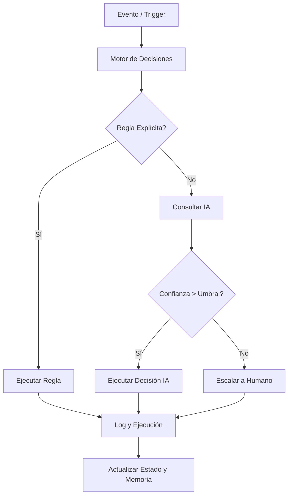
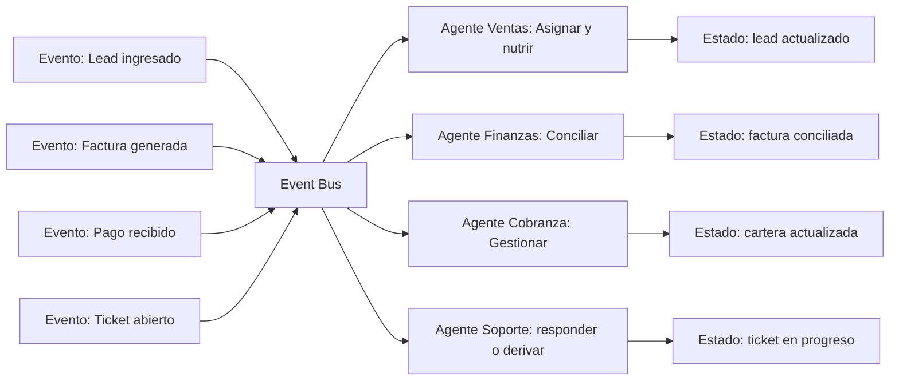
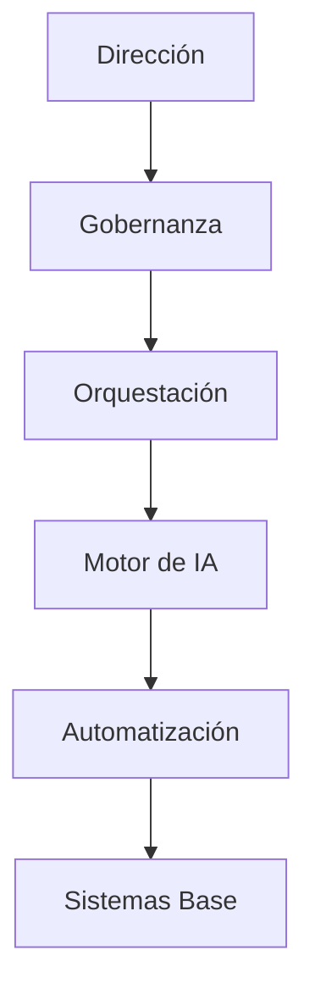

# MASTERCLASS: Estratega de Eficiencia Operativa con IA — Sistema Operativo e Implementación

> **Prerrequisito** — Esta guía asume conocimiento de los 5 archivos anteriores. Aquí integramos todo en un plan de acción ejecutable en la empresa real.

---

# MÓDULO 10: DISEÑO DE UN SISTEMA OPERATIVO EMPRESARIAL CON IA

## QUÉ ES UN SISTEMA OPERATIVO EMPRESARIAL (SOE)

Un Sistema Operativo Empresarial es la capa de inteligencia, automatización y gobernanza que coordina todos los procesos, agentes, datos y sistemas de la organización. No es un software específico: es una arquitectura viva que define cómo la empresa funciona cuando no hay humanos interviniendo en cada paso.

### Analogía: la empresa como sistema operativo

| Capa | SO de una computadora | SO Empresarial |
|------|----------------------|----------------|
| **Hardware / Recursos físicos** | CPU, memoria, disco | Empleados, oficinas, equipos |
| **Kernel / Núcleo** | Gestión de recursos y procesos | Gobernanza, políticas y reglas de negocio |
| **Sistema de archivos** | Almacenamiento y organización de datos | Datos estructurados, documentos, conocimiento |
| **Drivers / APIs** | Interfaces entre componentes | Integraciones entre sistemas |
| **Aplicaciones** | Programas que el usuario ejecuta | Agentes y workflows automatizados |
| **Interfaz de usuario** | Pantalla, teclado, mouse | Dashboards, alertas, bots conversacionales |

### Por qué la mayoría de las empresas no tienen un SOE

Las empresas crecen orgánicamente: se agregan procesos, contratos, empleados y herramientas sin coordinación central. El resultado es una arquitectura heredada (legacy) incoherente donde:

- Los datos están fragmentados en silos incompatibles
- Los procesos están desactualizados respecto a los sistemas reales
- El conocimiento es tácito (cabeza de empleados) no sistémico
- La coordinación entre departamentos depende de emails y reuniones
- La velocidad de cambio es más lenta que la del mercado

El Sistema Operativo Empresarial con IA resuelve esto creando una capa de coordinación viva, adaptativa y medible.

---

## ARQUITECTURA DEL SISTEMA OPERATIVO EMPRESARIAL

### Modelo en capas

```mermaid
flowchart TD
    subgraph "Capa 7: Dirección Estratégica"
        S1[Objetivos Trimestrales]
        S2[OKRs]
        S3[Decisiones Ejecutivas]
    end
    
    subgraph "Capa 6: Gobernanza y Cumplimiento"
        G1[Políticas de IA]
        G2[Matrices RACI]
        G3[Kill Switches]
        G4[Auditorías]
        G5[Seguridad y Compliance]
    end
    
    subgraph "Capa 5: Orquestación de Agentes"
        O1[Agente Coordinador]
        O2[Agentes Especializados por Área]
        O3[Memoria Compartida]
        O4[Colas de Eventos]
    end
    
    subgraph "Capa 4: Motor de IA"
        I1[LLMs Principales]
        I2[Modelos Especializados]
        I3[RAG / Bases Vectoriales]
        I4[APIs de IA]
    end
    
    subgraph "Capa 3: Automatización Inteligente"
        A1[Agentes de Procesos]
        A2[Bots Conversacionales]
        A3[Workflows Condicionales]
        A4[Detección de Anomalías]
    end
    
    subgraph "Capa 2: Automatización Tradicional"
        T1[RPA]
        T2[ETLs y Pipelines]
        T3[Scripts y APIs]
        T4[Triggers y Eventos]
    end
    
    subgraph "Capa 1: Datos y Sistemas Base"
        D1[CRM]
        D2[ERP]
        D3[Bases de Datos]
        D4[Herramientas Colaborativas]
        D5[Almacenamiento]
    end
    
    S1 --> S2 --> S3
    S3 --> G1 --> G2 --> G3 --> G4 --> G5
    G5 --> O1 --> O2 --> O3 --> O4
    O4 --> I1 --> I2 --> I3 --> I4
    I4 --> A1 --> A2 --> A3 --> A4
    A4 --> T1 --> T2 --> T3 --> T4
    T4 --> D1 --> D2 --> D3 --> D4 --> D5
```



### Criterios de madurez por capa

| Capa | Nivel 1 - Inicial | Nivel 2 - Desarrollo | Nivel 3 - Operativo | Nivel 4 - Optimizado |
|------|-------------------|----------------------|---------------------|----------------------|
| **Dirección estratégica** | Objetivos verbales | Objetivos documentados parcialmente | OKRs trimestrales con seguimiento | OKRs con agentes que reportan avance automáticamente |
| **Gobernanza** | Sin políticas | Políticas básicas escritas | Políticas implementadas con roles definidos | Auditorías automáticas y mejora continua |
| **Orquestación** | Agentes aislados | Agentes coordinados manualmente | Orquestación con LangGraph / n8n | Orquestación auto-optimizada |
| **Motor de IA** | Uso manual de ChatGPT | LLMs en workflows específicos | RAG + fine-tuning por dominio | Multi-modelo con routing inteligente |
| **Automatización inteligente** | Algunos workflows | Workflows principales automatizados | 80% de procesos core automatizados | Mejora continua automática |
| **Automatización tradicional** | Scripts sueltos | RPA en procesos críticos | Integraciones nativas mediante API | Event-driven architecture |
| **Datos y sistemas** | Datos en silos | Datos centralizados parcialmente | Data warehouse consolidado | Data lake con gobernanza y calidad |

---

## MARCO DE REFERENCIA: LAS 7 CAPAS DEL SOE

### Capa 1: Sistemas Base (Data Layer)

Responsabilidad: Garantizar que los datos estén disponibles, accesibles, íntegros y contextualizados.

| Activo | Descripción | Responsable | Métrica de salud |
|--------|-------------|-------------|------------------|
| **CRM** | Datos de clientes, leads, interacciones | Gerencia Comercial | % de leads con perfil completo > 90% |
| **ERP** | Transacciones, finanzas, inventario | Gerencia Financiera | Tasa de error en datos transaccionales < 0.1% |
| **Data Warehouse** | Datos históricos consolidados para análisis | Arquitecto de Datos | Freshness < 24 h |
| **Base de conocimiento** | Documentos, contratos, políticas, FAQ | Legal / Operaciones | Cobertura de dominios > 85% |
| **Logs y trazabilidad** | Registro de acciones de agentes y humanos | IT / Compliance | Retención 12 meses, inmutabilidad |
| **APIs expuestas** | Puntos de conexión entre sistemas | Arquitecto de Integración | Uptime > 99.5% |

### Capa 2: Automatización Tradicional (Process Layer)

Responsabilidad: Garantizar la ejecución confiable, rápida y sin errores de procesos predecibles.

| Activo | Descripción | Ejemplo |
|--------|-------------|---------|
| **RPA** | Robots que imitan acciones humanas en interfaces | Extraer datos de un portal web sin API |
| **ETLs** | Flujos de extracción, transformación y carga | Sincronizar datos entre Odoo y HubSpot |
| **Scripts** | Automatización personalizada de bajo nivel | Backup de base de datos, limpieza de registros |
| **Triggers** | Activación automática ante eventos | Cuando una factura se paga, actualizar CRM |
| **Workflows** | Flujos condicionales predefinidos | Aprobación de presupuestos por monto |

### Capa 3: Automatización Inteligente (Intelligence Layer)

Responsabilidad: Agregar razonamiento, clasificación, generación y adaptación a los procesos.

| Activo | Descripción | Ejemplo |
|--------|-------------|---------|
| **Agentes de proceso** | Ejecutan flujos completos con juicio | Agente de cobranza que maneja excepciones |
| **Bots conversacionales** | Interactúan con humanos en lenguaje natural | Chatbot de soporte nivel 1 |
| **Detección de anomalías** | Identifica desviaciones en tiempo real | Detectar fraude en transacciones |
| **Agentes de validación** | Verifican calidad de salidas de otros agentes | Supervisor de contenido generado |
| **Predicción y forecasting** | Anticipan eventos futuros | Predicción de demanda, churn, morosidad |

### Capa 4: Motor de IA (AI Core)

Responsabilidad: Proveer los modelos de inteligencia que alimentan la capa de automatización inteligente.

| Activo | Descripción | Uso típico |
|--------|-------------|------------|
| **LLMs principales** | GPT-4o, Claude Sonnet, Gemini | Razonamiento complejo, generación de texto |
| **Modelos embebidos** | Embeddings para búsqueda semántica | RAG, clustering, búsqueda de documentos |
| **Modelos especializados** | Fine-tuned para dominio específico | Análisis legal, médico, financiero |
| **Bases vectoriales** | Almacenamiento de embeddings para búsqueda | Memoria semántica de agentes |
| **APIs de IA** | Servicios externos de IA (vision, audio) | Análisis de imágenes, transcripción de audio |
| **Router de modelos** | Selecciona el modelo adecuado por tarea | LLM pequeño para tareas simples, grande para complejas |

### Capa 5: Orquestación de Agentes (Orchestration Layer)

Responsabilidad: Coordinar agentes, gestionar estados, manejar excepciones y garantizar consistencia.

| Activo | Descripción | Herramienta |
|--------|-------------|-------------|
| **Agente coordinador** | Asigna objetivos, delega, prioriza | LangGraph, CrewAI, n8n |
| **Memoria compartida** | Estado global accesible por todos los agentes | PostgreSQL, Redis, SQLite |
| **Cola de eventos** | Buffer de eventos para desacoplamiento | Redis, RabbitMQ, AWS SQS |
| **Gestión de estado** | Persistencia del contexto entre ejecuciones | Base de datos + embeddings |
| **Router de intención** | Clasifica solicitudes y las envía al agente correcto | LLM clasificador |
| **Scheduler** | Ejecuta agentes en momentos definidos | Cron, Apache Airflow, n8n schedule |

### Capa 6: Gobernanza y Seguridad (Governance Layer)

Responsabilidad: Definir límites, auditar, cumplir normativa y garantizar ética.

| Activo | Descripción | Ejemplo |
|--------|-------------|---------|
| **Políticas de IA** | Reglas de uso, límites, prohibiciones | "No aprobar créditos sin revisión humana > USD 50K" |
| **Matrices RACI** | Responsabilidades por proceso automatizado | R = Responsable, A = Aprueba, C = Consulta, I = Informa |
| **Auditorías automáticas** | Logs inmutables de cada decisión de agente | Cada envío de email registrado con justificación |
| **Kill switches** | Parada automática ante anomalías | Si el error rate sube > 5%, detener agente |
| **Seguridad** | Cifrado, accesos, segregación de entornos | OAuth, MFA, secrets en vault |
| **Cumplimiento** | Cumplimiento de normativas locales e internacionales | GDPR, ley de protección de datos |

### Capa 7: Dirección Estratégica (Strategy Layer)

Responsabilidad: Alinear la operación automatizada con los objetivos del negocio.

| Activo | Descripción | Frecuencia de actualización |
|--------|-------------|------------------------------|
| **Objetivos estratégicos** | Metas de alto nivel de la empresa | Anual |
| **OKRs por área** | Objetivos y Key Results medibles | Trimestral |
| **KPIs de sistema** | Métricas de salud del SOE | Diaria / Semanal |
| **Comité de IA** | Espacio de revisión de proyectos y riesgos | Quincenal |
| **Roadmap de evolución** | Plan de mejora y expansión del SOE | Trimestral |

---

## COMPONENTES FUNCIONALES DEL SOE

### 1. Motor de Decisiones

El motor de decisiones es el "cerebro ejecutivo" del SOE. No toma decisiones estratégicas (eso es el director), pero ejecuta decisiones operativas dentro del marco definido.



**Componentes del motor:**
1. **Registro de reglas explícitas:** "Si el monto > USD 10,000, requiere aprobación humana"
2. **Modelo de scoring:** Puntuación probabilística para decisiones no determinísticas
3. **Punto de escalación:** Umbrales que determinan cuándo un humano debe intervenir
4. **Motor de log:** Registro inmutable de cada decisión para auditoría

### 2. Sistema de Memoria Empresarial

La memoria permite que el SOE aprenda de la experiencia pasada y mejore con el tiempo.

| Tipo de memoria | Almacenamiento | Ejemplo empresarial | Retención |
|-----------------|----------------|---------------------|-----------|
| **Memoria operativa** | Base de datos relacional | "El cliente X tiene 3 facturas vencidas" | 12 meses |
| **Memoria episódica** | Base de datos vectorial | "La última vez que este proveedor tuvo un problema fue en..." | Permanente |
| **Memoria semántica** | RAG + documentos | Políticas, contratos tipo, respuestas aprobadas | Actualización continua |
| **Memoria de lecciones** | Documento estructurado | "Cuando la demanda sube 30%, el lead time aumenta en 4 días" | Permanente |

### 3. Gestión de Eventos y Estado

Los eventos son el registro de cambios en la empresa. Cada evento es una oportunidad para que un agente actúe.



### 4. Dashboard Integrado (Visibilidad Total)

El dashboard es la interfaz humana con el SOE. No es un reporte estático; es un sistema vivo que muestra el estado de cada componente.

| Sección | Métricas clave | Frecuencia de actualización | Responsable de revisión |
|---------|----------------|-----------------------------|-------------------------|
| **Salud del sistema** | Uptime, latencia, errores, eventos por minuto | Tiempo real | IT / Arquitecto |
| **Procesos automatizados** | Ejecuciones exitosas, fallidas, en cola | Tiempo real | Gerencia respectiva |
| **Agentes activos** | Estado, carga, excepciones, tiempo de respuesta | Tiempo real | Coordinador de agentes |
| **KPIs de negocio** | Ingresos, costos, leads, clientes, NPS | Diario | Director general |
| **Alertas críticas** | Eventos que requieren intervención humana | Tiempo real | Todos los involucrados |
| **Mejora continua** | Sugerencias de optimización, tendencias | Semanal | Estratega de IA |

---

## GOBERNANZA: CÓMO CONTROLAR LO INCONTROLABLE

La gobernanza es lo que separa un proyecto experimental de una operación empresarial sostenible. Sin gobernanza, los agentes autónomos pueden tomar decisiones costosas, éticamente cuestionables o ilegales.

### Principios de gobernanza

#### 1. Principio de intervención humana mínima pero significativa

Define exactamente en qué puntos un humano debe intervenir. No es "todo supervisado" ni "todo automático". Es un gradiente explícito:

| Nivel | Tipo de decisión | Intervención humana | Ejemplo |
|-------|------------------|---------------------|---------|
| **0** | Estratégica | Siempre | Cierre de la empresa, fusiones |
| **1** | Crítica financiera | Siempre | Inversiones > 5% del EBITDA |
| **2** | Operativa sensible | Por excepción | Aprobación de crédito > umbral |
| **3** | Operativa rutinaria | Por desviación | Generación de facturas, cobranza estándar |
| **4** | Transaccional | Solo monitoreo | Conciliación automática, backup |
| **5** | Registro | Ninguna | Logs, auditoría, métricas |

#### 2. Matriz RACI por proceso automatizado

La matriz RACI define quién es Responsible, Accountable, Consulted e Informed por cada proceso automatizado.

| Proceso | Líder de área | Equipo técnico | Proveedor IA | Compliance | Director general |
|---------|---------------|----------------|--------------|------------|------------------|
| Scoring de leads | R | C | C | I | A |
| Generación de propuestas | R | C | C | I | I |
| Aprobación de crédito | A | C | R | C | I |
| Facturación automática | R | A | C | I | I |
| Gestión de cobranza | R | C | C | I | A |
| Atención al cliente | R | R | C | C | I |
| Reportes ejecutivos | A | C | R | I | R |

Interpretación: R = Responsible (ejecuta), A = Accountable (responde), C = Consulted (consultado), I = Informed (informado).

#### 3. Kill Switches y Circuit Breakers

Un kill switch es un mecanismo de parada automática que se activa cuando el sistema se desvía de parámetros seguros.

| Tipo | Trigger | Acción | Restauración |
|------|---------|--------|--------------|
| **Error rate** | Tasa de errores > X% | Detener agentes afectados | Investigación + reinstalación manual |
| **Latencia** | Tiempo de respuesta > Y ms | Degradar a modo simple | Auto al normalizar latencia |
| **Costo** | Costo de API diario > presupuesto | Detener o limitar | Revisión presupuestaria |
| **Comportamiento atípico** | Desviación estadística en métricas | Congelar y alertar | Revisión humana obligatoria |
| **Denegación de servicio** | APIs externas caídas | Modo offline o espera | Auto al recuperar APIs |

---

## SEGURIDAD Y CUMPLIMIENTO

Los sistemas operados por IA manejan datos sensibles: información financiera, datos personales de clientes, secretos comerciales, estrategias de negocio.

### Clasificación de datos

| Nivel | Descripción | Ejemplo | Tratamiento |
|-------|-------------|---------|-------------|
| **Público** | Información sin restricciones | Página web, catálogo | Sin restricciones |
| **Interno** | Información para empleados | Políticas, procedimientos | Acceso autenticado |
| **Confidencial** | Información sensible | Contratos, datos de clientes | Encriptación, acceso mínimo |
| **Restringido** | Información crítica | Datos financieros, propiedad intelectual | MFA, segregación de funciones, logs |

### Checklist de seguridad

| Check | Estado |
|-------|--------|
| Todos los datos en tránsito están cifrados (TLS 1.3+) | ☐ |
| Todos los datos en reposo están cifrados (AES-256) | ☐ |
| Las credenciales se almacenan en un vault (no en código) | ☐ |
| Los accesos usan MFA obligatorio | ☐ |
| Existe un plan de respuesta a brechas de seguridad | ☐ |
| Los logs son inmutables y almacenados por 12 meses mínimo | ☐ |
| Las APIs tienen rate limiting y autenticación | ☐ |
| Se realizan pruebas de penetración periódicas | ☐ |
| Los entornos de desarrollo, staging y producción están separados | ☐ |
| Se cumplen normativas locales (GDPR, LFPDPPP, etc.) | ☐ |

---

# MÓDULO 11: IMPLEMENTACIÓN PASO A PASO

## EL VIAJE HASTA LA TRANSFORMACIÓN

Ninguna empresa se transforma de la noche a la mañana. El cambio organizacional con IA sigue curvas predecibles que el estratega debe anticipar y gestionar.

### Curva de adopción de IA

```mermaid
flowchart LR
    A[Inocencia: "IA es solo un chatbot que escribe emails"] --> B[Frustración: "No funciona como esperaba"]
    B --> C[Curiosidad: "¿Qué más se puede hacer?"]
    C --> D[Desarrollo: "Estamos construyendo nuestra primera arquitectura"]
    D --> E[Integración: "Los agentes y workflows funcionan juntos"]
    E --> F[Optimización: "Medimos, mejoramos y escalamos"]
    F --> G[Nativa: "La IA es cómo hacemos las cosas aquí"]
```

### Expectativas realistas por trimestre

| Hito | Mes 1 | Mes 3 | Mes 6 | Mes 12 |
|-------|--------|-------|-------|--------|
| **Conciencia** | Liderazgo entiende el potencial | Equipos clave entrenados | Toda la empresa | Visibles resultados |
| **Diagnóstico** | Procesos mapeados | Quick wins seleccionados | Quick wins implementados | Procesos core automatizados |
| **Pilotos** | Primer piloto en marcha | 2-3 pilots evaluados | Pilotos exitosos escalados | Arquitectura en producción |
| **Agentes** | Primer agente asistente | 2-3 agentes ejecutores | Coordinador operativo | Multiagente funcionando |
| **ROI** | Visibilidad en ahorros | Quick wins mostrando ROI | Proyectos estratégicos madurando | ROI > 200% en iniciativas |
| **Cultura** | Resistencia inicial | Primeros conversos | Normalización | IA-first mindset |

---

## DIAGNÓSTICO INICIAL: DÓNDE ESTAMOS

Antes de invertir, entiende el punto de partida.

### Evaluación de madurez digital

| Dimensión | Pregunta clave | Puntaje (1-5) |
|-----------|---------------|---------------|
| **Documentación de procesos** | ¿Los procesos clave están documentados y actualizados? | |
| **Calidad de datos** | ¿Los datos son limpios, accesibles y confiables? | |
| **Infraestructura digital** | ¿Los sistemas están integrados o en silos? | |
| **Capacidad técnica** | ¿El equipo interno tiene skills de automatización? | |
| **Cultura de innovación** | ¿La empresa experimenta regularmente con nuevas tecnologías? | |
| **Patrocinio ejecutivo** | ¿La dirección apoya activamente la transformación? | |
| **Gestión del cambio** | ¿La empresa tiene experiencia gestionando transformaciones? | |
| **Cultura de datos** | ¿Las decisiones se toman con datos o con intuición? | |
| **Madurez en IA** | ¿La empresa ya usa IA en alguna área? | |
| **Resiliencia operativa** | ¿La empresa mantiene operaciones en crisis? | |

**Total:** ___ / 50
- **< 15:** Etapa inicial. Enfócate en digitalización básica.
- **15-30:** Etapa de adopción. Puedes automatizar procesos repetitivos.
- **30-40:** Etapa de transformación. Arquitectura de agentes es viable.
- **> 40:** Etapa de optimización. Puedes experimentar con orquestación avanzada.

### Análisis FODA para IA

| Fortalezas (S) | Debilidades (W) |
|----------------|-----------------|
| ¿Qué hacemos bien? ¿Tenemos datos valiosos? ¿Equipo capacitado? | ¿Qué nos falta? ¿Sistemas legacy? ¿Resistencia al cambio? |
| **Oportunidades (O)** | **Amenazas (T)** |
| ¿Qué oportunidades ofrece el mercado? ¿Competencia desprevenida? | ¿Qué riesgos existen? ¿Regulación? ¿Presión de costos? |

### Estrategia derivada:

| Fuerza/Oportunidad | Fortaleza/Amenaza | Debilidad/Oportunidad | Debilidad/Amenaza |
|--------------------|-------------------|----------------------|-------------------|
| Usar fortalezas para capturar oportunidades | Mitigar amenazas con fortalezas | Superar debilidades aprovechando oportunidades | Minimizar impacto de amenazas sobre debilidades |

---

## PRIORIZACIÓN: QUICK WINS, PROYECTOS ESTRATÉGICOS, INVESTIGACIÓN

### Matriz de priorización

| Impacto de negocio \ Viabilidad técnica | Alta viabilidad | Viabilidad media | Baja viabilidad |
|----------------------------------------|-----------------|-------------------|----------------|
| **Alto impacto** | **Prioridad 1: Quick wins** | **Prioridad 2: Proyectos estratégicos** | Investigación y mejora de viabilidad |
| **Medio impacto** | **Prioridad 3: Proyectos estándar** | **Prioridad 4: Planificar** | Postergar |
| **Bajo impacto** | Postergar | Postergar | Descartar |

### Criterios de priorización

| Criterio | Peso | Justificación |
|----------|------|---------------|
| **Ahorro de tiempo** | 25% | Facilita ver resultados rápidos |
| **Reducción de costo** | 20% | Impacto directo en P&L |
| **Mejora en calidad** | 15% | Reduce retrabajo y aumenta satisfacción |
| **Facilidad de implementación** | 20% | Determina velocidad de despliegue |
| **Alineación estratégica** | 20% | Asegura que contribuye a objetivos de negocio |

---

## HOJA DE RUTA: 30 DÍAS, 90 DÍAS, 180 DÍAS, 12 MESES

### PRIMEROS 30 DÍAS: FUNDAMENTOS Y QUICK WINS

**Objetivo:** Establecer bases, generar credibilidad y demostrar valor.

| Día | Actividad | Responsable | Entregable |
|-----|-----------|-------------|------------|
| 1-3 | Diagnóstico de madurez y FODA | Estratega de IA + C-level | Informe de línea base |
| 4-7 | Selección de quick wins (3-5 iniciativas) | Estratega + sponsors | Lista priorizada |
| 8-10 | Diseño detallado de Quick Win 1 | Equipo técnico | Especificación funcional |
| 11-14 | Desarrollo del piloto | Equipo técnico | MVP funcional |
| 15-17 | Pruebas con usuarios reales | Usuarios piloto | Feedback documentado |
| 18-20 | Ajustes y optimización | Equipo técnico | Versión mejorada |
| 21-24 | Rollout inicial (20% del volumen) | Equipo técnico + sponsor | En producción parcial |
| 25-27 | Medición de resultados iniciales | Analista | Métricas vs línea base |
| 28-30 | Presentación de resultados a dirección | Estratega de IA | Presentación ejecutiva |

**Entregables al mes 1:**
- [ ] Evaluación de madurez completada
- [ ] 3 quick wins implementados y medidos
- [ ] Presentación de ROI inicial a la dirección
- [ ] Plan de comunicación interna lanzado
- [ ] Patrocinio ejecutivo asegurado para siguiente fase

### PRIMEROS 90 DÍAS: ESCALAMIENTO Y ARQUITECTURA

**Objetivo:** Ampliar quick wins, construir arquitectura base y cambiar mentalidad organizacional.

| Semana | Actividad | Entregable |
|--------|-----------|------------|
| 5-6 | Diseño de arquitectura de datos | Diagrama de integraciones |
| 7-8 | Implementación de data warehouse o datalake | Datos consolidados desde 3+ fuentes |
| 9-10 | Desarrollo de agente ejecutor #1 | Agente con herramientas, memoria y monitoreo |
| 11-12 | Implementación de segundo agente | Segundo agente operativo |
| 13-14 | Diseño de dashboard integrado | Dashboard mostrando KPIs de negocio |
| 15-16 | Capacitación masiva del equipo | 80% del equipo capacitado en conceptos de IA |
| 17-18 | Segundo ciclo de quick wins | 3-5 nuevos quick wins en producción |
| 19-20 | Medición y documentación de lecciones | Informe de aprendizajes y mejores prácticas |
| 21-22 | Diseño de gobernanza básica | Políticas de IA aprobadas |
| 23-24 | Revisión ejecutiva | Presentación a directorio / comité |

**Entregables al mes 3:**
- [ ] Arquitectura de datos operativa (CRM, ERP, warehouse integrados)
- [ ] 2-3 agentes ejecutores en producción
- [ ] Dashboard de monitoreo operativo activo
- [ ] Políticas de IA aprobadas
- [ ] Caso de negocio documentado para etapa 2

### PRIMEROS 180 DÍAS: ORQUESTACIÓN Y CULTURA

**Objetivo:** Pasar de agentes aislados a sistema coordinado, y de quick wins a transformación.

| Mes | Actividad | Entregable |
|-----|-----------|------------|
| 4 | Diseño de arquitectura multiagente | Diagrama de orquestación |
| 5 | Implementación de agente coordinador | Agente orquestando 3+ agentes |
| 6 | Integración completa de sistemas | APIs nativas conectadas, sin importaciones manuales |
| 7 | Implementación de supervisión automática | Agente supervisor monitoreando calidad |
| 8 | Programa de training avanzado | Equipo técnico interno capacitado |
| 9 | Primer proyecto estratégico | Proceso core automatizado con agentes |
| 10 | Optimización de rendimiento | Mejora de 20%+ en agentes existentes |
| 11 | Comité de IA formal | Reuniones regulares con métricas y roadmap |
| 12 | Presentación de resultados a 6 meses | ROI documentado, próximo roadmap |

**Entregables al mes 6:**
- [ ] Orquestación multiagente funcionando
- [ ] Integraciones nativas entre sistemas principales
- [ ] Primer proyecto estratégico en producción
- [ ] Equipo técnico interno capaz de desarrollar y mantener
- [ ] Cultura de mejora continua establecida

### PRIMEROS 12 MESES: OPTIMIZACIÓN Y ESCALAMIENTO

**Objetivo:** Consolidar el SOE, escalar a todas las áreas y dejar de ser un proyecto para ser la forma de operar.

| Mes | Actividad | Entregable |
|-----|-----------|------------|
| 7-8 | Auditoría integral del sistema | Informe de brechas y oportunidades |
| 9-10 | Plan de expansión a nuevas áreas | Diseño de agentes para áreas no cubiertas |
| 11-12 | Implementación de nuevos agentes | Cobertura de 80% de procesos repetitivos |
| 13-14 | Optimización basada en datos | Mejoras del 30%+ basadas en métricas |
| 15-16 | Capacitación a toda la organización | Formación IA básica para 100% del personal |
| 17-18 | Autogestión del equipo interno | Equipo opera sin dependencia del proveedor inicial |
| 19-20 | Innovación y nuevos modelos | Al menos 1 nueva línea de negocio habilitada por IA |
| 21-22 | Benchmarking externo | Comparativa con industria y best practices |
| 23-24 | Plan de roadmap siguiente año | Visión 2027+ |

**Entregables al mes 12:**
- [ ] SOE operativo en producción
- [ ] Cobertura de procesos core y back office
- [ ] ROI positivo demostrado en todos los proyectos
- [ ] Equipo interna operando sin dependencia crítica
- [ ] Cultura IA-first establecida

---

## GESTIÓN DEL CAMBIO: LA PARTE MÁS DIFÍCIL

### La curva del cambio

Todo proyecto de IA genera resistencia. Entenderla y gestionarla es tan importante como la tecnología.

```
Fases del cambio:
1. Shock / Negación - "Esto no es para nosotros"
2. Resistencia - "No va a funcionar", "Es muy complicado"
3. Exploración - "¿Cómo funciona realmente?"
4. Aceptación - "Tiene sentido para mi área"
5. Adopción - "Lo estoy usando diariamente"
6. Internalización - "No puedo trabajar sin esto"
```

### Estrategias de gestión del cambio

| Estrategia | Descripción | Ejemplo práctico |
|------------|-------------|------------------|
| **Visión compartida** | Comunicar por qué, no solo cómo | Presentación del director general sobre el futuro de la empresa |
| **Quick wins públicos** | Mostrar resultados tempranos | Reporte automático que ahorró 20 horas/semana a Ventas |
| **Participación temprana** | Involucrar a empleados en el diseño | Taller de "dibuja tu agente ideal" con equipos |
| **Capacitación práctica** | No teoría, sino aprendizaje haciendo | Curso de 4 horas donde cada persona diseña un agente para su proceso |
| **Identificar y cultivar campeones** | Buscar early adopters entusiastas | El analista financiero que abraza el agente de reportes y lo promueve |
| **Rediseñar roles, no eliminarlos** | Mostrar cómo los empleados evolucionan | De "hacer reportes" a "diseñar y mejorar el agente de reportes" |
| **Comunicación continua** | Actualizaciones regulares sobre progreso | Newsletter mensual del programa de IA |
| **Medir la adopción** | Cuantificar quién usa qué y por qué | Dashboard de adopción por área y rol |

### Manejo de resistencia

| Tipo de resistencia | Síntoma | Acción correcta |
|---------------------|---------|-----------------|
| **Resistencia informada** | "No entiendo cómo funciona" | Capacitación, demo, prueba piloto |
| **Resistencia emocional** | "Tengo miedo de que me reemplacen" | Comunicación clara: se transforman roles, no se eliminan |
| **Resistencia racional** | "Esto no va a funcionar para nuestro negocio" | Evidencia, casos de estudio, piloto controlado |
| **Resistencia por intereses** | "Esto me quita poder" | Inclusión en el diseño, nuevo rol ampliado |
| **Resistencia pasiva** | No participa, no opina, no usa | Liderazgo por ejemplo, accountability por rol |

---

## EJERCICIO 10.1: DISEÑO DE TU SISTEMA OPERATIVO

### Instrucciones
Diseña el Sistema Operativo Empresarial para tu organización.

**Paso 1:** Completa la evaluación de madurez (puntaje 1-5 por dimensión).

**Paso 2:** Dibuja la arquitectura de tu SOE actual en Mermaid.



**Paso 3:** Identifica las brechas entre tu arquitectura actual y la arquitectura objetivo de 7 capas.

| Capa | Estado actual | Estado objetivo | Brecha | Prioridad |
|------|---------------|-----------------|--------|-----------|
| Dirección estratégica | | | | |
| Gobernanza | | | | |
| Orquestación | | | | |
| Motor de IA | | | | |
| Automatización inteligente | | | | |
| Automatización tradicional | | | | |
| Datos y sistemas base | | | | |

**Paso 4:** Define 3 quick wins y 2 proyectos estratégicos para los primeros 6 meses.

---

## EJERCICIO 10.2: MATRIZ DE GOBERNANZA

### Contexto
Tu empresa va a implementar un agente de aprobación de crédito.

**Tarea:** Completa la matriz RACI para este proceso y define los límites de autonomía.

| Actor | Responsable | Aprueba | Consultado | Informado | Límite de autonomía |
|-------|-------------|---------|------------|-----------|---------------------|
| Agente IA | | | | | |
| Jefe de Créditos | | | | | |
| Compliance | | | | | |
| Director Financiero | | | | | |
| Director General | | | | | |

**Reglas de autonomía sugeridas:**
- El agente aprueba automáticamente créditos < USD 5,000 con score > 700
- El agente rechaza automáticamente créditos con score < 500
- El agente deriva a humano los créditos entre USD 5,000 y USD 50,000
- Los créditos > USD 50,000 requieren comité de crédito

---

## EJERCICIO 10.3: PLAN DE IMPLEMENTACIÓN 90 DÍAS

### Contexto
Eres el Estratega de Eficiencia Operativa de una PyME de servicios de 25 empleados con facturación USD 2M/año.

**Tarea:** Crea un plan de implementación de 90 días con:

1. Fase de diagnóstico (2 semanas)
2. Selección de 3 quick wins
3. Arquitectura de datos mínima viable
4. Primer agente en producción
5. Medición de resultados
6. Presentación a dirección

| Fase | Duración | Hitos | Entregables |
|------|----------|-------|-------------|
| Diagnóstico | | | |
| Quick Wins | | | |
| Arquitectura | | | |
| Primer Agente | | | |
| Medición | | | |
| Presentación | | | |

---

## PROMPTS PARA IMPLEMENTACIÓN

### Prompt de diseño de arquitectura empresarial

```text
Actúa como arquitecto de sistemas empresariales especializado en IA.

Empresa:
- Sector: {servicios / industrial / retail / otros}
- Tamaño: {empleados}
- Sistemas actuales: {lista}
- Procesos a automatizar: {lista priorizada}
- Presupuesto disponible: {USD}

Diseña un Sistema Operativo Empresarial completo que incluya:
1. Arquitectura en capas (7 capas) con Mermaid diagram
2. Inventario de sistemas actuales y su rol en la nueva arquitectura
3. Plan de integraciones prioritarias (primeras 5 APIs)
4. Especificación del agente coordinador (herramientas, memoria, límites)
5. Políticas de seguridad y gobernanza necesarias
6. Plan de migración de datos (fuentes, limpieza, transformación)
7. Roadmap de implementación por fases
8. Equipo humano necesario por fase
9. Estimación de costos y ROI proyectado a 12 meses
10. Riesgos principales y matrices de mitigación

Formato: documento ejecutivo de máximo 12 páginas con diagramas y tablas.
```

### Prompt de diseño de roadmap de implementación

```text
Actúa como consultor de transformación digital especializado en IA.

Contexto:
- Etapa actual de madurez IA: {inicial / intermedia / avanzada}
- Objetivos del próximo año: {lista}
- Recursos disponibles: {equipo humano, presupuesto, herramientas}
- Restricciones: {tiempo, compliance, legacy}

Genera un roadmap de implementación de IA para 12 meses que incluya:
1. Hitos trimestrales y mensuales
2. Proyectos por trimestre (quick wins primero, estratégicos después)
3. Hitos de medición (qué medir, cuándo, cómo)
4. Dependencias entre proyectos (qué debe terminar antes de qué)
5. Hitos de cambio cultural (capacitaciones, comunicaciones)
6. Hitos de arquitectura (infraestructura, datos, integraciones)
7. Hitos de gobernanza (políticas, compliance, auditorías)
8. Riesgos por trimestre y planes de contingencia
9. Presupuesto por fase
10. Comité de seguimiento recomendado

Incluye diagrama Gantt simplificado en Mermaid o tabla por meses.
```

---

## ERRORES COMUNES EN IMPLEMENTACIÓN

| Error | Síntoma | Consecuencia | Antídoto |
|--------|---------|--------------|----------|
| **Comenzar por la herramienta** | Comprar licencias antes de definir necesidades | Herramientas infrautilizadas, costo sin retorno | Definir SOE primero, herramientas después |
| **Falta de patrocinio ejecutivo** | El proyecto pierde prioridad en la segunda semana | Detención por falta de recursos | Presentar caso de negocio a C-level antes de iniciar |
| **Plan rígido sin iteración** | Roadmap anual inmutable | Proyecto desactualizado en 3 meses | Planificación trimestral con ciclos de aprendizaje |
| **Capacitación teórica** | Cursos genéricos sin aplicación práctica | Equipo no sabe usar las herramientas | Training by doing: cada persona construye algo real |
| **Ignorar la limpieza de datos** | Agentes aprendiendo de datos sucios | Resultados impredecibles | Dedicar 30% del tiempo a preparación de datos |
| **Medir solo outputs, no outcomes** | "Tengo 10 agentes funcionando" sin medir valor | Proyecto sin demostración de ROI | Vincular cada agente a KPIs de negocio |
| **Delegar al equipo equivocado** | Proyecto manejado solo por TI | Desalineamiento con negocio | Equipo multifuncional: negocio + IT + datos |
| **Expectativas irreales** | "En 3 meses tendremos IA completa" | Desilusión, cancelación del programa | Modelado de curva de adopción, comunicación expectativa |

---

## CHECKLIST: LISTO PARA IMPLEMENTACIÓN

### Antes de iniciar

| Check | Estado |
|-------|--------|
| La dirección ejecutiva ha aprobado un presupuesto y un sponsor | ☐ |
| Existe un equipo multifuncional asignado (negocio, IT, datos) | ☐ |
| Los objetivos del programa están alineados con OKRs trimestrales | ☐ |
| Se ha medido la línea base de KPIs de al menos 3 procesos | ☐ |
| Los líderes de área han aceptado participar | ☐ |
| Se ha designado un Estratega de Eficiencia Operativa | ☐ |

### Durante la implementación

| Check | Estado |
|-------|--------|
| Los quick wins están seleccionados y en ejecución | ☐ |
| El equipo recibe capacitación práctica semanal | ☐ |
| Los KPIs se miden y reportan semanalmente | ☐ |
| Los usuarios participan en el diseño de sus agentes | ☐ |
| Las políticas de IA están aprobadas | ☐ |
| El dashboard de monitoreo está activo | ☐ |

### Después de implementar

| Check | Estado |
|-------|--------|
| Cada proyecto tiene un informe de lecciones aprendidas | ☐ |
| Los ahorros y beneficios están cuantificados y documentados | ☐ |
| Los equipos están capacitados para operar sin dependencia | ☐ |
| El plan de mantenimiento y mejora continua está establecido | ☐ |
| El roadmap siguiente está definido | ☐ |

---

## RESUMEN EJECUTIVO

Este sexto archivo de la master class proporciona el plan de acción para convertir la estrategia en realidad operativa:

1. **El Sistema Operativo Empresarial con IA** es una arquitectura de 7 capas que transforma la empresa en un organismo coordinado, medible y adaptable.
2. **La arquitectura no es opcional.** Sin definir capas, límites y responsabilidades, los agentes y workflows son herramientas aisladas sin impacto sistémico.
3. **La gobernanza es la diferencia entre innovación y riesgo.** Los kill switches, matrices RACI, políticas de IA y auditorías son tan importantes como los modelos de IA.
4. **El plan de implementación es trimestral, no anual.** Cada 3 meses debe haber resultados tangibles que justifiquen la inversión siguiente.
5. **La gestión del cambio es más importante que la tecnología.** Sin cambios culturales y de roles, la adopción será superficial.
6. **El viaje tiene curvas predecibles.** Entender las fases de shock, resistencia, exploración y adopción ayuda a gestionar expectativas.

**Próximo paso:** Casos reales por industria, comparativa de herramientas y frameworks de consultoría en `ia-casos-estudio-herramientas.md` (Módulos 12, 13 y 14).