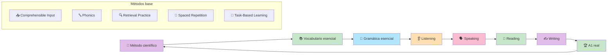

# Masterclass: Inglés A1 - De cero a comunicarte en situaciones básicas 🧑‍🎓🇬🇧

> **La premisa central de esta guía** — El nivel A1 no es "saber algunas palabras": es la capacidad de comunicarte en situaciones cotidianas muy concretas. Esta guía combina los métodos científicos más efectivos (comprehensible input, phonics, retrieval practice, spaced repetition y task-based learning) para que llegues a A1 en 12 semanas con un sistema probado.

## Antes de empezar: 🎯 ¿qué vas a poder hacer al terminar esta guía?

Al terminar de leer y **aplicar** esta guía vas a poder:

- Entender qué es el nivel A1 del CEFR y qué significa estar en él.
- Aplicar 5 métodos científicos probados para aprender inglés desde cero.
- Dominar las 300 palabras de alta frecuencia que cubren el 65% del inglés oral.
- Usar las estructuras gramaticales esenciales del A1 (presente simple, artículos, pronombres, preguntas).
- Comprender mensajes cortos y claros en listening y reading.
- Producir frases y párrafos cortos en speaking y writing.
- Seguir un plan de 12 semanas con ejercicios prácticos y medibles.

---

## MAPA DEL WORKFLOW 🔄



---

## PARTE 1 — 📐 El nivel A1: qué es y qué no es

El **Marco Común Europeo de Referencia (CEFR)** define el nivel A1 como:

> *"Capacidad de comprender y utilizar expresiones cotidianas básicas y frases sencillas orientadas a la satisfacción de necesidades de tipo inmediato."*

### Qué PODÉS hacer en A1 (según el CEFR)

- ✅ Entender preguntas y respuestas sencillas sobre información personal.
- ✅ Saludar, despedirse, presentarte y pedir información básica.
- ✅ Entender avisos, menús, horarios y mensajes muy cortos.
- ✅ Escribir notas, mensajes y formularios breves.
- ✅ Hablar de ti, tu familia, tu trabajo y tus gustos con frases cortas.

### Qué NO PODÉS hacer en A1 (y está bien)

- ❌ Sostener una conversación fluida sobre temas abstractos.
- ❌ Entender películas sin subtítulos.
- ❌ Escribir ensayos o emails complejos.
- ❌ Usar vocabulario avanzado o modismos.

### La métrica real del A1

| Habilidad | Lo que podés hacer | Ejemplo concreto |
|-----------|-------------------|------------------|
| Listening | Entender palabras aisladas y frases cortas lentas | Entender "The train leaves at 5 PM" |
| Reading | Leer avisos, menús y mensajes breves | Entender "No smoking" |
| Speaking | Decir frases memorizadas y responder con sí/no | "I like coffee. Do you like tea?" |
| Writing | Escribir notas y mensajes breves | "My name is Maria. I live in Buenos Aires." |

---

## PARTE 2 — 🔬 Los métodos científicos que usaremos

Esta guía no se basa en opiniones: se basa en evidencia. Estos son los métodos que usaremos, avalados por décadas de investigación en adquisición de segundas lenguas:

### Método 1: Comprehensible Input (Krashen, 1981) 📥

> **Principio:** aprendés cuando recibís input que está un poquito por encima de tu nivel actual (i+1), no cuando estás completamente perdido ni cuando es demasiado fácil.

**En la práctica:**
- Escuchás y leés contenido donde entendés entre el 70% y el 90%.
- El 10-30% restante son palabras/estructuras nuevas que tu cerebro captura por contexto.
- Si estás por debajo del 70%, el contenido es demasiado difícil.

### Método 2: Phonics / GraphoLearn (estudios 2024-2025) 🔤

> **Principio:** asociar sonidos (fonemas) con letras (grafemas) sistemáticamente mejora la decodificación y la lectura desde el nivel más básico.

**En la práctica:**
- Aprendés los sonidos básicos del inglés (short vowels, consonant sounds).
- Practicás blending: juntar sonidos para formar palabras (c-a-t → cat).
- Usás herramientas como GraphoLearn o ejercicios de phonics para automatizar la decodificación.

### Método 3: Retrieval Practice (Bjork & Bjork, 2011) 🔍

> **Principio:** intentar recordar sin ayuda es más efectivo que volver a leer o escuchar.

**En la práctica:**
- Después de aprender una palabra, cerrás el libro y intentás recordarla.
- Hacés flashcards donde el esfuerzo está en recordar, no en reconocer.
- Escribís frases sin mirar el vocabulario.

### Método 4: Spaced Repetition (Ebbinghaus, 1885) 📅

> **Principio:** repasar en intervalos crecientes genera retención a largo plazo mucho mayor que repasar todo en un solo día.

**En la práctica:**
- Repasás las palabras nuevas al día 1, día 3, día 7, día 14 y día 30.
- Usás apps como Anki o Quizlet que automatizan los intervalos.
- No repasás lo que ya sabés; enfocás el tiempo en lo que te cuesta.

### Método 5: Task-Based Learning (Ellis, 2020) 🎯

> **Principio:** aprendés mejor cuando completás una tarea real con el idioma, no cuando hacés ejercicios abstractos.

**En la práctica:**
- Tu "tarea" es real: pedir café, dar tu dirección, presentarte en una reunión.
- Primero escuchás/leés un ejemplo (input), después producís (output).
- El error es parte del proceso, no algo que hay que evitar.

---

## PARTE 3 — 📚 Vocabulario esencial A1: las 300 palabras que cubren el 65% del inglés oral

La investigación en frecuencia de palabras ( Ellis, 2002 ) muestra que las **300 palabras más frecuentes** del inglés cubren aproximadamente el **65%** del inglés oral cotidiano. Si las dominás, podés entender y participar en conversaciones básicas.

### Las 300 palabras organizadas por temas

#### 🟢 Tema 1: Pronombres y verbos básicos (30 palabras)

| Palabra | Tipo | Ejemplo de uso |
|---------|------|---------------|
| I | Pronombre | I am Juan. |
| you | Pronombre | You are tall. |
| he/she/it | Pronombres | He works here. |
| we/they | Pronombres | We like pizza. |
| be (am/is/are) | Verbo | I am happy. She is tired. |
| have/has | Verbo | I have a dog. |
| do/does | Verbo | Do you like tea? |
| can | Modal | I can swim. |
| want | Verbo | I want water. |
| like | Verbo | I like music. |
| need | Verbo | I need help. |
| go | Verbo | I go to work. |
| come | Verbo | Come here. |
| say | Verbo | Say hello. |
| see | Verbo | I see a cat. |
| know | Verbo | I know him. |
| think | Verbo | I think yes. |
| make | Verbo | Make coffee. |
| get | Verbo | Get the book. |
| give | Verbo | Give me the pen. |
| take | Verbo | Take this. |
| help | Verbo | Help me please. |
| love | Verbo | I love you. |
| eat | Verbo | Eat the apple. |
| drink | Verbo | Drink water. |
| work | Verbo | I work in an office. |
| study | Verbo | Study English. |
| live | Verbo | I live in Buenos Aires. |
| speak | Verbo | Speak slowly please. |
| understand | Verbo | I understand. |

#### 🟢 Tema 2: Números, días, meses (30 palabras)

| Categoría | Palabras |
|-----------|----------|
| Números 1-20 | one, two, three, four, five, six, seven, eight, nine, ten, eleven, twelve, thirteen, fourteen, fifteen, sixteen, seventeen, eighteen, nineteen, twenty |
| Días | Monday, Tuesday, Wednesday, Thursday, Friday, Saturday, Sunday |
| Meses | January, February, March, April, May, June, July, August, September, October, November, December |

#### 🟢 Tema 3: Colores, familia, alimentos (40 palabras)

| Categoría | Palabras |
|-----------|----------|
| Colores | red, blue, green, yellow, black, white, orange, pink, brown, purple |
| Familia | mother, father, brother, sister, son, daughter, family, husband, wife, baby |
| Alimentos | bread, water, milk, coffee, tea, rice, meat, chicken, fish, apple, banana, egg, cheese, sugar, salt |

#### 🟢 Tema 4: Lugares y direcciones (40 palabras)

| Categoría | Palabras |
|-----------|----------|
| Lugares | house, school, office, store, restaurant, park, hospital, airport, station, bathroom |
| Direcciones | left, right, straight, near, far, next to, between, in front of, behind, corner |

#### 🟢 Tema 5: Adjetivos básicos (40 palabras)

| Palabra | Ejemplo |
|---------|---------|
| big/small | The house is big. |
| hot/cold | It is hot today. |
| good/bad | Good morning! |
| happy/sad | I am happy. |
| new/old | This is new. |
| fast/slow | He runs fast. |
| easy/difficult | This is easy. |
| clean/dirty | The room is clean. |

#### 🟢 Tema 6: Preposiciones y conectores (30 palabras)

| Palabra | Ejemplo |
|---------|---------|
| in | In the house. |
| on | On the table. |
| at | At 5 PM. |
| to | Go to school. |
| from | From Argentina. |
| with | With my friend. |
| and | Bread and butter. |
| but | I like it, but... |
| or | Tea or coffee? |
| because | Because I am tired. |

#### 🟢 Tema 7: Preguntas y respuestas básicas (40 palabras)

| Pregunta | Respuesta |
|----------|-----------|
| What? | It is a book. |
| Where? | In the kitchen. |
| When? | At 5 PM. |
| Who? | My friend. |
| Why? | Because... |
| How? | Very well, thanks. |
| How much? | Ten dollars. |
| How many? | Three apples. |

#### 🟢 Tema 8: Verbos irregulares más comunes (30 palabras)

| Presente | Pasado | Ejemplo |
|----------|---------|---------|
| go | went | I went home. |
| see | saw | I saw a movie. |
| eat | ate | I ate pizza. |
| drink | drank | I drank coffee. |
| have | had | I had a good time. |
| be | was/were | I was tired. |
| do | did | I did my homework. |
| say | said | He said hello. |
| make | made | I made dinner. |
| come | came | He came late. |

> **💡 Tip:** no intentes memorizar las 300 palabras de memoria. Usá **retrieval practice**: después de aprender 10 palabras, cerrá el listado e intentá escribirlas de memoria. Ese esfuerzo es lo que las convierte en vocabulario activo.

---

## PARTE 4 — 📝 Gramática esencial A1

El A1 no requiere dominar toda la gramática inglesa, sino un conjunto mínimo de estructuras que te permiten comunicarte. Estas son las imprescindibles:

### 4.1 Presente simple 🕐

**Uso:** acciones habituales, verdades generales, estados permanentes.

**Estructura:**
```
Afirmativa: Subject + verbo (sin -s en I/you/we/they; con -s en he/she/it)
Negativa: Subject + don't/doesn't + verbo base
Interrogativa: Do/Does + subject + verbo base?
```

**Ejemplos:**
- I work in an office. / She works in a hospital.
- I don't like coffee. / He doesn't eat meat.
- Do you speak English? / Does she live here?

### 4.2 Artículos: a, an, the, y el artículo cero ⚪

**Regla básica:**
- **a/an** = algo desconocido o genérico (a book, an apple).
- **the** = algo específico o ya mencionado (the book on the table).
- **sin artículo** = conceptos generales, comidas, idiomas (I eat bread, I speak Spanish).

> **⚠️ Error común:** en español usas artículos todo el tiempo; en inglés muchos contextos no los llevan. Aprendé la regla del "artículo cero" desde el principio.

### 4.3 Pronombres personales y posesivos 👤

| Sujeto | Objeto | Posesivo | Posesivo absoluto |
|--------|--------|----------|------------------|
| I | me | my | mine |
| you | you | your | yours |
| he | him | his | his |
| she | her | her | hers |
| it | it | its | its |
| we | us | our | ours |
| they | them | their | theirs |

### 4.4 Preposiciones de lugar y tiempo 📍

**Lugar:**
- in (en una ciudad/país: in Buenos Aires)
- at (en un punto exacto: at the station)
- on (en una superficie: on the table)

**Tiempo:**
- at (at 5 PM, at night)
- in (in July, in 2025)
- on (on Monday, on the weekend)

### 4.5 Preguntas con wh- ❓

| Pregunta | Uso | Ejemplo |
|----------|-----|---------|
| What | ¿Qué? | What is your name? |
| Where | ¿Dónde? | Where do you live? |
| When | ¿Cuándo? | When is your birthday? |
| Who | ¿Quién? | Who is that? |
| Why | ¿Por qué? | Why are you late? |
| How | ¿Cómo? | How are you? |

### 4.6 Verbos modales básicos: can, must, should 🎯

| Modal | Uso | Ejemplo |
|-------|-----|---------|
| can | habilidad/permiso | I can swim. / Can I help you? |
| must | obligación fuerte | I must go now. |
| should | consejo/recomendación | You should study more. |

---

## PARTE 5 — 👂 Listening A1: cómo entrenar la comprensión auditiva

### El método: Input comprensible + repetición espaciada

#### Nivel 1: Palabras aisladas (Semanas 1-3)

**Objetivo:** reconocer los 300 vocablos esenciales cuando los escuchás.

**Ejercicio diario (10 minutos):**
1. Usá una app como **Duolingo** o **Memrise** con audio.
2. Escuchá la palabra, repetila en voz alta.
3. Si la reconocés, marcá "sé"; si no, escuchala 3 veces y repetila.
4. Hacé 20 palabras por día.

#### Nivel 2: Frases cortas (Semanas 4-6)

**Objetivo:** entender frases de 2-4 palabras en contexto.

**Ejercicio diario (15 minutos):**
1. Usá **podcasts para principiantes** (podcasts like "6 Minute English" o "ESL Pod" con nivel A1).
2. Escuchá un fragmento de 30 segundos.
3. Escribí lo que entendiste.
4. Volvé a escuchar con transcripción.
5. Identificá las palabras que no entendiste.

#### Nivel 3: Diálogos simples (Semanas 7-12)

**Objetivo:** entender conversaciones cortas entre dos personas.

**Ejercicio diario (20 minutos):**
1. Usá **videos de YouTube con subtítulos en inglés** (no en español).
2. Escuchá un diálogo de 1 minuto.
3. Primero sin subtítulos, anotá lo que entendiste.
4. Con subtítulos, compará.
5. Repetí el fragmento 2 veces más.

> **📊 Datos científicos:** un meta-análisis de 2023 (Webb) muestra que el **listening con reading simultaneously** (escuchar mientras leés) genera ganancias de vocabulario del 13-17% en tests inmediatos y demorados, similar a leer solo (17%, 15%) y escuchar solo (15%, 13%).

---

## PARTE 6 — 🗣️ Speaking A1: cómo producir desde el primer día

### El método: Output gradual + retroalimentación inmediata

En A1, no necesitás hablar fluido: necesitás producir frases cortas y ser entendido.

#### Nivel 1: Repetición (Semanas 1-3)

**Objetivo:** automatizar los sonidos del inglés.

**Ejercicio diario (5 minutos):**
1. Escuchá una frase corta (2-3 palabras).
2. Repetila en voz alta, copiando el tono y ritmo.
3. Grábate y compará con el original.
4. Repetí hasta que se parezca.

#### Nivel 2: Frases memorizadas (Semanas 4-6)

**Objetivo:** usar estructuras fijas sin pensar.

**Ejercicio diario (10 minutos):**
1. Memorizá 5 frases útiles por día:
   - "My name is..."
   - "I live in..."
   - "I like..."
   - "I don't like..."
   - "Can you help me?"
2. Practicá frente al espejo o grabándote.
3. Usá las frases en situaciones reales (si podés).

#### Nivel 3: Producción guiada (Semanas 7-12)

**Objetivo:** combinar frases para formar respuestas cortas.

**Ejercicio diario (15 minutos):**
1. Usá un **tutor de IA** (ChatGPT, Claude) para simular conversaciones simples.
2. Respondé las preguntas del tutor en voz alta.
3. El tutor te corrige la pronunciación y la gramática.
4. Repetí la respuesta corregida 2 veces.

**Ejemplo de diálogo:**
```
Tutor: What is your name?
Vos: My name is [tu nombre].
Tutor: Where do you live?
Vos: I live in [tu ciudad].
Tutor: What do you do?
Vos: I am a [tu profesión].
```

> **📊 Datos científicos:** un meta-análisis de 2020 (Alsowat) muestra que las **estrategias de aprendizaje** tienen el impacto más grande en **speaking** (d=0.90) de todas las habilidades. Esto significa que aprender a aprender (estrategias) es más efectivo para hablar que cualquier método específico.

---

## PARTE 7 — 📖 Reading A1: de palabras a textos breves

### El método: Comprehensible input + phonics + repetición espaciada

#### Nivel 1: Palabras y frases (Semanas 1-3)

**Objetivo:** reconocer las 300 palabras esenciales escritas.

**Ejercicio diario (10 minutos):**
1. Usá **flashcards con imágenes** (Anki, Quizlet).
2. Cada tarjeta tiene la imagen + la palabra en inglés.
3. Intentá leer la palabra antes de voltear la tarjeta.
4. Repasá las que te cuestan con más frecuencia (spaced repetition lo hace automáticamente).

#### Nivel 2: Frases y oraciones simples (Semanas 4-6)

**Objetivo:** leer oraciones de 3-5 palabras sin ayuda.

**Ejercicio diario (15 minutos):**
1. Usá **libros graded readers nivel A1** (Oxford Bookworms Starter, Penguin Easy Readers).
2. Leé 1 página por día.
3. Subrayá las palabras nuevas.
4. Escribí 1 frase resumen de lo que leíste.

#### Nivel 3: Textos breves (Semanas 7-12)

**Objetivo:** leer mensajes, avisos y emails cortos.

**Ejercicio diario (20 minutos):**
1. Leé **avisos, menús, horarios** reales en inglés (Google Maps en inglés, menús de restaurantes, carteles).
2. Escribí 3 cosas que entendiste.
3. Escribí 1 pregunta que te surgió.
4. Buscá la respuesta.

> **📊 Datos científicos:** un meta-análisis de 2023 (Webb) muestra que la **lectura** genera ganancias de vocabulario del 17% en tests inmediatos, la más alta de todos los modos de input. Además, el **spaced practice** (múltiples sesiones) tiene un efecto mayor que la práctica masiva en tests demorados.

---

## PARTE 8 — ✍️ Writing A1: de la frase al párrafo

### El método: Producción guiada + retroalimentación + repetición

#### Nivel 1: Frases aisladas (Semanas 1-3)

**Objetivo:** escribir oraciones correctas con el vocabulario aprendido.

**Ejercicio diario (10 minutos):**
1. Elegí 5 palabras de la lista de vocabulario.
2. Escribí 1 oración por palabra.
3. Usá un tutor de IA para corregir las oraciones.
4. Reescribí las oraciones corregidas.

#### Nivel 2: Párrafos cortos (Semanas 4-6)

**Objetivo:** escribir 3-5 oraciones sobre ti.

**Ejercicio diario (15 minutos):**
1. Escribí un párrafo sobre: tu familia, tu trabajo, tu comida favorita.
2. Usá las estructuras gramaticales del A1 (presente simple, artículos, preposiciones).
3. Pedí a un tutor de IA que te corrija.
4. Reescribí el párrafo corregido.

#### Nivel 3: Mensajes y notas (Semanas 7-12)

**Objetivo:** escribir mensajes breves y funcionales.

**Ejercicio diario (20 minutos):**
1. Escribí un mensaje para un amigo: qué hiciste el fin de semana.
2. Escribí un email corto para pedir información.
3. Escribí una nota para tu familia.
4. Pedí corrección y reescribí.

> **📊 Datos científicos:** un meta-análisis de 2020 (Alsowat) muestra que la **instrucción explícita** tiene el impacto más grande en **gramática** (d=1.26). Esto significa que aprender reglas explícitamente (artículos, preposiciones, orden de palabras) mejora más la escritura que solo practicar sin feedback.

---

## PARTE 9 — 📅 Plan de acción: 12 semanas para A1

### Semanas 1-3: Fundamentos

- [ ] 📚 Aprendé los sonidos básicos del inglés (phonics: short vowels, consonant sounds).
- [ ] 📝 Aprendé 100 palabras de alta frecuencia (temas: pronombres, verbos básicos, números).
- [ ] 📖 Leé 1 página de graded reader por día.
- [ ] 👂 Escuchá 10 minutos de podcasts para principiantes.
- [ ] 🗣️ Practicá repetición de frases cortas (5 min/día).

### Semanas 4-6: Expansión

- [ ] 📚 Aprendé 100 palabras nuevas (temas: familia, alimentos, lugares).
- [ ] 📝 Aprendé las estructuras gramaticales básicas (presente simple, artículos, preposiciones).
- [ ] 📖 Leé 2 páginas de graded reader por día.
- [ ] 👂 Escuchá 15 minutos de podcasts con transcripción.
- [ ] 🗣️ Practicá frases memorizadas y presentaciones cortas.
- [ ] ✍️ Escribí 5 oraciones por día con las palabras nuevas.

### Semanas 7-9: Integración

- [ ] 📚 Aprendé 100 palabras nuevas (temas: adjetivos, verbos irregulares, preguntas).
- [ ] 📝 Aprendé los modales básicos (can, must, should) y preguntas wh-.
- [ ] 📖 Leé avisos y mensajes breves en inglés real.
- [ ] 👂 Escuchá diálogos cortos sin subtítulos.
- [ ] 🗣️ Simulá conversaciones con un tutor de IA.
- [ ] ✍️ Escribí párrafos cortos sobre tu vida.

### Semanas 10-12: Consolidación

- [ ] 📚 Repasá las 300 palabras con spaced repetition.
- [ ] 📝 Repasá toda la gramática A1.
- [ ] 📖 Leé textos breves de nivel A1 (Cambridge English A1 reading).
- [ ] 👂 Hacé un listening test de A1 (Cambridge English A1 listening).
- [ ] 🗣️ Grabate hablando durante 2 minutos sobre tu vida.
- [ ] ✍️ Escribí un email corto a un amigo.
- [ ] 🏆 Hacé un test de A1 completo para medir tu progreso.

---

## PARTE 10 — ⚠️ Errores comunes al aprender A1

| Error | Por qué pasa | Solución |
|-------|--------------|----------|
| ❌ **Querer hablar fluido desde el día 1** | Expectativas irreales | En A1, el objetivo es ser entendido, no ser fluido. Las frases cortas son suficientes. |
| ❌ **Aprender gramática sin contexto** | La escuela nos enseñó reglas abstractas | Aprendé gramática en frases reales, no en tablas aisladas. |
| ❌ **Memorizar listas de palabras** | Parece más eficiente | Aprendé palabras en frases y contextos, no en listas. |
| ❌ **No practicar speaking por miedo** | Miedo al error | En A1, el error es normal. Hablá de todos modos. |
| ❌ **Cambiar de recurso constantemente** | Creemos que más = mejor | Quedate con 1 podcast, 1 app, 1 libro por semana. |
| ❌ **No repasar** | Estudiamos una vez y olvidamos | Usá spaced repetition: repasá al día 1, 3, 7, 14, 30. |

---

## PARTE 11 — 📚 Glosario de conceptos clave

- 📐 **CEFR A1:** nivel básico del Marco Común Europeo de Referencia. Capacidad de comunicarse en situaciones cotidianas muy concretas.
- 📥 **Comprehensible Input (Krashen):** input que está un poco por encima de tu nivel actual (i+1), no tan fácil que no aprendas, no tan difícil que te frustres.
- 🔤 **Phonics:** método de enseñanza que asocia sonidos (fonemas) con letras (grafemas) para mejorar la decodificación y lectura.
- 🔍 **Retrieval Practice:** intentar recordar información sin ayuda; más efectivo que volver a leer.
- 📅 **Spaced Repetition:** repasar información en intervalos crecientes para maximizar la retención a largo plazo.
- 🎯 **Task-Based Learning:** aprender completando tareas reales con el idioma, no haciendo ejercicios abstractos.
- 📦 **Vocabulario pasivo:** palabras que reconocés pero no usás.
- 🔧 **Vocabulario activo:** palabras que podés producir sin esfuerzo.
- 📊 **Frecuencia de palabras:** las palabras más comunes del inglés; las 300 más frecuentes cubren el 65% del inglés oral.
- 🗣️ **Fluidez (fluency):** capacidad de expresar ideas sin trabas excesivas, priorizando la comunicación.
- 🎧 **Listening:** comprensión auditiva.
- 📖 **Reading:** comprensión lectora.
- ✍️ **Writing:** producción escrita.
- 🗣️ **Speaking:** producción oral.

---

## PARTE 12 — 🧠 Resumen mental (para fijar el conocimiento)

Si tuvieras que recordar solo 3 ideas de esta masterclass:

1. 📐 **El A1 no es "saber palabras", es poder comunicarte.** Si podés pedir café, dar tu dirección y hablar de tu familia, estás en A1. No necesitás más.
2. 🔬 **Los métodos funcionan: input comprensible + retrieval + spaced repetition + task-based learning.** No inventes tu método; usá el que la ciencia respalda.
3. 📅 **12 semanas con un plan > estudiar sin rumbo.** 300 palabras + gramática esencial + 4 habilidades + un plan semanal = A1 real.

---

## PARTE 13 — 🌐 Recursos para profundizar

- 📖 Libro: *"Fluency Through TPR"* de Blaine Ray — metodología TPR para beginners.
- 📖 Libro: *"Teaching by Principles"* de H. Douglas Brown — fundamentos científicos de la enseñanza de idiomas.
- 🎧 Podcast: *"6 Minute English"* (BBC) — listening A1-A2 con transcripción.
- 🎧 Podcast: *"ESL Pod"* — listening lento para principiantes.
- 📱 App: **Anki** o **Quizlet** — spaced repetition para vocabulario.
- 📱 App: **Duolingo** — práctica diaria gamificada (estudios 2025 confirman efectividad en A1-A2 con gamificación CEFR-aligned).
- 📱 App: **GraphoLearn** — phonics para mejorar decodificación fonética (estudio 2024: mejora phonological awareness en principiantes).
- 📖 Libro: *"Oxford Bookworms Starter"* — graded readers nivel A1.
- 🌐 Web: **Cambridge English A1 Tests** — tests oficiales para medir tu nivel.
- 🤖 Herramienta: **ChatGPT / Claude** — tutor conversacional para speaking y writing con corrección inmediata.
- 🎥 Video: Maddie from POC English — *"The English Journey & 5 Rules for Fast Improvement"* (los 6 peldaños del aprendizaje).

---

*Guía elaborada como síntesis de métodos científicos probados para el aprendizaje de inglés nivel A1: Comprehensible Input (Krashen), Phonics (GraphoLearn), Retrieval Practice (Bjork & Bjork), Spaced Repetition (Ebbinghaus), Task-Based Learning (Ellis) y evidencia de meta-análisis recientes (Alsowat 2020, Webb 2023, Sanemueang 2025, Patel 2024).*
