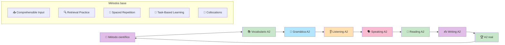

# Masterclass: Inglés A2 - Consolidando tus bases para la fluidez 🧑‍🏫🇬🇧

> **La premisa central de esta guía** — El nivel A2 es el puente entre "soy principiante" y "puedo mantener conversaciones reales". Aquí ampliás tu vocabulario, dominás las estructuras gramaticales intermedias y empezáis a producir textos más largos. Esta guía combina los métodos científicos más efectivos para que llegues a A2 en 12 semanas.

## Antes de empezar: 🎯 ¿qué vas a poder hacer al terminar esta guía?

Al terminar de leer y **aplicar** esta guía vas a poder:

- Entender qué es el nivel A2 del CEFR y cómo se diferencia de A1.
- Ampliar tu vocabulario de 300 a 1.000 palabras activas.
- Dominar las estructuras gramaticales intermedias (pasado, futuro, comparativos).
- Entender conversaciones cotidianas a velocidad normal.
- Producir párrafos y mensajes más largos en speaking y writing.
- Seguir un plan de 12 semanas con ejercicios prácticos y medibles.

---

## MAPA DEL WORKFLOW 🔄



---

## PARTE 1 — 📐 El nivel A2: qué es y qué no es

El **Marco Común Europeo de Referencia (CEFR)** define el nivel A2 como:

> *"Capacidad de comprender frases y expresiones de uso frecuente relacionadas con áreas de experiencia especialmente relevantes (información básica sobre sí mismo y su familia, compras, lugares de interés, ocupaciones, etc.)."*

### Qué PODÉS hacer en A2 (según el CEFR)

- ✅ Entender conversaciones cotidianas a velocidad normal.
- ✅ Leer textos cortos y simples (emails, mensajes, artículos breves).
- ✅ Escribir párrafos sobre tu vida, tus gustos y tus planes.
- ✅ Hablar de experiencias pasadas, planes futuros y comparar cosas.
- ✅ Manejar situaciones sociales básicas (restaurante, tienda, trabajo).

### Qué NO PODÉS hacer en A2 (y está bien)

- ❌ Entender películas sin subtítulos.
- ❌ Sostener conversaciones abstractas o técnicas.
- ❌ Escribir ensayos o emails complejos.
- ❌ Usar vocabulario avanzado o modismos con naturalidad.

### La métrica real del A2

| Habilidad | Lo que podés hacer | Ejemplo concreto |
|-----------|-------------------|------------------|
| Listening | Entender conversaciones cotidianas | Entender una conversación en un café |
| Reading | Leer emails y mensajes breves | Entender un email de un amigo |
| Speaking | Narrar experiencias y hacer predicciones | "Last week I went to the beach." |
| Writing | Escribir párrafos y mensajes | Escribir un email de 5 líneas |

---

## PARTE 2 — 📚 Vocabulario esencial A2: de 300 a 1.000 palabras

En A2, el objetivo no es aprender palabras raras: es ampliar tu vocabulario de **alta frecuencia** hasta cubrir el **80-85%** del inglés cotidiano.

### Las 700 palabras nuevas organizadas por temas

#### 🟢 Tema 1: Verbos irregulares comunes (50 palabras)

| Presente | Pasado | Participio | Ejemplo |
|----------|---------|-----------|---------|
| break | broke | broken | I broke the glass. |
| buy | bought | bought | I bought a car. |
| catch | caught | caught | I caught the ball. |
| choose | chose | chosen | I chose the red one. |
| drive | drove | driven | I drove to work. |
| fall | fell | fallen | I fell down. |
| feel | felt | felt | I felt happy. |
| find | found | found | I found my keys. |
| fly | flew | flown | I flew to Madrid. |
| forget | forgot | forgotten | I forgot my wallet. |
| get | got | got/gotten | I got a gift. |
| give | gave | given | I gave him a book. |
| grow | grew | grown | I grew up in Buenos Aires. |
| have | had | had | I had a great time. |
| hear | heard | heard | I heard a noise. |
| keep | kept | kept | I kept the secret. |
| know | knew | known | I knew the answer. |
| leave | left | left | I left early. |
| lose | lost | lost | I lost my phone. |
| make | made | made | I made dinner. |
| meet | met | met | I met my friend. |
| pay | paid | paid | I paid the bill. |
| put | put | put | I put it on the table. |
| read | read | read | I read a book. |
| run | ran | run | I ran 5 km. |
| say | said | said | He said goodbye. |
| see | saw | seen | I saw a movie. |
| sell | sold | sold | I sold my bike. |
| send | sent | sent | I sent an email. |
| sit | sat | sat | I sat down. |
| sleep | slept | slept | I slept well. |
| speak | spoke | spoken | I spoke English. |
| spend | spent | spent | I spent money. |
| stand | stood | stood | I stood up. |
| swim | swam | swum | I swam in the sea. |
| take | took | taken | I took a photo. |
| teach | taught | taught | I taught English. |
| tell | told | told | I told a story. |
| think | thought | thought | I thought about it. |
| understand | understood | understood | I understood everything. |
| wake | woke | woken | I woke up at 7. |
| wear | wore | worn | I wore a jacket. |
| win | won | won | I won the game. |
| write | wrote | written | I wrote a letter. |

#### 🟢 Tema 2: Adjetivos comparativos y superlativos (30 palabras)

| Positivo | Comparativo | Superlativo | Ejemplo |
|----------|-------------|-------------|---------|
| big | bigger | biggest | This is the biggest house. |
| small | smaller | smallest | This is the smallest car. |
| good | better | best | This is the best restaurant. |
| bad | worse | worst | This is the worst movie. |
| easy | easier | easiest | This is the easiest test. |
| difficult | harder | hardest | This is the hardest question. |
| expensive | more expensive | most expensive | This is the most expensive watch. |
| cheap | cheaper | cheapest | This is the cheapest option. |
| fast | faster | fastest | He is the fastest runner. |
| beautiful | more beautiful | most beautiful | She is the most beautiful. |

#### 🟢 Tema 3: Adverbios de frecuencia y modo (30 palabras)

| Adverbio | Uso | Ejemplo |
|----------|-----|---------|
| always | 100% | I always drink coffee. |
| usually | 80% | I usually walk to work. |
| often | 60% | I often read books. |
| sometimes | 40% | I sometimes watch TV. |
| rarely | 20% | I rarely eat meat. |
| never | 0% | I never smoke. |
| quickly | modo | Run quickly! |
| slowly | modo | Speak slowly please. |
| well | modo | She sings well. |
| badly | modo | He plays badly. |

#### 🟢 Tema 4: Expresiones de tiempo y secuencia (40 palabras)

| Expresión | Uso | Ejemplo |
|-----------|-----|---------|
| yesterday | pasado | Yesterday I worked. |
| last week/month/year | pasado | Last week I traveled. |
| ago | desde hace | Two days ago... |
| already | ya | I already ate. |
| yet | todavía (pregunta/negación) | Have you finished yet? |
| just | recién | I just arrived. |
| still | todavía | I still live here. |
| since | desde | I have lived here since 2020. |
| for | durante | I have lived here for 3 years. |
| when | cuándo | When did you arrive? |
| while | mientras | I read while I eat. |
| before | antes | I arrived before him. |
| after | después | I left after the meeting. |
| then | entonces | First, then, finally. |

#### 🟢 Tema 5: Conectores y frases útiles (30 palabras)

| Conector | Uso | Ejemplo |
|----------|-----|---------|
| because | causa | Because I was tired. |
| so | consecuencia | It rained, so I stayed home. |
| but | contraste | I like it, but it's expensive. |
| although | contraste | Although it was cold, I went out. |
| however | contraste | However, I disagree. |
| first/firstly | secuencia | First, we need to plan. |
| then/next | secuencia | Then, we execute. |
| finally | secuencia | Finally, we review. |
| in addition | adición | In addition, we need more time. |
| for example | ejemplo | For example, I like pizza. |
| such as | ejemplo | I like fruits such as apples. |
| that's why | consecuencia | It was late, that's why I left. |

#### 🟢 Tema 6: Colocaciones esenciales A2 (50 palabras)

Los hablantes nativos usan **collocations** (combinaciones naturales de palabras). Aprendé estas desde A2 para sonar más natural:

| Collocation | Traducción |
|-------------|-----------|
| make a decision | tomar una decisión |
| do homework | hacer la tarea |
| take a shower | ducharse |
| have breakfast | desayunar |
| get up | levantarse |
| go home | ir a casa |
| come back | volver |
| look for | buscar |
| wait for | esperar |
| listen to | escuchar |
| look at | mirar |
| talk about | hablar de |
| think about | pensar en |
| depend on | depender de |
| care about | importar |
| be interested in | estar interesado en |
| be good at | ser bueno en |
| be afraid of | tener miedo de |
| be tired of | estar cansado de |
| be married to | estar casado con |

> **💡 Tip:** las collocations son como "paquetes" que los nativos usan sin pensar. Si las aprendés como bloques, no tenés que inventar combinaciones que suenan raras.

---

## PARTE 3 — 📝 Gramática esencial A2

### 3.1 Pasado simple 🕰️

**Uso:** acciones terminadas en el pasado con tiempo definido.

**Estructura:**
```
Afirmativa: Subject + verbo pasado (regular: -ed; irregular: forma irregular)
Negativa: Subject + didn't + verbo base
Interrogativa: Did + subject + verbo base?
```

**Ejemplos:**
- I walked to the park. / She ate pizza.
- I didn't see him. / She didn't like it.
- Did you go to the party? / Did she call you?

**Regla de pronunciación -ed:**
- /t/ después de sonidos sordos: walk**ed**, talk**ed**
- /d/ después de sonidos sonoros: play**ed**, call**ed**
- /id/ después de /t/ o /d/: want**ed**, need**ed**

### 3.2 Futuro simple (will y going to) 🔮

**Uso:**
- **will:** decisiones espontáneas, predicciones, promesas.
- **going to:** planes e intenciones, predicciones basadas en evidencia presente.

**Ejemplos:**
- I will help you. (decisión espontánea)
- It will rain tomorrow. (predicción)
- I am going to study medicine. (plan)
- Look at those clouds! It is going to rain. (evidencia presente)

### 3.3 Presente perfecto vs. pasado simple ⏳

**Presente perfecto (have/has + participio):** acciones sin tiempo definido, experiencia de vida, acciones que continúan en el presente.

**Pasado simple:** acciones con tiempo definido en el pasado.

| Presente perfecto | Pasado simple |
|-------------------|---------------|
| I have visited Paris. (alguna vez en mi vida) | I visited Paris last year. (tiempo definido) |
| She has lived here for 3 years. (todavía vive aquí) | She lived here for 3 years. (ya no vive aquí) |
| Have you eaten? (experiencia sin tiempo) | Did you eat? (tiempo definido) |

### 3.4 Comparativos y superlativos 📊

**Estructura:**
```
Comparativo: adjective + -er + than (short adjectives) / more + adjective + than (long adjectives)
Superlativo: the + adjective + -est / the + most + adjective
```

**Ejemplos:**
- My car is faster than yours.
- This is the most interesting movie.
- She is taller than her brother.
- This is the best restaurant in town.

### 3.5 Preposiciones de movimiento y lugar 📍

| Preposición | Uso | Ejemplo |
|-------------|-----|---------|
| to | dirección | I go to school. |
| into | dentro de | Put the book into the box. |
| onto | sobre la superficie | Put the cup onto the table. |
| through | a través de | Walk through the door. |
| across | de un lado a otro | Walk across the street. |
| along | a lo largo de | Walk along the river. |
| past | más allá de | Walk past the store. |

### 3.6 Verbos modales: can, could, may, might, must, should 🎯

| Modal | Uso | Ejemplo |
|-------|-----|---------|
| can | habilidad/permiso presente | I can swim. / Can I come in? |
| could | habilidad/permiso pasado, petición más suave | I could run fast when I was young. / Could you help me? |
| may/might | posibilidad | It may rain. / He might come. |
| must | obligación fuerte | You must wear a seatbelt. |
| should | consejo | You should see a doctor. |
| have to | obligación externa | I have to work tomorrow. |

---

## PARTE 4 — 👂 Listening A2: de frases a conversaciones

### El método: Comprehensible input + repetición espaciada + dictados

#### Nivel 1: Diálogos cortos (Semanas 1-3)

**Objetivo:** entender conversaciones de 30 segundos a 1 minuto.

**Ejercicio diario (15 minutos):**
1. Usá **podcasts A2** como "6 Minute English" o "Elementary Podcasts" (British Council).
2. Escuchá el episodio una vez sin transcripción.
3. Escribí lo que entendiste.
4. Escuchalo de nuevo con transcripción.
5. Identificá las palabras nuevas y agregalas a tu lista.

#### Nivel 2: Conversaciones reales (Semanas 4-6)

**Objetivo:** entender conversaciones a velocidad normal.

**Ejercicio diario (20 minutos):**
1. Usá **videos de YouTube con subtítulos en inglés** (nativos hablando, pero no muy rápido).
2. Escuchá un fragmento de 1-2 minutos.
3. Sin subtítulos, anotá las ideas principales.
4. Con subtítulos, verificá lo que entendiste.
5. Repetí el fragmento 2 veces más.

#### Nivel 3: Dictados (Semanas 7-12)

**Objetivo:** entrenar la escucha activa y la escritura simultánea.

**Ejercicio diario (15 minutos):**
1. Elegí un audio corto (30 segundos a 1 minuto).
2. Escuchalo una vez.
3. Escribí lo que escuchaste, palabra por palabra.
4. Compará con la transcripción.
5. Identificá los errores: ¿qué palabras no escuchaste? ¿por qué?

> **📊 Datos científicos:** el dictado es una forma de **retrieval practice** auditiva. Al intentar escribir lo que escuchaste, estás forzando a tu cerebro a procesar el input en profundidad. Estudios muestran que el dictado mejora la comprensión auditiva más que escuchar pasivamente.

---

## PARTE 5 — 🗣️ Speaking A2: de frases a párrafos

### El método: Output guiado + retroalimentación inmediata + repetición espaciada

#### Nivel 1: Respuestas cortas (Semanas 1-3)

**Objetivo:** responder preguntas simples con frases completas.

**Ejercicio diario (10 minutos):**
1. Usá un tutor de IA para responder preguntas:
   - "What did you do yesterday?"
   - "What are you going to do this weekend?"
   - "What is your favorite food?"
2. Respondé en voz alta, no por escrito.
3. El tutor te corrige la gramática y la pronunciación.
4. Repetí la respuesta corregida 2 veces.

#### Nivel 2: Narración simple (Semanas 4-6)

**Objetivo:** narrar experiencias pasadas en 3-4 oraciones.

**Ejercicio diario (15 minutos):**
1. Elegí una experiencia reciente (un viaje, una fiesta, un día de trabajo).
2. Escribí 3-4 oraciones sobre esa experiencia usando pasado simple.
3. Grabate contando esa historia en voz alta.
4. Escuchate y corregí los errores.
5. Volvé a grabarte hasta que salga fluido.

#### Nivel 3: Presentaciones cortas (Semanas 7-12)

**Objetivo:** hablar durante 1-2 minutos sobre un tema.

**Ejercicio diario (20 minutos):**
1. Prepará un tema: tu trabajo, tu hobby, tu ciudad.
2. Escribí 5 puntos clave.
3. Practicá la presentación en voz alta 2 veces.
4. Grabate la tercera vez.
5. Escuchate y evaluá: ¿se entendió la idea? ¿qué errores repetiste?

> **📊 Datos científicos:** un meta-análisis de 2020 (Alsowat) muestra que las **estrategias de aprendizaje** tienen el impacto más grande en **speaking** (d=0.90). En A2, el secreto es la **práctica deliberada**: producir, recibir feedback, corregir, volver a producir.

---

## PARTE 6 — 📖 Reading A2: de oraciones a párrafos

### El método: Comprehensible input + spaced repetition + collocations

#### Nivel 1: Textos breves (Semanas 1-3)

**Objetivo:** leer mensajes, emails y avisos cortos.

**Ejercicio diario (15 minutos):**
1. Leé **emails y mensajes** en inglés (pueden ser de libros graded readers A2 o emails reales en inglés).
2. Escribí 3 ideas principales.
3. Identificá 5 palabras nuevas y agregalas a tu lista de spaced repetition.

#### Nivel 2: Artículos cortos (Semanas 4-6)

**Objetivo:** leer artículos de 200-300 palabras.

**Ejercicio diario (20 minutos):**
1. Leé artículos de **BBC Learning English** o **Breaking News English** (nivel A2).
2. Subrayá las collocations que encuentres.
3. Escribí un resumen de 3 oraciones.

#### Nivel 3: Historias cortas (Semanas 7-12)

**Objetivo:** leer cuentos y relatos breves.

**Ejercicio diario (25 minutos):**
1. Leé **graded readers A2** (Oxford Bookworms Level 2, Penguin Readers Level 2).
2. Leé 5-10 páginas por día.
3. Escribí un resumen de 5 oraciones.
4. Identificá 5 collocations y escribí frases con ellas.

> **📊 Datos científicos:** un meta-análisis de 2023 (Webb) muestra que la **lectura** genera ganancias de vocabulario del 17% en tests inmediatos. Además, aprender **collocations** (combinaciones naturales de palabras) mejora la fluidez y la naturalidad del lenguaje más que aprender palabras aisladas.

---

## PARTE 7 — ✍️ Writing A2: de oraciones a párrafos

### El método: Producción guiada + retroalimentación + collocations

#### Nivel 1: Mensajes cortos (Semanas 1-3)

**Objetivo:** escribir mensajes de 3-5 líneas.

**Ejercicio diario (15 minutos):**
1. Escribí un mensaje a un amigo: qué hiciste el fin de semana.
2. Usá las collocations aprendidas (go shopping, watch TV, meet friends).
3. Pedí a un tutor de IA que te corrija.
4. Reescribí el mensaje corregido.

#### Nivel 2: Párrafos descriptivos (Semanas 4-6)

**Objetivo:** escribir párrafos de 5-7 oraciones.

**Ejercicio diario (20 minutos):**
1. Elegí un tema: tu trabajo, tu ciudad, tu comida favorita.
2. Escribí un párrafo usando conectores (because, so, but, although).
3. Usá comparativos y superlativos.
4. Pedí corrección y reescribí.

#### Nivel 3: Emails formales e informales (Semanas 7-12)

**Objetivo:** escribir emails de 10-15 líneas.

**Ejercicio diario (25 minutos):**
1. Escribí un email informal a un amigo: contale un viaje que hiciste.
2. Escribí un email formal para pedir información (hotel, trabajo, curso).
3. Usá las estructuras gramaticales de A2 (pasado, futuro, condicional simple).
4. Pedí corrección y reescribí.

> **📊 Datos científicos:** un meta-análisis de 2020 (Alsowat) muestra que la **instrucción explícita** tiene el impacto más grande en **gramática** (d=1.26). En A2, aprender reglas explícitamente (pasado, futuro, comparativos) mejora la escritura más que solo practicar sin feedback.

---

## PARTE 8 — 📅 Plan de acción: 12 semanas para A2

### Semanas 1-3: Ampliación de vocabulario y pasado simple

- [ ] 📚 Aprendé 100 palabras nuevas (verbos irregulares, adverbios de frecuencia).
- [ ] 📝 Dominá el pasado simple (regular e irregular).
- [ ] 📖 Leé mensajes y emails cortos en inglés (10 min/día).
- [ ] 👂 Escuchá diálogos cortos con transcripción (15 min/día).
- [ ] 🗣️ Practicá narraciones de 3 oraciones sobre tu semana.
- [ ] ✍️ Escribí mensajes cortos de 3-5 líneas.

### Semanas 4-6: Futuro y comparativos

- [ ] 📚 Aprendé 100 palabras nuevas (colores, comparativos, conectores).
- [ ] 📝 Dominá el futuro (will y going to) y los comparativos.
- [ ] 📖 Leé artículos cortos de BBC Learning English.
- [ ] 👂 Escuchá podcasts A2 sin subtítulos.
- [ ] 🗣️ Practicá presentaciones de 1 minuto sobre tu hobby.
- [ ] ✍️ Escribí párrafos de 5-7 oraciones.

### Semanas 7-9: Integración de habilidades

- [ ] 📚 Aprendé 100 palabras nuevas (expresiones de tiempo, colaciones).
- [ ] 📝 Dominá el presente perfecto y los modales (could, might, should).
- [ ] 📖 Leé graded readers nivel A2 (5 páginas/día).
- [ ] 👂 Hacé dictados cortos (15 min/día).
- [ ] 🗣️ Simulá conversaciones con IA sobre planes y experiencias.
- [ ] ✍️ Escribí emails informales de 10 líneas.

### Semanas 10-12: Consolidación y preparación para B1

- [ ] 📚 Repasá las 1.000 palabras con spaced repetition.
- [ ] 📝 Repasá toda la gramática A2.
- [ ] 📖 Leé textos A2 de Cambridge English.
- [ ] 👂 Hacé un listening test de A2 (Cambridge English A2 listening).
- [ ] 🗣️ Grabate hablando 2 minutos sobre tu vida.
- [ ] ✍️ Escribí un email formal de 15 líneas.
- [ ] 🏆 Hacé un test de A2 completo para medir tu progreso.

---

## PARTE 9 — ⚠️ Errores comunes al aprender A2

| Error | Por qué pasa | Solución |
|-------|--------------|----------|
| ❌ **Usar solo pasado simple para todo el pasado** | Es más fácil que el presente perfecto | Aprendé la diferencia: tiempo definido → pasado simple; experiencia sin tiempo → presente perfecto. |
| ❌ **Confundir will y going to** | Ambos significan "futuro" | Will = decisión espontánea/predicción; going to = plan/evidencia presente. |
| ❌ **Aprender collocations de memoria sin contexto** | Parecen reglas abstractas | Aprendé collocations en frases, no en listas. |
| ❌ **No practicar speaking por miedo a los errores** | Miedo al juicio | En A2, el error es parte del aprendizaje. Hablá de todos modos. |
| ❌ **Cambiar de recurso cada semana** | Creemos que más = mejor | Quedate con 1 podcast, 1 libro, 1 app por semana. |
| ❌ **No repasar la gramática** | La estudiamos una vez y olvidamos | Repasá las reglas cada 2 semanas con ejercicios prácticos. |

---

## PARTE 10 — 📚 Glosario de conceptos clave

- 📐 **CEFR A2:** nivel elemental del Marco Común Europeo. Capacidad de comunicarse en situaciones cotidianas con cierta autonomía.
- 📥 **Comprehensible Input:** input que está un poco por encima de tu nivel actual (i+1).
- 🔍 **Retrieval Practice:** intentar recordar sin ayuda; más efectivo que volver a leer.
- 📅 **Spaced Repetition:** repasar en intervalos crecientes para maximizar la retención.
- 🎯 **Task-Based Learning:** aprender completando tareas reales con el idioma.
- 🔗 **Collocation:** combinación natural de palabras que los hablantes nativos usan sin pensar (ej: make a decision).
- 🗂️ **Word family:** familia de palabras derivadas de una misma raíz (sustantivo, verbo, adjetivo, adverbio).
- ⏳ **Presente perfecto:** have/has + participio; acciones sin tiempo definido o que continúan en el presente.
- 🕰️ **Pasado simple:** acciones terminadas en el pasado con tiempo definido.
- 🔮 **Futuro simple:** will (decisiones espontáneas) y going to (planes).
- 📊 **Comparativos:** adjetivos con -er + than (shorter) o more + adjective + than (more beautiful).
- 📈 **Superlativos:** the + adjetivo con -est o the + most + adjective.
- 🗣️ **Fluidez:** capacidad de expresar ideas sin trabas excesivas.
- 🎧 **Listening:** comprensión auditiva.
- 📖 **Reading:** comprensión lectora.
- ✍️ **Writing:** producción escrita.
- 🗣️ **Speaking:** producción oral.

---

## PARTE 11 — 🧠 Resumen mental (para fijar el conocimiento)

Si tuvieras que recordar solo 3 ideas de esta masterclass:

1. 📈 **A2 es el puente entre principiante y conversaciones reales.** Si podés narrar tu fin de semana, comparar cosas y entender una conversación en un café, estás en A2.
2. 🔬 **Los métodos funcionan: input comprensible + retrieval + spaced repetition + collocations.** No inventes tu método; usá el que la ciencia respalda.
3. 📅 **12 semanas con un plan > estudiar sin rumbo.** 1.000 palabras + gramática A2 + 4 habilidades + un plan semanal = A2 real.

---

## PARTE 12 — 🌐 Recursos para profundizar

- 📖 Libro: *"English Grammar in Use"* (Raymond Murphy) — nivel A2, explicaciones claras con ejercicios.
- 📖 Libro: *"Oxford Bookworms Level 2"* — graded readers nivel A2.
- 🎧 Podcast: *"6 Minute English"* (BBC) — listening A2 con transcripción.
- 🎧 Podcast: *"Elementary Podcasts"* (British Council) — listening A2 con actividades.
- 📱 App: **Anki** o **Quizlet** — spaced repetition para vocabulario.
- 📱 App: **Duolingo** — práctica diaria gamificada (estudios 2025 confirman efectividad en A1-A2).
- 📱 App: **GraphoLearn** — phonics para mejorar decodificación.
- 🌐 Web: **Cambridge English A2 Tests** — tests oficiales para medir tu nivel.
- 🤖 Herramienta: **ChatGPT / Claude** — tutor conversacional para speaking y writing con corrección inmediata.
- 🎥 Video: Maddie from POC English — *"The English Journey & 5 Rules for Fast Improvement"* (los 6 peldaños del aprendizaje).
- 📚 Herramienta: **Reverso Context** — para buscar collocations reales en corpus de inglés.

---

*Guía elaborada como síntesis de métodos científicos probados para el aprendizaje de inglés nivel A2: Comprehensible Input (Krashen), Retrieval Practice (Bjork & Bjork), Spaced Repetition (Ebbinghaus), Task-Based Learning (Ellis), Collocations (Maddie, POC English) y evidencia de meta-análisis recientes (Alsowat 2020, Webb 2023, Sanemueang 2025, Patel 2024).*
