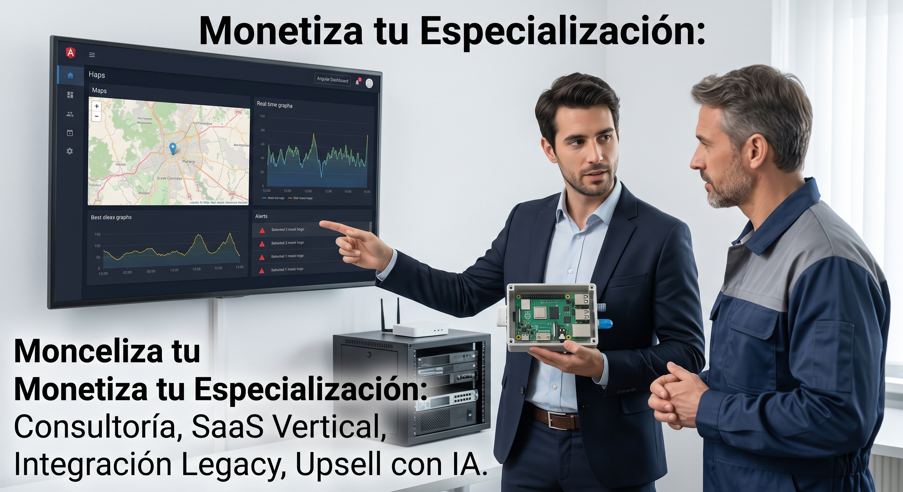
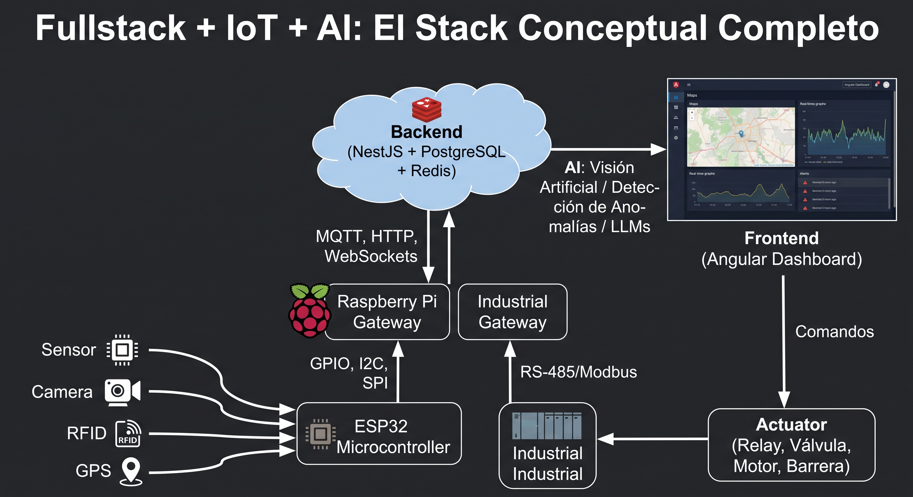
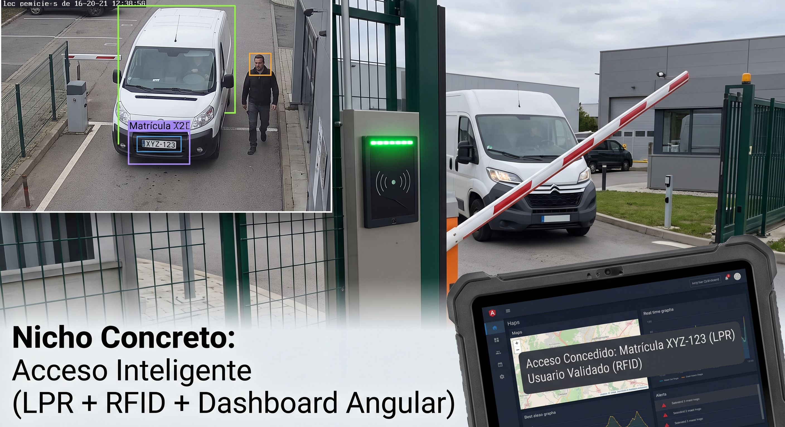

# Masterclass: Fullstack + IoT + AI como especialización rentable

> Guía de estudio y de negocio para un desarrollador fullstack (Angular / Node / NestJS / PostgreSQL) que quiere moverse hacia el mundo "software que toca el mundo físico", con ruta de aprendizaje en Platzi y estrategia de monetización.

---

## 🧠 1. La tesis de fondo (y por qué es cierta a medias)

La IA está comoditizando el desarrollo web puro: CRUDs, dashboards, APIs simples, landing pages, auth, componentes UI. Cualquier LLM decente hoy genera un 70-80% de ese código en minutos. Eso **no** significa que el desarrollo web muera, significa que su margen se comprime porque la barrera de entrada baja.

Lo que la IA todavía no resuelve solo generando código es la fricción del mundo físico:

- Un sensor que da falsos positivos por ruido eléctrico.
- Un microcontrolador que se cuelga por brownout.
- Una red 3G/4G industrial que se corta 20 veces al día en una planta.
- Un PLC de hace 15 años que solo habla Modbus RTU por RS-485.
- Un dispositivo que hay que actualizar remotamente sin ir físicamente al lugar.

Nada de esto se soluciona con "otro prompt". Se soluciona con conocimiento acumulado de protocolos, hardware, redes y operación. **Esa es la barrera de entrada real**, y es la que te conviene construir.

La conclusión correcta no es "abandonar la web", es: **la web es tu ventaja competitiva cuando la combinás con hardware**, porque la mayoría de la gente que sabe hardware no sabe construir un backend ni un dashboard decente, y viceversa.

---

## 🧩 2. El stack conceptual completo

```
Sensor / Cámara / RFID / GPS
        ↓
Microcontrolador (ESP32) o PLC industrial
        ↓
Protocolo local: GPIO, I2C, SPI, RS-485/Modbus
        ↓
Gateway (Raspberry Pi / ESP32 / industrial gateway)
        ↓
Protocolo de red: MQTT, HTTP, WebSockets
        ↓
Backend (NestJS + PostgreSQL + Redis)
        ↓
Procesamiento / IA (Computer Vision, anomaly detection, LLMs)
        ↓
Frontend (Angular) — dashboard, alertas, mapas, tiempo real
        ↓
Actuador (relay, barrera, motor, válvula) → vuelve al mundo físico
```

Vos ya dominás las dos capas de mayor valor percibido por el cliente (backend + frontend). Lo que tenés que sumar son las capas de los extremos: **captura física** (sensores/hardware) y **inteligencia** (IA aplicada a esos datos).



---

## 🪜 3. Los 5 niveles de la especialización

### 🟢 Nivel 1 — Fundamentos de IoT y microcontroladores
Objetivo: perder el miedo al hardware. No necesitás ser ingeniero electrónico, necesitás entender GPIO, sensores, actuadores y cómo un micro se conecta a la red.

- 🔌 Electrónica básica (voltaje, corriente, resistencias, protoboard).
- 🧩 ESP32: GPIO, PWM, señales analógicas, Wi-Fi, servidor web embebido.
- 🌡️ Conexión de sensores (temperatura, humedad, movimiento, distancia) y actuadores (relays, motores).

### 🔵 Nivel 2 — Protocolos y comunicación IoT
Objetivo: que un dispositivo hable con tu backend de forma confiable.

- 🌐 HTTP/REST desde un microcontrolador.
- 📡 MQTT (pub/sub) — el protocolo estándar de IoT, imprescindible.
- ⚡ WebSockets para tiempo real.
- 📻 Radiofrecuencia, LoRa (largo alcance, bajo consumo) para proyectos rurales/industriales dispersos.
- 🍓 Raspberry Pi como gateway/edge device.

### 🟠 Nivel 3 — Protocolos industriales (tu verdadero diferencial)
Objetivo: poder integrarte con la infraestructura vieja que ya existe en fábricas, depósitos y plantas. Acá está la barrera de entrada más alta y menos gente la cruza.

- RS-485 / Modbus RTU y Modbus TCP.
- Conceptos de PLC, RTU, SCADA.
- I2C / SPI para sensórica de mayor precisión.
- Nociones de OPC-UA (estándar moderno de comunicación industrial).

### 🟣 Nivel 4 — Backend y frontend de nivel producción
Acá ya tenés ventaja real. Lo que hay que sumar es la parte de tiempo real y mensajería, que en desarrollo web "tradicional" se usa menos.

- NestJS: arquitectura modular, WebSockets, integración con brokers MQTT.
- PostgreSQL + series temporales (datos de sensores son time-series, considerar TimescaleDB).
- Redis para colas y estado en tiempo real.
- Angular: dashboards en tiempo real, mapas, WebSockets, gráficas.

### 🤖 Nivel 5 — IA aplicada
Objetivo: que el sistema no solo muestre datos, sino que decida o alerte.

- Visión por computadora (OpenCV, YOLO): detección de objetos, reconocimiento de matrículas, conteo, detección de EPP (cascos, chalecos).
- Detección de anomalías sobre series temporales (consumo eléctrico, temperatura, vibración).
- Mantenimiento predictivo básico.
- LLMs para generar reportes, alertas en lenguaje natural, o agentes que resuman el estado de una operación.

---

## 🎓 4. Ruta de estudio en Platzi

Ya tenés Platzi Pro, así que esto está pensado 100% para aprovechar rutas y cursos reales de la plataforma. Los cursos y rutas cambian con el tiempo, así que verificá disponibilidad al momento de inscribirte, pero esta es la fotografía actual:

### 🛰️ 4.1 Ruta troncal de IoT
Platzi tiene una **Ruta de Internet of Things** completa que va desde electrónica hasta microcontroladores avanzados. Incluye, entre otros:

- Curso de Fundamentos de Electricidad y Electrónica
- Curso de Introducción a IoT
- Fundamentos de Desarrollo de Hardware con Arduino
- Curso de IoT: Protocolos de Comunicación (Wi-Fi, LoRa, RF, prácticas con Raspberry Pi y dashboards)
- Curso de IoT: Programación de Microcontroladores ESP32 (GPIO, PWM, servidor web, ESP-IDF, FreeRTOS)
- Curso de IoT: Telecomunicaciones con LoRa
- Curso de Node.js para IoT: Pub/Sub con MQTT, Testing y WebSockets *(este es clave para vos: conecta directamente tu stack Node con el mundo IoT)*

Dentro del curso de "Introducción a IoT" también vas a encontrar contenido puntual sobre **PLC, RTU y controladores industriales**, que te sirve de puerta de entrada al Nivel 3 antes de buscar formación más profunda en Modbus/SCADA (Platzi no tiene hoy una ruta industrial dedicada tan profunda como la de IoT/microcontroladores; para RS-485/Modbus/PLC probablemente termines complementando con documentación oficial o cursos puntuales fuera de Platzi).

### ⚙️ 4.2 Backend (tu base, para reforzar)
- Curso de Backend con NestJS (API REST, TypeORM, PostgreSQL, autenticación)
- Curso de NestJS: Programación Modular
- Curso de NestJS: Autenticación con Passport y JWT
- Curso de NestJS: Persistencia de Datos con TypeORM
- Curso de Node.js: Autenticación, Microservicios y Redis
- Ruta de Backend con Node.js (agrupa todo lo anterior + WebSockets + arquitecturas modernas)

### 🎨 4.3 Frontend (tu base, para reforzar tiempo real)
- Curso de Angular Router: Lazy Loading y Programación Modular
- Cursos de Angular orientados a testing y RxJS (útiles para manejar streams de datos en tiempo real, que es exactamente lo que vas a hacer con websockets de sensores)

### 👁️ 4.4 Visión por computadora / IA aplicada
- Curso de Visión Artificial con Python (OpenCV, YOLO, Mediapipe): detección de objetos, segmentación, conteo, mapas de calor, entrenamiento de modelos propios — este es probablemente el curso más directamente aplicable a proyectos de control de acceso, reconocimiento de matrículas o seguridad.
- Curso de Fundamentos de AI para Data y Machine Learning (incluye una introducción a visión artificial).
- Curso Profesional de Computer Vision con TensorFlow, si querés ir más profundo en detección/clasificación con redes neuronales.
- Ruta de Inteligencia Artificial / Data Science de Platzi como marco general si en algún punto querés formalizar todo el fundamento de ML.

### 🧭 4.5 Orden sugerido de consumo
1. Introducción a IoT → Fundamentos de Hardware con Arduino
2. Programación de Microcontroladores ESP32
3. IoT: Protocolos de Comunicación (acá aparece MQTT, LoRa, Raspberry Pi)
4. Node.js para IoT: Pub/Sub con MQTT, Testing y WebSockets *(bisagra entre hardware y tu backend actual)*
5. Repaso rápido de NestJS avanzado (WebSockets, TypeORM, Auth) si ya lo sabés, saltealo
6. Curso de Visión Artificial con Python (OpenCV/YOLO)
7. Proyecto integrador propio (ver sección 6)

---

## 💰 5. Cómo se monetiza esto (comercialmente hablando)

Esta es la parte que más importa y la que menos se enseña en cursos técnicos. Hay varios modelos de negocio posibles, no son excluyentes:

### 💼 5.1 Consultoría / desarrollo a medida (el punto de entrada más rápido)
Empresas medianas necesitan resolver un problema operativo puntual: "avisame si la cámara de frío se calienta", "quiero que la barrera se abra sola", "quiero saber si la máquina X se detuvo". Cobrás por proyecto (setup) y por mantenimiento mensual. Es el modelo más fácil de arrancar porque no necesitás validar un producto, resolvés un dolor concreto de un cliente que ya tenés identificado.

- Ticket típico: bastante más alto que un sitio web corporativo, porque estás vendiendo automatización operativa, no "una web".
- Ingreso recurrente: mantenimiento, soporte, actualización de firmware, alertas.

### 📦 5.2 Producto vertical (SaaS + hardware) para un nicho específico
En vez de intentar un "producto IoT genérico" (competís contra plataformas gigantes como ThingSpeak, Losant, etc.), elegís un nicho vertical y armás algo específico:

- Monitoreo de máquinas para PyMEs industriales.
- Control de acceso inteligente para edificios, gimnasios o estacionamientos (cámara + LPR + backend + alertas).
- Trazabilidad y monitoreo para logística/transporte (GPS + sensores + mapa en tiempo real).
- Mantenimiento predictivo básico para flotas o maquinaria.

Acá el modelo es suscripción mensual por dispositivo o por sitio, más el hardware (que podés vender vos, tercerizar, o dejar que el cliente compre y vos solo cobrás software).

### 🔌 5.3 Integración de sistemas legacy (el nicho menos saturado)
Empresas con PLCs viejos, software en VB6, sistemas que nunca fueron pensados para tener una API. Tu trabajo es ser el puente: leer los datos de la máquina vieja (RS-485/Modbus), llevarlos a un backend moderno, y exponerlos en un dashboard. Esto tiene poquísima competencia porque exige paciencia para lidiar con documentación vieja y hardware raro, algo que la mayoría de los devs jóvenes evita.

### 🚀 5.4 Reventa de valor con IA como diferencial
Una vez que tenés el dato fluyendo (sensor → backend → dashboard), el salto a IA es de mucho valor y poco costo marginal para vos: detección de anomalías, alertas predictivas, resúmenes automáticos con LLM. Esto te permite subir el precio del mismo proyecto sin duplicar el esfuerzo de desarrollo.

### 🗣️ Cómo se vende (importante)
El cliente no compra "un backend en NestJS" ni "un ESP32 con MQTT". Compra la automatización de una operación física: "el empleado ya no tiene que buscar la tarjeta", "el dueño se entera antes de que la máquina se rompa", "el guardia ya no tiene que mirar 8 cámaras a la vez". Vendé el resultado operativo, no la arquitectura.

---

## 🗺️ 6. Nichos concretos, especialmente pensando en Argentina / LatAm

Hay muchísima infraestructura que no nació pensando en APIs modernas: industria, logística, agricultura, seguridad, edificios, fábricas, estaciones de servicio, depósitos, transporte, energía. Algunos puntos de entrada concretos:

| Nicho | Problema que resolvés | Componentes típicos |
|---|---|---|
| Fábrica / PyME industrial | "Avisame si una máquina consume de más, se detiene o sale de temperatura" | Sensores → ESP32 → MQTT → NestJS → PostgreSQL → Angular → alertas WhatsApp |
| Logística / transporte | Seguimiento de flota, alertas de desvío o parada no programada | GPS + sensores → gateway → backend → mapa en tiempo real → IA |
| Acceso inteligente | Reconocimiento de matrícula o rostro para abrir barreras/puertas automáticamente | Cámara → Computer Vision → LPR → backend → controlador → barrera |
| Gimnasios / control de acceso | QR/RFID + cámaras + gestión de socios, más defendible que "otro SaaS para gimnasios" | RFID/QR + sensores + cámaras + backend + IA |
| Cámaras de frío / cadena de frío | Alertas de temperatura fuera de rango en tiempo real | Sensores de temperatura → gateway → backend → alertas |
| Agro | Monitoreo de humedad de suelo, tanques, riego automatizado | Sensores + LoRa (por las distancias) + backend + dashboard |

Empezá por el nicho donde ya tengas algún contacto o conocimiento de dominio (alguien que conozcas con una fábrica, un gimnasio, un depósito). El primer proyecto real vale más que diez cursos.



---

## 🗓️ 7. Plan de acción sugerido (primeros 90 días)

1. **Semanas 1-3**: Ruta de IoT en Platzi (Introducción a IoT + Hardware con Arduino + ESP32). Comprás un ESP32 (barato, ~10-15 USD) y replicás cada práctica.
2. **Semanas 4-5**: Curso de IoT: Protocolos de Comunicación + Node.js para IoT (MQTT/WebSockets). Acá conectás por primera vez un ESP32 a un backend NestJS propio.
3. **Semana 6**: Armás un mini-proyecto end-to-end propio: un sensor de temperatura o de movimiento que manda datos por MQTT a un backend NestJS, se guarda en PostgreSQL y se visualiza en un dashboard Angular en tiempo real. Esto ya es un portfolio piece potente.
4. **Semanas 7-9**: Curso de Visión Artificial con Python (OpenCV/YOLO). Sumás a tu proyecto una segunda fuente de datos: una cámara con detección de objetos o de matrículas.
5. **Semanas 10-12**: Buscás tu primer cliente piloto (puede ser a precio reducido o gratis a cambio de caso de estudio). Elegís uno de los nichos de la sección 6, preferentemente uno donde tengas contacto directo.

Al final de los 90 días vas a tener: conocimiento técnico real en las 5 capas, un proyecto propio demostrable, y (idealmente) un primer cliente o caso de uso validado.



---

## ⚠️ 8. Advertencias honestas

- **No existe el "100% future-proof"**. La IA sigue avanzando y en algún momento va a facilitar también partes del trabajo de integración de hardware (ya hay agentes que ayudan a debuggear firmware). La ventaja que estás construyendo es de tiempo, no eterna.
- **No es un camino instantáneo**. A diferencia de un CRUD que armás en un fin de semana, un proyecto IoT real tiene ciclos de hardware, testing físico y a veces logística de dispositivos. Vender esto lleva más tiempo de ida y vuelta con el cliente que un proyecto puramente web.
- **La seguridad importa más acá**. Un bug en un dashboard muestra mal un número. Un bug en un sistema que controla una barrera o una válvula puede causar un daño físico real. Vale la pena tomarse en serio el manejo de errores, fallback y modos seguros ante fallas de red.
- **No necesitás "convertirte en ingeniero electrónico"**. El objetivo es entender lo suficiente de hardware y protocolos para poder integrarlo con tu stack actual, no diseñar placas desde cero.

---

## 🏁 9. Resumen ejecutivo

El argumento de fondo tiene sustento: la IA abarata el software puro, pero no elimina la fricción del mundo físico. Para alguien que ya sabe Angular + Node/NestJS + TypeScript + PostgreSQL, la barrera de entrada al mundo IoT+AI no es tan alta como parece, porque la parte más difícil de conseguir en el mercado (backend + frontend sólidos) ya la tenés. Lo que falta es una capa de conocimiento de hardware/protocolos y una capa de IA aplicada, ambas alcanzables con una ruta de estudio de pocos meses.

El valor comercial no está en "hacer otro SaaS", está en resolver problemas operativos reales de empresas que hoy dependen de procesos manuales o de sistemas viejos desconectados entre sí. Ese es el terreno con menos competencia y mayor ticket promedio.