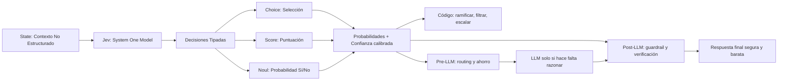
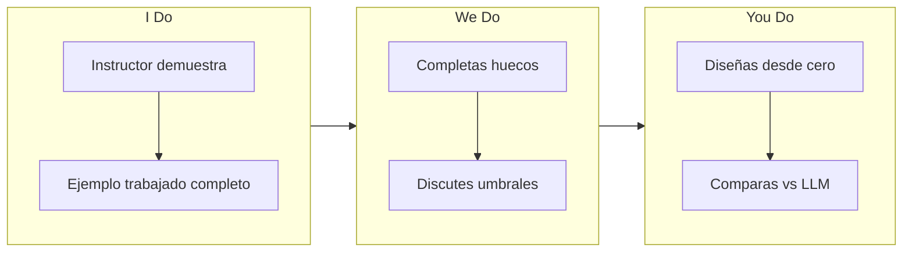
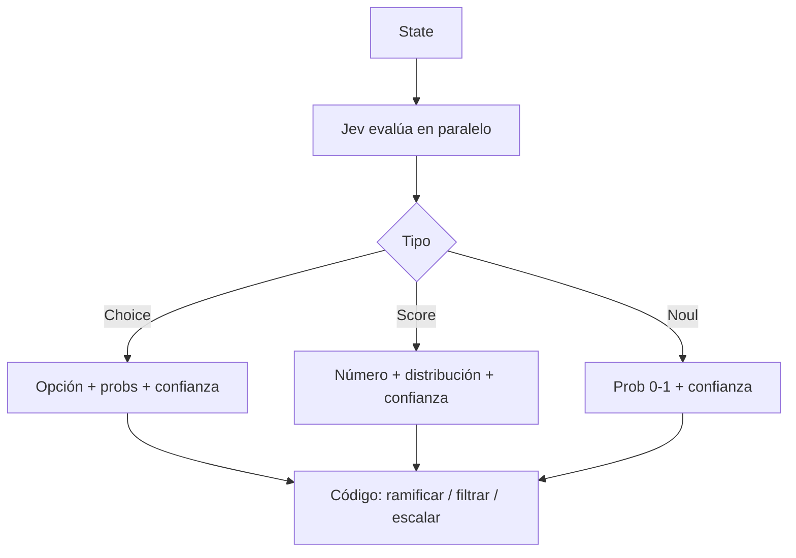
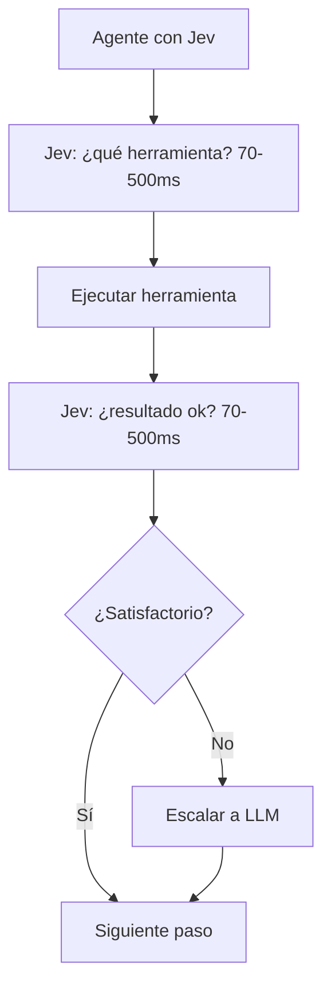
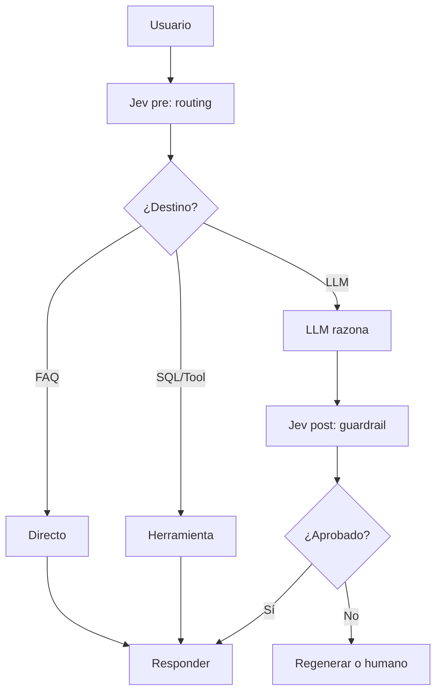

# MASTERCLASS: Jev de TypeSafe AI — El Nuevo Paradigma de Modelos de Decisión para Automatización Inteligente

## 0. CÓMO ESTUDIAR ESTA GUÍA (5 MINUTOS QUE MULTIPLICAN TU RETENCIÓN)

Esta guía está rediseñada con ciencia del aprendizaje. No la leas de corrido: úsala así.

### 0.1 Los 7 principios aplicados aquí

| Principio | Qué dice la evidencia | Cómo lo aplicamos aquí |
|-----------|----------------------|------------------------|
| **1. Objetivos claros + diseño inverso (Wiggins & McTighe, Bloom)** | Aprendes más si sabes qué serás capaz de *hacer* al final | Cada parte empieza con 🎯 Objetivo medible con verbo Bloom |
| **2. Carga cognitiva (Sweller)** | La memoria de trabajo solo maneja 4±1 ideas nuevas | Contenido en chunks, una idea por tabla/diagrama, sin duplicaciones |
| **3. Organizador previo (Ausubel) + doble código (Paivio/Mayer)** | Un mapa + palabra + imagen se recuerda mejor que solo texto | Mapa del sistema al inicio + tabla + diagrama + código para lo mismo |
| **4. Ejemplo trabajado → desvanecimiento (fading)** | Ver un ejemplo resuelto paso a paso y luego completarlo tú es superior a solo teoría | Cada patrón tiene código completo → luego ejercicio con huecos → luego desde cero |
| **5. Práctica de recuperación (Roediger & Karpicke)** | Recordar activamente retiene ~2x más que releer | 🧠 Auto-test al final de cada parte. Tápalo e intenta responder antes de seguir |
| **6. Dificultad deseable + intercalado (Bjork, Rohrer)** | Mezclar casos parecidos (Jev vs LLM) cuesta al inicio pero discrimina mejor | Tablas "¿Jev o LLM?" y casos límite, no bloques separados |
| **7. Feedback + metacognición** | Saber por qué fallaste y juzgar tu confianza calibra tu juicio | ❌ Misconcepción típica, rúbricas, umbrales de confianza y plan de repaso 1-7-30 |

### 0.2 Protocolo recomendado (4 pasadas)

1. **Diagnóstico (5 min):** haz el Pre-test de 0.3 sin mirar. No importa fallar — activa conocimiento previo.
2. **Primera lectura (30 min):** lee mapa + Partes 1-3. Haz cada 🧠 Auto-test tapando la respuesta.
3. **Práctica (30 min):** Partes 4-5. Copia un ejemplo trabajado, ejecútalo mentalmente, luego haz el ejercicio We Do / You Do.
4. **Consolidación (días 1-7-30):** usa el Plan de repaso final. Si no puedes explicar cada parte en 2 minutos (técnica Feynman), vuelve a ese chunk.

> **Regla de oro de esta guía:** si la respuesta que necesita tu software es una **decisión** (sí/no, clasificar, puntuar) y no una explicación, considera Jev. Si necesita razonamiento o texto, usa LLM. Lo potente es combinarlos.

### 0.3 Pre-test diagnóstico (hazlo ahora, 3 min)

Sin volver atrás, responde en voz alta o en papel:

1. ¿Qué devuelve un LLM vs qué devuelve Jev?
2. ¿Cuáles son las 3 primitivas de Jev y cuándo usar cada una?
3. ¿Qué significa "probabilidad calibrada" y por qué importa para automatizar?
4. Nombra 1 caso donde Jev gana y 1 donde pierde frente a un LLM.
5. ¿Qué harías si Jev responde con confianza 0.45?

Guarda tus respuestas. Al final volverás a ellas (efecto test + metacognición).

> **Prerrequisitos:** Python básico, qué es una API/JSON, noción de LLM (prompt → texto). Si no los tienes, lee primero solo 1.1, 2.3 y 7.2.

### 0.4 Objetivos de aprendizaje (qué sabrás hacer)

Al terminar podrás (verbos Bloom):

- **Recordar:** definir System One Model, Choice/Score/Noul, RLCD, latencia/costo de Jev.
- **Comprender:** explicar con tus palabras por qué un LLM es lento/caro/frágil para decidir.
- **Aplicar:** construir un router, un scorer y un guardrail con manejo de confianza.
- **Analizar:** decidir Jev vs LLM vs Jev+LLM ante un hot path, con números.
- **Evaluar:** criticar una salida de baja confianza y diseñar su fallback.
- **Crear:** diseñar un pipeline pre-LLM + post-LLM completo para tu caso.

---

## MAPA DEL SISTEMA (organizador previo — vuelve aquí si te pierdes)



| Fase | Pregunta que responde | Output |
|------|-----------------------|--------|
| **State** | ¿Qué contexto debe evaluar? | Texto/JSON como entrada |
| **Preguntas** | ¿Qué decisiones pido? | Choice, Score o Noul |
| **Evaluación** | ¿Cómo lo procesa? | Un solo pase, en paralelo |
| **Respuesta** | ¿Qué recibo? | Decisión tipada + probs + confianza |
| **Acción** | ¿Qué hace mi código? | Ramificar, filtrar, escalar, combinar |
| **Pre-LLM** | ¿Cómo ahorro antes del LLM? | Routing, selección de herramienta |
| **Post-LLM** | ¿Cómo verifico después? | Guardrail, aprobación, reformulación |



> Lee este mapa 1 minuto. La investigación en organizadores previos muestra que tener el esquema global antes del detalle mejora la transferencia.

---

## PARTE 1: ¿QUÉ ES JEV Y POR QUÉ EXISTE?

> 🎯 **Objetivo** — Al final podrás *explicar* sin mirar: qué problema resuelve Jev, qué es un System One Model y en qué se diferencia de un LLM en velocidad, costo y fiabilidad.

### 1.1 El problema: forzar texto a ser decisión

Los LLMs están optimizados para generar texto para humanos. Cuando los usas dentro de software para **decidir**, aparecen 3 fricciones:

| Problema | Síntoma | Costo real |
|----------|---------|------------|
| **Velocidad** | 3 a 329 s por llamada | UX rota, imposible tiempo real |
| **Costo** | Pagas tokens de entrada + salida, peor en bucles de agente | Escalado prohibitivo |
| **Fiabilidad** | Alucinaciones, JSON mal parseado, tipos inválidos | Sistemas frágiles, difíciles de testear |

> **Frase clave** — "Estás forzando un sistema de generación de texto a producir decisiones estructuradas, y luego parseando el resultado para que tu código pueda confiar en él." — TypeSafe AI Docs

❌ **Misconcepción típica:** "Con structured outputs / JSON mode ya está resuelto."
✅ **Corrección:** eso reduce errores de formato, pero no elimina latencia, costo por token de salida ni sobreconfianza. Jev ataca las tres a la vez porque no genera texto.

### 1.2 ¿Qué es un System One Model?

Nueva clase de modelo: no conversa, **decide para software**.

| | LLM | Jev (System One) |
|--|-----|------------------|
| **Entrada** | Prompt | State + preguntas tipadas |
| **Salida** | Texto token por token | Decisión estructurada en paralelo |
| **Velocidad** | 3–329 s | 70–500 ms |
| **Costo** | Alto (entrada + salida) | Muy bajo (salida gratis) |
| **Uso ideal** | Chat, razonamiento, redacción | Routing, clasificación, scoring, guardrails |

**Analogía ancla (úsala para recordar todo): Sistema 1 vs Sistema 2 de Kahneman.**

| Sistema | Cómo piensa | Ejemplo humano | Equivalente IA |
|---------|-------------|----------------|----------------|
| **Sistema 1** | Rápido, automático, sin explicación | Reconocer una cara, frenar | **Jev** |
| **Sistema 2** | Lento, deliberativo, explica | Resolver ecuación, escribir ensayo | **LLM (GPT, Claude)** |

Jev no reemplaza al Sistema 2. Lo libera de las decisiones repetitivas.

**Segunda analogía (solo si necesitas otra): el dependiente vs el asistente.**
El asistente (LLM) te escribe un párrafo sobre a qué departamento va un paquete. El dependiente (Jev) te dice "Electrónica, 92%". Tu código necesita lo segundo.

### 1.3 Datos clave (memoriza solo esta tabla)

| Dato | Detalle |
|------|---------|
| **Empresa / fundador** | TypeSafe AI / Diogo Almeida (ex OpenAI, co-inventor ChatGPT) |
| **Lanzamiento / financiación** | 15 sep 2026 / $40M seed liderada por DCVC |
| **Modelo** | Jev 1.13.0 (`jev-latest`) |
| **Precio** | $0.042 / MTok entrada, salida gratis |
| **Velocidad / contexto** | 70–500 ms end-to-end / 64k tokens |
| **Acceso** | API en `api.typesafe.ai` + gateway experimental en Vercel AI Gateway. No open source, no self-hosting |

> 🧠 **Auto-test 1 (recuperación, 60 seg — tapa las tablas):**
> 1. ¿Por qué un LLM es mala opción en un hot path? Da las 3 razones.
> 2. ¿Qué devuelve Jev que un LLM no devuelve de forma nativa?
> 3. ¿Jev reemplaza al LLM? ¿Por qué sí/no?
>
> *Respuestas al pie de la Parte 1: (1) latencia segundos, costo entrada+salida, fragilidad/alucinación-parseo; (2) decisión tipada + probabilidades por opción + confianza calibrada; (3) no, complementa: Jev Sistema 1 rápido, LLM Sistema 2 para razonar/generar.*

---

## PARTE 2: ARQUITECTURA — ¿CÓMO FUNCIONA POR DENTRO?

> 🎯 **Objetivo** — Podrás *comparar* RLHF vs RLCD y *usar* Choice/Score/Noul en una llamada con state bien definido.

### 2.1 De RLHF a RLCD (solo lo esencial)

| | RLHF (LLMs) | RLCD (Jev) |
|--|-------------|------------|
| **Optimiza** | Preferencia humana al conversar | Decisiones **calibradas** |
| **Fallo típico** | Mode dropping, sobreconfianza, necesita humano en loop | — |
| **Qué significa calibrado** | — | Si dice 90% de confianza, acierta ~90 de cada 100. Puedes automatizar por umbral |

💡 **Pregunta elaborativa:** ¿por qué la calibración es lo que permite automatizar? Porque sin ella no sabes cuándo fiarte. Con ella defines: `≥0.8 automatizo, <0.8 revisa humano`.

### 2.2 LLM vs Jev (tabla única, no la releas dos veces)

| Aspecto | LLM | Jev |
|---------|-----|-----|
| Objetivo | Texto para humanos | Decisión para software |
| Arquitectura | Autoregresiva token por token | Muestreador paralelo |
| Salida | String | Valor tipado |
| Velocidad / costo | Segundos / alto | Ms / muy bajo, salida gratis |
| Alucinación | Posible | Cero por diseño (no genera texto) |
| Calibración | No calibrada | Calibrada + confianza |

### 2.3 Las 3 primitivas (aprende esto con ejemplo trabajado)

| Primitiva | Tipo | Úsala para | Ejemplo |
|-----------|------|------------|---------|
| **Choice** | Selección entre opciones | Routing, triage, clasificación | ticket → técnico/billing/sales |
| **Score** | Número en escala min–max | Ranking, urgencia, calidad lead | urgencia 1–5 |
| **Noul** | Probabilidad 0–1 de sí | Guardrails, filtros, validación | ¿escalar a humano? 0.12 |

Cada una devuelve: **decisión + probabilidades por opción + confianza.**

#### Ejemplo trabajado (lee paso a paso, luego replícalo de memoria)

```python
import typesafe

client = typesafe.Client(api_key="jev_...")

state = """
Usuario: "¡Quiero mi dinero de vuelta! La aplicación falló 3 veces
y no puedo hacer compras. Esto es inaceptable."
Métricas: 2 años en plataforma, 15 compras, sin incidentes previos.
"""

decision = client.decide(
    model="jev-1",
    state=state,
    questions={
        "intent": {
            "type": "choice",
            "instructions": "¿Cuál es la intención principal?",
            "criteria": {
                "refund": "Solicita reembolso o devolución",
                "bug": "Reporta error técnico o fallo",
                "billing": "Pregunta sobre facturación o pagos",
                "other": "Ninguna de las anteriores"
            }
        },
        "urgency": {
            "type": "score", "min": 1, "max": 5,
            "instructions": "¿Qué tan urgente es?"
        },
        "needs_human": {
            "type": "noul",
            "instructions": "¿Debe escalarse a humano?"
        }
    }
)
# intent: "bug" (prob 0.91, conf 0.88)
# urgency: 4 (prob 0.92, conf 0.85)
# needs_human: 0.12 (prob 0.79, conf 0.81)
```

**Disección del state (chunking):** buen state = hechos crudos + contexto útil, sin pedir la decisión en prosa. Mal state = "clasifica esto por favor y explícame". Jev no explica, decide.



> 🧠 **Auto-test 2:**
> 1. ¿Qué campos pide Choice vs Score vs Noul?
> 2. ¿Qué significa `needs_human: 0.12`?
> 3. ¿Por qué pedir 3 preguntas en 1 llamada y no 3 llamadas?
>
> *Respuestas: (1) Choice: instructions+criteria; Score: instructions+min/max; Noul: instructions. (2) 12% prob. de que sí deba escalarse → no escalar, salvo política. (3) Jev evalúa en paralelo en un solo pase: misma latencia ~70-500ms total.*

❌ **Misconcepción:** "Más preguntas = mucho más lento/caro."
✅ Realidad: agregar preguntas apenas aumenta latencia. Hasta 255 por llamada. Agrupa decisiones del mismo state.

---

## PARTE 3: CUÁNDO USAR JEV Y CUÁNDO NO (intercalado)

> 🎯 **Objetivo** — Ante un caso nuevo, *clasificarás* correctamente Jev / LLM / híbrido y justificarás con velocidad, costo y tipo de salida.

### 3.1 Tabla de discriminación (estúdiala mezclada, no por bloques)

| Escenario | Jev | LLM | Por qué |
|-----------|-----|-----|---------|
| Routing tickets, moderación, scoring leads, tool-selection en agente, Business Traffic Cop | ✅ | ❌ | Decisión tipada, alta velocidad, alto volumen |
| Generar texto, razonar multi-paso, chat, código creativo | ❌ | ✅ | Requiere Sistema 2 |
| Respuesta que debe ser segura + barata | Híbrido | Híbrido | Jev pre-routing + LLM + Jev guardrail |

### 3.2 Regla de decisión (memorízala como algoritmo)

```text
¿La salida es DECISIÓN (sí/no, clasificar, puntuar)?
├── SÍ → ¿Está en hot path / alto volumen / necesita calibración?
│         ├── SÍ → Jev
│         └── NO → LLM con structured outputs puede bastar
└── NO → ¿Requiere RAZONAR o GENERAR texto?
          ├── SÍ → LLM (y Jev como guardrail si es crítico)
          └── NO → ¿Necesitas IA? Quizá reglas bastan
```

### 3.3 Dos anclas concretas (no cuatro repetidas)

**Snake en tiempo real:** state = cabeza/cuerpo/comida/dirección. Preguntas: Choice (dirección), Noul (¿colisión?), Score 1-10 (cercanía comida). LLM = segundos por frame, injugable. Jev <500ms, jugable. Moraleja: latencia manda.

**Filtro de aeropuerto:** state = maleta+comportamiento. Choice (qué escáner), Score 1-10 (riesgo), Noul (¿prohibido?). El agente actúa sin pedirte un ensayo. Moraleja: tu código quiere decisión, no explicación.

> 🧠 **Auto-test 3 (intercalado):** clasifica y justifica en 1 frase:
> a) Clasificar 300 tickets en segundos. b) Escribir disculpa empática al cliente. c) ¿Disparar en Doom ahora? d) Explicar por qué falló el sistema.
>
> *Respuestas: a) Jev (multi-clase, volumen). b) LLM (generación empática). c) Jev (tiempo real). d) LLM (razonamiento) + Jev guardrail si se publica.*

---

## PARTE 4: JEV EN AGENTES Y PIPELINES (el corazón productivo)

> 🎯 **Objetivo** — *Construirás* el pipeline completo: Jev antes del LLM (routing) + LLM solo si hace falta + Jev después (guardrail), con fallback por confianza.

Los agentes clásicos pagan un LLM por cada micro-decisión. Jev rompe ese bucle:



### 4.1 Patrón Pre-LLM: routing para ahorrar 80-90%

```python
def pipeline_con_routing_jev(mensaje_usuario):
    # 1. Jev decide destino en ms, casi gratis
    r = client.decide(
        model="jev-1",
        state=f"Mensaje: {mensaje_usuario}",
        questions={
            "destino": {"type": "choice",
                "instructions": "¿Qué necesita este mensaje?",
                "criteria": {
                    "faq": "Pregunta frecuente, respuesta directa",
                    "sql": "Necesita consultar BD",
                    "llm": "Requiere razonar/redactar",
                    "humano": "Sensible, requiere humano"}},
            "confianza": {"type": "score", "min": 1, "max": 10,
                "instructions": "¿Seguridad de la clasificación?"}
        }
    )
    destino = r['destino']['choice']
    if destino == "faq":
        return buscar_en_faq(mensaje_usuario)
    elif destino == "sql":
        return ejecutar_sql(mensaje_usuario)  # Jev ya filtró
    elif destino == "llm":
        return llamar_llm_optimizado(mensaje_usuario)  # solo ~20% llega aquí
    else:
        return escalar_a_humano(mensaje_usuario)
```

| Métrica | Solo LLM | Jev + LLM | Mejora |
|---------|----------|-----------|--------|
| Llamadas LLM | 100% | ~20% | 80% menos |
| Costo tokens | Alto | Muy bajo | Hasta 90% ahorro |
| Latencia media | 3-30 s | <500 ms + LLM ocasional | 10-100x |

### 4.2 Patrón Post-LLM: guardrail en 200ms

```python
def pipeline_con_guardrail_jev(mensaje_usuario):
    respuesta = llamar_llm(mensaje_usuario)
    g = client.decide(
        model="jev-1",
        state=f"Pregunta: {mensaje_usuario}\nRespuesta: {respuesta}",
        questions={
            "segura": {"type": "noul",
                "instructions": "¿Es segura? ¿Dañina, sesgada o errónea?"},
            "accion": {"type": "choice",
                "instructions": "¿Qué hacer?",
                "criteria": {
                    "aprobar": "Buena, enviar",
                    "rechazar": "Dañina/errónea, no enviar",
                    "reformular": "Aceptable pero mejorable"}},
            "calidad": {"type": "score", "min": 1, "max": 10,
                "instructions": "¿Qué tan útil del 1 al 10?"}
        }
    )
    if g['accion']['choice'] == "aprobar":
        return respuesta
    if g['accion']['choice'] == "rechazar":
        return "Lo siento, no puedo responder eso. ¿Te ayudo en otra cosa?"
    return llamar_llm(f"Mejora esta respuesta: {respuesta}")
```

Beneficio: sin guardrail, alucinación silenciosa. Con Jev, detección + score de calidad + solo baja confianza va a humano.

### 4.3 Arquitectura completa (júntalo todo)



Flujo de tokens: Jev pre (~$0.000001) → LLM solo con contexto relevante → Jev post (~$0.000001).

### 4.4 Casos medidos (una sola vez, sin repetir)

**Email triage — 1.700 emails, 18 centavos, segundos.** 4 decisiones por email en 1 llamada: categoría (Choice), prioridad 1-5 (Score), spam (Noul), necesita_respuesta (Noul). Humano = horas. LLM = minutos + caro.

```python
def triage_email_batch(emails):
    out = []
    for email in emails:
        d = client.decide(model="jev-1", state=email['texto_completo'],
            questions={
                "categoria": {"type": "choice",
                    "instructions": "¿Qué tipo de email es?",
                    "criteria": {"soporte": "Ayuda técnica", "ventas": "Compra/presupuesto",
                                "socios": "Colaboración", "spam": "No deseado", "interno": "Equipo"}},
                "prioridad": {"type": "score", "min": 1, "max": 5,
                    "instructions": "¿Urgencia de respuesta?"},
                "es_spam": {"type": "noul", "instructions": "¿Spam o phishing?"},
                "necesita_respuesta": {"type": "noul", "instructions": "¿Espera respuesta?"}
            })
        out.append((d['categoria']['choice'], d['prioridad']['score']))
    return out
```

**Browser control — vuelos en ~7 s.** Bucle ver → decidir → actuar: Noul (¿encontré vuelo?), Choice (seleccionar/siguiente/cambiar fecha/comprar), Score 1-10 (precio). Mismo patrón sirve para Doom, Snake o clips de video (Score viral 1-10 + Choice tipo clip + Noul incluir).

**Business Traffic Cop / Local Services:** un router central que mapea lead caliente → humano VIP, lead frío → nurturing, error 500 → ingeniería, FAQ → auto-respuesta, spam → descartar. O plomero urgente 9/10 → top 3 cercanos.

> 🧠 **Auto-test 4:** dibuja de memoria el pipeline completo con 3 cajas (pre, LLM, post) y di qué pregunta Jev en cada una.
> *Respuesta: pre = destino (faq/sql/llm/humano); LLM = solo complejos; post = segura? + acción (aprobar/rechazar/reformular) + calidad.*

❌ **Misconcepción:** "Jev decide y listo, sin supervisión."
✅ Realidad: Jev decide + informa confianza. Tú defines el umbral y el fallback (ver Parte 5).

---

## PARTE 5: RENDIMIENTO, COSTO Y CONFIANZA (números + decisión)

> 🎯 **Objetivo** — *Evaluarás* con números cuándo el rendimiento justifica Jev y *aplicarás* umbrales de confianza.

### 5.1 Jev vs LLMs (orden de magnitud)

| Métrica | Jev | GPT-6 Astra / Claude Fable 5.1 | Ventaja |
|---------|-----|-------------------------------|---------|
| Latencia | 70–500 ms | 3–329 s | 40-200x |
| Entrada | $0.042 / MTok | ~$10 / MTok | ~238x |
| Salida | Gratis (0 tokens) | ~5x entrada | Total |
| Alucinación | Cero por diseño | Posible | Tipo-seguro |

> Nota honesta: TypeSafe usa como baseline el promedio de esos dos modelos y admite sesgo. El orden de magnitud se mantiene.

| Escenario | LLM | Jev | Impacto |
|-----------|-----|-----|---------|
| Hot path app | 3 s | 100 ms | UX 30x |
| Agente 10 decisiones | 30–3290 s | 0.7–5 s | minutos → segundos |
| 1000 clasif/hora | Caro, acumulado | Barato, paralelizable | Escalable |
| Tiempo real (trading/juegos) | Inusable | Viable | Ganar/perder |

### 5.2 La confianza: tu interruptor automatizar / revisar

```python
def procesar_con_fallback(decision, umbral=0.8):
    out = {}
    for pregunta, r in decision['answers'].items():
        out[pregunta] = {
            'valor': r.get(pregunta, r),
            'accion': 'automatizar' if r['confidence'] >= umbral else 'revision_humana'
        }
    return out
```

Heurística inicial: `≥0.80 automatiza, 0.60-0.80 LLM o 2ª señal, <0.60 humano`. Calíbralo con tus datos (las probs calibradas lo permiten).

💡 **Auto-explicación (escríbelo):** "Si confianza es 0.45 en `bloquear_inmediatamente`, yo haría ___ porque ___." Si no puedes justificarlo, relee 5.2.

> 🧠 **Auto-test 5:** ¿qué harías con confianza 0.45 en moderación que bloquea usuarios?
> *Respuesta: no automatizar bloqueo; mandar a cola humana o pedir más contexto; registrar para calibrar umbral.*

---

## PARTE 6: LIMITACIONES — CUÁNDO NO (sin endulzar)

> 🎯 **Objetivo** — *Enumerarás* 5 límites y darás su alternativa sin dudar.

| Límite | Detalle | Alternativa |
|--------|---------|-------------|
| No genera texto | Solo decisiones | LLM para redactar |
| No razona multi-paso profundo | Es Sistema 1 | LLM Sistema 2 |
| Solo texto (lanzamiento) | No imagen/audio | Multimodal LLM |
| API cerrada | Sin pesos/self-host | Open source alternativo (openjev, etc.) |
| Mejor en inglés | Otros idiomas menos precisos | Testear antes de prod |

Usa la regla de la Parte 3.2. Si dudas, prototipa A/B Jev vs LLM y mide latencia/costo/calidad.

---

## PARTE 7: IMPLEMENTACIÓN PRÁCTICA (de ejemplo a tuyo — fading)

> 🎯 **Objetivo** — *Implementarás* Choice/Score/Noul + batch + fallback sin copiar.

### 7.1 Setup (2 min)

```python
import typesafe
client = typesafe.Client(api_key="jev_...")
print(client.models.list())  # verifica conexión, usa jev-latest
```

Vías: `api.typesafe.ai` (prod) o Vercel AI Gateway (prototipo). Comunidad: `awesome-jev`, `jev-mcp`, `openjev`, `jev-agent.com`.

### 7.2 Las 3 primitivas, mínimo memorizable

```python
# Choice
client.decide(model="jev-1", state="No puedo hacer login.",
 questions={"categoria": {"type": "choice",
  "instructions": "¿Qué tipo de problema es?",
  "criteria": {"login": "Autenticación", "rendimiento": "Va lenta",
               "facturacion": "Pagos", "otro": "Otro"}}})
# → categoria "login", probs {...}, confidence 0.91

# Score
client.decide(model="jev-1", state="Email enterprise muy interesado...",
 questions={"lead_score": {"type": "score", "min": 0, "max": 100,
  "instructions": "¿Listo para comprar?"}})
# → 78, confidence 0.85

# Noul
client.decide(model="jev-1", state="Comentario: 'Compra viagra barato!!!'",
 questions={"spam": {"type": "noul", "instructions": "¿Es spam?"}})
# → 0.96, confidence 0.92
```

Múltiples preguntas = 1 llamada, paralelo, ~mismo tiempo. Agrupa todo lo que dependa del mismo state.

### 7.3 Patrones listos (copia → adapta → crea)

Router tickets, moderación (`seguro` Noul + `categoria` Choice + `severidad` Score 1-10), scoring leads (Score 0-100 + Choice enterprise/mid/smb/cold). Están en Parte 4; no los duplicamos aquí para no inflar carga cognitiva. Elige uno y reescríbelo sin mirar (fading).

Integraciones:

```python
# LiteLLM passthrough
import litellm
litellm.completion(model="typesafe/jev-1.13.0",
 messages=[{"role": "user", "content": {"state": "...", "questions": {...}}}])
```

```python
# LangChain (agente usa Jev para decidir herramienta)
from langchain.llms import TypeSafeLLM
jev_llm = TypeSafeLLM(model="jev-1", api_key="jev_...")
```

> 🧠 **Auto-test 6:** escribe de memoria los 3 campos de cada primitiva + 1 ejemplo de cada una en tu dominio.
> Si fallas, no releas todo: vuelve solo a 7.2 (práctica deliberada en el punto de fallo).

---

## PARTE 8: REFERENCIA RÁPIDA (para consulta, no para memorizar)

### 8.1 Primitivas

| Tipo | Entrada | Salida | Uso |
|------|---------|--------|-----|
| Choice | type, instructions, criteria | choice, probabilities, confidence | Routing |
| Score | type, instructions, min, max | score, probabilities, confidence | Ranking |
| Noul | type, instructions | noul 0–1, confidence | Guardrail |

### 8.2 Parámetros

| Parámetro | Valor |
|-----------|-------|
| Modelo | `jev-1.13.0` / `jev-latest` |
| Contexto | 64k (32k state + 32k preguntas aprox) |
| Latencia | 70–500 ms según state + nº preguntas |
| Precio | $0.042/MTok in, out gratis |
| Límites | 250k tok/s, 1200 req/min, retry en SDK |
| Preguntas | Hasta 255 por llamada, en paralelo |
| Idioma | EN primario |

---

## PARTE 9: PRÁCTICA DELIBERADA — I DO / WE DO / YOU DO + BLOOM

> Cómo usarlo: I Do ya lo viste (ejemplos trabajados). Haz We Do con huecos. Luego You Do desde cero. Evalúate con la rúbrica.

### 9.1 We Do (colaborativo, con huecos — fading)

**Reto:** router de emails con fallback. Completa los `___`:

```python
d = client.decide(model="jev-1", state=asunto+cuerpo+remitente,
 questions={
  "intencion": {"type": "___", "instructions": "___",
    "criteria": {"soporte": "___", "ventas": "___", "spam": "___"}},
  "urgencia": {"type": "score", "min": ___, "max": ___,
    "instructions": "___"},
  "spam": {"type": "___", "instructions": "___"}})
if d['intencion']['confidence'] < ___:
    ___  # ¿automatizar o humano?
```

Discute: ¿umbral 0.8? ¿qué state mínimo necesitas? ¿qué haces si urgencia=5 pero confianza=0.5?

### 9.2 You Do (independiente)

**Misión:** moderación para red social. Entrega: state definido, 1 Choice (`categoria_infraccion`), 1 Score (`severidad` 1-10), 1 Noul (`bloquear_inmediatamente`), fallback `if confianza < 0.85: revision_humana()`, 3 casos límite documentados y tabla costo/velocidad vs LLM.

**Rúbrica (úsala para autoevaluarte):**

| Criterio | Peso |
|----------|------|
| State correcto y suficiente | 20% |
| Usa las 3 primitivas bien | 30% |
| Fallback por confianza | 25% |
| Casos límite documentados | 15% |
| Comparativa costo/velocidad | 10% |

Si sacas <80%, vuelve al chunk fallado, no a toda la guía.

### 9.3 Ejercicios por nivel Bloom (progresión)

**Nivel 1 — Recordar/Comprender:** 1 Choice simple, 1 Score, 1 Noul; interpreta probs/confianza; mide latencia con `time.time()`.

**Nivel 2 — Aplicar/Analizar:** router emails con fallback, guardrail Noul, scoring leads, moderación Choice+Noul. Para cada uno escribe: ¿por qué Jev y no LLM?

**Nivel 3 — Evaluar/Crear:** integra Jev en LangChain, batch paralelo, A/B Jev vs LLM en tu caso, cola de revisión humana para baja confianza. Documenta decisión con números.

> Técnica Feynman: explica en voz alta cada nivel en 2 min como si enseñaras a un junior. Lo que no puedas explicar simple, no lo dominas aún.

---

## PARTE 10: FAQ (resuelve dudas, no sustituye práctica)

**¿Open source?** No. API cerrada, sin self-hosting.
**¿Alucina?** No genera texto, no alucina como LLM; puede equivocarse en probs → por eso existe confianza + fallback.
**¿Determinista?** Parcialmente: decisiones estables, probs con ligera variación.
**¿System One?** Sistema 1 Kahneman: rápido/automático.
**¿Fundador/lanzamiento?** Diogo Almeida, 15 sep 2026, $40M.
**¿Waitlist?** Early access en typesafe.ai.
**¿Nº preguntas?** Hasta 255 en paralelo.
**¿Confianza baja?** Fallback: humano / LLM / pedir datos.
**¿Fine-tune?** No por cliente; se adapta por state + criteria.
**¿Multimodal?** No al lanzar, solo texto.
**¿SDKs?** Python/JS oficiales + LiteLLM/LangChain.

---

## CIERRE + PLAN DE REPASO ESPACIADO

Jev es el sistema nervioso para decidir: tipado, calibrado, ultrarrápido. LLM escribe el pensamiento; Jev ejecuta la decisión. Úsalos juntos: Jev filtra y verifica, LLM razona cuando hace falta.

> **Frase para recordar:** "Los LLMs escriben el pensamiento. Jev ejecuta la decisión."

### Vuelve a tu Pre-test (metacognición, 5 min)

Responde de nuevo las 5 preguntas de 0.3 sin mirar. Compara con tus respuestas iniciales. ¿Qué cambió? Califica tu confianza 1-5 por pregunta. Lo que sea ≤3 va a tu próxima sesión.

### Plan 1-7-30 (spaced repetition)

- **Día 1 (10 min):** relee solo Mapa + 3.2 + 8.1. Haz auto-tests 1-3 de memoria.
- **Día 7 (15 min):** rehaz We Do 9.1 sin mirar + explica pipeline 4.3 en voz alta.
- **Día 30 (20 min):** haz You Do 9.2 en otro dominio (ej. tu trabajo) + revisa umbrales 5.2.

Si fallas un día, no reinicies todo: repite solo ese chunk (práctica deliberada).

### Checklist final (¿listo para producción?)

- [ ] Defino state sin pedir explicación en prosa
- [ ] Uso Choice/Score/Noul correctos con instructions + criteria/min-max
- [ ] Agrupo preguntas del mismo state en 1 llamada
- [ ] Implemento fallback por confianza con umbral calibrado
- [ ] Tengo pre-LLM (routing) y post-LLM (guardrail) donde aportan
- [ ] Mido latencia, costo y calidad vs baseline LLM
- [ ] Documento casos límite y cuándo escalar a humano

---

*Guía educativa mejorada con principios de Bloom, Sweller (carga cognitiva), Roediger/Karpicke (recuperación), Cepeda (espaciado), Rohrer (intercalado), Mayer/Paivio (doble código) y Bjork (dificultades deseables). Fuentes técnicas: TypeSafe AI Docs & Blog, LangChain Blog, LiteLLM Docs, heise Online, AI News. Verificada al 21 sep 2026. Jev evoluciona rápido: valida precios/límites en docs oficiales antes de producción.*
