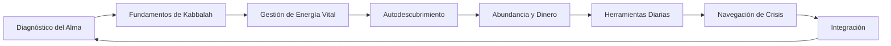
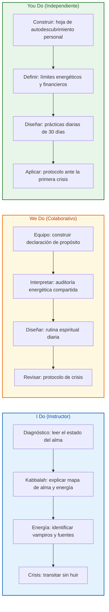
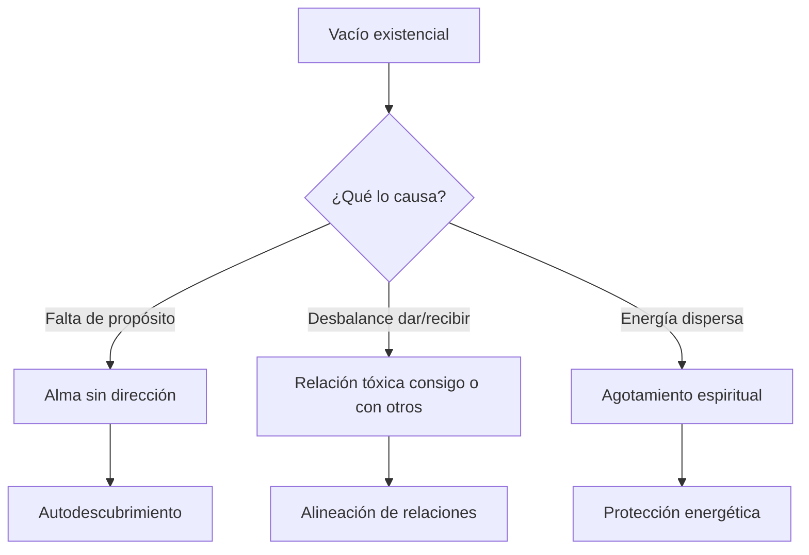
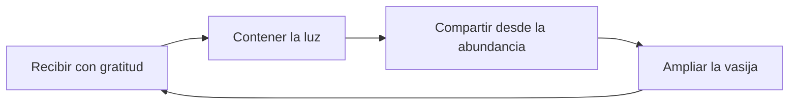

## ¿Qué vas a aprender

En este contenido desarrollarás una comprensión práctica de la sabiduría de la Kabbalah aplicada a la vida cotidiana:

- Diagnosticar tu estado interior y reconocer las señales del alma en busca de propósito
- Entender los fundamentos de la Kabbalah como mapa de la realidad oculta y tu lugar en ella
- Proteger y administrar tu energía vital frente a personas, hábitos y pensamientos que la drenan
- Descubrir tu propósito a partir de heridas, pasiones, valores y experiencias de dar
- Alinear abundancia y dinero con sanación emocional y servicio al prójimo
- Instalar prácticas diarias de aceptación, oración del corazón y meditación
- Transitar crisis con conciencia, dejando de huir del dolor que suele contener la luz más grande


# MASTERCLASS: Kabbalah y Propósito Vital — Descubrir tu Alma, Administrar tu Energía y Servir con el Rabino Daniel Chapán

## INTRODUCCIÓN: POR QUÉ ESTA MASTERCLASS ES DIFERENTE

La mayoría de los enfoques de desarrollo personal empiezan por la productividad, la mentalidad o las metas. Esta masterclass empieza por una pregunta más antigua y más urgente: ¿para qué está tu alma en este mundo?

En este episodio de Creadores Podcast, Daniel entrevista al Rabino Daniel Chapán, experto en Kabbalah. Su enseñanza no es teológica abstracta. Es un sistema práctico para entender la vida, la energía, el dinero, las relaciones y las crisis como oportunidades de crecimiento espiritual.

La insatisfacción moderna no siempre nace de falta de éxito. Muchas veces nace de ignorar el alma. Puedes tener logros, seguidores, ingresos y aún sentir un vacío que ninguna meta llena. La Kabbalah propone que ese vacío no es un defecto: es una señal de que hay un propósito por descubrir.

La energía vital es tu recurso más valioso. No solo la energía física, sino la capacidad de atención, entusiasmo, claridad y conexión. Cuando desperdicias energía en relaciones tóxicas, pensamientos obsessivos o hábitos destructivos, te quedas sin "aceite" para lo que realmente importa.

La abundancia no es solo un resultado económico. Es un flujo que se abre desde la sanación emocional, el propósito claro y la voluntad de servir. El dinero, en este marco, es un canal de energía divina que debe circular, no acumularse desde el miedo.

Las crisis no son castigos. Son invitaciones. En Kabbalah se enseña que la luz más grande a menudo está oculta en el lugar más oscuro. Cuando dejas de huir y aprendes a transitar el proceso, recuperas partes de tu alma que habías abandonado.

> **Objetivo de Aprendizaje** — Al final de esta guía, podrás diagnosticar tu estado espiritual, diseñar prácticas diarias de conexión con tu propósito, proteger tu energía vital, alinear abundancia con servicio y navegar crisis con conciencia.

> **Advertencia educativa** — Este contenido es formativo y espiritual. No sustituye asesoría religiosa, psicológica, financiera ni médica profesional. Úsalo como marco de reflexión, autoconocimiento y acción personal.

---

## MAPA DEL WORKFLOW DE PROPÓSITO VITAL



| Fase | Pregunta que responde | Output principal |
|------|-----------------------|------------------|
| **Diagnóstico del Alma** | ¿En qué estado está mi alma hoy? | Mapa de vacío, deseo y dirección |
| **Fundamentos de Kabbalah** | ¿Qué mapa espiritual estoy usando? | Conceptos operativos del alma, cuerpo, dar y recibir |
| **Gestión de Energía Vital** | ¿Qué drena o nutre mi energía? | Auditoría energética personal |
| **Autodescubrimiento** | ¿Cuál es mi propósito específico? | Hoja de trabajo con heridas, pasiones, valores y experiencias de dar |
| **Abundancia y Dinero** | ¿Cómo fluye la abundancia en mi vida? | Alineación financiera con propósito |
| **Herramientas Diarias** | ¿Qué prácticas me mantienen conectado? | Rutina espiritual mínima |
| **Navegación de Crisis** | ¿Cómo transito el dolor sin huir? | Protocolo de crisis personal |
| **Integración** | ¿Cómo vivo esto en los próximos 30 días? | Hoja de ruta y checklist final |



---

## PARTE 1: DIAGNÓSTICO DEL ALMA — ENTENDER TU ESTADO ACTUAL

### 1.1 Principio Central

La insatisfacción moderna surge cuando vives como si solo existieras para producir, consumir y lograr. La Kabbalah propone que eres un alma con un propósito específico, y que muchos de los síntomas de vacío, ansiedad o desorientación son señales de que tu alma necesita ser escuchada.

El diagnóstico no busca un problema médico. Busca honestidad: ¿dónde estás dando de más sin recibir? ¿dónde estás recibiendo sin dar? ¿qué parte de tu vida se siente mecánica, vacía o forzada?



### 1.2 Diagnóstico interior

| Síntoma | Lectura espiritual | Pregunta de exploración |
|---------|--------------------|-------------------------|
| **Vacío persistente** | El alma pide propósito | ¿Para qué siento que estoy acá? |
| **Agotamiento sin causa física** | Energía drenada | ¿Qué o quién consume mi energía? |
| **Éxito que no satisface** | Logros desconectados del alma | ¿Estoy construyendo lo que realmente quiero? |
| **Relaciones vacías** | Dar o recibir sin conexión | ¿Dónde doy por obligación? ¿Dónde recibo sin gratitud? |
| **Miedo al dinero** | Creencia de escasez | ¿Veo la abundancia como canal o como amenaza? |
| **Huir del dolor** | Oportunidad de luz escondida | ¿Qué crisis estoy evitando transitar? |

### 1.3 Cuestionario de autoevaluación

Responde con sinceridad. No hay respuestas correctas, solo información honesta.

```text
□ Siento que hay algo más que debería estar haciendo, aunque no sé qué es.
□ Me cuesta levantarme con entusiasmo, aunque duerma bien.
□ Tengo logros, pero siento que me falta algo esencial.
□ Algunas relaciones me dejan más vacío que lleno.
□ Doy mucho a otros y me cuesta recibir.
□ Recibo mucho pero siento que no aporto lo suficiente.
□ El dinero me genera ansiedad aunque tenga lo necesario.
□ Cuando algo duele, busco distraerme rápidamente.
□ Tengo dificultad para estar en silencio conmigo mismo.
□ Siento que mi vida tiene un propósito más grande del que estoy viviendo.
```

### 1.4 I Do — Leer el estado del alma

**Objetivo:** reconocer las señales del alma sin juzgarlas.

| Paso | Acción | Resultado |
|------|--------|-----------|
| 1 | Leer el cuestionario en voz alta | Conciencia |
| 2 | Marcar las frases que resuenan | Síntomas activos |
| 3 | Agrupar en vacío, desbalance o dispersión | Patrón principal |
| 4 | Escribir una frase sobre qué pide el alma | Dirección inicial |
| 5 | Decidir una acción de cuidado inmediata | Primer paso |

### 1.5 We Do — Interpretar un caso

**Caso:** una persona tiene un buen trabajo, ingresos estables y una familia, pero siente vacío todos los días.

| Síntoma | Lectura | Siguiente pregunta |
|---------|---------|--------------------|
| Vacío persistente | El alma no siente que su trabajo sirva a su propósito | ¿Qué le gustaría crear o servir? |
| Agotamiento emocional | Da energía a tareas que no conectan con su valor | ¿Qué actividad le devuelve energía? |
| Éxito vacío | Confunde estabilidad con sentido | ¿Qué legado quiere construir? |

### 1.6 You Do — Tu diagnóstico inicial

Completa:

```text
El vacío más frecuente en mi vida aparece cuando: __________________________

Siento que doy de más en: _________________________________________________

Siento que recibo sin dar en: _____________________________________________

Mi alma parece pedir: ____________________________________________________

Una acción de cuidado que puedo hacer hoy es: _____________________________
```

---

## PARTE 2: LA CIENCIA DE LO ESPIRITUAL — FUNDAMENTOS DE KABBALAH

### 2.1 Principio Central

Kabbalah no es magia ni superstición. Es un sistema para entender los mecanismos ocultos de la realidad: el alma, el cuerpo, la luz divina, el dar, el recibir y la corrección espiritual.

Según esta enseñanza, el ser humano es un recipiente creado para recibir luz. El propósito de la vida no es rechazar el mundo, sino transformar la recepción egoísta en recepción consciente para compartir. Eso es lo que la Kabbalah llama corrección o tikún.

### 2.2 Conceptos fundamentales

| Concepto | Definición práctica | Aplicación en la vida |
|----------|---------------------|------------------------|
| **Alma** | Parte de lo divino que habita en el cuerpo | Escuchar sus señales de vacío, pasión y servicio |
| **Cuerpo** | Vehículo del alma en este mundo | Cuidarlo como instrumento de propósito |
| **Luz divina** | Energía creadora y sustento | Abrirse a recibir para compartir |
| **Dar** | Compartir desde la abundancia | Servir, aportar, acompañar |
| **Recibir** | Recibir con gratitud y conciencia | Aceptar ayuda, amor, dinero, descanso |
| **Tikún** | Corrección o perfeccionamiento espiritual | Trabajar las heridas como camino de crecimiento |
| **Vasija** | Capacidad de contener luz | Ampliar la capacidad de recibir sin quebrarse |
| **Klippá** | Cáscara o bloqueo espiritual | Reconocer egoísmo, miedo o apego que tapan la luz |

### 2.3 Dar y recibir como circuito

La vida espiritual sana funciona como un circuito. Cuando solo recibes, te conviertes en recipiente cerrado. Cuando solo das, te vacías. El equilibrio no es estático: es un flujo consciente.



### 2.4 Reflexión guiada sobre propósito

```text
1. ¿Qué actividad haces en la que pierdes la noción del tiempo?
2. ¿Qué problema ajeno te duele de forma personal?
3. ¿Qué tema te genera una mezcla de pasión y miedo?
4. ¿Qué experiencia de dar te hizo sentir más vivo?
5. ¿Qué herida personal transformarías en servicio si pudieras?
```

### 2.5 I Do — Explicar el mapa de la realidad

**Objetivo:** comprender los conceptos básicos de Kabbalah como herramientas de lectura interior.

| Paso | Acción | Resultado |
|------|--------|-----------|
| 1 | Leer cada concepto en voz alta | Claridad |
| 2 | Elegir el concepto que más resuena hoy | Foco |
| 3 | Buscar una situación reciente donde apareció | Aplicación |
| 4 | Escribir qué enseñanza le ofrece | Reflexión |

### 2.6 We Do — Aplicar conceptos a una situación

**Caso:** alguien rechaza un regalo porque siente que no se lo merece.

| Concepto | Lectura | Acción |
|----------|---------|--------|
| Recibir | Dificultad para ser vasija | Practicar aceptar sin culpa |
| Luz divina | El regalo puede ser un canal de sustento | Reconocer que recibir también es sagrado |
| Tikún | La herida de merecimiento es área de trabajo | Trabajar la creencia de no ser digno |

### 2.7 You Do — Tu concepto activo

Completa:

```text
El concepto de Kabbalah que más resuena en mi vida ahora es: _______________

Lo veo activo en esta situación: __________________________________________

La corrección o aprendizaje que me propongo es: ____________________________
```

---

## PARTE 3: GESTIÓN DE ENERGÍA VITAL — PROTEGER TU "ACEITE"

### 3.1 Principio Central

Tu energía vital es el activo más valioso. No es solo energía física: es tu capacidad de atención, entusiasmo, claridad, amor y creatividad. La Kabbalah enseña que cada persona tiene un "aceite" limitado y que debe administrarlo con sabiduría.

Muchas personas viven agotadas no porque trabajen demasiado, sino porque permiten que personas, pensamientos, hábitos y ambientes drenen su energía sin que ellos lo noten.

### 3.2 Vampiros energéticos vs. fuentes de energía

| Vampiros energéticos | Fuentes de energía |
|----------------------|--------------------|
| Relaciones que solo demandan | Relaciones que devuelven |
| Pensamientos obsessivos de culpa o rencor | Pensamientos de gratitud y propósito |
| Noticias y redes sin límite | Estudio, oración y meditación |
| Trabajo sin sentido | Trabajo alineado con valores |
| Comparación constante | Reconocimiento del propio camino |
| Alcohol, excesos y mal descanso | Descanso, movimiento y alimentación consciente |
| Decir que sí por obligación | Decir no con respeto |
| Vivir en el pasado o en la ansiedad futura | Presencia en el momento |

### 3.3 Auditoría energética personal

```text
□ Personas: ¿con quién termino más cansado de lo que empecé?
□ Pensamientos: ¿en qué pienso repetidamente sin resolver nada?
□ Ambientes: ¿dónde me siento más pesado?
□ Hábitos: ¿qué hago que me deja agotado aunque sea corto?
□ Trabajo: ¿qué tarea me roba más energía de la que devuelve?
□ Digital: ¿cuánto tiempo paso en pantallas sin intención?
□ Cuerpo: ¿duermo, como y me muevo de forma que me nutra?
```

### 3.4 I Do — Identificar un drenaje

**Objetivo:** reconocer un vampiro energético activo.

| Paso | Acción | Resultado |
|------|--------|-----------|
| 1 | Revisar la lista de vampiros | Conciencia |
| 2 | Elegir el que más aparece esta semana | Foco |
| 3 | Anotar cuánto tiempo o energía consume | Medición |
| 4 | Definir un límite inicial | Acción |

### 3.5 We Do — Rediseñar un día

**Caso:** una persona termina cada día agotada y no sabe por qué.

| Horario | Actividad actual | Energía que produce | Rediseño |
|---------|------------------|---------------------|----------|
| Mañana | Revisar redes antes de levantarse | Negativa | Esperar 30 minutos |
| Mediodía | Almorzar frente a la pantalla | Neutra | Comer sin pantallas |
| Tarde | Reunión con persona quejumbrosa | Negativa | Reducir frecuencia |
| Noche | Series hasta tarde | Negativa | Ritual de cierre |

### 3.6 You Do — Tu protección energética

Completa:

```text
Mi principal vampiro energético actual es: _________________________________

Aparece en este horario o situación: ______________________________________

Un límite que puedo establecer esta semana es: ____________________________

Una fuente de energía que quiero cultivar es: ______________________________

Mi ritual de protección diaria será: _______________________________________
```

---

## PARTE 4: METODOLOGÍA DE AUTODESCUBRIMIENTO

### 4.1 Principio Central

Tu propósito no está escondido en una montaña lejana. Está escrito en tu historia: en tus heridas, tus pasiones, tus valores y en los momentos en los que dar te hizo sentir más vivo.

La metodología propone cuatro componentes para descubrirlo: las tres heridas principales, los talentos y pasiones, los valores no negociables y las experiencias de satisfacción al dar.

### 4.2 Los cuatro componentes del autodescubrimiento

| Componente | Qué explorar | Pregunta guía |
|------------|--------------|---------------|
| **Tres heridas** | Los dolores que marcaron tu vida | ¿Qué me dolió tanto que no quiero que otros sufran igual? |
| **Pasiones y talentos** | Lo que haces con facilidad y entusiasmo | ¿Qué hago en lo que pierdo la noción del tiempo? |
| **Valores** | Principios que no negocias | ¿Qué no estoy dispuesto a traicionar por dinero o aprobación? |
| **Siete experiencias de dar** | Momentos en los que servir te llenó | ¿Cuándo sentí que mi aporte hizo una diferencia real? |

### 4.3 Hoja de trabajo estructurada

```text
MIS TRES HERIDAS
1. __________________________________________________
2. __________________________________________________
3. __________________________________________________

¿Qué transformaría cada una en servicio?
1. __________________________________________________
2. __________________________________________________
3. __________________________________________________

MIS PASIONES Y TALENTOS
1. __________________________________________________
2. __________________________________________________
3. __________________________________________________

MIS VALORES NO NEGOCIABLES
1. __________________________________________________
2. __________________________________________________
3. __________________________________________________

MIS EXPERIENCIAS DE SATISFACCIÓN AL DAR
1. __________________________________________________
2. __________________________________________________
3. __________________________________________________
4. __________________________________________________
5. __________________________________________________
6. __________________________________________________
7. __________________________________________________
```

### 4.4 I Do — Encontrar el hilo del propósito

**Objetivo:** conectar heridas, pasiones, valores y experiencias de dar.

| Paso | Acción | Resultado |
|------|--------|-----------|
| 1 | Escribir las tres heridas | Material emocional |
| 2 | Listar pasiones y talentos | Recursos naturales |
| 3 | Definir valores no negociables | Límites éticos |
| 4 | Recordar experiencias de dar | Evidencia de propósito |
| 5 | Buscar el punto de intersección | Frase de propósito |

### 4.5 We Do — Construir una frase de propósito

**Caso:** una persona sufrió soledad infantil, tiene talento para escuchar, valora la honestidad y sintió plenitud al acompañar a un amigo en crisis.

| Componente | Entrada |
|------------|---------|
| Herida | Soledad no acompañada |
| Pasión | Escuchar y orientar |
| Valor | Honestidad |
| Experiencia de dar | Acompañar a alguien en crisis |
| Propósito | "Acompañar a personas para que no estén solas en sus procesos" |

### 4.6 You Do — Tu frase de propósito

Completa:

```text
Mi herida principal transformada en servicio es: __________________________

Mi talento clave es: _____________________________________________________

Mi valor no negociable es: _______________________________________________

Mi propósito expresado en una frase es:
"______________________________________________________________________"
```

---

## PARTE 5: ABUNDANCIA Y DINERO — EL CANAL DIVINO

### 5.1 Principio Central

La abundancia fluye desde la sanación emocional y el propósito de servicio. En Kabbalah, el dinero no es malo ni bueno: es un canal de energía divina. El problema aparece cuando se convierte en fin en sí mismo o cuando la creencia de escasez bloquea su fluidez.

Muchas personas trabajan por dinero desde el miedo, acumulan desde la inseguridad o lo rechazan por culpa. La abundancia sana requiere alinear el dinero con el propósito, recibir con gratitud y compartir con generosidad.

### 5.2 Secretos de riqueza vs. creencias limitantes

| Secretos de riqueza | Creencias limitantes |
|---------------------|----------------------|
| El dinero es canal de servicio | El dinero es la raíz de todos los males |
| Recibir es parte del circuito sagrado | No merezco recibir más de lo que tengo |
| Abundancia fluye desde el propósito | Debo sacrificarme para ganar dinero |
| Dar genera circulación | Si doy, me quedaré sin nada |
| El dinero refleja sanación emocional | El dinero llega solo para quienes ya lo tienen |
| Ahorrar desde la tranquilad, no desde el miedo | Debo acumular por si acaso |
| Invertir en crecimiento propio | Gastar en mí es egoísta |

### 5.3 Alineación financiera

```text
1. ¿Cuánto dinero entra por mes?
2. ¿Cuánto sale?
3. ¿Qué porcentaje va a necesidades básicas?
4. ¿Qué porcentaje va a crecimiento personal o espiritual?
5. ¿Qué porcentaje va a servicio o generosidad?
6. ¿El dinero que gano está alineado con mi propósito?
7. ¿Qué creencia sobre el dinero más me limita?
8. ¿Qué acción puedo tomar esta semana para alinear mi dinero con mi alma?
```

### 5.4 I Do — Detectar una creencia limitante

**Objetivo:** identificar qué historia interna bloquea la abundancia.

| Paso | Acción | Resultado |
|------|--------|-----------|
| 1 | Leer la tabla de creencias | Conciencia |
| 2 | Elegir la que más repites | Creencia activa |
| 3 | Preguntar de dónde viene | Origen |
| 4 | Escribir una afirmación de corrección | Tikún financiero |

### 5.5 We Do — Rediseñar un presupuesto con propósito

**Caso:** una persona gana bien pero siente que el dinero se va sin sentido.

| Categoría | Porcentaje actual | Porcentaje propuesto |
|-----------|-------------------|----------------------|
| Necesidades básicas | 60% | 55% |
| Crecimiento personal | 5% | 10% |
| Servicio o generosidad | 0% | 5% |
| Ahorro tranquilo | 20% | 20% |
| Disfrute consciente | 15% | 10% |

### 5.6 You Do — Tu alineación financiera

Completa:

```text
Mi creencia limitante sobre el dinero es: _________________________________

Esa creencia me hace: ____________________________________________________

Una creencia de abundancia que elijo cultivar es: __________________________

Esta semana destinaré esta cantidad o porcentaje a servir: ________________

El dinero que recibo me ayuda a cumplir este propósito: ____________________
```

---

## PARTE 6: HERRAMIENTAS PARA LA VIDA DIARIA

### 6.1 Principio Central

El crecimiento espiritual no ocurre solo en momentos extraordinarios. Ocurre en la estructura diaria. La Kabbalah propone tres herramientas fundamentales: la aceptación, la oración del corazón y la meditación.

Cada una cumple una función diferente. La aceptación detiene la resistencia. La oración del corazón conecta con lo divino desde la emoción. La meditación aquieta la mente para que la luz pueda entrar.

### 6.2 Herramientas diarias

| Herramienta | Función | Práctica mínima |
|-------------|---------|-----------------|
| **Aceptación** | Dejar de resistir lo que no puedo cambiar | Decir "esto también es para mi bien" ante lo difícil |
| **Oración del corazón** | Conectar con lo divino desde la emoción | Pedir ayuda con sinceridad, no con fórmula |
| **Meditación** | Aquietar la mente y abrir la vasija | 5 minutos de respiración y presencia |
| **Gratitud** | Reconocer la luz recibida | Tres bendiciones antes de dormir |
| **Estudio** | Alimentar la mente espiritual | Leer un texto sagrado o de sabiduría |
| **Acción consciente** | Convertir lo cotidiano en servicio | Hacer una tarea con intención de dar |

### 6.3 Rutina espiritual mínima

```text
MAÑANA (5 minutos)
1. Respiro tres veces conscientemente.
2. Doy gracias por un nuevo día.
3. Pido ayuda para servir a mi propósito hoy.

DURANTE EL DÍA (momentos breves)
1. Ante una dificultad, practico aceptación.
2. Antes de una decisión importante, hago una pausa.
3. Cuando doy algo, lo hago con intención.

NOCHE (5 minutos)
1. Repaso tres bendiciones del día.
2. Reconozco una corrección o aprendizaje.
3. Entrego el día y descanso.
```

### 6.4 I Do — Instalar una pausa de aceptación

**Objetivo:** practicar aceptación ante una situación incómoda.

| Paso | Acción | Resultado |
|------|--------|-----------|
| 1 | Recordar una situación difícil reciente | Material |
| 2 | Reconocer la resistencia interna | Honestidad |
| 3 | Decir "acepto que esto está pasando" | Apertura |
| 4 | Preguntar "¿qué me enseña?" | Dirección |

### 6.5 We Do — Diseñar una oración del corazón

**Caso:** una persona siente miedo antes de un cambio importante.

| Elemento | Ejemplo |
|----------|---------|
| Emoción honesta | Tengo miedo |
| Pedido sincero | Necesito claridad y valentía |
| Confianza | Confío en que hay un propósito |
| Entrega | Hago mi parte y suelto el resultado |

### 6.6 You Do — Tu rutina espiritual de 7 días

Completa:

```text
Mi práctica matutina será: _______________________________________________

Mi práctica nocturna será: _______________________________________________

La herramienta que más necesito cultivar es: ______________________________

El momento del día en que más me desconecto es: ____________________________

Ahí practicaré: __________________________________________________________
```

---

## PARTE 7: NAVEGANDO CRISIS — TRANSITAR HASTA EL FINAL

### 7.1 Principio Central

Las crisis son inevitables, pero la forma de atravesarlas no. En Kabbalah se enseña que la luz más grande a menudo está escondida en el lugar más oscuro. Cuando huimos del dolor, perdemos la oportunidad de recibir esa luz.

Transitar una crisis no significa romantizar el sufrimiento. Significa dejar de resistirlo, sostenerlo con conciencia y permitir que haga su trabajo de transformación.

### 7.2 Fases de una crisis vs. estrategias de Kabbalah

| Fase de la crisis | Tendencia natural | Estrategia de Kabbalah |
|-------------------|-------------------|------------------------|
| **Impacto** | Negación o shock | Respirar y aceptar que algo cambió |
| **Caos** | Buscar culpables | Ver la crisis como espejo de corrección |
| **Oscuridad** | Huir o distraerse | Sostener la pregunta "¿qué debo aprender?" |
| **Revelación** | Querer respuestas rápidas | Escuchar en silencio |
| **Integración** | Volver a la normalidad | Incorporar el aprendizaje en la vida |
| **Servicio** | Cerrar el capítulo | Compartir lo aprendido con otros |

### 7.3 Protocolo de crisis personal

```text
PASO 1: NO HUYAS
Respiro y reconozco que estoy en una crisis.

PASO 2: NOMBRA LO QUE SIENTES
Escribo: "Siento __________ porque __________."

PASO 3: PREGUNTA QUÉ TE CORRIGE
"¿Qué parte de mí pide ser transformada?"

PASO 4: BUSCA LA LUZ
"¿Qué bendición o aprendizaje puede venir de aquí?"

PASO 5: ACTÚA DESDE EL PROPÓSITO
"¿Cuál es el siguiente paso más alineado con mi alma?"

PASO 6: PIDE AYUDA
Hablo con alguien de confianza o pido orientación.

PASO 7: INTEGRA
Escribo qué aprendí y cómo vivo diferente a partir de ahora.
```

### 7.4 I Do — Aplicar el protocolo a una crisis pasada

**Objetivo:** entender el valor de una crisis ya transitada.

| Paso | Acción | Resultado |
|------|--------|-----------|
| 1 | Elegir una crisis pasada | Material |
| 2 | Describir qué se sintió | Honestidad |
| 3 | Identificar qué se aprendió | Aprendizaje |
| 4 | Reconocer cómo cambió tu vida | Integración |

### 7.5 We Do — Acompañar a alguien en crisis

**Caso:** un amigo acaba de perder su trabajo.

| Qué no hacer | Qué sí hacer |
|----------------|--------------|
| Darle una solución inmediata | Escuchar sin juzgar |
| Minimizar su dolor | Validar lo que siente |
| Contar tu historia similar | Preguntar qué necesita |
| Forzarlo a ver el lado positivo | Recordarle que puede pedir ayuda |

### 7.6 You Do — Tu protocolo de crisis

Completa:

```text
La crisis que estoy transitando o temo transitar es: _______________________

Lo que más me cuesta de ella es: __________________________________________

La corrección que puede estar pidiendo mi alma es: _________________________

La luz que podría encontrar al otro lado es: ______________________________

El siguiente paso más alineado con mi propósito es: ________________________

La persona o recurso al que puedo acudir es: _______________________________
```

---

## PARTE 8: INTEGRACIÓN Y CIERRE

### 8.1 Resumen del sistema completo

El propósito vital no se encuentra una vez y para siempre. Es un camino de escucha continua. El sistema completo se resume así:

1. Diagnosticar el estado del alma.
2. Usar el mapa de la Kabbalah para leer la realidad.
3. Proteger la energía vital.
4. Descubrir el propósito desde heridas, pasiones, valores y dar.
5. Alinear el dinero con el servicio.
6. Practicar herramientas diarias.
7. Transitar las crisis hasta el final.

### 8.2 Hoja de ruta personal de 30 días

| Semana | Enfoque | Acción principal |
|--------|---------|------------------|
| **Semana 1** | Diagnóstico | Completar autoevaluación y hoja de autodescubrimiento |
| **Semana 2** | Energía | Hacer auditoría energética y establecer un límite |
| **Semana 3** | Propósito y dinero | Escribir frase de propósito y alinear una categoría financiera |
| **Semana 4** | Práctica e integración | Instalar rutina espiritual mínima y protocolo de crisis |

### 8.3 Checklist final de integración

```text
□ Tengo una frase clara de propósito.
□ Identifiqué al menos un vampiro energético y establecí un límite.
□ Reconocí una creencia limitante sobre el dinero.
□ Definí una rutina espiritual mínima diaria.
□ Tengo un protocolo de crisis personal.
□ Compartí mi propósito con al menos una persona de confianza.
□ Me comprometo a revisar mi progreso cada semana.
```

---

## CHECKLIST FINAL DE DOMINIO

| Bloque | Check |
|--------|-------|
| Diagnóstico del Alma | Reconozco las señales de vacío, desbalance y dispersión |
| Fundamentos de Kabbalah | Entiendo los conceptos de alma, vasija, luz, dar, recibir y tikún |
| Gestión de Energía Vital | Identifico vampiros energéticos y fuentes de energía |
| Autodescubrimiento | Tengo una frase de propósito basada en heridas, pasiones, valores y dar |
| Abundancia y Dinero | Alineo el dinero con el propósito y la generosidad |
| Herramientas Diarias | Practico aceptación, oración del corazón y meditación |
| Navegación de Crisis | Transito el dolor sin huir y busco su luz oculta |
| Integración | Tengo una hoja de ruta de 30 días y un sistema de revisión |

---

## Preguntas de Verificación 📝

Responde cada pregunta basándote en los conceptos de esta master class. Escribe tus respuestas o compártelas para profundizar tu aprendizaje.

1. **Aplica**: Si sientes vacío persistente a pesar de tener estabilidad, ¿qué diagnóstico espiritual harías y qué primera acción propondrías?

2. **Analiza**: ¿Cuál es la diferencia práctica entre dar desde la abundancia y dar desde el vaciamiento?

3. **Diseña**: Crea una rutina espiritual mínima de 10 minutos al día usando aceptación, oración del corazón y meditación.

4. **Reflexiona**: ¿Qué herida personal podrías transformar en un servicio para otros? ¿Qué pasos concretos darías?

5. **Calcula**: Revisa tus gastos del último mes. ¿Qué porcentaje está alineado con tu propósito y qué porcentaje responde al miedo o a la inercia?

6. **Evalúa**: ¿Qué vampiro energético tiene mayor impacto en tu vida actual? ¿Qué límite saludable podrías establecer?

7. **Conecta**: Explica cómo la gestión de la energía vital se relaciona con la capacidad de cumplir tu propósito.

8. **Propón**: Diseña un protocolo de crisis para una situación difícil que estás viviendo o temes vivir.

9. **Sintetiza**: Resume en una frase el propósito de tu alma según lo que descubriste en esta guía.

10. **Reflexión final**: De los siete bloques del workflow, ¿cuál consideras el más urgente para tu vida hoy y por qué?

## GLOSARIO RÁPIDO

| Término | Definición |
|---------|------------|
| **Alma** | Parte divina e inmortal que habita en el ser humano y busca cumplir su propósito |
| **Vasija** | Capacidad interior para recibir y contener luz divina |
| **Luz divina** | Energía creadora, sustento y bendición que fluye hacia quien puede recibirla |
| **Dar** | Compartir desde la abundancia, el propósito y el amor |
| **Recibir** | Aceptar con gratitud lo que la vida y lo divino ofrecen |
| **Tikún** | Corrección espiritual; trabajo de transformar heridas en sabiduría |
| **Klippá** | Cáscara o bloqueo que cubre la luz, como el egoísmo, el miedo o el apego |
| **Kabbalah** | Sabiduría mística judía que estudia los mecanismos ocultos de la realidad y el alma |
| **Energía vital** | Recurso interior de atención, entusiasmo, claridad y conexión espiritual |
| **Vampiro energético** | Persona, hábito, pensamiento o situación que drena la energía vital |
| **Oración del corazón** | Oración sincera y emocional, sin fórmulas, dirigida a lo divino |
| **Aceptación** | Práctica de dejar de resistir lo que no se puede cambiar para abrirse al aprendizaje |
| **Meditación** | Práctica de aquietar la mente y abrir la conciencia a la presencia divina |
| **Abundancia** | Flujo de recursos alineado con propósito, sanación y servicio |
| **Propósito vital** | Misión específica del alma en este mundo, descubierta desde la historia personal |
