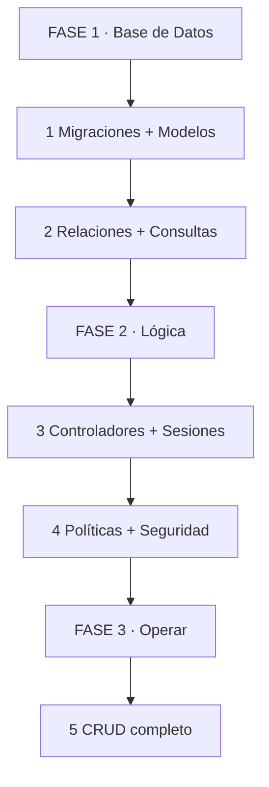
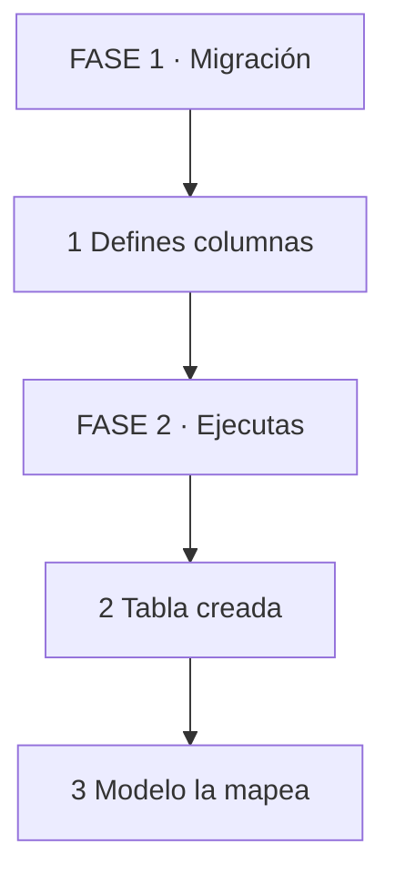
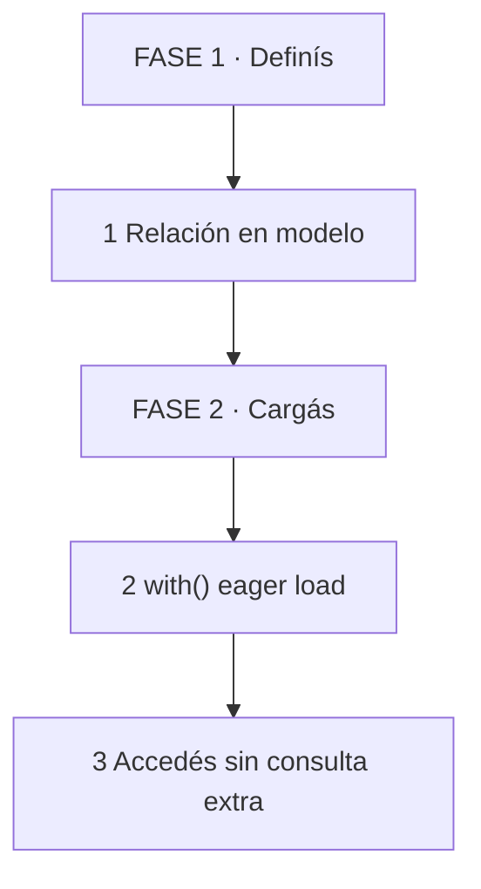
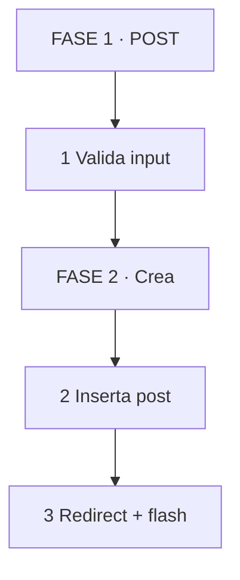
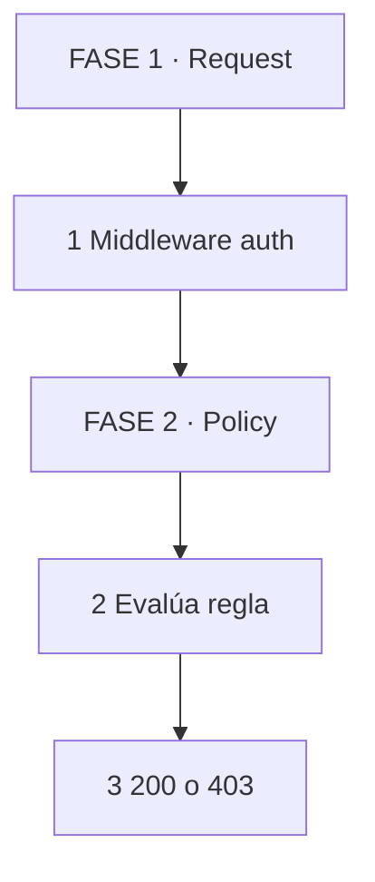
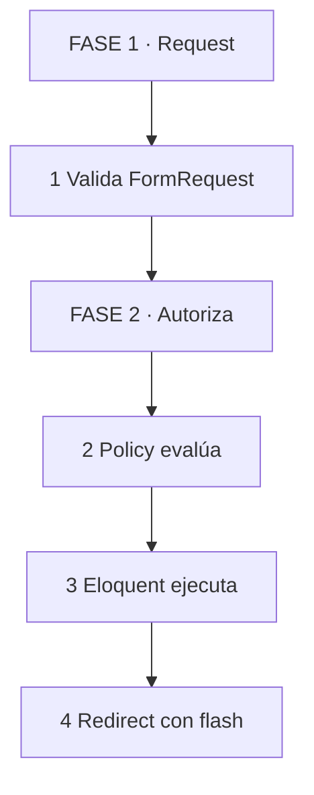
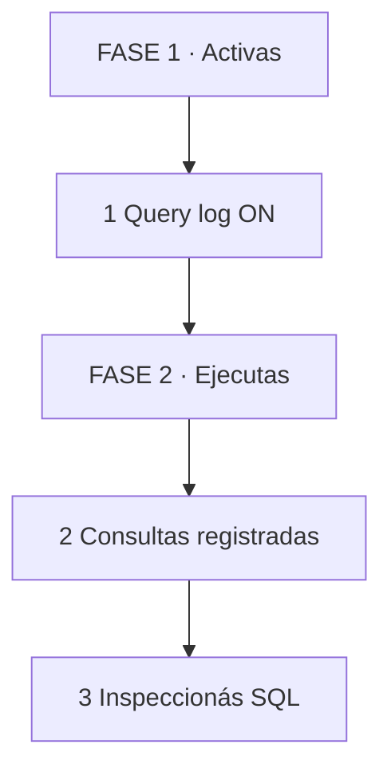

# 🛡️ Guía: Base de Datos y Eloquent, Lógica de Negocio y Seguridad en Laravel

## 🗺️ MAPA DE LA GUÍA 🧭

*Se lee de arriba hacia abajo. Empiezas en FASE 1, bajas hasta FASE 3. No es un ciclo.*

| 🧩 Fase | ❓ Pregunta que responde | 📤 Resultado principal |
|---------|------------------------|------------------------|
| **FASE 1 · Base de Datos** | ¿Cómo diseño tablas y modelos sin fugas? | Estructura sólida |
| **FASE 2 · Lógica** | ¿Cómo protejo rutas y controlo la mutación? | Acceso seguro |
| **FASE 3 · Operar** | ¿Cómo hago CRUD productivo y testeable? | Sistema funcional |

*Se lee de izquierda a derecha. I muestra 1 caso, W lo haces acompañado, Y lo haces solo con checklist.*

> **🎯 Objetivo de Aprendizaje** — Al final podrás diseñar migraciones limpias, mapear modelos con relaciones, resolver el problema N+1, construir controladores CRUD con policies, y manejar mensajes de sesión sin fugas de seguridad.
> **⚠️ Advertencia operativa** — Nunca expongas datos sensibles en sesiones. Siempre autoriza con policies, no con `if` sueltos en controladores.

---

## 🧩 PARTE 1: MIGRACIONES Y MODELOS — EL CONTRATO DE LA BASE 🧩

### 1.1 ❓ PRETEST

¿Qué diferencia hay entre una migración `create_table` y un modelo Eloquent?

> Respuesta esperada: La migración define el schema SQL (columnas, tipos, índices). El modelo Eloquent mapea esa tabla a objetos PHP con métodos y relaciones.
> Si acertás: camino rápido → andá al punto 7.

### 1.2 🎯 POR QUÉ + LOGRO

Importa porque **las migraciones son el único lugar donde el schema se versiona y se comparte**. Un tipo mal definido rompe deploy, un índice faltante arrastra consultas. Vas a lograr **diseñar tablas que nunca necesitan migración correctiva**.

### 1.3 ⚡ VICTORIA RÁPIDA (<5 min)

Escribí una migración para `posts` con `id`, `title` string, `body` text, `timestamps`. Ejecutá `php artisan migrate`. Si ves la tabla en tu cliente SQL, ganaste.

### 1.4 💡 CONCEPTO

Analogía: Una migración es como **el plano de una casa** — define dónde va cada pared, puerta y ventana antes de construir. El modelo es la casa terminada: vivís en ella, la decorás, pero no cambiás el plano después.

Definición: Las migraciones son archivos PHP que definen schema SQL de forma versionada. Los modelos Eloquent son clases que mapean tablas a objetos, definen castings, relaciones y comportamiento. Juntos forman el ORM de Laravel.

### 1.5 👀 EJEMPLO RESUELTO

| Paso | Tú ves | Qué pasa dentro | Ejemplo |
|------|--------|-----------------|---------|
| 1 Creás migración | `create_posts_table` | Archivo con método `up()` | Columnas y tipos |
| 2 Ejecutás | `php artisan migrate` | SQL ejecutado en DB | Tabla creada |
| 3 Creás modelo | `Post` extends `Model` | Mapeo a tabla `posts` | `$fillable` definido |

*Se lee de arriba hacia abajo. Definís el plano, ejecutás, el modelo lo usa.*

### 1.6 ⚠️ CONTRA-EJEMPLO / Error Típico

Error: Olvidar `$fillable` en el modelo y usar `$guarded = []` por comodidad. Cualquier input del usuario puede escribir columnas internas como `is_admin` o `deleted_at`.

Corrección: Define `$fillable` explícito. Solo `title`, `body`, `user_id` son asignables masivamente. El resto requiere asignación manual o un Form Request específico.

### 1.7 🧪 PRÁCTICA

Diseñá una migración para `comments` con `id`, `post_id` entero, `body` texto, `timestamps`. Agregá un índice en `post_id`. Luego creá el modelo `Comment` con `$fillable` en `body` y `post_id`.

> Respuesta esperada / criterio: La migración debe tener `foreignId('post_id')` o `unsignedInteger`, el índice compuesto o simple en `post_id`, y el modelo debe tener `$fillable` sin `$guarded = []`.

### 1.8 🔁 RECALL — Nivel Bloom: Aplicar

¿Por qué `$fillable` es una barrera de seguridad y no solo una comodidad?

### 1.9 📌 IDEA CLAVE

Migraciones versionan schema, modelos mapean comportamiento. `$fillable` es tu firewall de asignación masiva.

### 1.10 ✅ AUTO-CHEQUEO + SIGUIENTE

- [ ] Creé 1 migración con columnas e índice correcto
- [ ] El modelo tiene `$fillable` explícito
- [ ] Entiendo por qué `$guarded = []` es un riesgo

Siguiente: Relaciones y cómo evitamos el problema N+1.

---

## 🧩 PARTE 2: RELACIONES Y CONSULTAS — EL ARTE DE NO CONSULTAR DEMÁS 🧩

### 2.1 ❓ PRETEST

Un `Post` tiene muchos `Comment`. Escribí la relación en el modelo `Post` y la consulta para traer todos los comments de un post.

> Respuesta esperada: `public function comments() { return $this->hasMany(Comment::class); }` y `$post->comments()->get()` o `$post->comments`.
> Si acertás: camino rápido → andá al punto 7.

### 2.2 🎯 POR QUÉ + LOGRO

Importa porque **las relaciones mal usadas generan el problema N+1**: 1 consulta por modelo padre + N consultas por cada relación. En una lista de 50 posts, eso es 51 consultas cuando puede ser 2. Vas a lograr **escribir consultas elegantes que golpean la base la mínima cantidad de veces**.

### 2.3 ⚡ VICTORIA RÁPIDA (<5 min)

Ejecutá esta consulta mental: `SELECT * FROM posts LIMIT 10;` (1 consulta). Ahora accedé a `$post->author->name` en un loop sin `with()`. Son 10 consultas más. Esa es la trampa.

### 2.4 💡 CONCEPTO

Analogía: Las relaciones son como **llaves de acceso a habitaciones contiguas**. Sin la llave correcta (`with`), entrás a cada habitación por separado. Con la llave, abrís todas las puertas de una sola pasada.

Definición: Eloquent define relaciones como métodos en el modelo: `hasMany`, `belongsTo`, `hasOne`, `belongsToMany`. Cada método devuelve un objeto `Relation` que permite consultar la tabla relacionada. `with()` carga relaciones eager. `load()` carga después. Ambos evitan N+1.

### 2.5 👀 EJEMPLO RESUELTO

| Paso | Tú ves | Qué pasa dentro | Ejemplo |
|------|--------|-----------------|---------|
| 1 Definís | `public function user()` | Relación belongsTo | `return $this->belongsTo(User::class);` |
| 2 Consultás | `Post::with('user')->get()` | JOIN implícito | 2 consultas |
| 3 Accedés | `$post->user->name` | Sin consulta extra | Datos en memoria |

*Se lee de arriba hacia abajo. Definís la relación, la cargas, accedés sin costo.*

### 2.6 ⚠️ CONTRA-EJEMPLO / Error Típico

Error: Recorrer 100 posts y dentro llamar a `$post->user->email` sin `with('user')`. Resultado: 101 consultas.

Corrección: `Post::with('user')->paginate(20)`. 2 consultas: 1 para posts, 1 para todos los users relacionados. Eloquent cachea los users por ID y asigna sin consultar de nuevo.

### 2.7 🧪 PRÁCTICA

Dada la relación `Comment belongsTo Post` y `Post hasMany Comment`, escribí la consulta eager para traer 20 posts con su autor y todos sus comments ordenados por fecha.

> Respuesta esperada / criterio: Debe usar `with(['user', 'comments'])` y `orderBy` dentro de la relación o como scope. Máximo 3 consultas.

### 2.8 🔁 RECALL — Nivel Bloom: Aplicar

¿Qué pasa si usás `with()` en una relación que no existe en el modelo?

### 2.9 📌 IDEA CLAVE

`with()` convierte N+1 en 2 consultas. Sin excusas, siempre en listas.

### 2.10 ✅ AUTO-CHEQUEO + SIGUIENTE

- [ ] Defino relaciones con `hasMany`, `belongsTo`
- [ ] Uso `with()` en toda lista paginada
- [ ] Detecto N+1 con `dd(DB::getQueryLog())` o Telescope

Siguiente: Sesiones y mensajes flash.

---

## 🧩 PARTE 3: SESIONES Y MENSAJES FLASH — COMUNICACIÓN SIN ESTADO 🧩

### 3.1 ❓ PRETEST

¿Qué diferencia hay entre `session()->put()` y `session()->flash()`?

> Respuesta esperada: `put()` persiste el dato en sesión hasta que se borra manualmente. `flash()` persiste solo para la próxima petición y luego se elimina automáticamente.
> Si acertás: camino rápido → andá al punto 7.

### 3.2 🎯 POR QUÉ + LOGRO

Importa porque **los mensajes flash son la única forma de comunicar éxito o error entre peticiones HTTP sin estado**. Un redirect sin flash deja al usuario sin feedback. Un `put()` mal usado deja datos sensibles en sesión por horas. Vas a lograr **manejar feedback de usuario limpio y seguro**.

### 3.3 ⚡ VICTORIA RÁPIDA (<5 min)

Enviá un post y redirigí con `return back()->with('success', 'Post creado');`. En la vista Blade, mostrá `session('success')`. Si ves el mensaje una vez y desaparece al recargar, ganaste.

### 3.4 💡 CONCEPTO

Analogía: Los mensajes flash son como **notas adhesivas de una sola lectura** — las pegás en la frente del usuario, las lee, y se caen solas. `session()->put()` es como escribir en una pizarra permanente: sigue ahí hasta que la borrás.

Definición: Laravel maneja sesiones por drivers: `file`, `cookie`, `database`, `redis`. Los mensajes flash usan la clave `_flash` interna. Se muestran con `session('key')` o `$errors` (validaciones). Nunca guardes datos sensibles sin cifrado.

### 3.5 👀 EJEMPLO RESUELTO

| Paso | Tú ves | Qué pasa dentro | Ejemplo |
|------|--------|-----------------|---------|
| 1 Validás | `$request->validate()` | Si falla, redirect con errores | `$errors` en sesión |
| 2 Guardás | `Post::create(...)` | Mutación en DB | ID generado |
| 3 Redirigís | `back()->with('success', ...)` | Flash guardado | Una próxima petición |

*Se lee de arriba hacia abajo. Recibís POST, validás, creás, redirigís con mensaje.*

### 3.6 ⚠️ CONTRA-EJEMPLO / Error Típico

Error: Guardar el `user_id` completo en sesión como mensaje de debug. Si la sesión se filtra, tenés un vector de ataque.

Corrección: Flash solo mensajes de usuario. IDs internos, tokens o emails van en la respuesta JSON o en logs con niveles adecuados.

### 3.7 🧪 PRÁCTICA

En un formulario de creación de post, implementá validación con mensaje de error flash y mensaje de éxito flash al crear. Ambos deben mostrarse en la misma vista de formulario.

> Respuesta esperada / criterio: Vista muestra `session('success')` y `$errors->first()`. Validación falla → flash de error. Validación pasa → flash de éxito + redirect.

### 3.8 🔁 RECALL — Nivel Bloom: Aplicar

¿Por qué `session()->reflash()` es útil en un flujo de pasos múltiples?

### 3.9 📌 IDEA CLAVE

Flash comunica feedback entre peticiones. Solo una vez. Nunca datos sensibles en sesión.

### 3.10 ✅ AUTO-CHEQUEO + SIGUIENTE

- [ ] Mensaje de éxito y error funcionan en POST/redirect/GET
- [ ] Uso `session('key')` y `$errors` en vistas
- [ ] No guardo datos sensibles en sesión

Siguiente: Controladores y autorización con Policies.

---

## 🧩 PARTE 4: CONTROLADORES Y POLICIES — QUIÉN PUEDE HACER QUÉ 🧩

### 4.1 ❓ PRETEST

¿Qué hace un Policy en Laravel y cuándo se ejecuta?

> Respuesta esperada: Un Policy es una clase que centraliza la autorización de un modelo. Laravel lo ejecuta automáticamente cuando usas `can:nombre` en rutas o `$this->authorize()` en controladores.
> Si acertás: camino rápido → andá al punto 7.

### 4.2 🎯 POR QUÉ + LOGRO

Importa porque **la autorización dispersa en controladores es el origen de bugs de seguridad**. Un `if ($user->role === 'admin')` olvidado en un método expone datos. Un Policy garantiza que cada acción del modelo pasa por la misma puerta. Vas a lograr **acceso seguro por recurso, no por método**.

### 4.3 ⚡ VICTORIA RÁPIDA (<5 min)

Ejecutá `php artisan make:policy PostPolicy --model=Post`. Laravel genera métodos como `view`, `create`, `update`, `delete`. Asigná el Policy al modelo con `protected $policies = [Post::class => PostPolicy::class];` en `AuthServiceProvider`. Configurá `Gate::before()` para super-admin.

### 4.4 💡 CONCEPTO

Analogía: Un Policy es como **el conserje de un edificio** — no decidís por qué piso entrás, el conserje revisa tu credencial y te dice sí/no. No importa si venís por escalera o ascensor, la regla es la misma.

Definición: Laravel separa autenticación (quién sos) de autorización (qué podés hacer). Policies son clases que agrupan reglas por modelo: `view`, `create`, `update`, `delete`, `restore`. Se registran en `AuthServiceProvider`. Gates son reglas arbitrarias sin modelo. Ambos usan el facade `Gate`.

### 4.5 👀 EJEMPLO RESUELTO

| Paso | Tú ves | Qué pasa dentro | Ejemplo |
|------|--------|-----------------|---------|
| 1 Registrás | `protected $policies` | Mapa modelo → policy | `AuthServiceProvider` |
| 2 Definís | `public function update()` | Regla de negocio | `return $user->id === $post->user_id;` |
| 3 Usás | `$this->authorize('update', $post)` | Gate evalúa | 403 si no |

*Se lee de izquierda a derecha. Request entra, Policy evalúa, acceso permitido o denegado.*

### 4.6 ⚠️ CONTRA-EJEMPLO / Error Típico

Error: Validar `$request->user_id === auth()->id()` en el controlador. Si olvidás un método, ese método queda sin protección.

Corrección: Todo controlador usa `$this->authorize()` o middleware `can:update,post`. La regla vive en un solo lugar: el Policy.

### 4.7 🧪 PRÁCTICA

Creá un `PostPolicy` con métodos `view`, `update`, `delete`. `view` permite si el post es público o el usuario es el autor. `update` y `delete` solo si es el autor. Asigná el Policy y usá `authorize()` en un controlador Resource.

> Respuesta esperada / criterio: Policy tiene los 3 métodos. Controlador usa `$this->authorize()` en `update` y `delete`. Vista pública funciona sin auth.

### 4.8 🔁 RECALL — Nivel Bloom: Aplicar

¿Por qué `Gate::before()` es útil para super-admins sin repetir lógica en cada método del Policy?

### 4.9 📌 IDEA CLAVE

Policy centraliza autorización por modelo. Controlador solo pregunta, no decide.

### 4.10 ✅ AUTO-CHEQUEO + SIGUIENTE

- [ ] Policy registrada en AuthServiceProvider
- [ ] Métodos `view`, `update`, `delete` implementados
- [ ] Controlador usa `authorize()` o middleware `can:`

Siguiente: CRUD completo y optimización.

---

## 🧩 PARTE 5: CRUD COMPLETO Y OPTIMIZACIÓN — OPERACIÓN REAL 🧩

### 5.1 ❓ PRETEST

¿Qué hace `Post::with('user')->paginate(20)` que no hace `Post::paginate(20)`?

> Respuesta esperada: `with('user')` carga la relación `user` en una consulta adicional antes de paginar, evitando N+1. `paginate(20)` solo trae los posts.
> Si acertás: camino rápido → andá al punto 7.

### 5.2 🎯 POR QUÉ + LOGRO

Importa porque **el CRUD es el 80% del tráfico de tu aplicación**. Si cada listado genera 50 consultas por N+1, tu base sufre y tu hosting sube de precio. Vas a lograr **CRUD funcional, seguro y eficiente**.

### 5.3 ⚡ VICTORIA RÁPIDA (<5 min)

Generá un Resource Controller: `php artisan make:controller PostController --resource`. Laravel crea `index`, `create`, `store`, `show`, `edit`, `update`, `destroy`. Eso es 7 métodos, 0 líneas tuyas.

### 5.4 💡 CONCEPTO

Analogía: Un Resource Controller es como **una plantilla de formulario** — viene con casillas marcadas: listar, crear, guardar, mostrar, editar, actualizar, borrar. Solo completás los campos vacíos.

Definición: Laravel Resource Controllers mapean 7 verbos HTTP a 7 métodos. Form Requests validan entrada. Policies autorizan acceso. Eloquent maneja persistencia. Juntos forman el flujo CRUD estándar.

### 5.5 👀 EJEMPLO RESUOLIDO

| Paso | Tú ves | Qué pasa dentro | Ejemplo |
|------|--------|-----------------|---------|
| 1 Listás | `Post::with('user')->paginate()` | 2 consultas | Eager loading |
| 2 Creás | `$request->validated()` | Solo campos seguros | `$fillable` |
| 3 Autorizás | `$this->authorize('update', $post)` | Gate evalúa | 403 si no |
| 4 Borrás | `$post->delete()` | Soft delete o hard | Según modelo |

*Se lee de izquierda a derecha. Request entra, se valida, se autoriza, se ejecuta, se responde.*

### 5.6 ⚠️ CONTRA-EJEMPLO / Error Típico

Error: Usar `Post::all()` en vez de `paginate()` en un listado de 5000 posts. El servidor carga 5000 registros en memoria y la página tarda 8 segundos.

Corrección: `Post::with('user')->orderByDesc('created_at')->paginate(20)`. 20 registros por página, relación cargada, consulta indexada.

### 5.7 🧪 PRÁCTICA

Implementá el método `index` de `PostController` que liste posts paginados con autor, ordene por fecha descendente, y autorice `viewAny`. En `store`, usá un Form Request para validar título y body, autorice `create`, y redirija con flash de éxito.

> Respuesta esperada / criterio: `index` usa `with('user')`, `paginate(20)`, `authorize('viewAny')`. `store` usa Form Request, `authorize('create')`, flash de éxito, redirect.

### 5.8 🔁 RECALL — Nivel Bloom: Aplicar

¿Qué pasa si tu modelo tiene `SoftDeletes` y llamas a `Post::withTrashed()->paginate()`?

### 5.9 📌 IDEA CLAVE

CRUD seguro = Form Request valida, Policy autoriza, Eloquent persiste, Flash responde.

### 5.10 ✅ AUTO-CHEQUEO + SIGUIENTE

- [ ] Resource Controller con 7 métodos generados
- [ ] Form Request por operación de mutación
- [ ] Eager loading en listados
- [ ] Flash de éxito y error en cada mutación

Siguiente: Optimización avanzada de consultas.

---

## 🧩 PARTE 6: OPTIMIZACIÓN DE CONSULTAS — MÁS RÁPIDO CON MENOS 🧩

### 6.1 ❓ PRETEST

¿Qué hace `count()` sobre una relación ya cargada con `with()`?

> Respuesta esperada: `$post->comments->count()` cuenta en memoria los comments cargados. `$post->comments()->count()` ejecuta `SELECT COUNT(*)` en DB.
> Si acertás: camino rápido → andá al punto 7.

### 6.2 🎯 POR QUÉ + LOGRO

Importa porque **una consulta lenta es un usuario perdido**. Si tu endpoint tarda 2 segundos por 6 consultas en vez de 200ms por 2, tu aplicación se siente rota. Vas a lograr **detectar y eliminar cuellos de botella de consultas**.

### 6.3 ⚡ VICTORIA RÁPIDA (<5 min)

Instalá Laravel Telescope o activá el query log: `DB::enableQueryLog()`. Ejecutá `Post::with('user')->get()` y luego `dd(DB::getQueryLog())`. Contá las consultas. Deben ser 2.

### 6.4 💡 CONCEPTO

Analogía: El query log es como **un contador de pasos** — cada consulta es un paso. Si das 50 pasos para traer una página, algo anda mal.

Definición: Laravel registra cada consulta en el query log si está habilitado. `with()` hace eager loading. `load()` hace lazy eager loading. `count()` sobre relación cargada no ejecuta SQL. `paginate()` agrega `COUNT(*)` automáticamente. Índices en columnas filtradas aceleran `where`.

### 6.5 👀 EJEMPLO RESUELTO

| Paso | Tú ves | Qué pasa dentro | Ejemplo |
|------|--------|-----------------|---------|
| 1 Activás log | `DB::enableQueryLog()` | Registra consultas | Array en memoria |
| 2 Ejecutás | `Post::with('user')->get()` | 2 consultas | eager loading |
| 3 Verificás | `dd(DB::getQueryLog())` | Cantidad y SQL | Debe ser 2 |

*Se lee de izquierda a derecha. Activás el log, ejecutás consulta, revisás cuántas hubo.*

### 6.6 ⚠️ CONTRA-EJEMPLO / Error Típico

Error: Usar `$post->comments()->count()` dentro de un loop de 50 posts. 50 consultas extra que no necesitás si ya cargaste la relación con `with('comments')`.

Corrección: `$post->comments->count()` si usaste `with()`. Si no, cargá con `with('comments')` primero.

### 6.7 🧪 PRÁCTICA

Dada una lista de 30 posts con usuario y comentarios, escribí la consulta eager correcta y mostrá cómo contar comments por post sin consultas adicionales dentro de un loop.

> Respuesta esperada / criterio: `Post::with(['user', 'comments'])->paginate(30)`. Dentro del loop: `$post->comments->count()`. Query log debe mostrar 2 consultas.

### 6.8 🔁 RECALL — Nivel Bloom: Aplicar

¿Por qué `paginate()` ejecuta `COUNT(*)` y cómo lo evitas si ya sabés el total?

### 6.9 📌 IDEA CLAVE

Eager loading = menos consultas. Query log = visión de rayos X. Paginate = límite obligatorio.

### 6.10 ✅ AUTO-CHEQUEO + SIGUIENTE

- [ ] Activo query log para medir consultas
- [ ] Uso `with()` en toda lista con relaciones
- [ ] `count()` sobre colección cargada, no consulta adicional

Siguiente: Glosario y verificación final.

---

## 🧩 PARTE 7: GLOSARIO Y VERIFICACIÓN FINAL 🧩

### 7.1 📚 Glosario mínimo

| Término | Definición en 1 línea |
|---------|-----------------------|
| **Migración** | Archivo PHP versionado que define columnas, tipos e índices de una tabla |
| **Modelo Eloquent** | Clase que mapea una tabla a objetos PHP con métodos y relaciones |
| **$fillable** | Lista blanca de columnas asignables masivamente |
| **Relación hasMany** | Un modelo padre tiene muchos hijos |
| **Relación belongsTo** | Un modelo hijo pertenece a un padre |
| **Eager loading** | Carga relaciones en consultas anticipadas para evitar N+1 |
| **N+1** | Problema de rendimiento por consultas repetidas en un loop |
| **Flash** | Mensaje de sesión que dura una sola próxima petición |
| **Policy** | Clase que centraliza reglas de autorización por modelo |
| **Gate** | Regla de autorización arbitraria sin modelo |
| **Resource Controller** | Controlador con 7 métodos CRUD generados automáticamente |
| **SoftDeletes** | Borrado lógico que marca `deleted_at` sin eliminar la fila |

### 7.2 📝 Preguntas de Verificación

1. **Aplica**: Diseñá una migración para `tasks` con `id`, `project_id` entero, `title` string, `completed` boolean, `timestamps`. Agregá índice en `project_id`.
2. **Analiza**: ¿Qué pasa si usás `$fillable = []` en un modelo con 20 columnas y recibís un POST con `is_admin = true`?
3. **Diseña**: Definí relación `Project hasMany Task` y `Task belongsTo Project`. Escribí consulta eager para listar 10 proyectos con sus tasks.
4. **Reflexiona**: ¿Por qué `session()->flash()` es más seguro que `session()->put()` para mensajes de usuario?
5. **Evalúa**: ¿Qué método del Policy se ejecuta si usás middleware `can:update,post`?
6. **Propón**: ¿Cómo evitas N+1 en un listado de 100 comentarios donde cada uno muestra `post.title` y `user.name`?
7. **Síntesis**: Explicá el flujo completo desde `POST /posts` hasta redirección con flash, incluyendo Form Request, Policy y Eloquent.
8. **Conecta**: ¿Por qué `count()` sobre colección cargada no ejecuta SQL, pero `comments()->count()` sí?

### 7.3 ✅ Checklist Final

- [ ] Migraciones con columnas, tipos e índices correctos
- [ ] Modelos con `$fillable` y relaciones definidas
- [ ] Eager loading en todo listado paginado
- [ ] Policies registradas y usadas en controladores
- [ ] Flash messages para feedback de usuario
- [ ] Query log verificado: máximo 2-3 consultas por endpoint de listado
