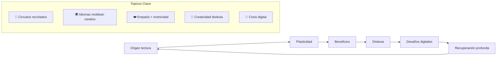
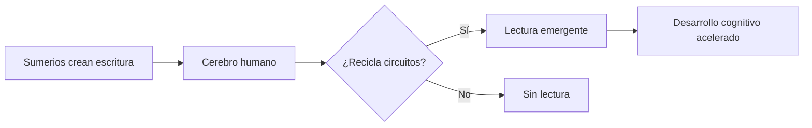
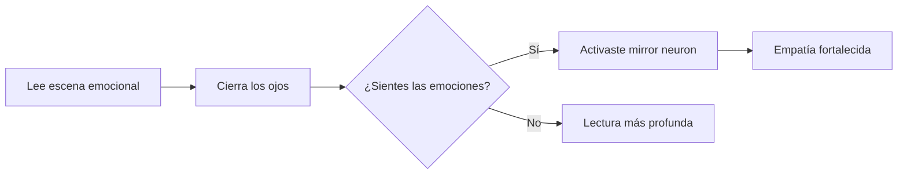
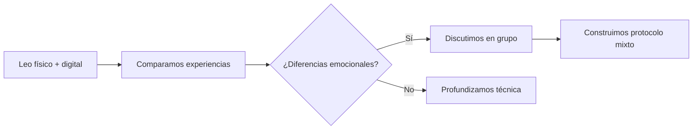
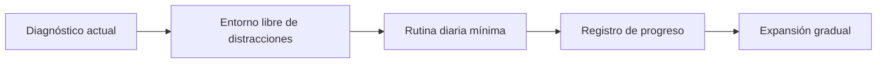

# MASTERCLASS: Neurociencia de la Lectura - Cómo los Libros Transformaron nuestro Cerebro 📚🧠

## INTRODUCCIÓN: POR QUÉ ESTA MASTERCLASS ES DIFERENTE 🔬

> **🎯 Objetivo de Aprendizaje** — Al final de esta guía, podrás entender cómo la lectura moldea tu cerebro, reconocer los efectos de la lectura digital superficial, apreciar la dislexia como una diferencia neuronal y crear un plan para recuperar la lectura profunda.

> **⚠️ Advertencia educativa** — Este contenido es formativo. La neuroplasticidad es real pero requiere práctica constante. No existe una fórmula mágica universal.

---

## MAPA DEL WORKFLOW 🔄



---

## PARTE 1: ORIGEN DE LA LECTURA - EL CEREBRO QUE RECICLÓ CIRCUITOS 🧠

### 1.1 Principio Central: La Lectura no es Innata 🔁

> **🔬 Revelación de Maryanne Wolf (0:41-2:06)**: El cerebro no evolucionó para leer. El sistema de escritura sumeria "rooteó" circuitos de reconocimiento de objetos para crear la capacidad de lectura.

### 1.2 Los circuitos originales 🎯

| Circuito original | Reutilizado para | Función actual |
|-----------------|------------------|----------------|
| **Reconocimiento visual** | Letras y palabras | Identificar símbolos |
| **Lenguaje auditivo** | Sílabas internas | "Voz" de lectura silenciosa |
| **Memoria espacial** | Estructura textual | Comprensión global |
| **Tacto fino** | Reconocimiento letras | Discriminación visual |

### 1.3 La revolución sumeria 📜



---

## PARTE 2: PLASTICIDAD CEREBRAL E IDIOMAS - CADA LENGUA MOLDEA UN CEREBRO DIFERENTE 🌍

### 2.1 Lenguas alfabéticas vs logográficas 🔤

> **🌐 Estudio clave**: El chino activa áreas visuales y de memoria; el inglés activa regiones más abstractas.

### 2.2 Comparación neurocognitiva 📊

| Tipo | Activación cerebral | Estilo | Beneficio |
|------|---------------------|--------|-----------|
| **Alfabético** (español, inglés) | Área de lenguaje + abstracción | Análisis + lógica | Velocidad de lectura |
| **Logográfico** (chino, japonés) | Memoria visual + asociación | Memoria + contexto | Creatividad visual |
| **Abjad** (árabe, hebreo) | Consonantes + vocalización mental | Intuición + sonido | Flexibilidad fonética |

### 2.3 Protocolo de neuroflexibilidad 🧬

```python
# Entrenamiento multilingüe para neuroplasticidad
def multilingual_brain_training():
    return {
        'daily': "10 min lectura en lengua diferente",
        'weekly': "1 sesión de escribir a mano en otra escritura",
        'monthly': "Ver película sin subtítulos + notar diferencias",
        'benefit': "Más circuitos activos = más flexibilidad cognitiva"
    }
```

---

## PARTE 3: BENEFICIOS COGNITIVOS Y EMOCIONALES - LA LECTURA COMO GIMNASIO MENTAL 💪

### 3.1 Empatía por lectura profunda ❤️

> **🎭 Hallazgo (4:10-5:29)**: El cerebro activa regiones motoras al leer acciones. Sumergirse en narrativas multiplica nuestra capacidad de empatía.

### 3.2 Regiones activadas al leer 📍

| Región | Función | Evidencia al leer |
|--------|---------|-------------------|
| **Corteza motora** | Movimientos | Al leer "correr", se activa |
| **Corteza sensorial** | Sensaciones | Al leer "frío", se siente |
| **Ámiga prefrontal** | Teoría de la menta | Al leer emociones, se entiende |
| **Temporo parietal** | Espacio + tiempo | Al leer lugares, se visualiza |

### 3.3 Ejercicio de empatía lectora 🎭



---

## PARTE 4: EL DESAFÍO DE LA DISLEXIA - CREATIVIDAD NEURONAL EXCEPCIONAL 🎨

### 4.1 Dislexia: diferencia, no deficit 🧠

> **🎨 Mensaje de Wolf (5:30-7:01)**: La dislexia usa circuitos alternativos. Muchos genios tienen dislexia - no son "incapaces", son diferentes.

### 4.2 Fortalezas de lectores con dislexia 💪

| Habilidad | Estadística | Ejemplos famosos |
|-----------|-------------|-------------------|
| **Creatividad visual** | 75% superior | Pablo Picasso |
| **Pensamiento espacial** | 63% superior | Richard Branson |
| **Síntesis global** | 68% superior | Steven Spielberg |
| **Storytelling oral** | 70% superior | Whoopi Goldberg |

### 4.3 Protocolo de apoyo dislexia 🤝

```python
# Entorno inclusivo para dislexia
def dyslexia_support():
    return {
        'environment': "Menos prisa + más apoyo visual",
        'tools': "Audio libros + fuentes especiales (OpenDyslexic)",
        'recognition': "Celebrar la forma única de procesar",
        'opportunity': "Creatividad + pensamiento no lineal"
    }
```

---

## PARTE 5: IMPACTO DE HÁBITOS DIGITALES - LA CRISIS DE LECTURA 📱

### 5.1 La lectura fragmentada mata la profundidad 🪓

> **📱 Advertencia (7:21-10:04)**: Leer en pantallas con notificaciones interrumpidas debilita análisis crítico y concentración.

### 5.2 Comparación: Deep Reading vs Screen Reading 📊

| Aspecto | Lectura profunda | Lectura digital |
|---------|------------------|-----------------|
| **Profundidad** | Texto completo procesado | Fragmentado + saltado |
| **Empatía** | Alta activación neuronal | Moderada + distancia |
| **Memoria** | Consolidación profunda | Superficial |
| **Concentración** | 45+ minutos sostenidos | 8-12 minutos fragmentados |
| **Análisis crítico** | Evaluación profunda | Escaneo rápido |

### 5.3 Protocolo de recuperación lectora 📚

```python
# Recuperación del hábito profundo
def deep_reading_recovery():
    return {
        'physical': "Libros en papel (sin notificaciones)",
        'time': "25 min bloque sin interrupciones",
        'technique': "Subrayar + resumir + reflexionar",
        'progress': "Registrar páginas/semana"
    }

def digital_detox_reading():
    return {
        'step_1': "Desactivar notificaciones durante lectura",
        'step_2': "Usar fuente serif + tamaño 12pt",
        'step_3': "Imprimir textos complejos",
        'step_4': "Leer en voz alta fragmentos clave"
    }
```

---

## PARTE 6: I DO / WE DO / YOU DO - EJERCICIOS PROGRESIVOS 🎓

### 6.1 I Do — Lectura consciente guiada 🧭

**Objetivo**: Experimentar los efectos de la lectura profunda en tu cerebro

| Paso | Acción | Tiempo |
|------|--------|--------|
| 1 | Lee 5 páginas en libro físico sin interrupciones | 15 min 📖 |
| 2 | Cierra los ojos y siente las emociones del texto | 2 min ❤️ |
| 3 | Identifica qué regiones crees que se activaron | 1 min 🧠 |
| 4 | Escribe qué aprendiste sobre alguien más | 2 min ✍️ |
| 5 | Compáralo con lectura digital rápida | 3 min 📱 |

### 6.2 We Do — Análisis en comunidad 🧑‍🤝‍🧑

**Ejercicio grupal**: Compartan diferencias entre lectura física y digital



### 6.3 You Do — Sistema personal de lectura 🚀

**Tarea**: Diseña tu plan para recuperar la lectura profunda



**Checklist de implementación**:

- [ ] 15 minutos diarios de lectura física sin notificaciones
- [ ] Un libro de texto completo al mes (mínimo)
- [ ] Técnica de subrayado + reflexión post-lectura
- [ ] Digital detox: 1 día a la semana sin lectura superficial
- [ ] Meditación 5 min antes de leer (prepara el cerebro)

---

## PREGUNTAS DE VERIFICACIÓN 📝

1. **Aplica**: ¿Qué región cerebral crees que más se activaría al leer sobre alguien que sufre? ¿Cómo lo experimentarías?

2. **Analiza**: ¿Prefieres lectura digital o física? ¿Qué evidencias tienes de las diferencias en tu concentración?

3. **Diseña**: Crea un ritual de lectura profunda para las próximas 2 semanas.

4. **Reflexiona**: ¿Conoces a alguien con dislexia? ¿Cómo podrías apoyar su forma única de procesar información?

---

## GLOSARIO RÁPIDO 📚

| Término | Definición | Emoji |
|---------|------------|-------|
| **Reading Brain** | Circuito evolucionado para lectura | 🧠📚 |
| **Deep Reading** | Lectura profunda con empatía | 📖❤️ |
| **Screen Reading** | Lectura superficial digital | 📱⚡ |
| **Neuroplasticidad** | Adaptación cerebral por uso | 🔄🧠 |
| **Mirror neuron** | Neurona empatía | 🤝🧠 |
| **Dislexia** | Diferencia neuronal en lectura | 🎨🔤 |

---

## RECURSOS ADICIONALES 📦

### Apps para lectura consciente 📱
- **Focus**: Forest, Freedom (bloquear distracciones)
- **Tracking**: StoryGraph, Goodreads
- **Audio**: Audible, Libby (alternativa)

### Libros esenciales 📚
- "Reader, Come Home" - Maryanne Wolf
- "The Reading Brain" - Maryanne Wolf
- "Proust and the Squid" - Maryanne Wolf
- "Deep Work" - Cal Newport

### Podcasts de referencia 🎙️
- The Knowledge Project
- Hidden Brain (NPR)
- The Psychology Podcast