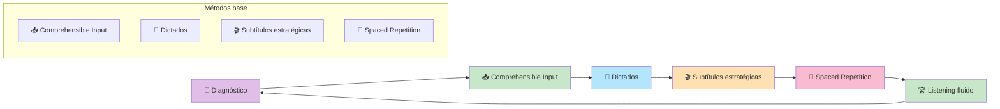

# Masterclass: Listening A1-A2 - Cómo Entender Inglés Oral con Métodos Científicos 👂🔬🇬🇧

> **La premisa central de esta guía** — Entender inglés oral no es cuestión de "tener buen oído": es cuestión de entrenar tu cerebro con el tipo correcto de input, en la cantidad correcta, con el tipo correcto de práctica. Esta guía te muestra el camino científico para pasar de no entender nada a entender conversaciones cotidianas.

## Antes de empezar: 🎯 ¿qué vas a poder hacer al terminar esta guía?

Al terminar de leer y **aplicar** esta guía vas a poder:

- 🎧 Entender por qué el listening es la habilidad más difícil para muchos estudiantes.
- 🧪 Aplicar 4 métodos científicos probados para mejorar el listening (comprehensible input, dictados, subtítulos estratégicas, spaced repetition).
- 🩺 Diagnosticar tu nivel actual de listening (A1 o A2).
- 📅 Seguir un plan de 12 semanas con ejercicios específicos para cada nivel.
- 🚀 Mejorar tu velocidad de procesamiento auditivo sin sacrificar comprensión.

---

## MAPA DEL WORKFLOW 🔄

---

## PARTE 1 — 🚨 Por qué el listening es tan difícil (y no es tu culpa)

### El mito: 🎧 "tengo mal oído"

Muchos estudiantes creen que no pueden entender inglés oral porque "tienen mal oído" o "no son auditivos". **Falso.**

El listening es difícil porque:
1. **Los hablantes nativos hablan rápido:** entre 150-180 palabras por minuto.
2. **Las palabras se conectan (linking):** "I want to" suena como "I wanna".
3. **La pronunciación cambia:** "want to" → "wanna", "going to" → "gonna".
4. **El cerebro no está entrenado:** solo practicaste reconocer palabras escritas, no sonidos.

### La métrica real del listening en A1-A2

| Nivel | Lo que podés entender | Ejemplo |
|-------|----------------------|---------|
| **A1** | 🟢 Palabras aisladas y frases cortas lentas | "The train leaves at 5 PM" |
| **A2** | 🟡 Conversaciones cotidianas a velocidad normal | Una conversación en un café sobre planes del fin de semana |

### El diagnóstico rápido

Hacé este test de 2 minutos:
1. Escuchá este audio corto (simulado): *"Hi, I'm calling about the apartment you advertised. Is it still available?"*
2. Si entendiste todas las palabras: estás en A2 o superior.
3. Si entendiste algunas palabras: estás en A1.
4. Si no entendiste nada: estás en pre-A1 (necesitás más input comprensivo).

---

## PARTE 2 — 🔬 Los métodos científicos que usaremos

### Método 1: 📥 Comprehensible Input (Krashen, 1981)

> **Principio:** aprendés cuando escuchás contenido que entendés entre el 70% y el 90%.

**En la práctica:**
- Si entendés menos del 70%, el audio es demasiado difícil.
- Si entendés más del 90%, es demasiado fácil y no aprendés nada nuevo.
- El **sweet spot** está entre 70-90%: entendés la idea general pero encontrás palabras/estructuras nuevas.

### Método 2: 📝 Dictados (Retrieval Practice auditiva)

> **Principio:** intentar escribir lo que escuchaste es más efectivo que escuchar pasivamente.

**En la práctica:**
1. Escuchá un audio de 30 segundos.
2. Escribí palabra por palabra lo que escuchaste.
3. Compará con la transcripción.
4. Identificá los huecos: ¿qué sonidos no capturaste?

> **📊 Datos científicos:** un meta-análisis de 2023 (Webb) muestra que el **listening con reading simultaneously** (escuchar mientras leés) genera ganancias de vocabulario del 13-17%. El dictado es aún más efectivo porque agrega **retrieval practice** (intentar recordar sin ayuda).

### Método 3: 🎬 Subtítulos estratégicas

> **Principio:** las subtítulos en inglés mejoran la comprensión; las subtítulos en español la empeoran.

**En la práctica:**
- **Primera vez:** sin subtítulos (intentá entender la idea general).
- **Segunda vez:** con subtítulos en inglés (verificá palabras específicas).
- **Tercera vez:** sin subtítulos de nuevo (consolidá lo aprendido).

> **📊 Datos científicos:** estudios 2024-2025 (Kurokawa et al.) muestran que las **subtítulos en inglés** mejoran significativamente la comprensión y la adquisición de vocabulario en listening, especialmente en niveles A1-A2. Las subtítulos en español generan dependencia y no mejoran el listening a largo plazo.

### Método 4: 📅 Spaced Repetition para listening

> **Principio:** repasar el mismo audio en intervalos crecientes mejora la retención.

**En la práctica:**
- Día 1: escuchá el audio 3 veces.
- Día 3: escuchalo 2 veces.
- Día 7: escuchalo 1 vez.
- Día 14: escuchalo 1 vez.
- Cada vez, intentá escribir un resumen de lo que entendiste.

---

## PARTE 3 — 👂 Listening A1: de palabras a frases

### 🎯 Objetivo del nivel A1

Entender palabras aisladas y frases cortas (2-4 palabras) en contexto.

### 🎯 Ejercicios específicos para A1

#### 🧩 Ejercicio A1-1: Reconocimiento de palabras aisladas (Semanas 1-3)

**Objetivo:** reconocer las 300 palabras esenciales cuando las escuchás.

**Ejercicio diario (10 minutos):**
1. Usá una app como **Duolingo** o **Memrise** con audio.
2. Escuchá la palabra, repetila en voz alta.
3. Si la reconocés, marcá "sé"; si no, escuchala 3 veces más.
4. Hacé 20 palabras por día.

#### 🧩 Ejercicio A1-2: Frases cortas (Semanas 4-6)

**Objetivo:** entender frases de 2-4 palabras.

**Ejercicio diario (15 minutos):**
1. Usá **podcasts para principiantes** como "ESL Pod" o "6 Minute English" (sección A1).
2. Escuchá un fragmento de 30 segundos.
3. Escribí las palabras que entendiste.
4. Volvé a escuchar con transcripción.
5. Marcá las palabras que no entendiste y agregalas a tu lista.

#### 🧩 Ejercicio A1-3: Instrucciones simples (Semanas 7-12)

**Objetivo:** entender instrucciones cotidianas.

**Ejercicio diario (15 minutos):**
1. Escuchá instrucciones simples:
   - "Turn left at the corner."
   - "Boil water for 3 minutes."
   - "Take the red pill after meals."
2. Escribí lo que entendiste.
3. Verificá con la transcripción.

---

## PARTE 4 — 👂 Listening A2: de frases a conversaciones

### 🎯 Objetivo del nivel A2

Entender conversaciones cotidianas a velocidad normal sobre temas familiares.

### 🎯 Ejercicios específicos para A2

#### 🧩 Ejercicio A2-1: Diálogos cortos (Semanas 1-3)

**Objetivo:** entender conversaciones de 30 segundos a 1 minuto.

**Ejercicio diario (20 minutos):**
1. Usá **podcasts A2** como "Elementary Podcasts" (British Council) o "6 Minute English".
2. Escuchá el episodio una vez sin transcripción.
3. Escribí un resumen de 3 oraciones de lo que entendiste.
4. Escuchalo de nuevo con transcripción.
5. Identificá las palabras y expresiones nuevas.

#### 🧩 Ejercicio A2-2: Videos con subtítulos estratégicas (Semanas 4-6)

**Objetivo:** entender videos de nativos hablando.

**Ejercicio diario (25 minutos):**
1. Usá **YouTube con videos cortos** (vlogs, entrevistas, tutoriales) de hablantes nativos.
2. **Primera vez:** sin subtítulos, anotá las ideas principales.
3. **Segunda vez:** con subtítulos en inglés, verificá palabras específicas.
4. **Tercera vez:** sin subtítulos, intentá entender todo el detalle.
5. Escribí 3 cosas que aprendiste.

#### 🧩 Ejercicio A2-3: Dictados (Semanas 7-12)

**Objetivo:** entrenar la escucha activa y la escritura simultánea.

**Ejercicio diario (15 minutos):**
1. Elegí un audio corto de **BBC Learning English** o **VOA Learning English**.
2. Escuchalo una vez.
3. Escribí lo que escuchaste, palabra por palabra.
4. Compará con la transcripción.
5. Identificá:
   - ¿Qué palabras no escuchaste?
   - ¿Qué sonidos te confundieron? (linking, reducción, weak forms)
   - ¿Qué vocabulario desconocés?

> **💡 Tip:** en A2, el dictado es tu mejor herramienta. No te preocupes por la velocidad: empezá con audios lentos y aumentá gradualmente.

---

## PARTE 5 — 📅 Plan de acción: 12 semanas para dominar el listening A1-A2

### 🗓️ Semanas 1-3: Reconocimiento de palabras y frases

- [ ] 📚 Aprendé 100 palabras nuevas con audio (app: Duolingo, Memrise).
- [ ] 📝 Hacé dictados de frases cortas (5 min/día).
- [ ] 👂 Escuchá podcasts para principiantes (10 min/día).
- [ ] 🎬 Usá subtítulos en inglés, no en español.
- [ ] 📊 Medí tu progreso: al final de la semana, escuchá un audio A1 y contá cuántas palabras entendiste.

### 🗓️ Semanas 4-6: Comprensión de diálogos cortos

- [ ] 📚 Aprendé 100 palabras nuevas.
- [ ] 📝 Hacé dictados de diálogos cortos (10 min/día).
- [ ] 👂 Escuchá podcasts A2 con transcripción (15 min/día).
- [ ] 🎬 Usá la técnica de 3 escuchas (sin subtítulos, con subtítulos EN, sin subtítulos).
- [ ] 📊 Medí tu progreso: escuchá un audio A2 y contá cuántas ideas entendiste.

### 🗓️ Semanas 7-9: Velocidad natural y colaciones

- [ ] 📚 Aprendé 100 palabras nuevas, incluyendo collocations.
- [ ] 📝 Hacé dictados de audio a velocidad normal (15 min/día).
- [ ] 👂 Escuchá videos de nativos sin subtítulos (20 min/día).
- [ ] 🎬 Usá videos con subtítulos EN para identificar collocations.
- [ ] 📊 Medí tu progreso: escuchá un video A2 sin subtítulos y escribí un resumen.

### 🗓️ Semanas 10-12: Consolidación

- [ ] 📚 Repasá todas las palabras con spaced repetition.
- [ ] 📝 Hacé dictados de audio A2 completos.
- [ ] 👂 Escuchá podcasts A2 sin transcripción.
- [ ] 🎬 Mirá un capítulo de serie con subtítulos EN (no en español).
- [ ] 📊 Hacé un listening test oficial de Cambridge English A1 o A2.
- [ ] 🏆 Medí tu progreso final y compará con la semana 1.

---

## PARTE 6 — ⚠️ Errores comunes al practicar listening

| ❌ | **Usar subtítulos en español** | Es más cómodo | Usá subtítulos en inglés o ninguna. Las subtítulos en español te hacen dependiente. |
| ❌ | **Escuchar contenido demasiado difícil** | Queremos "desafiarnos" | Si entendés menos del 70%, el contenido es demasiado difícil. Bajá el nivel. |
| ❌ | **Escuchar de fondo sin atención** | Pensamos que "todo cuenta" | El listening pasivo casi no genera aprendizaje. Necesitás escucha activa con foco. |
| ❌ | **No hacer dictados** | Parecen difíciles | Los dictados son la forma más rápida de mejorar. Empezá con audios cortos y lentos. |
| ❌ | **Cambiar de recurso constantemente** | Creemos que más = mejor | Quedate con 1 podcast, 1 canal de YouTube, 1 app por semana. |
| ❌ | **No repasar los audios** | Los escuchamos una vez y pasamos a otro | Repasá el mismo audio en intervalos: día 1, 3, 7, 14, 30. |

---

## PARTE 7 — 📚 Glosario de conceptos clave

- 👂 **Listening:** comprensión auditiva del inglés.
- 📥 **Comprehensible Input:** input que entendés entre el 70-90% (i+1).
- 📝 **Dictado:** ejercicio de escribir lo que escuchaste, palabra por palabra.
- 🎬 **Subtítulos estratégicas:** técnica de escuchar sin subtítulos, luego con subtítulos EN, luego sin subtítulos.
- 📅 **Spaced Repetition:** repasar en intervalos crecientes para maximizar la retención.
- 🔍 **Retrieval Practice:** intentar recordar sin ayuda; más efectivo que volver a escuchar.
- 🔗 **Linking:** conexión entre palabras habladas (ej: "I want to" → "I wanna").
- 🗣️ **Weak forms:** pronunciación reducida de palabras en contexto (ej: "to" → "tə").
- 📊 **Frecuencia de palabras:** las palabras más comunes del inglés; las 300 más frecuentes cubren el 65% del inglés oral.
- 🎯 **Sweet spot:** el punto óptimo de dificultad donde aprendés más (70-90% de comprensión).
- 🧠 **Procesamiento auditivo:** la capacidad del cerebro para decodificar sonidos y convertirlos en significado.
- 📈 **Velocidad de procesamiento:** la velocidad a la que podés entender inglés sin esfuerzo.

---

## PARTE 8 — 🧠 Resumen mental (para fijar el conocimiento)

Si tuvieras que recordar solo 3 ideas de esta masterclass:

1. 📥 **El listening mejora con comprehensible input, no con contenido difícil.** Si entendés menos del 70%, bajá el nivel. El sweet spot está entre 70-90%.
2. 📝 **Los dictados son la herramienta más poderosa.** Escribir lo que escuchaste fuerza a tu cerebro a procesar el input en profundidad. Hacé dictados todos los días.
3. 🎬 **Las subtítulos en inglés ayudan; las subtítulos en español dañan.** Usá la técnica de 3 escuchas: sin subtítulos, con subtítulos EN, sin subtítulos.

---

## PARTE 9 — 🌐 Recursos para profundizar

- 📖 Libro: *"Listening Language Teaching"* de Michael Rost — fundamentos científicos de la comprensión auditiva.
- 📖 Libro: *"Teaching by Principles"* de H. Douglas Brown — capítulo sobre listening strategies.
- 🎧 Podcast: *"6 Minute English"* (BBC) — listening A1-A2 con transcripción.
- 🎧 Podcast: *"Elementary Podcasts"* (British Council) — listening A2 con actividades.
- 🎧 Podcast: *"ESL Pod"* — listening lento para principiantes.
- 📱 App: **Anki** o **Quizlet** — para repasar vocabulario auditivo con spaced repetition.
- 🌐 Web: **BBC Learning English** — videos y audios con subtítulos en inglés.
- 🌐 Web: **VOA Learning English** — noticias lentas con transcripción.
- 🤖 Herramienta: **Speechling** — feedback de pronunciación nativa.
- 📚 Herramienta: **Reverso Context** — para escuchar collocations en contexto real.
- 🎥 Video: Maddie from POC English — *"How to actually speak English fluently"* (brecha input-output y listening).

---

*Guía elaborada como síntesis de métodos científicos probados para mejorar el listening en inglés niveles A1-A2: Comprehensible Input (Krashen), Dictados como Retrieval Practice auditiva (Bjork & Bjork), Subtítulos estratégicas (Kurokawa et al. 2024), Spaced Repetition (Ebbinghaus) y evidencia de meta-análisis recientes (Webb 2023, Alsowat 2020).*
