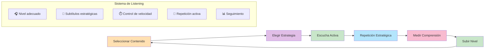
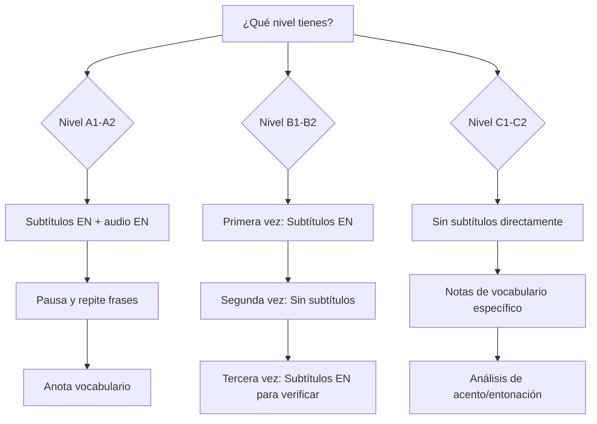
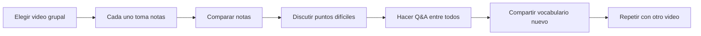
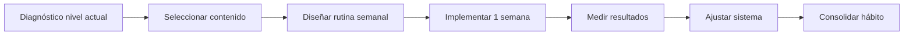

# MASTERCLASS: Listening con YouTube - Domina el Inglés por Video y Audio 🎧🎬

## INTRODUCCIÓN: POR QUÉ ESTA MASTERCLASS ES DIFERENTE 🎯

La mayoría de las personas ven YouTube para entretenerse, pero muy pocos lo usan como **herramienta estructurada de listening**. Esta masterclass te enseña a convertir el algoritmo en tu entrenador personal de comprensión auditiva.

El objetivo no es "poner videos en inglés y ya". El objetivo es aplicar **técnicas activas de listening** que aceleren tu progreso desde principiante hasta avanzado.

> **🎯 Objetivo de Aprendizaje** — Al final de esta guía, podrás seleccionar contenido por nivel, aplicar técnicas de listening activo, usar subtítulos estratégicamente, controlar la velocidad, medir tu progreso y construir un sistema sostenible de inmersión auditiva con YouTube.

> **⚠️ Advertencia educativa** — Este contenido es formativo. El listening requiere exposición constante y paciencia. Los resultados se miden en semanas y meses, no en días.

---

## 🗺️ MAPA DE LA MASTERCLASS 🧭

---

## PARTE 1: LA TEORÍA DEL LISTENING - POR QUÉ APRENDER POR VIDEO FUNCIONA 🧠🎓

### 1.1 Principio Central: El Listening es un Músculo 🏋️

Escuchar en inglés es como entrenar un músculo: necesita **resistencia, variedad y progresión**. YouTube te da acceso ilimitado a material auténtico en todos los niveles.

| Tipo de Listening | Definición | Ejemplo en YouTube |
|-------------------|------------|-------------------|
| **🔊 Pasivo** | Tienes el video de fondo sin atención | Lo dejas mientras cocinas 🍳 |
| **✅ Activo** | Escuchas con intención de comprender | Tomas notas, repites frases ✍️ |
| **🎯 Intensivo** | Te concentras en detalles específicos | Transcripción, vocabulario, acento 📝 |
| **🌊 Extensivo** | Escuchas por placer y exposición general | Series, vlogs, entrevistas 🎬 |

### 1.2 Los 3 Niveles de Comprensión Auditiva 📊

| Nivel | Descripción | Característica | Ejemplo de Contenido YouTube |
|-------|-------------|----------------|-----------------------------|
| **🟢 Nivel 1: Palabras aisladas** | Reconoces palabras sueltas | Entiendes fragmentos pero no el mensaje completo | Canales con subtítulos EN lentos |
| **🟡 Nivel 2: Frases y contexto** | Entiendes bloques de significado | Necesitas contexto visual o subtítulos | Vlogs, tutorials, narraciones |
| **🔴 Nivel 3: Fluidez natural** | Entiendes conversación fluida | Sin subtítulos, con diferentes acentos | Podcasts, entrevistas, debates |

---

## 🎬 PARTE 2: CÓMO SELECCIONAR CONTENIDO POR TU NIVEL 🎯📏

### 2.1 La Regla del 70-80% de Comprensión 📏✅

> **✨ Principio clave**: El contenido ideal es aquel donde entiendes entre el **70% y 80%** sin ayuda. Si entiendes más del 90%, estás en zona de confort 😴. Si entiendes menos del 60%, estás en zona de frustración 😰.

### 2.2 Tabla de Selección por Nivel

| Nivel CEFR | Comprensión sin ayuda | Características del video | Ejemplos de canales/categorías |
|------------|----------------------|---------------------------|--------------------------------|
| **A1-A2 (Principiante)** 🟢 | 70-80% | Vocabulario básico, habla lenta, pausas frecuentes | **Rachel's English**, **English with Lucy**, **BBC Learning English** |
| **B1 (Intermedio)** 🟡 | 60-70% | Habla natural, vocabulario cotidiano, acentos estándar | **TED-Ed**, **Vox**, **Veritasium** |
| **B2 (Intermedio alto)** 🟠 | 50-60% | Temas complejos, velocidad normal, diferentes acentos | **Podcasts en video**, **Interviews**, **TED Talks** |
| **C1-C2 (Avanzado)** 🔴 | 40-50% | Contenido nativo completo, slang, acentos variados | **Comedy shows**, **Documentales**, **Debates políticos** |

### 2.3 Tipos de Contenido por Objetivo

| Objetivo de Listening | Tipo de Contenido | Canales Recomendados | Duración Ideal |
|------------------------|-------------------|----------------------|----------------|
| **🎤 Pronunciación** 🎵 | Videos de fonética, shadowing | **Rachel's English**, **English with Lucy** | 5-15 min ⏱️ |
| **📚 Vocabulario contextual** 📖 | Vlogs, lifestyle, narraciones | **Casey Neistat**, **Yes Theory** | 10-30 min ⏱️ |
| **🎓 Comprensión académica** 🎓 | TED Talks, documentales | **TED**, **National Geographic** | 15-45 min ⏱️ |
| **💬 Conversación natural** 🗣️ | Entrevistas, podcasts video | **The Joe Rogan Experience**, **Hot Ones** | 30-90 min ⏱️ |
| **🌍 Acentos diversos** 🌎 | Creadores de diferentes países | **British Council**, **Australian podcasts** | Variable ⏱️ |
| **🎭 Slang y cultura** 🎪 | Comedia, reacciones, vlogs | **MrBeast**, **Emma Chamberlain** | 5-20 min ⏱️ |

---

## 🎯 PARTE 3: ESTRATEGIAS DE LISTENING ACTIVO - TÉCNICAS QUE FUNCIONAN 🎯⚡

### 3.1 Las 5 Técnicas de Listening Activo

| Técnica | Descripción | Cuándo Usar | Ejemplo Práctico |
|---------|-------------|-------------|------------------|
| **📝 Dictation** | Escribes palabra por palabra lo que escuchas | Para principiantes, entrenar oído | Escuchas 5 segundos, pausas, escribes |
| **🗣️ Shadowing** | Repites en voz alta lo que escuchas, en sincronización | Para pronunciación y fluidez | Repites frases del video al mismo tiempo |
| **🔁 Repeat-back** | Repites frases completas después del speaker | Para memorizar estructuras | Esperas a que termine la frase, la repites |
| **📋 Summary** | Resumes el contenido en tus propias palabras | Para comprensión global | Después del video, explicas qué trató |
| **❓ Q&A** | Haces preguntas sobre el contenido | Para verificar comprensión | ¿De qué hablaba el speaker? ¿Cuál fue su argumento principal? |

### 3.2 Cómo Aplicar Cada Técnica

**📝 Dictation**
1. 📹 Selecciona un video corto de 5-10 minutos
2. ⏱️ Pon velocidad 0.75x
3. 🎧 Escucha 5 segundos → ⏸️ Pausa → ✍️ Escribe lo que escuchaste
4. 📋 Compara con la transcripción automática de YouTube
5. ❌ Marca palabras que no entendiste y repite el segmento

**🗣️ Shadowing**
1. 📹 Elige un segmento de 30-60 segundos
2. ⏱️ Pon velocidad 0.5x - 0.75x
3. 🎧 Escucha una vez para familiarizarte
4. 🔁 Reproduce y repite frase por frase en sincronización
5. 🎙️ Graba tu voz y compara con el original
6. ⬆️ Aumenta velocidad gradualmente

**📋 Summary**
1. 📹 Mira el video completo sin pausas
2. ✍️ Después de verlo, escribe o di en voz alta un resumen de 2-3 oraciones
3. ✅ Verifica que cubriste: introducción, puntos principales, conclusión
4. 🔍 Compara con el título y la descripción del video

**❓ Q&A**
1. 📝 Antes de ver el video, escribe 2-3 preguntas sobre el tema
2. 👀 Mira el video buscando respuestas
3. ✍️ Después, responde tus preguntas por escrito
4. ✅ Verifica tus respuestas con el contenido real

### 3.3 Tabla de Progresión por Técnica

| Nivel | Técnica Principal | Técnica Secundaria | Tiempo por Sesión | Meta de Comprensión |
|-------|-------------------|-------------------|-------------------|---------------------|
| **A1-A2** 🟢 | 📝 Dictation + Subtítulos EN | 🔁 Repeat-back | 10-15 min ⏱️ | 70-80% 🎯 |
| **B1** 🟡 | 🗣️ Shadowing + Subtítulos EN | 📋 Summary | 20-30 min ⏱️ | 60-70% 🎯 |
| **B2** 🟠 | 🎧 Listening sin subtítulos | ❓ Q&A | 30-45 min ⏱️ | 50-60% 🎯 |
| **C1-C2** 🔴 | 🎯 Listening intensivo | 🌍 Análisis de acentos | 45-60 min ⏱️ | 40-50% 🎯 |

---

## 📝 PARTE 4: EL USO ESTRATÉGICO DE SUBTÍTULOS 📝🔤

### 4.1 La Regla de los 3 Tipos de Subtítulos

| Tipo de Subtítulo | Cuándo Usar | ❌ Prohibido | ✅ Resultado |
|-------------------|-------------|-----------|-----------|
| **🇬🇧 EN (Inglés)** | ✅ Siempre que sea posible | ❌ No usarlas como muleta | ✅ Mejora vocabulario y conexión palabra-sonido |
| **🇪🇸 ES (Español)** | ⚠️ Solo para verificar comprensión total | ❌ Usarlas por defecto | ❌ Genera dependencia, no entrena listening |
| **🚫 Apagadas** | 💪 Cuando quieres entrenar comprensión auditiva pura | ❌ Nunca si no entiendes nada | ✅ Fuerza al cerebro a trabajar sin red |

### 4.2 Protocolo de Subtítulos por Nivel

### 4.3 Tabla de Uso de Subtítulos por Objetivo

| Objetivo | Primera Vista | Segunda Vista | Tercera Vista | Resultado Esperado |
|----------|---------------|---------------|---------------|-------------------|
| **🎤 Pronunciación** | Subtítulos EN + audio | Sin subtítulos, shadowing | Sin subtítulos, repeat-back | ✅ Mejora en producción oral |
| **📚 Vocabulario** | Subtítulos EN, anota palabras | Repasa palabras en contexto | Usa las palabras en oraciones propias | ✅ Vocabulario activo |
| **🎯 Comprensión general** | Subtítulos EN | Sin subtítulos | Subtítulos EN solo para verificar | ✅ Comprensión auditiva |
| **🌍 Acentos** | Subtítulos EN (transcripción exacta) | Sin subtítulos | Compara con otra versión | ✅ Reconocimiento de acentos |

---

## ⏱️ PARTE 5: CONTROL DE VELOCIDAD Y REPETICIÓN ⏱️🔁

### 5.1 La Velocidad como Herramienta de Entrenamiento

| Velocidad | Cuándo Usar | 🎯 Beneficio | 📋 Ejemplo de Uso |
|-----------|-------------|-----------|------------------|
| **🐢 0.5x** | Principiantes, contenido difícil | ✅ Permite procesar cada palabra | Primer contacto con contenido nuevo |
| **🚶 0.75x** | Transición entre niveles | ✅ Ayuda a acostumbrarse al ritmo natural | Contenido B1 con habla rápida |
| **🏃 1.0x (Normal)** | 🎯 Práctica regular, objetivo final | ✅ Velocidad real de conversación | Contenido de tu nivel actual |
| **⚡ 1.25x** | Cuando 1.0x se siente lento | ✅ Entrena velocidad de procesamiento | Contenido que dominas parcialmente |
| **🚀 1.5x** | Avanzados, repasar contenido conocido | ✅ Acelera la exposición sin perder comprensión | Repasar un video que ya viste |

### 5.2 Cuándo Subir o Bajar la Velocidad

| Situación | Acción |
|-----------|--------|
| Entiendes más del 80% sin esfuerzo | ➡️ Sube 0.1x |
| Entiendes entre el 60-75% | ✅ Mantén la velocidad actual |
| Entiendes menos del 60% | ⬇️ Baja 0.1x o elige contenido más fácil |
| El contenido te parece muy fácil | ➡️ Sube velocidad o busca contenido más desafiante |
| El contenido te parece muy difícil | ⬇️ Baja velocidad o usa subtítulos EN |

### 5.3 Tabla de Progresión de Velocidad por Nivel

| Nivel Inicial | Velocidad Inicial | Velocidad Objetivo | Tiempo Estimado | Estrategia |
|---------------|-------------------|-------------------|-----------------|------------|
| **A1-A2** 🟢 | 0.5x - 0.75x | 1.0x | 4-8 semanas | Aumentar 0.1x cada 2 semanas |
| **B1-B2** 🟡 | 0.75x - 1.0x | 1.25x | 3-6 semanas | Aumentar 0.1x cuando alcances 80% comprensión |
| **C1-C2** 🔴 | 1.0x - 1.25x | 1.5x | 2-4 semanas | Mantener 1.5x hasta que sea cómodo |

---

## 🎓 PARTE 6: TÉCNICAS AVANZADAS - DEL HEARING AL UNDERSTANDING 🎓🧠

### 6.1 📝 Dictation con Videos Cortos

**Qué es**: Escuchar un segmento de 5-10 segundos, pausar, y escribir exactamente lo que escuchaste.

**🎯 Por qué funciona**: Obliga a tu cerebro a procesar cada palabra, conectando el sonido con la escritura.

**📋 Protocolo**:
1. 📹 Selecciona un video de 5-10 minutos
2. ⏱️ Pon velocidad 0.75x
3. 🎧 Escucha 5 segundos → ⏸️ Pausa → ✍️ Escribe
4. 🔁 Repite hasta completar el segmento
5. ✅ Compara con la transcripción automática de YouTube
6. ❌ Marca palabras que no entendiste

### 6.2 🗣️ Shadowing con Contenido Nativo

**Qué es**: Repetir en voz alta lo que dice el speaker, en sincronización exacta.

**🎯 Por qué funciona**: Entrena pronunciación, ritmo, entonación y fluidez simultáneamente.

**📋 Protocolo**:
1. 📹 Elige un segmento de 30-60 segundos
2. ⏱️ Pon velocidad 0.5x - 0.75x
3. 🎧 Escucha una vez para familiarizarte
4. 🔁 Reproduce y repite frase por frase
5. 🎙️ Graba tu voz y compara con el original
6. ⬆️ Aumenta velocidad gradualmente

### 6.3 🎧 Listening Extensivo con Propósito

**Qué es**: Ver videos más largos (20-60 minutos) por placer, pero con un objetivo de comprensión.

**🎯 Por qué funciona**: Entrena la resistencia auditiva y la capacidad de seguir conversaciones naturales sin pausas.

**📋 Protocolo**:
1. 📹 Elige contenido de tu nivel (70-80% comprensión)
2. 👀 Mira el video completo sin pausas
3. ✍️ Después, escribe 3 puntos clave que recordaste
4. ✅ Verifica tu comprensión con subtítulos EN en una segunda vista
5. 📚 Anota vocabulario nuevo en contexto

---

## 📊 PARTE 7: CÓMO MEDIR TU PROGRESO - MÉTRICAS QUE IMPORTAN 📊📈

### 7.1 Métricas Clave de Listening

| Métrica | 📏 Cómo Medir | 🎯 Meta por Nivel | 📅 Frecuencia |
|---------|------------|---------------|------------|
| **⏱️ Tiempo de exposición semanal** | Minutos/horas de listening activo | A1-A2: 60-90 min B1-B2: 90-150 min C1-C2: 150+ min | 📆 Semanal |
| **🎯 Comprensión sin subtítulos** | % entendido después de ver sin subs | A1-A2: 50-60% B1-B2: 60-70% C1-C2: 70-80% | 📝 Por sesión |
| **⚡ Velocidad de procesamiento** | Velocidad máxima sin perder comprensión | A1-A2: 0.75x B1-B2: 1.0x C1-C2: 1.25x+ | 📆 Mensual |
| **📚 Vocabulario reconocido** | Palabras nuevas que identificas en contexto | 10-15 por sesión | 📝 Por sesión |
| **💪 Resistencia auditiva** | Minutos continuos sin fatiga | A1-A2: 15 min B1-B2: 30 min C1-C2: 60+ min | 📝 Por sesión |

### 7.2 Tabla de Autoevaluación Semanal

| Día | ⏱️ Duración (min) | 📺 Contenido | ⚡ Velocidad | 📝 Subtítulos | 🎯 Comprensión (%) | 📚 Vocabulario Nuevo |
|-----|----------------|-----------|-----------|------------|-----------------|-------------------|
| 📅 Lunes | | | | | | |
| 📅 Martes | | | | | | |
| 📅 Miércoles | | | | | | |
| 📅 Jueves | | | | | | |
| 📅 Viernes | | | | | | |
| 📅 Sábado | | | | | | |
| 📅 Domingo | | | | | | |
| **📊 Total** | | | | | **Promedio** | |

### 7.3 Cómo Interpretar tus Resultados

| 📈 Tendencia | ¿Qué significa? | 🎯 Acción |
|-----------|----------------|--------|
| Comprensión sube semana a semana | ✅ Estás progresando | Mantén la rutina actual |
| Comprensión se estanca | ⚠️ Necesitas cambiar de contenido o técnica | Prueba contenido más desafiante o diferente técnica |
| Velocidad máxima aumenta | 🚀 Tu cerebro procesa más rápido | Aumenta dificultad del contenido |
| Tiempo de exposición baja | ⚠️ Falta consistencia | Programa sesiones más cortas pero diarias |
| Vocabulario nuevo baja | 📚 No estás anotando palabras | Crea el hábito de anotar 3-5 palabras por video |

---

## 🏗️ PARTE 8: CONSTRUYENDO TU SISTEMA DE LISTENING CON YOUTUBE 🏗️🧱

### 8.1 Los 5 Componentes de un Sistema Sostenible

| Componente | Función | Implementación en YouTube |
|------------|---------|---------------------------|
| **1. Contenido por nivel** 🎯 | Asegura progresión sin frustración | Listas de reproducción organizadas por nivel |
| **2. Técnica activa** ⚡ | Convierte pasivo en activo | Dictation, shadowing, Q&A en cada video |
| **3. Subtítulos estratégicos** 📝 | Apoya sin crear dependencia | EN primero, ES solo para verificar, apagadas para reto |
| **4. Velocidad controlada** ⏱️ | Entrena procesamiento rápido | Aumentar 0.1x cada 2 semanas cuando alcances 80% |
| **5. Seguimiento métrico** 📊 | Mide progreso real | Registro semanal de tiempo, comprensión, vocabulario |

### 8.2 ✅ Checklist de Sistema de Listening YouTube

- [ ] 🎯 Creé listas de reproducción por nivel (A1-A2, B1-B2, C1-C2)
- [ ] 📺 Selecciono contenido 70-80% comprensible
- [ ] ⚡ Aplico al menos 1 técnica de listening activo por video
- [ ] 📝 Uso subtítulos EN en primera vista
- [ ] 🚫 Veo sin subtítulos en segunda vista
- [ ] ⏱️ Controlo la velocidad según mi nivel
- [ ] 📊 Registro mi progreso semanalmente
- [ ] 📚 Anoto vocabulario nuevo en contexto
- [ ] 🗣️ Practico shadowing 2-3 veces por semana
- [ ] 🔄 Reviso y ajusto mi sistema cada 2 semanas

---

## 🎓 PARTE 9: I DO / WE DO / YOU DO - EJERCICIOS PROGRESIVOS 🎓🚀

### 9.1 🧭 I Do — Selección guiada de contenido

**🎯 Objetivo**: Elegir el video correcto para tu nivel

| Paso | Acción | Tiempo |
|------|--------|--------|
| 1 | 🎯 Evalúa tu nivel actual (test online o autoevaluación) | 5 min 🧠 |
| 2 | 🔍 Busca 3 videos en tu nivel | 10 min 🔎 |
| 3 | 👀 Aplica la regla del 70-80% (mira preview sin sonido primero) | 5 min 👁️ |
| 4 | ❤️ Selecciona el más interesante para ti | 5 min ✨ |
| 5 | ⚙️ Configura velocidad y subtítulos antes de empezar | 2 min 🛠️ |

**Ejemplo guiado**:
- 🎓 Nivel: B1
- 📏 Criterios: 60-70% comprensión, temas de interés, duración 10-20 min
- 📺 Selección: TED-Ed sobre ciencia (con subtítulos EN)
- ⚡ Velocidad: 0.9x
- 🎯 Técnica: Dictation + Q&A

### 9.2 🤝 We Do — Práctica colaborativa de listening

**👥 Ejercicio grupal**: Ven un video juntos y aplican técnicas

**📜 Reglas del ejercicio**:
1. 🚫 Sin spoilers: nadie explica antes de que todos escuchen
2. 📝 Cada uno anota 3 puntos clave
3. 🤔 Comparen comprensión (¿quién entendió más? ¿por qué?)
4. 🔍 Identifiquen palabras difíciles juntos
5. 💡 Cada persona comparte 1 insight del video

### 9.3 🚀 You Do — Tu sistema personal de listening

**📋 Tarea**: Diseña tu rutina semanal de listening con YouTube

**✅ Checklist de implementación**:

- [ ] 🎯 Creé 3 listas de reproducción (principiante, intermedio, avanzado)
- [ ] 📺 Seleccioné 5 videos por lista
- [ ] 🎯 Definí mi técnica principal (dictation, shadowing, Q&A)
- [ ] ⏱️ Establecí duración objetivo por sesión (empezar con 15-20 min)
- [ ] ⚡ Configuré velocidad inicial según mi nivel
- [ ] 📊 Creé sistema de registro de progreso (app, spreadsheet, cuaderno)
- [ ] 📅 Programé 3-5 sesiones por semana
- [ ] 📆 Definí día de revisión semanal (domingos)
- [ ] 📈 Seleccioné métricas a medir (comprensión, vocabulario, velocidad)
- [ ] 🤝 Compromiso de 21 días de práctica continua

---

## 📦 PARTE 10: RECURSOS Y CANALES RECOMENDADOS 📦🎬

### 10.1 Canales por Nivel

| Nivel | Canales | Características | Enfoque |
|-------|---------|----------------|---------|
| **A1-A2** | **Rachel's English**, **English with Lucy**, **BBC Learning English** | Vocabulario básico, pronunciación, gramática simple | Fundamentos |
| **B1-B2** | **TED-Ed**, **Vox**, **Kurzgesagt**, **Veritasium** | Temas interesantes, habla clara, subtítulos EN | Comprensión general |
| **C1-C2** | **The Joe Rogan Experience**, **Hot Ones**, ** podcasts con video** | Conversación natural, slang, acentos variados | Fluidez nativa |

### 10.2 Herramientas Complementarias

| Herramienta | Uso en Listening | Cómo Ayuda |
|-------------|------------------|------------|
| **YouTube Transcript** | Ver transcripción mientras escuchas | Conecta sonido con escritura |
| **Language Reactor** (extensión) | Subtítulos duales, repetición automática | Facilita técnicas activas |
| **Anki** | Guardar vocabulario en contexto | Repetición espaciada de palabras nuevas |
| **Notion/Spreadsheet** | Registrar progreso | Medir mejora objetiva |

### 10.3 Ejemplo de Rutina Semanal

| Día | ⏱️ Duración | 📺 Tipo de Contenido | 🎯 Técnica | ⚡ Velocidad | 📝 Subtítulos |
|-----|----------|-------------------|---------|-----------|------------|
| 📅 Lunes | 20 min | TED-Ed (ciencia) | 📝 Dictation | 0.75x | EN |
| 📅 Martes | 15 min | English with Lucy (gramática) | 🗣️ Shadowing | 0.8x | EN |
| 📅 Miércoles | 30 min | Vox (cultura) | 🎧 Listening extensivo | 1.0x | 🚫 Apagadas |
| 📅 Jueves | 20 min | TED Talk | ❓ Q&A | 0.9x | EN 1ª vez, 🚫 2ª vez |
| 📅 Viernes | 25 min | Podcast en video | 📝 Dictation + 📋 Summary | 0.85x | EN |
| 📅 Sábado | 40 min | Contenido nativo (intereses) | 🎧 Listening extensivo | 1.0x | 🚫 Apagadas |
| 📅 Domingo | 15 min | 📝 Repaso de notas | 🗣️ Shadowing | Variable ⚡ | EN |
| **📊 Total** | **165 min** | | | | |

---

## 🧩 PREGUNTAS DE VERIFICACIÓN 📝✅

1. **Aplica**: Selecciona un video de YouTube de 10 minutos en tu nivel. Aplica dictation a 3 segmentos de 10 segundos cada uno.

2. **Analiza**: ¿Por qué el 70-80% de comprensión es el punto óptimo? ¿Qué pasa si usas subtítulos en español por defecto?

3. **Diseña**: Crea tu sistema de listas de reproducción organizadas por nivel y objetivo de listening.

4. **Reflexiona**: ¿Qué técnica de listening activo te resulta más difícil? ¿Por qué? ¿Cómo la practicarías más?

5. **Crea**: Diseña tu rutina semanal de listening con YouTube considerando duración, contenido, técnica y velocidad.

---

## 📖 GLOSARIO RÁPIDO 📚⚡

| Término | Definición | Emoji |
|---------|------------|-------|
| **Listening activo** | Escuchar con intención de comprender, no solo oír | 🎧 |
| **Dictation** | Escribir lo que escuchas segmento por segmento | 📝 |
| **Shadowing** | Repetir en voz alta en sincronización con el audio | 🗣️ |
| **Velocidad de procesamiento** | Capacidad de entender a diferentes velocidades | ⏱️ |
| **Comprensión auditiva** | Porcentaje de contenido entendido sin ayuda | 📊 |
| **Subtítulos EN** | Subtítulos en inglés, herramienta de apoyo | 📝 |
| **Resistencia auditiva** | Minutos continuos de listening sin fatiga | 💪 |
| **Fluidez auditiva** | Capacidad de entender habla natural sin esfuerzo | 🌊 |

---

## 📦 RECURSOS ADICIONALES 📦🎬

### Canales YouTube por Nivel

**Principiante (A1-A2)**:
- **Rachel's English** - Pronunciación americana
- **English with Lucy** - Gramática y vocabulario británico
- **BBC Learning English** - Inglés británico estándar
- **EnglishClass101** - Lecciones estructuradas

**Intermedio (B1-B2)**:
- **TED-Ed** - Temas educativos, vocabulario académico
- **Vox** - Cultura y sociedad, habla clara
- **Kurzgesagt** - Ciencia explicada simple
- **Veritasium** - Ciencia y curiosidades

**Avanzado (C1-C2)**:
- **The Joe Rogan Experience** - Conversaciones largas, slang
- **Hot Ones** - Entrevistas con celebridades, acento americano
- **Yes Theory** - Vlogs y desafíos, habla natural
- **MrBeast** - Entretenimiento, vocabulario coloquial

### Herramientas

- **Language Reactor**: Extensión de Chrome para Netflix/YouTube con subtítulos duales
- **YouTube Transcript**: Ver transcripción automática
- **Anki**: Sistema de repetición espaciada para vocabulario
- **Notion/Notability**: Registro de progreso y notas

### Podcasts con Video (para avanzados)

- **The Tim Ferriss Show**
- **The School of Greatness**
- **Huberman Lab**
- **Lex Fridman Podcast**

---

## 🎓 NOTAS FINALES 🎓✨

El listening con YouTube no es sobre consumir contenido, es sobre **entrenar tu cerebro para procesar el idioma en tiempo real**. La clave está en la consistencia: 20-30 minutos diarios de listening activo valen más que 3 horas un solo día.

Recuerda:
1. **El contenido debe estar en tu nivel** - 70-80% de comprensión
2. **Las técnicas activas son obligatorias** - No basta con ver videos
3. **Los subtítulos EN son tus aliados** - Los ES son tu debilidad
4. **La velocidad es progresiva** - No intentes 1.5x desde el día 1
5. **El registro es fundamental** - Lo que no se mide, no mejora

> **🌟 Mensaje final**: YouTube es la herramienta de listening más poderosa que existe porque tiene contenido para todos los niveles, intereses y objetivos. La diferencia entre quienes progresan y quienes se estancan no es el contenido, sino la técnica con la que lo usan.

---

**Creado con propósito educativo. Tu progreso en listening depende de la calidad de tu práctica, no de la cantidad de videos que veas.**

🎧🎬✨
