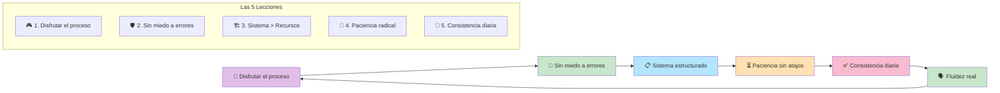

# Masterclass: 5 Lecciones para Pasar de Entender Inglés a Hablarlo con Fluidez 🗣️🇬🇧

> **💡 La premisa central de esta guía** — Entender inglés no es lo mismo que producirlo. La fluidez no viene de acumular contenido, sino de cambiar *cómo* aprendes. Estas 5 lecciones, condensadas de 13 años de aula, son el mapa para hacer ese cambio real.

## Antes de empezar: 🎯 ¿qué vas a poder hacer al terminar esta guía?

Al terminar de leer y **aplicar** esta guía vas a poder:

- 🎧 Entender por qué actividades como ver series o leer artículos no alcanzan para hablar fluido.
- 🎮 Aplicar la estrategia de *input por hobbies* para generar práctica oral sin esfuerzo.
- 🛡️ Transformar el miedo a equivocarte en motor de comunicación.
- 📋 Diseñar un sistema de aprendizaje estructurado en vez de saltar entre recursos aleatorios.
- ✅ Implementar hábitos pequeños y consistentes que generen progreso real a largo plazo.

---

## MAPA DEL WORKFLOW 🔄



---

## PARTE 1 — 🚨 El error que casi todos cometen: confundir consumo con fluidez

Antes de entrar en las lecciones, es necesario diagnosticar el problema principal: **la mayoría de los estudiantes consumen mucho inglés, pero producen muy poco**.

> *"Entiendo todo cuando escucho, pero cuando me toca hablar, me trabo."*

Este fenómeno se conoce como la **brecha input-output**: tu cerebro se vuelve excelente reconociendo palabras, pero no crea los circuitos neuronales necesarios para recuperarlas y producirlas en una conversación real.

La solución no es consumir más contenido. La solución es **cambiar la forma de aprender**. Y para eso, sirven estas 5 lecciones.

---

## PARTE 2 — 🎯 Las 5 lecciones esenciales de Maddie

### Lección 1: Disfruta el proceso 🎮

> *"The most successful students pursue their hobbies — gaming, music, sports — in English because they genuinely enjoy the activity, not just because they are trying to study."*
> — Maddie, podcast (1:38–8:39)

#### 💡 La idea central

La fluidez no se construye forzando el estudio: se construye cuando el inglés deja de ser una materia y pasa a ser el **vehículo para hacer algo que ya te gusta**. Si te gusta el gaming, jugá en inglés. Si te gusta la música, escuchala y cantala en inglés. Si te gusta el deporte, seguilo en inglés.

#### 🔬 Por qué funciona

Tu cerebro retiene y produce mucho mejor el lenguaje cuando está **emocionalmente comprometido** con el contenido. Estudiar gramática en abstracto genera conocimiento pasivo; usar el inglés para algo que te importa genera conocimiento activo.

#### 🛠️ Aplicación práctica

| Hobby | Input en inglés | Output natural |
|-------|----------------|----------------|
| 🎮 Gaming | Jugar con texto/audio en inglés | Leer chat, escuchar team calls, comentar estrategias |
| 🎵 Música | Escuchar letras, ver entrevistas | Cantar, escribir sobre artistas, comentar canciones |
| ⚽ Deportes | Ver partidos, leer noticias | Comentar jugadas, discutir resultados, seguir cuentas |
| 🍳 Cocina | Ver recetas en YouTube | Comentar pasos, buscar ingredientes, explicar platos |

> **Analogía:** estudiar inglés por obligación es como correr en cinta. Usar inglés por pasión es como correr por un bosque: el mismo movimiento, pero una motivación completamente distinta que cambia la adherencia y el resultado.

#### 🧪 Ejercicio práctico

1. 🎯 Elegí un hobby que hagas al menos 2 veces por semana.
2. 🌐 Cambiá el idioma de esa actividad a inglés (app, YouTube, comunidad, audio).
3. 📊 Durante 7 días, medí cuántas palabras nuevas aprendiste sin esfuerzo.
4. 📝 Anotá cuántas veces hablaste o escribiste en inglés sin darte cuenta.

---

### Lección 2: No le temas a los errores 🛡️

> *"Fluency comes from being fearless in communication. Successful learners prioritize getting their message across over grammatical perfection."*
> — Maddie, podcast (8:39–13:06)

#### 💡 La idea central

El perfeccionismo es el mayor enemigo de la fluidez. Querer hablar sin errores desde el principio te mantiene en silencio. La fluidez se construye **comunicando primero, corrigiendo después**.

#### 🔬 Por qué funciona

Cuando priorizás el mensaje sobre la forma:
- Generás producción real (la única forma de mover vocabulario pasivo a activo).
- Desarrollás tolerancia a la ambigüedad, una habilidad clave para conversar en cualquier idioma.
- Tu interlocutor entiende tu idea, lo que refuerza la motivación para seguir hablando.

#### 🛠️ Aplicación práctica

**🚀 El protocolo anti-perfección:**

```
Antes de hablar:
❌ "¿Cómo digo esto perfectamente?"
✅ "¿Cómo digo esto de forma que me entiendan?"

Durante la conversación:
❌ Frenar para corregir cada error
✅ Seguir adelante, la idea primero

Después de la conversación:
❌ Autocastigarse por los errores
✅ Anotar 1-2 errores clave y practicar esa forma correcta
```

> **Analogía:** un niño que aprende a caminar no espera a tener equilibrio perfecto para dar el primer paso. Se cae, se levanta, y cada caída lo acerca más a caminar. Hablar inglés con errores es caminar en otro idioma.

#### 🧪 Ejercicio práctico

1. 🎤 Elegí un tema simple (tu comida favorita, tu trabajo, un viaje).
2. 📹 Grabate en video hablando de ese tema en inglés durante 60 segundos.
3. 👂 Escuchate sin juzgarte: solo contá cuántas ideas lograste transmitir.
4. 🔁 Repetí el ejercicio esta semana, cada día, con un tema distinto.

---

### Lección 3: Construí un sistema, no colecciones de recursos 🏗️

> *"Effective learning requires a plan that provides consistent context and content. Jumping between random resources prevents the brain from organizing information systematically."*
> — Maddie, podcast (13:06–16:33)

#### 💡 La idea central

Tener 20 apps, 10 cursos y 5 suscripciones no te hace fluido. Lo que te hace fluido es un **sistema**: una rutina predecible donde tu cerebro sabe qué esperar, qué practicar y en qué orden.

#### 🔬 Por qué funciona

El cerebro organiza el conocimiento en redes neuronales. Cuando cambias de recurso cada día, estás generando **islas de conocimiento aislado**. Cuando seguís un sistema, generas **redes conectadas** donde una palabra o estructura activa a las demás.

#### 🛠️ Aplicación práctica

**🧱 Los 3 pilares de un sistema mínimo viable:**

1. **Input estructurado:** Un contenido principal por semana (una serie, un podcast, un artículo). Lo consumís con atención, no de fondo.
2. **Output deliberado:** 10-15 minutos de producción oral sobre lo que consumiste. Puede ser narrar tu día, comentar el episodio, explicarle a alguien lo que aprendiste.
3. **Feedback loop:** Una corrección semanal. Puede ser un compañero, un tutor de IA, o grabarte y escucharte con atención.

> **Analogía:** aprender inglés con recursos aleatorios es como armar un rompecabezas sin la imagen de referencia. Cada pieza tiene sentido individualmente, pero no sabés cómo conectarlas. Un sistema es la imagen de referencia: cada recurso es una pieza que encaja en un todo mayor.

#### 🧪 Ejercicio práctico

1. 🎯 Elegí **un solo recurso** para consumir esta semana (una serie, un podcast corto, un canal de YouTube).
2. 📅 Establecé 3 días fijos para consumirlo (por ejemplo, lunes, miércoles, viernes, 20 minutos).
3. 📝 Cada vez que consumas 1 episodio, escribí 3 frases en inglés resumiendo lo que entendiste.
4. 🔍 Al final de la semana, revisá tu progreso y ajustá el sistema para la próxima.

---

### Lección 4: Ten paciencia, no existen los atajos 🌱

> *"There are no shortcuts to language mastery. Language learners often quit because they expect immediate results; accepting that progress takes time prevents frustration."*
> — Maddie, podcast (16:33–20:20)

#### 💡 La idea central

El cerebro necesita tiempo para consolidar redes neuronales. La paciencia no es resignación: es **confianza en el proceso**. Los estudiantes que abandonan no son los que progresan lento, son los que esperan progreso rápido y se frustran cuando no llega.

#### 🔬 Por qué funciona

La investigación en neurociencia del aprendizaje muestra que la consolidación de habilidades motoras y lingüísticas requiere semanas y meses de práctica repetida. No hay forma de acelerar el proceso sin sacrificar la retención a largo plazo.

#### 🛠️ Aplicación práctica

**🌳 El marco de paciencia radical:**

```
Semana 1-4: Fase de exposición
→ Tu cerebro se acostumbra al sonido y las estructuras.
→ Parece que no progresás. Lo estás haciendo.

Semana 5-8: Fase de producción emergente
→ Empezás a recuperar palabras sin esfuerzo.
→ Los errores disminuyen sin que lo notes.

Semana 9-12: Fase de automatización
→ Empiezan a salir frases completas sin pensar.
→ La fluidez se hace visible para los demás.

Mes 4+: Consolidación
→ Podés conversar sobre temas cotidianos con fluidez.
→ El inglés deja de ser un esfuerzo consciente.
```

> **Analogía:** aprender inglés es como cultivar un árbol. Durante los primeros meses, todo ocurre bajo tierra: las raíces crecen, pero no ves nada. Si te frustrás y abandonás después de 2 semanas, nunca verás el árbol. La paciencia es confiar en lo invisible.

#### 🧪 Ejercicio práctico

1. 📊 Escribí tu nivel actual de inglés en 3 dominios (comprensión, vocabulario, producción).
2. 🎯 Definí un objetivo realista para dentro de 3 meses (no "hablar fluido", sino "poder mantener una conversación de 10 minutos sobre mi trabajo sin trabarme").
3. 📅 Cada mes, volvé a medir esos 3 dominios.
4. 💪 Cuando te frustres, leé la frase: *"Lo que estoy haciendo no se ve, pero se está construyendo."*

---

### Lección 5: La consistencia vence a la intensidad 🔁

> *"Long-term success is about small, regular habits rather than intense, sporadic bursts of study. Consistency is the key to actual results."*
> — Maddie, podcast (20:20–24:40)

#### 💡 La idea central

Estudiar 4 horas una vez al mes es mucho menos efectivo que 20 minutos todos los días. La consistencia crea hábitos neuronales; la intensidad esporádica genera frustración y olvido rápido.

#### 🔬 Por qué funciona

El aprendizaje se consolida en el **sueño** y en los **periodos de descanso** entre sesiones. La repetición espaciada (practicar un poco cada día) es mucho más efectiva que la repetición masiva (practicar mucho en un solo día y olvidar a la semana).

#### 🛠️ Aplicación práctica

**🔒 El compromiso mínimo irreversible:**

```
Compromiso diario (20 minutos total):
├── 5 min — Input: escuchar un podcast corto o ver un reel en inglés
├── 10 min — Output: narrar tu día en voz alta o escribir 5 frases
└── 5 min — Feedback: corregir 1 error o aprender 1 palabra nueva

Regla de hierro:
✅ Nunca cero. Incluso 2 minutos mantienen el hábito.
❌ Nunca "mañana empiezo en serio".
```

> **Analogía:** entrenar para una maratón no se hace corriendo 40 km una vez al mes. Se hace corriendo 5 km todos los días. La fluidez en inglés es una maratón, no un sprint.

#### 🧪 Ejercicio práctico

1. ⏱️ Definí tu **compromiso mínimo**: ¿cuántos minutos por día podés dedicar sin excusas? (Recomendado: 15-20 min).
2. ⏰ Elegí un horario fijo (mañana, tarde o noche) y poné una alarma.
3. 📅 Durante 21 días, cumplí el compromiso sin excepción.
4. 🎤 Al día 22, medí tu progreso en producción oral (grabate hablando 1 minuto sobre tu semana).

---

## PARTE 2bis — 📈 El camino del inglés: 6 pasos y 5 reglas para avanzar rápido

En este video, Maddie explica que el progreso real no viene de consumir más, sino de avanzar por el camino correcto, paso a paso, sin saltarte etapas.

### 🧭 El English Journey: los 6 peldaños del aprendizaje

> *"To make progress, you must first understand your current position on a six-step staircase."*
> — Maddie, video (2:43)

El aprendizaje del inglés se puede ver como una escalera de 6 peldaños. No podés saltar peldaños sin arriesgarte a quedarte trabado en el vacío.

| # | 🪜 Peldaño | Tipo | ¿Qué estás haciendo? |
|---|-----------|------|----------------------|
| 1 | Vocabulary (Vocabulario) | 🏗️ Fundación | Aprendés palabras de forma aislada o en contexto. |
| 2 | Grammar (Gramática) | 🏗️ Fundación | Entendés cómo se combinan esas palabras en estructuras. |
| 3 | Reading (Lectura) | 👁️ Habilidad receptiva | Reconocés vocabulario y estructuras en textos escritos. |
| 4 | Listening (Escucha) | 👁️ Habilidad receptiva | Reconocés vocabulario y estructuras en audio. |
| 5 | Writing (Escritura) | ✍️ Habilidad productiva | Producís lenguaje escrito con corrección. |
| 6 | Speaking (Habla) | ✍️ Habilidad productiva | Producís lenguaje oral en tiempo real. |

#### ⚠️ El error más común: saltar peldaños

> *"Many learners struggle because they try to skip steps (e.g., jumping from vocabulary to speaking) without mastering the intermediate productive skills."*
> — Maddie, video (4:38)

El error clásico: querer hablar (peldaño 6) sin haber consolidado la escritura (peldaño 5). O querer escribir sin haber dominado la lectura. O querer escuchar sin tener vocabulario base.

**La regla:** no podés producir lo que no podés reconocer primero. Cada peldaño es la base del siguiente.

#### 📊 Cómo diagnosticar en qué peldaño estás

1. **Si no entendés lo que lees:** estás en el peldaño 1-2 (vocabulario/gramática).
2. **Si leés bien pero no entendés audios:** estás en el peldaño 3 (lectura), necesitás subir a escucha.
3. **Si entendés audios pero no podés escribir una respuesta coherente:** estás en el peldaño 4 (escucha), necesitás escribir para consolidar estructuras.
4. **Si escribís bien pero te trabas al hablar:** estás en el peldaño 5 (escritura), necesitás sumar producción oral.

> **Analogía:** el inglés es como aprender a tocar un instrumento. No podés tocar una canción completa (hablar) si no sabés los acordes básicos (vocabulario/gramática) y no practicaste escalas lentas (lectura/escritura). Cada etapa es inevitable.

---

### 📏 Las 5 reglas para mejorar rápido

#### Regla 1: Produce, no solo consumas 📝

> *"Move beyond just listening/reading by actively writing or speaking every day."*
> — Maddie, video (8:20)

**La regla:** si no estás produciendo, no estás progresando. El consumo (escuchar, leer) es necesario pero no suficiente.

**Aplicación práctica:**
- Por cada 30 minutos de consumo, sumá 10 minutos de producción.
- Producción = escribir un párrafo, narrar tu día, grabar un audio, comentar un reel.
- No consumas contenido en inglés sin cerrar el ciclo con producción.

#### Regla 2: Que sea un poco difícil 🎯

> *"If your study materials are too easy, your brain won't grow. Pick content just above your current comfort zone."*
> — Maddie, video (10:13)

**La regla:** lo que no te desafía, no te cambia. Si entendés el 100% de lo que consumís, no estás aprendiendo; estás repasando.

**Zona de crecimiento óptimo:**
- Entendés entre el 70% y el 90% de lo que escuchás/leés.
- El 10-30% restante son palabras/estructuras nuevas que tu cerebro captura por contexto.
- Si estás por debajo del 70%, el contenido es demasiado difícil y generas frustración.

**Aplicación práctica:**
- Elegí contenido donde entendés la idea general pero perdés detalles.
- Usá subtítulos en inglés, no en español.
- Si un podcast te queda muy fácil, pasá a uno más rápido o con vocabulario más técnico.

#### Regla 3: Enfocate en tus debilidades, no en tus fortalezas 🎯

> *"Don't just practice what you are already good at. Target the areas where you struggle."*
> — Maddie, video (11:21)

**La regla:** el cerebro tiende a evitar lo que le cuesta. Si tu listening es bueno pero tu speaking es malo, vas a terminar consumiendo más podcasts en vez de hablar. Eso se siente productivo, pero no te mueve del peldaño.

**Aplicación práctica:**
1. Hacé un diagnóstico honesto de tus 4 habilidades: listening, reading, writing, speaking.
2. Identificá la más débil.
3. Asignale el 50% de tu tiempo de práctica semanal a esa habilidad, hasta que deje de ser la más débil.

> **Analogía:** entrenar solo lo que ya sabés es como ir al gimnasio y solo hacer los ejercicios que te salen fáciles. El crecimiento viene de la incomodidad, no de la repetición cómoda.

#### Regla 4: Aprendé de tus errores 🪙

> *"Mistakes are a 'gold mine.' Use teachers or AI to get feedback and review those errors systematically."*
> — Maddie, video (13:31)

**La regla:** los errores no son fracasos; son el dato más valioso de tu aprendizaje. Cada error te dice exactamente qué necesita ajustar tu sistema.

**El sistema de mina de oro:**

```
Error → Anotar → Categorizar → Practicar → Revisar
```

1. **Anotar:** cuando te corrigan (o te autoprogres), anotá el error en un cuaderno o app.
2. **Categorizar:** agrupá los errores por tipo (preposiciones, verbos irregulares, artículos, orden de palabras).
3. **Practicar:** dedicá 5 minutos por día a practicar esa categoría específica hasta que deje de ser un error.
4. **Revisar:** cada semana, repasá los errores de la semana anterior para confirmar que ya no los cometes.

**Aplicación práctica:**
- Usá un tutor de IA o un compañero para hablar y que te corrija.
- Grabate y escuchate para identificar errores que no notaste en el momento.
- Llevá un "error log" (registro de errores) con las 3 categorías que más se repiten.

#### Regla 5: Sé constante ⏰

> *"Study for at least 15 minutes every day rather than doing irregular, long sessions. Consistency is the key to long-term success."*
> — Maddie, video (14:51)

**La regla:** 15 minutos todos los días > 3 horas un domingo.

**Por qué funciona:**
- El cerebro consolida el aprendizaje en los periodos de descanso entre sesiones.
- La repetición espaciada (practicar un poco cada día) genera retención a largo plazo.
- Los hábitos pequeños son sostenibles incluso en días difíciles.

**Aplicación práctica:**
- Definí tu **compromiso mínimo**: 15 minutos por día, sin excepción.
- Elegí un horario fijo (mañana, tarde o noche).
- Usá una alarma o recordatorio.
- Nunca cero. Incluso 2 minutos mantienen el hábito.

---

## PARTE 3 — 📊 Resumen mental: las 5 lecciones + 6 pasos + 5 reglas en una tabla

| # | 🎓 Lección / Regla | 💡 Idea central | ✅ Acción mínima |
|---|-------------------|----------------|----------------|
| 1 | 🎮 Disfruta el proceso | Usá el inglés para lo que ya te gusta | Cambiá el idioma de tu hobby favorito a inglés |
| 2 | 🛡️ No le temas a los errores | La fluidez viene de comunicar, no de perfección | Hablá sin autocorregirte; corregí después |
| 3 | 🏗️ Construí un sistema | Un recurso estructurado > 20 recursos aleatorios | Un input + un output + un feedback por semana |
| 4 | 🌱 Ten paciencia | Los resultados son invisibles al principio | Medí tu progreso cada mes, no cada día |
| 5 | 🔁 La consistencia vence | 20 min diarios > 4 horas una vez al mes | Compromiso mínimo diario, sin excepción |
| 6 | 📈 Avanzá por los 6 peldaños | No saltes pasos: vocabulario → gramática → lectura → escucha → escritura → habla | Diagnosticá en qué peldaño estás y trabajá el siguiente |
| 7 | 📝 Produce, no solo consumas | Por cada 30 min de input, 10 min de output | Sumá producción diaria (escribir, narrar, grabar) |
| 8 | 🎯 Que sea un poco difícil | Lo demasiado fácil no te hace crecer | Elegí contenido donde entendés el 70-90% |
| 9 | 🎯 Enfocate en debilidades | Practicá lo que te cuesta, no lo que ya sabés | Asignale el 50% del tiempo a tu habilidad más débil |
| 10 | 🪙 Aprendé de tus errores | Los errores son datos, no fracasos | Llevá un registro de errores y practicá esas categorías |
| 11 | ⏰ Sé constante | 15 min diarios > sesiones largas esporádicas | Compromiso mínimo diario, sin excepción |

---

## PARTE 4 — 📅 Plan de acción semanal

### 📅 Semana 1: Diagnóstico y sistema base

- [ ] 📅 Lunes: Elegí tu hobby principal y cambiá su idioma a inglés.
- [ ] 📅 Martes: Grabate hablando 60 segundos sobre ese hobby (sin preparación).
- [ ] 📅 Miércoles: Elegí un solo recurso de inglés (podcast, serie, canal) para consumir esta semana.
- [ ] 📅 Jueves: Definí tu compromiso mínimo diario (minutos y horario).
- [ ] 📅 Viernes: Hacé tu primera sesión de output (narrar tu día en inglés, 10 min).
- [ ] 📅 Fin de semana: Revisá tu progreso y ajustá el sistema para la próxima semana.

### 📈 Semana 2-4: Profundización

- [ ] 📈 Seguí consumiendo el mismo recurso (no cambies aún).
- [ ] 📈 Aumentá el output a 15 minutos por sesión.
- [ ] 📈 Sumá una corrección semanal (IA, compañero, o autograbación).
- [ ] 📈 Anotá 3 palabras nuevas por día en un cuaderno o app.

### 🏆 Mes 2: Consolidación

- [ ] 🏆 Agregá un segundo hobby en inglés (no reemplaces el primero).
- [ ] 🏆 Aumentá el output a 20 minutos por sesión.
- [ ] 🏆 Intentá una conversación real (presencial o virtual) en inglés.

---

## PARTE 5 — ⚠️ Errores comunes al aplicar estas lecciones

| Error | Por qué pasa | Solución |
|-------|--------------|----------|
| ❌ | **Cambiar de recurso cada semana** | Creemos que "más contenido = más aprendizaje" | Quedate con un recurso hasta dominarlo; después pasá al siguiente. |
| ❌ | **Hablar sin feedback** | Da miedo corregirse, o no tenemos con quién | Usá IA, grabate, o unite a una comunidad de intercambio. |
| ❌ | **Enfocarse en la velocidad antes que en la comunicación** | Queremos sonar como nativos ya | Primero comunicar, después pulir la forma. |
| ❌ | **Abandonar después de 2 semanas** | Esperamos resultados visibles en días | Medí tu progreso mensualmente, no diariamente. |
| ❌ | **Estudiar de memoria en vez de usar** | La escuela nos enseñó que estudiar = memorizar | Usá el inglés para vivir, no para aprobar exámenes. |

---

## PARTE 6 — 📚 Glosario de conceptos clave

- 🗣️ **Fluidez (fluency):** capacidad de expresar ideas de forma continua, sin trabas excesivas, priorizando la comunicación sobre la precisión gramatical.
- 👂 **Input:** exposición al idioma (escuchar, leer). Necesario pero no suficiente para producir.
- 💬 **Output:** producción del idioma (hablar, escribir). Lo que convierte el conocimiento pasivo en activo.
- ⚖️ **Brecha input-output:** la diferencia entre lo que entendés y lo que podés producir.
- 📦 **Vocabulario pasivo:** palabras que reconocés pero no usás espontáneamente.
- 🔧 **Vocabulario activo:** palabras que podés recuperar y usar en una conversación real.
- 🎯 **Práctica deliberada:** práctica estructurada con objetivo específico y feedback, no práctica casual.
- 🪜 **Hábito mínimo:** la versión más pequeña posible de una acción que mantenés incluso en días difíciles.
- 📅 **Repetición espaciada:** practicar un poco cada día, en vez de mucho en un solo día.
- 🔄 **Feedback loop:** ciclo de intento → error → corrección → nuevo intento, base de todo aprendizaje.

---

## PARTE 7 — 🧠 Resumen mental (para fijar el conocimiento)

Si tuvieras que recordar solo 3 ideas de esta masterclass:

1. 📖 **La fluidez no viene de consumir más, sino de producir más.** Ver series en inglés es input; hablar sobre lo que viste es output. Necesitás ambos, pero la mayoría de los estudiantes solo hacen el primero.
2. 🎯 **El inglés debe ser el medio, no el fin.** Usalo para lo que ya te gusta (juegos, música, deportes) y el aprendizaje se vuelve natural.
3. 🔁 **Consistencia > Intensidad.** 20 minutos diarios transforman tu cerebro; 4 horas una vez al mes solo generan frustración.

---

## PARTE 8 — 🌐 Recursos para profundizar

- 🎙️ Podcast original: Maddie from POC English — *"5 Lessons From Teaching English For 13 Years"* (timestamps referenciados en esta guía).
- 🎥 Video complementario: Maddie from POC English — *"The English Journey & 5 Rules for Fast Improvement"* (6 peldaños del aprendizaje + 5 reglas).
- 📖 Libro: *"Make It Stick"* de Peter Brown — ciencia de la memoria aplicada al aprendizaje.
- 📚 Libro: *"Atomic Habits"* de James Clear — por qué la consistencia vence a la intensidad.
- 🤖 Herramienta: ChatGPT / Claude como tutor conversacional para obtener feedback inmediato.
- 🏋️ Framework: *Deliberate Practice* de Anders Ericsson — la base científica de por qué la práctica estructurada supera a la casual.
- 📱 App: Anki o Quizlet para repetición espaciada de vocabulario activo.

---

*Guía elaborada como síntesis de dos lecciones de Maddie (POC English): el podcast *"5 Lessons From Teaching English For 13 Years"* y el video *"The English Journey & 5 Rules for Fast Improvement"*, que complementan la metodología para pasar de entender inglés a hablarlo con fluidez.*
