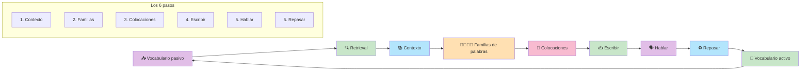

# Masterclass: Cómo Convertir tu Vocabulario Pasivo en Activo 🧠→🗣️

> **La premisa central de esta guía** — No basta con reconocer miles de palabras cuando lees o escuchas. La fluidez real depende de poder recuperarlas y usarlas en el momento. Esta guía te muestra el proceso de 6 pasos para cerrar esa brecha.

## Antes de empezar: 🎯 ¿qué vas a poder hacer al terminar esta guía?

Al terminar de leer y **aplicar** esta guía vas a poder:

- Diagnosticar si tu problema es vocabulario pasivo o una falta de práctica de producción.
- Aplicar el proceso de **retrieval** para mover palabras del almacén a la caja de herramientas.
- Usar las 6 técnicas de Maddie (contexto, familias de palabras, colocaciones, escritura, habla, repaso) para transformar 5 palabras por sesión en vocabulario activo.
- Diseñar una rutina de vocabulario activo de 15-20 minutos por día.

---

## MAPA DEL WORKFLOW 🔄



---

## PARTE 1 — 🚨 El problema: sabes la palabra, pero no te sale

> *"Knowing thousands of words but being unable to use them during speech."*
> — Maddie, Slow English Podcast (0:00–0:18)

Es una de las frustraciones más comunes entre estudiantes intermedios y avanzados: estás leyendo un texto o escuchando un podcast, reconocés la palabra, pero cuando querés usarla en una conversación, no viene a la mente. Usás sinónimos más simples, circunloquios o directamente te trabas.

### La diferencia entre vocabulario pasivo y activo

| | 📦 Vocabulario pasivo | 🔧 Vocabulario activo |
|---|---|---|
| **Qué es** | Palabras que reconocés cuando escuchás o leés | Palabras que podés recuperar y usar en una conversación real |
| **Cuándo se activa** | Reconocimiento | Producción en tiempo real |
| **Ejemplo** | Sabés que *"sustainable"* significa "sostenible" cuando lo leés | Podés decir *"This business model is sustainable long-term"* sin pensarlo |
| **Tamaño típico** | 5.000–10.000 palabras | 2.000–5.000 palabras (mucho más chico) |

> **Analogía:** tu cerebro es una biblioteca. El vocabulario pasivo son los libros en las estanterías: están ahí, los reconocés cuando los ves, pero no los tenés a mano para escribir con ellos. El vocabulario activo es el libro que tenés sobre el escritorio: lo podés agarrar y usar en cualquier momento.

### La causa raíz: el retrieval

> *"The core issue is the difference between passive vocabulary and active vocabulary."*
> — Maddie, video (1:55–2:46)

> *"The key to bridging this gap is a process called retrieval."*
> — Maddie, video (3:00–3:42)

El problema no es que no conozcas la palabra. El problema es que **no la practicás recuperándola**. Tu cerebro está optimizado para reconocer, no para producir. Si solo haces actividades de comprensión (leer, escuchar), nunca generás las redes neuronales necesarias para recuperar palabras bajo presión comunicativa.

**Retrieval** = el acto de intentar recordar una palabra sin ayuda. Es el ejercicio que convierte el vocabulario pasivo en activo.

---

## PARTE 2 — 🛠️ Los 6 pasos para construir vocabulario activo

Maddie propone un proceso sistemático para transformar palabras nuevas en vocabulario activo. La clave: **no aprender palabras de a una, sino en bloques de 5 palabras por sesión**.

### Paso 1: Aprendé en contexto 📖

> *"Never learn words in isolation or through translation. Always see how they function in sentences."*
> — Maddie, video (4:23–7:35)

#### Por qué funciona

Las palabras no existen aisladas: existen en redes de significado. Cuando aprendés una palabra en contexto, tu cerebro la conecta con otras palabras, estructuras y situaciones, lo que facilita su recuperación posterior.

#### Aplicación práctica

**Mal:** aprender *"sustainable = sostenible"* en una flashcard.

**Bien:** aprender *"sustainable"* dentro de frases reales:

```
- This business model is sustainable long-term.
- We need to find a sustainable solution to plastic waste.
- Sustainable energy is becoming cheaper than fossil fuels.
- The company aims to be carbon-neutral by 2030.
```

Cada frase te muestra:
- Cómo se combina con otros conceptos
- Qué estructura gramatical usa
- En qué situaciones se usa

> **Analogía:** aprender palabras aisladas es como conocer a una persona solo por su nombre. Aprender en contexto es como conocerla en una fiesta: sabés con quién habla, de qué habla, cómo se mueve en grupo. Cuando la volvés a ver, la reconocés inmediatamente.

#### Ejercicio práctico

1. Elegí 5 palabras nuevas esta semana.
2. Por cada palabra, buscá 3 frases reales en Google, noticias o podcasts donde se use.
3. Escribí esas frases en un cuaderno o app.
4. No escribas la traducción al español; solo la palabra en inglés y las frases.

---

### Paso 2: Aprendé las familias de palabras 👨‍👩‍👧‍👧

> *"For every new word, record its noun, verb, adjective, and adverb forms."*
> — Maddie, video (7:50–9:16)

#### Por qué funciona

La mayoría de las palabras en inglés pertenecen a una **familia**: una raíz común con formas derivadas. Si aprendés solo la forma base, estás limitando tu capacidad de expresión.

#### Aplicación práctica

Para cada palabra nueva, completá la familia:

| Raíz | Sustantivo | Verbo | Adjetivo | Adverbio |
|------|-----------|-------|----------|----------|
| economy | economy | economize | economic | economically |
| environment | environment | — | environmental | environmentally |
| innovation | innovation | innovate | innovative | innovatively |
| pressure | pressure | pressure | — | under pressure |
| success | success | succeed | successful | successfully |

**Ejemplo completo con *"succeed":***

```
- Noun: success / a success
- Verb: succeed / succeed in / succeed at
- Adjective: successful / unsuccessful
- Adverb: successfully / unsuccessfully
- Collocations: succeed in business, succeed at school, succeed without help
```

> **Analogía:** aprender solo la forma base de una palabra es como tener un juego de mesa con solo una pieza. Las familias de palabras te dan todas las piezas del mismo juego, listas para usar en diferentes situaciones.

#### Ejercicio práctico

1. Tomá las 5 palabras de la semana.
2. Para cada una, buscá su familia completa (sustantivo, verbo, adjetivo, adverbio).
3. Escribí 1 frase por cada forma de la familia.
4. Repasá las familias el fin de semana.

---

### Paso 3: Aprendé las colocaciones (collocations) 🔗

> *"Discover which words naturally 'go together' to sound more natural and sophisticated."*
> — Maddie, video (9:22–12:33)

#### Por qué funciona

Los hablantes nativos no eligen palabras al azar: usan **colocaciones**, combinaciones que suenan naturales porque así las aprendieron. Si usás combinaciones incorrectas, sonás forzado o poco natural, incluso si la gramática es perfecta.

#### Tipos de colocaciones más comunes

| Tipo | Ejemplo correcto | Ejemplo incorrecto |
|------|------------------|-------------------|
| Verbo + sustantivo | **make** a decision | *do* a decision |
| Verbo + sustantivo | **do** research | *make* research |
| Adjetivo + sustantivo | **strong** coffee | *powerful* coffee |
| Sustantivo + verbo | The economy **grew** | The economy *grew up* |
| Preposición + sustantivo | **at** risk | *in* risk |

#### Aplicación práctica

Para cada palabra nueva, buscá 2-3 colocaciones comunes:

```
Palabra: decision
- make a decision
- make a final decision
- make an informed decision
- struggle to make a decision

Palabra: research
- do research
- conduct research
- research shows that...
- further research is needed
```

> **Analogía:** las colocaciones son como las combinaciones de ingredientes en la cocina. Podés mezclar cualquier cosa, pero algunas combinaciones saben bien y otras no. Los nativos aprendieron las combinaciones "ricas" desde chicos; vos tenés que aprenderlas explícitamente.

#### Ejercicio práctico

1. Por cada palabra nueva de la semana, buscá 2 colocaciones en un corpus o buscador.
2. Escribí las colocaciones en tu cuaderno junto con la familia de palabras.
3. Usá al menos 1 colocación por palabra en tu texto de escritura (paso 4).

---

### Paso 4: Escribí un texto ✍️

> *"Transition from a consumer to a producer by writing short paragraphs using your new words."*
> — Maddie, video (12:52–14:55)

#### Por qué funciona

Escribir es el puente entre el conocimiento pasivo y el activo. Cuando escribís, estás **produciendo** con las palabras nuevas, lo que fuerza a tu cerebro a recuperarlas en el momento.

#### Aplicación práctica

**El texto de vocabulario semanal:**

1. Tomá las 5 palabras de la semana.
2. Escribí un párrafo de 5-7 oraciones usando todas las palabras (con sus familias y colocaciones).
3. El tema del párrafo: algo de tu vida real (tu trabajo, un hobby, un problema, una noticia que leíste).
4. No lo traduzcas: escribí directamente en inglés.

**Ejemplo con las palabras: economy, environment, innovation, pressure, success**

```
The current economy is putting a lot of pressure on small businesses. However, companies that focus on innovation are finding sustainable ways to grow. For example, new technologies are helping us protect the environment while keeping costs low. I believe this approach will lead to long-term success, not just short-term profits.
```

> **Analogía:** escribir con palabras nuevas es como probar un músculo nuevo. Si solo mirás pesas en el gimnasio (reconocés la palabra), no ganás fuerza. Cuando las levantás (las usás en un texto), tus circuitos neuronales se fortalecen.

#### Ejercicio práctico

1. Cada domingo, escribí un párrafo con las 5 palabras de la semana.
2. Usá al menos 1 forma de la familia y 1 colocación por palabra.
3. Guardá todos los párrafos en un documento o app.
4. Al final del mes, tenés 20 párrafos de vocabulario activo para repasar.

---

### Paso 5: Hablá sobre ello 🗣️

> *"Practice reading your text aloud, pretending to present to an audience, and defending your ideas."*
> — Maddie, video (15:12–17:16)

#### Por qué funciona

Leer en voz alta convierte el vocabulario visual en **vocabulario motor**: tu boca practica los sonidos, el ritmo y la entonación. Hablar como si estuvieras presentando agrega presión comunicativa, que es lo que necesitás para entrenar la recuperación en tiempo real.

#### Aplicación práctica

**La rutina de habla de vocabulario:**

1. Tomá el párrafo que escribiste en el paso 4.
2. Leélo en voz alta 3 veces:
   - Primera vez: lento, pronunciando cada palabra claramente.
   - Segunda vez: a velocidad normal, con ritmo natural.
   - Tercera vez: como si estuvieras presentando a una audiencia, explicando tus ideas.
3. Después, sin mirar el texto, intentá explicar la misma idea en voz alta durante 60 segundos.
4. Si te trabas en una palabra, volvé al texto y repetí esa parte.

> **Analogía:** leer en voz alta es como ensayar un discurso antes de subir al escenario. La primera vez te sale torpe; la tercera vez ya suena natural. Ese ensayo es lo que convierte el vocabulario escrito en vocabulario hablado.

#### Ejercicio práctico

1. Después de escribir el párrafo de la semana, dedicá 5 minutos a leerlo en voz alta.
2. Grabate con el celular.
3. Escuchate para identificar palabras que te costaron pronunciar o recordar.
4. Repetí hasta que el párrafo salga fluido.

---

### Paso 6: Repasá periódicamente ♻️

> *"Instead of rote memorization, review by re-reading your own written texts and creating new versions of them."*
> — Maddie, video (17:50–20:56)

#### Por qué funciona

El repaso mecánico (flashcards, listas) refuerza el reconocimiento, pero no la producción. Repasar **tus propios textos** es más efectivo porque:
- Están en contexto (frases reales que escribiste).
- Tienen significado emocional (son tus ideas).
- Te obligan a recuperar la palabra en un contexto significativo.

#### Aplicación práctica

**El sistema de repaso semanal:**

1. **Domingo:** escribí el párrafo nuevo con las 5 palabras de la semana.
2. **Lunes, miércoles, viernes:** leé el párrafo en voz alta y intentá explicarlo sin mirar.
3. **Sábado:** escribí un **nuevo párrafo** usando las mismas 5 palabras, pero con un tema distinto.

**Ejemplo de nueva versión:**

```
Original (tema: economía):
The current economy is putting a lot of pressure on small businesses. However, companies that focus on innovation are finding sustainable ways to grow.

Nueva versión (tema: educación):
The education system is under pressure to prepare students for jobs that don't exist yet. Teachers who embrace innovation are finding sustainable ways to keep students engaged.
```

> **Analogía:** repasar tus propios textos es like revisar fotos de un viaje. Cada vez que las ves, recordás no solo el lugar, sino lo que sentiste ahí. Las palabras en tus textos tienen esa carga emocional; las flashcards no.

#### Ejercicio práctico

1. El sábado de cada semana, tomá el párrafo de la semana anterior.
2. Reescribilo con un tema nuevo usando las mismas palabras.
3. Compará las dos versiones para ver cómo varió tu uso del vocabulario.

---

## PARTE 3 — 📋 La regla de las 5 palabras por sesión

> *"Start with just five words per study session to ensure you master the context, word families, and collocations for each."*
> — Maddie, video (21:07–21:50)

Maddie recomienda **máximo 5 palabras por semana**, no por día. Por qué:

- Si intentás aprender 20 palabras por semana, las aprendés de forma superficial.
- Con 5 palabras, podés profundizar en contexto, familias, colocaciones, escritura y habla.
- La calidad del aprendizaje supera a la cantidad.

**La fórmula de la sesión semanal:**

```
Sesión de 20 minutos:
├── 5 min — Paso 1-3: Contexto, familias y colocaciones
├── 5 min — Paso 4: Escribir el párrafo
├── 5 min — Paso 5: Leer en voz alta y presentar
└── 5 min — Paso 6: Repaso del texto anterior
```

---

## PARTE 4 — 🗓️ Plan de acción: 4 semanas para vocabulario activo

### Semana 1: Diagnóstico y base

- [ ] 📊 Hacé un test honesto: escribí 10 oraciones sobre tu trabajo sin consultar diccionario. Anotá las palabras que te faltaron.
- [ ] 📝 Elegí tus primeras 5 palabras de esa lista.
- [ ] 🗂️ Aplicá los pasos 1-3 (contexto, familias, colocaciones).
- [ ] ✍️ Escribí el primer párrafo (paso 4).
- [ ] 🗣️ Leelo en voz alta 3 veces (paso 5).

### Semana 2: Profundización

- [ ] 📚 Elegí 5 palabras nuevas (pueden ser del mismo dominio o de uno nuevo).
- [ ] 🗂️ Aplicá los pasos 1-3.
- [ ] ✍️ Escribí el segundo párrafo.
- [ ] 🔄 Repasá el párrafo de la semana 1: reescribilo con un tema nuevo.
- [ ] 🗣️ Leé ambos párrafos en voz alta.

### Semana 3: Expansión

- [ ] 📚 Elegí 5 palabras nuevas.
- [ ] 🗂️ Aplicá los pasos 1-3.
- [ ] ✍️ Escribí el tercer párrafo.
- [ ] 🔄 Repasá los párrafos 1 y 2: reescribilos con temas nuevos.
- [ ] 🗣️ Grabate leyendo los 3 párrafos.

### Semana 4: Consolidación

- [ ] 📚 Elegí 5 palabras nuevas.
- [ ] 🗂️ Aplicá los pasos 1-3.
- [ ] ✍️ Escribí el cuarto párrafo.
- [ ] 🔄 Repasá los 4 párrafos anteriores: reescribilos con temas nuevos.
- [ ] 🗣️ Hacé una presentación de 2 minutos usando las 20 palabras de las 4 semanas.

---

## PARTE 5 — ⚠️ Errores comunes al construir vocabulario activo

| Error | Por qué pasa | Solución |
|-------|--------------|----------|
| ❌ **Aprender 20 palabras por semana** | Creemos que más = mejor | Quedate con 5 palabras y profundizá en cada una. |
| ❌ **Aprender sin contexto** | Es más rápido memorizar listas | Buscá 3 frases reales por palabra antes de escribir el párrafo. |
| ❌ **Solo aprender la forma base** | Nos olvidamos de las familias | Completá la tabla de familias para cada palabra. |
| ❌ **No escribir ni hablar** | Solo consumimos contenido | Los pasos 4 y 5 son obligatorios; sin producción, no hay vocabulario activo. |
| ❌ **Repasar con flashcards** | Refuerzan el reconocimiento, no la producción | Repasá tus propios textos escritos (paso 6). |
| ❌ **Elegir palabras muy raras** | Queremos sonar sofisticados | Elegí palabras que usarías realmente en una conversación. |

---

## PARTE 6 — 📚 Glosario de conceptos clave

- 🗣️ **Vocabulario pasivo:** palabras que reconocés cuando escuchás o leés, pero que no usás espontáneamente al hablar.
- 🔧 **Vocabulario activo:** palabras que podés recuperar y usar en una conversación real sin esfuerzo.
- 🔍 **Retrieval:** el acto de intentar recordar una palabra sin ayuda; el ejercicio clave para mover vocabulario del almacén a la caja de herramientas.
- 📖 **Contexto:** el entorno de frases y situaciones donde funciona una palabra; aprender en contexto genera redes de asociación más robustas.
- 👨‍👩‍👧‍👧 **Familia de palabras:** conjunto de formas derivadas de una misma raíz (sustantivo, verbo, adjetivo, adverbio).
- 🔗 **Colocación (collocation):** combinación natural de palabras que los hablantes nativos usan sin pensar (ej: *make a decision*, *do research*).
- ✍️ **Producción escrita:** escribir párrafos con palabras nuevas para forzar su recuperación.
- 🗣️ **Producción oral:** leer en voz alta y hablar sobre el texto para transferir el vocabulario al habla.
- ♻️ **Repaso regenerativo:** reescribir textos propios con temas nuevos, en vez de repetir flashcards.
- 🧠 **Reteaching:** el proceso de volver a aprender una palabra en un contexto nuevo, que fortalece su activación en la memoria.

---

## PARTE 7 — 🧠 Resumen mental (para fijar el conocimiento)

Si tuvieras que recordar solo 3 ideas de esta masterclass:

1. 📦 **El tamaño de tu vocabulario pasivo no importa si no podés usarlo.** Reconocer 10.000 palabras no te sirve si solo podés producir 2.000. La fluidez depende del vocabulario activo, no del pasivo.
2. 🔍 **La clave es el retrieval, no el reconocimiento.** Tenés que practicar recuperar palabras sin ayuda, no solo verlas en listas. Escribir y hablar son los ejercicios que lo logran.
3. 🎯 **5 palabras por semana, bien aprendidas, valen más que 20 palabras superficiales.** Profundizá en contexto, familias, colocaciones, escritura y habla. La calidad supera a la cantidad.

---

## PARTE 8 — 🌐 Recursos para profundizar

- 🎥 Video original: Maddie from Slow English Podcast — *"How to Turn Passive Vocabulary into Active Vocabulary"* (timestamps referenciados en esta guía).
- 📖 Libro: *"Make It Stick"* de Peter Brown — ciencia de la memoria aplicada al aprendizaje de vocabulario.
- 📚 Libro: *"Vocabulary in Use"* (Cambridge) — series por nivel con familias de palabras y colocaciones.
- 🤖 Herramienta: Reverso Context o Ludwig.guru — para buscar colocaciones reales en corpus de inglés.
- 📱 App: Anki o Quizlet — para repaso espaciado, pero solo después de escribir y hablar las palabras (pasos 4 y 5 primero, repaso después).
- 🗂️ Framework: * retrieval practice* de Bjork & Bjork — la base científica de por qué intentar recordar sin ayuda es más efectivo que volver a leer.

---

*Guía elaborada como síntesis del video de Maddie (Slow English Podcast) sobre cómo convertir vocabulario pasivo en activo mediante los 6 pasos: contexto, familias de palabras, colocaciones, escritura, habla y repaso regenerativo.*
