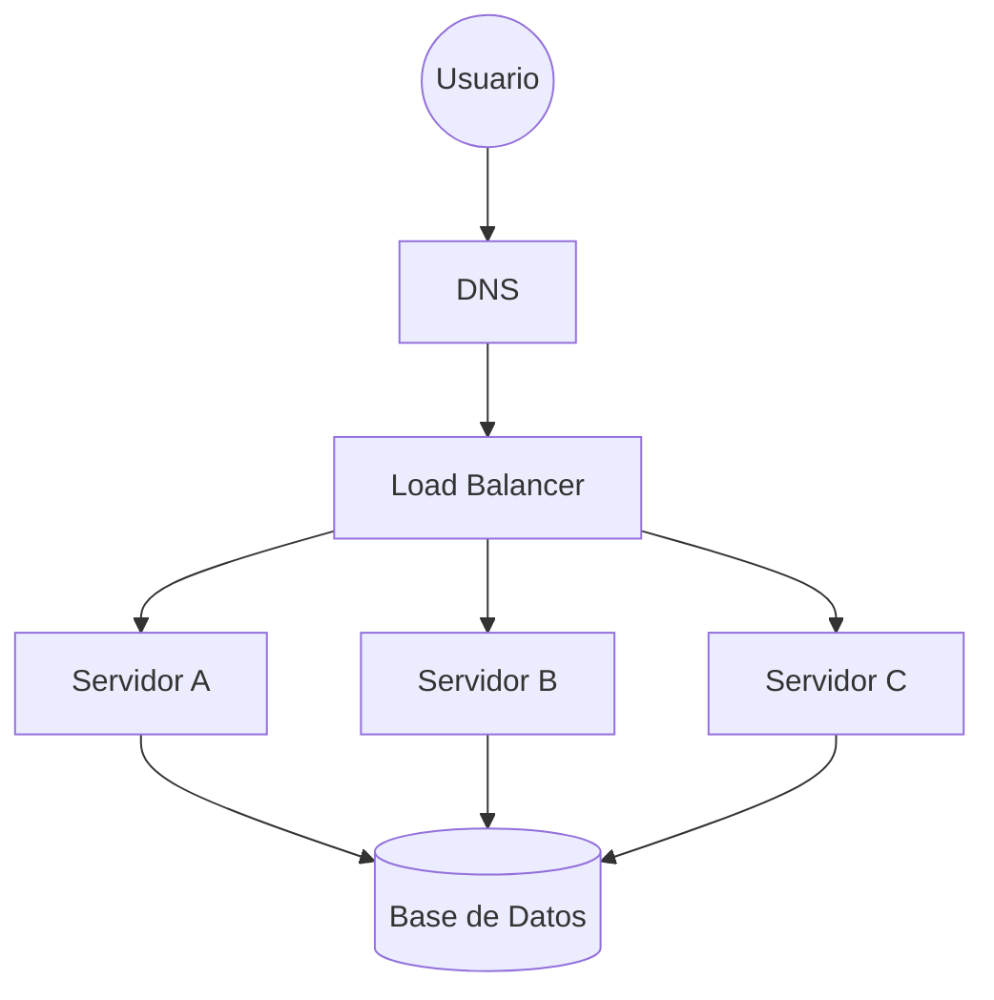

# Maestría en System Design: Construyendo Escala Global 🏗️🌐

## INTRODUCCIÓN: LA EVOLUCIÓN DEL ARQUITECTO

### El Gancho: ¿Por qué fallan los sistemas?
Casi cualquier aplicación funciona bien con 10 usuarios. El verdadero reto surge cuando el número sube a 10.000, 100.000 o un millón. El **System Design** no es solo sobre servidores; es sobre la capacidad de tomar decisiones bajo presión que permitan que un sistema crezca sin colapsar.

En esta guía, recorreremos el camino de un Senior Engineer para diseñar infraestructuras robustas, seguras y altamente escalables.

---

## PARTE 1: DE "HOLA MUNDO" A LA ESCALA REAL

### 1.1 El Servidor Único
Todo comienza aquí: una base de datos y un servidor web en la misma máquina. Es simple, barato y fácil de depurar. Sin embargo, tiene un problema crítico: es un **SPOF** (Punto Único de Falla). Si la máquina falla, el negocio muere.

**El Flujo Básico:**
- **DNS**: Traduce tu URL a una IP.
- **HTTP**: El protocolo de comunicación.

---

## PARTE 2: EL DILEMA DEL ALMACENAMIENTO

¿SQL o NoSQL? No hay una respuesta correcta, solo compromisos (**trade-offs**).

| Tipo | Ideal para... | Características |
|------|---------------|-----------------|
| **SQL (Relacional)** | Datos estructurados, transacciones críticas. | Esquema rígido, fuerte consistencia (ACID), JOINs potentes. |
| **NoSQL** | Datos no estructurados, alto volumen, baja latencia. | Esquema flexible, escalamiento horizontal nativo, eventual consistencia. |

> [!TIP]
> **Heurística de Decisión**: Si necesitas integridad de datos innegociable (finanzas), ve por SQL. Si necesitas velocidad extrema y flexibilidad de esquema (social media, analítica), ve por NoSQL.

---

## PARTE 3: EL ARTE DE ESCALAR Y EL LOAD BALANCER

### 3.1 Escalamiento Vertical vs Horizontal
- **Vertical (Scale Up)**: Añadir más RAM o CPU a tu servidor actual. Tiene un límite físico y económico.
- **Horizontal (Scale Out)**: Añadir más servidores económicos a tu flota. Es infinito y resiliente.

### 3.2 El Load Balancer (Balanceador de Carga)
El Load Balancer es el "director de orquesta" que reparte las solicitudes entre tus servidores.

> [!IMPORTANT]
> **Health Checks**: Un Load Balancer profesional debe monitorizar si sus servidores están "vivos". Si uno falla, lo saca de la rotación automáticamente.

---

## PARTE 4: REDES Y PROTOCOLOS

### 4.1 TCP vs UDP: ¿Fiabilidad o Velocidad?
- **TCP**: Establece una conexión y garantiza que todos los paquetes lleguen en orden. Indispensable para HTTP, Emails y Transferencias bancarias.
- **UDP**: Envía paquetes sin esperar confirmación. Es extremadamente rápido pero puede perder datos. Ideal para Streaming de video y Videojuegos online.

---

## PARTE 5: SEGURIDAD Y GOBERNANZA (AuthN & AuthZ)

Senior Design implica que la seguridad no es una capa posterior, sino parte del diseño.

- **Autenticación (AuthN)**: Verificar la identidad (OAuth2, JWT).
- **Autorización (AuthZ)**: Definir permisos granularmente (**RBAC** para roles, **ABAC** para atributos).
- **Protección**: Implementación de **Rate Limiting** para evitar ataques de fuerza bruta y DDoS en la capa de aplicación.

---

## PARTE 6: EL CHECKLIST DEL ARQUITECTO

Antes de considerar un diseño como "listo para producción", verifica:
- [ ] **Sin SPOF**: ¿Hay algún componente que, si falla, tumba todo el sistema?
- [ ] **Escalabilidad**: ¿Podemos añadir capacidad horizontal sin downtime?
- [ ] **Observabilidad**: ¿Tenemos logs y métricas de salud (Health Checks)?
- [ ] **Seguridad**: ¿Están los secretos protegidos y el acceso limitado?

---

## CONCLUSIÓN Y DESAFÍO DE DISEÑO

🧠 **Pausa de Reflexión**: 
Imagina que vas a diseñar el backend de una aplicación de mensajería global. ¿Priorizarías la consistencia de los mensajes (SQL) o la velocidad de entrega (NoSQL/UDP)? ¿Dónde pondrías la caché para reducir la carga en la base de datos?

---

**El buen diseño de sistemas es el arte de saber qué sacrificar para ganar lo que realmente importa para tu negocio.**
