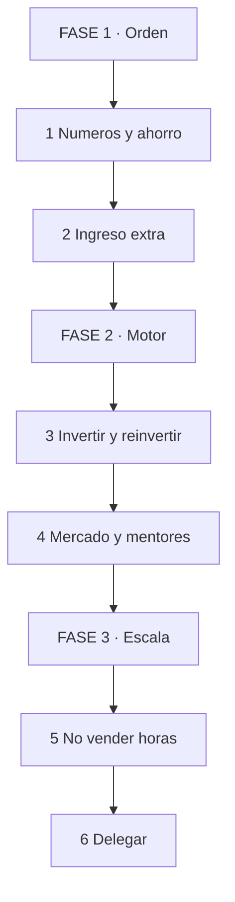
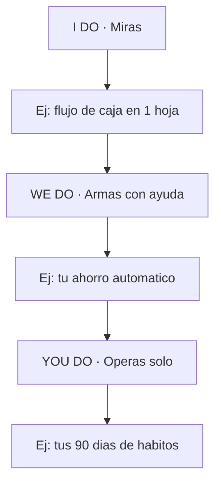

# 💰 MASTERCLASS: 10 Hábitos para Pasar de Mentalidad Pobre a Rica 🧠📈

## 🎯 INTRODUCCIÓN: POR QUÉ ESTA MASTERCLASS ES DIFERENTE 💡

Construir riqueza es un proceso largo de disciplina y estrategia, no un golpe de suerte. La diferencia entre mentalidad pobre y rica no es el sueldo: son 10 hábitos concretos.

> **🎯 Objetivo de Aprendizaje** — Al final tendrás tus números claros, ahorro automatizado, plan de ingreso extra y hoja de ruta para dejar de vender horas.

> **⚠️ Advertencia honesta** — Ningún hábito funciona sin medir. Si no sabes tu flujo de caja hoy, empieza por el hábito 2.

---

## 🗺️ MAPA DE LA RUTA — LEE DE ARRIBA HACIA ABAJO 🗺️

Cómo leerlo: empiezas en FASE 1, bajas hasta FASE 3. Sin orden financiero, la escala te rompe.

| Fase 🧩 | Qué logras 🎯 | Habilidad 🛠️ |
|------|---------------|--------------|
| **FASE 1 · Orden** (hábitos 2,4,5) | Flujo claro + colchón | Medir + Ahorrar |
| **FASE 2 · Motor** (hábitos 1,6,7,8) | Dinero trabajando | Invertir + Aprender |
| **FASE 3 · Escala** (hábitos 3,9,10) | Ingreso sin techo horario | Escalar + Delegar |

### Cómo vas a aprender: I Do → We Do → You Do

---

## 📊 FASE 1 · ORDEN

### Hábito 1 — Domina tus números

Debes entender tu flujo de caja, inversiones y gastos. Lo que no se mide se escapa.

| Bloque 📋 | Pregunta 🎯 |
|-----------|-------------|
| Ingresos | ¿Cuánto entra neto al mes? |
| Gastos | ¿Fijos vs variables? |
| Flujo | ¿Sobra o falta y cuánto? |
| Deuda | ¿Qué te cuesta cada una? |

### Hábito 2 — Ahorra antes de gastar

Automatiza el ahorro: aparta dinero al cobrar, no con lo que "sobre" a fin de mes.

| Mal ❌ | Bien ✅ |
|--------|---------|
| Cobro → gasto → "ahorro lo que quede" | Cobro → ahorro auto → gasto lo resto |

Regla inicial: 10% automático a cuenta separada. Innegociable.

### Hábito 3 — Busca ingreso extra

Sin capital inicial, trabaja extra para juntar el fondo de tu proyecto. El extra tiene destino: capital, no consumo.

> **📌 Idea clave** — Orden primero: números claros, ahorro automático e ingreso extra con destino. Sin esto, invertir es apostar.

---

## 🚀 FASE 2 · MOTOR

### Hábito 4 — Invierte, no gastes

Deja de gastar en activos que se deprecian. Prioriza inversiones que crecen con el tiempo.

| Deprecia 🚩 | Crece 🟢 |
|-------------|----------|
| Auto nuevo a crédito, último modelo de todo | Negocio propio, formación, activos que rinden |

### Hábito 5 — Reinvierte tus ahorros en tu negocio

No gastes el ahorro duramente ganado en gratificación inmediata. Cada peso reinvertido compra velocidad futura.

### Hábito 6 — Aprende de los mejores

Invierte en tu educación y en mentores que ya lograron lo que quieres. Paga por atajos probados.

### Hábito 7 — Estudia el mercado

No crees solo lo que te gusta. Analiza qué necesita y quiere el mercado, y valida antes de producir.

| Pregunta 📋 | Cómo validar 🎯 |
|-------------|-----------------|
| ¿Quién paga por esto? | 20 conversaciones reales |
| ¿Cuánto pagan hoy? | Precios de competencia |
| ¿Qué falta? | Quejas y huecos |

> **📌 Idea clave** — El motor es: invertir lo ahorrado, aprender de mentores y vender lo que el mercado ya quiere.

---

## 🏗️ FASE 3 · ESCALA

### Hábito 8 — Mentalidad emprendedora

Supera la mentalidad de sueldo fijo. Busca oportunidades escalables donde tu ingreso no tenga techo de horas.

### Hábito 9 — Deja de vender horas

Intercambiar tiempo por dinero no escala: tus horas son finitas. Mueve tu oferta a producto, sistema o equipo.

| Vende horas ❌ | Escala ✅ |
|----------------|-----------|
| 1 cliente = N horas tuyas | 1 sistema = N clientes |
| Si paras, facturas 0 | Activo que vende sin ti |

### Hábito 10 — Delega

Cuando tu hora vale más operando que ejecutando, delega tareas operativas y enfócate en crecimiento estratégico.

| Delega 📋 | Quédate 🎯 |
|-----------|------------|
| Operativo repetible con checklist | Estrategia, ventas clave, números |

> **📌 Idea clave** — Escalar es: ingreso sin techo horario + delegar lo operativo. Si todo depende de tus horas, tienes un empleo, no un negocio.

---

## 📅 PLAN 90 DÍAS

| Días 🗓️ | Enfoque 🎯 | Entregable 🏗️ |
|----------|-----------|---------------|
| 1-30 | Orden | Flujo en 1 hoja + 10% auto + plan de extra |
| 31-60 | Motor | 1 inversión o reinversión + 20 validaciones de mercado |
| 61-90 | Escala | 1 oferta no-horaria + 1 tarea delegada |

---

## 🧩 I DO / WE DO / YOU DO

### I Do — Tu flujo en 1 hoja

| Paso | Acción | Resultado |
|------|--------|-----------|
| 1 | Lista ingresos netos | Total mensual |
| 2 | Lista gastos fijos/variables | Total + fugas |
| 3 | Define 10% automático | Ahorro con fecha |

### We Do — Ahorro + extra con destino

| Decisión | Opción | Por qué |
|----------|--------|---------|
| Destino | Capital de proyecto | Extra sin destino se gasta |
| Cuenta | Separada, sin tarjeta | Fricción anti-gasto |
| Monto extra | Horas x precio | Meta semanal clara |

### You Do — Tus 90 días

| Criterio | Peso |
|----------|------|
| Flujo + ahorro auto activos | 30% |
| 1 inversión/reinversión hecha | 25% |
| Mercado validado con 20 charlas | 25% |
| 1 delegación u oferta escalable | 20% |

---

## ✅ CHECKLIST FINAL

| Bloque 📦 | Check ✔️ |
|--------|-------|
| Números | Flujo mensual en 1 hoja |
| Ahorro | 10% automático separado |
| Extra | Fuente con meta semanal |
| Inversión | Ahorro reinvertido, no gastado |
| Educación | Mentor o formación elegida |
| Mercado | 20 validaciones hechas |
| Escala | 1 oferta no-horaria |
| Delegación | 1 tarea fuera de tus manos |

---

## 📝 PREGUNTAS DE VERIFICACIÓN

1. Escribe tu flujo: ingresos, gastos y sobrante real de este mes.
2. ¿Qué gasto en depreciación recortarías primero y a dónde iría ese dinero?
3. Define tu ingreso extra: ¿qué, cuánto por semana y con qué destino?
4. ¿Qué parte de tu trabajo es vender horas y cómo la convertirías en sistema?
5. ¿Qué tarea delegarías primero y con qué checklist?

---

## 📖 GLOSARIO

| Término | Definición |
|---------|------------|
| **Flujo de caja** | Entradas menos salidas en un período |
| **Activo** | Lo que pone dinero en tu bolsillo |
| **Reinvertir** | Volcar ganancias al negocio en vez de gastarlas |
| **Nicho validado** | Segmento con 20+ conversaciones reales |
| **Escalable** | Ingreso que crece sin crecer tus horas |
| **Delegar** | Transferir operativo con checklist y control |

*Basada en la guía de Judit Català: 10 hábitos de mentalidad pobre a rica.*
