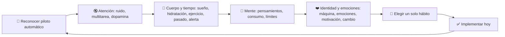
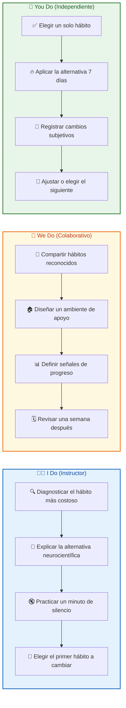
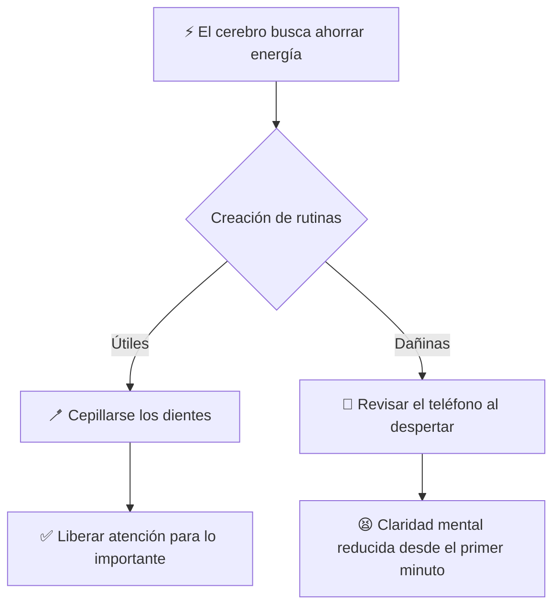
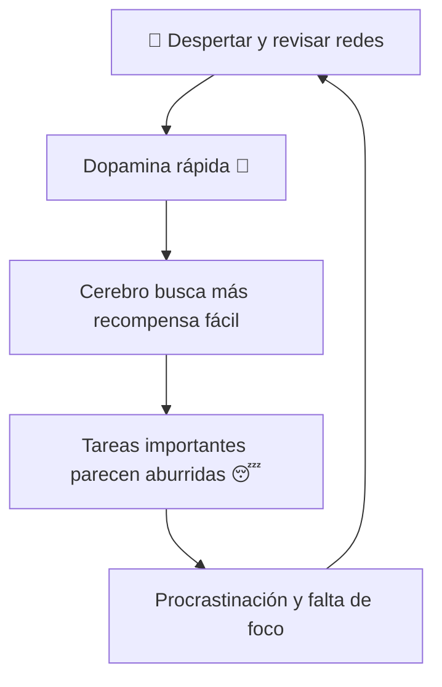
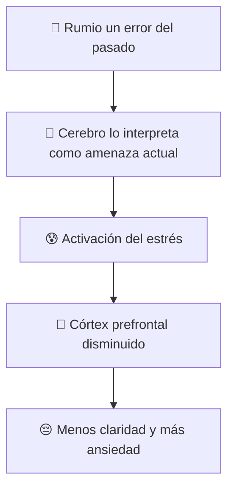
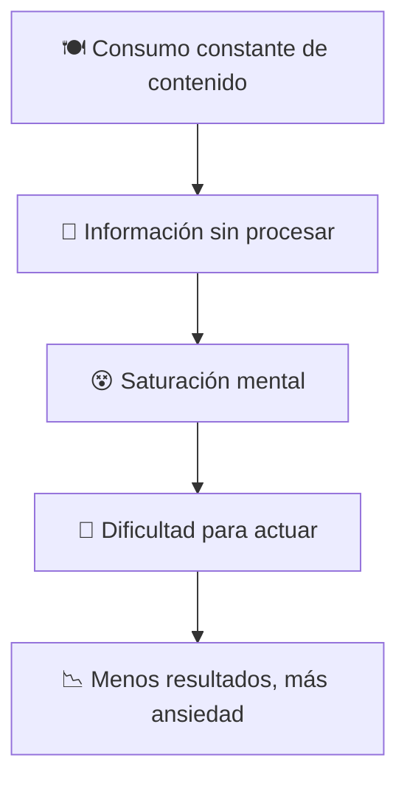
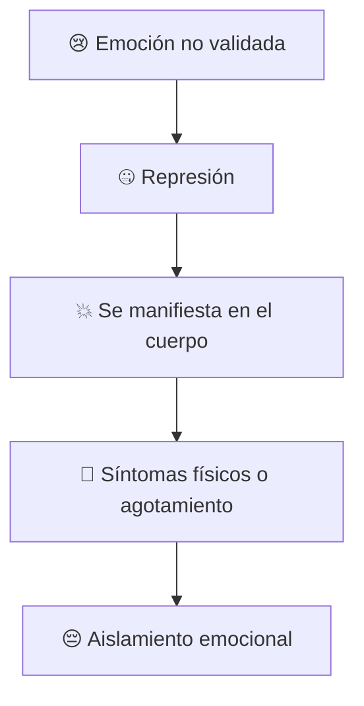
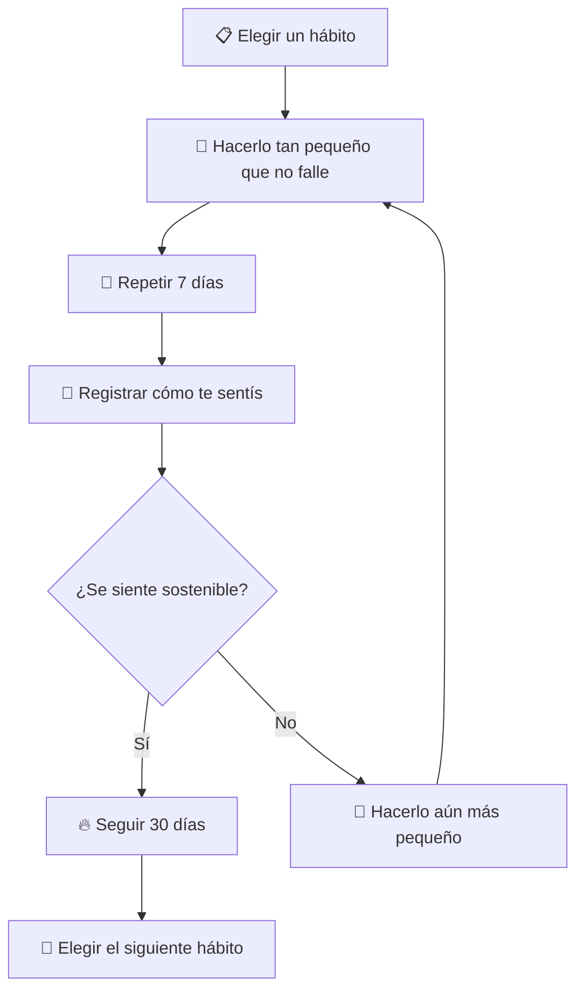

# MASTERCLASS: 13 Hábitos que Dañan tu Cerebro 🧠 — Neurociencia para Dejar el Piloto Automático

## 🎬 INTRODUCCIÓN: POR QUÉ ESTA MASTERCLASS ES DIFERENTE

📚 Muchos cursos de productividad y bienestar te piden que hagas más: más rutinas, más ejercicios, más técnicas. Esta masterclass propone lo contrario: **dejar de hacer ciertas cosas** 🚫 que, aunque parecen inocentes, están dañando tu cerebro todos los días.

🧠 Según la neurociencia contemporánea, vivimos gran parte del día en **piloto automático** ✈️. Repetimos comportamientos que el cerebro aprendió para ahorrar energía, pero que a la larga reducen nuestra claridad mental 💡, nuestra regulación emocional ❤️ y nuestra capacidad de disfrutar la vida 🌈.

🎤 Irene Albacete identifica **13 hábitos comunes** que nos mantienen en ese modo automático. No se trata de culparte 😌: se trata de tomar conciencia para empezar a trabajar **a favor de tu cerebro** ✅, no en su contra ❌.

> **🎯 Objetivo de Aprendizaje** — Al final de esta guía, podrás identificar los 13 hábitos que dañan tu claridad mental, entender la razón neurocientífica de cada uno y aplicar una alternativa concreta para empezar a cambiar desde hoy.

> **⚠️ Advertencia educativa** — Este contenido es formativo. No sustituye asesoría psicológica, médica ni profesional. Úsalo como marco de reflexión y acción personal.

---

## 🗺️ MAPA DEL WORKFLOW DE LOS 13 HÁBITOS



| 🧩 Bloque | ❓ Pregunta que responde | 🎁 Output principal |
|-----------|--------------------------|---------------------|
| **🧠 Piloto automático** | ¿Por qué repetimos comportamientos que no nos sirven? | 🎯 Conciencia del sistema de ahorro cerebral |
| **🔇 Atención** | ¿Cómo malgastamos nuestra energía mental? | 🎧 Tres hábitos para reducir ruido y dispersión |
| **🛌 Cuerpo y tiempo** | ¿Qué necesidades ignoramos? | 💧 Tres hábitos para recuperar recursos básicos |
| **🧘 Mente** | ¿Cómo nos distraemos de nosotros mismos? | 📺 Tres hábitos para ordenar pensamientos y consumo |
| **❤️ Identidad y emociones** | ¿Cómo nos exigimos de forma irracional? | 🤖 Cuatro hábitos para humanizar el cambio |
| **🎯 Acción final** | ¿Por dónde empezar? | ✅ Un solo hábito elegido e implementado hoy |



---

## 🧠 PARTE 0: EL PILOTO AUTOMÁTICO Y EL CEREBRO QUE AHORRA ENERGÍA

### 🎯 0.1 Principio Central

⚡ El cerebro humano consume aproximadamente el 20% de la energía del cuerpo 💪, a pesar de representar solo el 2% de su peso. Eso lo convierte en un órgano **obsesionado con ahorrar recursos** 🏦.

🛤️ Para lograrlo, crea atajos: repite comportamientos familiares, filtra información automáticamente y delega decisiones a rutinas. Esa capacidad es maravillosa cuando nos permite conducir un auto 🚗 o cepillarnos los dientes 🪥 sin pensar. Pero es peligrosa ⚠️ cuando automatiza hábitos que nos dañan.



### 📊 0.2 Piloto automático vs. consciencia

| 🔄 Piloto automático | 🎯 Consciencia activa |
|----------------------|-----------------------|
| 🤖 Repite sin cuestionar | 👁️ Observa antes de actuar |
| 📲 Responde a estímulos externos | 🧭 Elige según prioridades internas |
| 💤 Ahorra energía a corto plazo | ⚡ Invierte energía en lo que importa |
| 😔 Genera apatía y rumiación | 💡 Genera claridad y regulación |
| 🌪️ Te hace sentir que la vida pasa | 🎮 Te devuelve el control |

### 🏋️ 0.3 I Do — Diagnosticar tu piloto automático

**🎯 Objetivo:** identificar un hábito automático que te reste claridad.

| 🔢 Paso | 🔨 Acción | 🎁 Resultado |
|---------|-----------|--------------|
| 1️⃣ | Escribir 5 acciones que repetís sin pensar cada día | Mapa de rutinas |
| 2️⃣ | Marcar cuáles aportan y cuáles restan | Conciencia |
| 3️⃣ | Elegir el que más energía mental consume | Foco de cambio |
| 4️⃣ | Preguntarse: "¿Estoy haciendo esto a favor o en contra de mi cerebro?" | Dirección |

---

## 🔇 PARTE 1: LOS TRES HÁBITOS QUE DESTRUYEN TU ATENCIÓN

### 🎧 1.1 Hábito 1 — El vicio del ruido constante

**⏰ Momento clave en el video: 02:00**

🔇 El silencio no es una ausencia. Es un espacio activo 🎭 donde el cerebro procesa información 🧩, consolida recuerdos 🗂️ y organiza ideas 💡. Cuando llenamos cada segundo con ruido —🎵 música, 📳 notificaciones, 💬 conversaciones de fondo, 📺 videos— le robamos al cerebro la oportunidad de hacer ese trabajo.

> 🧠 **Irene Albacete:** "El cerebro necesita silencio para pensar. No para dejar de pensar, sino para pensar mejor."

| 🔊 Ruido constante | 🔇 Silencio intencional |
|--------------------|-------------------------|
| 🤯 Mente saturada | 🧘 Mente clara |
| 😵‍💫 Dificultad para concentrarse después | 🎯 Mayor capacidad de foco profundo |
| 🪫 Agotamiento mental | 🔋 Recuperación cognitiva |
| ⚡ Reacciones impulsivas | 🧠 Respuestas deliberadas |

#### 🔨 Alternativa concreta

🎯 Crear **micro-momentos de silencio** de 3 a 5 minutos al día. Puede ser al despertar 🌅, después de comer 🍽️ o antes de dormir 🌙. No se trata de meditar necesariamente 🧘, sino de permitir que el cerebro esté sin estímulos auditivos externos.

```text
🎯 Mi primer paso:

Elegiré un momento del día para estar en silencio: _______________

Durante esos minutos evitaré: teléfono 📱, música 🎵, videos 📺, conversaciones 💬

La señal de que funcionó será: ________________________________
```

### 🔄 1.2 Hábito 2 — La multitarea

**⏰ Momento clave en el video: 02:55**

🔄 La multitarea es uno de los mitos más persistentes de la productividad moderna 📉. La neurociencia demuestra que el cerebro no hace varias cosas a la vez: **cambia rápidamente de una a otra** ⏱️. Cada cambio cuesta energía ⚡ y genera un residuo llamado "costo de conmutación" 💸.

| 🙅 Multitarea | ✅ Monotarea |
|---------------|--------------|
| 🪫 Drena la batería mental | 🔋 Preserva energía |
| ❌ Aumenta errores | ✨ Mejora calidad |
| 😰 Crea sensación de urgencia | 🧘 Genera foco profundo |
| 💔 Fragmenta la atención | 🏁 Completa lo importante |

#### 🔨 Alternativa concreta

🎯 Aplicar la regla del **"un solo foco"**. Antes de empezar una tarea, definir:

1️⃣ ¿Qué es lo único que voy a hacer en los próximos 20 minutos?
2️⃣ ¿Qué voy a dejar fuera de alcance para no cambiar de foco? 📵
3️⃣ ¿Cómo sé que terminé? ✅

### 🍭 1.3 Hábito 3 — La dopamina barata

**⏰ Momento clave en el video: 03:50**

🍭 La dopamina es el neurotransmisor de la motivación 🚀 y el deseo 💖. Redes sociales 📱, notificaciones 🔔, likes 👍 y videos cortos 🎬 están diseñados para liberar dosis rápidas de dopamina sin esfuerzo. El problema es que el cerebro se adapta 📉: cuanto más dopamina barata recibe, menos sensible se vuelve a las recompensas que requieren esfuerzo, como estudiar 📚, trabajar 💼 o construir relaciones ❤️.



#### 🔨 Alternativa concreta

Proteger los **primeros 30 a 60 minutos del día** de la dopamina barata. No abrir redes sociales, noticias ni correos antes de hacer algo que requiera atención intencional.

| ❌ Evitar al despertar | ✅ Hacer primero |
|------------------------|------------------|
| 📱 Redes sociales | 🎯 Definir intención del día |
| 📰 Noticias | 🏃 Mover el cuerpo 5 minutos |
| 📧 Correos | 💧 Beber un vaso de agua |
| 🔔 Notificaciones | 📖 Leer 2 páginas de un libro |

### 📝 1.4 You Do — Tu protocolo de atención

Completa:

```text
📵 Mi protocolo de atención matutina:

1️⃣ Los primeros ______ minutos del día no toco: 📱 ___________________
2️⃣ Mi momento de silencio diario será: 🔇 ___________________________
3️⃣ La tarea que haré en modo monotarea hoy: 🎯 ______________________
4️⃣ Eliminaré estas distracciones de mi espacio: 🚫 ___________________
```

---

## 🛌 PARTE 2: LOS TRES HÁBITOS QUE IGNORAN EL CUERPO Y EL TIEMPO

### 😴 2.1 Hábito 4 — Negociar con necesidades básicas

**⏰ Momento clave en el video: 04:45**

😴 Dormir poco, no hidratarse 💧, saltear comidas 🍽️ o evitar el ejercicio 🏃 son formas de negociar con el cuerpo. El problema es que el cerebro no negocia 🚫: si no tiene los recursos básicos, funciona peor. El sueño limpia metabolitos 🧹, la hidratación permite la conducción nerviosa ⚡ y el movimiento mejora la neuroplasticidad 🧠.

| 🚫 Negociar | ✅ Priorizar |
|-------------|--------------|
| 😴 "Duermo después" | 🛌 Horario de sueño protegido |
| 💧 "No tengo sed" | 🍼 Botella de agua visible |
| 🏃 "Mañana hago ejercicio" | 🕐 10 minutos de movimiento hoy |

#### 🔨 Alternativa concreta

🎯 Elegir **una necesidad básica** y hacerla no negociable por 7 días. No hace falta ser perfecto ✨: un vaso de agua al despertar 💧, una caminata corta 🚶 o acostarse 15 minutos antes 🛌.

### ⏳ 2.2 Hábito 5 — Vivir en el pasado

**⏰ Momento clave en el video: 05:35**

⏳ Rumiar errores, conversaciones 💬 o situaciones pasadas no es solo un hábito mental. Es una señal de alarma 🚨 para el cerebro. Cuando revivimos un evento negativo, el sistema límbico lo interpreta como si estuviera sucediendo ahora ⏰. Eso activa el eje del estrés 😰 y mantiene el córtex prefrontal 🧠 —la parte racional— desconectado 🔌.



#### 🔨 Alternativa concreta

🏷️ Practicar el **"etiquetado" de la rumiación**. Cuando notes que tu mente vuelve al pasado ⏪, di en voz alta 🗣️ o mentalmente 💭: "Esto es una rumiación. No está pasando ahora." Esa simple etiqueta 🏷️ ayuda al cerebro a cambiar de modo 🔄.

### 🚨 2.3 Hábito 6 — El estado de alerta permanente

**⏰ Momento clave en el video: 08:00**

🚨 Vivir con el sistema nervioso siempre activado —pendiente del teléfono 📱, del trabajo 💼, de las noticias 📰, de los problemas— mantiene el cerebro en modo supervivencia 🦁. En ese estado, el córtex prefrontal funciona peor 📉 y las decisiones se vuelven reactivas ⚡, defensivas 🛡️ o impulsivas 🔥.

| ⚠️ Alerta permanente | 🧘 Recuperación del córtex |
|----------------------|----------------------------|
| 💪 Músculos tensos | 🧘 Pausas activas |
| 😮‍💨 Respiración superficial | 🌬️ Respiración lenta |
| 🏎️ Pensamiento acelerado | 🌿 Momentos de calma |
| 😨 Miedo constante | 🎁 Conexión con el presente |

#### 🔨 Alternativa concreta

⏱️ Implementar **pausas de regulación**. Cada 90 minutos 🕐, detenerse 2 minutos ⏸️: respirar lento 🌬️, mirar lejos 👀, estirarse 🤸 o caminar 🚶. Esto no es flojera 😴: es biología 🧬.

### 📝 2.4 We Do — Diseñar un día que respalde al cerebro

**🎭 Escenario:** una persona duerme mal, no bebe agua y vive pensando en problemas pasados.

| 🔴 Hábito actual | 🟢 Sustitución simple | 🎯 Señal de éxito |
|------------------|-----------------------|-------------------|
| 🌙 Acostarse tarde sin horario | 🛌 Acostarse 15 min antes durante 7 días | 😊 Se siente menos cansado al despertar |
| 🚫 No beber agua | 💧 Botella sobre el escritorio | ✅ Orina más clara, menos dolor de cabeza |
| 💭 Rumia nocturna | 📓 Diario de 3 minutos antes de dormir | 😴 Se duerme más rápido |
| 🚨 Alerta constante | ⏱️ Alarma cada 90 min para pausa | 🧘 Menos tensión al final del día |

---

## 🧘 PARTE 3: LOS TRES HÁBITOS QUE DISTORSIONAN LA MENTE

### 🥊 3.1 Hábito 7 — Pelear contra los pensamientos

**⏰ Momento clave en el video: 06:20**

🥊 Intentar reprimir o combatir los pensamientos negativos no funciona 🚫. Cuanto más peleamos contra una idea, más energía le damos ⚡. La neurociencia muestra que observar el pensamiento con distancia 👁️ —sin juzgarlo ni seguirlo— reduce su intensidad 📉 y nos devuelve el control 🎮.

| 🥊 Reprimir | 👁️ Observar |
|-------------|-------------|
| 🚫 "No debo pensar eso" | 💭 "Estoy teniendo el pensamiento de que..." |
| 📈 Aumenta la ansiedad | 📉 Reduce la carga emocional |
| ⚡ Da poder al pensamiento | 🧯 Lo desactiva gradualmente |

#### 🔨 Alternativa concreta

🧘 Usar la técnica de **defusión cognitiva**: añadir la frase "Estoy teniendo el pensamiento de que..." antes de cualquier idea automática. Por ejemplo: "💭 Estoy teniendo el pensamiento de que no voy a lograrlo". Eso crea distancia ↔️ sin negar la emoción ❤️.

### 📺 3.2 Hábito 8 — Consumir sin intención

**⏰ Momento clave en el video: 07:10**

📺 Leer 📖, ver videos 🎬 o escuchar podcasts 🎧 solo porque sentimos "hambre" 🍽️ de información sin digerir ni aplicar lo aprendido genera una sobrecarga cognitiva 🤯. El cerebro necesita tiempo ⏳ para procesar 🧩, conectar 🔗 y consolidar 🗄️. Consumir sin intención es como llenar un plato 🍽️ sin masticar 😬.



#### 🔨 Alternativa concreta

🤔 Antes de consumir cualquier contenido, preguntarse:

1️⃣ ¿Para qué quiero esto? 🎯
2️⃣ ¿Qué voy a hacer con esta información? 🔨
3️⃣ ¿Cuándo voy a revisar si la apliqué? 📅

### 🙅 3.3 Hábito 9 — Decir "sí" a todo

**⏰ Momento clave en el video: 08:50**

🙅 Decir sí a cada solicitud 📩, compromiso 📅 o interrupción 🔔 diluye la energía disponible para lo que realmente importa 💎. Cada "sí" implícito es un "no" 🚫 a tu atención 👁️, tu descanso 😴 o tus prioridades 🎯. El cerebro funciona mejor cuando tiene límites claros 🛡️.

| ✅ Decir sí a todo | 🛡️ Decir no con intención |
|--------------------|-----------------------------|
| 📅 Agenda saturada | 🏰 Tiempos protegidos |
| 😤 Resentimiento acumulado | ⚡ Energía sostenida |
| 🎭 Identidad definida por otros | 💎 Identidad propia |

#### 🔨 Alternativa concreta

💬 Crear una **frase de espera** para no responder de inmediato ⏸️. Por ejemplo: "Déjame revisar mi agenda 📅 y te confirmo en una hora ⏰". Esa pausa permite decidir con el córtex prefrontal 🧠, no con la ansiedad de agradar 😰.

### 📝 3.4 You Do — Tu filtro de consumo y límites

Completa:

```text
📺 Mi consumo intencional:

Antes de ver/leer/escuchar algo, preguntaré:
1️⃣ ¿Para qué lo necesito? 🎯 _________________________________
2️⃣ ¿Qué acción tomaré después? 🔨 ____________________________

🛡️ Mi frase para postergar compromisos:
"💬 _________________________________________________________"
```

---

## ❤️ PARTE 4: LOS CUATRO HÁBITOS QUE DEFORMAN LA IDENTIDAD

### 🤖 4.1 Hábito 10 — Tratarte como una máquina

**⏰ Momento clave en el video: 09:40**

🤖 Creer que podemos rendir de manera constante, sin ciclos ni descanso, es una fantasía industrial 🏭. Los seres humanos somos cíclicos 🌊: hay momentos de alta energía ⚡ y momentos de baja 💤. Ignorar esos ciclos genera agotamiento 😫, bloqueo creativo 🚫🎨 y problemas de salud 🤒.

| 🤖 Máquina | 🌿 Ser cíclico |
|------------|----------------|
| ⚙️ Rendimiento constante | 🌊 Ritmos de esfuerzo y descanso |
| 🏆 Descanso como premio | 🛌 Descanso como necesidad |
| 💀 Productividad a cualquier costo | ♻️ Sostenibilidad a largo plazo |

#### 🔨 Alternativa concreta

📈 Identificar tu **ritmo natural de energía** durante el día 🌅. ¿En qué horas tienes más foco? 🎯 ¿Cuándo necesitas descansar? 💤 Alinea las tareas difíciles 🧗 con tus picos de energía ⚡ y las tareas rutinarias 🧹 con los valles 🌊.

### 🤐 4.2 Hábito 11 — Enterrar emociones

**⏰ Momento clave en el video: 10:20**

🤐 Ignorar, minimizar o reprimir las emociones no las hace desaparecer 🚫. Las emociones no expresadas encuentran otras formas de salir: tensión muscular 💪, dolores de cabeza 🤕, irritabilidad 😠, ansiedad 😰 o agotamiento 😫. Validar lo que sentimos ❤️ —sin necesariamente actuar desde ahí— permite que la emoción cumpla su función ✅ y se disuelva 🌫️.



#### 🔨 Alternativa concreta

❤️ Practicar la **validación emocional**: "Estoy sintiendo X 😢, y tiene sentido que lo sienta". No es justificar 🛡️, es reconocer 👁️. Luego, decidir si la emoción requiere acción 🔨 o simplemente presencia 🧘.

### 🛋️ 4.3 Hábito 12 — Esperar a tener motivación

**⏰ Momento clave en el video: 11:00**

🛋️ Esperar motivación para empezar es una trampa 🪤. La motivación no suele preceder a la acción 🚶: muchas veces es su consecuencia ✨. El movimiento genera momentum 🌊. Cuando empezamos con algo pequeño 🌱, el cerebro recibe retroalimentación positiva 👍 y eso produce más ganas de continuar 🔥.

| 🛋️ Esperar motivación | 🚀 Empezar pequeño |
|-----------------------|--------------------|
| 🎢 Depende del estado de ánimo | ✅ Funciona aunque no tengas ganas |
| ⏳ Postergación | 📈 Avance acumulativo |
| 😤 Frustración | 💪 Confianza creciente |

#### 🔨 Alternativa concreta

🎯 Usar la regla del **"mínimo viable"**. En lugar de "hacer ejercicio" 🏋️, comprometerse con "ponerme las zapatillas 👟 y salir a la vereda". En lugar de "escribir el informe" 📝, comprometerse con "abrir el documento 📄 y escribir una oración ✍️".

### 🎭 4.4 Hábito 13 — Creer que cambiar es un drama

**⏰ Momento clave en el video: 11:00**

🎭 El cerebro prefiere cambios pequeños 🌱, predecibles 🔮 y constantes 📅. Las transformaciones dramáticas 🎆 generan resistencia 🛑, miedo 😨 y abandono 🏳️. Cambiar no es un evento épico 🏰: es la suma de decisiones minúsculas ✨ repetidas 🔁.

| 💥 Cambio dramático | 🌱 Cambio minúsculo |
|---------------------|---------------------|
| 🥗 Dieta radical | 🍎 Comer una fruta más al día |
| 🏋️ Gimnasio 2 horas | 🚶 10 minutos de caminata |
| 📚 Leer un libro por semana | 📖 Leer 5 páginas al día |
| 🏳️ Abandono frecuente | 🦁 Identidad que se construye |

#### 🔨 Alternativa concreta

Elegir **un solo hábito** y hacerlo tan pequeño que sea casi imposible fallar. Repetir durante 30 días antes de agregar otro.

### 📝 4.5 You Do — Tu plan de cambio mínimo

Completa:

```text
🌱 El hábito que daño más mi cerebro hoy es: ____________________

La alternativa mínima que implementaré es: ______________________

Será tan pequeña que no pueda fallar: ___________________________

Lo haré todos los días a las: ____________________________________

Si fallo un día, mi rebote será: ________________________________
```

---

## 🏁 PARTE 5: PONIENDO TODO JUNTO — DE LOS 13 HÁBITOS A UNO SOLO

### 🎯 5.1 Principio Central

No se trata de corregir los 13 hábitos a la vez. Eso sería un cambio dramático, exactamente lo que el cerebro rechaza. La propuesta de Irene Albacete es elegir **un solo hábito** y comenzar a implementarlo hoy mismo.

La clave no es la perfección. Es la repetición consciente. Cada vez que eliges la alternativa, estás votando por una nueva identidad: alguien que trabaja a favor de su cerebro.



### 📋 5.2 Protocolo de 7 días

| 📅 Día | 🔨 Acción | 📝 Registro |
|--------|-----------|-------------|
| 1 | Elegir el hábito y definir la versión mínima | Nota inicial de por qué importa |
| 2 | Ejecutar la alternativa una vez | Sensación antes y después |
| 3 | Repetir y ajustar el horario | ¿Fue fácil o difícil? |
| 4 | Conectar el hábito con una rutina existente | ¿A qué lo ataste? |
| 5 | Anticipar un obstáculo | Plan si fallás |
| 6 | Repetir incluso sin ganas | Registro de disciplina |
| 7 | Revisar: ¿qué cambió? | Decisión: continuar, ajustar o cambiar |

---

## 🏋️ PARTE 6: I DO / WE DO / YOU DO — EJERCICIOS PROGRESIVOS

### 6.1 I Do — Diagnosticar tu hábito principal

**🎯 Objetivo:** identificar con claridad qué hábito te resta más energía mental.

| 🔢 Paso | 🔨 Acción | 🎁 Resultado esperado |
|---------|-----------|-----------------------|
| 1️⃣ | Leer la lista de 13 hábitos | Conciencia inicial |
| 2️⃣ | Puntuar del 1 al 5 cuánto te identifica cada uno | Mapa personal |
| 3️⃣ | Elegir el que tenga mayor puntuación | Foco claro |
| 4️⃣ | Escribir cómo se manifiesta en tu día | Conciencia específica |
| 5️⃣ | Formular una alternativa mínima | Primer paso concreto |

### 6.2 We Do — Diseñar entornos de apoyo

**🎭 Escenario:** un grupo quiere reducir el ruido constante y la dopamina barata en sus mañanas.

| 🎯 Elemento | 🔨 Acción |
|-------------|-----------|
| 📱 Teléfono | Cargar fuera del dormitorio |
| 🔔 Notificaciones | Desactivarlas hasta las 9 AM |
| 🎵 Sonido | Acordar momentos compartidos de silencio |
| 🧘 Ritual | Definir una señal de inicio de día sin pantallas |
| 📅 Revisión | Compartir cómo fue la semana |

### 6.3 You Do — Tu experimento de 30 días

**🎯 Tarea:** elegir un hábito, aplicar la alternativa mínima durante 30 días y registrar el proceso.

Debes incluir:

- El hábito elegido y por qué
- La alternativa mínima
- El horario o ancla
- Una escala del 1 al 10 de claridad mental cada día
- Una nota breve al final de cada semana

| Criterio | Peso |
|----------|------|
| Claridad en el hábito elegido | 25% |
| Tamaño mínimo de la alternativa | 25% |
| Constancia en el registro | 25% |
| Ajustes realistas | 15% |
| Reflexión final | 10% |

---

## 🏆 COMPARATIVA FINAL

| 🧩 Hábito | 🔥 Daño principal | 🌱 Alternativa mínima |
|-----------|-------------------|------------------------|
| **🔇 Ruido constante** | Saturación mental | 3-5 minutos de silencio al día |
| **🔄 Multitarea** | Drenaje de energía | Monotarea de 20 minutos |
| **🍭 Dopamina barata** | Adicción a recompensas fáciles | Proteger los primeros minutos del día |
| **😴 Necesidades básicas** | Cerebro sin recursos | Una necesidad no negociable |
| **⏳ Vivir en el pasado** | Estrés presente por eventos pasados | Etiquetar la rumiación |
| **🚨 Alerta permanente** | Córtex prefrontal apagado | Pausas cada 90 minutos |
| **🥊 Pelear pensamientos** | Ansiedad creciente | Defusión cognitiva |
| **📺 Consumo sin intención** | Sobrecarga cognitiva | Preguntar para qué antes de consumir |
| **🙅 Decir sí a todo** | Energía dispersa | Frase de espera |
| **🤖 Tratarte como máquina** | Agotamiento | Alinear tareas con ciclos de energía |
| **🤐 Enterrar emociones** | Síntomas físicos | Validar lo que se siente |
| **🛋️ Esperar motivación** | Procrastinación | Regla del mínimo viable |
| **🎭 Cambiar es un drama** | Abandono recurrente | Cambio minúsculo durante 30 días |

---

## 🏁 CONCLUSIÓN

> 🧠 Tu cerebro no es tu enemigo. Es un sistema que busca ahorrar energía y sobrevivir. El problema aparece cuando los atajos que crea para ahorrar energía terminan robándote claridad, regulación emocional y bienestar.

Irene Albacete no propone una revolución radical. Propone algo mucho más poderoso: **la elección consciente de un solo hábito**.

No necesitás cambiarlo todo. Necesitás dejar de vivir en piloto automático lo suficiente como para elegir, una vez al día, trabajar a favor de tu cerebro.

Esa elección repetida es la que construye una mente más clara, una emoción más estable y una vida que se siente tuya.

---

## ✅ CHECKLIST FINAL

| 🧩 Bloque | ✅ Check |
|-----------|----------|
| 🔇 Atención | Identifiqué mi principal distractor mental |
| 🛌 Cuerpo | Elegí una necesidad básica a proteger |
| 🧘 Mente | Apliqué una técnica de observación o filtro |
| ❤️ Identidad | Elegí un cambio minúsculo para 30 días |
| 🎯 Acción | Comencé hoy, aunque sea con un paso pequeño |
| 📝 Registro | Tengo una forma de seguir mi progreso |

---

## 📝 PREGUNTAS DE VERIFICACIÓN

1. **🎯 Aplica**: ¿Cuál de los 13 hábitos se manifiesta más claramente en tu día a día?
2. **🔍 Analiza**: ¿Cómo afecta la dopamina barata tu capacidad de hacer tareas importantes?
3. **🎨 Diseña**: Escribe una alternativa mínima para el hábito que más te cuesta.
4. **💭 Reflexiona**: ¿Por qué crees que el cerebro prefiere cambios pequeños y constantes?
5. **🤝 Conecta**: ¿Cómo se relacionan el estado de alerta permanente y la dificultad para tomar decisiones?
6. **🚀 Propón**: ¿Qué entorno podrías modificar para hacer más fácil tu cambio elegido?

---

## 📖 GLOSARIO RÁPIDO

| 📚 Término | 📝 Definición |
|------------|---------------|
| **🧠 Piloto automático** | Modo en que el cerebro repite comportamientos sin intervención consciente |
| **⚡ Córtex prefrontal** | Región cerebral responsable de la planificación, el juicio y la regulación emocional |
| **🍭 Dopamina barata** | Recompensa rápida y fácil que reduce la sensibilidad al esfuerzo |
| **💭 Rumia** | Repetición obsesiva de pensamientos sobre el pasado |
| **🧘 Defusión cognitiva** | Técnica para observar los pensamientos sin dejarse atrapar por ellos |
| **🌱 Cambio minúsculo** | Modificación tan pequeña que es casi imposible fallar |
| **😰 Estrés crónico** | Activación prolongada del sistema nervioso que desgasta el cuerpo y la mente |
| **🛡️ Límite saludable** | Frontera que protege el tiempo, la energía y la identidad propia |
| **🎯 Monotarea** | Práctica de hacer una sola cosa a la vez |
| **📅 Anclaje de hábito** | Conectar un nuevo comportamiento con uno que ya existe |

---
