## ¿Qué vas a aprender

En este contenido desarrollarás los conocimientos para operar en mercados financieros con criterio:

- Tipos de activos, mercados y participantes del ecosistema financiero
- Análisis fundamental y técnico aplicado a la toma de decisiones
- Gestión de riesgo, posicionamiento y psicología del trader
- Estrategias probadas para diferentes perfiles y horizontes temporales
- Herramientas, plataformas y framework para operar de forma consistente


# MASTERCLASS: Los 6 Hábitos que Transforman Tu Vida

## INTRODUCCIÓN: EL ÉXITO NO ES UN MOMENTO, ES UN SISTEMA DIARIO

En este video, Maxi Leguizamo presenta seis hábitos que, según él, le permitieron transformar su vida y alcanzar mayor éxito económico y personal. La idea central no es copiar una rutina por moda, sino **modelar acciones, decisiones y mentalidades de personas que ya obtienen resultados**.

> **🎯 Objetivo de Aprendizaje** — Al final de esta guía, tendrás un sistema práctico para aplicar los 6 hábitos: despertar temprano, capacitarte, escribir metas, aportar valor, sostener foco y construir riqueza con ahorro e inversión.

> **⚠️ Alcance formativo** — Esta masterclass es educativa. No promete riqueza inmediata ni resultados garantizados. El éxito económico y personal depende de contexto, disciplina, gestión de riesgo, salud, entorno y ejecución constante.

---

## 🌐 MAPA DEL SISTEMA DE LOS 6 HÁBITOS

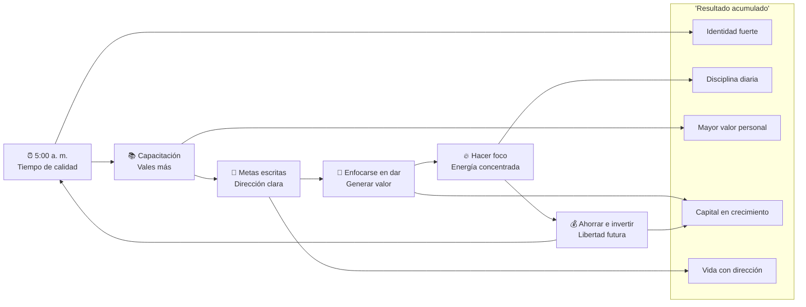

| Hábito | Propósito principal | Resultado esperado | Señal de dominio |
|--------|---------------------|--------------------|------------------|
| **⏰ Levantarse a las 5:00 a. m.** | Recuperar horas de alta concentración | Más tiempo, calma y ventaja competitiva | Duermes bien y usas la mañana con intención |
| **📚 Capacitación constante** | Aumentar tu valor personal | Mejores decisiones y oportunidades | Aprendes, aplicas y mides resultados |
| **🎯 Anotar las metas** | Salir del piloto automático | Dirección, claridad y motivación | Sabes qué quieres hoy, este mes y este año |
| **🤝 Enfocarse en dar** | Generar valor para otros | Confianza, relaciones y reputación | Aportas sin depender de recompensa inmediata |
| **🔥 Hacer foco** | Concentrar energía en una cosa | Avance real y menos dispersión | Dices “no” a lo que no suma |
| **💰 Ahorrar e invertir** | Construir margen financiero | Libertad y crecimiento patrimonial | Tu dinero trabaja con paciencia y educación |

---

## 🧠 LA FÓRMULA CENTRAL

```text
Hábito diario
    ↓
Identidad reforzada
    ↓
Acciones repetidas
    ↓
Resultados acumulados
    ↓
Transformación personal
```

> **💡 Concepto Clave** — No te conviertes en una persona exitosa porque un día haces algo extraordinario. Te conviertes en una persona exitosa porque repites acciones ordinarias con una intensidad extraordinaria.

---

# PARTE 1: ⏰ LEVANTARSE A LAS 5:00 A. M. — RECUPERAR TU VENTAJA

## 1.1 Principio Central

Levantarse a las 5:00 a. m. no es un ritual mágico. La magia está en lo que haces con esas primeras horas.

El mundo está más silencioso. Hay menos interrupciones. Tu mente suele estar más fresca. Si usas esas horas para entrenar, estudiar, planificar, leer o trabajar en tu proyecto principal, obtienes una ventaja que no depende de la motivación.

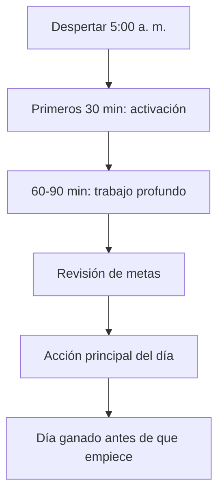

## 1.2 Qué ganas realmente

| Beneficio | Explicación | Ejemplo práctico |
|-----------|-------------|------------------|
| **🕒 Tiempo de calidad** | Horas sin notificaciones ni demandas externas | Leer 20 páginas antes del trabajo |
| **🧠 Mayor concentración** | La mente está menos saturada | Estudiar una habilidad difícil |
| **🚀 Ventaja competitiva** | Avanzas mientras otros recién despiertan | Crear contenido, vender, entrenar |
| **🧘 Calma emocional** | No empiezas el día reaccionando | Meditación, journaling, planificación |
| **✅ Autoconfianza** | Cumples una promesa temprana | “Ya gané el primer acuerdo del día” |

## 1.3 Error común: confundir madrugar con dormir poco

❌ **Mal enfoque:** dormir 4 horas, levantarte destruido y culpar al hábito.  
✅ **Enfoque correcto:** acostarte antes para despertar descansado.

| Mal hábito | Corrección |
|------------|------------|
| “Me levanto a las 5 pero duermo a la 1 a. m.” | Mover la hora de sueño progresivamente |
| “Uso la mañana para redes sociales” | Bloquear celular hasta terminar la rutina |
| “No sé qué hacer temprano” | Preparar la noche anterior |
| “Lo intento un día y abandono” | Compromiso mínimo de 21 a 30 días |

## 1.4 Sistema práctico: rutina 5AM

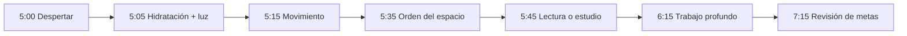

### Checklist de mañana

- [ ] 🛏️ Dormir suficiente la noche anterior.
- [ ] 💧 Tomar agua al despertar.
- [ ] ☀️ Recibir luz natural o luz fuerte.
- [ ] 📵 No revisar redes durante los primeros 60 minutos.
- [ ] 📝 Escribir la prioridad principal del día.
- [ ] 🧠 Hacer 60-90 minutos de trabajo profundo.
- [ ] ✅ Celebrar el cumplimiento, aunque sea pequeño.

## 1.5 Ejercicio I Do: mañana guiada

**Objetivo:** diseñar tu primera mañana de 5:00 a. m.

| Hora | Acción | Regla |
|------|--------|-------|
| 5:00 | Despertar | Sin negociar |
| 5:05 | Agua + baño | Activar cuerpo |
| 5:15 | Movimiento | 10-20 minutos |
| 5:35 | Ordenar espacio | 5 minutos |
| 5:45 | Lectura / estudio | 30 minutos |
| 6:15 | Trabajo profundo | 60-90 minutos |
| 7:15 | Desayuno / preparación | Sin prisa |

> **💡 Concepto Clave** — La mañana no se gana despertando temprano. Se gana protegiendo esas horas de distracciones baratas.

---

# PARTE 2: 📚 CAPACITACIÓN CONSTANTE — VOLVERTE MÁS VALIOSO

## 2.1 Principio Central

Para ganar más, primero debes **valer más**. Eso no significa acumular certificados, sino aumentar tu capacidad real de resolver problemas valiosos.

La capacitación constante combina:

```text
Libros + cursos + mentorías + práctica + feedback + aplicación real
```

## 2.2 Matriz de aprendizaje

| Fuente | Qué aporta | Riesgo | Cómo usarla bien |
|--------|------------|--------|------------------|
| **📘 Libros** | Fundamentos y modelos mentales | Leer sin aplicar | Tomar notas accionables |
| **🎓 Cursos** | Estructura y método | Consumir por dopamina | Terminar e implementar |
| **🧑‍🏫 Mentorías** | Feedback específico | Dependencia del mentor | Aplicar correcciones |
| **🛠️ Práctica** | Habilidad real | Practicar sin dirección | Medir resultados |
| **🔁 Feedback** | Ajuste rápido | Ego defensivo | Preguntar qué mejorar |
| **🗣️ Enseñar** | Consolidación | Creer que ya sabes todo | Explicar simple |

## 2.3 Sistema 70/20/10 de capacitación

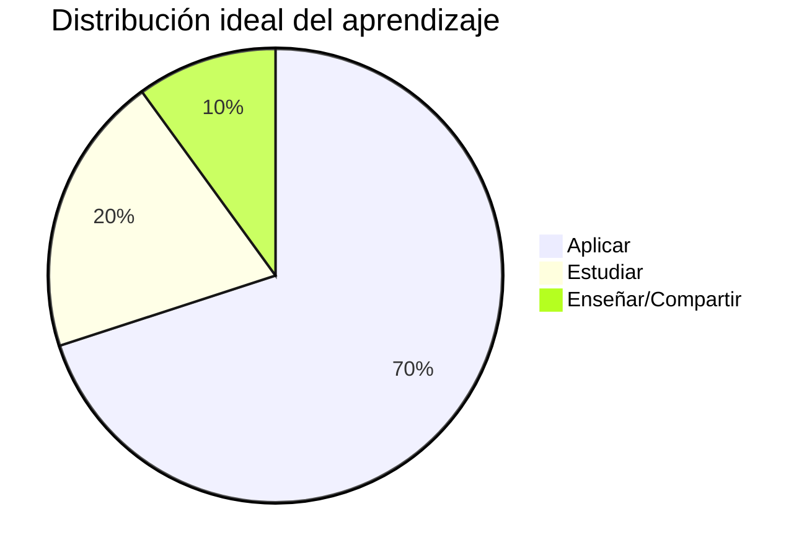

| Bloque | Porcentaje | Acción |
|--------|------------|--------|
| **🛠️ Aplicar** | 70% | Usar lo aprendido en proyectos reales |
| **📚 Estudiar** | 20% | Leer, ver clases, tomar notas |
| **🧑‍🏫 Enseñar** | 10% | Explicar, mentorar, crear contenido |

## 2.4 Educación barata vs educación de alto retorno

| Tipo | Ejemplo | Valor real |
|------|---------|------------|
| **Educación barata** | Comprar cursos sin terminarlos | Alivio emocional temporal |
| **Educación cara** | Mentoría sin aplicar | Gasto con culpa |
| **Educación de alto retorno** | Aprender una habilidad y venderla | Más capacidad, ingresos y confianza |

> **✅ Regla de oro:** si un curso no cambia tu comportamiento, no fue aprendizaje; fue entretenimiento educativo.

## 2.5 Plantilla de inversión en conocimiento

| Mes | Habilidad | Recurso | Costo | Acción concreta | Resultado esperado |
|-----|-----------|---------|-------|-----------------|--------------------|
| Junio | Ventas | Libro + práctica diaria | Bajo | 30 conversaciones | Mejor comunicación |
| Julio | Finanzas | Curso básico | Medio | Presupuesto mensual | Mayor control |
| Agosto | IA / productividad | Herramientas | Medio | Automatizar 3 tareas | Más tiempo libre |

## 2.6 Ejercicio We Do: plan de capacitación de 30 días

**Objetivo:** elegir una habilidad y convertirla en práctica diaria.

| Pregunta | Respuesta |
|----------|-----------|
| ¿Qué habilidad aumenta mi valor este mes? |  |
| ¿Qué recurso usaré? |  |
| ¿Cuántos minutos diarios dedicaré? |  |
| ¿Cómo voy a aplicar lo aprendido? |  |
| ¿Cómo voy a medir progreso? |  |

---

# PARTE 3: 🎯 ANOTAR LAS METAS — SALIR DEL PILOTO AUTOMÁTICO

## 3.1 Principio Central

Una meta que no está escrita es solo un deseo. Escribir metas obliga a definir dirección, prioridad y compromiso.

```text
Deseo: “Quiero mejorar mi vida”
Meta: “Voy a entrenar 4 días por semana durante 12 semanas”
Compromiso: “Entreno lunes, miércoles, viernes y sábado a las 7:00 a. m.”
```

## 3.2 Cascada de metas

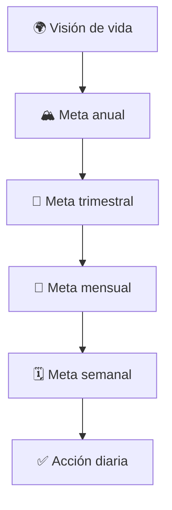

| Nivel | Pregunta clave | Ejemplo |
|-------|----------------|---------|
| **🌍 Vida** | ¿Qué tipo de persona quiero ser? | Ser libre, saludable y financieramente responsable |
| **🏔️ Año** | ¿Qué resultado quiero construir? | Ahorrar 10% mensual |
| **📅 Trimestre** | ¿Qué bloque de progreso necesito? | Crear fondo de emergencia |
| **📆 Mes** | ¿Qué avance concreto haré? | Reducir gastos hormiga |
| **🗓️ Semana** | ¿Qué acciones repetiré? | Revisar gastos cada domingo |
| **✅ Día** | ¿Qué haré hoy? | Registrar todos los gastos |

## 3.3 Sistema de journaling de metas

```python
# Pseudocódigo de metas diarias

def journal_diario():
    meta_vida = "Ser libre y financieramente responsable"
    meta_hoy = "Ahorrar e invertir 10% de mis ingresos"
    accion_hoy = "Registrar gastos y evitar compra impulsiva"
    evidencia = "Planilla actualizada"
    return {
        "meta_vida": meta_vida,
        "meta_hoy": meta_hoy,
        "accion_hoy": accion_hoy,
        "evidencia": evidencia
    }
```

## 3.4 Tabla de metas personales

| Área | Meta | Fecha límite | Acción diaria | Métrica |
|------|------|--------------|---------------|---------|
| 💪 Salud | Entrenar 4 veces por semana | 90 días | Ir al gimnasio/caminar | Sesiones completadas |
| 📚 Educación | Leer 12 libros al año | 31 diciembre | Leer 10 páginas | Páginas leídas |
| 💰 Finanzas | Ahorrar 10% mensual | 12 meses | Registrar gastos | Porcentaje ahorrado |
| 🧠 Mentalidad | Meditar 10 minutos | 60 días | Meditación diaria | Días seguidos |
| 🤝 Relaciones | Aportar valor semanal | Indefinido | Ayuda concreta | Personas impactadas |

## 3.5 Error común: metas demasiado grandes y vagas

❌ **Meta vaga:** “Quiero ser exitoso.”  
✅ **Meta útil:** “Voy a dedicar 90 minutos diarios, 5 días por semana, a construir una habilidad de alto valor durante los próximos 90 días.”

| Problema | Corrección |
|----------|------------|
| Meta sin fecha | Añadir fecha límite |
| Meta sin métrica | Definir número medible |
| Meta sin acción | Convertir en tarea diaria |
| Meta sin revisión | Revisar semanalmente |
| Meta sin identidad | Preguntar: “¿Quién debo ser para lograrlo?” |

## 3.6 Ejercicio You Do: escribir tu contrato de 90 días

Completa:

```text
Durante los próximos 90 días me comprometo a:

1. Mi meta principal:
2. Mi motivo profundo:
3. Mi acción diaria:
4. Mi métrica:
5. Mi revisión semanal:
6. Mi recompensa al cumplir:
```

> **💡 Concepto Clave** — Una meta escrita no te da disciplina automáticamente. Pero te da un lugar al cual volver cuando tu mente quiera negociar.

---

# PARTE 4: 🤝 ENFOCARTE EN DAR — GENERAR VALOR SIN ESPERAR DEUDA

## 4.1 Principio Central

Maxi Leguizamo plantea una idea poderosa: enfocarse en dar. No como debilidad, sino como una forma de construir valor, confianza y reputación.

Dar no significa regalarte ni permitir que otros abusen de ti. Dar bien es aportar desde una posición de abundancia y criterio.

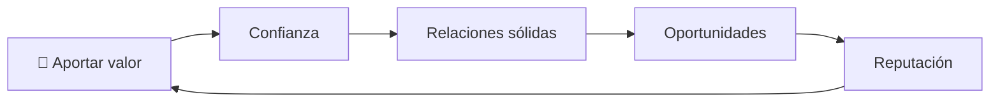

## 4.2 Dar estratégico vs complacencia

| Dar estratégico | Complacencia |
|-----------------|--------------|
| Aporta valor real | Busca aprobación |
| Tiene límites claros | No sabe decir no |
| No exige recompensa inmediata | Espera deuda emocional |
| Mejora tu reputación | Te agota |
| Es sostenible | Es resentimiento disfrazado |

## 4.3 Matriz de valor

| Tipo de valor | Ejemplo | Costo | Impacto |
|---------------|---------|-------|---------|
| **💡 Conocimiento** | Enseñar algo útil | Tiempo | Alto |
| **🔗 Conexiones** | Presentar personas | Baja energía | Alto |
| **👂 Atención** | Escuchar sin interrumpir | Presencia | Medio/alto |
| **🛠️ Habilidades** | Resolver un problema | Tiempo/talento | Alto |
| **💰 Dinero** | Donar o invertir | Capital | Variable |
| **⚡ Energía** | Acompañar en un momento difícil | Emocional | Alto |

## 4.4 Sistema semanal de aporte

```text
Cada semana:
1. ¿A quién puedo ayudar?
2. ¿Qué problema concreto puedo resolver?
3. ¿Qué valor puedo entregar sin esperar nada?
4. ¿Qué límite necesito mantener?
```

| Día | Acción de valor | Persona o comunidad | Resultado |
|-----|-----------------|---------------------|-----------|
| Lunes | Compartir recurso útil | Amigo / colega |  |
| Miércoles | Resolver una duda | Cliente / compañero |  |
| Viernes | Hacer una introducción valiosa | Red profesional |  |
| Domingo | Reflexionar y ajustar | Uno mismo |  |

## 4.5 Ley de reciprocidad, sin ingenuidad

> **⚠️ Aclaración importante:** dar no garantiza que todos te devuelvan. Algunas personas no tienen la misma ética. Por eso, el dar estratégico combina generosidad con filtros.

| Señal verde | Señal roja |
|-------------|------------|
| La persona agradece | La persona exige |
| La persona también aporta | La persona solo consume |
| Hay respeto por límites | Hay culpa o manipulación |
| La relación es recíproca | La relación es extractiva |

## 4.6 Ejercicio I Do: aporte de 10 minutos

Hoy elige una de estas acciones:

- Enviar un recurso útil a alguien.
- Dar feedback honesto y respetuoso.
- Recomendar una herramienta.
- Presentar dos personas que puedan beneficiarse.
- Ayudar a alguien sin publicar ni esperar reconocimiento.

> **💡 Concepto Clave** — La generosidad no es perder poder. Es demostrar que tienes suficiente valor interno para aportar sin rogar validación.

---

# PARTE 5: 🔥 HACER FOCO — CONCENTRAR ENERGÍA EN UNA SOLA COSA

## 5.1 Principio Central

Hacer foco significa elegir una dirección principal y sostenerla el tiempo suficiente para que produzca resultados.

La dispersión es cara. Cada objetivo nuevo compite por tu atención, energía, tiempo y capital emocional.

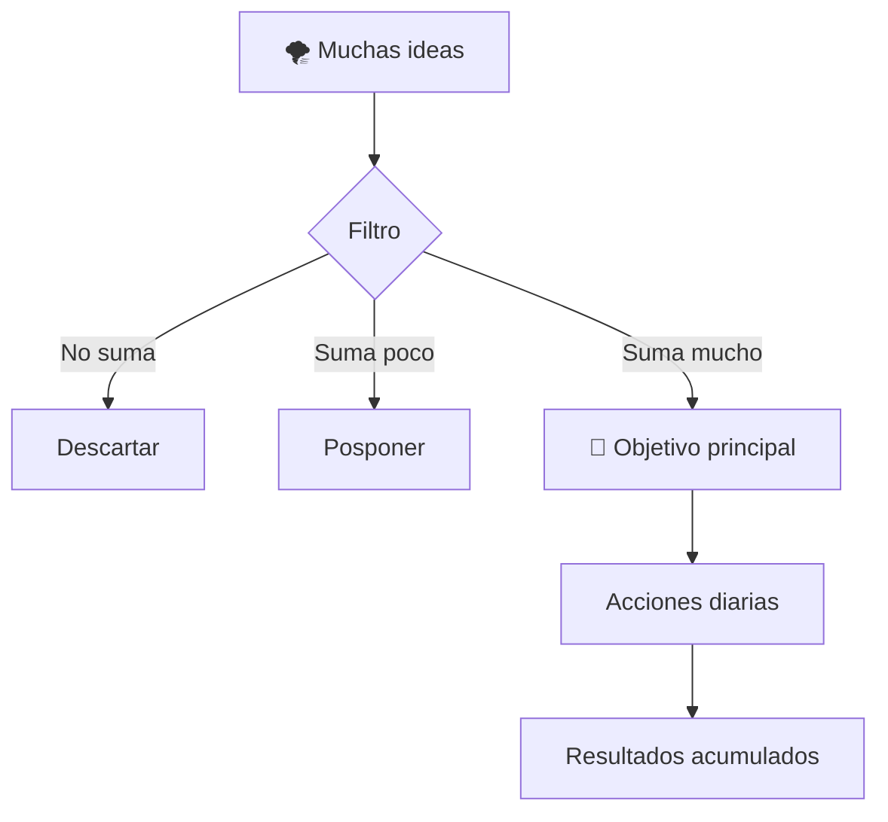

## 5.2 Ocupado no es lo mismo que enfocado

| Ocupado | Enfocado |
|---------|----------|
| Hace muchas cosas | Hace las cosas correctas |
| Se distrae fácil | Protege su atención |
| Cambia de meta rápido | Sostiene una dirección |
| Mide horas | Mide progreso |
| Se siente productivo | Genera resultados |

## 5.3 Sistema de foco único

```text
1 objetivo principal
3 acciones clave
1 métrica
1 revisión semanal
```

| Elemento | Pregunta | Ejemplo |
|----------|----------|---------|
| **Objetivo principal** | ¿Qué resultado cambia más mi vida? | Construir habilidad de ventas |
| **3 acciones clave** | ¿Qué acciones lo mueven? | Prospectar, practicar pitch, revisar objeciones |
| **Métrica** | ¿Cómo sé que avanzo? | 30 conversaciones por semana |
| **Revisión** | ¿Qué aprendí? | Qué objeciones se repiten |

## 5.4 Embudo de prioridades

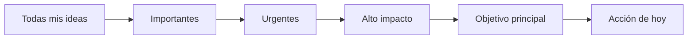

## 5.5 Matriz dispersión vs foco

| Situación | Diagnóstico | Corrección |
|-----------|-------------|------------|
| Empiezas 5 cursos y no terminas ninguno | Dispersión | Elegir uno por trimestre |
| Cambias de negocio cada mes | Falta de paciencia | Compromiso mínimo de 90 días |
| Revisas redes antes de trabajar | Atención robada | Bloqueo de distracciones |
| Tienes muchas metas pero ninguna acción | Falta de priorización | Elegir una meta principal |
| No sabes decir no | Límites débiles | Agenda con bloques protegidos |

## 5.6 Regla 90/10

```text
90% de tu energía → objetivo principal
10% de tu energía → exploración controlada
```

| Riesgo | Solución |
|--------|----------|
| Aburrimiento | Recordar que la repetición construye maestría |
| FOMO | Revisar metas antes de saltar |
| Nuevas ideas | Anotarlas, no ejecutarlas de inmediato |
| Falta de resultados rápidos | Medir proceso, no solo resultado |

## 5.7 Ejercicio We Do: elegir tu foco de 30 días

Completa:

```text
Durante los próximos 30 días mi foco principal será:

Objetivo:
Métrica:
Acción diaria:
Distracción principal a eliminar:
Revisión semanal:
```

> **💡 Concepto Clave** — El foco no se trata de hacer más. Se trata de dejar de desperdiciar energía en lo que no es esencial.

---

# PARTE 6: 💰 AHORRAR E INVERTIR — CONSTRUIR LIBERTAD FINANCIERA

## 6.1 Principio Central

Ahorrar e invertir no es solo una técnica financiera. Es una forma de pensar en el futuro.

El ahorro crea margen. La inversión multiplica paciencia. La educación financiera evita errores costosos.

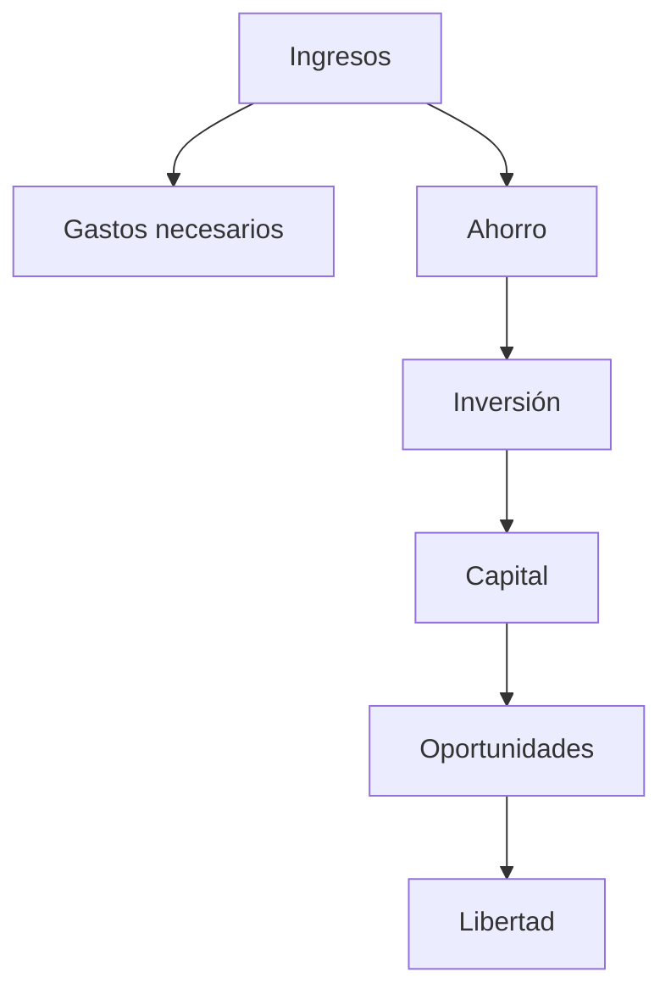

## 6.2 Ahorrar, invertir y especular

| Acción | Definición | Riesgo |
|--------|------------|--------|
| **💵 Ahorrar** | Guardar parte de tus ingresos | Inflación si no se invierte |
| **📈 Invertir** | Poner capital con expectativa de retorno | Riesgo de mercado |
| **🎰 Especular** | Apostar buscando ganancias rápidas | Alta pérdida potencial |

> **⚠️ Advertencia financiera** — Invertir requiere educación, paciencia y gestión de riesgo. No inviertas en algo que no entiendes.

## 6.3 Sistema básico de distribución

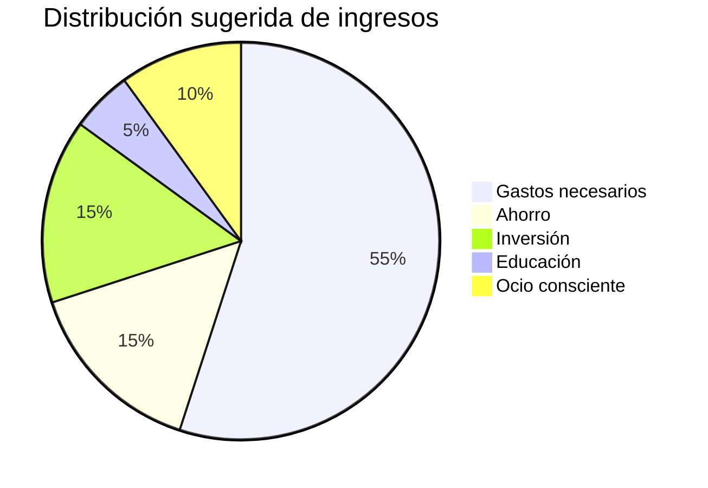

| Categoría | Porcentaje guía | Función |
|-----------|-----------------|---------|
| **🏠 Gastos necesarios** | 50-60% | Vivienda, comida, transporte |
| **🛡️ Ahorro** | 10-20% | Fondo de emergencia |
| **📈 Inversión** | 5-20% | Crecimiento patrimonial |
| **📚 Educación** | 5-10% | Aumentar valor personal |
| **🎉 Ocio consciente** | 5-10% | Disfrute sin culpa |

## 6.4 Bola de nieve financiera

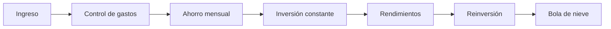

## 6.5 Reglas básicas de seguridad financiera

| Regla | Por qué importa |
|-------|-----------------|
| **1. No inviertas dinero que necesitas pronto** | Evita vender en pérdidas por urgencia |
| **2. Crea fondo de emergencia** | Te protege ante imprevistos |
| **3. Diversifica** | Reduce dependencia de un solo activo |
| **4. Estudia antes de invertir** | Evita promesas engañosas |
| **5. Automatiza ahorro** | La disciplina no depende del estado de ánimo |
| **6. Controla gastos hormiga** | Pequeñas fugas destruyen capital |

## 6.6 Tabla de hábitos financieros

| Hábito | Acción | Frecuencia |
|--------|--------|------------|
| **Registrar gastos** | Anotar entradas y salidas | Diario |
| **Revisar presupuesto** | Comparar plan vs realidad | Semanal |
| **Automatizar ahorro** | Transferir apenas ingresas dinero | Mensual |
| **Evitar deuda mala** | No financiar consumo innecesario | Permanente |
| **Educarte financieramente** | Leer, estudiar, preguntar | Semanal |
| **Revisar inversiones** | Medir sin obsesionarte | Mensual |

## 6.7 Ejercicio You Do: presupuesto de transformación

Completa:

```text
Ingreso mensual:
Gastos necesarios:
Ahorro automático:
Inversión educativa:
Inversión financiera:
Ocio consciente:
Próxima acción financiera:
```

> **💡 Concepto Clave** — No necesitas ganar muchísimo para empezar. Necesitas crear margen, protegerlo y reinvertirlo con inteligencia.

---

# PARTE 7: 🧬 LOS 6 HÁBITOS COMO IDENTIDAD

## 7.1 De acción a identidad

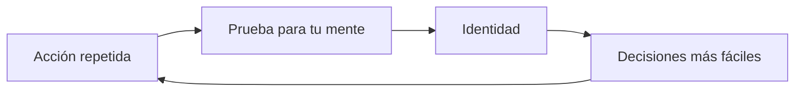

| Acción | Identidad que construye |
|--------|-------------------------|
| Levantarte temprano | Soy una persona disciplinada |
| Capacitarte | Soy una persona que aprende |
| Escribir metas | Soy una persona con dirección |
| Dar valor | Soy una persona generosa |
| Hacer foco | Soy una persona concentrada |
| Ahorrar e invertir | Soy una persona financieramente responsable |

## 7.2 El ciclo de transformación

```text
Decisión → Acción → Repetición → Hábito → Identidad → Resultados
```

> **💡 Concepto Clave** — El resultado es la consecuencia visible de una identidad invisible que se construye en privado.

---

# PARTE 8: 🗓️ SISTEMA DE 30 DÍAS PARA IMPLEMENTAR LOS 6 HÁBITOS

## 8.1 Plan semanal

| Semana | Hábito dominante | Acción diaria | Métrica |
|--------|------------------|---------------|---------|
| **Semana 1** | ⏰ 5:00 a. m. | Despertar temprano y proteger la mañana | Días cumplidos |
| **Semana 2** | 📚 Capacitación | 30 minutos de aprendizaje aplicado | Minutos estudiados |
| **Semana 3** | 🎯 Metas escritas | Escribir meta diaria y revisar semanal | Journaling completado |
| **Semana 4** | 🤝 Dar + 🔥 Foco + 💰 Ahorrar | Aportar, priorizar y registrar dinero | Aporte, foco y ahorro |

## 8.2 Tablero diario de hábitos

| Día | 5AM | Capacitación | Metas | Dar | Foco | Ahorro/Inversión | Puntuación |
|-----|-----|--------------|-------|-----|------|------------------|------------|
| Lunes | ☐ | ☐ | ☐ | ☐ | ☐ | ☐ | /6 |
| Martes | ☐ | ☐ | ☐ | ☐ | ☐ | ☐ | /6 |
| Miércoles | ☐ | ☐ | ☐ | ☐ | ☐ | ☐ | /6 |
| Jueves | ☐ | ☐ | ☐ | ☐ | ☐ | ☐ | /6 |
| Viernes | ☐ | ☐ | ☐ | ☐ | ☐ | ☐ | /6 |
| Sábado | ☐ | ☐ | ☐ | ☐ | ☐ | ☐ | /6 |
| Domingo | ☐ | ☐ | ☐ | ☐ | ☐ | ☐ | /6 |

## 8.3 Sistema de puntuación

| Puntuación semanal | Interpretación | Acción |
|--------------------|----------------|--------|
| **42/42** | Excelente consistencia | Mantener y subir dificultad |
| **30-41/42** | Buen progreso | Ajustar obstáculos |
| **18-29/42** | Inicio realista | Reducir fricción |
| **Menos de 18/42** | Sistema demasiado ambicioso | Empezar más pequeño |

## 8.4 Regla de consistencia

```text
No busques perfección.
Busca no romper la cadena dos días seguidos.
```

| Situación | Regla |
|-----------|-------|
| Fallas un día | Retomar al día siguiente |
| Fallas dos días | Reducir el hábito al mínimo |
| Fallas una semana | Reiniciar sin culpa |
| Te aburres | Cambiar método, no objetivo |
| Te saturas | Eliminar hábitos secundarios |

---

# PARTE 9: 🧰 I DO / WE DO / YOU DO — EJERCICIOS PROGRESIVOS

## 9.1 I Do — Ejemplo guiado de una mañana perfecta

**Escenario:** quieres construir disciplina, estudiar y avanzar en tu proyecto principal.

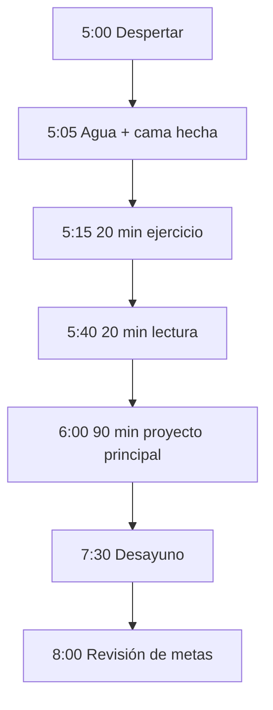

| Momento | Decisión correcta | Decisión incorrecta |
|---------|-------------------|---------------------|
| Suena la alarma | Levantarse sin negociar | Snooze 5 veces |
| Primeros 10 minutos | Agua y luz | Redes sociales |
| Bloque principal | Trabajo profundo | Tareas fáciles |
| Distracción | Anotar y volver | Seguir el impulso |
| Final de mañana | Revisar avance | Sentir que “no fue suficiente” |

## 9.2 We Do — Diseñar un plan semanal de hábitos

**Objetivo:** convertir los 6 hábitos en un sistema semanal.

| Día | Mañana 5AM | Capacitación | Meta del día | Aporte | Foco | Finanzas |
|-----|------------|--------------|--------------|--------|------|----------|
| Lunes | ☐ | ☐ | ☐ | ☐ | ☐ | ☐ |
| Martes | ☐ | ☐ | ☐ | ☐ | ☐ | ☐ |
| Miércoles | ☐ | ☐ | ☐ | ☐ | ☐ | ☐ |
| Jueves | ☐ | ☐ | ☐ | ☐ | ☐ | ☐ |
| Viernes | ☐ | ☐ | ☐ | ☐ | ☐ | ☐ |
| Sábado | ☐ | ☐ | ☐ | ☐ | ☐ | ☐ |
| Domingo | ☐ | ☐ | ☐ | ☐ | ☐ | ☐ |

**Preguntas de revisión:**

1. ¿Qué hábito fue más fácil?
2. ¿Qué hábito tuvo más resistencia?
3. ¿Qué distracción robó más energía?
4. ¿Qué ajuste harías la próxima semana?
5. ¿Qué resultado empieza a aparecer?

## 9.3 You Do — Construir tu sistema personal

Completa tu sistema:

```text
Mi hábito de mañana:
Mi habilidad a desarrollar:
Mi meta principal:
Mi forma de aportar valor:
Mi distracción principal:
Mi regla de ahorro:
Mi revisión semanal:
```

## 9.4 Cierre práctico

| Nivel | Debes poder hacer |
|-------|-------------------|
| **I Do** | Seguir una rutina guiada de mañana, metas y foco |
| **We Do** | Diseñar un plan semanal con los 6 hábitos |
| **You Do** | Crear tu sistema personal de 30 días y medirlo |

---

# PARTE 10: 🚧 ERRORES COMUNES Y CÓMO CORREGIRLOS

## 10.1 Tabla de errores

| Error | Síntoma | Corrección |
|-------|---------|------------|
| **⏰ Madrugar sin dormir** | Cansancio, irritabilidad, abandono | Ajustar hora de sueño |
| **📚 Comprar cursos sin aplicar** | Sensación falsa de progreso | Aplicar una idea por recurso |
| **🎯 Metas vagas** | No sabes qué hacer hoy | Escribir acción medible |
| **🤝 Dar desde carencia** | Agotamiento y resentimiento | Poner límites |
| **🔥 Perseguir muchas metas** | Dispersión y frustración | Elegir una prioridad |
| **💰 Ahorrar sin educación** | Miedo o malas decisiones | Estudiar antes de invertir |
| **📱 Revisar redes temprano** | Día reactivo | Bloquear celular 60 minutos |
| **📉 No medir** | Crees que avanzas, pero no sabes | Usar métricas simples |

## 10.2 Antídoto rápido

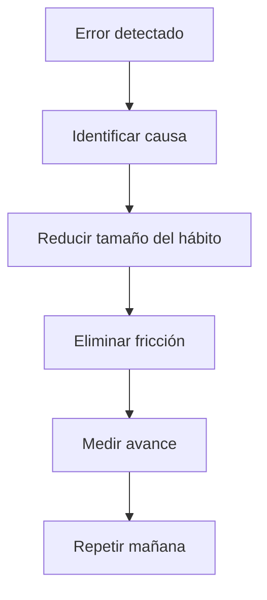

> **💡 Concepto Clave** — Si fallas, no necesitas más motivación. Necesitas un sistema más fácil de cumplir.

---

# PARTE 11: ✅ CHECKLIST FINAL DE LOS 6 HÁBITOS

## 11.1 Checklist por hábito

### ⏰ 5:00 a. m.

- [ ] Duermo suficiente para despertar descansado.
- [ ] Tengo una rutina preparada la noche anterior.
- [ ] No reviso redes al despertar.
- [ ] Uso la mañana para algo importante.

### 📚 Capacitación constante

- [ ] Estudio algo que aumenta mi valor real.
- [ ] Aplico lo aprendido.
- [ ] Mido progreso.
- [ ] No compro más cursos de los que termino.

### 🎯 Metas escritas

- [ ] Tengo una meta principal.
- [ ] La escribo y reviso.
- [ ] La convierto en acción diaria.
- [ ] La ajusto semanalmente.

### 🤝 Enfocarse en dar

- [ ] Aporto valor sin esperar recompensa inmediata.
- [ ] Mantengo límites sanos.
- [ ] Ayudo desde mis fortalezas.
- [ ] Evito relaciones extractivas.

### 🔥 Hacer foco

- [ ] Tengo un objetivo principal.
- [ ] Elimino distracciones clave.
- [ ] Trabajo en bloques profundos.
- [ ] No cambio de meta cada semana.

### 💰 Ahorrar e invertir

- [ ] Registro ingresos y gastos.
- [ ] Ahorro automáticamente.
- [ ] Me educo antes de invertir.
- [ ] Evito decisiones financieras impulsivas.

## 11.2 Checklist de consistencia

- [ ] Hice al menos una acción diaria alineada con mi meta.
- [ ] Protegí mi atención de distracciones baratas.
- [ ] Aporté valor a alguien.
- [ ] Aprendí algo útil.
- [ ] Cuidé mi dinero.
- [ ] Revisé mi progreso semanal.

---

# PARTE 12: 📝 PREGUNTAS DE VERIFICACIÓN

Responde estas preguntas para fijar el conocimiento y convertirlo en acción.

## Preguntas sobre hábitos y disciplina

1. **Aplica:** ¿Qué harías durante tus primeras dos horas después de despertar a las 5:00 a. m.?

2. **Analiza:** ¿Por qué levantarse temprano puede volverse contraproducente si no duermes suficiente?

## Preguntas sobre capacitación

3. **Diseña:** Elige una habilidad que aumente tu valor personal. ¿Qué recurso usarías y cómo la aplicarías esta semana?

4. **Reflexiona:** ¿Has confundido alguna vez consumir información con aprender? ¿Qué cambiarías?

## Preguntas sobre metas

5. **Aplica:** Escribe una meta principal para los próximos 90 días usando una métrica clara.

6. **Analiza:** ¿Cuál es la diferencia entre una meta escrita y una acción diaria?

## Preguntas sobre dar y foco

7. **Diseña:** ¿Cómo puedes aportar valor esta semana sin caer en complacencia?

8. **Evalúa:** ¿Qué distracción está robando más energía a tu objetivo principal?

## Preguntas financieras

9. **Calcula:** Si ganas una cantidad mensual fija, ¿qué porcentaje podrías ahorrar sin afectar tus necesidades básicas?

10. **Reflexiona:** ¿Qué necesitas aprender antes de invertir con más confianza?

## Pregunta integradora

11. **Sistema:** Crea tu plan de 7 días combinando los 6 hábitos. Incluye horario, acción, métrica y revisión.

---

# PARTE 13: 🧠 RESUMEN EJECUTIVO

| Pregunta | Respuesta |
|----------|-----------|
| **¿Qué?** | Seis hábitos para transformar tu vida: 5AM, capacitación, metas, dar, foco y ahorro/inversión. |
| **¿Cómo?** | Convirtiendo cada hábito en acciones pequeñas, medibles y repetibles. |
| **¿Para qué?** | Para construir identidad, disciplina, valor personal, relaciones y libertad financiera. |
| **¿Cuándo?** | Todos los días, empezando por una versión pequeña y sostenible. |
| **¿Por qué?** | Porque los resultados son la consecuencia acumulada de hábitos repetidos. |

```text
Fórmula final:

Disciplina diaria
+ Valor personal
+ Metas claras
+ Generosidad estratégica
+ Foco extremo
+ Capital reinvertido
= Transformación sostenida
```

---

# PARTE 14: 📖 GLOSARIO RÁPIDO

| Término | Definición |
|---------|------------|
| **Hábito** | Acción repetida que se vuelve automática con el tiempo. |
| **Identidad** | Imagen interna de quién eres y qué tipo de persona crees ser. |
| **Foco** | Capacidad de concentrar energía en una prioridad principal. |
| **Valor personal** | Habilidad real para resolver problemas importantes. |
| **Metas escritas** | Objetivos definidos con claridad, fecha y métrica. |
| **Piloto automático** | Vivir reaccionando sin dirección consciente. |
| **Ahorro** | Parte del ingreso que no se gasta y se reserva. |
| **Inversión** | Uso de capital con expectativa de crecimiento futuro. |
| **Reciprocidad** | Intercambio de valor entre personas o comunidades. |
| **Consistencia** | Repetir acciones importantes incluso cuando no hay motivación. |
| **Fondo de emergencia** | Dinero reservado para imprevistos. |
| **Trabajo profundo** | Bloque de concentración sin distracciones. |

---

## 🏁 CIERRE: EL JUEGO ES DIARIO

Los seis hábitos no funcionan como una pastilla mágica. Funcionan como un sistema de entrenamiento personal.

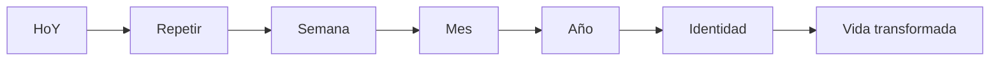

> **🔥 Regla final:** no intentes cambiar toda tu vida en un día. Elige un hábito, hazlo pequeño, hazlo diario y protégelo de tu propia negociación.
