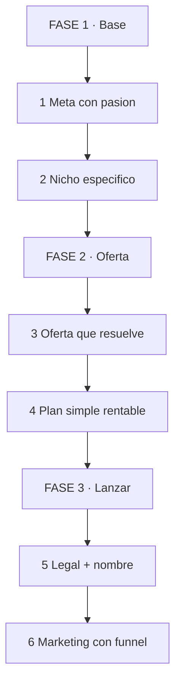
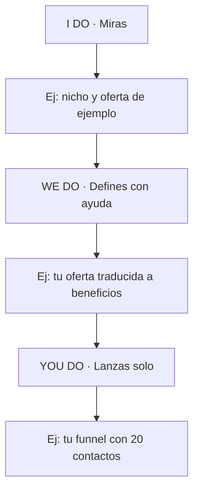
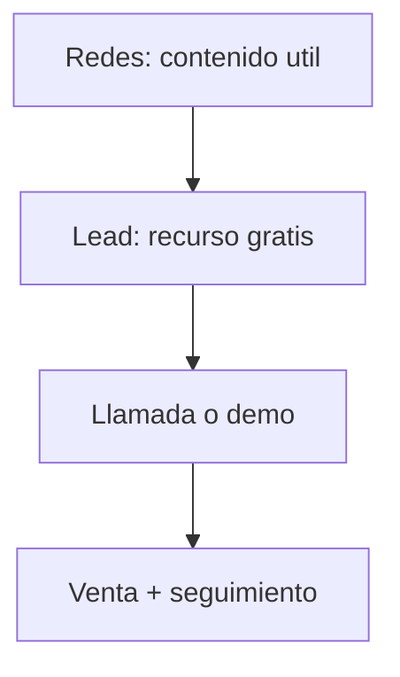

# 🚀 MASTERCLASS: 7 Pasos para Emprender sin Errores Caros 💼✅

## 🎯 INTRODUCCIÓN: POR QUÉ ESTA MASTERCLASS ES DIFERENTE 💡

Emprender no falla por falta de ganas. Falla por errores evitables: venderle a todos, oferta confusa, números inexistentes, legalidad improvisada y marketing sin sistema.

Esta guía simplifica el proceso en 7 pasos + 1 bonus para arrancar con orden y no pagar novatadas caras.

> **🎯 Objetivo de Aprendizaje** — Al final tendrás tu meta, nicho, oferta, plan simple, nombre y funnel definidos y listos para ejecutar.

> **⚠️ Advertencia honesta** — Ningún paso reemplaza vender. Si en 30 días no hablaste con 20 potenciales clientes, vuelve al paso 2.

---

## 🗺️ MAPA DE LA RUTA — LEE DE ARRIBA HACIA ABAJO 🗺️

Cómo leerlo: empiezas en FASE 1, bajas hasta FASE 3. El bonus (formación) corre en paralelo desde el día 1.

| Fase 🧩 | Qué logras 🎯 | Habilidad 🛠️ |
|------|---------------|--------------|
| **FASE 1 · Base** (1-2) | Qué haces y para quién | Enfocar |
| **FASE 2 · Oferta** (3-4) | Qué vendes y si da números | Ofertar + Calcular |
| **FASE 3 · Lanzar** (5-6) | Legal, nombre y clientes | Formalizar + Vender |

### Cómo vas a aprender: I Do → We Do → You Do

---

## 🔥 PASO 1: DEFINE TU META (CON PASIÓN)

Emprender exige tiempo y dedicación. Sin pasión por lo que haces, abandonas al primer bache.

| Pregunta 📋 | Para qué 🎯 |
|-------------|-------------|
| ¿Qué haría gratis 2 años? | Filtro de pasión real |
| ¿Qué problema me indigna? | Energía para persistir |
| ¿Puedo sostenerlo 3 años? | Test de largo plazo |

> **📌 Idea clave** — La pasión no paga sola, pero sin ella no aguantas hasta que pague.

---

## 🎯 PASO 2: IDENTIFICA TU NICHO (NO VENDAS A TODOS)

No intentes venderle a todo el mundo. Enfócate en un nicho que ya está interesado en lo que ofreces.

| Error ❌ | Acierto ✅ |
|----------|-----------|
| "Ayudo a empresas" | "Ayudo a gimnasios con control de acceso" |
| "Hago marketing" | "Funnels para clínicas dentales" |

Fórmula: **quién específico + dolor específico + resultado específico**.

> **📌 Idea clave** — Un nicho pequeño que te compra le gana a un mercado gigante que te ignora.

---

## 📦 PASO 3: ESTRUCTURA TU OFERTA (TRADUCE A RESULTADOS)

Enfócate en problemas que resuelves y beneficios que das. Actúa como "traductor": de características a resultados.

| Característica (tú) 📋 | Resultado (cliente) 🎯 |
|------------------------|------------------------|
| "Backend en NestJS" | "Tus máquinas avisan solas antes de romperse" |
| "10 sesiones" | "Lees inglés técnico en 90 días" |
| "Dashboard" | "Ves tu negocio en 1 pantalla cada mañana" |

Estructura mínima: problema → promesa → prueba → precio → garantía.

---

## 📊 PASO 4: PLAN DE NEGOCIO SIMPLE (QUE DÉ NÚMEROS)

Simple y flexible: estima gastos y verifica que el modelo sea económicamente rentable.

| Bloque 📋 | Pregunta 🎯 |
|-----------|-------------|
| Ingresos | ¿Precio x clientes realistas = ? |
| Costos | ¿Fijos + variables = ? |
| Punto de equilibrio | ¿Cuántos clientes para no perder? |
| Colchón | ¿3 meses de costos cubiertos? |

> **📌 Idea clave** — Si no da en una hoja, no dará en la realidad. Ajusta precio, nicho u oferta antes de lanzar.

---

## ⚖️ PASO 5: LADO LEGAL (CON GESTOR, NO SOLO)

No intentes ser experto legal. Contrata un buen gestor que maneje legalidad e impuestos.

| Haz tú ✅ | Delega al gestor 🤝 |
|-----------|---------------------|
| Facturar y guardar todo | Alta, impuestos, obligaciones |
| Preguntar antes de firmar | Contratos y normativa |
| Separar cuentas personal/negocio | Optimización fiscal |

> **📌 Idea clave** — Un gestor cuesta menos que una multa o un año de impuestos mal hechos.

---

## 🏷️ PASO 6: ELIGE NOMBRE (PERSONAL vs EMPRESA)

Para principiantes se recomienda marca personal: la gente compra a personas. La marca corporativa llega después, si la necesitas.

| Opción 📋 | Cuándo ✅ |
|-----------|-----------|
| Marca personal | Servicios, consultoría, cursos. Confianza rápida |
| Marca empresa | Producto escalable, equipo, venta futura |

Tips: corto, pronunciable, dominio libre. Herramienta: namelix.com para ideas creativas.

---

## 📣 PASO 7: PLAN DE MARKETING (REDES + FUNNEL)

Combina redes sociales con un embudo de ventas: sistema predecible y automatizado para captar clientes.

| Etapa 📋 | Métrica 🎯 |
|----------|-----------|
| Contenido | 3 piezas/semana mínimo |
| Captación | % visitante → contacto |
| Conversión | % contacto → cliente |
| Seguimiento | Responder < 24h siempre |

> **📌 Idea clave** — Sin funnel, tienes likes. Con funnel, tienes clientes predecibles.

---

## 🎁 BONUS: SIGUE APRENDIENDO

Aunque seas experto en tu oficio, invierte en formación de gestión y en un mentor. Aceleran resultados y evitan errores que ya pagó otro.

| Invierte en 📋 | Para qué 🎯 |
|----------------|-------------|
| Gestión (finanzas, ventas) | El oficio no enseña a dirigir |
| Mentor con resultados | Atajos reales, no teoría |
| Comunidad de pares | Red, clientes y ánimo |

---

## 🧩 I DO / WE DO / YOU DO

### I Do — Nicho + oferta de ejemplo

| Paso | Acción | Resultado |
|------|--------|-----------|
| 1 | Elige nicho con fórmula | Nicho en 1 línea |
| 2 | Traduce 3 características | 3 beneficios |
| 3 | Calcula punto de equilibrio | Número claro |

### We Do — Tu oferta traducida

| Decisión | Opción | Por qué |
|----------|--------|---------|
| Nicho | El de tus 20 contactos | Validación rápida |
| Promesa | Resultado medible | Vende el destino |
| Precio | Según números del paso 4 | Rentable desde día 1 |

### You Do — Lanza en 30 días

| Criterio | Peso |
|----------|------|
| 20 conversaciones con nicho | 30% |
| Oferta + precio publicados | 25% |
| Funnel mínimo activo | 25% |
| Gestor contratado | 20% |

---

## ✅ CHECKLIST FINAL

| Bloque 📦 | Check ✔️ |
|--------|-------|
| Meta | Pasión + horizonte 3 años |
| Nicho | Quién + dolor + resultado |
| Oferta | Problema → promesa → prueba → precio |
| Números | Equilibrio + colchón 3 meses |
| Legal | Gestor contratado |
| Nombre | Corto + dominio libre |
| Funnel | Contenido → lead → venta |
| Bonus | Mentor o formación elegida |

---

## 📝 PREGUNTAS DE VERIFICACIÓN

1. Escribe tu nicho con la fórmula quién + dolor + resultado.
2. Traduce 3 características de lo tuyo a beneficios de cliente.
3. Calcula tu punto de equilibrio con números reales.
4. ¿Marca personal o empresa en tu caso? Justifica.
5. Dibuja tu funnel y define 1 métrica por etapa.

---

## 📖 GLOSARIO

| Término | Definición |
|---------|------------|
| **Nicho** | Segmento específico con dolor pagable |
| **Oferta** | Promesa + prueba + precio + garantía |
| **Funnel** | Sistema contenido → contacto → venta |
| **Punto de equilibrio** | Clientes mínimos para no perder |
| **Gestor** | Profesional legal/fiscal externo |
| **Marca personal** | Negocio bajo tu nombre y reputación |

*Basada en la guía de Judit Català: 7 pasos + bonus para emprender.*
