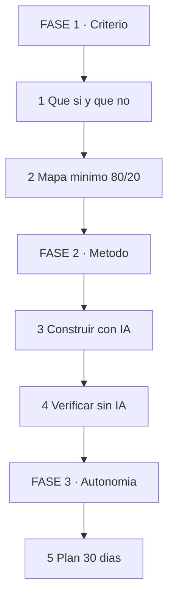
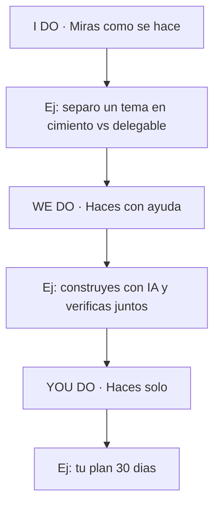

# 🚀 MASTERCLASS: Apalancamiento con IA — Aprende Menos, Logra Más 🧠🤖

## 🎯 INTRODUCCIÓN: POR QUÉ ESTA GUÍA ES DIFERENTE 💡

El error más común hoy es doble: unos intentan memorizar todo como en 2010, otros delegan todo a la IA sin criterio y no saben verificar.

Ambos pierden. El primero avanza lento. El segundo avanza rápido hacia el lugar equivocado.

Esta guía propone otro camino: **aprender cimientos no delegables y apalancar el resto con IA**, con un método repetible para cualquier tema.

> **🎯 Objetivo de Aprendizaje** — Al final podrás separar en cualquier tema qué aprender a fondo, qué delegar a la IA y cómo verificar lo delegado sin ser experto en todo.

> **⚠️ Advertencia** — La IA alucina con confianza. Delegar sin verificación funciona hasta que falla en producción, en un examen o con un cliente.

---

## 🗺️ MAPA DE LA RUTA — LEE DE ARRIBA HACIA ABAJO 🗺️

La ruta tiene 3 fases. Cada fase termina con algo que puedes demostrar.

Cómo leerlo: empiezas en FASE 1, bajas hasta FASE 3. No avances de fase sin completar el entregable anterior.

| Fase 🧩 | Qué logras 🎯 | Habilidad que entrenas 🛠️ |
|------|---------------|---------------------------|
| **FASE 1 · Criterio** (pasos 1-2) | Sabes qué memorizar y qué delegar | Decidir + Priorizar |
| **FASE 2 · Método** (pasos 3-4) | Construyes con IA y verificas solo | Promptear + Verificar |
| **FASE 3 · Autonomía** (paso 5) | Plan propio de 30 días funcionando | Sostener el hábito |

### Cómo vas a aprender: I Do → We Do → You Do

Primero miras, después haces acompañado, al final haces solo. Ese orden no se invierte.

---

## 🧱 PARTE 1: QUÉ SÍ APRENDER Y QUÉ DELEGAR

### 1.1 Principio Central

La IA es excelente generando y mediocre decidiendo por ti. Tu trabajo es quedarte con la parte de decidir.

> **📌 Idea clave** — Aprende lo que te permite juzgar. Delega lo que solo te pide transcribir.

| Aprende a fondo (cimiento) 📋 | Delega a la IA 🤖 |
|-------------------------------|-------------------|
| Modelos mentales (cómo funciona por dentro) | Sintaxis exacta y boilerplate |
| Vocabulario del dominio (20-50 términos) | Resúmenes y primera versión |
| Criterios de calidad (qué es "bien") | Variaciones y ejemplos |
| Límites y riesgos (cuándo falla) | Traducciones y formatos |
| Verificación mínima (cómo probar) | Búsquedas y comparaciones |

Ejemplo en programación: aprende qué es una API, un loop y cómo probar. Delega el CRUD completo y luego revísalo.

### 1.2 Test de 3 preguntas

Antes de memorizar algo, pregúntate:

1. ¿Si la IA se equivoca aquí, lo notaría? Si no, es cimiento: apréndelo.
2. ¿Esto cambia cada 6 meses? Si sí, no lo memorices: delega y consulta.
3. ¿Esto me sirve para decidir o solo para escribir? Decidir = cimiento. Escribir = delegable.

---

## 🗺️ PARTE 2: MAPA MÍNIMO 80/20 DE CUALQUIER TEMA

### 2.1 El 20% que da el 80%

Todo tema tiene un núcleo pequeño que explica la mayoría de los casos. Tu meta inicial no es dominarlo todo, es dominar ese núcleo.

| Paso 📋 | Acción 🎯 |
|---------|-----------|
| 1 | Pide a la IA el mapa: "Dame los 10 conceptos de [tema] ordenados por frecuencia de uso" |
| 2 | Quédate con los 3 primeros: esos son tus cimientos de 2 semanas |
| 3 | Escribe cada uno con tus palabras (Feynman). Si no puedes, ahí está tu hueco |
| 4 | El resto (7/10) queda como "delegable con verificación" |

> **📌 Idea clave** — Si no puedes explicar los 3 conceptos núcleo sin mirar, no avances a herramientas ni a proyectos grandes.

### 2.2 Ejemplo: electrónica con Arduino

| Cimiento (aprende) 🎯 | Delegable (IA) 🤖 |
|-----------------------|-------------------|
| Voltaje/corriente/resistencia + Ley de Ohm | Cálculo de cada resistencia |
| GND común + por qué un pin flotante lee basura | Código de cada sensor |
| Cómo probar por Serial | Datasheet completo |
| Límite 20mA por pin + no dar 5V a ESP32 | Diseño final de PCB en KiCad |

---

## 🔨 PARTE 3: CONSTRUIR CON IA (SIN COPIAR A CIEGAS)

### 3.1 Rutina de construcción

1. Define el resultado en 1 frase: "Quiero X que haga Y".
2. Pide plan antes que código: "Dame los pasos, no la solución".
3. Pide versión mínima, no perfecta.
4. Oblígate a cambiar 1 cosa tú mismo antes de darlo por terminado.

> **📌 Idea clave** — Quien solo copia, no aprende. Quien modifica una parte, aprende justo lo necesario.

### 3.2 Prompts que sí enseñan

| Para 🎯 | Prompt 📋 |
|---------|-----------|
| Mapa | "Dame el mapa mínimo de [tema] en 3 niveles con 1 hito verificable por nivel" |
| Feynman | "Explica [concepto] simple. Luego pregúntame para detectar huecos y re-enséñame lo que falle" |
| Quiz | "Hazme 5 preguntas crecientes de [tema]. Corrige cada una antes de seguir" |
| Verificación | "Dame 3 formas de verificar que esto está bien sin confiar en ti" |

---

## 🔍 PARTE 4: VERIFICAR SIN IA (TU SEGURO DE VIDA)

Delegar sin verificar es deuda. Esta es la parte no negociable.

| Qué verificar 📋 | Cómo (sin IA) 🎯 |
|------------------|------------------|
| Código | Corre, prueba un caso borde, lee el error tú |
| Dato / cifra | Contrasta con 1 fuente oficial |
| Circuito | Mide con multímetro + Serial antes de energizar todo |
| Texto / inglés | Lee en voz alta + verifica 3 términos clave |
| Decisión | Pregunta: "¿qué pasaría si esto falla?" y ten plan B |

> **📌 Idea clave** — Verificar no es saber todo. Es tener 1 prueba barata por entregable.

### 4.1 Señales de que delegaste de más

| Síntoma 🚩 | Fix 🟢 |
|------------|--------|
| No puedes explicar lo que entregaste | Vuelve a Feynman con 1 concepto |
| Si la IA cae, te bloqueas | Anota tu miniguía de 1 página |
| Aceptas todo a la primera | Oblígate a pedir 2 alternativas y elegir |
| Repites el mismo error | Crea tu checklist de verificación |

---

## 📅 PARTE 5: PLAN 30 DÍAS — TU TEMA CON APALANCAMIENTO

| Semana 🗓️ | Enfoque 🎯 | Entregable 🏗️ |
|------------|-----------|---------------|
| 1 | Mapa 80/20 + vocabulario núcleo | 1 página con 10 términos y 3 cimientos |
| 2 | Construir mínimo con IA | 1 proyecto pequeño funcionando |
| 3 | Verificación + Feynman | Quiz aprobado + 1 prueba sin IA |
| 4 | Autonomía | Miniguía propia + checklist de delegación |

> **📌 Idea clave** — Al final de 30 días tienes: 3 cimientos explicables, 1 proyecto real y 1 checklist para delegar sin miedo.

---

## 🧩 PARTE 6: I DO / WE DO / YOU DO — EJERCICIOS PROGRESIVOS

### 6.1 I Do — Separar un tema

**Objetivo:** distinguir cimiento de delegable.

| Paso | Acción | Resultado esperado |
|------|--------|--------------------|
| 1 | Elige tu tema | 1 frase de resultado |
| 2 | Pide mapa de 10 | Lista ordenada |
| 3 | Marca 3 cimientos | Tabla sí/no con motivo |

### 6.2 We Do — Construir y verificar juntos

**Escenario:** quieres un LED que dimmea con potenciómetro.

| Decisión | Opción | Justificación |
|----------|--------|---------------|
| Cimiento | ADC 0-1023 y PWM en pines `~` | Sin esto no juzgas nada |
| Delegable | Código exacto | La IA lo genera, tú lo ajustas |
| Verificación | Serial + girar perilla | Prueba sin IA |

### 6.3 You Do — Tu plan 30 días

**Tarea:** aplica las Partes 1-4 a tu tema real.

| Criterio | Peso |
|----------|------|
| 3 cimientos explicables sin mirar | 30% |
| 1 proyecto mínimo funcionando | 30% |
| 1 verificación sin IA documentada | 20% |
| Miniguía de 1 página | 20% |

### 6.4 Cierre práctico

| Nivel | Debes poder hacer |
|-------|-------------------|
| **I Do** | Separar cualquier tema en sí/no delegable |
| **We Do** | Construir con IA y verificar 1 entregable |
| **You Do** | Sostener tu plan 30 días solo |

---

## ✅ CHECKLIST FINAL

| Bloque 📦 | Check ✔️ |
|--------|-------|
| Criterio | Sé qué memorizar y qué delegar en mi tema |
| Mapa 80/20 | Tengo 3 cimientos + resto delegable |
| Construcción | Modifico al menos 1 parte yo mismo |
| Verificación | Cada entregable tiene 1 prueba sin IA |
| Autonomía | Miniguía de 1 página + plan 30 días |

---

## 📝 PREGUNTAS DE VERIFICACIÓN

1. **Aplica**: Toma tu tema actual y lista 3 cimientos y 3 delegables. Justifica cada uno con el test de 3 preguntas.
2. **Analiza**: ¿Qué pasa si delegas los criterios de calidad a la IA? Da un ejemplo concreto.
3. **Diseña**: Crea tu prueba barata de verificación para tu próximo entregable con IA.
4. **Reflexiona**: ¿Qué parte de tu aprendizaje actual es memorización que podrías delegar?
5. **Síntesis**: Aplica el plan 30 días a tu tema y define el entregable de cada semana.

---

## 📖 GLOSARIO RÁPIDO

| Término | Definición |
|---------|------------|
| **Cimiento** | Conocimiento que te permite juzgar si la IA acertó |
| **Delegable** | Detalle que la IA genera y tú verificas |
| **80/20** | El 20% de conceptos que explica el 80% de los casos |
| **Feynman** | Explicar simple para detectar huecos |
| **Verificación** | Prueba barata sin IA por entregable |
| **BOM de conocimiento** | Tu lista mínima: qué sabes + qué delegas + cómo verificas |

---

## 🧰 ANEXO: PATRÓN APLICADO

| Regla 📐 | Cómo se aplicó aquí ✅ |
|----------|------------------------|
| Mapa TD vertical | 5 pasos en 3 fases, con cómo leerlo |
| Tabla Fase/Habilidad | Sin subgrafos flotantes |
| I Do → We Do → You Do | Secuencia vertical con 1 ejemplo |
| Idea clave | Cierre cada 2-3 secciones |
| Evaluación | 5 preguntas + checklist |
