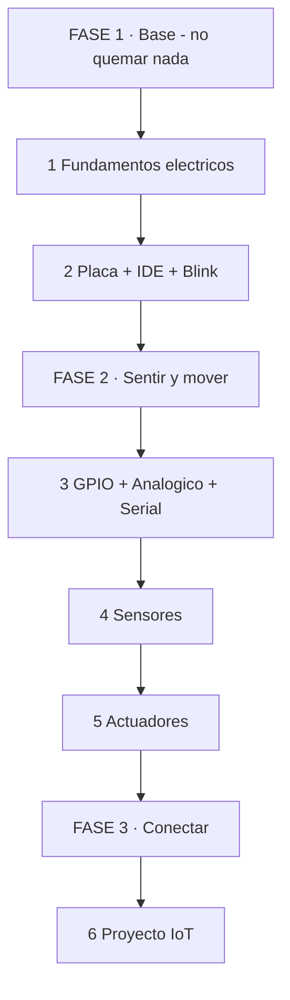
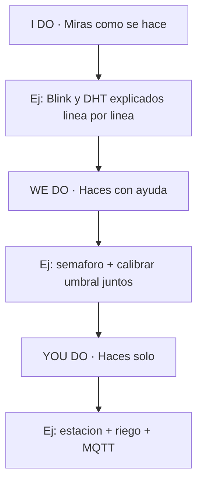
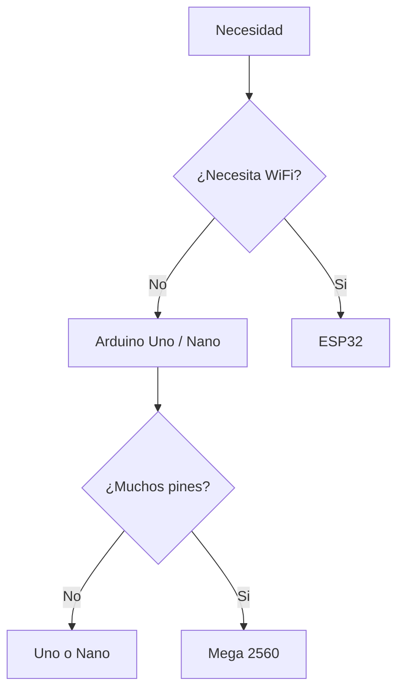
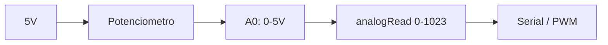
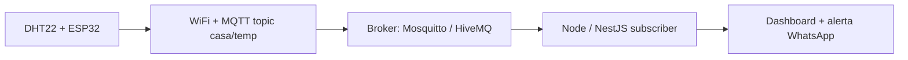
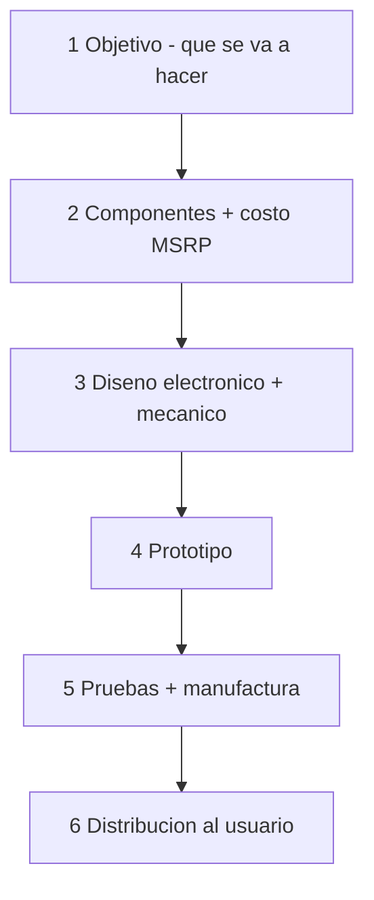

# 🚀 MASTERCLASS: Arduino Desde Cero 🛠️💡

## 🎯 INTRODUCCIÓN: POR QUÉ ESTA MASTERCLASS ES DIFERENTE 💡

La mayoría abandona Arduino por el motivo equivocado.

No es por falta de inteligencia. Es por exceso de fricción inicial: cables que no hacen contacto, un LED que no enciende, un error de compilación críptico, un sensor que devuelve `nan`, un puerto COM que desaparece.

Esta masterclass propone otro camino: una **fábrica de proyectos físicos** donde electrónica, código, sensores, actuadores, debug serial y método de aprendizaje trabajan como un sistema integrado.

La meta no es memorizar pines. La meta es construir un proceso repetible para idear, cablear, programar, probar y arreglar cualquier proyecto Arduino sin miedo.

> **🎯 Objetivo de Aprendizaje** — Al final de esta guía, podrás elegir placa, montar circuitos seguros en protoboard, programar `setup()` / `loop()`, leer sensores digitales y analógicos, controlar LEDs, servos y relays, depurar por Serial y llevar un proyecto a IoT con ESP32 + MQTT.

> **⚠️ Advertencia educativa** — Trabajarás con 5V y USB. No conectes 220V directo. Los relays de potencia requieren aislamiento y supervisión. Si algo calienta, huele raro o echa humo, desconecta inmediatamente.

---

## 🗺️ MAPA DE LA RUTA — LEE DE ARRIBA HACIA ABAJO 🗺️

La ruta tiene 3 fases. Cada fase termina con algo que funciona en tus manos.



Cómo leerlo: empiezas en FASE 1, bajas hasta FASE 3. No hay vueltas ni saltos. Si te trabas en un paso, no avances al siguiente.

| Fase 🧩 | Qué logras 🎯 | Habilidad que entrenas 🛠️ |
|------|---------------|---------------------------|
| **FASE 1 · Base** (pasos 1-2) | Blink funcionando sin humo | Medir + Cablear |
| **FASE 2 · Sentir y mover** (pasos 3-5) | Lees sensores y mueves servos | Programar + Depurar por Serial |
| **FASE 3 · Conectar** (pasos 6 + Parte 10) | Dato en internet + prototipo costeado y distribuible | Integrar |

### Cómo vas a aprender: I Do → We Do → You Do



Primero miras, después haces acompañado, al final haces solo. Ese orden no se invierte.

---

## 🔌 PARTE 1: FUNDAMENTOS ELÉCTRICOS — NO QUEMAR NADA (I DO) 🧠

### 1.1 Principio Central

Todo proyecto Arduino vive de tres magnitudes. Si las ignoras, el síntoma es siempre el mismo: calor, humo o lecturas locas.

> **📌 Idea clave** — Voltaje es presión, corriente es caudal, resistencia es la canilla. Arduino controla la presión (5V / 3.3V), vos limitás el caudal con resistencias.

| Concepto 📋 | Qué es 🎯 | Regla Arduino ✅ |
|---------|-----------|-----------------|
| **Voltaje (V)** | Presión eléctrica | Uno/Nano: 5V lógica. ESP32: 3.3V, **no tolera 5V en GPIO** |
| **Corriente (mA)** | Cuánto fluye | Pin Arduino: max 20mA seguro, 40mA límite absoluto |
| **Resistencia (Ω)** | Freno al flujo | LED siempre con 220Ω–330Ω en serie |
| **Potencia** | Calor generado | Si un regulador quema al tacto, algo está mal |
| **GND** | Referencia común | Todos los GND deben unirse |

### 1.2 Ley de Ohm en 30 segundos

```text
V = I x R
```

Ejemplo real: LED rojo cae ~2V, quieres 15mA desde 5V:

```text
R = (5V - 2V) / 0.015A = 200Ω → usa 220Ω comercial
```

Sin esa resistencia, el LED pide corriente infinita y muere. El pin también puede morir.

### 1.3 Kit mínimo para no frustrarte

| Componente 🔧 | Para qué 🧠 | Nota 💰 |
|---------------|-------------|---------|
| Arduino Uno R3 (clon ok) | Aprender sin miedo a 5V | ~10-15 USD |
| Protoboard 830 puntos | Cablear sin soldar | Revisa que no esté cortada al medio |
| Jumpers M-M | Conexiones | Compra surtidos, se pierden |
| Resistencias 220Ω, 10kΩ | LEDs + pull-up | Pack surtido |
| LEDs + botones | GPIO digital | Botones de 4 patas |
| Potenciómetro 10k | Entrada analógica | Ideal para Parte 5 |
| DHT11 o DHT22 | Temperatura/humedad | DHT22 más preciso |
| HC-SR04 | Distancia por ultrasonido | Muy visual para aprender |
| LCD 16x2 I2C | Mostrar datos sin PC | Busca versión con backpack I2C |
| Servo SG90 + Relay 5V | Actuadores | Relay solo para baja tensión al inicio |
| ESP32 DevKit | Salto a IoT | Segunda compra, no la primera |

> **📌 Idea clave** — No compres el kit de 200 piezas el día 1. Con Uno + protoboard + LEDs + 1 sensor ya tienes para 3 semanas.

---

## 🧱 PARTE 2: QUÉ PLACA ELEGIR — UNO vs NANO vs MEGA vs ESP32 🤝

### 2.1 El mapa de placas



| Placa 📋 | Voltaje lógica ⚡ | Ideal para 🎯 | Ojo con 🚩 |
|---------|------------------|---------------|------------|
| **Uno R3** | 5V | Aprender, tutoriales, shields | Grande, sin WiFi |
| **Nano** | 5V | Proyectos compactos | Necesita cable mini-USB, pines sin soldar a veces |
| **Mega 2560** | 5V | Muchos sensores, impresoras 3D | Caro, grande |
| **ESP32** | 3.3V | IoT, WiFi, Bluetooth, más potencia | **No le des 5V a sus GPIO**, más frágil |

### 2.2 Ejercicio colaborativo: elige tu placa

**Escenario:** quieres una estación que mida temperatura y la muestre en LCD.

| Decisión 🔍 | Opción ✅ | Justificación 🧠 |
|-------------|-----------|------------------|
| ¿WiFi? | No, solo local | Uno alcanza, más robusto a errores |
| LCD I2C | Uno perfecto | Solo 2 pines (SDA/SCL) |
| Alimentación | USB PC | Simple y segura |

Si luego quieres verlo en el celular → migras el mismo código a ESP32 y agregas WiFi. El 90% del código se reutiliza.

> **📌 Idea clave** — Empieza con Uno (5V tolerante). Pasa a ESP32 solo cuando necesites WiFi. Te ahorrarás una placa quemada.

---

## 💻 PARTE 3: IDE + PRIMER SKETCH — BLINK SIN MAGIA 💪

### 3.1 Instalar sin dolor

1. Descarga Arduino IDE 2.x desde arduino.cc.
2. Conecta el Uno por USB. Instala driver CH340 si es clon y no aparece el puerto.
3. IDE → Tools → Board → Arduino Uno. Tools → Port → elige COM / `/dev/ttyUSB`.
4. Abre `File → Examples → 01.Basics → Blink`.

### 3.2 Anatomía de todo sketch

```cpp
// Todo programa Arduino tiene 2 funciones obligatorias
void setup() {
  // Se ejecuta UNA vez: configura pines, inicia Serial
  pinMode(LED_BUILTIN, OUTPUT);
}

void loop() {
  // Se repite para siempre: tu lógica vive acá
  digitalWrite(LED_BUILTIN, HIGH); // enciende
  delay(1000);                     // espera 1s
  digitalWrite(LED_BUILTIN, LOW);  // apaga
  delay(1000);
}
```

| Parte 📋 | Qué hace 🎯 |
|---------|-------------|
| `#include` | Trae librerías (sensores, WiFi) |
| `setup()` | Configuración inicial, corre 1 vez |
| `loop()` | Bucle infinito, corre siempre |
| `delay()` | Bloquea todo — útil para empezar, tóxico para proyectos reales |

### 3.3 Errores clásicos del día 1

| Error 🚩 | Causa 🧠 | Fix 🟢 |
|----------|----------|--------|
| `avrdude: stk500_recv()` | Puerto o placa mal elegida | Revisa Board + Port + cable (algunos cables solo cargan) |
| No sube en clon | Falta driver CH340/CP2102 | Instala driver, reinicia IDE |
| `expected ';' before` | Falta punto y coma | Lee la línea que indica el compilador |
| LED no enciende | LED al revés o sin GND | Pata larga a pin, corta a GND vía resistencia |

> **📌 Idea clave** — Si Blink no compila, no es tu lógica. Es Board, Port o cable. El 80% de los bloqueos del día 1 son esos tres.

---

## 🟢 PARTE 4: GPIO DIGITAL — BOTONES Y LEDS SIN FANTASMAS 📚

### 4.1 Salida digital: el semáforo

```cpp
const int LED_ROJO = 8;
const int LED_VERDE = 9;

void setup() {
  pinMode(LED_ROJO, OUTPUT);
  pinMode(LED_VERDE, OUTPUT);
}

void loop() {
  digitalWrite(LED_ROJO, HIGH);
  digitalWrite(LED_VERDE, LOW);
  delay(1000);
  digitalWrite(LED_ROJO, LOW);
  digitalWrite(LED_VERDE, HIGH);
  delay(1000);
}
```

Cableado: Pin 8 → resistencia 220Ω → pata larga LED → pata corta → GND. Siempre resistencia en serie.

### 4.2 Entrada digital: el botón flotante

El error más común: leer un botón sin pull-up y ver valores aleatorios.

```cpp
const int BTN = 2;
const int LED = 13;

void setup() {
  pinMode(BTN, INPUT_PULLUP); // clave: activa resistencia interna
  pinMode(LED, OUTPUT);
}

void loop() {
  int estado = digitalRead(BTN);
  // Con PULLUP: presionado = LOW, suelto = HIGH
  digitalWrite(LED, estado == LOW ? HIGH : LOW);
}
```

| Modo 📋 | Comportamiento 🎯 | Cuándo ✅ |
|---------|-------------------|----------|
| `INPUT` | Flota si no conectas nada | Solo con resistencia externa 10k a GND/VCC |
| `INPUT_PULLUP` | Suelto = HIGH estable | **Default para botones**, botón a GND |

> **📌 Idea clave** — Pin sin conectar = antena. Si lees valores que cambian solos, no es fantasma. Es falta de pull-up.

### 4.3 Antirrebote (debounce) simple

Los botones rebotan 10-20ms y cuentan 5 pulsaciones en vez de 1.

```cpp
bool leerBotonEstable(int pin) {
  static int ultimo = HIGH;
  static unsigned long t = 0;
  int actual = digitalRead(pin);
  if (actual != ultimo) t = millis();
  ultimo = actual;
  if (millis() - t > 50) return actual;
  return HIGH;
}
```

---

## 🌊 PARTE 5: ANALÓGICO + PWM — EL MUNDO REAL NO ES 0/1 💰

### 5.1 Leer: potenciómetro y divisor de tensión

Arduino Uno tiene ADC de 10 bits: `analogRead()` devuelve 0–1023 para 0–5V.

```cpp
void setup() {
  Serial.begin(9600);
}

void loop() {
  int raw = analogRead(A0);          // 0..1023
  float volt = raw * 5.0 / 1023.0;   // a voltios
  Serial.println(volt);
  delay(200);
}
```

Cableado potenciómetro: extremos a 5V y GND, cursor a A0. Girar = variar voltaje.



### 5.2 Escribir falso-analógico: PWM

`analogWrite(pin, 0-255)` en pines marcados con `~` genera pulsos que dimmean LED o mueven servo.

```cpp
const int LED = 9; // pin con ~
void setup() {}
void loop() {
  for (int i = 0; i <= 255; i++) {
    analogWrite(LED, i);
    delay(10);
  }
  for (int i = 255; i >= 0; i--) {
    analogWrite(LED, i);
    delay(10);
  }
}
```

| Placa 📋 | Pines PWM ⚡ |
|---------|--------------|
| Uno/Nano | 3, 5, 6, 9, 10, 11 |
| ESP32 | Cualquiera (LEDc), pero a 3.3V |

> **📌 Idea clave** — `analogWrite` no da voltaje real. Da pulsos rápidos. Para un LED se ve como dimmer. Para un motor necesitas driver.

---

## 🐞 PARTE 6: SERIAL + DEBUG — TU RAYOS X 🤝

Si no usas Serial, depuras a ciegas. Con Serial, ves lo que piensa el micro.

```cpp
void setup() {
  Serial.begin(9600);
  while (!Serial) {}
  Serial.println("=== boot ok ===");
}

void loop() {
  int v = analogRead(A0);
  Serial.print("A0 raw=");
  Serial.print(v);
  Serial.print(" volt=");
  Serial.println(v * 5.0 / 1023.0);
  delay(500);
}
```

### Tabla de debug

| Síntoma 🚩 | Qué imprimir 🧠 | Causa probable |
|------------|-----------------|----------------|
| Sensor da 0 siempre | Raw + volt + cableado | GND suelto o pin equivocado |
| `nan` en DHT | Código error + delay | Leer DHT más de 1 vez cada 2s lo rompe |
| Valores saltan | Promedio de 10 lecturas | Ruido eléctrico, falta capacitor |
| Se reinicia solo | `millis()` + voltaje | Fuente débil, motor sin fuente externa |

Truco: promedia para estabilizar.

```cpp
int leerPromedio(int pin) {
  long suma = 0;
  for (int i = 0; i < 10; i++) { suma += analogRead(pin); delay(5); }
  return suma / 10;
}
```

> **📌 Idea clave** — Todo sensor nuevo se prueba primero solo con Serial. Sin LCD, sin WiFi, sin actuadores. Aísla y vencerás.

---

## 🌡️ PARTE 7: SENSORES — MEDIR EL MUNDO REAL 🏭

### 7.1 DHT11/DHT22 (temperatura + humedad)

Instala librería `DHT sensor library` de Adafruit.

```cpp
#include "DHT.h"
#define DHTPIN 2
#define DHTTYPE DHT11
DHT dht(DHTPIN, DHTTYPE);

void setup() {
  Serial.begin(9600);
  dht.begin();
}

void loop() {
  delay(2000); // DHT11 exige >=2s entre lecturas
  float h = dht.readHumidity();
  float t = dht.readTemperature();
  if (isnan(h) || isnan(t)) {
    Serial.println("DHT fallo");
    return;
  }
  Serial.print("T="); Serial.print(t);
  Serial.print(" H="); Serial.println(h);
}
```

### 7.2 HC-SR04 (distancia por ultrasonido)

```cpp
const int TRIG = 7, ECHO = 6;
void setup() {
  Serial.begin(9600);
  pinMode(TRIG, OUTPUT);
  pinMode(ECHO, INPUT);
}
void loop() {
  digitalWrite(TRIG, LOW); delayMicroseconds(2);
  digitalWrite(TRIG, HIGH); delayMicroseconds(10);
  digitalWrite(TRIG, LOW);
  long dur = pulseIn(ECHO, HIGH, 30000);
  float cm = dur * 0.0343 / 2.0;
  Serial.println(cm);
  delay(200);
}
```

### 7.3 LCD I2C (ver sin PC)

```cpp
#include <Wire.h>
#include <LiquidCrystal_I2C.h>
LiquidCrystal_I2C lcd(0x27, 16, 2);

void setup() {
  lcd.init();
  lcd.backlight();
  lcd.print("Arduino OK");
}
void loop() {
  lcd.setCursor(0, 1);
  lcd.print(millis() / 1000);
  lcd.print("s");
  delay(500);
}
```

Si ves cuadraditos: ajusta el potenciómetro azul del backpack. Si no aparece nada: prueba dirección `0x3F` en vez de `0x27` con un scanner I2C.

| Sensor 📋 | Dificultad | Tip 🎯 |
|-----------|------------|--------|
| Potenciómetro | ⭐ | Primer analógico ideal |
| HC-SR04 | ⭐⭐ | Muy visual, ideal para You Do |
| DHT11/22 | ⭐⭐ | Respeta los 2s, alimenta a 5V |
| LCD I2C | ⭐⭐ | Solo 4 cables: VCC/GND/SDA/SCL |
| MPU6050 | ⭐⭐⭐ | I2C, acelerómetro + giro |
| BME280 | ⭐⭐⭐ | Temp + humedad + presión, preciso |

> **📌 Idea clave** — Un sensor estable vale más que tres inestables. Fija uno, calíbralo con Serial, recién después agrega el siguiente.

---

## ⚙️ PARTE 8: ACTUADORES — MOVER EL MUNDO + SEGURIDAD 💪

### 8.1 Servo SG90 (el actuador más agradecido)

```cpp
#include <Servo.h>
Servo s;
void setup() { s.attach(9); }
void loop() {
  s.write(0); delay(1000);
  s.write(90); delay(1000);
  s.write(180); delay(1000);
}
```

Alimenta el servo a 5V externo si tiembla: el USB no da suficiente corriente para varios servos.

### 8.2 Motor DC + transistor (nunca directo al pin)

Un pin da 20mA. Un motor pide 500mA+. Directo = pin muerto.

```text
Pin 9 (PWM) -> 1k -> Base 2N2222
Emisor -> GND
Colector -> Motor -> 5V externo
Diodo 1N4007 en antiparalelo al motor (flyback)
```

```cpp
void setup() { pinMode(9, OUTPUT); }
void loop() {
  analogWrite(9, 128); // media velocidad
  delay(2000);
  analogWrite(9, 0);
  delay(2000);
}
```

Para girar en ambos sentidos usa puente H L298N o L293D.

### 8.3 Relay: la frontera de seguridad

| Regla 🔴 | Motivo 🧠 |
|----------|-----------|
| Empieza solo con LED/buzzer en el relay | Aprendes la lógica sin riesgo |
| Nunca 220V sin supervisión experta | Riesgo de incendio/electrocución |
| Usa módulo relay con optoacoplador | Aísla Arduino de la carga |
| Fuente separada para la bobina si chilla | Evita reinicios |

```cpp
const int RELAY = 8; // muchos módulos son ACTIVE LOW
void setup() { pinMode(RELAY, OUTPUT); digitalWrite(RELAY, HIGH); }
void loop() {
  digitalWrite(RELAY, LOW); // activa
  delay(3000);
  digitalWrite(RELAY, HIGH); // desactiva
  delay(3000);
}
```

> **📌 Idea clave** — Si algo calienta, huele o el Arduino se reinicia al activar un motor/relay, es falta de corriente. Separa fuentes y une GNDs.

---

## 📡 PARTE 9: PROYECTO IoT — DE PROTOTIPO A CONECTADO 📅

### 9.1 Arquitectura mínima



### 9.2 ESP32 publica temperatura (bisagra hardware → backend)

Instala en IDE: Board `ESP32 Dev Module` + librerías `PubSubClient` + `DHT`.

```cpp
#include <WiFi.h>
#include <PubSubClient.h>
#include "DHT.h"
#define DHTPIN 15
#define DHTTYPE DHT22
DHT dht(DHTPIN, DHTTYPE);

const char* WIFI = "TU_WIFI";
const char* PASS = "TU_CLAVE";
const char* MQTT = "broker.hivemq.com";

WiFiClient esp;
PubSubClient client(esp);

void setup() {
  Serial.begin(115200);
  dht.begin();
  WiFi.begin(WIFI, PASS);
  while (WiFi.status() != WL_CONNECTED) { delay(500); Serial.print("."); }
  client.setServer(MQTT, 1883);
}

void loop() {
  if (!client.connected()) client.connect("esp32-arduino-01");
  client.loop();
  static unsigned long t = 0;
  if (millis() - t > 10000) {
    t = millis();
    float temp = dht.readTemperature();
    if (!isnan(temp)) client.publish("casa/temp", String(temp).c_str());
  }
}
```

### 9.3 Roadmap: de blink a ingreso

| Etapa 🗓️ | Objetivo 🎯 | Entregable 🏗️ |
|----------|-------------|----------------|
| Exploración (sem 1-2) | Blink + GPIO + Serial | 3 circuitos funcionando |
| Sensores (sem 3-4) | DHT + ultrasonido + LCD | Estación local |
| Actuadores (sem 5) | Servo + relay en baja tensión | Riego/puerta demo |
| IoT (sem 6-7) | ESP32 + MQTT | Dato en dashboard |
| Proyecto final (sem 8-12) | Nicho real | Caso documentado + video |

> **📌 Idea clave** — El valor comercial no está en el sensor. Está en resolver un dolor físico: cámara de frío que avisa antes de perder mercadería, portón que se abre solo, tanque que no rebalsa.

---

## 🏭 PARTE 10: CREACIÓN DE PROTOTIPOS — DEL DISEÑO A LA DISTRIBUCIÓN 📦

Un Arduino en protoboard es un experimento. Un prototipo es un experimento que ya decidió qué quiere ser cuando crezca: qué problema resuelve, cuánto cuesta hacerlo y cómo llega al usuario final.

### 10.1 El flujo completo — lee de arriba hacia abajo



Cómo leerlo: no saltes pasos. Un error en diseño es fatal porque se arrastra a prototipo, manufactura y distribución. Cada fase termina con una decisión escrita, no con "más o menos anda".

> **📌 Idea clave** — Primero se define el objetivo. Luego se eligen componentes. Luego se diseña. Luego se prototipa. Invertir ese orden es la forma más cara de aprender.

### 10.2 Primero se define el objetivo

Antes de comprar un solo componente, escribe esto en una hoja:

| Pregunta 📋 | Ejemplo 🎯 |
|-------------|-----------|
| ¿Qué hace? | "Avisa por WhatsApp si la cámara de frío pasa de 8°C" |
| ¿Para quién? | Dueño de almacén, no técnico |
| ¿Qué NO hace? | No controla el motor, solo alerta |
| ¿Dónde vive? | Gabinete en pared húmeda, con WiFi inestable |
| ¿Cuántos vas a hacer? | 3 para piloto vs 300 para venta (cambia todo) |

Si no puedes responder eso en 5 líneas, todavía no elijas componentes.

### 10.3 Componentes + MSRP: cuánto cuesta existir

Para elegir componentes hay que conocer proveedores. Y para elegir proveedores hay que conocer tu costo objetivo.

**MSRP (Manufacturer Suggested Retail Price)** es el precio sugerido al público. De ahí hacia atrás calculas cuánto te puedes gastar produciendo.

| Concepto 💰 | Regla práctica 🧠 |
|-------------|-------------------|
| Costo BOM (lista de materiales) | Suma de cada componente + PCB + gabinete |
| Costo producción | BOM + ensamblado + pruebas + empaque |
| MSRP | Producción x 3 a x 5 según nicho y garantía |
| Ejemplo | BOM $25 → producción $40 → MSRP $120–$200 |

> Si tu BOM ya vale la mitad del MSRP que el cliente pagaría, cambia componentes antes de diseñar.

**Dónde comprar:**

| Proveedor 🔧 | Ideal para 🎯 | Nota 💡 |
|--------------|---------------|---------|
| **Shenzhen (China)** | Volumen, precio más bajo del mundo | Gran parte de los componentes electrónicos se fabrican ahí. Bueno para 100+ unidades, lento para 1 prototipo |
| **DigiKey** | Prototipos serios, datasheets reales | Envío rápido a LatAm, stock confiable |
| **Mouser Electronics** | Similar a DigiKey, buen buscador | Ideal para comparar alternativas |
| **Newark** | Distribuidor clásico, industria | Útil para componentes de larga vida |
| Local (MercadoLibre, tiendas electrónica) | Salir del paso hoy | Más caro, pero inmediato para el primer prototipo |

> **📌 Idea clave** — Prototipo 1: compra local, paga de más, aprende rápido. Producto 100+: compra en DigiKey/Mouser/Shenzhen con BOM cerrada.

### 10.4 Diseño electrónico: cómo estará constituida la circuitería

El diseño electrónico define la circuitería de tu prototipo: qué se conecta con qué, con qué valores y con qué protecciones.

Tienes dos niveles:

| Modo 📋 | Cuándo ✅ | Herramienta 🛠️ |
|---------|-----------|----------------|
| **Analógico en papel** | Primer boceto, 5–10 componentes | Lápiz + hoja: dibuja VCC, GND, señal. Te obliga a pensar antes de cablear |
| **Digital con software** | Esquemático + PCB real | **KiCad** (open source, impulsado por el CERN). Dibuja esquemático, asigna huellas, rutea PCB, exporta Gerbers para fabricar |

Flujo mínimo en KiCad:

1. Esquemático: símbolos + valores + etiquetas.
2. Regla eléctrica (ERC): sin pines sueltos ni cortos.
3. Asignar huellas: tamaño real del componente.
4. Layout PCB: pistas cortas, GND sólido, alimentación ancha.
5. Regla de diseño (DRC) + Gerbers a fábrica.

### 10.5 Diseño mecánico: tamaño, disposición y acople

El diseño mecánico define el tamaño físico, la disposición de componentes en la placa y los complementos de acople con elementos externos como bases o gabinetes.

| Decisión 📋 | Qué define 🎯 |
|-------------|---------------|
| Tamaño de PCB | Debe entrar en el gabinete, no al revés |
| Disposición | Conectores al borde, antena ESP32 despejada, reguladores con ventilación |
| Bases / soportes | Cómo se fija: tornillos, riel DIN, imanes |
| Gabinete | IP contra polvo/agua si va a campo, ventilación si calienta |
| Protección EMI | Dispositivos sensibles al ruido electromagnético necesitan blindaje metálico, cable trenzado o filtro. Un sensor al lado de un motor sin blindaje lee fantasmas |

> **📌 Idea clave** — Los errores en la etapa de diseño son fatales. Mover una pista en KiCad cuesta 1 minuto. Rehacer 100 placas fabricadas cuesta el proyecto.

### 10.6 Prototipar → Probar → Manufacturar → Distribuir

Luego de diseñar se prototipa. Recién ahí se prueba en serio.

| Etapa 🗓️ | Objetivo 🎯 | Salida ✔️ |
|----------|-------------|-----------|
| **Prototipo v1** | Validar que el diseño anda | 1–3 placas, cableadas o PCB simple |
| **Pruebas** | Romperlo a propósito: calor, humedad, cortes WiFi, vibración, ruido EMI | Lista de fallos + fixes al diseño |
| **Prototipo v2** | Validar fixes + gabinete real | Unidad "casi producto" |
| **Manufactura** | Repetibilidad: mismo resultado 100 veces | BOM cerrada, proveedor fijo, test de fábrica (cada unidad se prueba antes de empaque) |
| **Distribución** | Llegar al usuario final funcionando | Empaque, manual de 1 página, firmware cargado, soporte y repuestos |

Checklist antes de distribuir:

- [ ] Cada unidad pasa el mismo test (no "esta sí andaba").
- [ ] Firmware final + versión escrita en etiqueta.
- [ ] Manual: cómo instalar, qué LED significa qué, a quién llamar.
- [ ] Gabinete cerrado + tornillería completa.
- [ ] Costo real ≤ costo objetivo MSRP.

> **📌 Idea clave final de esta parte** — Distribuir no es "enviar la plaquita". Es entregar algo que otro puede instalar sin llamarte a las 2 AM.

---

## ⚠️ PARTE 8b: SEGURIDAD Y FALLOS TÍPICOS (WE DO) 🤝

| Riesgo 🔴 | Mitigación 🟢 |
|-----------|---------------|
| Corto 5V-GND | Revisa con multímetro antes de energizar, usa cables cortos |
| 5V a GPIO de ESP32 | Divisor de tensión o level-shifter |
| Motor reinicia placa | Fuente externa + capacitor 100µF + GND común |
| Protoboard floja | Mueve cables, cambia de fila, mide continuidad |
| Firmware colgado | Watchdog + `millis()` en vez de `delay()` largo |
| MQTT sin auth | Usuario/clave + TLS, tópicos con namespace `casa/...` |

---

## 🧩 PARTE 11: I DO / WE DO / YOU DO — EJERCICIOS PROGRESIVOS

### 11.1 I Do — Blink diagnosticado

**Objetivo:** subir código y entender `setup/loop`.

| Paso | Acción | Resultado esperado |
|------|--------|--------------------|
| 1 | Elegir Board + Port | Puerto visible |
| 2 | Subir Blink | LED_BUILTIN parpadea |
| 3 | Cambiar delays a 200ms | Parpadeo rápido |
| 4 | Mover a pin 8 + LED externo | LED externo parpadea |

**Interpretación guiada:**
- Si no compila, es entorno, no tu lógica.
- Si compila pero no sube, es cable/puerto/driver.
- Si sube pero no enciende, es cableado/polaridad.

### 11.2 We Do — Semáforo con botón

**Escenario:** 3 LEDs (verde/amarillo/rojo) + botón peatonal.

| Decisión | Opción recomendada | Justificación |
|----------|--------------------|---------------|
| Botón | `INPUT_PULLUP` a GND | Sin resistencia externa, estable |
| LEDs | 220Ω cada uno | Protege pin |
| Lógica | Verde 5s → amarillo 1s → rojo 3s | Ciclo real |
| Extra | Botón fuerza rojo | Interrupción peatonal |

### 11.3 You Do — Estación temperatura + LCD

**Tarea:** DHT11 + LCD I2C mostrando T/H cada 2s.

Debes incluir:
- Lectura con chequeo `isnan`
- Promedio o filtro simple
- Mensaje de error en LCD si falla sensor
- Foto del cableado + código comentado

| Criterio | Peso |
|----------|------|
| Cableado correcto y seguro | 25% |
| Lectura estable en Serial | 25% |
| LCD muestra datos legibles | 25% |
| Manejo de errores | 25% |

### 11.4 I Do — Primer analógico

**Objetivo:** entender ADC con potenciómetro.

| Paso | Acción | Validación |
|------|--------|------------|
| 1 | Cursor a A0, extremos a 5V/GND | `analogRead` 0..1023 |
| 2 | Gira y mira Serial Plotter | Curva suave |
| 3 | Mapea a PWM: `analogWrite(9, raw/4)` | LED dimmea con perilla |

```cpp
void loop() {
  int raw = analogRead(A0);
  analogWrite(9, raw / 4); // 1023/4 ≈ 255
  delay(20);
}
```

### 11.5 We Do — Radar con ultrasonido

**Caso:** el HC-SR04 devuelve 0 o 400 fijos.

| Pregunta | Respuesta esperada |
|----------|--------------------|
| ¿TRIG/ECHO invertidos? | Revisar pines en código vs cable |
| ¿Objeto muy cerca (<2cm)? | Zona ciega, aleja a 10cm |
| ¿Timeout? | `pulseIn` con timeout 30ms |
| ¿5V estable? | Alimenta a 5V, no a 3.3V |

### 11.6 You Do — Riego automático demo

**Tarea:** sensor humedad suelo (analógico) + relay + mini bomba 5V o LED como simulador.

Debe incluir:
- Umbral calibrado con Serial (seco vs húmedo)
- Histéresis (enciende <30%, apaga >45%) para no oscilar
- Relay con LED indicador
- **Solo baja tensión** en esta etapa

| Criterio | Peso |
|----------|------|
| Calibración documentada | 30% |
| Histéresis implementada | 25% |
| Seguridad eléctrica | 25% |
| Demo en video | 20% |

### 11.7 I Do — Servo sin tembleque

**Objetivo:** mover SG90 suave con fuente adecuada.

| Paso | Acción | Validación |
|------|--------|------------|
| 1 | Señal a pin 9, VCC/GND a fuente externa 5V 2A | No se reinicia |
| 2 | Une GND fuente con GND Arduino | Movimiento estable |
| 3 | Barre 0→180 con pasos de 1° | Sin saltos |

### 11.8 We Do — Diseñar un nicho

**Escenario:** gimnasio quiere contar personas sin personal.

| Decisión | Opción | Justificación |
|----------|--------|---------------|
| Detección | 2x HC-SR04 en puerta | Entrada/salida por orden de disparo |
| Display | LCD I2C | Aforo visible |
| Backend | ESP32 + MQTT después | Escala a dashboard |
| Alerta | Buzzer si supera aforo | Feedback local |

### 11.9 You Do — Tu proyecto IoT final

**Tarea:** ESP32 + sensor a elección → MQTT → dashboard o Node subscriber.

| Semana | Tema | Entregable |
|--------|------|------------|
| 1-2 | | Blink + GPIO + Serial dominados |
| 3-4 | | Estación local con LCD |
| 5 | | Actuador controlado |
| 6-7 | | Dato llegando a broker MQTT |
| 8+ | | Proyecto documentado + video |

### 11.10 You Do — Del prototipo al producto

**Tarea:** convierte tu proyecto 11.9 en prototipo distribuible (Parte 10).

| Paso | Acción | Entregable |
|------|--------|------------|
| 1 | Escribe objetivo en 5 líneas | Qué hace / para quién / qué NO hace |
| 2 | Arma BOM + calcula MSRP | Tabla componentes + costo vs precio |
| 3 | Dibuja esquemático (papel o KiCad) | Esquemático + lista de pines |
| 4 | Define gabinete y acople | Medidas + cómo se fija + protección EMI si lleva motor |
| 5 | Prueba destructiva + checklist | Lista de fallos, fixes y test de fábrica |

### 11.11 Cierre práctico

| Nivel | Debes poder hacer |
|-------|-------------------|
| **I Do** | Cablear LED con resistencia, subir Blink, leer sensor por Serial |
| **We Do** | Calibrar umbrales, diagnosticar flotantes y rebotes con otro |
| **You Do** | Construir estación + actuador + MQTT, costearlo y dejarlo distribuible |

---

## ✅ CHECKLIST FINAL DEL MAKER

| Bloque 📦 | Check ✔️ |
|--------|-------|
| Fundamentos | LED con resistencia, GND común, multímetro básico |
| Placa | Uno para aprender, ESP32 solo para WiFi |
| IDE | Board + Port correctos, Blink sube |
| Digital | `INPUT_PULLUP` en botones, debounce si cuenta |
| Analógico | ADC 0-1023 entendido, PWM en pines `~` |
| Serial | Todo sensor nuevo se prueba primero por Serial |
| Sensores | DHT con 2s, HC-SR04 con timeout, LCD I2C con dirección correcta |
| Actuadores | Motor nunca directo, diodo flyback, relay sin 220V al inicio |
| IoT | ESP32 publica a MQTT con reconexión |
| Prototipo | Objetivo en 5 líneas, BOM + MSRP, esquemático en KiCad o papel |
| Mecánica | Gabinete, disposición, acople y blindaje EMI si hay ruido |
| Seguridad | Sin calor/humo, fuentes separadas, fallback local |
| Proyecto | Código comentado + foto + video + umbrales calibrados + test de fábrica |

---

## 📝 PREGUNTAS DE VERIFICACIÓN

Responde basándote en esta masterclass. Escríbelas para profundizar (active recall).

### Sobre fundamentos y placas

1. **Aplica**: Si tu LED rojo cae 2V y quieres 15mA desde 5V, ¿qué resistencia eliges y por qué?
2. **Analiza**: ¿Por qué un pin de ESP32 se puede dañar con 5V mientras un Uno lo tolera? ¿Qué harías para conectar un sensor 5V a ESP32?

### Sobre GPIO y analógico

3. **Diseña**: Dibuja el cableado de un botón a D2 con `INPUT_PULLUP`. ¿Qué lee cuando está suelto y presionado?
4. **Reflexiona**: ¿Qué diferencia hay entre `digitalWrite`, `analogRead` y `analogWrite`? ¿Por qué `analogWrite` no es realmente analógico?

### Sobre sensores y debug

5. **Calcula**: `analogRead(A0)` devuelve 512 en un Uno a 5V. ¿Qué voltaje es? Muestra la cuenta.
6. **Evalúa**: Tu DHT devuelve `nan` cada tanto. Lista 3 causas y cómo las aislarías solo con Serial.

### Integradoras

7. **Conecta**: Explica cómo el debug Serial se relaciona con no quemar actuadores. ¿Qué probarías antes de conectar un motor?
8. **Propón un sistema**: Diseña un sistema de cámara de frío con Arduino/ESP32: sensor, umbral con histéresis, alerta MQTT y modo seguro si se cae WiFi.
9. **Síntesis**: Toma tu proyecto You Do y aplícale el framework completo: fundamentos → GPIO → sensor → actuador → MQTT → prototipo distribuible. Identifica el punto más frágil.
10. **Reflexión final**: De todos los bloques, ¿cuál consideras el más crítico para no abandonar en la primera semana? Justifica.

### Sobre prototipado

11. **Calcula**: Tu BOM suma $40 y quieres un MSRP de $159. ¿Qué múltiplo estás usando? ¿Te alcanza para ensamblado, garantía y distribución?
12. **Diseña**: Tu sensor falla solo cuando enciendes un motor cercano. ¿Qué decisiones de diseño mecánico (disposición, blindaje EMI, gabinete) tomarías? ¿Y en qué orden: objetivo, componentes, diseño o prototipo?

---

## 📖 GLOSARIO RÁPIDO

| Término | Definición |
|---------|------------|
| **GPIO** | Pin de propósito general, puede ser entrada o salida digital |
| **ADC** | Conversor analógico-digital (Uno: 10 bits, 0-1023) |
| **PWM** | Modulación por ancho de pulso, simula salida analógica con pulsos |
| **Pull-up** | Resistencia a VCC que evita flotantes (suelto = HIGH) |
| **Protoboard** | Placa de conexiones sin soldadura para prototipos |
| **Sketch** | Programa Arduino (`setup` + `loop`) |
| **Serial** | Comunicación USB para debug y datos |
| **I2C** | Bus de 2 cables (SDA/SCL) para LCD, sensores |
| **DHT** | Sensor temperatura/humedad digital |
| **HC-SR04** | Sensor distancia por ultrasonido |
| **Servo** | Motor con control de ángulo (0-180°) |
| **Relay** | Interruptor electromecánico para cargas mayores |
| **Flyback** | Diodo que protege contra picos de motores/bobinas |
| **ESP32** | Micro con WiFi/BT a 3.3V para IoT |
| **MQTT** | Protocolo pub/sub ligero estándar IoT |
| **Histéresis** | Doble umbral para evitar oscilaciones on/off |
| **BOM** | Lista de materiales: qué lleva el producto y cuánto cuesta cada parte |
| **MSRP** | Precio sugerido de venta al público, se calcula desde costo de producción |
| **KiCad** | Software open source (CERN) para esquemático y diseño de PCB |
| **EMI** | Interferencia electromagnética: ruido que altera sensores y señales |
| **Gabinete** | Caja/base que protege y fija el prototipo para uso real |

---

## 🧰 ANEXO A: PATRÓN DE ENSEÑANZA APLICADO A ESTA GUÍA

Esta guía usa el patrón de `skills/skill.md`. Cómo se aplicó:

| Regla 📐 | Cómo se aplicó aquí ✅ |
|----------|------------------------|
| Jerarquía visual clara | H1 título, H2 partes, H3 sub-temas |
| Párrafos cortos | Bloques de 200-400 palabras máximo |
| Espacio en blanco | Separadores `---` entre secciones |
| Secciones cortas | Cada parte con un foco único |
| Alternar patrones | Lista → tabla → Mermaid → código → resumen |
| Resúmenes frecuentes | Cajas `📌 Idea clave` cada 2-3 secciones |
| I Do / We Do / You Do | Ejercicios progresivos en Parte 10 |
| Evaluación | 10 preguntas de verificación |
| Glosario | Tabla de términos al cierre |

> **📌 Idea clave de diseño** — Una guía se escanea antes de leerse. Jerarquía, blanco y cierres frecuentes reducen carga cognitiva y fatiga.

---

## 📚 ANEXO B: RECURSOS CURADOS

### Para seguir (gratis/oficial)

| Recurso 🎓 | Nivel 🪜 | Por qué importa 🎯 |
|----------|----------|---------------------|
| docs.arduino.cc + built-in Examples | 1-2 | Referencia oficial, siempre actualizada |
| Curso Fundamentos Electricidad y Electrónica (Platzi) | 1 | Base sin miedo |
| Curso Desarrollo Hardware con Arduino (Platzi) | 1-2 | Primer contacto guiado |
| Curso ESP32 + IoT Protocolos MQTT (Platzi) | 2-4 | Salto a IoT |
| Node.js para IoT MQTT/WebSockets (Platzi) | 4 | Bisagra hardware→backend |

### Trucos de aprendizaje acelerado aplicados

1. **20 horas Pareto:** Blink + GPIO + 1 sensor + Serial es el 20% que da el 80%.
2. **Miniguía 1 página:** resume pines Uno y comandos (`pinMode`, `digitalWrite`, `analogRead`, `analogWrite`, `Serial`) en una hoja.
3. **Quiz antes del descanso:** después de cada parte, respóndete 3 preguntas sin mirar.
4. **Escalera 5 niveles:** LED → botón → analógico → sensor → MQTT.
5. **Feynman:** explica pull-up a un niño. Si no puedes, vuelve a Parte 4.

> **📌 Idea clave final** — No necesitas ser ingeniero electrónico. Necesitas un Uno, un sensor y el hábito de probar todo por Serial. El primer proyecto real vale más que diez tutoriales mirados.
