# MASTERCLASS: Clear Thinking en la Era de la IA — Cómo Pensar Profundo sin Perder tu Hilo

## INTRODUCCIÓN: POR QUÉ ESTE MASTERCLASS ES DIFERENTE

Vivimos en un mundo donde la IA puede generar texto, imágenes y código a la velocidad de la luz. Pero **pensar profundamente** no es un lujo: es una habilidad que se está volviendo escasa. Las redes sociales nos fragmentan la atención, los algoritimos nos muestran lo que queremos ver, y la IA puede hacernos preguntar: "¿para qué necesito pensar yo?"

Este masterclass está basado en el curso de **Nick Saraev**, quien combina su formación en **neurociencia conductual** con años de enseñanza práctica. Propone un enfoque de dos partes:

1. **Hardware**: optimizá tu cerebro biológicamente (sueño, nutrición, ejercicio).
2. **Software**: desarrollá el software mental (modelos, técnicas, rutinas).

> **Objetivo de Aprendizaje** — Al final de esta guía, podrás: optimizar tu capacidad de atención y memoria de trabajo, diseñar un entorno que haga buenas decisiones la opción por defecto, aplicar modelos mentales como EV y Power Law, construir planes de acción con TAPs, usar pre-mortem para anticipar fracasos, y integrar la IA como multiplicaor de tu pensamiento sin ceder tu agencia intelectual.

> **Advertencia educativa** ⚠️ — Este contenido es formativo y sintetiza ideas de Nick Saraev. No constituye consejo médico. Las técnicas de optimización biológica deben complementarse con consultas profesionales. Ninguna técnica aquí presentada sustituye el juicio propio.

---

## MAPA DEL MASTERCLASS 🗺️

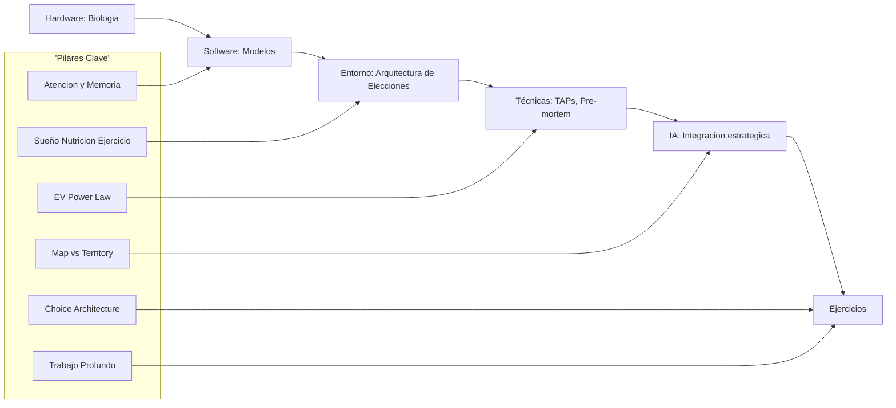

| Fase | Pregunta que responde | Output principal |
|------|------------------------|------------------|
| **Hardware** | ¿Está optimizado mi cerebro? | Atención, memoria, energía |
| **Software** | ¿Tengo modelos mentales sólidos? | EV, Power Law, Map vs Territory |
| **Entorno** | ¿Mi ambiente me ayuda o me distrae? | Architecture de elecciones |
| **Técnicas** | ¿Cómo convierto intención en acción? | TAPs, Pre-mortem, Resolve Cycles |
| **IA** | ¿Cómo la uso sin perder mi mente? | Integración estratégica |
| **Ejercicios** | ¿Lo domino? | I Do / We Do / You Do |

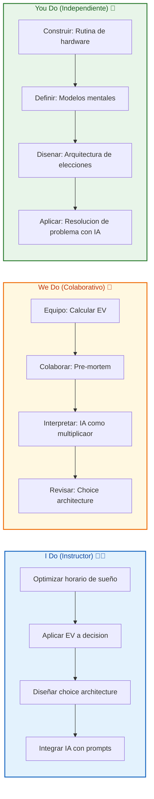

---

## PARTE 1: HARDWARE — TU CEREbro ES UN DISPOSITIVO FÍSICO 🔋🧠

### 1.1 Atención y memoria de trabajo: el cuello de botella

El cerebro humano no procesa información ilimitadamente. La **memoria de trabajo** (working memory) — donde mantenes la información mientras la procesás — tiene un **límite de 4-7 unidades** (~7 ± 2). Más allá, hay **interferencia** y degradación del pensamiento.

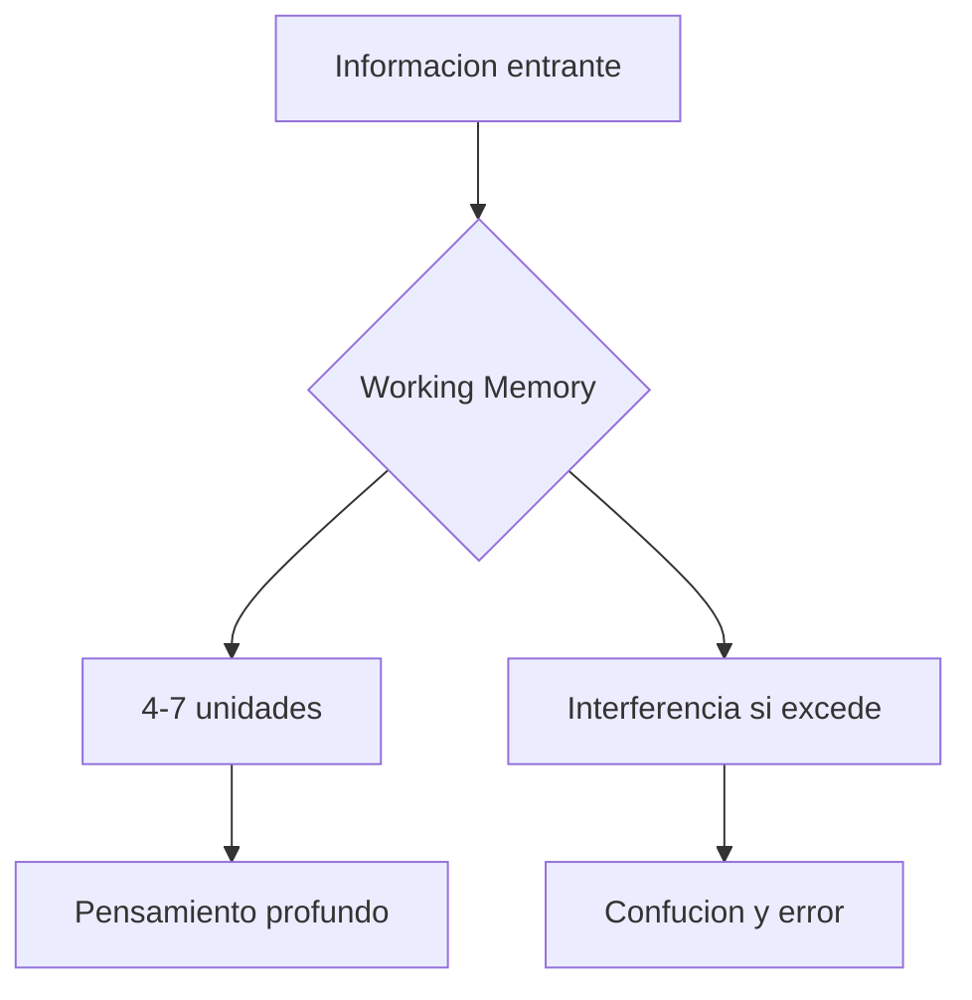

| Componente | Función | Limitación |
|------------|---------|------------|
| **Atención selectiva** | Elegir qué procesar | 1 tarea a la vez (no multi-tasking real) |
| **Memoria de trabajo** | Mantener info activa | 4-7 chunks (no 100 palabras) |
| **Memoria a largo plazo** | Almacenar conocimiento | Necesita consolidación (sueño) |
| **Función ejecutiva** | Control, planificación | Se agota con el tiempo (decision fatigue) |

> **Tip** 💡 — "Chunking" es el arte de agrupar información en unidades significativas. Un número de 10 dígitos es inmanejable. Pero un número de teléfono (555-123-4567) es 3 chunks. Pensar en chunks te permite elevar tu capacidad efectiva.

### 1.2 El costo metabólico del pensamiento

El cerebro consume ~20% de la energía del cuerpo, a pesar de representar solo el 2% del peso. **Pensar profundamente es caro energeticamente**. Por eso, cuando estás cansado, tu cerebro elige el **"pensamiento fácil"**: estereotipos, sesgos, respuestas automáticas.

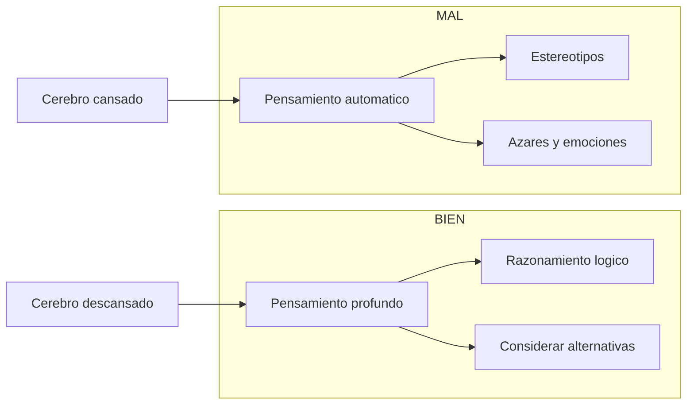

| Estado energético | Pensamiento dominante | Calidad del juicio |
|-------------------|-----------------------|---------------------|
| Alta energía | Sistema 2 (lento, analítico) | Alto |
| Baja energía | Sistema 1 (rápido, automático) | Bajo |

> **La frase del profe** 🌟 — *"Tu cerebro es un halcón: excelente cuando está alimentado y descansado. Pero un halcón hambriento te lleva a cometer errores."*

### 1.3 El triángulo de los hardware upgrades

Saraev identifica tres pilares biológicos que determinan tu capacidad de pensamiento:

| Pilar | Impacto en el pensamiento | Recompensa relativa |
|-------|---------------------------|---------------------|
| **Sueño** | Consolidación de memoria, limpieza de toxinas cerebrales | ⭐⭐⭐⭐⭐ |
| **Nutrición** | Estabilidad de glucosa, neurotransmisores | ⭐⭐⭐⭐ |
| **Ejercicio** | Neurogénesis, conectividad, BDNF | ⭐⭐⭐⭐ |

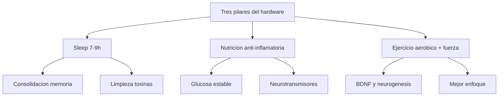

---

## PARTE 2: SUEÑO — EL SOFTWARE DE LA CONSOLIDACIÓN

### 2.1 Ciclos de sueño y fases

El sueño no es un estado pasivo. Es un **proceso activo** con ciclos de 90 minutos, donde la fase REM (soñar) es crucial para la **consolidación de memorias complejas**.

| Fase | Características | Función cognitiva |
|------|-----------------|-------------------|
| **NREM 1** | Transición sueño | Filtrado inicial |
| **NREM 2** | Pulso de memoria | Consolidación de hábitos |
| **NREM 3** | Sueño profundo | Limpienza toxinas, memoria declarativa |
| **REM** | Sueño activo, sueños | Memoria procedimental, razonamiento abstracto |

### 2.2 La regla del sueño consistente

Ir a dormir y despertar a la misma hora **7 días a la semana** es más poderoso que dormir 8 horas pero ir a dormir a distintas horas. El ritmo biológico (circadiano) es tu **reloj interno de pensamiento**.

| Hábito ❌ | Consecuencia | Hábito ✅ |
|-----------|--------------|------------|
| Dormir de 2 a 3 horas distintas | Jet lag crónico, cognición lenta | Mismo horario 7/7 días |
| Dormir menos de 6 horas | Deficiencia cognitiva del 25-30% | 7-9 horas priorizadas |
| Pantallas antes de dormir | Suprime melatonina, menor REM | Lectura o apagar luces 1h antes |

### 2.3 I Do — Diseñar una rutina de sueño

**Objetivo:** dormir 7.5 horas (5 ciclos completos) con horarios fijos.

| Paso | Acción | Herramienta |
|------|--------|-------------|
| 1 | Fijar hora de despertar | Siempre 7:00 AM |
| 2 | Contar 6 horas atrás | Dormir a las 23:30 |
| 3 | Rutina de 30 minutos | Lectura, estiramientos, sin pantallas |
| 4 | Ambiente oscuro | Cortinas blackout, luz roja |

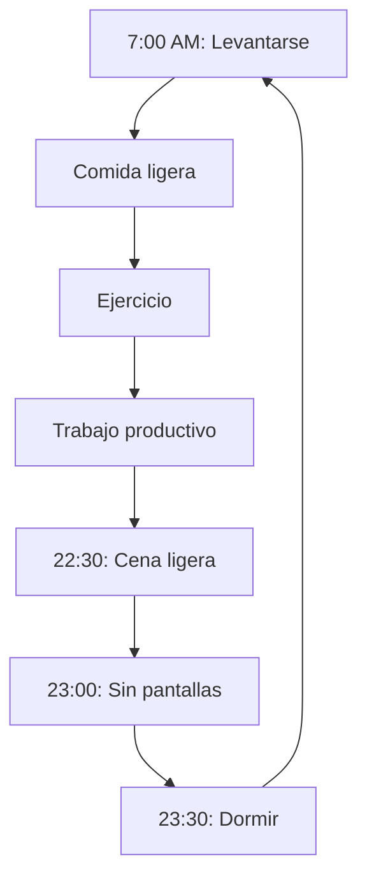

---

## PARTE 3: NUTRICIÓN PARA EL CEREBRO 🧠🥑

### 3.1 Glucosa y estabilidad cognitiva

El cerebro se alimenta principalmente de **glucosa**. Si tu glucosa sube y baja bruscamente, tu atención se va en la oscuridad. La clave: **carbohidratos complejos**, proteínas magras y grasas saludables.

| Alimento | Efecto en glucosa | Impacto cognitivo |
|----------|-------------------|-------------------|
| **Avena** | Liberación lenta | Enfoque estable 3-4h |
| **Fruta procesada** | Pica y cae | Pico seguido de letargo |
| **Proteína magra** | Estable | Sustituto de carbohidrato |
| **Grasas procesadas** | Inflamación | Dificulta memoria |
| **Agua** | N/A | Deshidratación = 15% peor en memoria |

> **Tip** 💡 — Bebe **500ml de agua** 30 minutos después de despertar. La deshidratación matutina reduce tu cognición en hasta un 15%.

### 3.2 Suplementos con evidencia

| Suplemento | Dosis | Evidencia |
|-------------|-------|-----------|
| **Omega-3 (DHA)** | 1-2g/día | Neuroplasticidad, anti-inflamación |
| **Magnesio** | 400mg/día | Calidad del sueño, ansiedad |
| **Vitamina D** | Según análisis | Deficiencia = cognición lenta |
| **Cafeína (estratégica)** | 100-200mg | Enfoque, NO para dormir |

> **Advertencia** ⚠️ — La cafeína después de las 14:00 afecta el sueño. El mejor "boost" es un paseo de 10 minutos al aire libre.

---

## PARTE 4: EJERCICIO — NEUROGENESIS Y BDNF

### 4.1 BDNF: la fertilidad neuronal

El **BDNF** (Brain-Derived Neurotrophic Factor) es una proteína que estimula la **neurogénesis** (creación de neuronas nuevas) y la **neuroplasticidad** (conexión entre neuronas). El ejercicio aeróbico lo eleva hasta un **300%**.

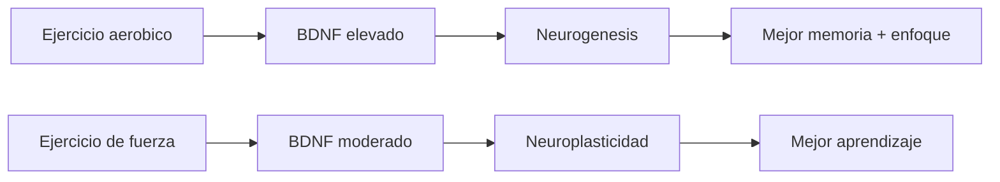

### 4.2 El protocolo Israelí de ejercicio

Saraev recomiende una combinación de:

| Tipo | Frecuencia | Duración | Beneficio cognitivo |
|------|------------|----------|---------------------|
| **HIIT** | 2-3 veces/semana | 15-20 minutos | BDNF máximo en 10 minutos |
| **Caminata rápida** | Diario | 20-30 minutos | Circulación, creatividad |
| **Fuerza** | 2 veces/semana | 30-45 minutos | Neuroplasticidad a largo plazo |
| **Enfriamiento** | Siempre | 5 minutos | Consolidación del estado post-ejercicio |

### 4.3 We Do — Diseñar un plan de ejercicio cognitivo

**Escenario:** un estudiante universitario quiere mejorar su enfoque para exámenes.

| Día | Actividad | Momento cognitivo clave |
|-----|-----------|--------------------------|
| Lunes | HIIT 20 min | BDNF para memoria |
| Martes | Caminata 30 min | Creatividad para ensayos |
| Miércoles | Fuerza 30 min | Plasticidad |
| Jueves | HIIT 20 min + estudio 1h | Potenciación + aplicación |
| Viernes | Caminata + repaso | Consolidación |
| Fin de semana | Fuerza + relajación | Recuperación activa |

**Regla:** estudiar **30-60 minutos después de ejercicio** potencia la consolidación de lo aprendido.

---

## PARTE 5: SOFTWARE — MODELOS MENTALES FUNDAMENTALES

### 5.1 Expected Value (EV): la brújula de decisiones

El **valor esperado** es la probabilidad ponderada de todos los outcomes posibles. En la era de la IA, es el modelo más subestimado.

```text
EV = Σ (probabilidad × outcome)
```

**Ejemplo:** ¿Deberías invertir en un curso de $100.000?

| Escenario | Probabilidad | Outcome | EV parcial |
|-----------|-------------|---------|------------|
| Te contratan a $500.000/mes | 30% | +$400.000 | +$120.000 |
| No conseguís trabajo | 50% | -$100.000 | -$50.000 |
| Te contratan a $200.000/mes | 20% | +$100.000 | +$20.000 |
| **Total** | **100%** | | **+$90.000** |

```mermaid
flowchart TD
    A[Decision] --> B[EV positivo]
| Si EV > 0, procede | C[Tomar decision]
    A --> D[EV negativo]
    | Si EV < 0, rechazar | E[No procede]
```

> **Tip** — La IA puede calcular EV por vos, pero **vos** debés definir las probabilidades y los payoffs. La IA multiplica tu capacidad de cálculo, no tu juicio.

### 5.2 Power Law: priorizar el 20% que mueve el 80%

La **Power Law** dice que, en muchos sistemas, el 20% de las causas generan el 80% de los efectos. Pero es más radical: a veces el **1%** de tus inputs genera el **50%** de tus outputs.

| Aplicación | 20% clave | Resultado |
|------------|-----------|-----------|
| **Estudio** | Profundidad sobre breadth | 1 tema dominado > 5 temas surfados |
| **Redacciones** | Mejor revisión de la intro | Mejora 60% la calificación |
| **Productividad** | Bloquear tiempo para deep work | 3h productivas > 8h dispersas |
| **IA** | Prompts bien diseñados | Resultado 10x mejor |

### 5.3 Map vs. Territory: tu percepción es una compresión

Tu mente no ve la realidad: ve un **mapa** (modelo mental). El mapa no es el territorio. Erra. Pero es útil si entendés sus límites.

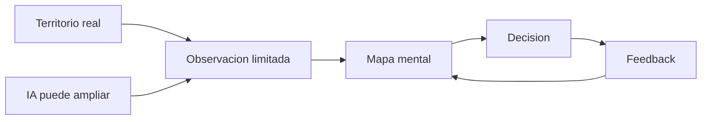

> **La frase del profe** 🌟 — *"Creer que tu mapa es el territorio es el origen de todas las peores decisiones. La IA puede darte un mapa mejor, pero vos decidís si confiar en él."*

### 5.4 Otros modelos mentales clave

| Modelo | Aplicación | Fórmula/Concepto |
|--------|------------|------------------|
| **Inversion de Fermi** | Estimar lo desconocido | Descomponer en partes conocidas |
| **Prueba de Bayes** | Actualizar creencias | Probabilidad a priori × evidencia |
| **Segunda regla de Kahneman** | Sistema 1 vs Sistema 2 | Preguntar: "¿Estoy pensando rápido o lento?" |
| **Efecto Dunning-Kruger** | Reconocer ignorancia | Cuanto más sabés, más consciente del límite |
| **Cuestión de opciones** | Elegir con flexibilidad | "¿Qué opción mantiene más puertas abiertas?" |

---

## PARTE 6: ARQUITECTURA DE ELECCES — TU ENTORNO TE PIENSA POR VOS

### 6.1 El agotamiento de la voluntad

La **voluntad** (willpower) es un recurso **finito**. Cada decisión consume un poco. Por eso, el secreto israelí no es "tener más fuerza de voluntad": es **diseñar un entorno donde la buena elección sea la fácil**.

> **La regla de los 3 primeros asientos** — La primera decisión del día consume el 25% de tu voluntad restante. Si la gastás en "¿ responder WhatsApp o no?", no queda suficiente para decidir estudiar profundamente.

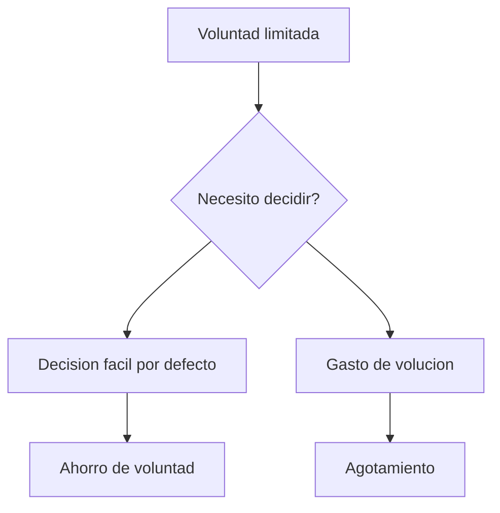

### 6.2 Choice Architecture: el arte de la elección por defecto

**Choice Architecture** significa diseñar tu espacio físico y digital para que la **acción correcta sea automática**.

| Elección ❌ | Arquitectura ✅ |
|-------------|-----------------|
| "Voy a estudiar cuando termine de scrollear" | Teléfono en otra habitación, solo libros a mano |
| "Me levanto temprano... mañana" | Ropa de cama lista, luz automática a las 7 AM |
| "Voy al gimnasio después del trabajo" | Ropa de gimnasio en la mesa, reserva de clase |
| "Bebo agua durante el día" | Botella en cada superficie, recordatorio en watch |

### 6.3 We Do — Diseñar una choice architecture

**Escenario:** un estudiante necesita evitar el móvil durante las horas de estudio.

| Elemento | Diseño | Efecto |
|----------|--------|--------|
| **Ubicación** | Teléfono en estantería alta, lejos | Físicamente difícil alcanzar |
| **Bloqueo** | App de bloqueo con timer (Forest, Cold Turkey) | Bloqueo digital activado |
| **Alternativa** | Libro físico + cuaderno de notas | Acción física disponible |
| **Recompensa** | "Después de 2h, 15 min de redes" | Motivación diferida reforzada |

| Paso | Acción | Herramienta |
|------|--------|-------------|
| 1 | Identificar distraction principal | Screen Time / Digital Wellbeing |
| 2 | Designar espacio distinto | Teléfono en otra habitación |
| 3 | Configurar bloqueo | App de bloqueo programada |
| 4 | Proveer alternativa física | Libros, cuaderno, lápiz |
| 5 | Planificar recompensa | Timer: 2h estudio → 15 min redes |

---

## PARTE 7: TÉCNICAS DE ACCIÓN — DE LA INTENCIÓN A LA EJECUCIÓN

### 7.1 TAPs (Trigger Action Plans)

Una **TAP** es una regla condicional: *"Si ocurre X (trigger), entonces haré Y (acción)."* Combate el problema del **Akrasia**: saber lo que es bueno y no hacerlo.

```text
Formato: SI [trigger], ENTONCES haré [acción específica].
```

| Ejemplo de Akrasia | TAP que lo combate |
|-------------------|---------------------|
| "Quiero estudiar pero me distraigo" | "SI abro Instagram, ENTONCES cierro la app y abro el libro" |
| "Quiero ejercerme pero no" | "SI me pongo la ropa de gimnasio, ENTONCES salgo a caminar" |
| "Quiero escribir pero procrastino" | "SI escribo 'hoy empiezo', ENTONCES abro el documento y escribo 1 línea" |

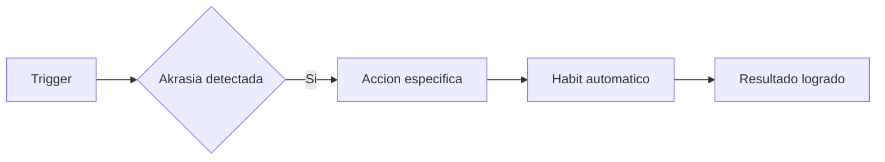

> **Tip** — La TAP debe ser **específica y accionable**. No "leer más": "leer 2 páginas de este libro". No "estudiar más": "abrir el cuaderno de notas y escribir 3 puntos clave".

### 7.2 Pre-mortem: planear el fracaso para evitarlo

El **pre-mortem** es una técnica donde, antes de actuar, imaginás que **ya fallaste** y escribís por qué.

```mermaid
flowchart TD
    A[Plan de accion] --> B[Pre-mortal: "Fracase"]
    B --> C[Lista de razones]
    C --> D[Identificar riesgos]
    D --> E[Plan de mitigacion]
```

| Paso | Pregunta | Salida |
|------|----------|--------|
| 1 | "Imagina que fracasaste" | Mentalidad abierta |
| 2 | "¿Por qué falló?" | Lista de 8-15 razones |
| 3 | "¿Cuáles son probables?" | Priorizar riesgos |
| 4 | "¿Cómo las mitigarías?" | Plan de contingencia |

### 7.3 Resolve Cycles: el ritual de compromiso

Un **Resolve Cycle** es un ritual semanal donde revisás tus compromisos y los ajustabas. No es un "planificador": es una **sesión de reflexión activa**.

| Día | Actividad | Duración |
|-----|-----------|----------|
| **Lunes** | Revisión de objetivos | 15 minutos |
| **Miércoles** | Checkpoint de progreso | 10 minutos |
| **Viernes** | Reflectión y ajuste | 20 minutos |
| **Domingo** | Planificación semanal | 30 minutos |

> **Regla Israelí** — Cada resolución debe incluir un "trigger", una "acción" y una "medición". Si no podés medirlo, no es una resolución real.

---

## PARTE 8: LA IA COMO MULTIPLICADOR — SIN CEDER TU AGENCIA

### 8.1 El peligro de la delegación mental

La IA puede escribir, calcular y sintetizar. Pero si **deleghís todo tu pensamiento** a la IA, perdés lo que la hace útil: tu **capacidad de juzgar**.

| Nivel de uso ❌ | Nivel de uso ✅ |
|----------------|-----------------|
| "Hacé mi ensayo completo" | "Aquí está mi borrador, ¿qué mejorarías?" |
| "Responde mis emails" | "¿Qué tono usarías en este caso?" |
| "Diseña mi proyecto" | "¿Qué pasos faltan en mi plan?" |

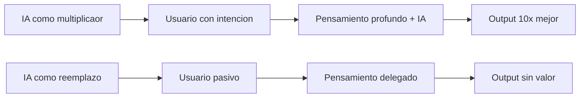

### 8.2 El framework de prompts para clear thinking

Saraev propone estructurar prompts en 3 fases: **Diseño → Aplicación → Verificación**.

```text
Fase 1 - Diseño: Definir el problema con profundidad
"Tengo este dilema: [contexto complejo]. Quiero analizarlo
usando [modelo mental] y [técnica]. ¿Cuál es el marco correcto?"

Fase 2 - Aplicación: Pedir análisis estructurado
"Dame 5 escenarios posibles con su EV y riesgos asociados.
Prioriza por impacto esperado."

Fase 3 - Verificación: Preguntar por limitaciones
"¿Qué aspectos podría estar ignorando? ¿Qué supuestos
hiciste que podrían ser falsos?"
```

### 8.3 I Do — Usar IA para aplicar el modelo EV

**Problema:** necesitás decidir si aprender Python o R para data science.

| Paso | Prompt a la IA | Resultado esperado |
|------|----------------|--------------------|
| 1 | "Compara Python vs R para ciencia de datos 2026" | Lista de pros/cons |
| 2 | "Calcula EV de aprender cada uno: prob, time, payoff" | EV numérico |
| 3 | "¿Qué riesgos debo considerar?" | Lista de riesgos |
| 4 | "¿Qué TAP podría usar para aprender X en 3 meses?" | Plan de acción |

**Conclusión:** la IA multiplica tu capacidad de análisis, pero el **juicio final** es tuyo.

---

## PARTE 9: I DO / WE DO / YOU DO — EJERCICIOS PROGRESIVOS

### 9.1 I Do — Optimizar el hardware personal 👨‍🏫

**Objetivo:** diagnosticar tu estado actual de hardware cognitivo.

| Paso | Acción | Herramienta |
|------|--------|------------|
| 1 | Medir sueño | App de sueño o smartwatch |
| 2 | Medir glucosa mental | "¿Estoy alerta o letárgico a las 15:00?" |
| 3 | Medir ejercicio | Frecuencia cardíaca durante 30 min |
| 4 | Diagnosticar déficit | "¿Pensé profundamente hoy por >30 min?" |

```python
# Test de 30 segundos: ¿pensás profundamente?
# Si podés leer esto sin distraerte, tu foco es sólido.
# Si pensaste en otra cosa... tu hardware necesita carga.
print("Clear thinking test")
```

### 9.2 We Do — Aplicar EV a una decisión real 🤝

**Escenario:** tenés que elegir entre un curso online de $50.000 o un mentor de $200.000/mes.

| Opción | Prob. éxito | Payoff esperado | EV |
|--------|------------|-----------------|-----|
| **Curso online** | 40% | +$300.000/ano | +$120.000 |
| **Mentor privado** | 70% | +$500.000/ano | +$350.000 |
| **No hacer nada** | 100% | +$0 | $0 |

**Discusión del equipo:**
- ¿El mentor tiene track record comprobable?
- ¿El curso incluye acceso a comunidad activa?
- ¿Podés combinar ambas?

### 9.3 You Do — Diseñar tu sistema de clear thinking 💪

**Tarea:** creá un sistema personal de 5 componentes basados en este masterclass.

| Componente | Acción concreta | Métrica de éxito |
|------------|-----------------|------------------|
| **Hardware** | 3 hábitos de sueño/nutrición/ejercicio | Dormir 7.5h 5/7 días |
| **Modelos mentales** | Aprender 3 modelos este mes | Aplicarlos en 3 decisiones |
| **Architectura** | Modificar tu espacio de estudio | Reducción de distracciones 50% |
| **Técnicas** | Crear 3 TAPs para hábitos clave | Ejecución automática >80% |
| **IA** | Usar IA como multiplicaor | Prompts estructurados 3 fases |

| Criterio | Peso |
|----------|------|
| Hardware biológico optimizado | 20% |
| Modelos mentales aplicados | 20% |
| Entorno bien diseñado | 20% |
| Técnicas de acción funcionando | 20% |
| Integración ética con IA | 20% |

---

## CHECKLIST FINAL DEL SISTEMA DE CLEAR THINKING ✅

| Bloque | Check |
|--------|-------|
| **Hardware** | Sueño, nutrición y ejercicio optimizados |
| **Atención** | Memoria de trabajo protegida de distracciones |
| **Modelos mentales** | EV, Power Law y Map vs Territory aplicados |
| **Entorno** | Choice architecture con buenas decisiones por defecto |
| **Técnicas** | TAPs, Pre-mortem y Resolve Cycles en uso |
| **IA** | Usada como multiplicaor, no como reemplazo |
| **Ejercicios** | I Do / We Do / You Do completados |

---

## PREGUNTAS DE VERIFICACIÓN 📝

### Preguntas sobre hardware y biología
1. **Aplica:** Mide tu sueño esta semana. ¿Dormís 7-9 horas? ¿A qué hora varia más?
2. **Analiza:** ¿Cuál es tu "gota de energía" del día? ¿Puedés protegerla para deep work?

### Preguntas sobre modelos mentales
3. **Diseña:** Toma una decisión que estés postergando y aplica EV. ¿Cuál sale ganando?
4. **Reflexiona:** ¿Puedés identificar un caso reciente donde confiaste tu "mapa" demasiado?

### Preguntas sobre arquitectura y técnicas
5. **Calcula:** ¿Cuántas veces al día despiertas tu voluntad con una decisión fácil? Diseñá un trigger.
6. **Evalúa:** Escribí un pre-mortem para tu proyecto más importante. ¿Qué riesgo priorizás?

### Preguntas sobre IA y ética
7. **Conecta:** ¿En qué momento de vos usarías IA para un paso y no para otro?
8. **Propón:** Diseñá un protocolo de prompts de 3 fases para una decisión compleja.
9. **Síntesis:** Tomá una tarea cognitiva difícil. ¿Cómo la descomponés para que la IA te ayude sin reemplazarte?
10. **Reflexión final:** Si la IA puede razonar tan bien como vos en 5 años, ¿qué parte de tu "clear thinking" no puede ser automatizada?

---

## GLOSARIO RÁPIDO 📖

| Término | Definición |
|---------|------------|
| **Clear Thinking** | Pensar con profundidad, evitando errores cognitivos |
| **Working Memory** | Memoria que mantiene info activa (4-7 unidades) |
| **BDNF** | Factor neurotrófico que estimula crecimiento neuronal |
| **Choice Architecture** | Diseñar entornos para buenas decisiones por defecto |
| **Expected Value** | Valor ponderado por probabilidad de outcomes |
| **Power Law** | 20% de causas → 80% de efectos (a veces 1% → 50%) |
| **Map vs. Territory** | Tu percepción es un modelo, no la realidad |
| **TAP** | Trigger Action Plan: Si X, entonces haré Y |
| **Pre-mortem** | Imaginar el fracaso para prevenirlo |
| **Akrasia** | Saber lo bueno y no hacerlo |
| **Sistema 1/2** | Pensamiento automático vs. lento y analítico |
| **Chunking** | Agrupar info en unidades manejables |

---

## ANEXO A: FORMATO IDEAL PARA GUÍAS DE PENSAMIENTO PROFUNDO 🧠

### Recomendaciones de legibilidad

El ancho óptimo para artículos complejos es **60-75 caracteres por línea**.

```css
.article-content {
  font-size: 18px;
  line-height: 1.75;
  max-width: 65ch;
}
```

### Lo que hace agradable una guía al cerebro 🧠

- **Ejemplos concretos** anclan conceptos abstractos en casos reales.
- **Errores comunes** señalados previenen trampas costosas.
- **Tablas comparativas** facilitan el contraste rápido.
- **Ejercicios progresivos** (I Do / We Do / You Do) construyen confianza.
- **Diagramas mermaid** visualizan procesos complejos.
- **Checklist y glosario** permiten repaso rápido.

> **Frase del profe** 🌟 — *"Pensar profundamente no es un don: es un hábito. Y los hábitos se construyen con hardware sano, software actualizado y un entorno que te ayude en lugar de distraerte. La IA puede acelerar tu pensamiento, pero nunca reemplazará tu capacidad de juzgar."*

---