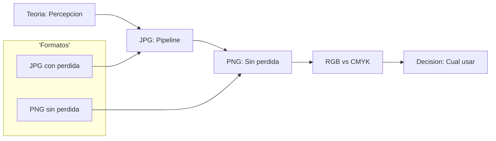
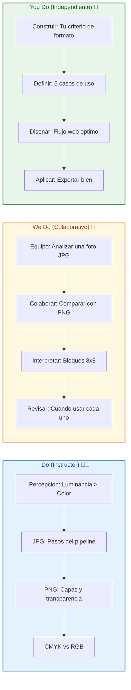
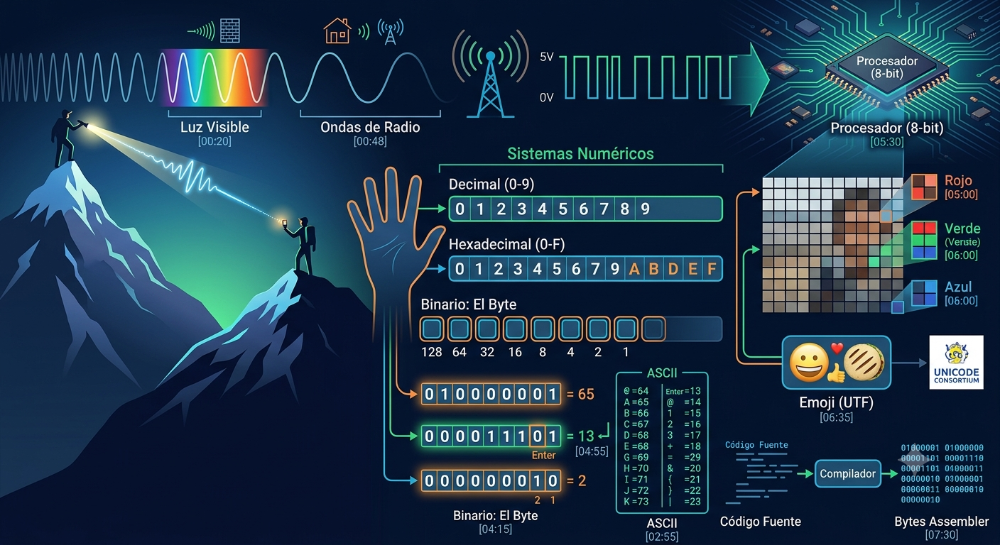
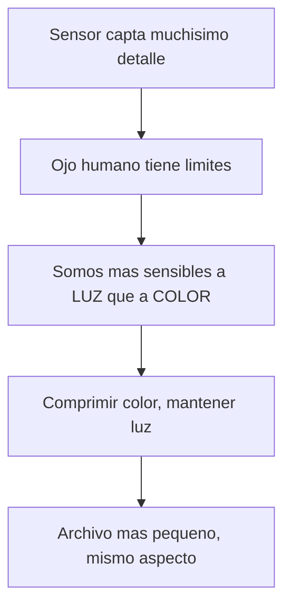
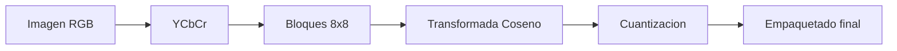
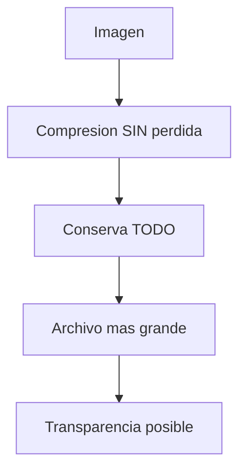
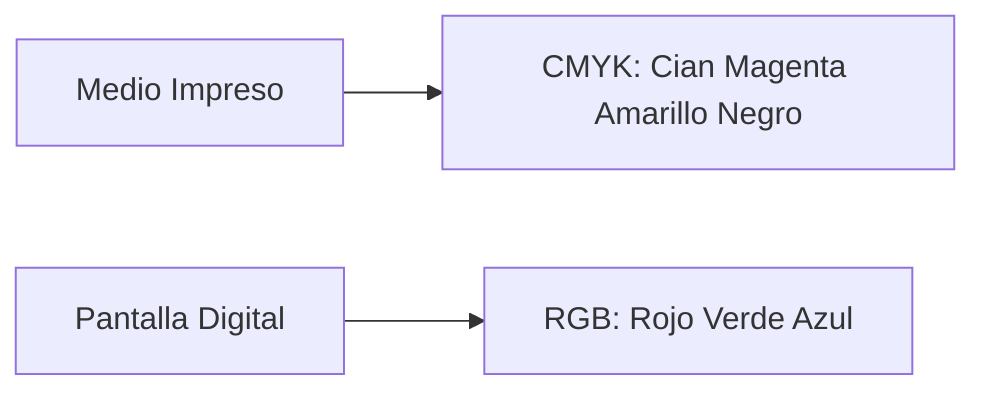
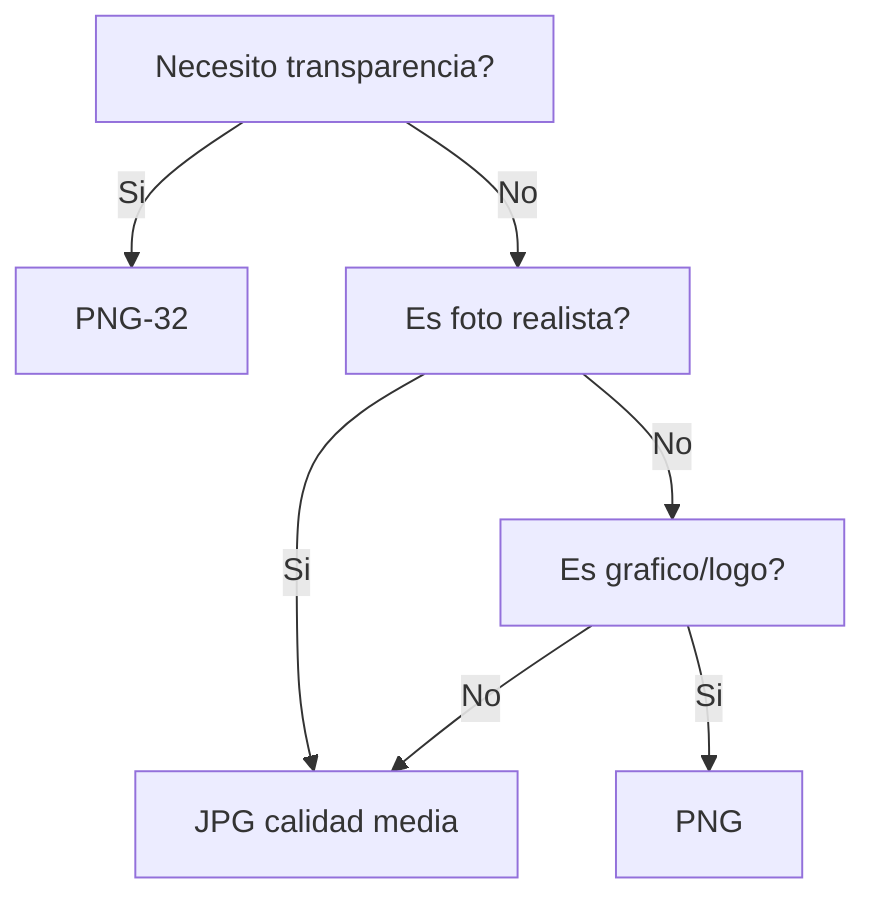

# MASTERCLASS: Compresión de Imágenes — JPG vs PNG y cómo funciona 🖼️✨

## INTRODUCCIÓN: POR QUÉ ESTE MASTERCLASS ES DIFERENTE 🚀

La compresión de imágenes es un proceso fascinante que aprovecha las **limitaciones de la percepción humana** para optimizar el almacenamiento digital 🤯. No es magia: es psicología visual + matemáticas. Entender cómo funcionan formatos como **JPG** y **PNG** nos permite tomar decisiones más informadas sobre qué formato usar según nuestras necesidades, ya sea para fotografía, diseño web o cualquier uso digital donde las imágenes juegan un papel fundamental.

Este masterclass propone otro camino: en vez de elegir formato "porque sí", vas a entender el **motor detrás de cada píxel** 🧠. Por qué JPG es tan efectivo, qué hace único al PNG, cómo se relaciona con la pantalla (RGB) y el papel (CMYK), y cuándo usar cada uno sin arrepentirte.

La meta no es memorizar siglas. La meta es **saber elegir y explicar por qué** 💡.

> **Objetivo de Aprendizaje** 🎯 — Al final de esta guía, podrás explicar la compresión con/sin pérdida, describir el pipeline de JPG (RGB→YCbCr→coseno→cuantización), comparar JPG vs PNG y decidir el formato ideal según el contexto.

> **Advertencia educativa** ⚠️ — Este contenido es formativo sobre tecnología de imágenes. Las implementaciones exactas varían según el software, pero los principios son universales.

---

## MAPA DEL WORKFLOW 🗺️



| Fase | Pregunta que responde | Output principal |
|------|-----------------------|------------------|
| **Percepción** | ¿Qué ve el ojo humano? | Base de la compresión |
| **JPG** | ¿Cómo comprime con pérdida? | Pipeline RGB→YCbCr→coseno |
| **PNG** | ¿Cómo conserva calidad? | Compresión sin pérdida + alpha |
| **Medios** | ¿Pantalla o papel? | RGB vs CMYK |
| **Decisión** | ¿Cuál uso? | Elección por contexto |



---

## PARTE 1: EL SECRETO — LA PERCEPCIÓN HUMANA 👁️✨

### 1.1 Principio Central 💡🔑

El ojo humano **no puede percibir todos los colores con la misma sensibilidad** 👀. Los sensores fotográficos capturan mucho más detalle del que podemos apreciar, y los formatos con pérdida aprovechan esta característica para comprimir imágenes de manera eficiente 🗜️.



> **Ilustración** 🖼️ — Todo archivo de imagen al final es una secuencia de **bits y bytes** 💾. Comprimir es reducir esa secuencia sin que el ojo note la diferencia.



> **Tip del profe** 🧠 — Somos mucho más sensibles a cambios de **luminancia** (luz) 💡 que a cambios **cromáticos** (color) 🎨. Por eso la compresión "engaña" al ojo eliminando color imperceptible, no luz.

### 1.2 Qué significa "percepción limitada" 🔍🧩

| Capacidad | Lo que pasa | Por qué importa |
|-----------|------------|-----------------|
| **Luz vs color** | Vemos mejor cambios de brillo | Priorizar luminancia al comprimir |
| **Detalle fino** | No notamos microcambios de color | Se pueden eliminar |
| **Transiciones** | El ojo suaviza bordes | El algoritmo también |
| **Ruido** | Confundimos ruido con detalle | Se puede descartar |

---

## PARTE 2: JPG — EL REY DE LA FOTOGRAFÍA 📸📷

### 2.1 Qué es y por qué revolucionó el mundo 🌟

El formato **JPG** (Joint Photographic Experts Group) revolucionó la fotografía digital desde su creación en **1992** 🎉. Su efectividad radica en un principio simple pero poderoso: aprovechar que el ojo no distingue todo el color capturado.

> **Dato curioso** 🔥 — JPG es un estándar de 1992 y sigue dominando la web 30+ años después. Eso es ingeniería que perdura.

### 2.2 El pipeline de compresión JPG paso a paso 🔧



| Paso | Qué hace | Por qué |
|------|----------|---------|
| **1. RGB → YCbCr** | Separa luz de color | Aprovecha la percepción |
| **2. Bloques 8×8** | Fragmenta la imagen | Procesa por cuadritos |
| **3. Transformada de coseno** | Simplifica con matemática | Compacta la información |
| **4. Cuantización** | Recorre en zigzag y reduce | Elimina lo imperceptible |
| **5. Reconversión** | Vuelve a RGB y empaqueta | Genera el archivo .jpg |

#### Paso 1: Conversión de RGB a YCbCr 🎨

Transforma la imagen del formato **RGB** (rojo, verde, azul) a **YCbCr**:

- **Y** = luminancia (cantidad de luz) 💡
- **Cb** = croma azul 🔵
- **Cr** = croma rojo 🔴

> **Tip** 💡 — Separar la luz (Y) del color (Cb/Cr) es la llave maestra: después se puede comprimir el color con fuerza sin que nadie note.

#### Paso 2: División en bloques 🧱

La imagen se fragmenta en pequeños cuadros, típicamente de **8×8 píxeles**. Cada bloque se procesa por separado.

#### Paso 3: Transformada de coseno (DCT) 📐

Se utiliza una expresión matemática basada en la **función coseno** para simplificar la información de cada bloque. Convierte los píxeles en frecuencias: las importantes (cambios grandes) y las prescindibles (detalle fino).

#### Paso 4: Cuantización 🔻

Se aplican mecanismos de **álgebra lineal** para comprimir aún más los datos, recorriendo en **zigzag** los componentes de los píxeles. Aquí es donde se decide qué tanta información se descarta.

#### Paso 5: Reconversión y compresión final 📦

Los componentes comprimidos se vuelven a convertir a **RGB** y se empaquetan en un archivo final `.jpg`.

> **Lo más importante** 🌟 — JPG **elimina información que el ojo humano no puede percibir**, priorizando la luminancia sobre el color. Por eso se llama compresión **con pérdida** (lossy).

### 2.3 ¿Qué determina la calidad de un JPG? 🎚️

El tuego de los **bloques** es crucial para la calidad final:

| Tamaño de bloque | Resultado |
|------------------|-----------|
| **Bloques más pequeños** | Mayor resolución y detalle |
| **Bloques más grandes** | Mayor pérdida de información |

> **Ejemplo** 🖼️ — En una imagen podemos tener zonas con bloques pequeños (mayor detalle, ej. rostro) y otras con bloques grandes (mayor compresión, ej. cielo). Esta flexibilidad permite que JPG reduzca aproximadamente a **una cuarta parte** la cantidad de detalle en los canales de color, manteniendo la información de iluminación que es más importante.

### 2.4 Trampas y mitos de JPG 💀

| Mito ❌ | Realidad ✅ |
|---------|-------------|
| JPG no pierde calidad | Sí pierde: es lossy |
| Reexportar JPG es seguro | Cada reexport suma pérdida |
| JPG soporta transparencia | No, es imposible |
| Menor calidad = siempre feo | Depende del uso y ojo |

---

## PARTE 3: PNG — CALIDAD SIN PÉRDIDA Y TRANSPARENCIA 🛡️✨

### 3.1 Qué es y cuándo brillA 💎

El formato **PNG** (Portable Network Graphics) ofrece una alternativa con características distintas al JPG:



| Característica | PNG |
|----------------|-----|
| **Compresión** | Sin pérdida (lossless) ✅ |
| **Calidad** | Conserva cada píxel |
| **Tamaño** | Mayor que JPG |
| **Transparencia** | Sí 🪄 |

> **Tip del profe** 💡 — El PNG **no elimina información**, lo que resulta en archivos de mayor tamaño pero con mejor calidad. Ideal para gráficos, logos y todo lo que necesite bordes limpios.

### 3.2 La gran ventaja: transparencia 🪟

Una ventaja significativa del PNG es su capacidad para manejar **transparencias**, algo imposible en JPG. Permite que una imagen "flote" sobre cualquier fondo.

### 3.3 Variantes según profundidad de color 🌈

| Variante | Bits | Paleta | Transparencia | Bordes |
|----------|------|--------|---------------|--------|
| **PNG-8** | 8 bits | Pocos colores (256) | Solo 1 color (sí/no) | Pixelados 🟦 |
| **PNG-32** | 32 bits | Millones de colores | Total (alpha) | Suaves 🌫️ |

> **Trampa** ⚠️ — **PNG-8** puede tener transparencia, pero solo de UN color, resultando en **bordes pixelados**. Para transparencias perfectas con bordes suaves usa **PNG-32** (con canal alpha).

---

## PARTE 4: MEDIOS DE VISUALIZACIÓN — RGB vs CMYK 🖥️🖨️

### 4.1 La diferencia fundamental 🎯

Es importante entender cómo se representan los colores en diferentes medios:



| Medio | Modelo | Cómo crea color |
|-------|--------|-----------------|
| **Impreso** 🖨️ | **CMYK** | 4 tintas (cian, magenta, amarillo, negro) que se combinan en papel |
| **Pantalla** 🖥️ | **RGB** | 3 luces (rojo, verde, azul) que varían en intensidad |

> **Tip** 💡 — RGB va desde la ausencia total de color (**negro**) hasta la presencia total (**blanco**). CMYK funciona con tinta sobre papel, por eso el negro se suma aparte.

### 4.2 ¿Por qué importa para JPG/PNG? 🔍

Esta diferencia fundamental explica por qué los formatos digitales como JPG y PNG están optimizados para **visualización en pantalla** (RGB), mientras que para impresión profesional se requieren otros procesos de conversión (a CMYK).

> **Regla** ✅ — Si tu destino es web/pantalla → JPG o PNG (RGB). Si es imprenta → convierte a CMYK aparte.

---

## PARTE 5: DECISIÓN — ¿CUÁNDO USAR CADA UNO? 🤔

### 5.1 Matriz de elección 📊🧭

La elección entre JPG y PNG dependerá siempre del uso específico, considerando factores como la necesidad de transparencia, la calidad requerida y las limitaciones de almacenamiento o ancho de banda.

| Necesidad | Formato recomendado | Motivo |
|-----------|---------------------|--------|
| 📷 Fotografía realista | **JPG** | Peso pequeño, ojo no nota pérdida |
| 🌐 Web con ancho de banda limitado | **JPG** | Carga rápido |
| 🔶 Logo con fondo transparente | **PNG-32** | Transparencia suave |
| 🎨 Gráfico con colores planos | **PNG** | Sin pérdida, bordes nítidos |
| 🧩 Icono pequeño | **PNG-8** | Ligero, pocos colores |
| 🖨️ Impresión pro | Convertir a **CMYK** | Fuera de RGB |

### 5.2 Árbol de decisión rápido 🌳



---

## PARTE 6: TRAMPA COMÚN — NO CAIGAS 💀🚫

### 6.1 Errores que te delatan como principiante 🚫⚠️

| Error ❌ | Correcto ✅ |
|---------|-------------|
| Usar JPG para logo con fondo | PNG con transparencia |
| Reexportar JPG 10 veces | Trabaja desde origen |
| PNG-8 para bordes suaves | Usa PNG-32 |
| Esperar transparencia en JPG | Imposible, usa PNG |
| Imprimir JPG sin convertir | Convierte a CMYK |

---

## PARTE 7: I DO / WE DO / YOU DO — EJERCICIOS PROGRESIVOS 🏋️

### 7.1 I Do — El pipeline JPG en voz alta 👨‍🏫

**Objetivo:** explicar los 5 pasos sin leer.

| Paso | Acción | Resultado esperado |
|------|--------|--------------------|
| 1 | RGB → YCbCr | Separar luz de color |
| 2 | Bloques 8×8 | Dividir la imagen |
| 3 | Transformada coseno | Simplificar frecuencias |
| 4 | Cuantización zigzag | Descartar imperceptible |
| 5 | Volver a RGB | Empaquetar .jpg |

**Interpretación guiada:**
- Si no recuerdas YCbCr, enfócate en: **Y = luz, Cb/Cr = color**.
- Si dudas en "coseno", recuerda: convierte píxeles en frecuencias comprimibles.

### 7.2 We Do — Comparar JPG vs PNG de una foto 🤝

**Escenario:** tienes una foto de paisaje y un logo.

| Decisión | Opción recomendada | Justificación |
|----------|--------------------|---------------|
| Foto paisaje | JPG | Peso bajo, ojo no nota |
| Logo transparente | PNG-32 | Necesita alpha |
| Imagen con texto | PNG | Evita bordes borrosos |
| Fondo de web | JPG | Ligero y continuo |

### 7.3 You Do — Tus 5 casos de uso 💪

**Tarea:** define el formato ideal para 5 situaciones reales.

| # | Situación | Formato | Por qué |
|---|-----------|---------|---------|
| 1 | ____ | ____ | ____ |
| 2 | ____ | ____ | ____ |

Criterios de evaluación:

| Criterio | Peso |
|----------|------|
| Formato correcto | 40% |
| Justificación | 35% |
| Considera peso | 25% |

### 7.4 I Do — RGB vs CMYK 🎨

| Medio | Modelo | Ejemplo |
|-------|--------|---------|
| Pantalla | RGB | Foto en web |
| Papel | CMYK | Volante impreso |

### 7.5 We Do — Bloques 8×8 👀

**Caso:** una imagen se ve "cuadriculada" al zoom.

| Pregunta | Respuesta esperada |
|----------|--------------------|
| ¿Qué causa el efecto? | Bloques de compresión |
| ¿Formato culpable? | JPG muy comprimido |
| ¿Solución? | Subir calidad o usar PNG |
| ¿Por qué pasa? | Cuantización agresiva |

### 7.6 You Do — Flujo web optimizado 🌐

**Reto:** diseña el flujo de exportación para un sitio web:

```text
Ejemplo:
- Fotos -> JPG calidad 80%
- Logo -> PNG-32 transparente
- Iconos -> PNG-8
- Hero grande -> JPG + lazy load
```

### 7.7 I Do — PNG-8 vs PNG-32 🔍

| Necesidad | Elige |
|-----------|-------|
| Pocos colores, sin suavizado | PNG-8 |
| Transparencia con borde suave | PNG-32 |
| Tamaño mínimo | PNG-8 |
| Fotografía | Ninguno (usa JPG) |

### 7.8 We Do — Revisar errores 🔧

| Error | Corrección |
|-------|------------|
| JPG con fondo transparente | PNG |
| PNG-8 con bordes suaves | PNG-32 |
| Reexportar JPG varias veces | Usar origen |
| Imprimir sin CMYK | Convertir |

### 7.9 You Do — Exporta bien 💾

**Tarea:** toma 3 imágenes tuyas y expórtalas con el formato correcto, explicando por qué.

### 7.10 Cierre práctico 🏁

| Nivel | Debes poder hacer |
|-------|-------------------|
| **I Do** | Explicar pipeline JPG y diferencia RGB/CMYK |
| **We Do** | Comparar JPG vs PNG y corregir errores |
| **You Do** | Elegir formato y diseñar flujo de exportación |

---

## CHECKLIST FINAL DE FORMATOS DE IMAGEN ✅

| Bloque | Check |
|--------|-------|
| Percepción | Entiendes luz > color |
| JPG | Pipeline RGB→YCbCr→coseno→cuantización claro |
| JPG calidad | Sabes que bloques grandes = más pérdida |
| PNG | Sabes que es sin pérdida y con transparencia |
| PNG variantes | Diferencias PNG-8 vs PNG-32 |
| Medios | RGB (pantalla) vs CMYK (papel) |
| Decisión | Árbol de elección dominado |
| Práctica | 5 casos resueltos y flujo web |

---

## Preguntas de Verificación 📝

Responde cada pregunta basándote en la masterclass.

### Preguntas sobre JPG

1. **Aplica**: Explica en tus palabras los 5 pasos del pipeline de compresión JPG.

2. **Analiza**: ¿Por qué JPG puede reducir el detalle de color a la cuarta parte sin que lo notemos? Relaciona con la percepción humana.

### Preguntas sobre PNG

3. **Diseña**: ¿En qué 3 situaciones usarías PNG en vez de JPG? Justifica cada una.

4. **Reflexiona**: ¿Qué diferencia hay entre PNG-8 y PNG-32? ¿Por qué PNG-8 da bordes pixelados?

### Preguntas sobre Medios

5. **Calcula**: Si tu destino es una revista impresa, ¿basta con JPG/PNG? ¿Qué debes hacer y por qué?

6. **Evalúa**: Explica la diferencia entre RGB y CMYK y cómo afecta a estos formatos.

### Preguntas Integradoras

7. **Conecta**: Relaciona la "percepción limitada del ojo" con la existencia misma del formato JPG.

8. **Propón**: Diseña el flujo de exportación para un sitio web con fotos, logo y iconos.

9. **Síntesis**: Toma una foto tuya y un logo, y justifica el formato de cada uno con 2 razones.

10. **Reflexión final**: ¿Qué formato prefieres para diferentes situaciones y por qué? Cuéntanos tu experiencia.

## GLOSARIO RÁPIDO 📖

| Término | Definición |
|---------|------------|
| **JPG** | Formato con compresión con pérdida (lossy), ideal para fotos |
| **PNG** | Formato sin pérdida (lossless), soporta transparencia |
| **Lossy** | Comprime eliminando información imperceptible |
| **Lossless** | Comprime sin perder ningún dato |
| **RGB** | Modelo de luz para pantallas (rojo, verde, azul) |
| **CMYK** | Modelo de tinta para impresión (cian, magenta, amarillo, negro) |
| **YCbCr** | Espacio que separa luminancia (Y) de croma (Cb/Cr) |
| **Luminancia** | Cantidad de luz; lo que más percibimos |
| **Croma** | Información de color (Cb azul, Cr rojo) |
| **Transformada de coseno (DCT)** | Matemática que simplifica bloques 8×8 |
| **Cuantización** | Reducción de datos en zigzag tras la DCT |
| **Transparencia / Alpha** | Canal que hace "invisible" parte de la imagen |

---

## ANEXO: FORMATO IDEAL PARA APRENDER ESTO 🧠

### Recomendaciones de práctica

El cerebro aprende formatos por **comparación visual real**, no por teoría suelta.

```text
Rutina de 5 minutos:
1. Abre una foto en editor y expórtala a JPG (calidad 60 y 90).
2. Haz zoom al 400% y compara los bloques.
3. Exporta un logo a PNG-8 y PNG-32; compara bordes.
4. Pregunta: ¿esto va a pantalla o a papel?
```

### Lo que hace agradable una guía al cerebro 🧠

- **Emojis y diagramas** 🎨 activan la memoria visual.
- **Ejemplos concretos** 🔧 anclan el patrón.
- **Trampas señaladas** 💀 preparan el error antes de cometerlo.
- **Ejercicios progresivos** 🏋️ construyen confianza.

> **Frase del profe** 🌟 — *"JPG y PNG no compiten: cada uno engaña o protege al ojo de forma distinta. Quien elige bien, nunca recarga de más ni pierde calidad."*
