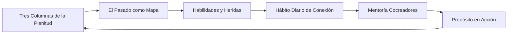
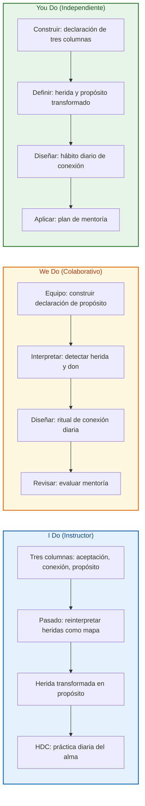
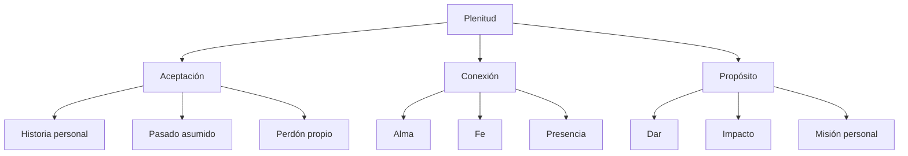
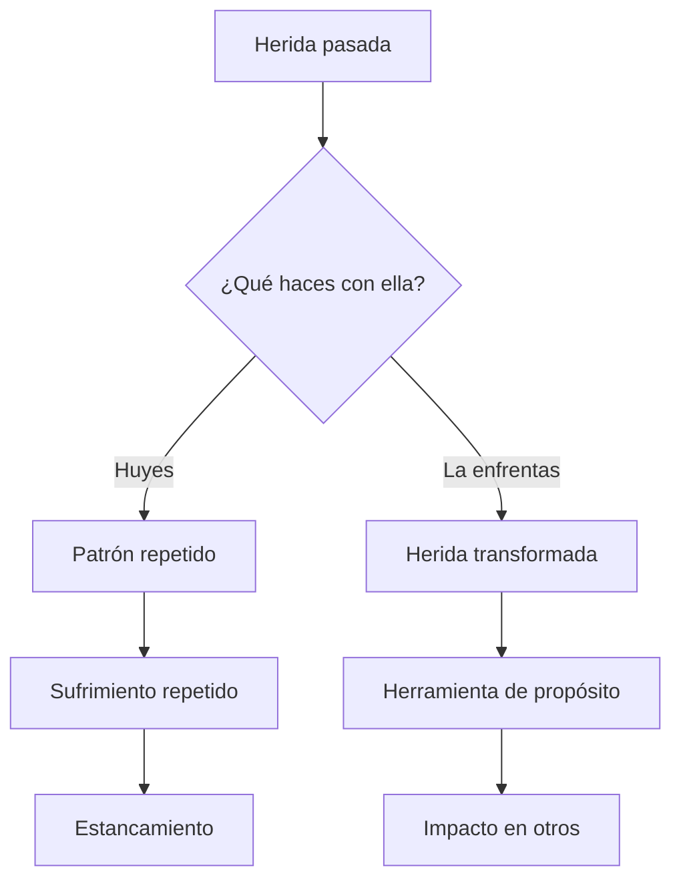
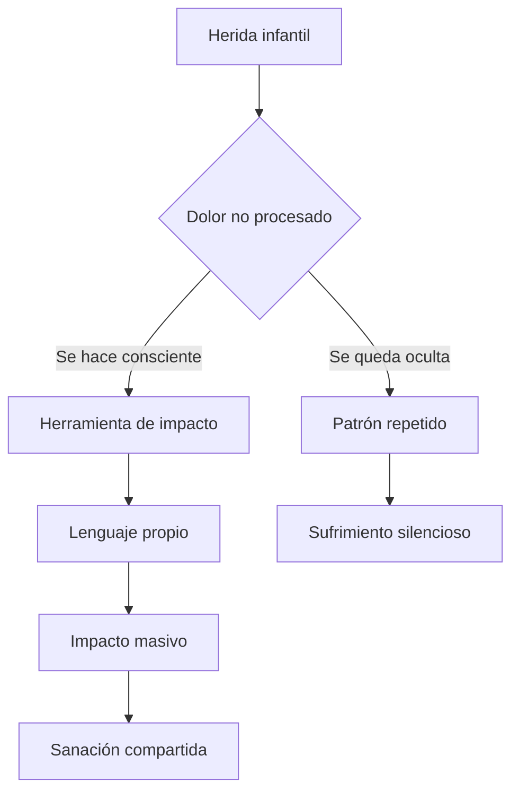
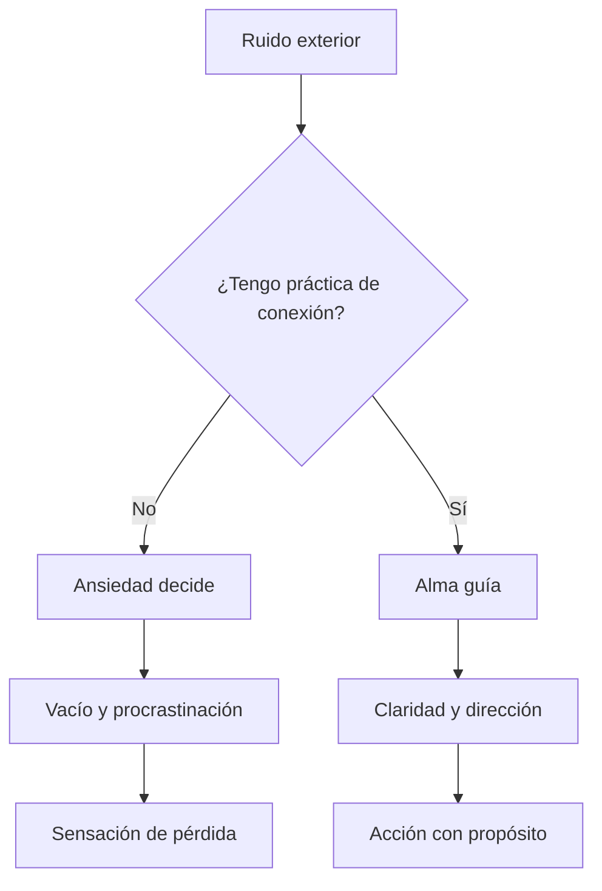
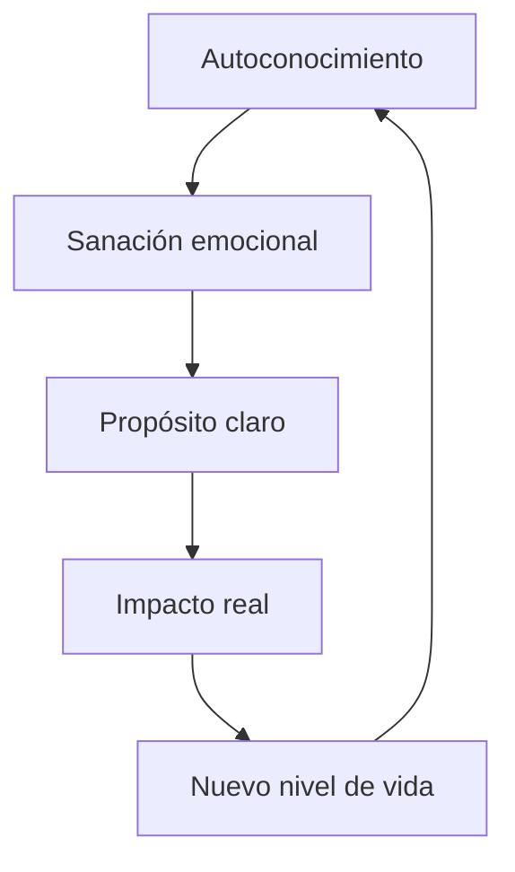

## ¿Qué vas a aprender

En este contenido desarrollarás una comprensión práctica de la sabiduría de la Kabbalah aplicada a la vida cotidiana:

- Las tres columnas de la plenitud y cómo construirlas en tu vida diaria
- Cómo transformar tu pasado y tus heridas en mapa y herramienta de propósito
- Identificar tus dones naturales para convertirlos en impacto real
- Instalar un Hábito Diario de Conexión como ancla espiritual
- Cómo funciona el modelo de mentoría Cocreadores y si es para ti

---

# MASTERCLASS: Despierta a tu Propósito — Las Tres Columnas de la Plenitud con el Rabino Daniel R. Chapán

## INTRODUCCIÓN: POR QUÉ ESTA MASTERCLASS ES DIFERENTE

La mayoría de los enfoques de propósito de vida empiezan por metas, productividad o afirmaciones. Esta masterclass empieza por una estructura espiritual concreta: tu vida está sostenida sobre **tres columnas**, y cuando una falla, todo tiembla.

En esta charla, el Rabino Daniel R. Chapán comparte un sistema práctico basado en la Kabbalah para conectar con tu propósito sin huir de tu historia. No se trata de una enseñanza abstracta: habla de heridas de la infancia, de la voz del alma, de hábitos diarios y de un camino de mentoría para profundizar.

El pasado no es un lastre. Es un mapa. Tu herida no es la respuesta, pero puede convertirse en tu herramienta si aprendes a sanarla y a mirarla con conciencia.

La vida plena no es un logro extraordinario. Es el resultado sostenible de tres columnas que se pueden construir intencionalmente.

> **Objetivo de Aprendizaje** — Al final de esta guía, podrás definir tus tres columnas de plenitud, transformar una herida en propósito, instalar un hábito diario de conexión con tu alma y evaluar un camino de mentoría para seguir profundizando.

> **Advertencia educativa** — Este contenido es formativo y espiritual. No sustituye asesoría religiosa, psicológica ni médica profesional. Úsalo como marco de reflexión, autoconocimiento y crecimiento personal.

---

## MAPA DEL WORKFLOW DE PROPÓSITO



| Fase | Pregunta que responde | Output principal |
|------|-----------------------|------------------|
| **Tres Columnas** | ¿Qué sostiene mi vida plena? | Estructura de plenitud |
| **El Pasado como Mapa** | ¿Cómo transformo mi historia en sentido? | Relectura sanadora del pasado |
| **Habilidades y Heridas** | ¿Qué dones y heridas conforman mi propósito? | Propósito personal |
| **Hábito Diario de Conexión** | ¿Cómo escucho la voz del alma cada día? | Práctica espiritual sostenible |
| **Mentoría Cocreadores** | ¿Cómo sigo profundizando con acompañamiento? | Hoja de ruta de mentoría |



---

## PARTE 1: LAS TRES COLUMNAS DE LA PLENITUD (55:47 - 59:55)

### 1.1 Principio Central

La vida plena no es un sentimiento permanente de felicidad. Es una estructura que se construye sobre **tres columnas** fundamentales:

1. **Aceptación** — de nuestra historia, nuestro pasado y quienes somos.
2. **Conexión** — con Dios, con nuestra alma y con lo que trasciende lo visible.
3. **Propósito** — el motor de dar al mundo lo que solo nosotros podemos dar.

Cuando una columna falla, la plenitud se desestabiliza. Si aceptas tu pasado pero no tienes propósito, vives en resignación. Si tienes propósito pero no aceptas tu historia, el propósito se llena de ruido. Si tienes propósito y aceptas tu historia pero no hay conexión, el vacío espiritual reaparece.



### 1.2 Columna 1: Aceptación

La aceptación no es conformismo. No se trata de resignarte a lo que te duele, sino de dejar de pelear contra la realidad para poder transformarla desde un lugar de verdad.

| Falta aceptación | Con aceptación |
|------------------|----------------|
| Vivís peleando contra tu historia | Transitás tu historia con conciencia |
| Tus heridas dirigen tus acciones | Tus heridas informan tu propósito |
| La vergüenza te calla | La vulnerabilidad te conecta |
| Repetís patrones sin verlos | Podés elegir con libertad |

### 1.3 Columna 2: Conexión

La conexión no es una metáfora. Es una práctica. Sin ella, el propósito se convierte en ruido y la aceptación en resignación vacía.

| Sin conexión | Con conexión |
|--------------|--------------|
| Vivís desde la superficie | Escuchás lo que el alma pide |
| Tomás decisiones solo con lógica | Integras corazón y cabeza |
| El vacío reaparece constantemente | Hay un centro que te sostiene |
| Perseguís metas sin sentido | Las metas tienen un por qué |

### 1.4 Columna 3: Propósito

El propósito no es un descubrimiento único. Es una construcción. Se revela a través de:

| Herramienta | Ejemplo práctico |
|-------------|------------------|
| Lo que te duele más | Una herida de abandono puede convertirte en alguien que escucha con presencia |
| Lo que haces sin esfuerzo | Un don natural que para vos es normal, pero para otros es extraordinario |
| Lo que te conecta con otros | Dar lo que a vos te hubiera gustado recibir |
| Lo que no puedes dejar de preguntar | Una obsesión sana que revela una necesidad del mundo |

### 1.5 Las tres columnas en práctica

```python
class TresColumnasPlenitud:
    def __init__(self, nombre):
        self.nombre = nombre
        self.aceptacion = {}
        self.conexion = {}
        self.proposito = {}

    def registrar_aceptacion(self, historia, perdón, aprendizaje):
        self.aceptacion = {
            "historia": historia,
            "perdón": perdón,
            "aprendizaje": aprendizaje,
        }

    def registrar_conexion(self, practica, frecuencia, experiencia):
        self.conexion = {
            "práctica": practica,
            "frecuencia": frecuencia,
            "experiencia": experiencia,
        }

    def registrar_proposito(self, don, herida_transformada, impacto):
        self.proposito = {
            "don": don,
            "herida_transformada": herida_transformada,
            "impacto": impacto,
        }

    def diagnosticar(self):
        columnas = [self.aceptacion, self.conexion, self.proposito]
        vacías = [i for i, col in enumerate(columnas) if not col]
        if not vacías:
            return "Tres columnas activas"
        return f"Columnas por fortalecer: {vacías}"
```

### 1.6 Ejercicio: Tus tres columnas hoy

| Columna | Estado actual | Próximo paso |
|---------|---------------|--------------|
| **Aceptación** | ¿Qué parte de mi historia no he aceptado todavía? | |
| **Conexión** | ¿Tengo una práctica espiritual regular? | |
| **Propósito** | ¿Sé qué don quiero aportar al mundo? | |

```text
1. Aceptación:
   Lo que me cuesta aceptar de mi historia:
   __________________________________________________

   Lo que estoy dispuest@ a perdonar:
   __________________________________________________

2. Conexión:
   Mi práctica actual (si tengo):
   __________________________________________________

   Lo que quiero instaurar:
   __________________________________________________

3. Propósito:
   Un don que tengo y no valoro:
   __________________________________________________

   Una herida que puede convertirse en herramienta:
   __________________________________________________

   El impacto que quiero generar:
   __________________________________________________
```

### 1.7 I Do — Evaluar tus tres columnas

**Objetivo:** diagnosticar qué columna necesitas fortalecer primero.

| Paso | Acción | Resultado |
|------|--------|-----------|
| 1 | Escribe qué plenitud significa para vos | Definición personal |
| 2 | Marca del 1 al 10 cada columna | Diagnóstico |
| 3 | Identifica la columna más baja | Prioridad |
| 4 | Escribe qué acción concreta la fortalecería | Primer paso |
| 5 | Define una fecha para empezar | Compromiso |

### 1.8 We Do — Sostener una columna caída

**Escenario:** una persona tiene propósito y conexión, pero no acepta su pasado.

| Pregunta | Respuesta esperada |
|----------|--------------------|
| ¿Qué parte de su historia le cuesta aceptar? | Un evento doloroso no procesado |
| ¿Qué creencia negativa se generó? | "No soy dign@" |
| ¿Qué don puede extraerse de esa herida? | Empatía profunda con el dolor ajeno |
| ¿Qué práctica de aceptación le propone? | Escribir una carta de reconciliación |
| ¿Cómo se transforma en propósito? | Acompañar a otros en procesos similares |

### 1.9 You Do — Tu declaración de tres columnas

Completa la frase inicial para cada columna:

```text
Acepto __________________________________________________
porque ya no depende de mí lo que ocurrió, pero sí depende de mí
lo que hago con eso.

Me conecto __________________________________________________
a través de __________________________________________________

Mi propósito es __________________________________________________
porque __________________________________________________
```

---

## PARTE 2: EL PASADO COMO MAPA (1:12:21 - 1:18:40)

### 2.1 Principio Central

El Rabino Daniel R. Chapán enfatiza que **no hay que huir de las heridas ni del pasado**. Esos capítulos no son errores del recorrido: son el mapa que permite comprender el sentido de tu vida.

En Kabbalah, no existe el tiempo lineal cerrado. Cada experiencia pasada ocupa un lugar en el diseño del alma. Cuando huyes del dolor, el dolor se convierte en patrón. Cuando lo miras, el dolor se convierte en combustible.

El pasado no es un lastre. Es combustible.



### 2.2 Por qué huir del pasado no funciona

| Estrategia | Resultado a corto plazo | Resultado a largo plazo |
|------------|------------------------|-------------------------|
| Negar lo vivido | Alivio momentáneo | Repetición del patrón |
| Superarlo rápido | Sensación de fortaleza | Herida sin procesar |
| Hablar sin sentir | Desahogo verbal | Sin transformación real |
| Culpar a otros | Justificación | Sin responsabilidad ni libertad |
| Tomar pastillas / evadir | Anestesia | Vuelve con más fuerza después |

### 2.3 El pasado como mapa, no como destino

Un mapa no es el territorio. Pero sin mapa, eliges caminos sin saber dónde terminas. Tu pasado te muestra:

| Lo que viviste | Lo que puede enseñarte |
|----------------|------------------------|
| Abandono | El valor de la presencia |
| Rechazo | La profundidad de la aceptación |
| Exceso de responsabilidad | La libertad de pedir ayuda |
| Invisibilidad | La importancia de ver a los otros |
| Pobreza | La creatividad con lo limitado |
| Enfermedad | Lo que realmente importa |
| Pérdida | La vida como regalo, no como garantía |

### 2.4 El proceso de relectura del pasado

```python
class PasadoComoMapa:
    def __init__(self, evento):
        self.evento = evento
        self.herida = ""
        self.aprendizaje = ""
        self.proposito = ""

    def reinterpretar(self):
        return {
            "evento_original": self.evento,
            "herida": self.herida,
            "aprendizaje": self.aprendizaje,
            "proposito": self.proposito,
            "estado": "procesado" if self.proposito else "en_proceso",
        }

    def sanar(self):
        return f"Este evento me dolió como {self.herida}, pero me enseña {self.aprendizaje} y me impulsa a {self.proposito}"
```

### 2.5 Señales de que estás huyendo del pasado

| Señal | Interpretación | Acción |
|-------|----------------|--------|
| No puedes hablar de ciertos temas sin alterarte | Hay herida sin procesar | Escribir sin filtrar |
| Repites la misma historia en relaciones distintas | Patrón reactivo | Identificar el patrón y nombrarlo |
| Sientes rabia sin motivo aparente | Energía acumulada del pasado | Canalizar con movimiento o escritura |
| Te compara constantemente con otros | Herida de comparación antigua | Volver a tu propia métrica |
| No celebras tus logros | Herida de no ser suficiente | Registrar y reconocer |

### 2.6 Ejercicio: Reescribir tu mapa

```text
1. Elige un evento del pasado que todavía te duele.
2. Escribe qué herida te generó (una sola frase).
3. Escribe qué don o capacidad desarrollaste por esa herida.
4. Escribe cómo ese don puede servir hoy a otra persona.
5. Relee el evento desde la mirada del punto 4.

Formato:

Evento: __________________________________________________

Herida inicial: __________________________________________________

Don desarrollado: __________________________________________________

Propósito posible: __________________________________________________

Relectura final: __________________________________________________
```

### 2.7 I Do — Identificar un capítulo sanador

**Objetivo:** encontrar una herida que pueda ser reinterpretada.

| Paso | Acción | Resultado |
|------|--------|-----------|
| 1 | Elegir una experiencia difícil | Punto de partida |
| 2 | Nombrar la emoción dominante | Herida visible |
| 3 | Buscar la capacidad que creaste | Don oculto |
| 4 | Conectar ese don con una necesidad actual | Propósito |
| 5 | Escribir una frase de cierre | Mapa sanado |

### 2.8 We Do — Detectar un patrón repetido

**Escenario:** alguien repite relaciones de abandono.

| Pregunta | Respuesta esperada |
|----------|--------------------|
| ¿Qué sucede siempre? | Se alejan cuando se acerca la intimidad |
| ¿Qué herida activa? | Abandono en la infancia |
| ¿Qué don desarrolló? | Hiperconciencia emocional |
| ¿Qué propósito revela? | Acompañar a otros en vínculos sanos |
| ¿Cuál es la nueva lectura? | Su sensibilidad no es debilidad, es capacidad |

### 2.9 You Do — Tu herida como herramienta

Completa:

```text
Mi herida principal:
__________________________________________________

Qué me enseñó:
__________________________________________________

A quién puedo ayudar con eso:
__________________________________________________

Cómo lo hago en la práctica:
__________________________________________________
```

---

## PARTE 3: HABILIDADES Y HERIDAS — DEL DOLOR AL PROPÓSITO (1:20:00 - 1:23:40)

### 3.1 Principio Central

El Rabino Daniel R. Chapán comparte aquí su experiencia personal: una herida de la infancia —la necesidad de ser visto— se convirtió, al ser sanada y consciente, en la herramienta de su propósito actual: impactar a millones de personas.

El mensaje no es que el dolor sea bueno. El mensaje es que **la conciencia transforma el dolor en lenguaje**.

Cuando una herida es nombrada, deja de dirigir tu vida en silencio.



### 3.2 Heridas que se convierten en propósito

| Herida original | Dolor inicial | Propósito transformado |
|-----------------|---------------|------------------------|
| Necesidad de ser visto | Invisibilidad | Inspirar a otros a mostrar su luz |
| Abandono | Soledad | Acompañar en duelo y soledad |
| Rechazo | No pertenencia | Crear espacios de pertenencia |
| Exceso de control | Ansiedad | Enseñar calma y presencia |
| Pobreza o carencia | Miedo a no tener | Generar abundancia consciente |
| Enfermedad o limitación | Frustración | Crear accesibilidad y sentido |
| Exceso de responsabilidad | Carga | Empoderar y delegar |

### 3.3 Identificar tu don natural

Tu propósito no es algo que inventás. Es algo que ya está en vos y que el mundo necesita.

| Pregunta | Seña |
|----------|------|
| ¿Qué haces sin esfuerzo? | Tu don |
| ¿Qué piden los demás que hagas? | Tu regalo |
| ¿Qué tema se te ocurre sin haberlo estudiado? | Tu conocimiento natural |
| ¿Por qué lloras o te indignas? | Tu herida transformada |
| ¿De qué hablarías sin que te paguen? | Tu vocación |

### 3.4 El modelo de sanación consciente

```python
class HeridaAProposito:
    def __init__(self, nombre):
        self.nombre = nombre
        self.herida_inicial = ""
        self.sanacion = ""
        self.don_transformado = ""
        self.impacto = ""
        self.lenguaje = ""

    def transformar(self):
        return {
            "herida": self.herida_inicial,
            "proceso": self.sanacion,
            "herramienta": self.don_transformado,
            "impacto": self.impacto,
            "comunicación": self.lenguaje,
        }

    def mensaje(self):
        return f"De {self.herida_inicial} nació {self.don_transformado} para {self.impacto}"
```

### 3.5 Ejercicio: Tu herida como herramienta

```text
1. Escribe una experiencia dolorosa de tu infancia o vida.
2. Escribe qué herida te dejó (una sola palabra si podés):
   __________________________________________________
3. Escribe qué capacidad desarrollaste por esa herida:
   __________________________________________________
4. Escribe a quién puedes ayudar con esa capacidad:
   __________________________________________________
5. Escribe cómo lo comunicarías en una frase:
   __________________________________________________
```

### 3.6 I Do — Nombrar tu herida

**Objetivo:** identificar una herida y su don transformado.

| Paso | Acción | Resultado |
|------|--------|-----------|
| 1 | Elegir una herida reconocible | Punto de partida |
| 2 | Nombrar el dolor sin juicio | Herida visible |
| 3 | Detectar la capacidad creada | Don generado |
| 4 | Conectar con un impacto posible | Propósito |
| 5 | Escribir frase de cierre | Lenguaje propio |

### 3.7 We Do — Conectar herida con necesidad del mundo

**Escenario:** una persona sufrió bullying en la escuela.

| Pregunta | Respuesta esperada |
|----------|--------------------|
| Herida principal | Vergüenza, exclusión |
| Don desarrollado | Empatía con los vulnerables |
| Necesidad del mundo | Niños y adolescentes excluidos |
| Propósito posible | Acompañamiento escolar o programas de inclusión |
| Frase final | "Mi dolor me enseñó a acompañar a quienes no tienen voz" |

### 3.8 You Do — Tu mensaje desde la herida

Completa:

```text
Mi herida:
__________________________________________________

Mi don transformado:
__________________________________________________

A quién sirvo:
__________________________________________________

Mi frase de propósito:
__________________________________________________
```

---

## PARTE 4: HÁBITO DIARIO DE CONEXIÓN — HDC (1:38:50 - 1:39:13)

### 4.1 Principio Central

El Hábito Diario de Conexión es una invitación a dejar de correr todo el día para preguntarle al alma qué es lo que realmente necesita.

En Kabbalah, el alma tiene una voz: **Nishmat Shadai**. No es un concepto poético. Es una práctica diaria que se instala en minutos y que te protege del vacío y de la procrastinación.

Sin esta práctica, el ruido del mundo y la ansiedad deciden por vos. Con esta práctica, vos volvés al centro antes de actuar.



### 4.2 Nishmat Shadai: la voz del alma

Nishmat Shadai es una expresión en hebreo que se refiere al aliento de lo divino dentro de cada persona. Escucharla no requiere talento espiritual. Requiere silencio.

| Práctica | Tiempo | Efecto |
|----------|--------|--------|
| Sentarse en silencio | 5 minutos | Detener el ruido mental |
| Respirar con intención | 3 minutos | Bajar del pensamiento al cuerpo |
| Pregunta al alma | 2 minutos | Recibir respuesta |
| Escribir lo que aparece | 3 minutos | Materializar la voz |
| Acción mínima del día | Definir 1 paso | Dirigir la energía |

### 4.3 El protocolo HDC

```python
class HDC:
    def __init__(self, duracion_minutos=15):
        self.duracion = duracion_minutos
        self.silencio = 5
        self.respiracion = 3
        self.pregunta = ""
        self.escritura = ""
        self.accion = ""

    def ejecutar(self):
        return {
            "silencio": f"{self.silencio} minutos sin estímulos",
            "respiracion": f"{self.respiracion} minutos respirando",
            "pregunta_al_alma": self.pregunta,
            "respuesta": self.escritura,
            "accion_del_dia": self.accion,
        }

    def validar(self):
        return bool(self.pregunta and self.accion)
```

### 4.4 Preguntas para la conexión diaria

No hace falta preguntar todo todos los días. Elegí una y profundizá.

| Pregunta | Cuándo usarla |
|----------|---------------|
| "Alma, ¿qué necesitás hoy?" | Cuando te sentís vacío |
| "¿Qué estoy evitando?" | Cuando procrastinás |
| "¿Qué sílate estoy repitiendo?" | Cuando repetís el mismo conflicto |
| "¿Qué don quiero entregar hoy?" | Cuando querés dirigir tu energía |
| "¿Qué me está pidiendo sanar esta situación?" | Cuando todo se complica |

### 4.5 Errores comunes en la práctica espiritual

| Error | Síntoma | Solución |
|-------|---------|----------|
| Buscar grandes revelaciones | Esperás una experiencia mística todos los días | Aceptá lo pequeño |
| Hacerla solo cuando estás mal | Espiritualidad de emergencia | Practicar también en calma |
| Juzgar lo que aparece | "Esto no es suficientemente espiritual" | Todo lo que aparece es material válido |
| Espiritualizar sin acción | La práctica se queda en la cabeza | Definir una acción mínima diaria |
| Compararse con otros | "Otros avanzan más rápido" | Tu alma tiene su tiempo |

### 4.6 I Do — Diseñar tu HDC

**Objetivo:** armar una rutina mínima viable.

| Paso | Acción | Resultado |
|------|--------|-----------|
| 1 | Elegir horario fijo | Constancia |
| 2 | Definir duración | Realismo |
| 3 | Elegir formato (silencio, caminar, escribir, escuchar) | Práctica adaptada |
| 4 | Elegir pregunta del día | Dirección |
| 5 | Registrar respuesta | Materializar |

### 4.7 We Do — Revisar una semana de prácticas

**Escenario:** alguien intentó hacer HDC 5 días y lo abandonó.

| Pregunta | Respuesta esperada |
|----------|--------------------|
| ¿Qué hizo? | 10 minutos de meditación con aplicación |
| ¿Por qué funcionó los primeros 3 días? | Tenía intención clara |
| ¿Por qué falló los últimos 2? | Cambió horario y usó el celular primero |
| ¿Qué ajuste propone? | Mismo lugar, mismo horario, celular apagado |
| ¿Qué pregunta usar? | "¿Qué necesito hoy?" |

### 4.8 You Do — Tu HDC en 30 días

Completa:

```text
Mi HDC será todos los días a las:
__________________________________________________

Durante:
__________________________________________________ minutos

Con esta práctica:
__________________________________________________

Mi pregunta base será:
__________________________________________________

Acción mínima posterior:
__________________________________________________
```

---

## PARTE 5: MENTORÍA COCREADORES — EL SIGUIENTE PASO (1:41:02 - 1:53:15)

### 5.1 Principio Central

El Rabino Daniel R. Chapán presenta su programa de mentoría: **Cocreadores**. Es un espacio virtual diseñado para quienes quieren transitar el camino del propósito con herramientas prácticas de sanidad, espiritualidad y propósito.

No es una formación teórica. Es un espacio de acompañamiento donde el rabino y su esposa Sara trabajan con un grupo reducido en encuentros en vivo, diseñando juntos un proceso personalizado.

El mensaje central: invertir en autoconocimiento y sanación personal es una de las decisiones más rentables que podés tomar, porque todo lo demás —tu negocio, tu familia, tus proyectos— se construye desde la persona que vos sos.



### 5.2 Cómo funciona la mentoría Cocreadores

| Elemento | Característica |
|----------|----------------|
| Formato | Virtual / en vivo |
| Acompañamiento | Rabino Daniel R. Chapán y Sara |
| Enfoque | Sanidad, espiritualidad y propósito |
| Metodología | Prácticas concretas, no teoría abstracta |
| Comunidad | Espacio grupal con otros en proceso similar |
| Compromiso | Proceso continuo, no taller puntual |

### 5.3 Señales de que estás listo para profundizar

No se trata de timing perfecto. Se trata de estar cansado de vivir en superficie.

| Señal | Interpretación |
|-------|----------------|
| Sentís vacío aunque todo esté bien | Necesitás profundidad |
| Repetís conflictos sin entender por qué | Necesitás sanación |
| Querés dar, pero no sabés qué dar | Necesitás propósito |
| Tenés metas pero no certeza interior | Necesitás conexión |
| Leés y escuchás mucho, pero no cambia tu vida | Necesitás acompañamiento personalizado |

### 5.4 Inversión en autoconocimiento como palanca

| Sin autoconocimiento | Con autoconocimiento |
|----------------------|----------------------|
| Metas sin rumbo | Metas alineadas con el alma |
| Relaciones repetitivas | Vínculos conscientes |
| Dinero sin sentido | Dinero al servicio de una misión |
| Productividad sin paz | Acción con calma y dirección |
| Sanación sin herramientas | Proceso con acompañamiento |

### 5.5 Cómo tomar la decisión de sumarte

```python
class DecisionMentoria:
    def __init__(self):
        self.sintomas = []
        self.motivacion = ""
        self.tiempo_disponible = 0
        self.inversion = 0

    def evaluar(self):
        return {
            "sintomas_detectados": len(self.sintomas),
            "motivacion": self.motivacion,
            "apto": len(self.sintomas) >= 3 and self.motivacion and self.tiempo_disponible >= 1,
        }

    def razones(self):
        return f"Llegué a este punto porque {self.motivacion}"
```

### 5.6 I Do — Evaluar si es tu momento

**Objetivo:** decidir desde un lugar consciente.

| Paso | Acción | Resultado |
|------|--------|-----------|
| 1 | Marcar señales que reconozcas (del 5.3) | Diagnóstico |
| 2 | Definir qué querés profundizar | Objetivo personal |
| 3 | Evaluar tiempo disponible en tu semana | Realismo |
| 4 | Definir qué estás dispuest@ a invertir | Compromiso |
| 5 | Decidir si das el paso ahora o preparas | Claridad |

### 5.7 We Do — Diseñar un plan personal de 30 días

**Escenario:** alguien quiere profundizar antes de sumarse a la mentoría.

| Semana | Enfoque | Acción |
|--------|---------|--------|
| 1 | Aceptación | Escribir carta de reconciliación con el pasado |
| 2 | Conexión | Instalar HDC en horario fijo |
| 3 | Propósito | Mapa de heridas y dones |
| 4 | Evaluación | Decidir sobre mentoría |

### 5.8 You Do — Tu camino de 30 días

Completa:

```text
Estoy list@ para profundizar porque:
__________________________________________________

En las próximas 4 semanas voy a:
Semana 1: __________________________________________________
Semana 2: __________________________________________________
Semana 3: __________________________________________________
Semana 4: __________________________________________________

El recurso que voy a usar:
__________________________________________________

La decisión sobre mentoría la tomo el:
__________________________________________________
```

---

## COMPARATIVA FINAL

| Concepto | Definición práctica | Resultado esperado |
|----------|---------------------|--------------------|
| **Aceptación** | Dejar de pelear contra tu historia | Paz interior y libertad |
| **Conexión** | Escuchar la voz del alma diariamente | Dirección y certeza interior |
| **Propósito** | Convertir heridas y dones en impacto | Sentido y plenitud sostenida |
| **HDC** | 15 minutos diarios de conexión | Clarity antes de actuar |
| **Mentoría** | Acompañamiento personalizado | Profundización acelerada |

---

## CONCLUSIÓN

> La vida plena no se encuentra: se construye. Se construye sobre tres columnas —aceptación, conexión y propósito— y se sostiene cada día con pequeños hábitos que te devuelven al centro.

El Rabino Daniel R. Chapán no ofrece fórmulas mágicas. Ofrece un mapa espiritual que habilita a cualquier persona a transitar su propia historia sin miedo, descubrir los dones ocultos en sus heridas y construir un propósito que trascienda lo personal.

Tu pasado no te define. Te informa.  
Tu herida no te limita. Te entrena.  
Tu don no es casualidad. Es responsabilidad.

Invertir en tu autoconocimiento y en tu sanación no es un acto de indulgence. Es el acto más estratégico que podés hacer: todo lo demás —tu trabajo, tu familia, tus proyectos— se construye desde la persona que vos decidís ser.

---

## CHECKLIST FINAL

| Bloque | Check |
|--------|-------|
| Tres columnas | Definí tu nivel actual y prioridad de cada una |
| Pasado como mapa | Releí una herida y encontré un propósito |
| Heridas y habilidades | Nombré una herida, un don transformado y un impacto |
| HDC | Diseñé práctica diaria de al menos 15 minutos |
| Mentoría | Evalué si es mi momento y definí próximos pasos |

---

## PREGUNTAS DE VERIFICACIÓN

1. **Aplica**: Si acepto mi pasado pero no tengo conexión espiritual, ¿qué columna está fallando? ¿Qué práctica concreta podés agregar mañana?

2. **Analiza**: Una herida de abandono puede transformarse en un don de acompañamiento. Pensá en una herida propia. ¿Qué don puede estar oculto ahí?

3. **Diseña**: Escribí tu HDC en tres líneas: horario, formato y pregunta base. ¿Podés sostenerla mañana sin esfuerzo?

4. **Reflexiona**: El rabino habla de invertir en autoconocimiento como lo más rentable. ¿Qué estás invirtiendo hoy y en qué estás creciendo mañana?

---

## GLOSARIO RÁPIDO

| Término | Definición |
|---------|------------|
| **Kabbalah** | Sabiduría ancestral sobre el alma, la energía y el propósito humano |
| **Nishmat Shadai** | Expresión que refiere al aliento o voz del alma dentro de cada persona |
| **Tres columnas** | Estructura de la plenitud: aceptación, conexión y propósito |
| **Herida transformada** | Herida sanada que se convierte en herramienta de impacto |
| **HDC** | Hábito Diario de Conexión: práctica espiritual sostenible |
| **Propósito vital** | La intención específica por la que tu alma está en este mundo |
| **Cocreadores** | Programa de mentoría del Rabino Daniel R. Chapán |

---

