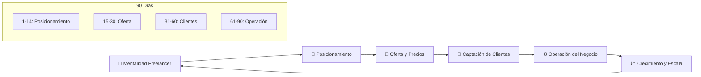
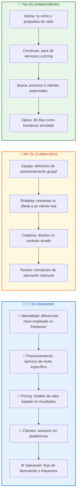
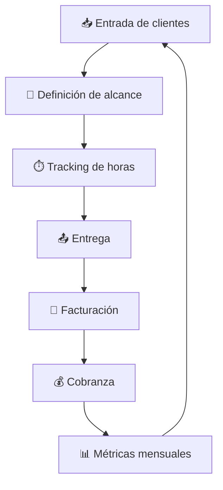
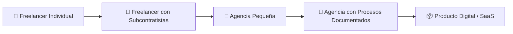

## 🎯 ¿Qué vas a aprender

En este contenido desarrollarás un sistema práctico para transformar tu carrera de empleado a consultor independiente rentable en 90 días:

- 🧠 Mentalidad del freelancer exitoso vs. mentalidad de empleado
- 🎯 Cómo definir tu posicionamiento único en el mercado
- 💼 Qué ofrece y cómo estructurar tus servicios y precios
- 🎣 Estrategias prácticas para conseguir tus primeros clientes sin LinkedIn
- ⚠️ Errores comunes que hacen fracasar al 80% de los freelancers
- 📊 Cómo gestionar finanzas, impuestos y crecimiento de tu negocio
- 🔄 Cómo escalar de servicio individual a agencia o producto

---

# MASTERCLASS: De Empleado a Freelancer Exitoso en la Era Digital 💼🚀 — Guía Práctica de 90 Días

## 🎬 INTRODUCCIÓN: POR QUÉ ESTA MASTERCLASS ES DIFERENTE

La mayoría de las guías sobre freelancing empiezan por las herramientas: cómo crear un perfil en Upwork, cómo armar un CV moderno, qué stack usar para tu web personal. Esta masterclass empieza por algo mucho más básico y poderoso: **la decisión de cómo te vas a posicionar** en el mercado.

El mercado no está buscando "desarrolladores freelance". Está buscando **solucionadores de problemas específicos**. Si tu oferta es "desarrollo web genérico", compites por precio con miles de personas en todo el mundo. Si tu oferta es "automatización de reportes financieros con IA para estudios contables en LATAM", tienes un activo que muy pocos pueden replicar.

En esta masterclass, te explico el sistema de 90 días para pasar de empleado a freelancer rentable, basado en:

1. **Definición de posicionamiento** (días 1-14)
2. **Construcción de oferta** (días 15-30)
3. **Captación de clientes** (días 31-60)
4. **Operación del negocio** (días 61-90)

> **🎯 Objetivo de Aprendizaje** — Al final de esta guía, tendrás tu posicionamiento definido, tu oferta armada y un plan concreto para conseguir tus primeros 2-3 clientes en los próximos 3 meses.

> **⚠️ Advertencia educativa** — Este contenido es formativo. No sustituye asesoría legal, impositiva ni financiera profesional. Consultá un contador o abogado antes de tomar decisiones sobre tu estructura de negocio.

---

## 🗺️ MAPA DEL WORKFLOW DE TRANSICIÓN



| 🚀 Fase | ❓ Pregunta que responde | 🎁 Output principal |
|---------|--------------------------|---------------------|
| **Mentalidad** | ¿Por qué el 80% de freelancers fracasan y cómo evitarlo? | 🧠 Cambio de paradigma laboral |
| **Posicionamiento** | ¿Qué problema específico puedo resolver mejor que la mayoría? | 🎯 Nicho y propuesta de valor |
| **Oferta** | ¿Qué vendo, a quién y a qué precio? | 💼 Servicios estructurados con pricing |
| **Captación** | ¿Cómo consigo clientes sin depender de plataformas de crowdsourcing? | 🎣 Pipeline de clientes propio |
| **Operación** | ¿Cómo facturar, cobrar, declarar y crecer? | ⚙️ Negocio ordenado y escalable |



---

## 🧠 PARTE 1: MENTALIDAD DEL FREELANCER EXITOSO

### 1.1 El Cambio de Paradigma 🔄

Convertirse en freelancer no es solo cambiar de cliente. Es cambiar de **relación con el trabajo, el tiempo y el valor**.

| Empleado | Freelancer Exitoso |
|----------|-------------------|
| Vende horas | Vende resultados |
| Espera que le asignen tareas | Busca problemas que resolver |
| Cobra por antigüedad | Cobra por impacto |
| Tiene jefe | Es su propio CEO |
| Salario fijo | Ingresos variables pero escalables |
| Beneficios dados | Beneficios que diseña |

> **💡 Concepto Clave**: El freelancer exitoso no es "un empleado sin jefe". Es el CEO de una microempresa de un solo empleado: vos.

### 1.2 Errores Mentales que Hacen Fracasar al 80%

| Error Mental | Síntoma | Corrección |
|--------------|---------|------------|
| **"Necesito experiencia primero"** | No te animas a cobrar lo que vales | La experiencia se gana haciendo, no esperando |
| **"Soy un 'junior' sin derecho a precios altos"** | Cotizas por hora barata | Cotizá por valor, no por hora |
| **"Voy a perder clientes si cobro mucho"** | Miedo al precio | Los clientes pagan por soluciones, no por horas |
| **"Necesito un perfil perfecto primero"** | Procrastinas en LinkedIn/portafolio | Empezá con un cliente real, el perfil se arma solo |
| **"Solo puedo hacer lo que sé hacer hoy"** | No te expandís | Aprendé en el camino, el cliente paga por soluciones |

### 1.3 El Test de la Identidad Freelancer 🧪

```python
class FreelancerIdentityTest:
    def __init__(self):
        self.score = 0

    def answer(self, question, response):
        if response:
            self.score += 1

    def result(self):
        if self.score >= 8:
            return "Estás listo para dar el salto 🚀"
        elif self.score >= 5:
            return "Estás en transición, falta posicionamiento 💡"
        else:
            return "Todavía estás en modo empleado, necesitás más claridad 🧠"

test = FreelancerIdentityTest()
test.answer("¿Podés definir tu nicho en una frase?", True)
test.answer("¿Tenés al menos un proyecto real para mostrar?", True)
test.answer("¿Sabés cuánto cobrar por tu servicio?", False)
test.answer("¿Tenés contactos que podrían ser tus primeros clientes?", True)
test.answer("¿Podés presupuestar sin depender de horas?", False)
print(test.result())
```

> **🎯 Insight clave**: El salto no se da cuando te sentís listo. Se da cuando tu posicionamiento está claro y tu oferta es irresistible para un nicho específico.

---

### 1.4 Checklist de Mentalidad Freelancer

| ✅ Item | Estado | Frecuencia |
|---------|--------|------------|
| Defino valor por resultados, no por horas | ☐ | Diaria |
| Cobro lo que vale mi solución | ☐ | Por proyecto |
| Soy mi propio CEO, no mi propio empleado | ☐ | Semanal |
| Invierto en aprendizaje, no solo en herramientas | ☐ | Mensual |
| Redes de contacto priorizadas sobre plataformas | ☐ | Continuo |

---

## 🎯 PARTE 2: POSICIONAMIENTO — EL ARTE DE SER EL MEJOR EN ALGO PEQUEÑO

### 2.1 El Error de Ser "Desarrollador Generalista" 🎭

El mercado está saturado de "desarrolladores full stack", "diseñadores UX/UI" y "consultores digitales". Estas etiquetas no generan confianza; generan comparación por precio.

**Posicionamiento vs. Generalización**:

| Generalista | Especialista |
|-------------|--------------|
| "Hago de todo" | "Resuelvo problema X para industria Y" |
| Compite por precio | Compite por valor |
| Cliente busca "el más barato" | Cliente busca "el mejor para mi caso" |
| Difícil de recomendar | Fácil de referir |

### 2.2 El Funnel de Nicho Perfecto

```
Nivel 1: Industria
   ↳ "Salud", "Finanzas", "E-commerce", "Educación"

Nivel 2: Rol/Proceso
   ↳ "Manejo de inventario", "Reportes financieros", "Onboarding"

Nivel 3: Tecnología/Metodología
   ↳ "con IA", "con automatización", "con RAG"
```

**Ejemplo de nicho perfecto**:
> "Automatización de reportes financieros con IA para estudios contables en LATAM"

Nicho = Industria + Proceso + Tecnología

### 2.3 Ejercicio de Posicionamiento

| Elemento | Tu Respuesta |
|----------|--------------|
| Industria que conocés | |
| Proceso que duele en esa industria | |
| Tecnología que podés aplicar | |
| Resultado medible que entregas | |
| Cliente ideal perfil | |

### 2.4 Errores de Posicionamiento 🚫

| Error | Síntoma | Corrección |
|-------|---------|------------|
| **Nicho demasiado amplio** | "Desarrollo web para todos" | Agregá industria y tecnología |
| **Nicho sin dolor real** | Nadie paga por lo que ofreces | Validá con 3 conversaciones antes de definir |
| **Cambio constante** | Cada mes cambias de posicionamiento | Definí un posicionamiento por 6 meses |
| **Falta de diferenciador** | Sos igual a 100 otros | Tu experiencia previa en X industria es el diferenciador |

---

## 💼 PARTE 3: OFERTA Y PRICING — CÓMO VENDER SIN PARECER VENDEDOR

### 3.1 Estructura de la Oferta Perfecta

| Capa | Descripción | Ejemplo |
|------|-------------|---------|
| **Producto base** | Tu servicio principal | "Sistema de reportes automáticos" |
| **Transformación** | Lo que el cliente gana | "Ahorra 10 horas semanales y reduce errores" |
| **Garantía** | Tu diferencial | "Entrega en 7 días o devolución del 50%" |
| **Bonos** | Valor agregado | "+ capacitación del equipo incluída" |

### 3.2 Modelos de Pricing

| Modelo | Cuándo Usarlo | Ventaja | Riesgo |
|---------|---------------|---------|--------|
| **Por proyecto** | Proyectos delimitados | Precio predecible para el cliente | Scope creep si no definís bien |
| **Por resultado** | Proyectos con KPI medible | Precio alineado con valor | Necesitás métricas claras |
| **Retainer mensual** | Trabajo continuo | Ingreso recurrente | Cliente puede cancelar |
| **Paquete por etapas** | Proyectos largos | Flujo de caja constante | Necesitás gestión de stages |

### 3.3 Cálculo de Precio Mínimo

```python
class PricingCalculator:
    def __init__(self, monthly_goal, tax_rate=0.35):
        self.monthly_goal = monthly_goal
        self.tax_rate = tax_rate
        self.working_days = 22

    def hourly_rate(self, billable_hours=80):
        net_goal = self.monthly_goal / (1 - self.tax_rate)
        return net_goal / billable_hours

    def project_price(self, estimated_hours):
        return self.hourly_rate() * estimated_hours

calc = PricingCalculator(monthly_goal=3000)
print(f"Tu hora mínima: ${calc.hourly_rate():.2f}")
print(f"Proyecto de 20hs: ${calc.project_price(20):.2f}")
```

> **💡 Tip**: El precio no se define por lo que vos necesitás ganar. Se define por el valor que generás. Si tu solución le ahorra $10K al mes, $3K por proyecto es barato.

### 3.4 Errores Comunes de Pricing

| Error | Síntoma | Solución |
|-------|---------|----------|
| **Cobrar por hora barata** | Competís con India/Pakistán | Cambiá a valor por resultado |
| **Miedo al no** | Aceptás cualquier presupuesto | Establecé tu precio mínimo y sostenelo |
| **Descuentos sin estrategia** | Cedes margen por miedo a perder | Ofrecé bonos, no descuentos |
| **No incluir impuestos** | Te sorprende la cuenta de impuestos | Sumá 30-35% de overhead |

---

## 🎣 PARTE 4: CAPTACIÓN DE CLIENTES — CÓMO CONSEGUIR CLIENTES SIN UPWORK

### 4.1 Los 3 Canales de Clientes para Freelancers

| Canal | Esfuerzo | Calidad de cliente | Cuándo usar |
|-------|----------|-------------------|-------------|
| **Red de contactos** | Bajo | Alta | Siempre |
| **Contenido orgánico** | Medio-Alto | Alta | Medium-Long term |
| **Outbound directo** | Alto | Alta-Media | Corto-Medio term |
| **Plataformas (Upwork, Fiverr)** | Bajo | Baja | Solo para experiencia inicial |

> **💡 Concepto clave**: Las plataformas son para aprender a vender, no para construir un negocio. Salí de Upwork/Fiverr lo antes posible.

### 4.2 Estrategia de Red de Contactos (La más efectiva)

```
Funnel de Contactos:
1. Lista de 50 contactos que te conocen
2. Segmentá por probabilidad de necesitar tu servicio
3. Enviá un mensaje personalizado a los 10 más probables
4. Ofrecé una llamada de diagnóstico gratuita de 15 min
5. En la llamada, diagnosticá dolor y ofrecé solución
```

**Mensaje modelo para contacto**:
> "Hola [Nombre], hace tiempo quería contarte que estoy ayudando a [industria similar] con [problema específico]. Si a vos te sirve, puedo pasarte un caso práctico sin compromiso. ¿Tenemos 15 min esta semana?"

### 4.3 Estrategia de Contenido Orgánico

| Plataforma | Contenido Recomendado | Frecuencia |
|------------|----------------------|------------|
| **LinkedIn** | Casos de estudio, métricas, lecciones aprendidas | 2-3 veces/semana |
| **Twitter/X** | Tips rápidos, hilos técnicos, opiniones | Diario |
| **Newsletter** | Análisis profundo de casos | Semanal |
| **GitHub/Portfolio** | Proyectos reales con documentación | Continuo |

### 4.4 Estrategia de Outbound Directo

| Paso | Acción | Resultado |
|------|--------|-----------|
| 1 | Buscar 20 empresas en tu nicho | Lista de prospectos |
| 2 | Encontrar dolor específico (LinkedIn, web, reviews) | Dolor identificado |
| 3 | Enviar email personalizado mencionando el dolor | Respuesta o no |
| 4 | Ofrecer un diagnóstico gratuito | Llamada agendada |
| 5 | Presentar propuesta en llamada | Venta |

**Email modelo**:
> "Hola [Nombre], vi que [empresa] [dolor específico que detecté]. Yo trabajo con [industria similar] resolviendo [problema similar]. Si te interesa, puedo compartirte un caso práctico sin costo. Saludos, [Tu nombre]"

### 4.5 Errores de Captación de Clientes 🚫

| Error | Síntoma | Corrección |
|-------|---------|------------|
| **Depender de plataformas** | Solo clientes de Upwork | Construí tu propio pipeline |
| **Enviar CV masivo** | Cero respuesta | Personalizá cada outreach |
| **Vender en el primer mensaje** | El prospecto huye | Primero diagnosticá, después vendé |
| **No tener casos que mostrar** | El prospecto no confía | Hacé proyectos pro bono para case studies |

---

## ⚙️ PARTE 5: OPERACIÓN DEL NEGOCIO — FASES 61-90

### 5.1 Flujo de Operación Diaria



### 5.2 Checklist Operativo

| Proceso | Herramienta | Frecuencia |
|---------|-------------|------------|
| Gestión de clientes | Notion / Airtable | Diaria |
| Tracking de horas | Toggl / Clockify | Diaria |
| Facturación | Facturama / WooCommerce | Quincenal |
| Cobranza | Transferencia / PayPal | Según acuerdo |
| Declaración de impuestos | Contador | Mensual/Trimestral |
| Métricas de negocio | Spreadsheet | Semanal |

### 5.3 Métricas Clave del Negocio

| Métrica | Fórmula | Meta |
|---------|---------|------|
| **Tasa de conversión** | Clientes / Llamadas | >20% |
| **Ticket promedio** | Facturación total / # clientes | Creciente |
| **Tiempo de cobranza** | Días entre factura y pago | <30 días |
| **Retención de clientes** | Clientes que repiten / total | >40% |
| **Utilidad neta** | (Ingresos - Gastos) / Ingresos | >40% |

### 5.4 Estructura Legal y Fiscal

```text
Opción A: Facturación como monotributista
- Ideal para ingresos bajos (<$X/mes)
- Simplificado, menor costo
- Límite de facturación anual

Opción B: Sociedad unipersonal / LLC
- Ideal para escalar
- Mayor costo pero más protección
- Permite facturar montos mayores
```

> **💡 Tip**: Empezá como monotributista. Cuando factures más del límite, migrá a sociedad. No te compliques antes de tiempo.

### 5.5 Errores Operativos Comunes

| Error | Síntoma | Solución |
|-------|---------|----------|
| **No separar finanzas personales de negocio** | No sabés si ganás o perdés | Cuenta bancaria separada desde día 1 |
| **No facturar en tiempo** | Problemas de caja | Facturá al completar el hito |
| **No tener contrato** | Clientes que no pagan | Usá contratos simples, siempre |
| **No tener backup** | Perdés todo si te pasa algo | Cloud + backups automáticos |

---

## 🔄 PARTE 6: ESCALAMIENTO — DE SERVICIO A PRODUCTO/AGENCIA

### 6.1 El Funnel de Escala



### 6.2 Cuándo Escalar

| Señal | Acción |
|-------|--------|
| Tenés más trabajo del que podés manejar | Subcontratar o aumentar precios |
| Los clientes piden servicios adicionales | Crear paquetes escalonados |
| Repetís el mismo proceso 3+ veces | Documentar y crear producto |
| Los ingresos se estancan | Cambiar modelo de pricing o nicho |

### 6.3 Errores de Escalamiento

| Error | Síntoma | Solución |
|-------|---------|----------|
| **Contratar demasiado pronto** | Gastos fijos altos, ingresos inestables | Escalá cuando tengas pipeline de 3+ meses |
| **No documentar procesos** | La calidad depende de vos | Documentá todo desde el día 1 |
| **Diversificar sin foco** | Todos los clientes son diferentes | Nicho primero, expansión después |

---

## 📝 PARTE 7: I DO / WE DO / YOU DO — EJERCICIOS PROGRESIVOS

### 7.1 I Do — Definición de Posicionamiento Guiada

**Objetivo**: definir tu posicionamiento de freelancer en 3 pasos.

| Paso | Acción | Resultado |
|------|--------|-----------|
| 1 | Elegir tu industria objetivo | Industria definida |
| 2 | Identificar el proceso más doloroso | Dolor validado |
| 3 | Definir tu diferenciador único | Posicionamiento listo |

### 7.2 We Do — Roleplay de Venta

**Escenario**: tu compañero es un dueño de [empresa en tu nicho].

| Rol | Acción |
|-----|--------|
| Tú | Presentar tu oferta en 2 minutos |
| Compañero | Hacer preguntas difíciles |
| Ambos | Evaluar qué funcionó y qué no |

### 7.3 You Do — Tu Plan de 90 Días

| Semana | Acción | Entregable |
|--------|--------|-----------|
| 1-2 | Definir posicionamiento | Nicho + propuesta de valor |
| 3-4 | Armar oferta y pricing | Propuesta comercial lista |
| 5-8 | Contactar 50 prospects | 5 llamadas agendadas |
| 9-12 | Operar primer mes completo | Primer factura emitida |

### 7.4 I Do — Pricing Justo

**Objetivo**: calcular tu precio por proyecto.

| Variable | Tu Valor |
|----------|----------|
| Meta mensual neta | |
| Horas facturables/mes | |
| Impuestos y overhead % | |
| **Precio hora mínimo** | **CALCULAR** |
| **Precio por proyecto 20hs** | **CALCULAR** |

### 7.5 We Do — Diagnóstico de Cliente

**Escenario**: simulation de llamada de descubrimiento.

| Pregunta | Respuesta del "cliente" |
|----------|------------------------|
| ¿Cuál es tu mayor dolor actual? | |
| ¿Cuánto te cuesta ese dolor? | |
| ¿Qué has intentado para solucionarlo? | |
| ¿Qué pasaría si lo resolviéramos hoy? | |

### 7.6 You Do — Tu Primera Propuesta

```text
CLIENTE IDEAL:
- Industria:
- Dolor principal:
- Resultado que le puedo generar:

MIS SERVICIOS:
1. [Servicio principal]:
2. [Servicio secundario]:

PRECIOS:
- Proyecto base: $
- Retainer mensual: $

VALOR DIFERENCIAL:
_______________________________
```

---

## 📚 GLOSARIO RÁPIDO

| Término | Definición |
|---------|------------|
| **Posicionamiento** | Definir qué problema resolvés y para quién |
| **Pricing por valor** | Cobrar por el resultado, no por las horas |
| **Retainer** | Contrato mensual recurrente |
| **Scope creep** | Ampliación no controlada del proyecto |
| **Ticket promedio** | Valor promedio por cliente |
| **Monotributo** | Régimen simplificado de facturación |
| **KPI** | Métrica clave de desempeño |
| **Pipeline** | Embudo de clientes potenciales |

---

## 📝 PREGUNTAS DE VERIFICACIÓN

### 🎯 Aplica

1. **Aplica**: Elegí una empresa que conozcás. ¿Qué problema específico podrías resolverle mejor que su situación actual? Definí tu posicionamiento en una frase.

### 🔍 Analiza

2. **Analiza**: ¿Por qué "desarrollador web full stack" es un mal posicionamiento? ¿Qué harías para mejorarlo?

### 🎨 Diseña

3. **Diseña**: Creá tu oferta de servicios con 3 capas: producto base, transformación y garantía. Incluí un precio por proyecto.

### 💭 Reflexiona

4. **Reflexiona**: ¿Por qué las plataformas como Upwork son un callejón sin salida para freelancers que quieren crecer? ¿Qué harías diferente?

### 🧩 Integra

5. **Integra**: Conectá posicionamiento + oferta + captación. ¿Qué primer paso darías mañana para conseguir tu primer cliente?

---

## 🌟 REFLEXIÓN FINAL

Convertirse en freelancer exitoso no es un evento, es un sistema. Los primeros 90 días son los más difíciles porque estás construyendo el motor de tu negocio mientras volás. Muchos abandonan en la semana 3, cuando el primer rechazo llega. Pero el rechazo no es señal de fracaso; es señal de que estás jugando un juego real.

> 🚀 El diferenciador no es tu código ni tu diseño. Es tu capacidad de posicionarte, comunicar valor y entregar resultados. La tecnología se compra; la confianza se construye.

- 💼 **Tu negocio sos vos**, no solo tu servicio.
- 🎯 **El nicho es tu ventaja**, no tu limitación.
- 💰 **El valor precede al precio**; si el cliente entiende el valor, el precio deja de ser una barrera.
- 🔄 **El crecimiento viene de la repetición**, no de la genialidad.

En los próximos 90 días, tu objetivo no es "ser freelancer". Es **tener un negocio ordenado, con clientes que pagan por valor y un sistema que escala**. El resto es repetición, ajuste y constancia.

---
