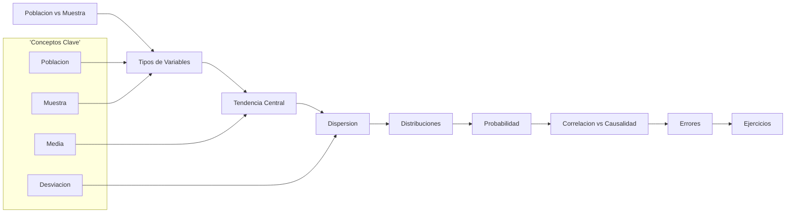
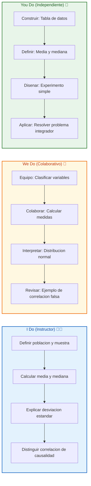
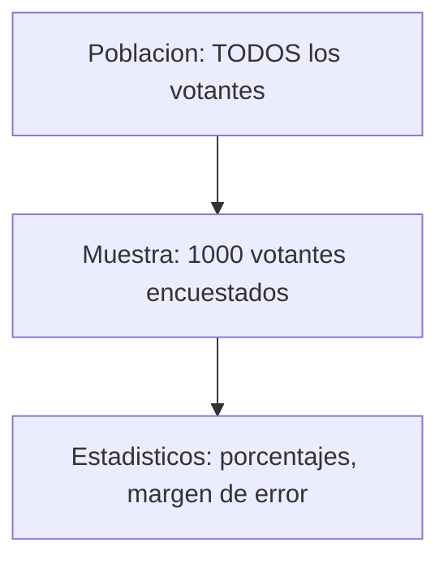
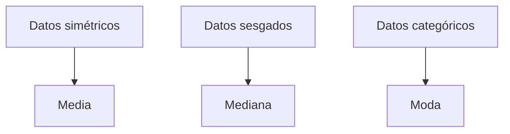
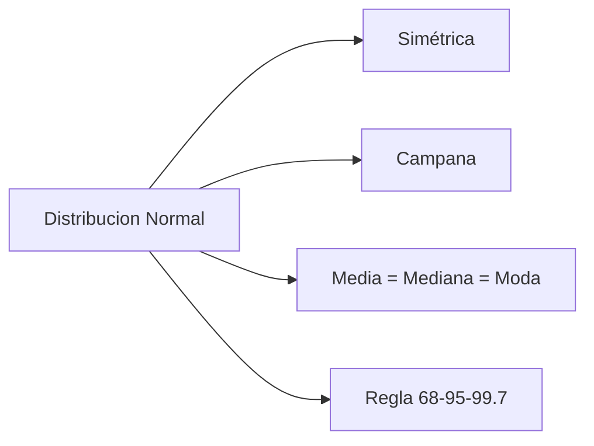
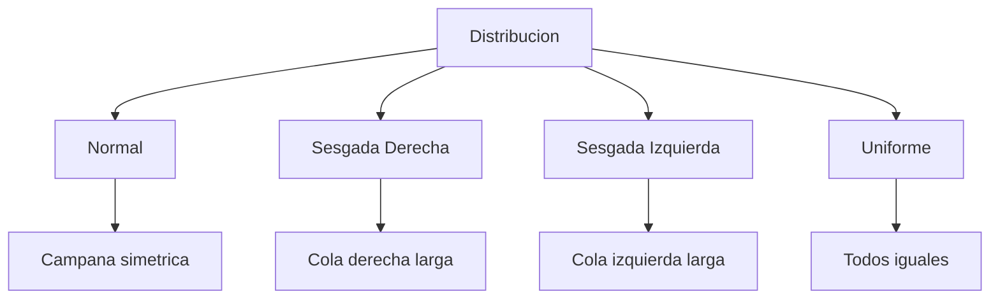
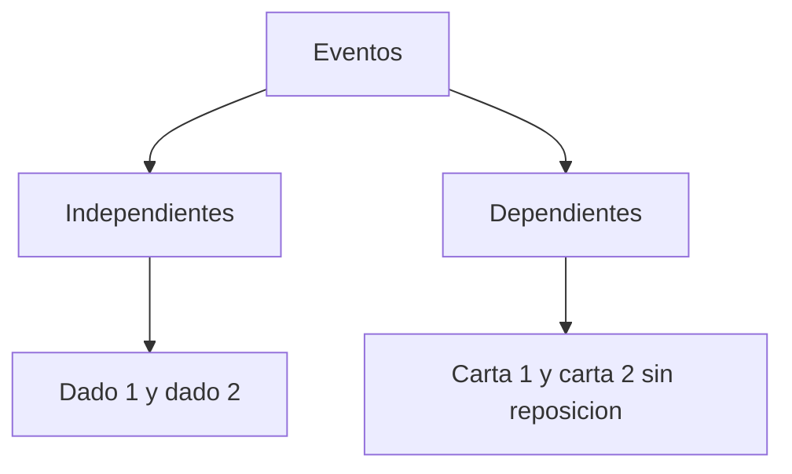
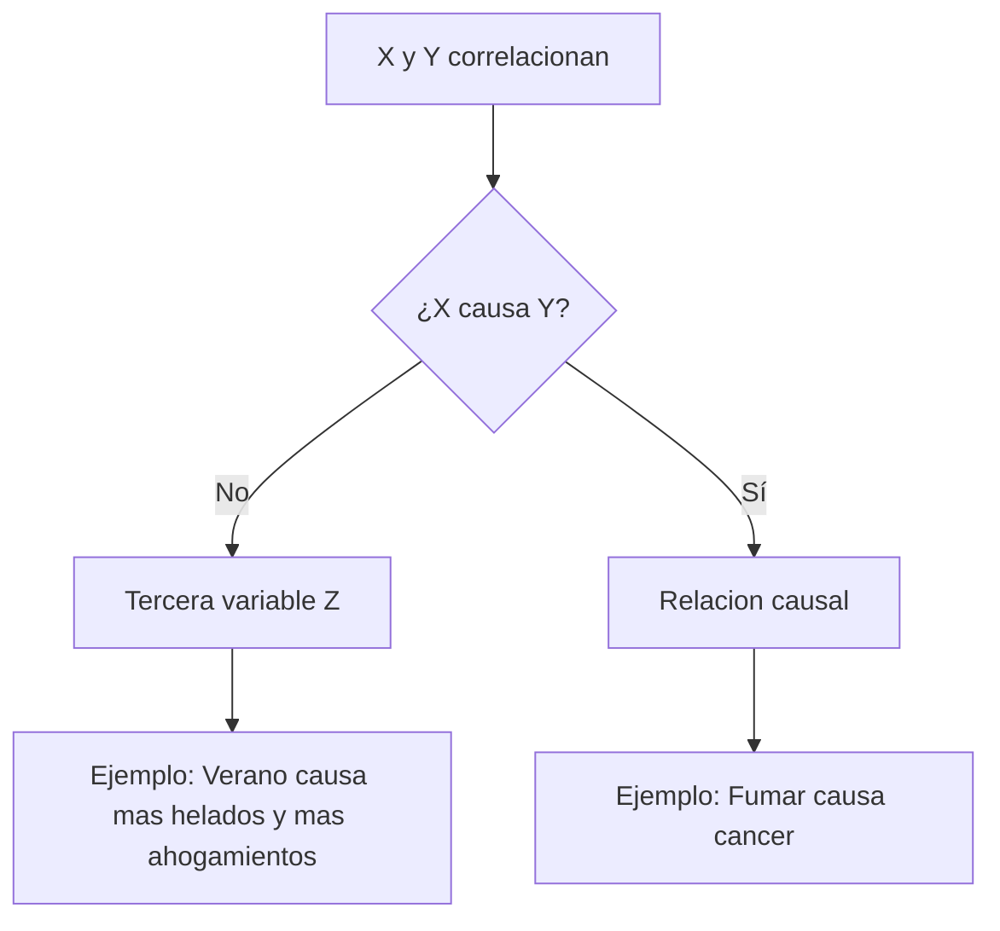

# MASTERCLASS: Introducción a las Matemáticas Estadísticas — El Arte de Entender Datos 📊🔍

## INTRODUCCIÓN: POR QUÉ ESTE MASTERCLASS ES DIFERENTE 🚀

La estadística no es solo números en una tabla. Es **la ciencia de tomar decisiones en la incertidumbre**. Cada vez que ves una encuesta electoral, un estudio médico, un reporte de ventas o un pronóstico del clima, hay estadística detrás. La pregunta no es si los datos son buenos o malos, sino si sabes interpretarlos.

Este masterclass propone otro camino: en vez de empezar por fórmulas olímpicas, vas a construir **intuición estadística** desde las bases: población, muestra, variables, medidas, distribuciones y probabilidad. Si entiendes qué significa la media, por qué la desviación estándar importa, y por qué correlación no es causalidad, ninguna métrica te sorprenderá.

La meta no es aprobar un examen de memoria. La meta es **leer el mundo como un conjunto de datos** y evitar las trampas que le cuestan millones a empresas y gobiernos.

> **Objetivo de Aprendizaje** 🎯 — Al final de esta guía, podrás diferenciar población y muestra, clasificar variables, calcular medidas de tendencia central y dispersión, reconocer distribuciones básicas, aplicar probabilidad simple y distinguir correlación de causalidad en ejemplos reales.

> **Advertencia educativa** ⚠️ — Este contenido es formativo. La estadística aplicada requiere rigor metodológico, muestreo adecuado y validación contextual antes de tomar decisiones.

---

## MAPA DEL MASTERCLASS 🗺️



| Fase | Pregunta que responde | Output principal |
|------|-----------------------|------------------|
| **Población vs Muestra** | ¿De dónde salen los datos? | Universo y representación |
| **Variables** | ¿Qué estoy midiendo? | Cualitativas y cuantitativas |
| **Tendencia Central** | ¿Dónde está el centro? | Media, mediana, moda |
| **Dispersión** | ¿Qué tan dispersos están? | Rango, varianza, desviación estándar |
| **Distribuciones** | ¿Cómo se distribuyen? | Normal, sesgada, uniforme |
| **Probabilidad** | ¿Qué tan probable es? | Regla de Laplace, eventos |
| **Correlación vs Causalidad** | ¿X causa Y? | Trampa del dato espurio |
| **Errores** | ¿Qué fallos evitar? | Lista de trampas |
| **Ejercicios** | ¿Lo domino? | I Do / We Do / You Do |



---

## PARTE 1: POBLACIÓN Y MUESTRA — ¿DE DÓNDE SALEN LOS DATOS? 🎯

### 1.1 Principio Central 💡

En estadística, casi nunca tienes acceso a **todos** los datos. Solo puedes observar una parte. Por eso existen dos conceptos fundamentales:

- **Población**: el conjunto completo de todos los elementos que quieres estudiar. Es el "universo".
- **Muestra**: un subconjunto de la población que realmente observas. Es tu "ventana" al universo.



> **La frase del profe** 🌟 — *"La muestra es como probar una cuchara de sopa: no necesitas comerte la olla entera para saber si está rica, pero la cuchara debe ser representativa."*

### 1.2 Ejemplo paso a paso 🔧

Quieres saber la estatura promedio de todos los estudiantes de tu ciudad (población = 50,000 estudiantes). Medir a los 50,000 es imposible. Entonces seleccionas una muestra de 500 estudiantes y calculas su promedio.

| Concepto | Ejemplo | Valor |
|----------|---------|-------|
| Población | Todos los estudiantes | 50,000 |
| Muestra | Estudiantes medidos | 500 |
- **Estadístico**: promedio de la muestra (1.68 m)
- **Parámetro**: promedio real de la población (desconocido)

> **Tip** 💡 — La estadística inferencial existe para estimar parámetros poblacionales a partir de estadísticos muestrales. Es el puente entre lo que tienes y lo que quieres saber.

### 1.3 Errores de muestreo comunes

| Error ❌ | Consecuencia | Correcto ✅ |
|----------|--------------|------------|
| Muestra sesgada | Conclusión falsa | Selección aleatoria |
| Muestra muy pequeña | Alta variabilidad | Tamaño suficiente |
| Muestra no representativa | No generalizable | Criterios claros |
| Muestra cómoda | Sesgo de conveniencia | Muestreo probabilístico |

---

## PARTE 2: TIPOS DE VARIABLES — ¿QUÉ ESTOY MIDIENDO? 🎯

### 2.1 Clasificación fundamental

No todos los datos son iguales. La forma en que los medís determina qué análisis podés hacer.

| Tipo | Definición | Ejemplo | ¿Se puede promediar? |
|------|------------|---------|----------------------|
| **Cualitativa nominal** | Categorías sin orden | Color de ojos, género | ❌ No |
| **Cualitativa ordinal** | Categorías con orden | Nivel educativo, rating | ⚠️ Parcialmente |
| **Cuantitativa discreta** | Números enteros, conteos | Hijos, goles, clicks | ✅ Sí |
| **Cuantitativa continua** | Números reales, mediciones | Altura, peso, tiempo | ✅ Sí |

### 2.2 Ejemplos concretos

| Variable | Tipo | ¿Por qué? |
|----------|------|-----------|
| Género | Cualitativa nominal | Sin orden inherente |
| Nivel de satisfacción (1-5) | Cualitativa ordinal | Orden, pero distancias no iguales |
| Cantidad de productos vendidos | Cuantitativa discreta | Conteo entero |
| Temperatura corporal | Cuantitativa continua | Medicion con decimales |

> **Tip** 💡 — La variable ordinal es un caso especial: podés decir "más alto" o "más bajo", pero no podés afirmar que la distancia entre 1 y 2 es igual que entre 4 y 5 sin validarlo.

### 2.3 We Do — Clasificar variables 🤝

| Variable | Tipo | Justificación |
|----------|------|---------------|
| Color de camiseta | ? | |
| Cantidad de llamadas | ? | |
| Nota del examen (0-10) | ? | |
| Tiempo de reacción (ms) | ? | |

---

## PARTE 3: MEDIDAS DE TENDENCIA CENTRAL — ¿DÓNDE ESTÁ EL CENTRO? 📍

### 3.1 Las tres medidas

Las medidas de tendencia central intentan responder: ¿dónde se concentran los datos?

| Medida | Definición | Cuándo usarla | Símbolo |
|--------|------------|---------------|---------|
| **Media** | Suma de todos los valores dividida por la cantidad | Datos simétricos, sin valores extremos | μ (población), x̄ (muestra) |
| **Mediana** | Valor que divide a la muestra en dos mitades iguales | Datos sesgados o con outliers | Me |
| **Moda** | Valor que más se repite | Datos categóricos o multimodales | Mo |

### 3.2 Ejemplo práctico

Notas de un examen: `4, 5, 5, 6, 7, 7, 7, 8, 9, 10`

| Medida | Cálculo | Resultado |
|--------|---------|-----------|
| Media | (4+5+5+6+7+7+7+8+9+10)/10 | 6.8 |
| Mediana | Ordenar: 4,5,5,6,7,7,7,8,9,10 → promedio de 7 y 7 | 7 |
| Moda | Valor más frecuente | 7 |

> **Tip** 💡 — En distribuciones simétricas, media ≈ mediana ≈ moda. En distribuciones sesgadas, se separan. Ese desplazamiento es una señal de asimetría.

### 3.3 Cuándo elegir cada una

| Situación | Mejor medida | Por qué |
|-----------|--------------|---------|
| Salarios en una empresa | Mediana | Sueldos muy altos sesgan la media |
| Tallas de zapatos | Moda | La talla más común es la que más importa |
| Temperatura promedio | Media | Datos simétricos |
| Edades en una encuesta | Media o mediana | Depende del sesgo |



### 3.4 I Do — Calcular medidas de tendencia central 👨‍🏫

**Objetivo:** calcular media, mediana y moda para `3, 5, 5, 7, 10, 10, 10, 12`.

| Paso | Acción | Resultado |
|------|--------|-----------|
| 1 | Sumar todos | 3+5+5+7+10+10+10+12 = 62 |
| 2 | Dividir por n | 62/8 = 7.75 → Media = 7.75 |
| 3 | Ordenar y buscar centro | 3,5,5,7,10,10,10,12 → promedio de 7 y 10 = 8.5 → Mediana = 8.5 |
| 4 | Buscar más frecuente | 10 aparece 3 veces → Moda = 10 |

---

## PARTE 4: MEDIDAS DE DISPERSIÓN — ¿QUÉ TAN DISPERSOS ESTÁN? 📏

### 4.1 El problema de la media sola

La media te dice dónde está el centro, pero no te dice qué tan dispersos están los datos alrededor de ese centro.

**Ejemplo**: dos grupos con la misma media pero dispersión totalmente distinta:

- Grupo A: `1, 2, 3, 4, 5` → media = 3, datos muy juntos
- Grupo B: `-10, 0, 3, 6, 20` → media = 3, datos muy dispersos

> **Tip** 💡 — Dos conjuntos pueden tener la misma media y ser completamente distintos. La dispersión es la que completa la historia.

### 4.2 Las medidas de dispersión

| Medida | Definición | Interpretación |
|--------|------------|---------------|
| **Rango** | Máximo - Mínimo | Amplitud total |
| **Varianza** | Promedio de las desviaciones al cuadrado | Dispersión total |
| **Desviación estándar** | Raíz cuadrada de la varianza | Dispersión en unidades originales |

### 4.3 Cálculo paso a paso

Para el conjunto `2, 4, 4, 4, 5, 5, 7, 9`:

| Paso | Cálculo | Resultado |
|------|---------|-----------|
| Media | (2+4+4+4+5+5+7+9)/8 | 5 |
| Desviaciones | 2-5, 4-5, ... | -3, -1, -1, -1, 0, 0, 2, 4 |
| Desviaciones al cuadrado | (-3)², (-1)², ... | 9, 1, 1, 1, 0, 0, 4, 16 |
| Varianza | (9+1+1+1+0+0+4+16)/8 | 4 |
| Desviación estándar | √4 | 2 |

```mermaid
flowchart TD
    A[Varianza] --> B[Promedio de (x - media)²]
    B --> C[Desviacion Estandar]
    C --> D[Raiz cuadrada de la varianza]
```

> **Tip** 💡 — La desviación estándar se interpreta fácilmente: "en promedio, los datos se alejan 2 unidades de la media". Eso es mucho más intuitivo que la varianza.

### 4.4 We Do — Interpretar dispersión 🤝

| Conjunto | Media | Desviación estándar | Interpretación |
|----------|-------|---------------------|----------------|
| `5, 5, 5, 5` | 5 | 0 | Sin dispersión, todos iguales |
| `0, 5, 10` | 5 | ≈ 4.08 | Dispersión alta |
| `3, 4, 5, 6, 7` | 5 | ≈ 1.41 | Dispersión moderada |

---

## PARTE 5: DISTRIBUCIONES — ¿CÓMO SE DISTRIBUYEN LOS DATOS? 📈

### 5.1 La distribución normal (campana de Gauss)

Es la distribución más importante de la estadística. Muchos fenómenos naturales se aproximan a ella: altura de personas, peso, coeficiente intelectual, errores de medición.



| Característica | Valor |
|----------------|-------|
| Forma | Campana simétrica |
| Centro | Media = mediana = moda |
| Regla 68-95-99.7 | 68% dentro de 1σ, 95% dentro de 2σ, 99.7% dentro de 3σ |
| Parámetros | Media (μ) y desviación estándar (σ) |

> **Tip** 💡 — La regla 68-95-99.7 es un atajo mental brutal. Si sabes la media y la desviación estándar, podés estimar porcentajes sin calculadora.

### 5.2 Otras distribuciones importantes

| Distribución | Forma | Ejemplo |
|--------------|-------|---------|
| **Normal** | Campana simétrica | Altura, peso, CI |
| **Sesgada a la derecha** | Cola larga a la derecha | Ingresos, tiempo de respuesta |
| **Sesgada a la izquierda** | Cola larga a la izquierda | Edad de jubilación |
| **Uniforme** | Plano, todos iguales | Lanzamiento de dado justo |
| **Binomial** | Dos resultados posibles | Lanzamiento de moneda |



### 5.3 Ejemplo: distribución de ingresos

Los ingresos en un país típicamente tienen distribución sesgada a la derecha: la mayoría gana poco, y hay pocas personas con ingresos muy altos que estiran la cola.

| Percentil | Ingreso mensual |
|-----------|-----------------|
| 10% | $500 |
| 50% (mediana) | $2,000 |
| 90% | $8,000 |
| 99% | $50,000 |

> **Tip** 💡 — En distribuciones sesgadas, la media es engañosa. Siempre mirá la mediana para comparar "tipicidad".

---

## PARTE 6: PROBABILIDAD — ¿QUÉ TAN PROBABLE ES? 🎲

### 6.1 Concepto fundamental

La probabilidad mide la **posibilidad de que ocurra un evento**, en una escala de 0 a 1.

| Valor | Interpretación |
|-------|----------------|
| 0 | Imposible |
| 0.5 | Tan probable como no |
| 1 | Seguro |

### 6.2 Regla de Laplace

Para eventos equiprobables:

```text
P(evento) = Casos favorables / Casos posibles
```

### 6.3 Ejemplos

| Experimento | Casos favorables | Casos posibles | Probabilidad |
|-------------|------------------|----------------|--------------|
| Lanzar dado, que salga 6 | 1 | 6 | 1/6 ≈ 0.167 |
| Sacar rey de baraja | 4 | 52 | 4/52 ≈ 0.077 |
| Lluvia mañana (pronóstico) | — | — | 30% |

### 6.4 Eventos independientes y dependientes

| Tipo | Definición | Ejemplo |
|------|------------|---------|
| **Independientes** | Uno no afecta al otro | Lanzar dos dados |
| **Dependientes** | Uno sí afecta al otro | Sacar dos cartas sin reposición |



> **Tip** 💡 — Si los eventos son independientes, podés multiplicar sus probabilidades. Si son dependientes, tenés que condicionar.

---

## PARTE 7: CORRELACIÓN VS CAUSALIDAD — LA TRAMPA MÁS COMÚN ⚠️

### 7.1 La diferencia que salva carreras

- **Correlación**: dos variables se mueven juntas (una sube, la otra sube).
- **Causalidad**: una variable causa que la otra cambie.

> **La frase del profe** 🌟 — *"Correlación no implica causalidad. El número de películas de Nicolas Cage se correlaciona con las muertes en piscinas. ¿Causa Cage las muertes? No. Ambas dependen de una tercera variable (el año)."*

### 7.2 Ejemplos famosos

| Correlación | ¿Causalidad? | Explicación |
|-------------|--------------|-------------|
| Más helados → más ahogamientos | ❌ No | Ambas suben en verano |
| Más educación → más ingresos | ⚠️ Parcial | Hay otros factores |
| Fumar → cáncer de pulmón | ✅ Sí | Mecanismo biológico confirmado |
| Usar celular → menos sueño | ⚠️ Probable | Luz azul y ansiedad |



### 7.3 Prueba de causalidad mínima

Para afirmar que X causa Y, necesitás al menos:

1. **Correlación** fuerte y consistente
2. **Secuencia temporal**: X ocurre antes que Y
3. **No confusión**: descartar variables ocultas
4. **Mecanismo plausible**: explicación teórica

### 7.4 We Do — Analizar correlaciones 🤝

| Afirmación | ¿Correlación? | ¿Causalidad? | Variable oculta posible |
|------------|---------------|--------------|------------------------|
| "Más policía → menos crimen" | ? | ? | Economía, demografía |
| "Estudiar más → mejores notas" | ? | ? | Inteligencia, motivación |
| "Tomar vitamina C → menos gripes" | ? | ? | Estilo de vida, higiene |

---

## PARTE 8: TRAMPAS CLÁSICAS — ERRORES QUE CUESTAN PUESTO 💀

### 8.1 Los errores más caros

| Error ❌ | Por qué es falso | Correcto ✅ |
|----------|-----------------|------------|
| Confundir muestra con población | La muestra no es el universo | Generalizar con cuidado |
| Usar media con datos sesgados | La media se estira | Usar mediana |
| Creer que correlación es causalidad | Terceras variables | Buscar mecanismo y secuencia |
| Olvidar el tamaño muestral | Muestras pequeñas son ruidosas | n suficiente |
| Ignorar el sesgo de selección | Muestra no representativa | Muestreo aleatorio |

### 8.2 Tabla de consecuencias

| Error | Consecuencia en la vida real | Ejemplo |
|-------|------------------------------|---------|
| Muestra sesgada | Políticas públicas fallidas | Encuesta solo por redes |
| Media con outliers | Salarios "promedio" irreales | Sueldos de ejecutivos |
| Correlación como causalidad | Invertir en producto equivocado | "Venden más porque hay más publicidad" |
| Muestra pequeña | Resultados que no replican | Estudio con 10 personas |
| Sesgo de selección | Excluir grupos clave | Encuesta solo en zona rica |

> **Tip** 💡 — Un estadístico famoso dijo: "Los datos no hablan por sí mismos. Hay que interrogarlos correctamente."

---

## PARTE 9: I DO / WE DO / YOU DO — EJERCICIOS PROGRESIVOS 🏋️

### 9.1 I Do — Calcular media, mediana y moda 👨‍🏫

**Objetivo:** aplicar las tres medidas a un conjunto realista.

Datos: tiempos de entrega de pedidos (minutos): `12, 15, 15, 18, 20, 20, 20, 25, 30, 45`.

| Paso | Acción | Resultado |
|------|--------|-----------|
| 1 | Sumar todos | 12+15+15+18+20+20+20+25+30+45 = 220 |
| 2 | Dividir por n | 220/10 = 22 → Media = 22 min |
| 3 | Ordenar y buscar centro | 12,15,15,18,20,20,20,25,30,45 → promedio de 20 y 20 = 20 → Mediana = 20 min |
| 4 | Buscar más frecuente | 20 aparece 3 veces → Moda = 20 min |

**Interpretación:** la media (22) es mayor que la mediana (20) porque el valor 45 estira el promedio hacia arriba. La mediana representa mejor el "tiempo típico".

### 9.2 We Do — Calcular desviación estándar 🤝

**Escenario:** notas de un curso: `8, 9, 9, 10, 10, 10, 10, 11, 12, 12`.

| Paso | Acción | Resultado |
|------|--------|-----------|
| 1 | Calcular media | 10.1 |
| 2 | Calcular desviaciones | -2.1, -1.1, -1.1, -0.1, -0.1, -0.1, -0.1, 0.9, 1.9, 1.9 |
| 3 | Elevar al cuadrado | 4.41, 1.21, 1.21, 0.01, 0.01, 0.01, 0.01, 0.81, 3.61, 3.61 |
| 4 | Promediar | 1.59 → Varianza |
| 5 | Raíz cuadrada | ≈ 1.26 → Desviación estándar |

### 9.3 You Do — Diseñar un experimento simple 💪

**Tarea:** diseña un estudio para comparar horas de estudio vs nota en un examen.

| Paso | Acción |
|------|--------|
| 1 | Población: estudiantes de tu curso |
| 2 | Variable independiente: horas de estudio |
| 3 | Variable dependiente: nota del examen |
| 4 | Muestra: 30 estudiantes aleatorios |
| 5 | Tipo de variable: ambas cuantitativas continuas |
| 6 | Medida de tendencia: media de horas y media de nota |
| 7 | Medida de dispersión: desviación estándar |
| 8 | Análisis: ¿correlación? ¿causalidad? |

Criterios:

| Criterio | Peso |
|----------|------|
| Población y muestra claras | 25% |
| Variables clasificadas correctamente | 25% |
| Medidas seleccionadas adecuadamente | 25% |
| Análisis de correlación vs causalidad | 25% |

### 9.4 I Do — Aplicar la regla 68-95-99.7 🔧

**Objetivo:** estimar percentiles en una distribución normal.

Datos: altura de adultos, media = 1.68 m, desviación estándar = 0.1 m.

| Cantidad de σ | Rango | Porcentaje |
|---------------|-------|------------|
| ±1σ | 1.58 a 1.78 m | 68% |
| ±2σ | 1.48 a 1.88 m | 95% |
| ±3σ | 1.38 a 1.98 m | 99.7% |

### 9.5 We Do — Identificar tipo de distribución 👀

**Caso:** analizar estas distribuciones.

| Datos | Forma | Tipo |
|-------|-------|------|
| Lanzamiento de dado | Plano | Uniforme |
| Ingresos de una población | Cola derecha larga | Sesgada derecha |
| Altura de personas | Campana | Normal |

### 9.6 You Do — Calcular probabilidad 💪

**Tarea:** calcula las probabilidades para una baraja de 52 cartas.

| Evento | Casos favorables | Casos posibles | Probabilidad |
|--------|------------------|----------------|--------------|
| Sacar un as | 4 | 52 | 4/52 = 1/13 |
| Sacar una figura (J, Q, K) | 12 | 52 | 12/52 = 3/13 |
| Sacar una carta roja | 26 | 52 | 26/52 = 1/2 |
| Sacar un as de corazones | 1 | 52 | 1/52 |

### 9.7 I Do — Correlación vs causalidad 🔄

**Objetivo:** analizar afirmaciones del mundo real.

| Afirmación | Correlación | Causalidad | Variable oculta |
|------------|-------------|------------|-----------------|
| "Más horas de pantalla → peores notas" | Probablemente sí | Dudosa | Inteligencia, motivación |
| "Vacunas → autismo" | No (desmentido) | No | Sesgo de confirmación |
| "Ejercicio → mejor salud mental" | Sí | Probablemente sí | Mecanismo biológico |

### 9.8 We Do — Diseñar encuesta simple 📋

**Escenario:** encuesta sobre hábitos de lectura.

| Paso | Acción |
|------|--------|
| 1 | Población: habitantes de tu ciudad |
| 2 | Muestra: 200 personas aleatorias |
| 3 | Variable: libros leídos al año (cuantitativa discreta) |
| 4 | Medida: media de libros |
| 5 | Dispersión: desviación estándar |
| 6 | Análisis: ¿hay lectores extremos? |

### 9.9 You Do — Problema integrador 💡

**Tarea:** analiza estos datos de ventas semanales: `100, 120, 120, 150, 180, 200, 200, 200, 250, 500`.

| Análisis | Resultado esperado |
|----------|-------------------|
| Media | Suma / 10 = ? |
| Mediana | Ordenar → promedio de posición 5 y 6 |
| Moda | Valor más frecuente |
| Desviación estándar | Interpreta si hay outliers |
| Interpretación | ¿La media representa bien las ventas típicas? |

### 9.10 Cierre práctico 🏁

| Nivel | Debes poder hacer |
|-------|-------------------|
| **I Do** | Calcular media, mediana, moda y desviación estándar |
| **We Do** | Clasificar variables y diseñar un experimento simple |
| **You Do** | Analizar un conjunto de datos completo y distinguir correlación de causalidad |

---

## CHECKLIST FINAL DE ESTADÍSTICA ✅

| Bloque | Check |
|--------|-------|
| Población y muestra | Diferencia clara, muestra representativa |
| Variables | Cualitativas y cuantitativas clasificadas |
| Tendencia central | Media, mediana, moda calculadas |
| Dispersión | Rango, varianza, desviación estándar interpretadas |
| Distribuciones | Normal, sesgada, uniforme reconocidas |
| Probabilidad | Regla de Laplace aplicada |
| Correlación vs causalidad | Trampa identificada |
| Errores | 5 errores evitados |
| Ejercicios | I Do / We Do / You Do completados |

---

## Preguntas de Verificación 📝

Responde cada pregunta basándote en los conceptos de esta master class.

### Preguntas sobre población y muestra

1. **Aplica**: Explica por qué no es suficiente preguntar a 10 amigos sobre su preferencia electoral para predecir el resultado nacional.

2. **Analiza**: En un estudio de salarios, la media es $5,000 pero la mediana es $3,000. ¿Qué está pasando? ¿Cuál medida representa mejor el salario "típico"?

### Preguntas sobre variables y medidas

3. **Diseña**: Crea una tabla con 5 variables para un estudio sobre hábitos alimenticios. Clasifica cada una y justifica qué medida de tendencia central usarías.

4. **Reflexiona**: ¿Por qué la mediana es mejor medida que la media para describir el precio de viviendas en una ciudad?

### Preguntas sobre dispersión y distribuciones

5. **Calcula**: Dados los valores `10, 12, 12, 14, 15, 18, 20`, calcula la media y la desviación estándar. Interpreta el resultado.

6. **Evalúa**: ¿Por qué la regla 68-95-99.7 es útil incluso sin hacer cálculos exactos? Da un ejemplo con alturas de personas.

### Preguntas integradoras

7. **Conecta**: Explica cómo la elección entre media y mediana depende de la forma de la distribución. ¿Qué sucede en una distribución con outliers extremos?

8. **Propón**: Diseña un estudio simple para determinar si hay correlación entre horas de sueño y rendimiento académico. Define población, muestra, variables y medidas.

9. **Síntesis**: Analiza la afirmación: "Las ventas aumentaron cuando lanzamos la campaña publicitaria, por lo tanto la campaña causó el aumento". ¿Es válida? ¿Qué información adicional necesitás?

10. **Reflexión final**: De todos los conceptos vistos (población/muestra, variables, medidas, distribuciones, probabilidad, correlación/causalidad), ¿cuál crees que es el más poderoso para evitar errores en la vida cotidiana y por qué?

---

## GLOSARIO RÁPIDO 📖

| Término | Definición |
|---------|------------|
| **Población** | Conjunto completo de elementos a estudiar |
| **Muestra** | Subconjunto observado de la población |
| **Estadístico** | Medida calculada sobre una muestra |
| **Parámetro** | Medida real de la población (desconocida) |
| **Variable cualitativa** | Categoría o atributo no numérico |
| **Variable cuantitativa** | Número medible o contable |
| **Media** | Promedio aritmético |
| **Mediana** | Valor central que divide la muestra en dos |
| **Moda** | Valor más frecuente |
| **Rango** | Máximo menos mínimo |
| **Varianza** | Promedio de desviaciones al cuadrado |
| **Desviación estándar** | Raíz cuadrada de la varianza |
| **Distribución normal** | Campana simétrica, regla 68-95-99.7 |
| **Probabilidad** | Medida entre 0 y 1 de que ocurra un evento |
| **Correlación** | Dos variables se mueven juntas |
| **Causalidad** | Una variable causa la otra |
| **Outlier** | Valor extremo alejado del centro |
| **Sesgo** | Desviación sistemática en la muestra |

---

## ANEXO: FORMATO IDEAL PARA APRENDER ESTADÍSTICA 🧠

### Recomendaciones de práctica

El cerebro aprende estadística por **contexto**, no por fórmulas aisladas.

```text
Rutina de 10 minutos:
1. Toma un conjunto de datos de tu vida: notas, gastos, pasos diarios.
2. Calcula media y mediana. ¿Son distintas? ¿Por qué?
3. Calcula la desviación estándar. ¿Hay valores extremos?
4. Pregunta: ¿correlación o causalidad? Ej: "como más helado cuando hace más calor" → ¿el helado causa calor o el calor causa helado?
5. Dibuja una distribución aproximada de tus datos.
```

### Lo que hace agradable una guía al cerebro 🧠

- **Ejemplos cotidianos** 📊 anclan el número en la realidad.
- **Errores señalados** 💀 previenen trampas costosas.
- **Analogías visuales** 🎨 hacen abstracto concreto.
- **Ejercicios progresivos** 🏋️ construyen confianza.
- **Preguntas de verificación** 📝 autoevaluación inmediata.

> **Frase del profe** 🌟 — *"La estadística no es matemática: es sentido común con números. Si el resultado no tiene sentido, probablemente el error no está en la fórmula, sino en la interpretación."*
