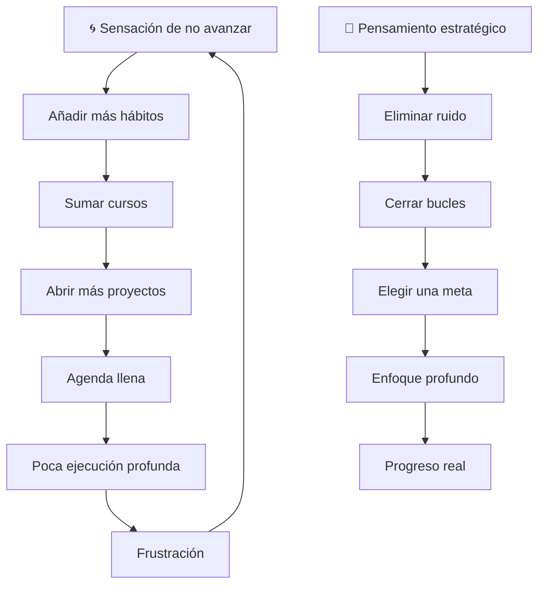
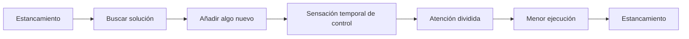
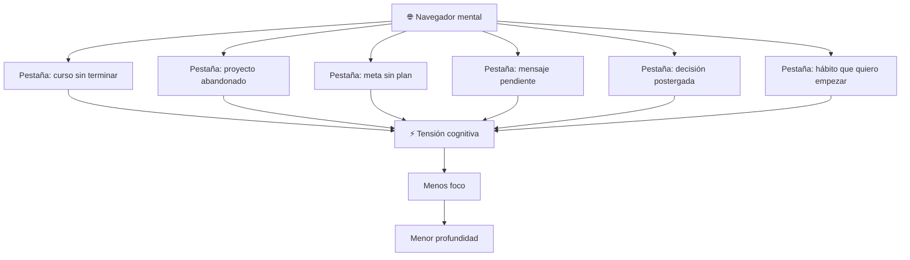
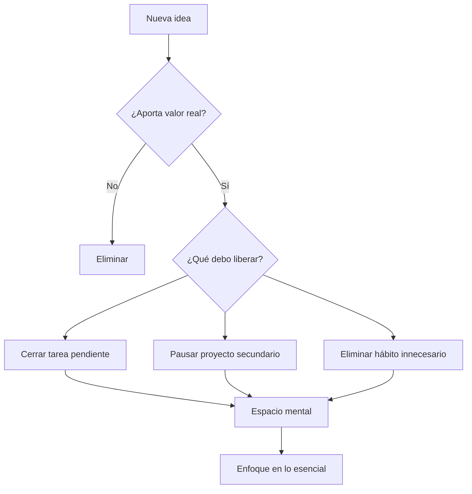
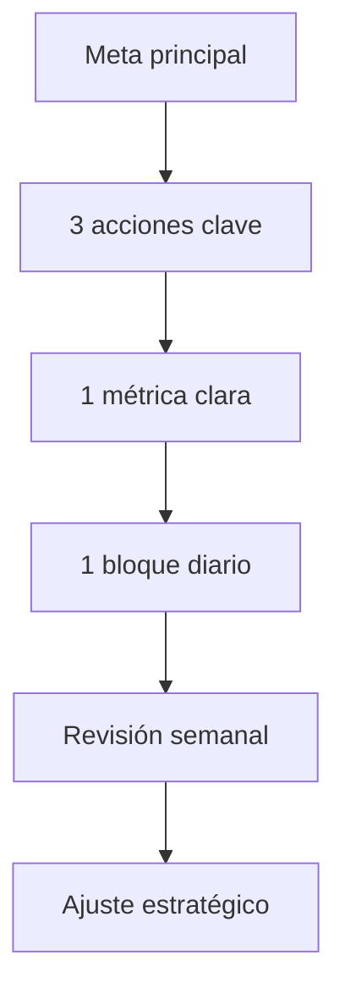
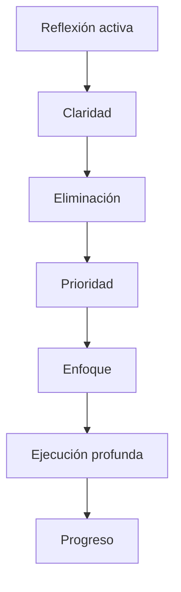
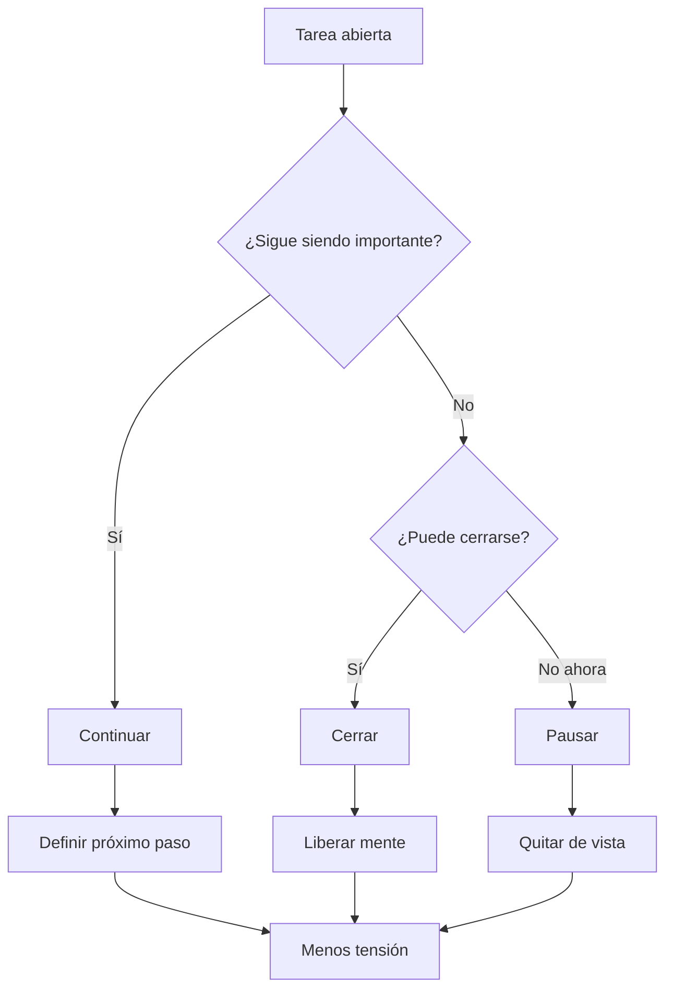
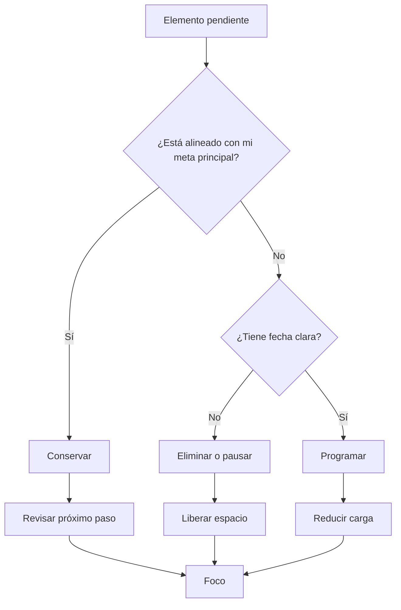
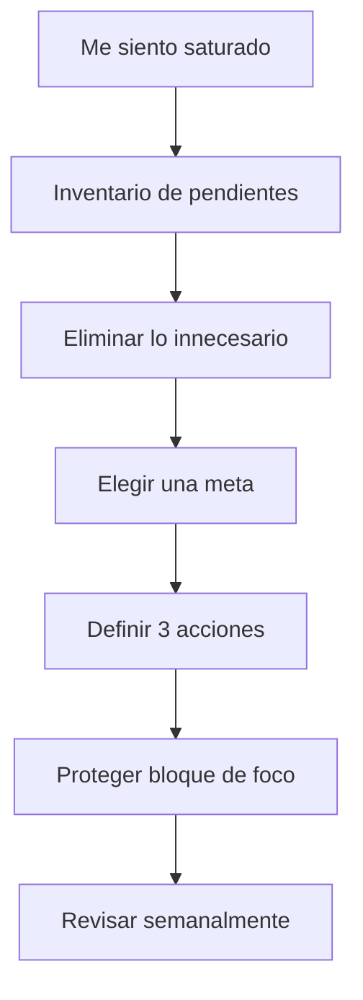
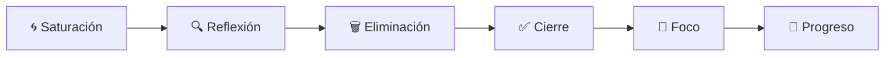

## ¿Qué vas a aprender

En este contenido construirás el sistema operativo personal para lograr resultados sostenibles:

- La psicología detrás de los hábitos y cómo rediseñar tu comportamiento
- Sistemas de disciplina que no dependen de la motivación
- Gestión del tiempo, foco profundo y eliminación de distracciones
- Mentalidad de crecimiento y reestructuración de creencias limitantes
- Prácticas concretas, rutinas y métricas de progreso


# Master Class: Menos Pestañas Mentales, Más Progreso Real 🧠🎯

> 💡 **En esta master class aprenderás**: por qué acumular hábitos, cursos, proyectos y técnicas puede crear la sensación de avance sin generar resultados reales. Usaremos el Efecto Zeigarnik, la analogía del navegador con demasiadas pestañas y un sistema de pensamiento estratégico para cerrar bucles, eliminar ruido y enfocarte en menos tareas con mayor profundidad.

> ⚠️ **Aclaración práctica**: esta guía no busca que hagas menos por comodidad, sino que hagas menos por estrategia. El objetivo es reemplazar ocupación dispersa por ejecución clara.

---

## 🌐 MAPA DEL PROBLEMA: SATURACIÓN VS PROGRESO



| Mente saturada | Mente estratégica |
|---|---|
| Añade más cuando se siente estancada | Elimina antes de agregar |
| Tiene muchas tareas abiertas | Tiene pocos compromisos claros |
| Confunde ocupación con avance | Mide ejecución real |
| Cambia de técnica cada semana | Sostiene una dirección |
| Vive en alerta mental | Trabaja con profundidad |

> [!IMPORTANT]
> El problema no es tener muchas ideas. El problema es tratar todas como compromisos urgentes. Una mente estratégica no pregunta solo “¿qué puedo hacer?”, también pregunta “¿qué debo dejar de hacer?”

---

## PARTE 1: EL PROBLEMA DE LA SATURACIÓN 🌀

### 1.1 Por qué añadimos más cuando no avanzamos

Cuando sentimos que no progresamos, el impulso común es sumar:

```text
❌ Más hábitos
❌ Más cursos
❌ Más técnicas
❌ Más proyectos
❌ Más herramientas
❌ Más metas
```

Pero si no existe foco, añadir más no mejora el resultado. Solo aumenta la carga mental.



### 1.2 Síntomas de saturación

| Síntoma | Qué significa | Corrección |
|---|---|---|
| 📚 Compras cursos pero no los terminas | Consumes información para sentir progreso | Termina uno antes de abrir otro |
| 📌 Tienes muchas metas abiertas | Tu energía está fragmentada | Elige una meta principal |
| 🧩 Cambias de método cada semana | Buscas certeza externa | Sostén el método el tiempo suficiente |
| 📱 Revisas todo el día | Tu atención está reactiva | Bloquea ventanas de foco |
| 😩 Terminas cansado pero sin avanzar | Estás ocupado, no enfocado | Prioriza tareas de alto impacto |
| 📝 Haces listas infinitas | Tu mente intenta descargar tensión | Cierra, pausa o elimina pendientes |

> [!NOTE]
> La saturación no siempre se ve como desorden. A veces se ve como una agenda perfecta, llena de tareas productivas, pero sin una sola acción realmente decisiva.

---

## PARTE 2: NEUROCIENCIA DEL FOCO — EL EFECTO ZEIGARNIK 🧠

### 2.1 Qué es el Efecto Zeigarnik

El **Efecto Zeigarnik** describe una tendencia del cerebro a recordar mejor las tareas incompletas que las completadas. En otras palabras: lo que queda abierto sigue generando tensión mental.

```text
Tarea incompleta = pestaña mental abierta
Muchas tareas incompletas = navegador saturado
Navegador saturado = menos memoria disponible para pensar
```

### 2.2 Analogía del navegador mental



### 2.3 Tensión productiva vs tensión excesiva

| Tipo de tensión | Función | Ejemplo |
|---|---|---|
| ✅ Tensión productiva | Mantiene compromiso con una meta importante | “Necesito terminar este capítulo” |
| ⚠️ Tensión excesiva | Sobrecarga la mente con demasiados pendientes | “Tengo 12 proyectos abiertos” |
| 🔴 Tensión crónica | Genera ansiedad, evitación y bloqueo | “No sé por dónde empezar” |

> [!IMPORTANT]
> Tener una tarea importante abierta puede ser útil. Tener diez, veinte o cincuenta tareas abiertas no es productividad: es ruido mental.

---

## PARTE 3: PENSAMIENTO ESTRATÉGICO — ANTES DE AÑADIR, ELIMINA 🔍

### 3.1 La pregunta estratégica

Antes de sumar un nuevo hábito, curso o proyecto, haz esta pregunta:

```text
¿Qué debo cerrar, pausar o eliminar para hacerle espacio a esto?
```

| Pregunta común | Pregunta estratégica |
|---|---|
| “¿Qué más puedo hacer?” | “¿Qué puedo dejar de hacer?” |
| “¿Qué curso compro?” | “¿Qué habilidad necesito terminar?” |
| “¿Qué meta agrego?” | “¿Qué meta merece todo mi foco?” |
| “¿Qué herramienta uso?” | “¿Qué fricción elimina esta herramienta?” |

### 3.2 Sistema de sustitución estratégica



### 3.3 Matriz de valor vs costo mental

| Elemento | Valor real | Costo mental | Decisión |
|---|---:|---:|---|
| Curso esencial para tu meta | Alto | Medio | Continuar |
| Proyecto abandonado hace meses | Bajo | Alto | Cerrar o pausar |
| Hábito que no usas | Bajo | Medio | Eliminar |
| Herramienta que no simplificas | Bajo | Alto | Reemplazar |
| Meta prioritaria | Alto | Medio | Enfocar |
| Distracción disfrazada de productividad | Bajo | Alto | Eliminar |

> [!TIP]
> No todo lo interesante merece entrar. Si algo no sostiene tu objetivo principal, probablemente está ocupando espacio que necesita algo más importante.

---

## PARTE 4: UNA META, TRES ACCIONES, UNA MÉTRICA 🎯

### 4.1 El poder de enfocarte en una sola cosa

Avanzar en diez cosas de forma superficial suele ser menos efectivo que avanzar en una cosa con profundidad.

```text
❌ 10 metas × 5% de energía = avance invisible
✅ 1 meta × 80% de energía = progreso real
```

### 4.2 Sistema de foco único



| Elemento | Pregunta | Ejemplo |
|---|---|---|
| **Meta principal** | ¿Qué resultado cambia más mi vida ahora? | Terminar curso y aplicar proyecto final |
| **3 acciones clave** | ¿Qué acciones mueven esa meta? | Estudiar, practicar, publicar avance |
| **1 métrica** | ¿Cómo sé que avanzo? | 5 horas semanales de práctica |
| **Bloque diario** | ¿Cuándo lo hago? | 60 minutos antes del celular |
| **Revisión semanal** | ¿Qué aprendí y qué ajusto? | Revisar progreso cada domingo |

### 4.3 Enfoque profundo vs avance superficial

| Enfoque profundo | Avance superficial |
|---|---|
| Una meta clara | Muchas metas vagas |
| Bloques protegidos | Atención interrumpida |
| Menos distracciones | Más estímulos |
| Revisión semanal | Impulsos diarios |
| Cierre de bucles | Tareas abiertas |
| Progreso medible | Sensación de movimiento |

> [!IMPORTANT]
> El foco no significa abandonar todos tus sueños. Significa elegir qué sueño merece tu energía principal durante este ciclo.

---

## PARTE 5: REFLEXIÓN ACTIVA — PENSAR PARA DEJAR DE REACCIONAR 🧭

### 5.1 Por qué pensar estratégicamente es una acción

Muchas personas confunden pensar con perder tiempo. Pero pensar estratégicamente evita meses de ejecución en la dirección equivocada.



### 5.2 Preguntas clave de reflexión

| Pregunta | Para qué sirve |
|---|---|
| ¿Qué aporta valor real a mi objetivo de largo plazo? | Filtra lo esencial |
| ¿Qué es ruido disfrazado de productividad? | Detecta ocupación inútil |
| ¿Qué debo cerrar antes de abrir algo nuevo? | Reduce tensión mental |
| ¿Qué tarea tiene mayor impacto si la termino? | Prioriza |
| ¿Qué estoy haciendo por miedo a no hacer nada? | Identifica evitación |
| ¿Qué puedo simplificar sin perder calidad? | Reduce fricción |

### 5.3 Plantilla de revisión semanal

```text
📅 Revisión estratégica semanal

1. ¿Qué avancé realmente?
2. ¿Qué tarea sigue abierta y me consume energía?
3. ¿Qué puedo cerrar esta semana?
4. ¿Qué puedo pausar sin culpa?
5. ¿Qué debo eliminar?
6. ¿Cuál es mi única meta principal?
7. ¿Cuáles son mis 3 acciones clave?
8. ¿Qué bloque de enfoque protegeré?
```

> [!TIP]
> Una revisión semanal de 20 minutos puede ahorrarte horas de trabajo innecesario.

---

## PARTE 6: CIERRE DE BUCLES — EL ANTÍDOTO A LAS PESTAÑAS MENTALES ✅

### 6.1 Las cuatro decisiones posibles

No toda tarea abierta necesita ser terminada. Pero toda tarea abierta necesita una decisión.



### 6.2 Tabla de decisiones

| Decisión | Cuándo usarla | Ejemplo |
|---|---|---|
| ✅ **Cerrar** | Ya no aporta valor o ya cumplió su función | Cerrar curso que no usarás |
| ▶️ **Continuar** | Sigue siendo importante y tiene próximo paso | Terminar proyecto final |
| ⏸️ **Pausar** | Es valioso, pero no es prioridad ahora | Guardar idea para otro trimestre |
| 🗑️ **Eliminar** | No tiene impacto real | Borrar lista de tareas fantasmas |
| 🤝 **Delegar** | Debe hacerse, pero no por ti | Pasar tarea operativa a alguien más |

### 6.3 Regla de cierre

```text
Si una tarea no tiene próximo paso claro, no está pendiente:
está mal definida.
```

| Tarea mal definida | Tarea cerrable |
|---|---|
| “Organizar mi vida” | “Domingo 10:00: planificar semana” |
| “Aprender marketing” | “Terminar módulo 3 del curso” |
| “Ponerme en forma” | “Caminar 30 minutos lunes, miércoles y viernes” |
| “Crear negocio” | “Escribir una oferta en una página” |

> [!IMPORTANT]
> La mente se calma cuando una tarea tiene una decisión. No siempre necesitas terminarla; necesitas dejar de cargarla como una nube sin forma.

---

## PARTE 7: PLAN DE 7 DÍAS PARA DESATURAR LA MENTE 🗓️

### 7.1 Semana de limpieza mental

| Día | Enfoque | Acción | Resultado |
|---|---|---|---|
| **Día 1** | 🧹 Inventario | Escribe todas las tareas abiertas | Lista visible |
| **Día 2** | 🗑️ Eliminar | Quita lo que no aporta valor | Menos ruido |
| **Día 3** | 🎯 Meta principal | Elige una prioridad | Claridad |
| **Día 4** | 🧱 Bloque de foco | 60-90 minutos sin distracciones | Ejecución profunda |
| **Día 5** | 📵 Distracciones | Elimina una fuga de atención | Más control |
| **Día 6** | ✅ Cerrar bucle | Termina una tarea pendiente | Liberación mental |
| **Día 7** | 🧭 Revisión | Planifica la semana estratégica | Sistema estable |

### 7.2 Inventario de tareas abiertas

```text
📦 Inventario mental

1. Curso pendiente:
2. Proyecto pendiente:
3. Decisión pendiente:
4. Mensaje pendiente:
5. Hábito que quiero iniciar:
6. Meta que me presiona:
7. Compromiso que no quiero mantener:
```

### 7.3 Criterio de eliminación



---

## PARTE 8: I DO / WE DO / YOU DO — EJERCICIOS PROGRESIVOS 🛠️

### 8.1 I Do — Ejemplo guiado de limpieza de pestañas mentales

**Escenario:** tienes 5 cosas abiertas:

```text
1. Curso de ventas sin terminar
2. Idea de negocio sin validar
3. Gimnasio pendiente
4. Redes sociales sin plan
5. Proyecto personal abandonado
```

#### Paso 1: Clasificar

| Tarea | Estado | Decisión |
|---|---|---|
| Curso de ventas | Valioso pero incompleto | Continuar |
| Idea de negocio | Interesante pero no prioritaria | Pausar |
| Gimnasio | Importante para energía | Mantener mínimo |
| Redes sociales | Sin estrategia clara | Eliminar por 14 días |
| Proyecto abandonado | Sin próximo paso | Cerrar o redefinir |

#### Paso 2: Elegir foco

```text
Meta principal:
Terminar el módulo final del curso de ventas y aplicar una práctica real.

3 acciones clave:
1. Ver una clase diaria.
2. Tomar notas accionables.
3. Aplicar una tarea del curso.

Métrica:
5 sesiones de 45 minutos por semana.
```

#### Paso 3: Cerrar una pestaña

```text
Pestaña cerrada:
Redes sociales sin plan.

Decisión:
Pausar publicación durante 14 días y eliminar apps del celular.

Motivo:
Liberar atención para el curso.
```

### 8.2 We Do — Diseñar una semana con menos carga

Completa:

| Pregunta | Respuesta |
|---|---|
| ¿Cuál es tu única meta principal esta semana? |  |
| ¿Qué 3 acciones la mueven? |  |
| ¿Qué tarea puedes cerrar? |  |
| ¿Qué proyecto puedes pausar? |  |
| ¿Qué distracción puedes eliminar? |  |
| ¿Qué bloque de foco protegerás? |  |

### 8.3 You Do — Sistema personal de foco estratégico

```text
Mi meta principal durante los próximos 30 días:

Las 3 acciones que la sostienen:
1.
2.
3.

Mi métrica de progreso:

Mis tareas abiertas a cerrar:
1.
2.
3.

Mis distracciones principales:
1.
2.

Mi bloque diario de enfoque:

Mi revisión semanal será el día:
```

> [!TIP]
> Si no puedes escribirlo en una página, probablemente todavía no está claro.

---

## PARTE 9: ERRORES COMUNES Y CÓMO CORREGIRLOS 🚧

| Error | Síntoma | Corrección |
|---|---|---|
| 🌀 Querer hacerlo todo | Agenda llena y avance bajo | Elegir una meta principal |
| 📚 Coleccionar cursos | Sensación de progreso sin aplicación | Terminar antes de comprar otro |
| 📌 Abrir proyectos nuevos | Emoción inicial, abandono rápido | Cerrar o pausar antes de abrir |
| 🧠 No revisar pendientes | Cansancio mental constante | Hacer inventario semanal |
| ⏱️ Medir horas ocupadas | “Trabajé mucho” pero no avanzaste | Medir entregables |
| 📱 Confundir urgencia con importancia | Reaccionas todo el día | Bloquear foco profundo |
| 🗑️ No saber eliminar | Todo parece necesario | Usar criterio de valor |
| 😞 Culparte por pausar | Crees que pausar es fracasar | Pausar es estrategia |

### Antídoto rápido



> [!IMPORTANT]
> No necesitas más fuerza de voluntad. Necesitas menos carga mental y una dirección más clara.

---

## PARTE 10: CHECKLIST FINAL ✅

### Checklist de desaturación mental

- [ ] Escribí todas mis tareas abiertas.
- [ ] Clasifiqué cada tarea como continuar, cerrar, pausar o eliminar.
- [ ] Cerré al menos una tarea pendiente.
- [ ] Pausé al menos un proyecto no prioritario.
- [ ] Eliminé una distracción que no aporta valor.
- [ ] Definí una meta principal.
- [ ] Definí tres acciones clave.
- [ ] Protegí un bloque diario de enfoque.

### Checklist de foco profundo

- [ ] Sé cuál es mi prioridad principal.
- [ ] Sé qué no haré durante este ciclo.
- [ ] Tengo una métrica simple.
- [ ] Tengo un horario protegido.
- [ ] Tengo una revisión semanal.
- [ ] No añado nuevas tareas sin eliminar algo antes.

### Checklist de pensamiento estratégico

- [ ] Antes de añadir algo nuevo, pregunto qué puedo quitar.
- [ ] Diferencio ocupación de progreso.
- [ ] Cierro bucles en lugar de acumularlos.
- [ ] Priorizo impacto sobre cantidad.
- [ ] Uso reflexión activa para tomar mejores decisiones.

---

## PARTE 11: PREGUNTAS DE VERIFICACIÓN 📝

### Sobre saturación

1. **Identifica:** ¿Qué estás haciendo actualmente que te mantiene ocupado pero no te acerca a tu meta principal?

2. **Analiza:** ¿Por qué añadir más cursos o hábitos puede empeorar el problema cuando ya estás saturado?

### Sobre Efecto Zeigarnik

3. **Explica:** ¿Cómo funciona la analogía del navegador con demasiadas pestañas abiertas?

4. **Aplica:** Nombra tres tareas abiertas que estén consumiendo energía mental.

### Sobre pensamiento estratégico

5. **Diseña:** Antes de agregar un nuevo hábito, ¿qué tarea cerrarías para hacerle espacio?

6. **Evalúa:** ¿Qué diferencia hay entre pausar un proyecto y abandonar un proyecto?

### Sobre foco

7. **Aplica:** Elige una meta principal para los próximos 30 días. ¿Cuáles serían tus tres acciones clave?

8. **Reflexiona:** ¿Qué distracción necesitas eliminar para proteger tu enfoque?

### Pregunta integradora

9. **Sistema:** Diseña una semana con una sola meta principal, tres acciones, una métrica y una revisión estratégica.

---

## PARTE 12: RESUMEN EJECUTIVO 🧠

| Pregunta | Respuesta |
|---|---|
| **¿Qué?** | Una guía para salir de la saturación mental usando eliminación, cierre de bucles y foco estratégico. |
| **¿Cómo?** | Inventariando tareas abiertas, cerrando lo innecesario, eligiendo una meta y protegiendo bloques de enfoque. |
| **¿Para qué?** | Para avanzar con menos carga mental, más claridad y mayor profundidad. |
| **¿Cuándo?** | Cada vez que sientas que tienes muchas cosas abiertas y poco avance real. |
| **¿Por qué?** | Porque el cerebro consume energía en tareas incompletas y no puede enfocarse bien cuando está saturado. |

```text
Fórmula final:

Menos tareas abiertas
+ Una meta clara
+ Tres acciones clave
+ Bloques de enfoque profundo
= Progreso real
```

---

## PARTE 13: GLOSARIO RÁPIDO 📖

| Término | Definición |
|---|---|
| **Efecto Zeigarnik** | Tendencia del cerebro a recordar y mantener activas las tareas incompletas. |
| **Tensión cognitiva** | Carga mental generada por pendientes, decisiones y tareas abiertas. |
| **Foco estratégico** | Capacidad de concentrar energía en lo que más aporta al objetivo principal. |
| **Tarea abierta** | Cualquier pendiente sin cerrar, pausar, delegar o eliminar. |
| **Saturación mental** | Estado de sobrecarga causado por demasiados estímulos y compromisos. |
| **Eliminación estratégica** | Quitar tareas, hábitos o proyectos que no sostienen la meta principal. |
| **Prioridad** | Lo que merece tu energía antes que lo demás. |
| **Ejecución profunda** | Trabajo concentrado, sin interrupciones, orientado a avanzar de verdad. |
| **Cierre de bucles** | Decidir qué hacer con cada pendiente: continuar, cerrar, pausar o eliminar. |
| **Reflexión activa** | Tiempo deliberado para pensar qué aporta valor y qué no. |

---

## 🏁 CIERRE: NO HAGAS MENOS POR MIEDO, HAZ MENOS POR ESTRATEGIA

La productividad real no empieza con más herramientas, más cursos o más metas. Empieza con una decisión incómoda:

```text
No todo lo que quiero hacer merece mi energía ahora.
```



> 🔥 **Regla final:** antes de abrir una nueva pestaña mental, cierra una antigua. Antes de sumar una nueva meta, define qué merece tu foco principal. Antes de intentar hacer más, aprende a avanzar mejor.
