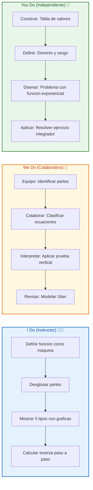
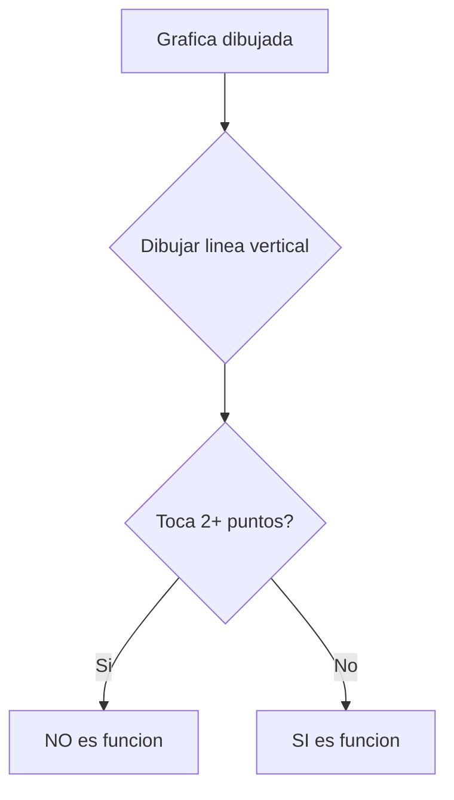
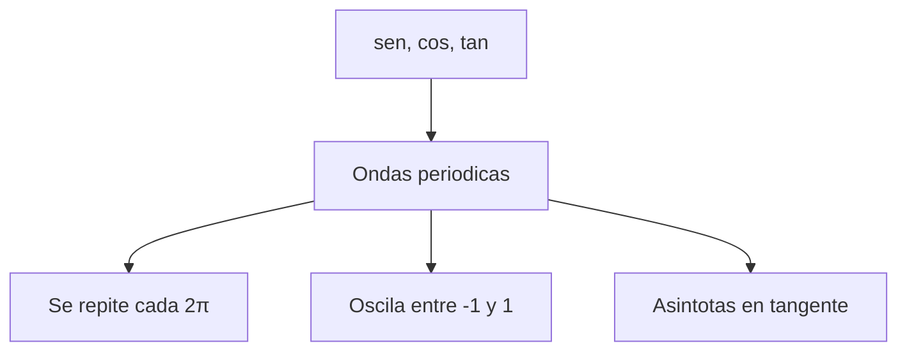

# MASTERCLASS: Funciones Matemáticas — La Máquina que Conecta Entradas con Salidas 🏭🔢

## INTRODUCCIÓN: POR QUÉ ESTE MASTERCLASS ES DIFERENTE 🚀

Las funciones matemáticas son el **lenguaje universal de la dependencia**. Si algo depende de otra cosa, hay una función detrás: el precio depende de los meses, la altura depende del tiempo, la ganancia depende de la cantidad vendida. Sin funciones, no tendrías álgebra, cálculo, física, economía ni programación moderna.

Este masterclass propone otro camino: en vez de memorizar `f(x) = mx + b` como una fórmula fría, vas a entenderla como una **máquina real**: metes un número, pasa un proceso, sale un resultado 🏭. Si entiendes esa idea, los 5 tipos de funciones, sus gráficas, sus aplicaciones en Spotify o Uber, y hasta las funciones en código, serán evidentes.

La meta no es resolver exámenes rápido. La meta es **construir intuición** para reconocer una función en cualquier contexto: una ecuación, una tabla, una gráfica o un problema de la vida real.

> **Objetivo de Aprendizaje** 🎯 — Al final de esta guía, podrás definir qué es una función, identificar sus 4 partes, reconocer los 5 tipos más comunes por su gráfica, aplicar la prueba de la línea vertical, calcular funciones inversas y modelar situaciones reales con fórmulas.

> **Advertencia educativa** ⚠️ — Este contenido es formativo. Las funciones son la base de modelos matemáticos que se usan en ciencia e ingeniería, pero toda aplicación real requiere validación contextual.

---

## MAPA DEL MASTERCLASS 🗺️

```mermaid
flowchart LR
    A[Definicion] --> B[Partes]
    B --> C[Prueba Vertical]
    C --> D[5 Tipos]
    D --> E[Representacion]
    E --> F[Inversa]
    F --> G[Vida Real]
    G --> H[Errores]
    H --> I[Ejercicios]

    subgraph CONCEPTOS ['Conceptos Clave']
        A1[Entrada = x]
        A2[Salida = f(x)]
        A3[Dominio]
        A4[Rango]
    end

    A1 --> B
    A2 --> B
    A3 --> D
    A4 --> D
```

| Fase | Pregunta que responde | Output principal |
|------|-----------------------|------------------|
| **Definición** | ¿Qué es una función? | Regla entrada → salida única |
| **Partes** | ¿Cómo se desarma? | x, f(x), dominio, rango |
| **Prueba Vertical** | ¿Esta gráfica es función? | Criterio visual |
| **5 Tipos** | ¿Cuáles son las familias? | Lineal, cuadrática, exponencial, racional, trigonométrica |
| **Representación** | ¿Cómo se muestra? | Fórmula, tabla, gráfica, palabras |
| **Inversa** | ¿Cómo se deshace? | f⁻¹(x) |
| **Vida Real** | ¿Dónde aparecen? | Spotify, Uber, redes |
| **Errores** | ¿Qué fallos evitar? | Lista de trampas |
| **Ejercicios** | ¿Lo domino? | I Do / We Do / You Do |



---

## PARTE 1: ¿QUÉ ES UNA FUNCIÓN? 🏭

### 1.1 Principio Central 💡

Una función matemática es una **regla de correspondencia** entre dos conjuntos: el conjunto A (entradas) y el conjunto B (salidas). La regla dice que a cada elemento del conjunto A le corresponde **exactamente un** elemento del conjunto B. Si a un valor de entrada le pudieran corresponder dos salidas distintas, ya no sería función.

La forma más simple de visualizarla es como una **máquina** 🏭: metes una entrada por un lado, dentro pasa un proceso fijo, y por el otro lado sale un resultado. Si metes el mismo número dos veces, te tiene que devolver el mismo resultado las dos veces. Esa es la garantía de una función.

```mermaid
flowchart LR
    A[Entrada x] --> B[Proceso f]
    B --> C[Salida f(x)]
```

> **La frase del profe** 🌟 — *"Una función es una máquina de confianza: misma entrada, misma salida. Sin sorpresas, sin excepciones."*

### 1.2 Ejemplo paso a paso 🔧

La regla **"súmale 2 al número que recibes"** es una función. Se escribe `f(x) = x + 2`.

| Entrada x | Proceso | Salida f(x) |
|-----------|---------|-------------|
| 1 | 1 + 2 | 3 |
| 5 | 5 + 2 | 7 |
| -3 | -3 + 2 | -1 |

Cada entrada tiene una sola salida. Ese resultado se llama la **imagen** del valor de entrada.

> **Tip** 💡 — La letra de la función (f, g, h) es solo un nombre. Lo importante es la regla: `g(x) = x + 2` hace exactamente lo mismo que `f(x) = x + 2`.

---

## PARTE 2: LAS 4 PARTES DE UNA FUNCIÓN 🧩

### 2.1 Componentes que debes reconocer

| Parte | Símbolo | Rol | Analogía |
|-------|---------|-----|----------|
| **Variable independiente** | x, t, p, n | Lo que metes a la función | El número que eliges |
| **Variable dependiente** | y o f(x) | Lo que sale | El resultado que depende de x |
| **Notación f(x)** | f(x) | "El resultado de aplicar f a x" | La etiqueta de la salida |
| **Dominio** | Dom(f) | Todos los valores posibles de entrada | Lo que puedes meter sin romperla |
| **Rango** | Ran(f) | Todos los valores posibles de salida | Lo que puede salir |

> **Dato curioso** 🧠 — La notación `f(x)` la introdujo Leonhard Euler en 1734. Antes de él, las funciones se escribían con frases enteras. La elegancia del `f(x)` hizo que todo el mundo lo adoptara.

### 2.2 Dominio y rango con ejemplo

Para `f(x) = x²`:

- **Dominio**: todos los números reales (puedes elevar al cuadrado cualquier número).
- **Rango**: solo números mayores o iguales a 0 (porque ningún cuadrado da negativo).

```mermaid
flowchart TD
    A[Dominio: R] --> B[f(x) = x²]
    B --> C[Rango: [0, ∞)]
```

### 2.3 ¿f(x) significa f multiplicado por x? No. ❌

Aunque los paréntesis se parecen a una multiplicación, `f(x)` significa **"el resultado de aplicar la función f al valor x"**. Es notación de aplicación, no de producto.

| Expresión | Significado correcto |
|-----------|----------------------|
| `f(3)` | Sustituye x = 3 en la fórmula |
| `f(x)` | Lee "efe de x", no "f por x" |
| `f(x + 1)` | Suma 1 a x, luego aplica la función |

### 2.4 We Do — Identificar partes en funciones reales 🤝

| Función | Variable independiente | Variable dependiente | Dominio implícito |
|---------|------------------------|----------------------|-------------------|
| `f(x) = 3x + 1` | x | f(x) | Todos los reales |
| `v(t) = 50 - 4.9t²` | t (tiempo) | v(t) (velocidad) | t ≥ 0 |
| `P(p) = 100 - 2p` | p (precio) | P(p) (cantidad) | p ≥ 0 |

> **Tip** 💡 — En física verás `v(t)`, en economía `Q(p)`, en biología `N(t)`. La letra no cambia el concepto: sigue siendo una regla que asigna una salida única a cada entrada.

---

## PARTE 3: FUNCIÓN VS RELACIÓN — LA PRUEBA DE LA LÍNEA VERTICAL 📏

### 3.1 La diferencia clave

Toda función es una relación, pero no toda relación es una función. La diferencia está en el **"una sola salida"**:

- Una **relación** simplemente conecta valores de un conjunto con valores de otro.
- Una **función** añade una restricción: a cada entrada le toca una salida única.

### 3.2 La prueba de la línea vertical

Es el truco visual más usado para identificar si una gráfica representa una función. Imagina una línea vertical recorriendo toda la gráfica de izquierda a derecha:

- ✅ Si en algún momento la línea vertical toca la curva en **dos o más puntos** a la vez, la gráfica **NO** es una función.
- ✅ Si siempre la toca en **uno solo** (o en ninguno), **SÍ** lo es.



### 3.3 Ejemplos claros

| Gráfica | ¿Función? | Por qué |
|---------|-----------|---------|
| `y = x²` (parábola) | ✅ Sí | Línea vertical la toca en 1 punto |
| `x² + y² = 4` (círculo) | ❌ No | Línea vertical lo cruza en 2 puntos |
| `y = √x` | ✅ Sí | Línea vertical la toca en 1 punto (solo rama positiva) |
| `x = 5` (línea vertical) | ❌ No | Toda la línea es una línea vertical |

### 3.4 You Do — Aplica la prueba 💪

Clasifica cada ecuación:

1. `y = 2x + 3` → ¿función?
2. `x² + y² = 9` → ¿función?
3. `y = |x|` → ¿función?
4. `x = y²` → ¿función?

> **Tip** 💡 — Si puedes despejar y como expresión única de x, probablemente sea función. Si al despejar te sale ±, no lo es.

---

## PARTE 4: LOS 5 TIPOS DE FUNCIONES CON GRÁFICAS 📈📉

Cinco familias de funciones aparecen una y otra vez en cursos escolares y universitarios. Su gráfica es la mejor forma de reconocerlas a primera vista.

### 4.1 Función Lineal 📏

**Fórmula**: `f(x) = mx + b`, donde m es la pendiente y b el valor en el que la recta cruza el eje y.

**Gráfica**: una recta. Si `m > 0`, sube de izquierda a derecha; si `m < 0`, baja; si `m = 0`, queda horizontal.

| Característica | Valor |
|----------------|-------|
| Corte con eje y | `(0, b)` |
| Corte con eje x | `(-b/m, 0)` |
| Pendiente | `m` |

**Ejemplo**: `f(x) = 2x + 3`. Para x = 0 vale 3, para x = 1 vale 5, para x = 2 vale 7. Aumenta de 2 en 2 cada vez que x sube en 1.

> **Analogía** 🚗 — El precio de un viaje en Uber con tarifa base: pagas 20 pesos por arrancar, más 5 pesos por cada km. `f(d) = 20 + 5d`.

```mermaid
flowchart TD
    A[f(x) = mx + b] --> B[Recta]
    B --> C{m > 0}
    C -->|Si| D[Sube]
    C -->|No| E[Baja]
    B --> F[Corte en (0,b)]
```

### 4.2 Función Cuadrática 🥾

**Fórmula**: `f(x) = ax² + bx + c`, con `a ≠ 0`.

**Gráfica**: una parábola simétrica. Si `a > 0` abre hacia arriba (forma de U); si `a < 0` abre hacia abajo (U invertida). El vértice es el punto más bajo o más alto, y el eje de simetría pasa verticalmente por él.

| Característica | Valor |
|----------------|-------|
| Vértice | Punto extremo |
| Eje de simetría | `x = -b/(2a)` |
| Corte con eje y | `(0, c)` |

**Ejemplo**: `f(x) = x²` da 0 en x = 0, 1 en x = ±1, 4 en x = ±2.

> **Analogía** 🏀 — La trayectoria de una pelota de básquet: sube hasta el vértice y baja simétricamente.

```mermaid
flowchart TD
    A[f(x) = ax² + bx + c] --> B[Parabola]
    B --> C{a > 0}
    C -->|Si| D[Abre hacia arriba U]
    C -->|No| E[Abre hacia abajo U invertida]
    B --> F[Vertice = punto extremo]
```

### 4.3 Función Exponencial 🚀

**Fórmula**: `f(x) = aˣ`, con `a > 0` y `a ≠ 1`.

**Gráfica**: una curva que crece a velocidad explosiva cuando `a > 1`, o decrece a velocidad explosiva cuando `0 < a < 1`.

| Característica | Valor |
|----------------|-------|
| Punto siempre | `(0, 1)` |
| Asíntota horizontal | `y = 0` |
| Rango | `(0, ∞)` |

**Ejemplo**: si tus seguidores se duplican cada semana, `f(s) = 100 · 2ˢ`. De 100 a 200 en una semana, a 400 en dos, a 800 en tres... De pronto estás en 6,400 en seis semanas.

> **Analogía** 📱 — El crecimiento de seguidores en redes al inicio: parece lento y de pronto explota.

```mermaid
flowchart TD
    A[f(x) = aˣ] --> B[Curva acelerada]
    B --> C{a > 1}
    C -->|Si| D[Crecimiento explosivo]
    C -->|No| E[Decaimiento explosivo]
    B --> F[Siempre pasa por (0,1)]
    B --> G[Asintota en y = 0]
```

### 4.4 Función Racional 🍕

**Fórmula**: `f(x) = P(x) / Q(x)`, donde P y Q son polinomios y `Q(x) ≠ 0`.

**Gráfica**: el caso más simple es `f(x) = 1/x`, cuya gráfica es una hipérbola con dos ramas en los cuadrantes I y III. Tiene una asíntota vertical en `x = 0` y una asíntota horizontal en `y = 0`.

| Característica | Valor |
|----------------|-------|
| Asíntota vertical | `x = 0` (o donde Q(x) = 0) |
| Asíntota horizontal | `y = 0` |
| Dominio | Reales excepto donde Q(x) = 0 |

**Ejemplo**: `f(x) = 1/x` está definida para todos los reales excepto x = 0. Para x = 1 vale 1, para x = 2 vale 0.5, para x = 0.5 vale 2.

> **Analogía** 🍕 — Dividir una pizza entre amigos: si nadie la come, cada uno recibe infinito (asíntota). Si son 2 amigos, cada uno recibe 1/2.

```mermaid
flowchart TD
    A[f(x) = P(x)/Q(x)] --> B[Hiperbola]
    B --> C[Asintota vertical]
    B --> D[Asintota horizontal]
    B --> E[Dos ramas]
    E --> F[Cuadrante I]
    E --> G[Cuadrante III]
```

### 4.5 Función Trigonométrica 🌊

**Fórmula**: las más comunes son `f(x) = sen(x)`, `f(x) = cos(x)` y `f(x) = tan(x)`.

**Gráfica**: ondas periódicas que se repiten cada cierto intervalo. El seno y el coseno oscilan entre −1 y 1 con período `2π`; el coseno es el seno desplazado `π/2` hacia la izquierda. La tangente tiene asíntotas verticales en `π/2 + kπ`.

| Característica | sen(x) | cos(x) | tan(x) |
|----------------|--------|--------|--------|
| Período | `2π` | `2π` | `π` |
| Rango | `[-1, 1]` | `[-1, 1]` | `(-∞, ∞)` |
| Punto inicial | `(0, 0)` | `(0, 1)` | `(0, 0)` |

**Ejemplo**: `sen(0) = 0`, `sen(π/2) = 1`, `sen(π) = 0`, `sen(3π/2) = -1`.

> **Analogía** 🔊 — Las ondas sonoras: suben y bajan de forma periódica, igual que el seno.



### 4.6 Tabla comparativa de los 5 tipos

| Tipo | Fórmula | Forma de gráfica | Cómo reconocerla |
|------|---------|------------------|------------------|
| **Lineal** | `f(x) = mx + b` | Recta inclinada | Crece o decrece a ritmo constante |
| **Cuadrática** | `f(x) = ax² + bx + c` | Parábola (U o U invertida) | Sube y baja con un punto extremo |
| **Exponencial** | `f(x) = aˣ` | Curva acelerada | Crece (o decae) cada vez más rápido |
| **Racional** | `f(x) = P(x)/Q(x)` | Hipérbola con asíntotas | Tiene valores prohibidos en el dominio |
| **Trigonométrica** | sen, cos, tan | Onda periódica | Se repite cada cierto intervalo |

---

## PARTE 5: 4 FORMAS DE REPRESENTAR UNA FUNCIÓN 🎨

### 5.1 Misma función, 4 disfraces

Una función puede mostrarse de cuatro formas distintas, y todas describen exactamente lo mismo. Saber moverse entre ellas es parte de dominar funciones.

| Forma | Ejemplo | Cuándo usarla |
|-------|---------|---------------|
| **Fórmula algebraica** | `f(x) = 2x + 1` | Calcular valores específicos |
| **Tabla de valores** | `(0,1), (1,3), (2,5)` | Ver patrones punto por punto |
| **Gráfica** | Recta en el plano | Detectar tendencias de un vistazo |
| **Palabras** | "Multiplica por 2 y suma 1" | Conectar con problemas reales |

### 5.2 I Do — Transformar una función en 4 formas 👨‍🏫

Toma `f(x) = 2x + 1`:

| Forma | Representación |
|-------|----------------|
| Fórmula | `f(x) = 2x + 1` |
| Tabla | `(0, 1), (1, 3), (2, 5), (3, 7)` |
| Gráfica | Recta que sube 2 unidades por cada 1 de x |
| Palabras | "Multiplica el número de entrada por 2 y súmale 1" |

> **Tip** 💡 — Si entiendes las 4 formas, puedes traducir cualquier problema: de palabras a fórmula, de fórmula a gráfica, de gráfica a tabla.

---

## PARTE 6: LA FUNCIÓN INVERSA — DESHACER LO HECHO 🔄

### 6.1 Concepto central

La función inversa es la operación que deshace lo que hace la función original. Si `f(x) = x + 2` suma 2, su inversa `f⁻¹(x) = x - 2` resta 2. La función inversa cambia los papeles: lo que era dominio en f es rango en f⁻¹, y viceversa.

### 6.2 Pasos para calcular la inversa de una lineal

Tomemos `f(x) = 2x + 3`:

1. **Cambia f(x) por y**: `y = 2x + 3`
2. **Despeja x**: `y - 3 = 2x`, entonces `x = (y - 3)/2`
3. **Intercambia x e y**: `y = (x - 3)/2`

Así obtienes `f⁻¹(x) = (x - 3)/2`.

> **Tip** 💡 — Verifica siempre: si `f(5) = 13`, entonces `f⁻¹(13)` debe dar 5. Si no, te equivocaste en algún paso.

### 6.3 Cuando NO tiene inversa

No todas las funciones tienen inversa. Solo aquellas en las que cada salida proviene de una sola entrada (funciones inyectivas) pueden invertirse de forma natural.

**Ejemplo**: `f(x) = x²` no tiene inversa global, porque tanto 2 como -2 dan la misma salida (4). Para invertirla, se restringe el dominio a los positivos y la inversa queda como `f⁻¹(x) = √x`.

### 6.4 We Do — Encontrar inversas 🤝

Calcula la inversa de `f(x) = 5x - 7`:

| Paso | Acción |
|------|--------|
| 1 | Cambia f(x) por y: `y = 5x - 7` |
| 2 | Despeja x: `y + 7 = 5x`, entonces `x = (y + 7)/5` |
| 3 | Intercambia: `f⁻¹(x) = (x + 7)/5` |

Verifica: `f(3) = 8`, `f⁻¹(8) = 3`. ✅

---

## PARTE 7: FUNCIONES EN LA VIDA REAL (Y EN PROGRAMACIÓN) 🌍💻

### 7.1 Ejemplos cotidianos

| Situación | Función | Tipo |
|-----------|---------|------|
| **Spotify** mensual | `f(n) = 5.99 · n` (n = meses) | Lineal |
| **Uber** por km | `f(d) = 20 + 5 · d` (d = km) | Lineal con offset |
| **Seguidores** que se duplican | `f(s) = 100 · 2ˢ` (s = semanas) | Exponencial |
| **Temperatura** corporal en el tiempo | `f(t) = 37 + A·sen(ωt)` | Trigonométrica |

En cada caso, la variable independiente es lo que controlas o mides, y la dependiente es lo que se determina a partir de eso.

### 7.2 Función matemática vs función en programación

| Aspecto | Función matemática | Función en programación |
|---------|-------------------|------------------------|
| Entrada | Un valor de x | Parámetros |
| Salida | Un único valor | Valor de retorno |
| Efectos | Ninguno | Puede imprimir, guardar, llamar a BD |
| Reproducibilidad | Siempre mismo resultado | Puede variar (ej: hora actual) |
| Estado | No tiene estado | Puede modificar variables globales |

> **Tip** 💡 — Si entiendes funciones matemáticas, te será mucho más fácil entender funciones en programación. La idea central (entrada, proceso, salida) es la misma. Solo que en código se le agregan más capacidades.

---

## PARTE 8: TRAMPAS CLÁSICAS — ERRORES QUE CUESTAN PUNTOS 💀

### 8.1 Los errores más comunes

| Error ❌ | Por qué es falso | Correcto ✅ |
|----------|-----------------|------------|
| Pensar que toda ecuación es función | `x² + y² = 4` es un círculo, no función | A cada x le corresponde una sola y |
| Confundir `f(x)` con multiplicación | Los paréntesis no indican producto | `f(x)` es "aplicar f a x" |
| Asumir que x e y son las únicas variables | En física es `v(t)`, en economía `Q(p)` | La letra no cambia el concepto |
| Olvidar restricciones del dominio | `f(x) = 1/x` no vale en x = 0 | Dominio excluye valores prohibidos |
| Pensar que toda función tiene inversa | `f(x) = x²` no es invertible globalmente | Solo funciones inyectivas tienen inversa |

### 8.2 Tabla de consecuencias

| Error | Consecuencia en examen | Cómo evitarlo |
|-------|------------------------|---------------|
| Círculo como función | Te rechazan la prueba vertical | Verificar una salida por entrada |
| `f(x)` como multiplicación | Cálculo erróneo en `f(3)` | Leer "efe de x", no "f por x" |
| Variables rígidas | No entienden `v(t)` | Pensar "regla", no "letra" |
| Dominio olvidado | Respuesta incompleta | Buscar divisiones entre cero y raíces negativas |
| Inversa incorrecta | No verifican `f(f⁻¹(x)) = x` | Intercambiar x e y después de despejar |

---

## PARTE 9: I DO / WE DO / YOU DO — EJERCICIOS PROGRESIVOS 🏋️

### 9.1 I Do — Identificar las partes de una función 👨‍🏫

**Objetivo:** reconocer variable independiente, dependiente y dominio.

| Paso | Acción | Resultado |
|------|--------|-----------|
| 1 | Lee `f(x) = 3x + 1` | Fórmula dada |
| 2 | Identifica x | Variable independiente |
| 3 | Identifica f(x) | Variable dependiente |
| 4 | Busca restricciones | Dominio = todos los reales |
| 5 | Evalúa f(2) | f(2) = 7 |

**Interpretación guiada:**
- Si la fórmula tiene división, busca dónde el denominador es cero.
- Si tiene raíz cuadrada, busca valores negativos dentro.
- Si tiene logaritmo, busca valores cero o negativos.

### 9.2 We Do — Tabla de valores para función lineal 🤝

**Escenario:** construir tabla para `f(x) = 2x - 1`.

| x | Proceso | f(x) |
|---|---------|------|
| -2 | 2(-2) - 1 | -5 |
| 0 | 2(0) - 1 | -1 |
| 1 | 2(1) - 1 | 1 |
| 3 | 2(3) - 1 | 5 |

**Tarea colaborativa:** completa la tabla para `g(t) = 4 - t`.

| t | g(t) |
|---|------|
| 0 | 4 |
| 2 | ? |
| -1 | ? |
| 5 | ? |

### 9.3 You Do — Clasificar ecuaciones 💪

**Tarea:** determina si cada ecuación representa una función.

| Ecuación | ¿Función? | Justificación |
|----------|-----------|---------------|
| `y = 3x - 2` | ? | |
| `x² + y² = 16` | ? | |
| `y = √x` | ? | |
| `x = y³` | ? | |
| `y = |x|` | ? | |

Criterios:

| Criterio | Peso |
|----------|------|
| Respuesta correcta | 60% |
| Justificación clara | 30% |
| Uso de prueba vertical | 10% |

### 9.4 I Do — Calcular dominio de una función racional 🔧

**Objetivo:** encontrar valores prohibidos en `f(x) = 1/(x - 2)`.

| Paso | Acción | Resultado |
|------|--------|-----------|
| 1 | Identifica denominador | `x - 2` |
| 2 | Iguala a cero | `x - 2 = 0` |
| 3 | Despeja | `x = 2` |
| 4 | Dominio | Todos los reales excepto 2 |

> **Tip** 💡 — El dominio de una función racional es "todos los reales excepto donde el denominador se anula". Punto.

### 9.5 We Do — Aplicar prueba de línea vertical 👀

**Caso:** analiza 3 gráficas.

| Gráfica | Resultado | Por qué |
|---------|-----------|---------|
| Parábola `y = x²` | ✅ Función | Línea vertical toca 1 punto |
| Círculo `x² + y² = 1` | ❌ No función | Línea vertical toca 2 puntos |
| Línea vertical `x = 3` | ❌ No función | Toda la gráfica es vertical |

### 9.6 You Do — Graficar función cuadrática 💪

**Tarea:** grafica `f(x) = x² - 4x + 3`.

| x | f(x) |
|---|------|
| 0 | 3 |
| 1 | 0 |
| 2 | -1 |
| 3 | 0 |
| 4 | 3 |

**Entrega:**
- Vértice: `(2, -1)`
- Corte con eje x: `x = 1` y `x = 3`
| Corte con eje y: `(0, 3)`

Criterios:

| Criterio | Peso |
|----------|------|
| Tabla correcta | 30% |
| Vértice identificado | 30% |
| Cortes con ejes | 30% |
| Gráfica dibujada | 10% |

### 9.7 I Do — Calcular función inversa paso a paso 🔄

**Objetivo:** invertir `f(x) = 3x + 6`.

| Paso | Acción | Resultado |
|------|--------|-----------|
| 1 | Cambia a y | `y = 3x + 6` |
| 2 | Despeja x | `y - 6 = 3x`, `x = (y - 6)/3` |
| 3 | Intercambia | `f⁻¹(x) = (x - 6)/3` |
| 4 | Verifica | `f(2) = 12`, `f⁻¹(12) = 2` ✅ |

### 9.8 We Do — Modelar problema de Uber 🚗

**Escenario:** tarifa base $20, $5 por km.

| Paso | Acción | Resultado |
|------|--------|-----------|
| 1 | Variable | `d` = kilómetros |
| 2 | Función | `f(d) = 20 + 5d` |
| 3 | Evalúa 3 km | `f(3) = 35` |
| 4 | Evalúa 10 km | `f(10) = 70` |

### 9.9 You Do — Modelar crecimiento de seguidores 📱

**Tarea:** modelo exponencial para seguidores que se duplican cada semana.

| Paso | Acción |
|------|--------|
| 1 | Define variable: `s` = semanas |
| 2 | Función: `f(s) = 100 · 2ˢ` |
| 3 | Calcula semana 0: `f(0) = 100` |
| 4 | Calcula semana 3: `f(3) = 800` |
| 5 | Calcula semana 6: `f(6) = 6400` |

**Reflexión:** ¿por qué el crecimiento parece lento al inicio y de pronto explota?

### 9.10 Cierre práctico 🏁

| Nivel | Debes poder hacer |
|-------|-------------------|
| **I Do** | Definir función, identificar partes y calcular inversa |
| **We Do** | Clasificar ecuaciones y aplicar prueba vertical |
| **You Do** | Modelar problemas reales y graficar funciones |

---

## CHECKLIST FINAL DE FUNCIONES ✅

| Bloque | Check |
|--------|-------|
| Definición | Máquina entrada → salida única |
| Partes | x, f(x), dominio, rango identificados |
| Prueba vertical | Aplicada a parábola, círculo, raíz |
| 5 tipos | Lineal, cuadrática, exponencial, racional, trigonométrica |
| Representación | 4 formas dominadas |
| Inversa | Pasos 1-3 ejecutados |
| Vida real | Modelado de Uber y seguidores |
| Errores | 5 trampas evitadas |
| Ejercicios | I Do / We Do / You Do completados |

---

## Preguntas de Verificación 📝

Responde cada pregunta basándote en los conceptos de esta master class.

### Preguntas sobre definición y partes

1. **Aplica**: Explica con tus palabras por qué `f(x) = x²` es una función, pero `x² + y² = 4` no lo es.

2. **Analiza**: Si `f(x) = 1/(x-2)`, ¿qué valores de x están prohibidos y por qué? ¿Cómo se refleja eso en el dominio?

### Preguntas sobre tipos de funciones

3. **Diseña**: Crea un problema de la vida real que se modele con una función cuadrática. Define la función, el dominio y una interpretación del vértice.

4. **Reflexiona**: ¿Por qué las funciones exponenciales se usan para modelar crecimiento de población o contagios, y no las lineales?

### Preguntas sobre gráficas y prueba vertical

5. **Calcula**: Aplica la prueba de la línea vertical a `y² = x`. ¿Es función? Justifica con un ejemplo numérico.

6. **Evalúa**: ¿Qué información te da la pendiente en una función lineal que no te da la gráfica de una parábola?

### Preguntas integradoras

7. **Conecta**: Explica cómo el dominio de una función racional está determinado por su denominador, y da un ejemplo con `f(x) = 1/(x² - 9)`.

8. **Propón**: Diseña una función que modele el precio de una suscripción streaming con costo inicial de $10 y $2 por mes adicional. Escribe la fórmula, la tabla y la interpretación de la pendiente.

9. **Síntesis**: Toma la función `f(x) = 2x + 3`. Calcula su inversa, verifica con un valor, y explica qué representa la inversa en términos de "deshacer" el proceso original.

10. **Reflexión final**: De todas las familias de funciones vistas (lineal, cuadrática, exponencial, racional, trigonométrica), ¿cuál crees que es la más poderosa para modelar el mundo real y por qué?

---

## GLOSARIO RÁPIDO 📖

| Término | Definición |
|---------|------------|
| **Función** | Regla que asigna a cada entrada una única salida |
| **Variable independiente** | Valor de entrada (x) |
| **Variable dependiente** | Valor de salida (f(x)) |
| **f(x)** | Notación de aplicación: "el resultado de f en x" |
| **Dominio** | Conjunto de entradas permitidas |
| **Rango** | Conjunto de salidas posibles |
| **Prueba de línea vertical** | Criterio visual para verificar si una gráfica es función |
| **Función lineal** | `f(x) = mx + b`, gráfica = recta |
| **Función cuadrática** | `f(x) = ax² + bx + c`, gráfica = parábola |
| **Función exponencial** | `f(x) = aˣ`, crecimiento/decaimiento acelerado |
| **Función racional** | `f(x) = P(x)/Q(x)`, gráfica = hipérbola |
| **Función trigonométrica** | sen, cos, tan; gráfica = onda periódica |
| **Función inversa** | `f⁻¹(x)` deshace lo que hace `f(x)` |
| **Inyectiva** | Cada salida proviene de una sola entrada |
| **Asíntota** | Línea a la que la curva se acerca sin tocarla |

---

## ANEXO: FORMATO IDEAL PARA APRENDER FUNCIONES 🧠

### Recomendaciones de práctica

El cerebro aprende funciones por **visualización**, no por fórmulas aisladas.

```text
Rutina de 10 minutos:
1. Dibuja una "máquina" en un papel: Entrada → [f] → Salida.
2. Escribe 3 ejemplos con números: mete 1, mete -2, mete 0.
3. Identifica en cada ejemplo: ¿cuál es x? ¿cuál es f(x)?
4. Dibuja una recta en el plano cartesiano.
5. Marca pendiente y corte con eje y.
```

### Lo que hace agradable una guía al cerebro 🧠

- **Emojis y diagramas** 🎨 activan la memoria visual.
- **Analogías cotidianas** 🚗📱 anclan el patrón.
- **Trampas señaladas** 💀 preparan el error antes de cometerlo.
- **Ejercicios progresivos** 🏋️ construyen confianza.
- **I Do / We Do / You Do** 👨‍🏫🤝💪 permiten pasar de observar a hacer.

> **Frase del profe** 🌟 — *"Las funciones no son fórmulas frías: son la forma en que el mundo depende de sí mismo. Si entiendes la máquina, entiendes el universo."*
