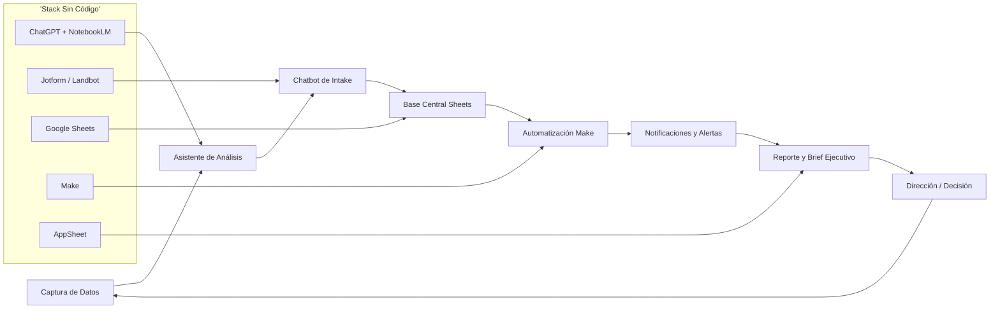
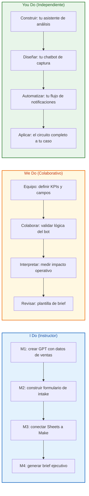
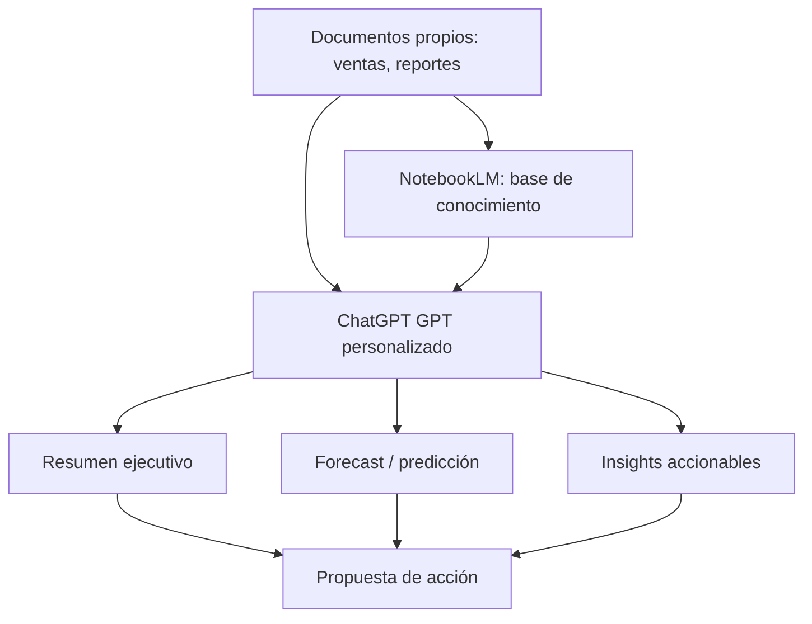
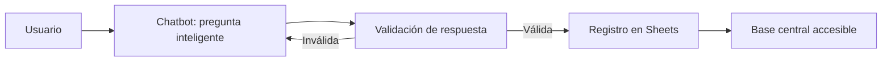
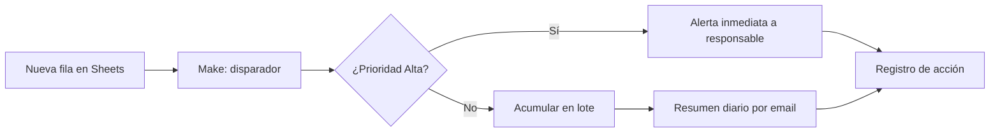
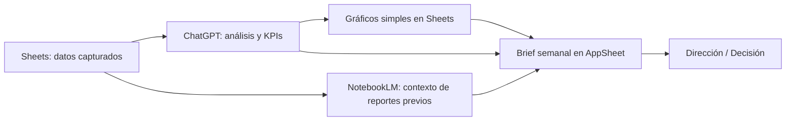
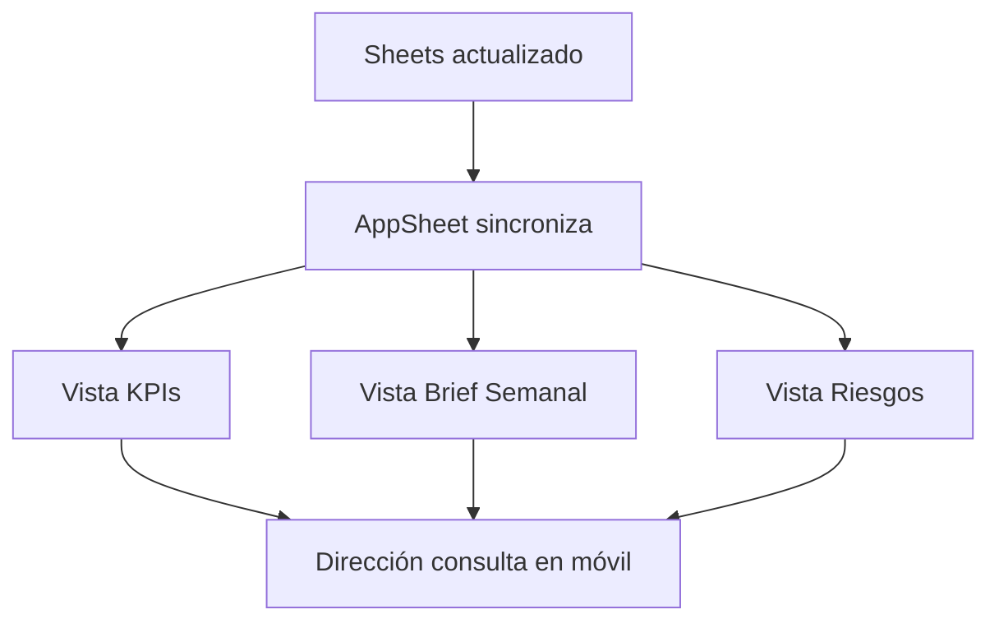
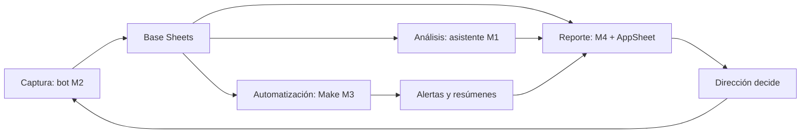

## 🎯 ¿Qué vas a aprender

En esta masterclass construirás, paso a paso, un **circuito de IA aplicado a tu negocio**:

- 🤖 Crear un **asistente personalizado** que analice ventas, corra algoritmos de *forecast* y genere *insights* accionables.
- 💬 Diseñar un **chatbot sin código** que capture pedidos, leads o reclamos y los registre en una base accesible.
- ⚡ **Automatizar flujos** con notificaciones, resúmenes diarios y clasificación por prioridad.
- 📊 Armar **reportes y briefs ejecutivos automáticos** listos para dirección.
- 🧩 Conectar todas las piezas en un único recorrido: de la captura de datos al reporte para decisión.

> **🎯 Objetivo de Aprendizaje** — Al final de esta guía, podrás diseñar e implementar un sistema de IA sin escribir código de producción, usando ChatGPT (GPT personalizados), NotebookLM, Jotform/Landbot, Google Sheets, Make y AppSheet, y medir su impacto operativo.

> **⚠️ Advertencia práctica** — Este contenido es formativo. Las herramientas y precios cambian; valida siempre accesos, privacidad de datos y costos antes de conectar sistemas reales de tu empresa.

---

## 🌍 INTRODUCCIÓN: POR QUÉ ESTA MASTERCLASS ES DIFERENTE

La inteligencia artificial se incorporó de manera natural a nuestra vida cotidiana, transformando la forma en que analizamos información, tomamos decisiones y realizamos tareas. Hoy representa una oportunidad concreta para aumentar la productividad personal y profesional, optimizar procesos y potenciar la creatividad.

La mayoría de los cursos enseña a usar una herramienta aislada. Esta masterclass hace algo distinto: te enseña a **ensamblar un circuito completo** donde cada módulo alimenta al siguiente. No necesitas saber programar: el valor está en diseñar bien el flujo, definir qué datos importan y decidir qué acción automatizar.

> **💡 Punto clave** — La IA sin código no reemplaza a los equipos técnicos: los potencia. Un líder que diseña el flujo correcto y conecta las herramientas adecuadas puede liberar decenas de horas operativas por semana.

---

## 🗺️ MAPA DEL WORKFLOW



| Módulo | Capacidad que entrega | Herramientas |
|--------|----------------------|--------------|
| **M1 · Asistentes de análisis** | Insights y forecast desde tus documentos | ChatGPT (GPTs), NotebookLM |
| **M2 · Chatbots de captura** | Intake automatizado y validado | Jotform / Landbot + Sheets |
| **M3 · Automatización** | Alertas, resúmenes y priorización | Make |
| **M4 · Reportes ejecutivos** | Brief semanal listo para dirección | Sheets + ChatGPT + NotebookLM + AppSheet |



## 🤖 PARTE 1: ASISTENTES INTELIGENTES PARA ANÁLISIS DE NEGOCIO

### 1.1 🎯 Objetivo del módulo

Crear un **asistente personalizado** para analizar ventas, correr algoritmos de *forecast* y *Machine Learning*, resumir información compleja y generar *insights* accionables. Trabajarás con **documentos propios** para producir resúmenes ejecutivos y propuestas de acción inmediatas.



### 1.2 🧰 Herramientas

| Herramienta | Rol en el flujo | Cuándo usarla |
|-------------|-----------------|---------------|
| **ChatGPT (GPTs personalizados)** | Asistente con instrucciones y tono propios | Análisis, resúmenes, propuestas |
| **NotebookLM** | Base de conocimiento sobre tus documentos | Respuestas con citas y trazabilidad |

### 1.3 📥 Preparar los datos de ventas

Antes de pedirle nada al asistente, normaliza tus datos en una tabla limpia. Un archivo `ventas.csv` mínimo:

```text
fecha,producto,canal,unidades,ingreso
2026-01-01,Plan Pro,Web,12,2400
2026-01-02,Plan Basic,Web,30,1500
2026-01-03,Plan Pro,Partner,8,1600
```

### 1.4 📈 Forecast simple con Python (para entender el algoritmo)

Aunque usaremos ChatGPT/NotebookLM para el análisis, conviene entender qué hace un *forecast* básico. Este script calcula una media móvil y una proyección lineal simple:

```python
import pandas as pd
import numpy as np


def forecast_sales(path: str, window: int = 7):
    df = pd.read_csv(path, parse_dates=['fecha']).sort_values('fecha')
    df['media_movil'] = df['ingreso'].rolling(window).mean()

    x = np.arange(len(df))
    slope, intercept = np.polyfit(x, df['ingreso'], 1)
    df['tendencia'] = intercept + slope * x

    # Proyección a 7 días siguiente
    future_x = np.arange(len(df), len(df) + 7)
    df['proyeccion_7d'] = intercept + slope * future_x

    return df


# Uso:
# result = forecast_sales('ventas.csv')
# print(result[['fecha', 'ingreso', 'media_movil', 'tendencia']].tail())
# print('Proyección próximos 7 días:', result['proyeccion_7d'].dropna().iloc[-7:].sum())
```

> **💡 Cómo leerlo** — La *media móvil* suaviza la estacionalidad; la *tendencia* (regresión lineal) indica si creces o caes. Sube ambos números a NotebookLM o a tu GPT para que los explique en lenguaje de negocio.

### 1.5 🛠️ Instrucciones para tu GPT personalizado

```text
Actúa como analista de negocio senior.
Contexto: analizas las ventas de mi empresa usando los archivos que cargo.
Tareas:
1. Resume el período en 5 bullets ejecutivos.
2. Detecta productos/canales con mejor y peor desempeño.
3. Proyecta ingresos de los próximos 7 días con criterio sencillo.
4. Genera 3 propuestas de acción inmediata con responsable sugerido.
Formato de salida: tabla resumen + lista de acciones.
Tono: directo, sin jerga innecesaria.
```

### 1.6 🔎 Casos de uso

| Caso | Entrada | Salida esperada |
|------|---------|-----------------|
| Resumen ejecutivo | Reporte mensual en PDF | 5 hallazgos + acciones |
| Análisis de canal | Planilla de ventas | Ranking de canales |
| Detección de riesgo | Serie de ingresos | Caídas y alertas |
| Propuesta de acción | Datos + objetivo | Plan con responsables |

## 💬 PARTE 2: CHATBOTS SIN CÓDIGO PARA CAPTURAR INFORMACIÓN

### 2.1 🎯 Objetivo del módulo

Diseñar un **chatbot que realice intake automatizado** de pedidos o datos comerciales, haga preguntas inteligentes, valide respuestas y registre todo en tiempo real en una base accesible. Aplica a soporte interno, pedidos de stock, calificación de leads o reclamos.



### 2.2 🧰 Herramientas

| Herramienta | Rol | Ventaja |
|-------------|-----|---------|
| **Jotform** | Formularios conversacionales y APIs | Lógica condicional robusta |
| **Landbot** | Chatbots conversacionales | Experiencia tipo chat |
| **Google Sheets** | Base de datos accesible | Tiempo real y compartible |

### 2.3 📋 Esquema de campos (ejemplo: intake de pedidos)

| Campo | Tipo | Validación | Ejemplo |
|-------|------|------------|---------|
| `fecha` | Fecha | Automática | 2026-07-11 |
| `cliente` | Texto | No vacío | Acme SRL |
| `producto` | Selección | Lista fija | Plan Pro |
| `cantidad` | Número | > 0 | 12 |
| `canal` | Selección | Lista fija | Web / Partner |
| `prioridad` | Selección | Alta/Media/Baja | Alta |
| `observaciones` | Texto | Opcional | Coordinar envío |

### 2.4 🧠 Lógica de validación y preguntas inteligentes

El bot debe **no avanzar hasta validar**. Ejemplo de lógica condicional:

```text
SI cantidad <= 0 ENTONCES "Ingresá una cantidad mayor a 0"
SI producto == "Otro" ENTONCES mostrar campo libre "Describí el producto"
SI prioridad == "Alta" ENTONCES etiquetar fila y disparar alerta (ver M3)
SI cliente ya existe en Sheets ENTONCES sugerir datos previos
```

### 2.5 🔌 Conexión a Google Sheets

```mermaid
flowchart TD
    A[Respuesta validada] --> B[Webhook del formulario]
    B --> C[Append fila en Sheets]
    C --> D[Hoja "Pedidos"]
    D --> E[Disparador para M3]
```

> **💡 Buena práctica** — Mantén una sola hoja central (`Pedidos`, `Leads` o `Reclamos`). Todos los módulos siguientes leen de ahí. Eso evita datos duplicados y facilita el reporte final.

### 2.6 🗂️ Plantilla de mensajes del bot

| Paso | Mensaje sugerido |
|------|------------------|
| Apertura | "¡Hola! Voy a registrar tu pedido. ¿Cuál es el cliente?" |
| Producto | "¿Qué producto? Elegí: Plan Pro, Plan Basic u Otro." |
| Cantidad | "¿Cuántas unidades? (número mayor a 0)" |
| Prioridad | "¿Qué prioridad tiene? Alta, Media o Baja." |
| Cierre | "✅ Listo. Tu pedido quedó registrado y se notificará al equipo." |

## ⚡ PARTE 3: AUTOMATIZACIÓN DEL FLUJO Y NOTIFICACIONES

### 3.1 🎯 Objetivo del módulo

Conectar los datos capturados con **acciones automáticas**: alertas a responsables, resúmenes diarios por email y clasificación por prioridad. Desarrollarás flujos que reduzcan la manualidad y aceleren tiempos de respuesta, midiendo impacto operativo.



### 3.2 🧰 Herramienta

| Herramienta | Rol | Por qué |
|-------------|-----|---------|
| **Make** | Orquestador de automatizaciones | Conecta Sheets, email, ChatGPT y más sin código |

### 3.3 🧩 Diseño del escenario (blueprint conceptual)

```text
Módulo 1 · Watch rows (Google Sheets)
   ↓
Módulo 2 · Router por prioridad
   ├─→ Alta: envía mensaje (Email / Slack / WhatsApp) al responsable
   ├─→ Media/Baja: agrega a buffer diario
   ↓
Módulo 3 · Schedule (todos los días 08:00)
   ↓
Módulo 4 · Agrega resumen y envía email ejecutivo
```

### 3.4 📊 Tabla de triggers y acciones

| Evento | Trigger | Acción automática |
|--------|---------|-------------------|
| Pedido prioritario | Nueva fila prioridad=Alta | Alerta inmediata a responsable |
| Lead calificado | Nueva fila tipo=Lead | Notificar a ventas |
| Reclamo abierto | Nueva fila tipo=Reclamo | Crear ticket + avisar soporte |
| Fin de día | Schedule 08:00 | Resumen diario por email |
| Stock bajo | Cantidad < umbral | Alertar a operaciones |

### 3.5 🤖 Resumen diario generado por IA

Puedes conectar Make con ChatGPT para redactar el resumen automático:

```text
Toma las filas nuevas del día y genera:
- Total de pedidos/leads/reclamos.
- 3 prioridades destacadas.
- Riesgos u oportunidades.
- 2 acciones sugeridas para hoy.
Formato: bullet, máximo 120 palabras.
```

### 3.6 📏 Medir impacto operativo

| Métrica | Antes (manual) | Después (auto) | Mejora |
|---------|----------------|----------------|--------|
| Tiempo de respuesta a prioritarios | Horas | Minutos | ⏱️ |
| Horas semanales de reporte | 5 h | 0.5 h | ⬇️ |
| Errores de registro | Frecuentes | Casi nulos | ✅ |
| Visibilidad de dirección | Baja | Diaria | 📈 |

## 📊 PARTE 4: REPORTES Y BRIEFS EJECUTIVOS AUTOMÁTICOS

### 4.1 🎯 Objetivo del módulo

Construir el **circuito completo**: de la captura de datos al reporte listo para dirección. Se generarán análisis automáticos, visualizaciones simples, hallazgos y un *brief* semanal que sintetice KPIs, riesgos y próximos pasos, listo para comunicar decisiones.



### 4.2 🧰 Herramientas del circuito

| Herramienta | Aporte | Salida |
|-------------|--------|--------|
| **Google Sheets** | Datos y gráficos simples | Dashboard base |
| **ChatGPT** | Análisis y redacción del brief | Texto ejecutivo |
| **NotebookLM** | Memoria de reportes anteriores | Coherencia temporal |
| **AppSheet** | App móvil/web del reporte | Acceso directo a dirección |

### 4.3 🧱 Estructura del brief semanal

| Bloque | Contenido | Fuente |
|--------|-----------|--------|
| **KPIs** | Pedidos, leads, reclamos, ingreso | Sheets |
| **Tendencia** | Crecimiento / caída vs. semana previa | Forecast M1 |
| **Riesgos** | Caídas, reclamos altos, stock bajo | Make / Sheets |
| **Oportunidades** | Canales/productos en alza | ChatGPT |
| **Próximos pasos** | 3 acciones con responsable | ChatGPT + NotebookLM |
| **Decisión sugerida** | Una recomendación clara | Síntesis final |

### 4.4 ✍️ Plantilla de prompt para el brief

```text
Actúa como secretario de dirección.
Usa los datos de la semana y los reportes anteriores (NotebookLM).
Genera un brief ejecutivo con:
1. KPIs principales (números reales).
2. Tendencia vs. semana anterior.
3. Riesgos (máx. 3) con impacto.
4. Oportunidades (máx. 3).
5. Próximos pasos con responsable.
6. Una decisión sugerida para dirección.
Máximo 250 palabras. Tono ejecutivo.
```

### 4.5 📱 AppSheet: el reporte en el bolsillo

AppSheet lee la hoja de Sheets y genera una app sin código donde dirección consulta el brief semanal, los KPIs y los riesgos desde el celular.



### 4.6 🔄 El circuito completo (cierre)



## 🎓 PARTE 5: I DO / WE DO / YOU DO — EJERCICIOS PROGRESIVOS

### 5.1 🟢 I Do — Crear tu asistente de análisis (M1)

**Objetivo:** preparar datos y armar las instrucciones del GPT.

| Paso | Acción | Resultado esperado |
|------|--------|--------------------|
| 1 | Exportar ventas a CSV limpio | Tabla normalizada |
| 2 | Subir a NotebookLM | Base con citas |
| 3 | Crear GPT con instrucciones | Asistente configurado |
| 4 | Pedir resumen ejecutivo | 5 hallazgos + acciones |
| 5 | Validar el forecast | Proyección de 7 días |

> **Interpretación** — Si el resumen repite la tabla en vez de interpretarla, ajusta las instrucciones para exigir "insights, no transcripción".

### 5.2 🟡 We Do — Diseñar el chatbot de captura (M2)

**Escenario:** intake de pedidos de stock para operaciones.

| Decisión | Opción recomendada | Justificación |
|----------|--------------------|---------------|
| Herramienta | Jotform | Lógica condicional robusta |
| Campos | cliente, producto, cantidad, prioridad | Mínimo necesario |
| Validación | cantidad > 0 | Evita registros rotos |
| Destino | Hoja `Pedidos` | Base única |

**Tarea colaborativa:** definan la lógica de "prioridad Alta → alerta" que usará M3.

### 5.3 🔵 You Do — Automatizar y reportar (M3 + M4)

**Tarea:** arma tu propio circuito.

Debes entregar:

- escenario de Make con trigger y router por prioridad,
- plantilla de resumen diario por email,
- brief semanal en AppSheet con KPIs, riesgos y próximos pasos,
- métrica de impacto operativo medida (horas ahorradas).

| Criterio | Peso |
|----------|------|
| Captura validada | 20% |
| Automatización funcional | 25% |
| Reporte accionable | 25% |
| Adopción por el equipo | 15% |
| Medición de impacto | 15% |

### 5.4 🟢 I Do — Medir impacto operativo

**Objetivo:** cuantificar el ahorro antes y después.

| Métrica | Manual | Automatizado |
|---------|--------|--------------|
| Tiempo de respuesta | Horas | Minutos |
| Reporte semanal | 5 h | 0.5 h |
| Errores de registro | Frecuentes | Casi nulos |

### 5.5 🟡 We Do — Interpretar el brief

**Caso:** el brief semanal dice "caída de 18% en canal Partner".

| Pregunta | Respuesta esperada |
|----------|--------------------|
| ¿Es suficiente el dato? | No, falta causa |
| ¿Qué investigar? | Campañas, stock, competencia |
| ¿Qué acción? | Reunión con partner + oferta |
| ¿Quién? | Responsable de canales |
| ¿Cómo medir? | Revisar próximo brief |

### 5.6 🔵 You Do — Circuito completo

**Tarea:** aplica los 4 módulos a un caso real de tu empresa, de la captura al reporte para dirección. Identifica el punto crítico y documenta el ahorro.

### 5.7 🏁 Cierre práctico

| Nivel | Debes poder hacer |
|-------|-------------------|
| **I Do** | Seguir un ejemplo completo de asistente, bot, flujo y brief |
| **We Do** | Ajustar campos, validaciones y prioridades en equipo |
| **You Do** | Construir el circuito completo sobre tu propio caso |

## ✅ CHECKLIST FINAL DEL CIRCUITO DE IA

| Bloque | Check |
|--------|-------|
| **M1 · Asistente** | GPT/NotebookLM con datos propios y prompt de acción |
| **M2 · Captura** | Bot convalidación y registro en Sheets |
| **M3 · Automatización** | Make conecta alertas y resumen diario |
| **M4 · Reporte** | Brief semanal con KPIs, riesgos y pasos |
| **Base** | Hoja central única y sincronizada |
| **Privacidad** | Datos sensibles fuera de terceros no autorizados |
| **Adopción** | Equipo y dirección usan la salida |
| **Impacto** | Horas ahorradas medidas y documentadas |

---

## 📝 PREGUNTAS DE VERIFICACIÓN

Responde cada pregunta basándote en los módulos de esta masterclass.

### Sobre el Asistente (M1)

1. **Aplica**: Subes tus ventas a NotebookLM y el GPT devuelve solo una tabla. ¿Cómo ajustas las instrucciones para obtener *insights*?

2. **Analiza**: ¿Por qué conviene separar "resumen" de "propuesta de acción" en el prompt?

### Sobre el Chatbot (M2)

3. **Diseña**: Crea el esquema de campos para un bot de calificación de leads (nombre, empresa, interés, presupuesto, prioridad). ¿Qué validaciones pondrías?

4. **Reflexiona**: ¿Qué riesgo tiene no validar respuestas antes de registrar en Sheets?

### Sobre Automatización (M3)

5. **Calcula**: Si un responsable tardaba 4 h/semana respondiendo prioritarios y ahora tarda 10 min, ¿cuántas horas ahorra al mes?

6. **Evalúa**: ¿Por qué es mejor un resumen diario automático que revisar la hoja manualmente?

### Integradoras

7. **Conecta**: Explica cómo el bot (M2) alimenta el reporte (M4). ¿Qué pasa si la base no es única?

8. **Propón un sistema**: Diseña el flujo para un reclamo de cliente de alta prioridad, desde el bot hasta la alerta y el brief.

9. **Síntesis**: Toma un proceso de tu empresa y aplícale los 4 módulos. Identifica el punto crítico y el ahorro estimado.

10. **Reflexión final**: De los 4 módulos, ¿cuál consideras más difícil de adoptar en tu equipo y por qué?

---

## 📚 GLOSARIO RÁPIDO

| Término | Definición |
|---------|------------|
| **GPT personalizado** | Asistente de ChatGPT con instrucciones, tono y datos propios |
| **NotebookLM** | Base de conocimiento que responde sobre tus documentos con citas |
| **No-code** | Construir software sin escribir código de producción |
| **Chatbot** | Asistente conversacional que captura y valida información |
| **Intake** | Captura estructurada de datos o pedidos |
| **Forecast** | Proyección de valores futuros a partir de datos históricos |
| **Make** | Plataforma de automatización que conecta apps sin código |
| **Webhook** | Puente que envía datos en tiempo real entre sistemas |
| **Router** | Divisor de flujo según condiciones (ej. prioridad) |
| **Brief ejecutivo** | Resumen corto de KPIs, riesgos y próximos pasos |
| **AppSheet** | Herramienta no-code para crear apps desde una hoja de cálculo |
| **KPI** | Indicador clave de desempeño |

---

## 📐 ANEXO: FORMATO IDEAL PARA ARTÍCULOS EDUCATIVOS

### Ancho recomendado para lectura larga

El ancho óptimo para artículos educativos es **60–75 caracteres por línea** (incluyendo espacios), lo que equivale aproximadamente a `max-width: 65ch` en CSS (550–750 px de contenido). Esto reduce la fatiga visual y mejora la comprensión de conceptos complejos.

```css
.article-content {
  max-width: 65ch;
}
```

### Lo que hace agradable una guía al cerebro

- 🧱 **Estructura escaneable**: títulos, tablas y listas que permiten ubicarse rápido.
- 🗺️ **Mapas visuales**: diagramas (mermaid) que muestran el flujo antes de entrar en detalle.
- 💻 **Ejemplos ejecutables**: código y plantillas que el lector puede probar.
- 🪜 **Progresión I Do / We Do / You Do**: del ejemplo guiado a la práctica independiente.
- ✅ **Cierres de verificación**: preguntas y checklist que fijan el aprendizaje.

---

*Guía elaborada a partir del plan de estudios propuesto para la masterclass "Inteligencia Artificial para el Negocio — Asistentes, Chatbots y Automatización sin Código".*
