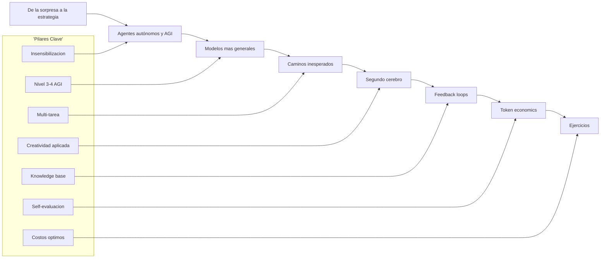
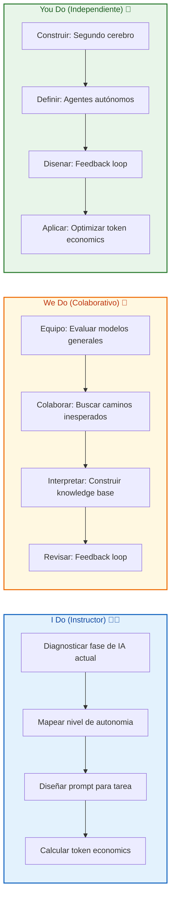
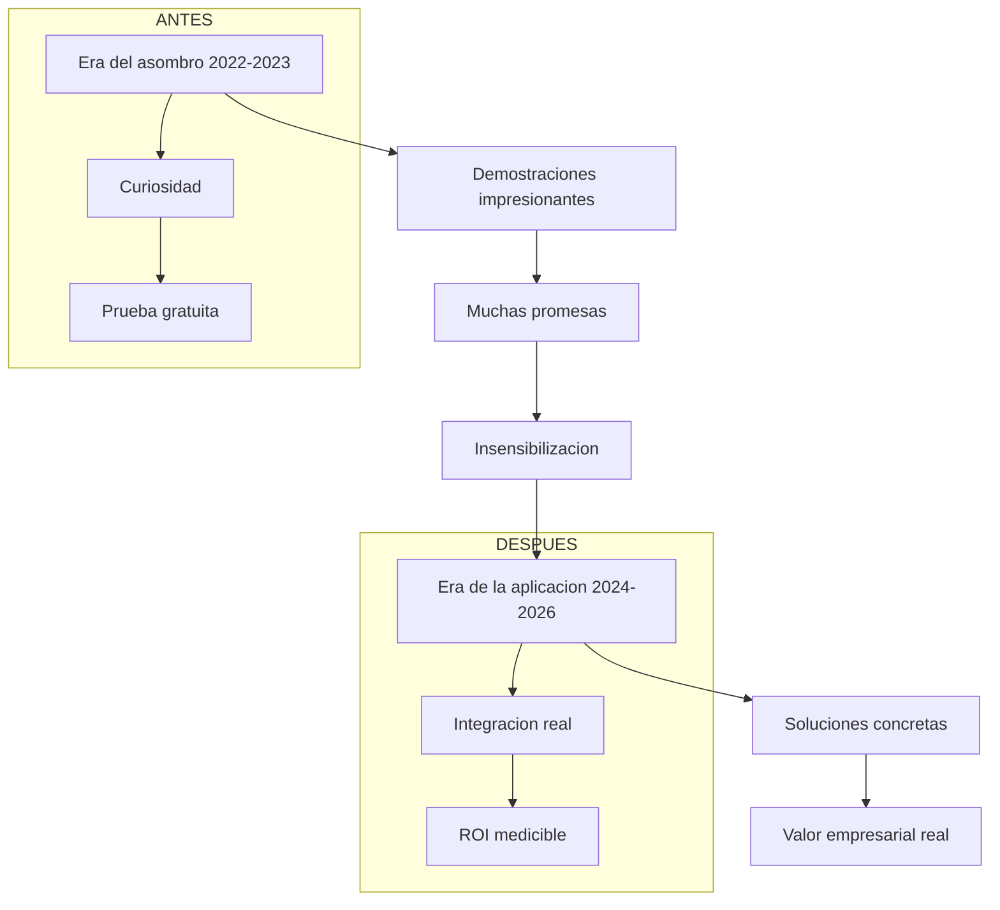
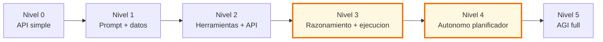
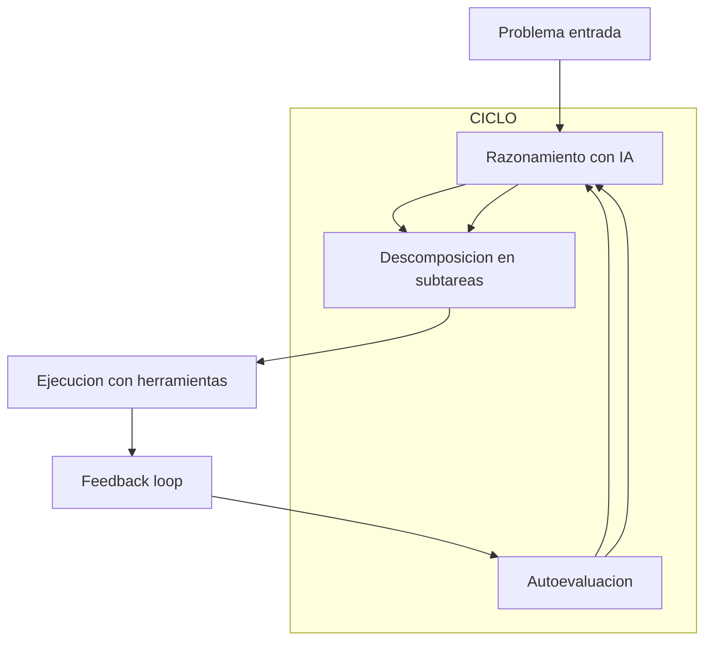
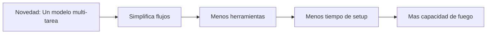
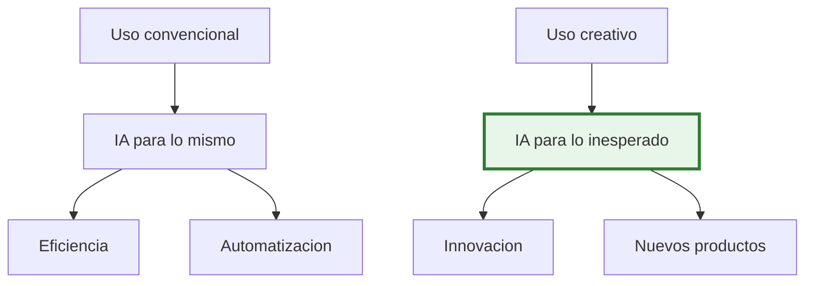
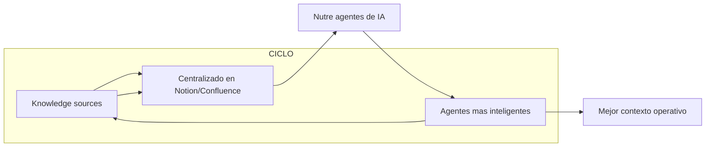
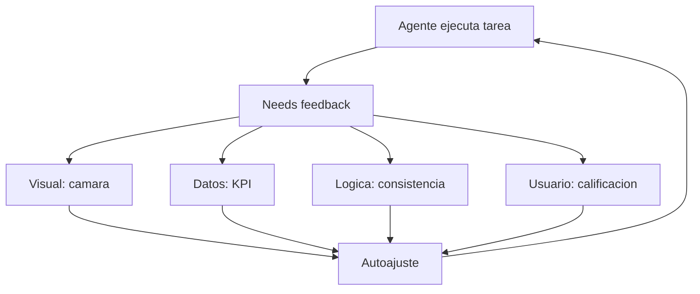
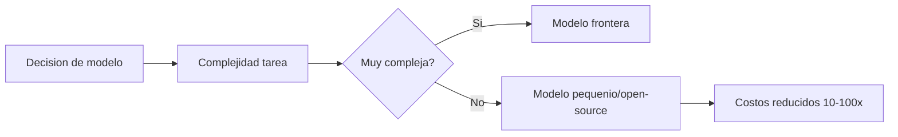

# MASTERCLASS: IA Empresarial según DotCSV — De la Sorpresa a la Estrategía

## 🎬 INTRODUCCIÓN: POR QUÉ ESTE MASTERCLASS ES DIFERENTE

La IA generativa arrasó el mundo en 2022. ChatGPT 🗨️, Midjourney 🎨, GitHub Copilot 💻... nadie podía evitar el asombro. Pero dos años después, 👨 Carlos Santana (@DotCSV) observa un cambio fundamental: **la sorpresa inicial dio paso a la aplicación estratégica**.

Este masterclass está basado en la evolución que Santana traza desde 2012 (el nacimiento de los transformers) hasta 2026, argumentando que **la fase de asombro está terminando** y la de **aplicación práctica está comenzando**. ❓ La pregunta ya no es "¿esto funciona?", sino: "¿cómo lo integro para resolver mi problema de negocio?"

💡 > **Objetivo de Aprendizaje** — Al final de esta guía, entenderás la evolución de la IA hasta los agentes autónomos (nivel 3-4 AGI), y podrás aplicar las 5 ideas estratégicas de DotCSV: usar modelos generales para simplificar flujos, encontrar caminos inesperados, construir un "segundo cerebro", diseñar feedback loops y optimizar token economics.

💡 > **Advertencia educativa** ⚠️ — Este contenido sintetiza la presentación de 👨 Carlos Santana (@DotCSV). Las predicciones sobre AGI son especulativas. Ninguna estrategia aquí presentada garantiza resultados. Esta guía es formativa y educativa.

---

## MAPA DEL MASTERCLASS 🗺️



| Fase | Pregunta que responde | Output principal |
|------|------------------------|------------------|
| **Sorpresa → Estrategia** | ¿Dejó de sorprendernos? | Enfoque en aplicación práctica |
| **Agentes autónomos** | ¿Dónde estamos en la escala AGI? | Nivel 3-4: razonamiento y ejecución |
| **Modelos generales** | ¿Por qué usar un modelo? | Simplifican flujos de trabajo |
| **Caminos inesperados** | ¿Qué problemas nuevos resuelve? | Creatividad aplicada al negocio |
| **Segundo cerebro** | ¿Cómo nutrir a los agentes? | Knowledge base documentado |
| **Feedback loops** | ¿Cómo autoevalúan los agentes? | Sistemas de retroalimentación |
| **Token economics** | ¿Cómo optimizar costos? | Modelos pequeños para tareas simples |
| **Ejercicios** | ¿Lo aplico a mi contexto? | I Do / We Do / You Do |



---

## PARTE 1: DE LA SORPRESA A LA ESTRATEGIA 🚀➡️

### 1.1 📅 La fase de asombro (2012-2023)

Desde el lanzamiento de los transformers (2017) hasta el boom de ChatGPT (2022), la IA generativa causó **sorpresa colectiva**. Cada demostración nueva superaba expectativas. Pero Santana observa una transición: el **asombro inicial da paso a la insensibilización**.

💡 > **La frase del profe** 🌟 — *"Ya no te emocionás cada vez que abrís ChatGPT. La sorpresa se convirtió en rutina. Y eso es bueno: porque el valor real no está en la sorpresa, sino en la aplicación."*



### 1.2 📊 La insensibilización y su oportunidad

La insensibilización no es un problema: es una **liberación**. Cuando la IA ya no sorprende, todos pueden enfocarse en **resolver sus problemas reales**. El valor ya no está en "qué puedes hacer con IA", sino en "qué necesitás que la IA resuelva".

| Fase ❌ | Enfoque ❌ | Fase ✅ | Enfoque ✅ |
|---------|-----------|---------|-----------|
| Sorpresa | "¡Mira lo que puede hacer!" | Estrategia | "¿Qué problema necesito resolver?" |
| Demos | Prompts creativos en Reddit | Integración | Sistemas productivos |
| Hype | Comparar modelos | Aplicación | Medir impacto real |

### 1.3 ❓ La nueva pregunta empresarial

| Pregunta vieja ❌ | Pregunta nueva ✅ |
|------------------|-----------------|
| "¿Qué modelo es el mejor?" | "¿Qué problema necesitamos resolver?" |
| "¿Cuál tiene más parámetros?" | "¿Qué resultado necesitamos?" |
| "¿Puede escribir ensayos?" | "¿Reduce nuestro tiempo en X?" |

💡 > **Tip** 💡 — Santana dice que el 90% de las empresas que adoptan IA en 2024 estarán evaluando su **ROI real** en 2025. Las que piensen en términos de "integración estratégica" hoy, tendrán ventaja mañana.

---

## PARTE 2: AGENTES AUTÓNOMOS Y LA ESCALA AGI 🤖📈 Y LA ESCALA AGI

### 2.1 📊 La escala de desarrollo de agentes de desarrollo de agentes

Santana propone una escala de 5 niveles hacia la AGI (Inteligencia General Artificial):



| Nivel | Capacidad | Ejemplo | Estamos aquí? |
|-------|-----------|---------|---------------|
| **0** | API simple | Completar con un prompt | ❌ Pasado |
| **1** | Prompt + datos | Chat with your data | ❌ Pasado |
| **2** | Herramientas + API | Chain-of-Thought, RAG | ✅ Presente |
| **3** | Razonamiento + ejecución | Planifica y actúa | ✅ **Entre 3 y 4** |
| **4** | Autónomo planificador | Auto-optimiza sin intervención | 🔜 Futuro cercano |
| **5** | AGI full | Pensamiento general | 🔮 Especulativo |

### 2.2 🤖 Nivel 3-4: la frontera actual: la frontera actual

Santana sitúa el presente (2026) **entre el nivel 3 y 4**: los sistemas son capaces de razonar sobre problemas, descomponer tareas y ejecutar acciones autónomas usando herramientas (APIs, scrapers, emails, etc.).

| Capacidad del nivel 3 | Estado actual |
|-----------------------|---------------|
| **Razonamiento** | Chain-of-Thought, Tree-of-Thought |
| **Planificación** | Descomposición de tareas complejas |
| **Ejecución** | Uso de APIs, automatización con código |
| **Autoevaluación** | Feedback loops con sensores (cámaras, validaciones) |



### 2.3 🚀 El salto al nivel 4: agentes autónomos al nivel 4: agentes autónomos

El nivel 4 es donde los agentes pueden **auto-planificar**: reciben un objetivo de alto nivel y diseñan su propio plan, adquiriendo recursos, aprendiendo y optimizándose sin intervención humana constante.

| Característica | Nivel 3 | Nivel 4 |
|----------------|---------|---------|
| **Plan** | Generado con instrucciones explícitas | Auto-generado |
| **Recursos** | Limitados por el humano | Aprovisiona lo necesario |
| **Aprendizaje** | Ajusta basado en feedback | Aprende de forma continua |
| **Autonomía** | Supervisado | Autónomo con supervisión |

---

## PARTE 3: CINCO IDEAS PARA APLICAR IA EN TU EMPRESA 💡🏢 PARA APLICAR IA EN TU EMPRESA

### 3.1 💡 Idea 1: Modelos más generales: Modelos más generales (22:43-30:06)

Los modelos actuales ya no son especializados en una sola tarea. **Un modelo puede traducir, generar imágenes, programar y analizar** — todo en un mismo interfaz. Esto elimina fricción operativa.

| Antes (especializados) | Ahora (generales) |
|-----------------------|-------------------|
| Modelo A para traducir | Un modelo para todo |
| Modelo B para generar imágenes | Menos herramientas, más flexibilidad |
| Modelo C para programar | Menos tiempo de integración |



💡 > **Tip** 💡 — No busques "el mejor modelo para cada cosa". Busca uno general que haga "lo suficientemente bien" para tu caso. La diferencia entre el 95% y el 99% de calidad no justifica el 300% de complejidad extra.

---

## PARTE 4: CAMINOS INESPERADOS — LA IA COMO CATALIZADOR CREATIVO 🎨💡 INESPERADOS — LA IA COMO CATALIZADOR CREATIVO

### 4.1 🎨 Creatividad aplicada al negocio aplicada al negocio (30:06-35:57)

Santana destaca cómo la IA permite resolver problemas tradicionales de formas **inesperadas y creativas**. No solo "automatizar": **reinventar** procesos.

| Tarea tradicional | Solución IA creativa | Resultado |
|-------------------|----------------------|-----------|
| Presentaciones PowerPoint | "Genera una presentación de 10 diapositivas sobre X" | 10 diapositivas profesionales en 10 segundos |
| Diseño web manual | "Crea el HTML de un sitio como este" | Prototipo funcional instantáneo |
| Marketing copy | "Escribe 5 versiones del copy A/B" | Testeo rápido de variantes |
| Análisis de datos | "¿Qué patrón ves en estos datos?" | Insights que pasaban desapercibidos |

### 4.2 ⚡ El poder de usar IA para lo inesperado de usar IA para lo no convencional



💡 > **Frase del profe** 🌟 — *"La IA no va a reemplazarte. Pero alguien que usa la IA sí. La pregunta es: ¿qué tipo de 'alguien'? ¿El que automatiza, o el que inventa nuevos usos?"*

---

## PARTE 5: EL SEGUNDO CEREBRO — TU KNOWLEDGE BASE 🧠📚 CEREBRO — TU KNOWLEDGE BASE

### 5.1 📚 Documenta todo todo (35:57-49:31)

El "segundo cerebro" es el **repositorio de conocimiento** que nutre a tus agentes de IA. No basta con usar IA: hay que **documentar reuniones, facturas, manuales, decisiones** para que los agentes tengan contexto.

| Fuente de conocimiento | Qué documentar | Formato |
|------------------------|----------------|---------|
| **Reuniones** | Decisiones, action items | Transcripciones + resúmenes |
| **Facturas/comprobantes** | Datos financieros | PDFs organizados por mes |
| **Manuales de proceso** | Procedimientos estándar | Wiki o Notion actualizado |
| **Clientes** | Preferencias, feedback | CRM con notas detalladas |



### 5.2 📐 El triángulo del conocimiento del conocimiento

| Pilar | Importancia | Ejemplo |
|-------|-------------|---------|
| **Documentado** | Sin él, la IA no sabe | "Decidimos cambiar X porque Y" |
| **Accesible** | Si no está indexado, no se usa | Busqueda por tema/fecha |
| **Actualizado** | Conocimiento viejo = decisiones malas | Revisión mensual de manuales |

💡 > **Tip** 💡 — Santana dice: "Una empresa con un knowledge base actualizado puede darle instrucciones de 1 línea a un agente de IA y obtener resultados precisos. Sin knowledge base, ni 100 prompts te salvarán."

---

## PARTE 6: FEEDBACK LOOPS — CÓMO LOS AGENTES SE AUTOEVALÚAN 🔁🤖 — CÓMO LOS AGENTES SE AUTOEVALÚAN

### 6.1 ❌ El problema del feedback del feedback (49:31-55:42)

Los agentes autónomos necesitan **evaluar su propio desempeño**. Sin feedback, un agente puede repetir el mismo error infinitamente. Santana propone implementar sistemas de retroalimentación activa.

| Tipo de feedback | Funcionamiento | Ejemplo |
|-------------------|----------------|---------|
| **Visual (cámaras)** | Verifica resultados físicos | Robot de almacén verifica estanterías |
| **Datos de performance** | Mide KPIs automáticamente | Dashboard de ventas en tiempo real |
| **Validación lógica** | Chequea consistencia interna | "¿Este cálculo tiene sentido?" |
| **Usuario final** | Feedback humano explícito | Calificación de respuestas de IA |



### 6.2 📋 Diseñar un feedback loop un feedback loop

| Paso | Elemento | Pregunta clave |
|------|----------|----------------|
| 1 | **Sensórica** | ¿Cómo mido el resultado? |
| 2 | **Comparación** | ¿Cumple con el objetivo? |
| 3 | **Diagnóstico** | ¿Qué salió mal? |
| 4 | **Ajuste** | ¿Qué cambio aplicar? |
| 5 | **Iteración** | ¿Se reingresa al ciclo? |

💡 > **Tip** 💡 — Un feedback loop mal diseñado es **peor que no tener uno**. Si el agente recibe feedback contradictorio o engañoso, se desvía peor que sin feedback. La calidad del feedback > la cantidad.

---

## PARTE 7: TOKEN ECONOMICS — OPTIMIZA TUS COSTOS 💰💸 — OPTIMIZA TUS COSTOS

### 7.1 El aumento en el uso de modelos (55:42-1:03:15)

A medida que más agentes trabajan en paralelo, el costo de tokens se dispara. Santana advierte: **no uses siempre los modelos "frontera"** para tareas simples.

| Tarea | Modelo óptimo | Razón |
|-------|---------------|-------|
| **Chat básico** | GPT-4o mini, Llama 3.1 8B | 10x más barato, suficiente calidad |
| **Análisis complejo** | GPT-4o, Claude 3.5 | Necesita razonamiento profundo |
| **Código simple** | Code Llama, GPT-3.5 | No necesita GPT-4 |
| **Resumen de documentos** | Embeddings + LLM chico | Reduce tokens de entrada |



### 7.2 💰 Estrategias de token economics de token economics

| Estrategia | Herramienta | Ahorro aproximado |
|-----------|-------------|-------------------|
| **Cache de respuestas** | Redis, SQLite | Elimina 60% de llamadas repetidas |
| **Modelos open source** | Llama 3.1, Qwen | 95% más barato que GPT-4 |
| **Embeddings + búsqueda** | FAISS, Pinecone | Reduce 90% de tokens de entrada |
| **Prompt optimization** | Prompt caching, summarization | 50-70% de tokens ahorrados |
| **RAG** | Recuperar solo lo relevante | Reduce contexto de 10K a 1K tokens |

| Costo ❌ (todo GPT-4) | Costo ✅ (optimizado) |
|----------------------|----------------------|
| $10.000/mes | $1.500/mes |

💡 > **Tip** 💡 — Santana sugiere: "Haz una auditoría de tokens. La mitad de tus llamadas a la API son para tareas que un modelo de 8B en lugar de 70B resolvería igual. Ese es el 90% de tu presupuesto de IA."

---

## PARTE 8: I DO / WE DO / YOU DO — EJERCICIOS PROGRESIVOS 📈📚 / WE DO / YOU DO — EJERCICIOS PROGRESIVOS

### 8.1 👨‍🏫 I Do — Diagnosticar el nivel de IA — Diagnosticar el nivel de IA de tu empresa 👨‍🏫

**Objetivo:** evaluar dónde está tu organización en la escala de agentes.

| Paso | Pregunta clave | Herramienta |
|------|----------------|-------------|
| 1 | ¿Usan IA con prompts básicos o con herramientas? | Nivel 1 vs 2 |
| 2 | ¿Los agentes toman decisiones o ejecutan órdenes? | Nivel 2 vs 3 |
| 3 | ¿Hay feedback loops o dependen del humano? | Nivel 3 vs 4 |
| 4 | ¿Auto-planifican o necesitan instrucciones? | Nivel 4 vs 5 |

💡 > **Test rápido:** Si tu equipo necesita instrucciones paso a paso, están en nivel 2. Si puede recibir un objetivo general y ejecutarlo, están cerca del nivel 3.

### 8.2 🤝 We Do — Diseñar un segundo cerebro — Diseñar un segundo cerebro 🤝

**Escenario:** una consultora quiere documentar sus procesos para entrenar agentes de IA.

| Paso | Acción | Output |
|------|--------|--------|
| 1 | Identificar knowledge sources | 5 fuentes clave (clientes, procesos, templates) |
| 2 | Elegir herramienta | Notion o Confluence |
| 3 | Estructurar por tema | Client onboarding, reportes, pitch decks |
| 4 | Asignar dueños | Cada documento tiene un owner que lo actualiza |
| 5 | Conectar con IA | "Usa este knowledge base para responder" |

| Criterio | Pregunta |
|----------|----------|
| **Completo** | ¿Documenta el 80% de lo que preguntan los clientes? |
| **Actualizado** | ¿Se revisa cada 30 días? |
| **Accesible** | ¿Se puede buscar por tema y fecha? |
| **Accionable** | ¿La IA puede usarlo sin ambigüedades? |

### 8.3 💪 You Do — Diseñar tu feedback loop — Diseñar tu feedback loop 💪

**Tarea:** diseñá un sistema de retroalimentación para un agente de IA que gestiona tu email.

| Componente | Diseño |
|------------|--------|
| **Sensor** | ¿Cómo medirás si el agente responde correctamente? |
| **Comparación** | ¿Qué baseline o KPI usarás? |
| **Diagnóstico** | ¿Cómo identificarás errores? |
| **Ajuste** | ¿Qué cambios aplicarás al agente? |
| **Iteración** | ¿Con qué frecuencia revisarás? |

| Criterio de evaluación | Peso |
|------------------------|------|
| Sensor claramente definido | 20% |
| KPI medible y relevante | 20% |
| Sistema de diagnóstico | 20% |
| Plan de ajuste concreto | 20% |
| Frecuencia de iteración establecida | 20% |

---

## CHECKLIST FINAL DE IA EMPRESARIAL ✅📋 DE IA EMPRESARIAL ✅

| Bloque | Check |
|--------|-------|
| **Mentalidad** | Pasaste de "sorpresa" a "aplicación estratégica" |
| **Agentes** | Evaluaste tu nivel en la escala AGI |
| **Modelos** | Usas modelos generales para simplificar flujos |
| **Creatividad** | Encontraste usos inesperados de la IA |
| **Knowledge base** | Documentaste procesos para nutrir agentes |
| **Feedback** | Implementaste loops de retroalimentación |
| **Economía** | Optimizaste tokens con modelos pequeños |
| **Ejercicios** | I Do / We Do / You Do completados |

---

## PREGUNTAS DE VERIFICACIÓN 📝❓ 📝

### Preguntas sobre mentalidad y fases
1. **Aplica:** ¿Podés identificar un proyecto donde la "sorpresa" de la IA se convirtió en rutina? ¿Cómo lo harías ahora?
2. **Analiza:** ¿De qué manera la insensibilización a la IA puede volverse una ventaja competitiva?

### Preguntas sobre agentes y AGI
3. **Diseña:** Mapear tu empresa en la escala de 5 niveles. ¿Estás en el nivel correcto?
4. **Reflexiona:** ¿Qué capacidades faltan hoy para pasar del nivel 3 al 4?

### Preguntas sobre las 5 ideas estratégicas
5. **Calcula:** Auditá tus costos de IA. ¿En qué porcentaje usarías modelos más pequeños?
6. **Evalúa:** ¿Qué knowledge base documentarías primero para nutrir a un agente?
7. **Conecta:** Diseñá un feedback loop para un agente que gestiona tu calendario.
8. **Propón:** Un "camino inesperado" para usar IA en tu trabajo actual.
9. **Síntesis:** Combiná dos de las cinco ideas (ej: knowledge base + feedback loop) para un agente específico.
10. **Reflexión final:** Si los agentes alcanzan nivel 4 en 2 años, ¿qué rol tendrás vos? ¿Qué habilidad protegerías?

---

## GLOSARIO RÁPIDO 📖📚 📖

| Término | Definición |
|---------|------------|
| **AGI** | Artificial General Intelligence — IA con razonamiento general |
| **Agente autónomo** | Sistema que actúa sin intervención humana constante |
| **Nivel AGI** | Escala del 0 al 5 de autonomía de IA |
| **Multi-tarea** | Modelo que hace varias cosas en un solo interfaz |
| **Knowledge base** | Repositorio documental que nutre a agentes de IA |
| **Feedback loop** | Sistema donde el agente se autoevalúa y ajusta |
| **Token economics** | Optimización de costos de uso de modelos de lenguaje |
| **Modelo frontera** | El modelo más avanzado disponible (GPT-4, Claude 3.5) |
| **Modelo pequeño** | Modelo open source o más barato (Llama, Qwen, 8B) |
| **RAG** | Retrieval-Augmented Generation — combinar datos con generación |
| **Chain-of-Thought** | Técnica para que la IA raccione paso a paso |
| **Insensibilización** | Adaptación a la novedad, fin de la sorpresa |

---

## ANEXO A: FORMATO IDEAL PARA GUÍAS DE IA 🧠📄 IDEAL PARA GUÍAS DE IA 🧠

### Recomendaciones de legibilidad

```css
.article-content {
  font-size: 18px;
  line-height: 1.75;
  max-width: 65ch;
}
```

### Lo que hace agradable una guía al cerebro 🧠

- **Ejemplos concretos** anclan conceptos abstractos en casos reales.
- **Casos de uso inesperados** estimulan la creatividad aplicada.
- **Tablas comparativas** facilitan el contraste rápido.
- **Diagnósticos prácticos** permiten aplicar de inmediato.
- **Ejercicios progresivos** (I Do / We Do / You Do) construyen confianza.
- **Checklist y glosario** permiten repaso rápido.

💡 > **Frase del profe** 🌟 — *"La IA no cambió el mundo porque apareció. La cambió porque dejó de sorprender. Ahora es hora de trabajar."*


