## 🎯 ¿Qué vas a aprender

En esta masterclass desarrollarás la visión ejecutiva para convertir la IA en un activo de negocio repetible y gobernado:

- 🧭 Diagnosticar la madurez de IA de tu organización antes de invertir un peso.
- 🗺️ Mapear tareas y procesos para identificar dónde la IA suma valor real (y dónde no).
- 🧪 Diseñar y evaluar una Prueba de Concepto (PoC) con criterios de negocio, no solo técnicos.
- ⚖️ Decidir entre *build vs. buy* y entre modelos propios, generativos o preentrenados.
- 🔌 Planificar la integración con sistemas existentes y el monitoreo continuo (MLOps).
- 🛡️ Gobernar riesgos, sesgos y ética sin frenar la innovación.

> **🎯 Objetivo de Aprendizaje** — Al final de esta guía, podrás diseñar un flujo de trabajo end-to-end para evaluar, proponer y gestionar proyectos de IA en tu organización, incluso sin programar, y comunicar decisiones con el equipo técnico en su propio lenguaje.

> **⚠️ Advertencia ejecutiva** — Este contenido es formativo y se basa en el programa de Educación Ejecutiva de la Universidad Torcuato Di Tella (dirección académica: Edgar Altszyler). Ninguna métrica, matriz o plantilla debe interpretarse como garantía de resultado; cada proyecto de IA depende de datos, contexto y ejecución reales.

---

## 🌍 INTRODUCCIÓN: POR QUÉ ESTA MASTERCLASS ES DIFERENTE

Vivimos en un mundo donde la digitalización dejó de ser una opción para convertirse en una necesidad. La Inteligencia Artificial (IA) ya no es solo un tema de investigación: es una herramienta transformadora capaz de analizar grandes volúmenes de datos, predecir tendencias, optimizar procesos y personalizar experiencias.

La mayoría de los programas explican *qué es* la IA. Esta masterclass hace algo distinto: te enseña a **promoverla, evaluarla y gestionarla** como líder. No necesitas programar para dirigir un proyecto de IA, pero sí necesitas entender qué perfiles se requieren, qué infraestructura es necesaria, cómo dimensionar el esfuerzo y —sobre todo— cómo alinear la tecnología con un objetivo de negocio claro.

La IA no solo agrega valor mediante la automatización: propone una redefinición profunda de cómo las empresas conocen a sus clientes y toman decisiones. Quienes se anticipen e incorporen la IA con método obtendrán ventajas competitivas; quienes la adopten por moda, sin gobernanza, multiplicarán el riesgo.

> **🔑 Punto de gestión clave** — El mayor riesgo en proyectos de IA rara vez es tecnológico: suele ser organizacional. Las tres causas más frecuentes de fracaso son datos de mala calidad, objetivos de negocio mal definidos y expectativas desalineadas entre el equipo técnico y el liderazgo.

---

## 🗺️ MAPA DEL WORKFLOW

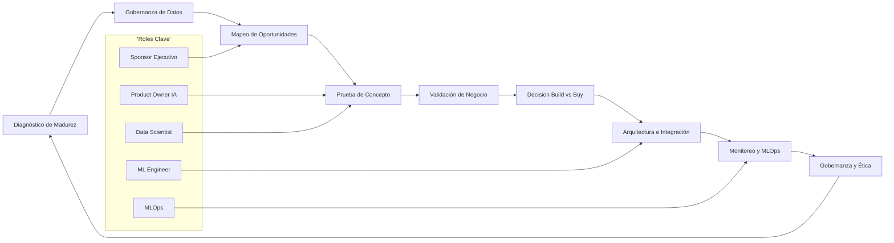

| Fase | Pregunta que responde | Output principal |
|------|-----------------------|------------------|
| **Diagnóstico de Madurez** | ¿Estamos listos para IA? | Scorecard de madurez y brechas |
| **Gobernanza de Datos** | ¿Los datos son confiables y accesibles? | Catálogo y políticas de datos |
| **Mapeo de Oportunidades** | ¿Dónde suma valor la IA hoy? | Backlog de casos priorizados |
| **Prueba de Concepto** | ¿La idea es técnicamente viable? | Modelo/PoC funcional |
| **Validación de Negocio** | ¿Genera el impacto esperado? | Métricas de negocio vs. baseline |
| **Build vs. Buy** | ¿Desarrollamos o adoptamos? | Decisión de arquitectura |
| **Arquitectura e Integración** | ¿Cómo entra a producción? | Pipeline e integración con sistemas |
| **Monitoreo y MLOps** | ¿Sigue funcionando en el mundo real? | Alertas, drift y reentrenamiento |
| **Gobernanza y Ética** | ¿Es responsable y trazable? | Políticas, auditoría y kill-switch |

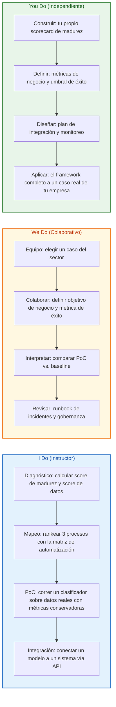

## 🧩 PARTE 1: DIAGNÓSTICO DE MADUREZ — LEER LA ORGANIZACIÓN ANTES DE INVERTIR

### 1.1 💡 Principio Central

Un proyecto de IA no vive aislado: vive dentro de una organización con cierto nivel de madurez. Saltar directo a la herramienta es el primer error del líder principiante. El primer hábito del líder preparado es **diagnosticar**.

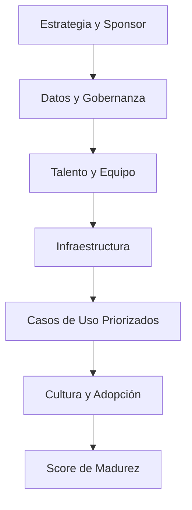

### 1.2 📊 Dimensiones de la madurez de IA

| Dimensión | Qué mide | Por qué importa |
|-----------|----------|-----------------|
| **Estrategia** | Hay objetivos claros y un sponsor ejecutivo | Evita proyectos que no mueven el negocio |
| **Datos** | Calidad, acceso y gobernanza | Sin datos confiables, no hay modelo confiable |
| **Talento** | Perfiles (data, ML, MLOps) disponibles | Define qué se puede construir internamente |
| **Infraestructura** | Cómputo, almacenamiento, nube | Habilita entrenamiento y despliegue |
| **Casos de uso** | Backlog priorizado y medible | Conecta IA con valor tangible |
| **Cultura** | Adopción y confianza en datos | Decide si la solución se usa de verdad |
| **Ética/riesgo** | Controles y auditoría | Protege a la organización y a terceros |

### 1.3 🧮 Scorecard de madurez (código base)

```python
from dataclasses import dataclass, field
from typing import Dict


@dataclass
class AIReadinessAssessment:
    dimensions: Dict[str, int] = field(default_factory=dict)

    def score(self) -> float:
        if not self.dimensions:
            return 0.0
        return sum(self.dimensions.values()) / (len(self.dimensions) * 5) * 100

    def level(self) -> str:
        s = self.score()
        if s < 30:
            return 'inicial'
        if s < 60:
            return 'en desarrollo'
        if s < 85:
            return 'avanzado'
        return 'optimizado'

    def gaps(self, threshold: int = 3) -> list:
        return [name for name, value in self.dimensions.items() if value < threshold]


assessment = AIReadinessAssessment(dimensions={
    'estrategia': 4,
    'datos': 2,
    'talento': 3,
    'infraestructura': 4,
    'casos_uso': 3,
    'cultura': 2,
    'etica': 1,
})

print(f"Madurez: {assessment.score():.0f}% -> {assessment.level()}")
print(f"Brechas críticas: {assessment.gaps()}")
```

> **💡 Cómo leerlo** — Un puntaje bajo en *datos* o *ética* con puntaje alto en *infraestructura* es la receta clásica del fracaso: se compra la tecnología antes de tener los cimientos. Corrige las brechas antes de escalar.

## 🗃️ PARTE 2: GOBERNANZA DE DATOS — EL PIPELINE QUE NO MIENTE

### 2.1 🥇 Regla de Oro

Si el dato está roto, el modelo está roto. Una predicción brillante sobre datos sucios produce una decisión falsa. Antes de hablar de modelos, la gobernanza debe responder:

1. ¿Los datos son completos (sin nulls críticos)?
2. ¿Están duplicados o corruptos?
3. ¿Son representativos del problema real?
4. ¿El formato es utilizable y estable?
5. ¿Hay sesgos de muestreo?
6. ¿Existen restricciones legales o de privacidad?
7. ¿La fuente se actualiza de forma confiable?

### 2.2 📁 Estructura mínima del proyecto de IA

```text
ia-proyecto/
├── data/
│   ├── raw/            # Datos crudos inmutables
│   ├── processed/      # Datos limpios y etiquetados
│   └── features/       # Variables listas para el modelo
├── notebooks/
│   └── exploration.ipynb
├── src/
│   ├── data_quality.py
│   ├── feature_store.py
│   ├── model.py
│   ├── evaluator.py
│   └── api.py
├── tests/
│   ├── test_data_quality.py
│   └── test_model.py
├── configs/
│   ├── data_sources.yaml
│   └── governance.yaml
└── requirements.txt
```

### 2.3 🔍 Validador de calidad de datos

```python
import pandas as pd


class DataQualityGate:
    def __init__(self, df: pd.DataFrame):
        self.df = df

    def completeness(self, cols) -> float:
        return self.df[cols].notna().mean().mean()

    def duplicates(self) -> int:
        return int(self.df.duplicated().sum())

    def null_rate(self, col: str) -> float:
        return float(self.df[col].isna().mean())

    def report(self) -> dict:
        numeric_cols = self.df.select_dtypes(include='number').columns
        return {
            'rows': len(self.df),
            'duplicate_rows': self.duplicates(),
            'mean_completeness': self.completeness(self.df.columns),
            'mean_numeric_skew_ok': bool(
                self.df[numeric_cols].skew().abs().lt(3).all()
            ),
        }


# Uso
# gate = DataQualityGate(df)
# print(gate.report())
```

### 2.4 ⚠️ Tabla de riesgos de datos

| Riesgo de dato | Síntoma en el modelo | Validación |
|----------------|----------------------|------------|
| Duplicados | Métricas infladas | Índice sin duplicados |
| Sesgo de muestra | Predice mal a minorías | Auditoría por segmento |
| Nulls encubiertos | Crashes en producción | Checks de completitud |
| Datos contaminados | Decisiones erróneas | Rango y tipos esperados |
| Fuente desactualizada | Model drift temprano | Freshness por timestamp |
| Privacidad | Riesgo legal | Anonimización y consentimiento |
| Etiquetas ruidosas | Techo de aprendizaje bajo | Revisión humana de etiquetas |

## 🎯 PARTE 3: MAPEO DE OPORTUNIDADES — CONVERTIR PROCESOS EN CASOS DE IA

### 3.1 🏭 ¿Qué es un "Opportunity Factory"?

No es una carpeta de ideas sueltas. Es un método sistemático para convertir procesos de la organización en candidatos a proyecto de IA:

```text
Proceso → Tarea → Criterio → Score → Priorización → Caso de uso
```

Una misma tarea (por ejemplo, "clasificar tickets de soporte") puede evaluarse como NLP, como clasificación supervisada o como agente generativo. El mapeo evita el error de adoptar una tecnología y luego buscarle problema.

### 3.2 📋 Matriz de automatización de tareas

Las mejores oportunidades comparten tres características: alto volumen repetitivo, reglas difíciles de codificar pero identificables en datos, y tolerancia razonable al error (supervisión humana).

| Criterio | Pregunta | Peso |
|----------|----------|------|
| **Frecuencia** | ¿Se repite con regularidad? | 20% |
| **Estructura** | ¿Sigue reglas o patrones identificables? | 20% |
| **Volumen de datos** | ¿Hay historial para entrenar o usar modelo? | 20% |
| **Costo del error** | ¿Qué tan grave es un fallo? ¿Es reversible? | 20% |
| **Impacto esperado** | ¿El ahorro justifica la inversión? | 20% |

### 3.3 🧮 Scoring de tareas (código)

```python
from dataclasses import dataclass


@dataclass
class TaskCandidate:
    name: str
    frequency: float       # 0-5
    structure: float       # 0-5
    data_volume: float     # 0-5
    error_cost: float      # 0-5 (mayor = menor costo de error = mejor)
    impact: float          # 0-5

    def automation_score(self) -> float:
        weights = {
            'frequency': 0.20,
            'structure': 0.20,
            'data_volume': 0.20,
            'error_cost': 0.20,
            'impact': 0.20,
        }
        raw = (
            self.frequency * weights['frequency']
            + self.structure * weights['structure']
            + self.data_volume * weights['data_volume']
            + self.error_cost * weights['error_cost']
            + self.impact * weights['impact']
        )
        return raw / 5 * 100


candidates = [
    TaskCandidate('Clasificar tickets de soporte', 5, 4, 4, 4, 4),
    TaskCandidate('Predecir churn de clientes', 4, 3, 5, 3, 5),
    TaskCandidate('Redactar informes legales', 3, 2, 2, 2, 4),
    TaskCandidate('Control de calidad por visión', 5, 5, 4, 3, 5),
]

for c in sorted(candidates, key=lambda x: x.automation_score(), reverse=True):
    print(f"{c.name}: {c.automation_score():.0f}%")
```

### 3.4 🪟 Tabla de "ventanas de aplicación" por tecnología

| Tecnología | Ventana de aplicación típica | Ejemplo de caso |
|------------|------------------------------|-----------------|
| **NLP** | Texto, tickets, contratos, resúmenes | Clasificación de soporte |
| **Computer Vision** | Imágenes, video, inspección | Control de calidad |
| **Audio/Speech** | Llamadas, transcripción | Análisis de call center |
| **Modelos generativos** | Redacción, copys, código, RAG | Asistente de conocimiento |
| **Recomendación** | Catálogos, contenido | Personalización de ofertas |
| **Clustering** | Segmentación sin etiquetas | Segmentación de clientes |
| **Agentes autónomos** | Flujos multi-paso | Automatización de back-office |

### 3.5 🤖 Prompt para Research Agent (oportunidades)

```text
Actúa como consultor de IA senior.
Objetivo: proponer 10 oportunidades de IA para el área {area}.
Entradas:
- Procesos actuales: {procesos}
- Madurez de datos: {madurez}
- Restricciones: presupuesto {budget}, sin datos personales sensibles.
Entrega por cada oportunidad:
1. Nombre del caso
2. Tecnología aplicable (NLP, visión, generativo, etc.)
3. Problema de negocio que resuelve
4. Datos necesarios
5. Costo estimado del error
6. Métrica de éxito
7. Criterio de descarte
```

## 🧪 PARTE 4: PRUEBA DE CONCEPTO — PROBAR SIN AUTOENGAÑO

### 4.1 🧪 La PoC no es el producto

Una PoC es una versión simplificada para validar viabilidad técnica. No optimices sobre toda la muestra, no midas solo precisión, y no compares contra nada: eso es autoengaño.

Errores comunes:

- usar datos del futuro en el entrenamiento (*leakage*),
- ignorar la distribución real de clases,
- no separar entrenamiento y validación,
- medir solo métricas técnicas y olvidar el negocio,
- no comparar contra un *baseline* (regla actual del proceso).

### 4.2 📈 Métricas mínimas

| Métrica | Qué responde | Interpretación |
|---------|--------------|----------------|
| **Precisión** | % de aciertos global | Útil solo con clases balanceadas |
| **Recall** | % de casos positivos detectados | Crítico en fraude/salud |
| **F1** | Equilibrio precisión-recall | Estándar para clasificación |
| **AUC-ROC** | Capacidad de separar clases | Robusto a umbral |
| **MAPE** | Error en predicción numérica | Para forecasting |
| **Baseline** | Qué hace el proceso hoy | La barra a superar |
| **Costo del error** | Impacto en negocio | Decide si el modelo sirve |

### 4.3 ⚙️ Evaluador de PoC (código)

```python
from dataclasses import dataclass
from typing import Optional


@dataclass
class PocResult:
    model_name: str
    metric_value: float
    baseline_value: float
    business_impact: Optional[float] = None

    def beats_baseline(self) -> bool:
        return self.metric_value > self.baseline_value

    def uplift(self) -> float:
        if self.baseline_value == 0:
            return float('inf')
        return (self.metric_value - self.baseline_value) / self.baseline_value * 100

    def verdict(self, min_uplift: float = 5.0) -> str:
        if not self.beats_baseline():
            return 'rechazar'
        if self.uplift() < min_uplift:
            return 'iterar'
        return 'avanzar'


poc = PocResult(
    model_name='Clasificador de tickets (NLP)',
    metric_value=0.82,
    baseline_value=0.55,
    business_impact=120000.0,
)

print(f"Uplift: {poc.uplift():.0f}% -> {poc.verdict()}")
```

### 4.4 🔁 Validación walk-forward (para series temporales)

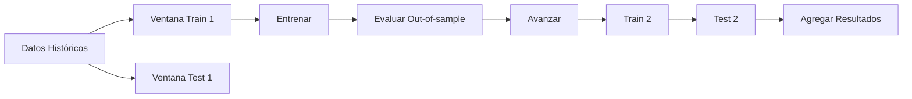

| Bloque | Uso | Regla |
|--------|-----|-------|
| **In-sample** | Ajustar parámetros | Nunca es el resultado final |
| **Out-of-sample** | Validar robustez | Debe sostener métricas |
| **Burn-in** | Calcular features | No opera en warm-up |
| **Shadow mode** | Comparar vs. humano | Sin impacto real todavía |
| **Piloto** | Impacto limitado | Con supervisión humana |

### 4.5 🚨 Señales de sobreajuste

| Señal | Qué sugiere | Acción |
|-------|-------------|--------|
| Métrica perfecta en muestra corta | Curva irreal | Probar más datos/tiempo |
| Muchos parámetros, pocos casos | Modelo frágil | Simplificar |
| Excelente solo en un segmento | Ruido o caso específico | Probar otros segmentos |
| Caída fuerte fuera de muestra | Overfitting | Reentrenar con walk-forward |
| Dependencia de un feature raro | Inestabilidad | Explicabilidad (SHAP) |

## 💼 PARTE 5: VALIDACIÓN DE NEGOCIO — EL VALOR ANTES DE LA TÉCNICA

### 5.1 💡 La métrica técnica no es el negocio

Un modelo con F1 de 0.95 puede no mover un indicador de negocio. La validación de negocio responde: ¿los resultados del modelo realmente generan el impacto esperado, más allá de las métricas técnicas?

El líder ejecutivo participa activamente en esta instancia: define el objetivo de negocio, la métrica de éxito y el umbral de adopción.

### 5.2 🔄 Traducción problema → métrica

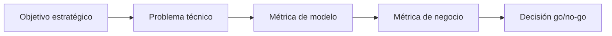

| Objetivo de negocio | Problema técnico | Métrica de negocio |
|---------------------|------------------|--------------------|
| Reducir rotación de clientes | Predecir churn a 30 días | % de churn evitado |
| Bajar costo de soporte | Clasificar y enrutar tickets | Tiempo medio de resolución |
| Aumentar conversión | Score de leads | Tasa de cierre |
| Reducir fraude | Detectar anomalías | Pérdida evitada ($) |
| Acelerar operaciones | Resumir documentos | Horas-hombre ahorradas |

### 5.3 🚦 Reglas de decisión (go/no-go)

| Regla | Umbral sugerido | Motivo |
|-------|-----------------|--------|
| Uplift vs. baseline | >= 5–10% | Justifica el desarrollo |
| Recall mínimo | Sector-dependiente | En salud/fraude, alto |
| Costo del error | Reversible o supervisado | Protege decisiones críticas |
| Adopción esperada | > 60% uso previsto | Evita soluciones no usadas |
| ROI estimado | > inversión a 12–18 meses | Viabilidad financiera |
| Explicabilidad | Requerida en decisión de impacto | Auditabilidad |

### 5.4 💰 Cálculo de impacto (código)

```python
@dataclass
class BusinessCase:
    process_volume: int        # operaciones/año
    current_cost_per_unit: float
    model_success_rate: float
    automation_share: float    # fracción automatizable

    def annual_saving(self) -> float:
        automated = self.process_volume * self.automation_share
        effective = automated * self.model_success_rate
        return effective * self.current_cost_per_unit


case = BusinessCase(
    process_volume=200_000,
    current_cost_per_unit=8.0,
    model_success_rate=0.82,
    automation_share=0.70,
)

print(f"Ahorro anual estimado: ${case.annual_saving():,.0f}")
```

> **💼 Nota ejecutiva** — Siempre resta el costo de operación del modelo (infra, licencias, equipo, reentrenamiento) al ahorro bruto. El ROI real es `ahorro_bruto - costo_total`.

### 5.5 👤 Matriz de supervisión humana

| Decisión | Nivel de riesgo | Supervisión |
|----------|-----------------|-------------|
| Resumen de documentos internos | Bajo | Post-edición humana |
| Clasificación de tickets | Medio | Revisión de baja confianza |
| Score de crédito | Alto | Humano obligatorio |
| Diagnóstico médico | Crítico | Médico responsable |
| Despido / RRHH | Crítico | Humano + auditoría |

## 🏗️ PARTE 6: BUILD VS. BUY — DECIDIR LA ARQUITECTURA

### 6.1 🤔 No todo se construye, no todo se compra

Una decisión central del líder es *build vs. buy*. Construir da control y diferenciación; comprar da velocidad y menor riesgo operativo. La respuesta correcta depende del caso, los datos y el talento disponible.

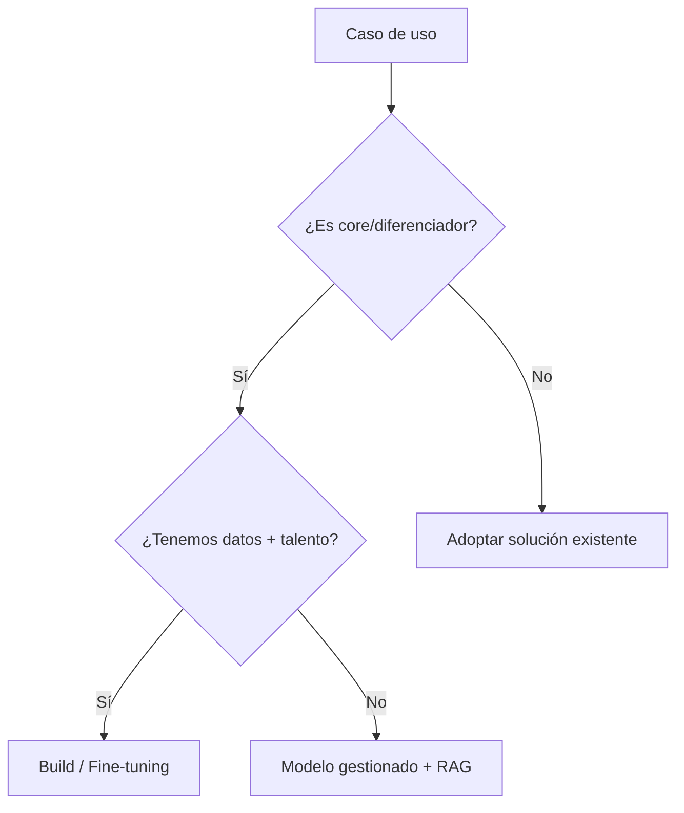

### 6.2 ⚖️ Comparación de enfoques

| Enfoque | Ventaja | Desventaja | Mejor uso |
|---------|---------|------------|-----------|
| **API gestionada (LLM)** | Velocidad, sin MLOps | Costo por uso, privacidad | Generativo genérico |
| **RAG sobre datos propios** | Precisión y trazabilidad | Requiere pipeline de datos | Asistentes internos |
| **Fine-tuning** | Comportamiento a medida | Datos etiquetados, costo | Tono/formalidad específica |
| **Modelo propio (from scratch)** | Diferenciación total | Muy costoso, riesgo alto | Ventaja competitiva clave |
| **Paquete SaaS vertical** | Rápido y probado | Menos flexible | Procesos estándar |
| **Híbrido** | Balance control/velocidad | Más piezas que gobernar | La mayoría de empresas |

### 6.3 🧮 Matriz de decisión (código)

```python
def choose_strategy(is_core: bool, has_data: bool, has_talent: bool,
                    needs_privacy: bool, time_to_market: str) -> str:
    if not is_core:
        return 'saas_vertical'
    if needs_privacy and has_data and has_talent:
        return 'modelo_propio_o_finetuning'
    if has_data and time_to_market == 'rapido':
        return 'rag_sobre_modelo_gestionado'
    if has_talent:
        return 'build_interno'
    return 'modelo_gestionado_con_supervision'


print(choose_strategy(is_core=True, has_data=True, has_talent=False,
                      needs_privacy=True, time_to_market='rapido'))
```

### 6.4 ❌ Errores comunes

| Error | Consecuencia | Prevención |
|-------|--------------|------------|
| Construir lo que existe | Gasto innecesario | Benchmark de SaaS primero |
| Comprar lo core | Sin diferenciación | Mapear core vs. contexto |
| Ignorar privacidad | Riesgo legal | Clasificar datos |
| Subestimar MLOps | Modelo muerto en prod | Presupuesto de operación |
| Sin salida (lock-in) | Dependencia total | Contratos y portabilidad |

## 🔌 PARTE 7: ARQUITECTURA E INTEGRACIÓN — LLEVAR EL MODELO A PRODUCCIÓN

### 7.1 📓 De notebook a sistema

Un modelo en un notebook no es un producto. La integración lo conecta con los sistemas existentes (CRM, ERP, web, app) mediante APIs y colas. La decisión de arquitectura afecta latencia, costo, control de riesgo y portabilidad.

```mermaid
flowchart LR
    A[Fuente de Datos] --> B[Feature Store]
    B --> C[Modelo / LLM]
    C --> D[API de Inferencia]
    D --> E[Orquestador de Negocio]
    E --> F[Sistemas (CRM/ERP/Web)]
    F --> G[Logs y Métricas]
    G --> H[Dashboard de Monitoreo]
    H --> D
```

### 7.2 🧠 Arquitectura RAG (Retrieval Augmented Generation)

El RAG combina un modelo generativo con una base de conocimiento externa. Es clave para aplicaciones empresariales que requieren precisión y trazabilidad.

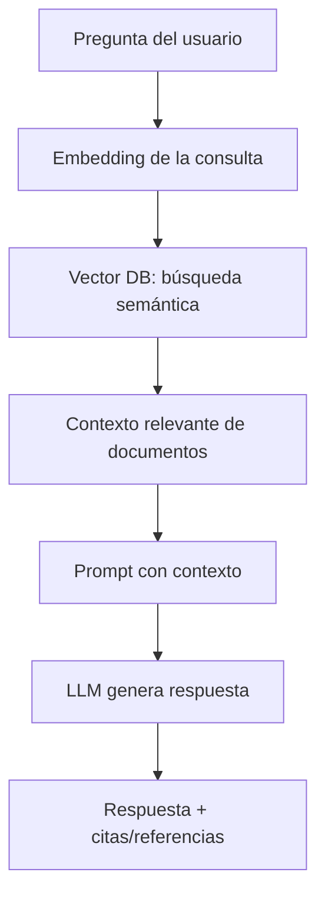

```python
# Esqueleto conceptual de un pipeline RAG (estilo LangChain)
#from langchain_community.vectorstores import FAISS
#from langchain_openai import OpenAIEmbeddings, ChatOpenAI
#from langchain.chains import RetrievalQA

#embeddings = OpenAIEmbeddings()
#vectorstore = FAISS.load_local("knowledge_index", embeddings)
#llm = ChatOpenAI(model="gpt-4o-mini", temperature=0)

#qa = RetrievalQA.from_chain_type(
#    llm=llm,
#    retriever=vectorstore.as_retriever(search_kwargs={"k": 4}),
#    return_source_documents=True,
#)

#result = qa.invoke({"query": "¿Cuál es la política de reembolso?"})
#print(result["result"])
#print([doc.metadata for doc in result["source_documents"]])
```

### 7.3 📐 Criterios de decisión de arquitectura

| Criterio | Pregunta clave | Peso |
|----------|----------------|------|
| **Latencia** | ¿Dependemos de milisegundos? | 20% |
| **Disponibilidad** | ¿Debe operar 24/7? | 20% |
| **Privacidad** | ¿Datos sensibles on-prem? | 25% |
| **Costo operativo** | ¿El beneficio paga la infra? | 15% |
| **Complejidad** | ¿El equipo puede mantenerlo? | 10% |
| **Portabilidad** | ¿Migrable de proveedor? | 10% |

### 7.4 ✅ Checklist de producción

| Check | Requisito |
|-------|-----------|
| Inferencia reproducible | Mismo input produce misma salida |
| Logs estructurados | Cada predicción con request_id |
| Versionado | Modelo y datos versionados |
| Rollback | Capacidad de volver atrás |
| Kill-switch | Apaga por degradación o anomalía |
| Alertas | Latencia, errores, drift |
| Backups | Config y estado recuperables |
| Shadow/Piloto | Validación antes de impacto total |
| Runbook | Procedimiento ante incidentes |

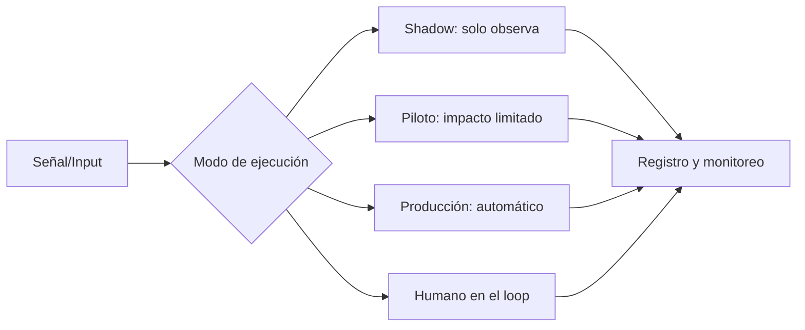

## 📡 PARTE 8: MONITOREO Y MLOps — QUE EL MODELO SIGA VIVO

### 8.1 📉 El modelo se degrada (model drift)

Los modelos de IA pierden precisión con el tiempo porque el mundo real cambia: nuevos productos, nuevos clientes, nuevos patrones. Esta degradación (*model drift*) es inevitable y requiere monitoreo y reentrenamiento periódico.

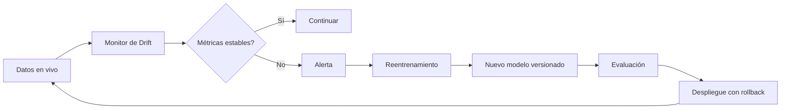

### 8.2 👀 Qué monitorear

| Señal | Qué indica | Acción |
|-------|-----------|--------|
| **Data drift** | Distribución de entrada cambió | Revisar fuente de datos |
| **Concept drift** | La relación input-output cambió | Reentrenar |
| **Latencia** | Degradación técnica | Escalar o migrar infra |
| **Tasa de error** | Calidad cayendo | Rollback a versión previa |
| **Uso real** | Adopción baja | Cambio de producto/formación |
| **Costo** | Infra fuera de presupuesto | Optimizar o renegociar |

### 8.3 📊 Monitor básico de drift (código)

```python
import numpy as np


def population_stability_index(expected: np.ndarray, actual: np.ndarray,
                               bins: int = 10) -> float:
    edges = np.histogram_bin_edges(expected, bins=bins)
    exp_counts, _ = np.histogram(expected, bins=edges)
    act_counts, _ = np.histogram(actual, bins=edges)
    exp_pct = (exp_counts + 1e-6) / (exp_counts.sum() + 1e-6)
    act_pct = (act_counts + 1e-6) / (act_counts.sum() + 1e-6)
    psi = np.sum((act_pct - exp_pct) * np.log(act_pct / exp_pct))
    return float(psi)


# Umbral orientativo: < 0.1 estable, 0.1-0.25 revisar, > 0.25 reentrenar
```

### 8.4 👥 Roles de MLOps

| Rol | Responsabilidad | Output |
|-----|-----------------|--------|
| **Data Engineer** | Pipelines y catálogo de datos | Datos listos y confiables |
| **Data Scientist** | Modelos y experimentos | Modelo versionado |
| **ML Engineer** | Empaquetado y despliegue | API de inferencia |
| **MLOps** | Monitoreo y reentrenamiento | Alertas y runbook |
| **Product Owner IA** | Valor y adopción | Roadmap y métricas |

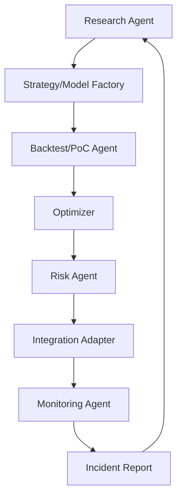

## 🛡️ PARTE 9: GOBERNANZA, ÉTICA Y ROADMAP A PRODUCCIÓN

### 9.1 🧭 La ruta no es lineal

Primero se valida la idea, luego se industrializa el pipeline, después se automatiza la ejecución y finalmente se monitorea la degradación. La gobernanza acompaña todo el camino.

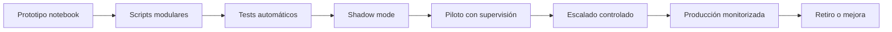

### 9.2 🗺️ Roadmap por etapas

| Etapa | Objetivo | Duración típica | Entregable |
|-------|----------|-----------------|------------|
| **Exploración** | Encontrar caso viable | 1–2 semanas | Brief de oportunidad |
| **Prototipo** | Validar señal básica | 1 semana | Notebook reproducible |
| **Industrialización** | Código modular | 1–2 semanas | Paquete interno |
| **PoC robusta** | Medir métricas reales | 1–2 semanas | Reporte vs. baseline |
| **Shadow mode** | Verificar sin impacto | 2–4 semanas | Logs comparativos |
| **Piloto** | Impacto limitado | 4–8 semanas | Monitoreo real |
| **Scale up** | Aumentar cobertura | Variable | Control de riesgo |
| **Retire** | Cerrar caso degradado | Cualquier momento | Post-mortem |

### 9.3 ⚖️ Gobernanza y ética

La IA puede heredar sesgos de los datos históricos y requiere supervisión en decisiones de alto impacto. Una política mínima incluye:

- 🔍 **Auditoría de sesgos** por segmento protegido (género, edad, zona).
- 🧠 **Explicabilidad** para decisiones de crédito, salud, RRHH y justicia.
- 🔐 **Consentimiento y privacidad** conforme a la normativa aplicable.
- 📌 **Trazabilidad** de datos y versiones de modelo.
- 🛑 **Kill-switch** y revisión humana obligatoria en decisiones críticas.
- 📄 **Documentación de limitaciones** para evitar uso indebido.

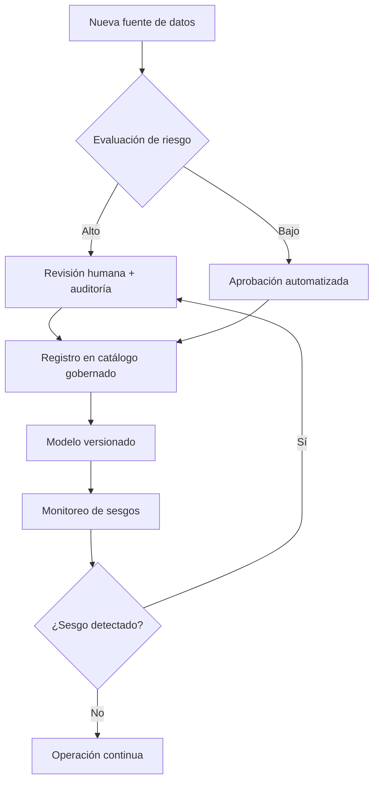

### 9.4 🤖 Prompt para Risk & Ethics Agent

```text
Actúa como responsable de riesgo y ética en IA.
Evalúa este caso:
- Área: {area}
- Tipo de decisión: {decision_type}
- Datos usados: {datos}
- Segmentos afectados: {segmentos}
- Impacto potencial: {impacto}
Entrega:
1. Riesgos principales (sesgo, privacidad, seguridad)
2. Controles obligatorios
3. Nivel de supervisión humana
4. Pruebas faltantes
5. Decisión: aprobar, aprobar con mitigaciones, rechazar
```

## 🎓 PARTE 10: I DO / WE DO / YOU DO — EJERCICIOS PROGRESIVOS

### 10.1 🟢 I Do — Diagnóstico de madurez guiado

**Objetivo:** calcular el score de madurez de tu organización antes de invertir.

| Paso | Acción | Resultado esperado |
|------|--------|--------------------|
| 1 | Listar las 7 dimensiones | Catálogo evaluado |
| 2 | Asignar score 0–5 | Vector de madurez |
| 3 | Calcular porcentaje | Score global |
| 4 | Determinar nivel | inicial / en desarrollo / avanzado |
| 5 | Detectar brechas | Dimensiones < 3 |
| 6 | Priorizar corrección | Plan de cimientos |

```python
assessment = AIReadinessAssessment(dimensions={
    'estrategia': 4, 'datos': 2, 'talento': 3, 'infraestructura': 4,
    'casos_uso': 3, 'cultura': 2, 'etica': 1,
})
print(assessment.score(), assessment.level(), assessment.gaps())
```

**Interpretación guiada:**

- Si `datos` y `etica` son bajos, no escales todavía: construye cimientos.
- Si la infraestructura es alta pero los datos bajos, el riesgo es "comprar la herramienta equivocada".
- Si `cultura` es baja, incluso un buen modelo no será adoptado.

### 10.2 🟡 We Do — Mapear oportunidades en equipo

**Escenario:** área de Atención al Cliente. El diagnóstico muestra datos de tickets históricos abundantes.

**Tarea colaborativa:** rankear casos con la matriz de automatización.

| Decisión | Opción recomendada | Justificación |
|----------|--------------------|---------------|
| Tecnología | NLP (clasificación) | Texto estructurado en histórico |
| Objetivo de negocio | Reducir tiempo de resolución | Impacto medible |
| Métrica de éxito | Tiempo medio -20% | Baseline claro |
| Supervisión | Revisión de baja confianza | Error de medio riesgo |
| Validación | Shadow + piloto | Sin impacto inicial |

```python
candidates = [
    TaskCandidate('Clasificar tickets', 5, 4, 4, 4, 4),
    TaskCandidate('Responder automático', 4, 3, 4, 3, 4),
    TaskCandidate('Predecir escalamiento', 4, 3, 4, 3, 3),
]
for c in sorted(candidates, key=lambda x: x.automation_score(), reverse=True):
    print(c.name, f"{c.automation_score():.0f}%")
```

### 10.3 🔵 You Do — Diseñar tu propio caso de IA

**Tarea:** elige un proceso real de tu organización y aplícale el framework completo.

Debes entregar:

- scorecard de madurez del área,
- matriz de automatización de 3 tareas,
- objetivo de negocio traducido a métrica,
- decisión build vs. buy justificada,
- plan de integración y monitoreo,
- controles de gobernanza/ética.

| Criterio | Peso |
|----------|------|
| Diagnóstico fundamentado | 20% |
| Priorización clara | 20% |
| Viabilidad de datos | 20% |
| Alineación de negocio | 25% |
| Gobernanza y monitoreo | 15% |

### 10.4 🟢 I Do — PoC con métricas conservadoras

**Objetivo:** entender cómo el baseline define si vale la pena avanzar.

| Escenario | Métrica modelo | Baseline | Resultado esperado |
|-----------|----------------|----------|--------------------|
| Ingenuo | 0.95 | 0.55 | Posible overfitting |
| Realista | 0.82 | 0.55 | Avanzar |
| Conservador | 0.60 | 0.58 | Iterar o rechazar |

```python
poc = PocResult('Clasificador tickets', 0.82, 0.55, 120000.0)
print(poc.uplift(), poc.verdict())
```

### 10.5 🟡 We Do — Interpretar impacto de negocio

**Caso:** un modelo mejora la precisión pero no reduce el costo operativo.

| Pregunta | Respuesta esperada |
|----------|--------------------|
| ¿Es suficiente la métrica técnica? | No |
| ¿Qué falta medir? | Costo, adopción, ciclo |
| ¿Qué riesgo existe? | Solución no usada |
| ¿Qué hacer? | Medir negocio en piloto |
| ¿Se automatiza? | Solo tras ROI positivo |

### 10.6 🔵 You Do — Monitoreo en producción

**Tarea:** diseña un dashboard mínimo para un modelo en producción.

| Widget | Métrica | Alerta |
|--------|---------|--------|
| Volumen | Predicciones/día | Caída > umbral |
| Latencia | ms por inferencia | > umbral |
| Drift | PSI de entrada | PSI > 0.25 |
| Error | Tasa de fallo | > umbral |
| Costo | $ infraestructura | > presupuesto |
| Adopción | Uso real | < 60% esperado |
| Sesgo | Disparidad por segmento | > umbral |

### 10.7 🏁 Cierre práctico

| Nivel | Debes poder hacer |
|-------|-------------------|
| **I Do** | Seguir un ejemplo completo de diagnóstico, PoC y decisión |
| **We Do** | Ajustar prioridades, interpretar métricas y decidir si avanzar |
| **You Do** | Aplicar el framework completo a un caso real de tu empresa |

## ✅ CHECKLIST FINAL DE GESTIÓN DE IA

| Bloque | Check |
|--------|-------|
| Madurez | Scorecard evaluado y brechas priorizadas |
| Datos | Fuente documentada, validaciones y gobernanza |
| Oportunidad | Tareas rankeadas con matriz y caso definido |
| PoC | Métricas vs. baseline, sin leakage, con walk-forward |
| Negocio | Objetivo traducido a métrica y ROI estimado |
| Build/Buy | Decisión justificada por core, datos y talento |
| Integración | API, versionado, rollback y runbook |
| Monitoreo | Drift, latencia, error, costo y adopción |
| Ética | Auditoría de sesgos, explicabilidad, kill-switch |
| Retiro | Criterios claros para pausar, ajustar o cerrar |

---

## 📝 PREGUNTAS DE VERIFICACIÓN

Responde cada pregunta basándote en los conceptos de esta masterclass. Escribe tus respuestas o compártelas para profundizar tu aprendizaje.

### Sobre Diagnóstico y Datos

1. **Aplica**: Si tu organización tiene infraestructura avanzada pero datos en nivel 2 y ética en nivel 1, ¿qué recomiendas y por qué?

2. **Analiza**: ¿Cómo afecta un sesgo de muestra en los datos históricos al comportamiento del modelo en producción? Propón una validación.

### Sobre Mapeo de Oportunidades

3. **Diseña**: Elige un proceso repetitivo de tu empresa y aplícale la matriz de automatización. ¿Qué score obtiene y por qué?

4. **Reflexiona**: ¿Qué riesgos consideras más relevantes al automatizar una tarea de alto costo de error? ¿Cómo lo mitigas?

### Sobre PoC y Validación

5. **Calcula**: Un clasificador alcanza F1 de 0.90 sobre la muestra de entrenamiento pero 0.55 fuera de muestra, mientras el baseline del proceso actual es 0.52. ¿Avanzas, iteras o rechazas? Justifica.

6. **Evalúa**: ¿Por qué es crucial separar entrenamiento y validación? ¿Qué sucede si no lo haces?

### Preguntas Integradoras

7. **Conecta**: Explica cómo la validación de negocio se relaciona con la decisión build vs. buy. ¿Qué pasaría si optimizas solo lo técnico?

8. **Propón un sistema**: Diseña un esquema de monitoreo para detectar degradación de un modelo en producción. ¿Qué alertas configurarías?

9. **Síntesis**: Toma un caso de tu empresa y aplícale el framework completo: desde diagnóstico hasta gobernanza. Identifica los puntos críticos.

10. **Reflexión final**: De las 9 fases del workflow, ¿cuál consideras más crítica para evitar fracasos en producción? Justifica tu respuesta.

---

## 📚 GLOSARIO RÁPIDO

| Término | Definición |
|---------|------------|
| **IA** | Disciplina que busca que máquinas simulen capacidades cognitivas humanas |
| **Machine Learning** | Subcampo donde sistemas aprenden patrones desde datos sin reglas explícitas |
| **Deep Learning** | ML basado en redes neuronales profundas para datos no estructurados |
| **NLP** | Procesamiento de lenguaje natural: comprender y generar texto |
| **Computer Vision** | Interpretación de imágenes y video por máquinas |
| **RAG** | Retrieval Augmented Generation: modelo generativo + base de conocimiento externa |
| **Model drift** | Degradación del modelo por cambios en datos del mundo real |
| **Leakage** | Uso accidental de información del futuro o del conjunto de prueba |
| **Baseline** | Métrica del proceso actual que el modelo debe superar |
| **PoC** | Prueba de concepto: versión simplificada para validar viabilidad |
| **MLOps** | Prácticas para operar modelos en producción de forma continua |
| **Kill-switch** | Mecanismo para detener el modelo ante degradación o anomalía |
| **Build vs. Buy** | Decidir entre desarrollar internamente o adoptar solución existente |
| **Human in the loop** | Supervisión humana obligatoria en decisiones de impacto |

---

## 📐 ANEXO: FORMATO IDEAL PARA ARTÍCULOS EDUCATIVOS

### Ancho recomendado para lectura larga

El ancho óptimo para artículos educativos es **60–75 caracteres por línea** (incluyendo espacios), lo que equivale aproximadamente a `max-width: 65ch` en CSS (550–750 px de contenido). Esto reduce la fatiga visual y mejora la comprensión de conceptos complejos.

```css
.article-content {
  max-width: 65ch;
}
```

### Lo que hace agradable una guía al cerebro

- 🧱 **Estructura escaneable**: títulos, tablas y listas que permiten ubicarse rápido.
- 🗺️ **Mapas visuales**: diagramas (mermaid) que muestran el flujo antes de entrar en detalle.
- 💻 **Ejemplos ejecutables**: código pequeño y real que el lector puede probar.
- 🪜 **Progresión I Do / We Do / You Do**: del ejemplo guiado a la práctica independiente.
- ✅ **Cierres de verificación**: preguntas y checklist que fijan el aprendizaje.

---

*Guía elaborada a partir del programa "Inteligencia Artificial: Gestión de Proyectos y Ventanas de Aplicación" — Escuela de Negocios, Educación Ejecutiva, Universidad Torcuato Di Tella (dirección académica: Edgar Altszyler).*
*Más información: utdt.edu/educacionejecutiva*
