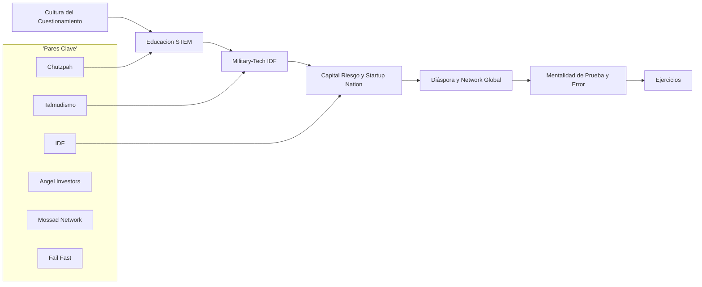
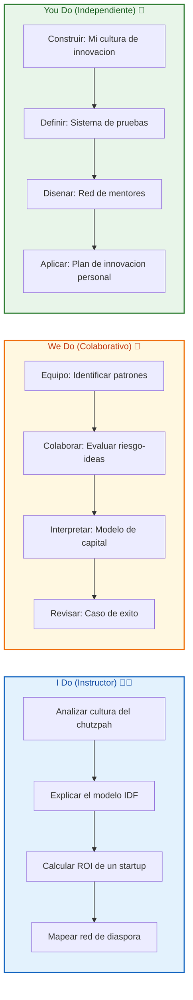
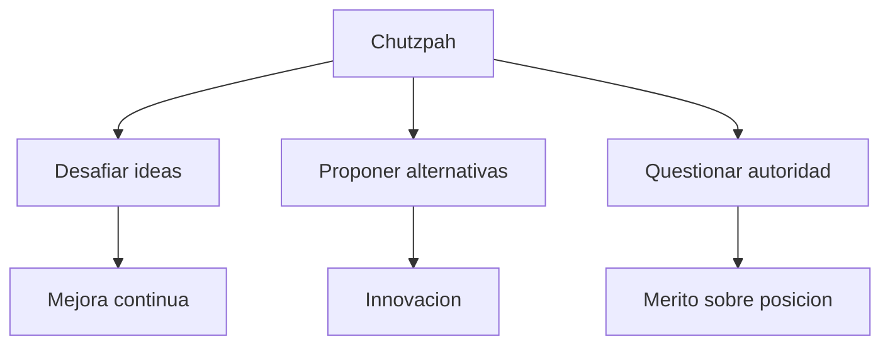
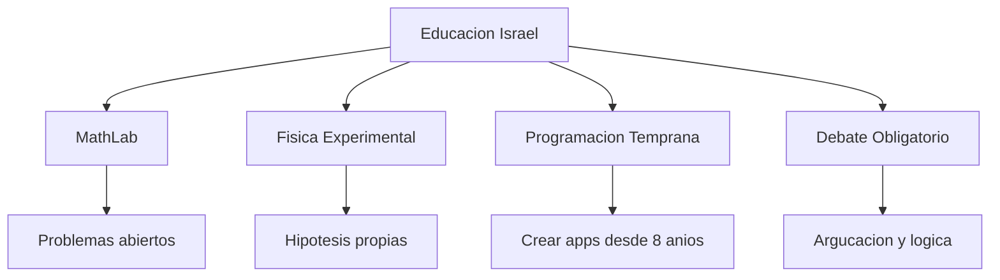
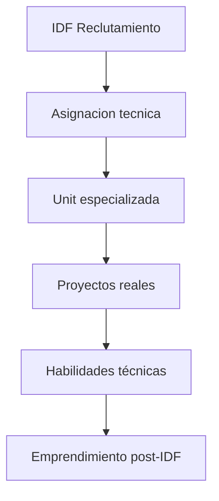
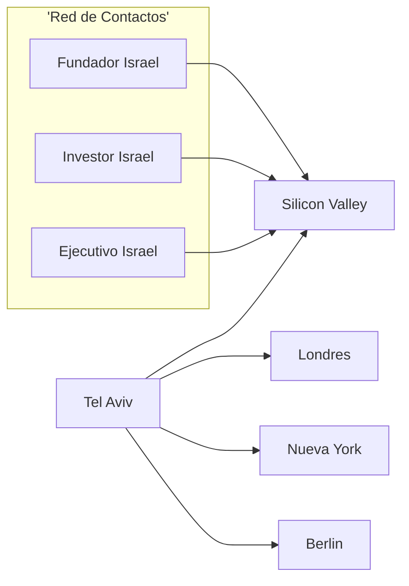
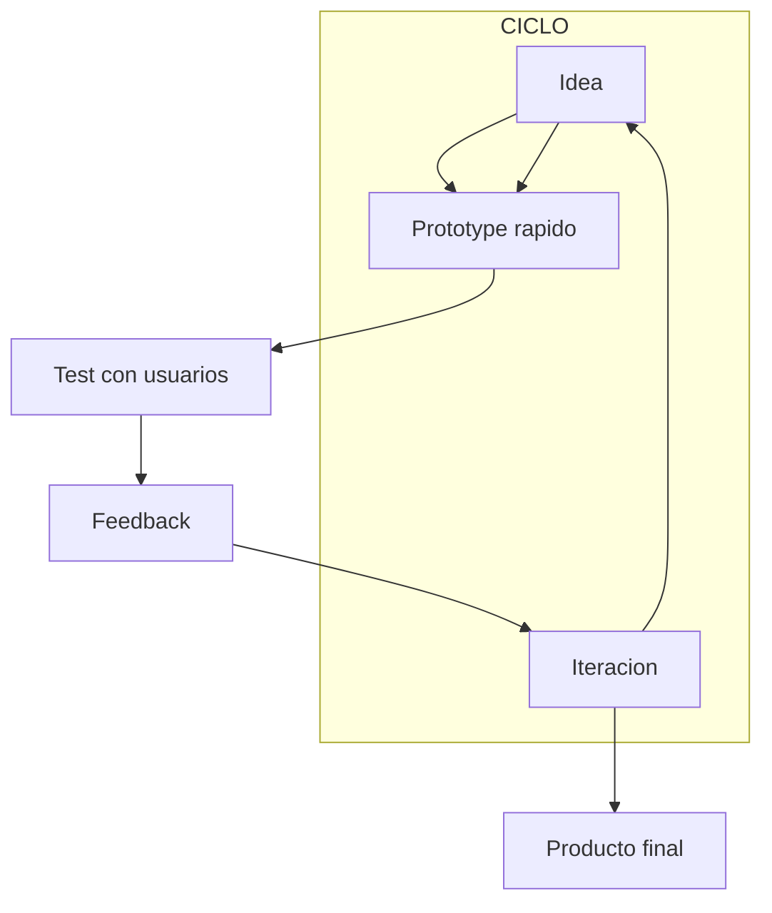

# MASTERCLASS: El Sistema Israelí de Innovación — Cómo un País de 9 MILLONES domina la Ciencia, la Tecnología y el Conocimiento

## INTRODUCCIÓN: POR QUÉ ESTE MASTERCLASS ES DIFERENTE

Israel no nació con ventaja. En 1948, un Estado joven, rodeado de enemigos, con un clima hostil y pocos recursos naturales. Hoy, es el **país con más startups por habitante**, líder mundial en ciberseguridad, agritech, medicina y defensa tecnológica. Produce más empresas unicornio per cápita que Silicon Valley.

La diferencia no está en un "gen". Está en un **sistema** — una combinación única de cultura, educación, ejército, capital riesgo y mentalidad.

Este masterclass propone otro camino: en vez de admirar desde afuera, entender los **mecanismos** que hacen funcionar a Israel. Si entendés cómo piensan, cómo fallan y cómo se levantan, podés aplicar esos patrones en cualquier contexto.

> **Objetivo de Aprendizaje** — Al final de esta guía, entenderás: la cultura del cuestionamiento y la "agitación constructiva", el poder del servicio militar tecnológico (IDF), el modelo de educación STEM temprana, la importancia del capital riesgo israelí, el efecto de la "red de diáspora", y cómo replicar la mentalidad de "prueba, falla, itera, escala".

> **Advertencia educativa** ⚠️ — Este contenido es formativo y descriptivo. La cultura israelí es compleja y hay críticas importantes sobre igualdad, género y conflictos regionales. Esta guía se enfoca en el **sistema de innovación**, no en juzgar la política de un país.

---

## MAPA DEL MASTERCLASS 🗺️



| Fase | Pregunta que responde | Output principal |
|------|-----------------------|------------------|
| **Cultura** | ¿Por qué cuestionan todo? | Mentalidad de desafío |
| **Educación** | ¿Cómo forman tan buenos? | STEM + pensamiento crítico |
| **Military-Tech** | ¿Cómo surge la innovación? | IDF como escuela de tecnología |
| **Capital Riesgo** | ¿Quién invierte en las ideas? | Ecosistema de VC israelí |
| **Network Global** | ¿Cómo escalan el mundo? | Diáspora y mentoría |
| **Mentalidad** | ¿Qué los hace diferentes? | Fallar rápido y aprender |
| **Ejercicios** | ¿Lo puedo aplicar? | I Do / We Do / You Do |



---

## PARTE 1: CULTURA DEL CUESIONAMIENTO — "CHUTZPAH" Y LA MENTALIDAD DE DESAFÍO

### 1.1 El concepto de Chutzpah

**Chutzpah** (जुतसpaH) es una palabra yídova que significa "audacia" o "valor para cuestionar". No es solo atreverte a hablar: es cuestionar autoridades, sistemas y "hechos establecidos". En Israel, un niño de 12 años puede desafiar a un profesor sin represalias. En otros países, eso es insubordinación.

| Comportamiento ❌ (otros países) | Comportamiento ✅ (Israel) |
|--------------------------------|----------------------------|
| Callar ante una idea mala | Proponer una idea mejor |
| Respeta la jerarquía | Respeta el mérito |
| "Eso no se hace así" | "¿Por qué no podría funcionar así?" |
| Miedo al fracaso | Curiosidad por el fracaso |



### 1.2 El legado del Talmud: el arte del debate

El **Talmud** es un texto religioso judío que enseña mediante **debate y contrademandas**. Durante horas, estudiantes discuten, refutan y reconstruyen argumentos. No hay una "respuesta correcta": hay una "mejor argumentación".

> **La frase del profe** 🌟 — *"No le creas a nadie. Pregúntale a todo el mundo. Si no puedes explicarlo en tus propias palabras, no lo entendiste."*

Esto genera una cultura donde:
- **El cuestionamiento** es un deber, no un ataque.
- **La evidencia** vale más que la autoridad.
- **La discusión** es una herramienta de aprendizaje, no de conflicto.

### 1.3 Agitación constructiva

En Israel se valora la **"agitación constructiva"** (alagonut): discutir con pasión, pero siempre con la intención de mejorar, no de derrotar. Un debate en un cubicle de Google Tel Aviv puede sonar a una pelea: gritos, gestos, pero al final salen 3 ideas nuevas.

| Escenario | Dinámica típica |
|-----------|-----------------|
| **Meeting de startup** | "Tu algoritmo es una mierda, pero mira este otro approach" |
| **Discusión en familia** | "Papá, tu negocio está moribundo, ayudame a reconstruirlo" |
| **Código en producción** | "Este PR es un desastre, pero tengo 3 alternativas mejores" |

> **Tip** 💡 — La agitación constructiva requiere **empatía**. Se critique la idea, no la persona. Se cuestiona con intención de ayudar, no de humillar.

### 1.4 I Do — Aplicar el chutzpah a un problema cotidiano

**Problema:** tu jefe propone una estrategia que sabés que no va a funcionar.

| Paso | Acción | Resultado |
|------|--------|-----------|
| 1 | **Cuestionar con respeto** | "¿Qué pasa si el usuario no la usa así?" |
| 2 | **Proponer alternativa** | "He visto que X funciona mejor en Y contexto" |
| 3 | **Ofrecer probarla** | "Podemos testear en 2 semanas con 100 usuarios" |
| 4 | **Aceptar el resultado** | Si funciona, celebramos. Si no, aprendemos |

---

## PARTE 2: EDUCACIÓN STEM — FORMAR PENSADORES, NO REPETIDORES

### 2.1 La fuerza del sistema educativo

Israel llega a los top de PISA y TIMSS en matemática y ciencias. Pero no se debe a memorización: se debe a un sistema que valora el **pensamiento crítico** y la **resolución de problemas**.

| Elemento | Enfoque israelí | Enfoque tradicional |
|----------|-----------------|---------------------|
| **Matemática** | Problemas abiertos, múltiples soluciones | Fórmulas memorizadas |
| **Ciencias** | Experimentos propios, hipótesis | Teoría y ejercicios |
| **Programación** | Desde los 8 años, crear apps | Usar software listo |
| **Debate** | Discusión obligatoria, argumentos | Exposición individual |



### 2.2 MathLab y la revolución del aprendizaje activo

El **modelo MathLab** israelí no da respuestas: da problemas abiertos. Un alumno de 14 años no memoriza el teorema de Pitagoras: debe descubrir cómo calcular la distancia entre dos ciudades usando un mapa.

| Característica | Descripción |
|----------------|-------------|
| **Problema real** | "¿Cómo ayudo a un delivery a ahorrar tiempo?" |
| **Múltiples soluciones** | Geometría, álgebra o programación |
| **Trabajo en equipo** | 4 amigos discuten estrategias |
| **Presentación** | Defienden su método ante la clase |
| **Iteración** | Se corrigen, se mejora, se vuelve a presentar |

> **Tip** 💡 — El secreto israelí: **el error es el punto de partida**, no el fracaso. Si un alumno propone una solución equivocada pero con lógica, se celebra. Se corrige el razonamiento, no se reprueba al alumno.

### 2.3 Programación desde los 8 años

Israel introdujo programación en primaria antes que la mayoría de los países. No para que "saben usar computadoras": para que aprendan a **pensar en algoritmos**.

| Edad | Habilidad | Ejemplo |
|------|-----------|---------|
| 8 años | Secuencias básicas | Un "programa" para hacer un sándwich |
| 10 años | Condicionales | "Si llueve, toma paraguas" |
| 12 años | Loops y funciones | "Repite esto hasta que X pase" |
| 14 años | Proyectos reales | Crear una app para organizar la escuela |

### 2.4 We Do — Evaluar un sistema educativo

**Escenario:** tu hijo propone un proyecto de ciencias: "Quiero medir la radiación de todos los routers del barrio".

| Paso | Acción del padre/madre israelí | Pregunta clave |
|------|-------------------------------|----------------|
| 1 | Escuchar con interés | "¿Qué hipótesis planteas?" |
| 2 | Pedir evidencia | "¿Cómo vas a medir la radiación?" |
| 3 | Proponer mejora | "¿Qué pasa si comparas con normas internacionales?" |
| 4 | Conectar con expertos | "¿Conocés a un ingeniero que te ayude?" |

**Conclusión:** el apoyo no es "mejor nota": es ayudar a estructurar la curiosidad.

---

## PARTE 3: EL IDH — LA ESCUELA DE TECNOLOGÍA MILITAR

### 3.1 ¿Qué es el IDF?

Las fuerzas armadas israelíes (IDF — Israel Defense Forces) no son solo un ejército: son una **fábrica de ingenieros, científicos y emprendedores**. El 85% de los israelíes jóvenes sirven en el ejército, y muchos de los mejores técnicos terminan en unidades especiales de tecnología.

| Unidad | Función | Habilidad que desarrolla |
|--------|---------|--------------------------|
| **8200** | Inteligencia y señales | Big data, ciberseguridad, análisis de datos |
| **9000** | Desarrollo de software | Ingeniería de software, DevOps |
| **9900** | Drones y satélites | Robótica, visión por computadora |
| **Military Intelligence** | Análisis de amenazas | Machine learning, NLP |



### 3.2 El efecto "8200": de la inteligencia al emprendimiento

La unidad 8200 es famosa por convertir jóvenes con potencial intelectual en expertos en ciberseguridad y big data. Muchos de sus ex miembros fundan startups tecnológicas.

| Startup | Exmiembros de 8200 | Tecnología |
|--------|-------------------|------------|
| **Waze** | Varios | GPS crowdsourced |
| **Mobileye** | Varios | Visión computar para autos |
| **CyberArk** | Fundadores ex-8200 | Ciberseguridad |
| **AppsFlyer** | Fundadores ex-8200 | Analytics móviles |

> **Tip** — El IDF no enseña a "seguir órdenes". Enseña a **resolver problemas bajo presión** con recursos limitados. La cultura es: "¿Cómo lo arreglamos?" no "¿Quién es el responsable?".

### 3.3 Principios del IDF que todo emprendedor puede aplicar

| Principio israelí | Aplicación empresarial |
|-------------------|----------------------|
| **Improvisar** | Usar lo que tenés a mano, no lo ideal |
| **Adaptar** | Cambiar de táctica sin perder la meta |
| **Mejorar** | Optimizar cada proceso, por pequeño que sea |
| **Actuar en equipo** | Comunicación clara, responsabilidad compartida |

### 3.4 I Do — Aplicar el modelo IDF a un proyecto

**Problema:** necesitás lanzar una app con un equipo de 3 personas y $0 presupuesto.

| Paso IDF | Aplicación |
|----------|------------|
| 1. **Improvisar** | Usar herramientas open source y templates |
| 2. **Adaptar** | Lanzar MVP con 3 funciones clave, no 20 |
| 3. **Mejorar** | Medir uso con analytics y optimizar |
| 4. **Actuar** | Lanzar a 100 usuarios, recibir feedback, iterar |

**Resultado:** con $0 y 3 personas, lanzás una app funcional en 2 semanas en lugar de 6 meses.

---

## PARTE 4: STARTUP NATION — EL ECO SISTEMA DE CAPITAL RIESGO

### 4.1 El ecosistema israelí de inversión

Israel tiene **más VC per cápita** que cualquier otro país. Pero no es solo cantidad: es **calidad de red**. Los inversores israelíes (llamados "angels") no invierten solo dinero: invierten **conocimiento** y **conexiones**.

| Métrica | Israel | Silicon Valley |
|---------|--------|----------------|
| Startups per cápita | 1/2.000 habitantes | 1/5.000 habitantes |
| VC inversión per cápita | $400/habitante | $300/habitante |
| Emprendedores con experiencia previa | 70% | 40% |
| Mentors por startup | 15 | 5 |

### 4.2 El modelo "angels con conocimiento"

En Israel, un "angel" típico no es un millonario: es un **ex-fundador exitoso** que vende su empresa, y ahora invierte en la siguiente generación. El 90% de sus inversiones incluyen **mentoring activo**, no solo dinero.


### 4.3 La mentalidad "Fail Fast, Learn Fast"

En Israel, **fracasar es socialmente aceptable** si aprendés de ello. Un emprendedor que cierra su startup y abre otra es "experimentado", no "fracasado". La frase es: "No murió, aprendió y se fue."

| Evento ❌ (otros países) | Evento ✅ (Israel) |
|------------------------|------------------|
| Startup cierra | "Buen intento, ¿qué aprendiste?" |
| Pivote de negocio | "Inteligente, seguís iterando" |
| Error técnico | "Bug identificado, sistema mejorado" |
| Duplicar esfuerzos | "Validaste que el mercado existe" |

> **Tip** — El "fail fast" no es apresurar el fracaso: es **acelerar el aprendizaje**. Lanzar rápido, medir, iterar. Cada ciclo te acerca a una solución que funcione.

### 4.4 We Do — Evaluar una oportunidad de inversión

**Escenario:** un amigo propone una app de delivery de comida casera. La inversión requerida es $100.000.

| Factor | Evaluación israelí |
|--------|-------------------|
| **Tamaño del mercado** | ¿Hay 10.000 potenciales clientes? |
| **Barrido del problema** | ¿Es un dolor real o un lujo? |
| **Competencia existente** | ¿Ya probaste alternativas? |
| **Velocidad del equipo** | ¿Pueden lanzar en 6 semanas? |
| **Iteración prevista** | ¿Qué datos van a medir en la primera semana? |

| Paso | Acción | Resultado esperado |
|------|--------|-------------------|
| 1 | Validar con 10 clientes antes de código | Confirmar demanda real |
| 2 | MVP en 2 semanas: landing page + formulario | Medir interés sin construir |
| 3 | Iterar con feedback de los primeros usuarios | Ajustar propuesta de valor |
| 4 | Solo invertir después de métricas positivas | $0 arriesgado sin validación |

---

## PARTE 5: DÍA SPORA Y NETWORK GLOBAL — LA FUERZA DE LA RED

### 5.1 La diáspora israelí como ventaja competitiva

Israel tiene una **diáspora de 7 millones** (casi tanta como su población interna). Muchos de estos israelíes viven en Silicon Valley, Londres, Berlín y Nueva York. Son **embajadores** del ecosistema israelí.

| Ciudad | Israelíes destacados | Rol |
|--------|---------------------|-----|
| **Silicon Valley** | Miles | Fundadores, inversores, execs de tech |
| **Nueva York** | Cientos | Finanzas, medios, healthcare |
| **Londres** | Cientos | Fintech, legal, consultoría |
| **Tel Aviv** | Base central | Coordinación y conexión |



### 5.2 El poder del "warm intro"

En Israel, nada funciona sin una **conexión personal**. Un email frío tiene ~2% de respuesta. Un "warm intro" (introducción por alguien conocido) tiene ~60%. La cultura del warm intro se basa en **confianza previa**.

> **La frase del profe** 🌟 — *"En Israel no vendés un producto. Vendés una historia contada por alguien en quien confío."*

### 5.3 Israel Global: abrir puertas con la bandera

Un fundador israelí llega a una reunión en Menlo Park y la primera frase es: "Soy de Israel, de la cohorte Talpiot/IDF". Eso activa un **network effect**. El inversor piensa: "Si sobreviviste al IDF, sobrevivirás a un startup".

| País | Percepción israelí | Resultado |
|------|-------------------|-----------|
| **EE.UU.** | "Hackers brillantes" | Fácil acceso a VC |
| **Europa** | "Pioneros de ciberseguridad" | Facilita regulaciones |
| **Asia** | "Expertos en agua y agricultura" | Oportunidades en AgriTech |

### 5.4 I Do — Construir un network desde cero

**Objetivo:** un emprendedor de Latinoamérica quiere conectar con el ecosistema israelí.

| Paso | Acción concreta | Herramienta |
|------|-----------------|-------------|
| 1 | Asistir a un meetup tech local | Meetups en CDMX, Santiago, BUE |
| 2 | Contribuir valor en redes | Twitter/X: compartir insights |
| 3 | Buscar "warm intro" | LinkedIn: "conocés a alguien de Israel?" |
| 4 | Aplicar a programas de aceleración | The Junction, MassChallenge Israel |
| 5 | Visitar Israel (hasta 90 días sin visa) | Hackathons y eventos |

**Clave:** el network no se construye "pidiendo favores". Se construye **dando valor primero**.

---

## PARTE 6: LA MENTALIDAD DE "PRUEBA Y ITERA" — APRENDER HACIENDO

### 6.1 El cultivo de la curiosidad práctica

En Israel no se valora el "saber teórico". Se valora el **"hacer"**. Un ingeniero que te dice "esto no funciona" es más respetado que uno que te dice "teóricamente debería funcionar".

| Aproximación ❌ (teórica) | Aproximación ✅ (práctica) |
|--------------------------|---------------------------|
| "La teoría dice que..." | "Probé y pasó esto..." |
| "Debería funcionar" | "Funcionó en este escenario, no en otro" |
| "Es complicado" | "¿Cómo lo hacemos más simple?" |



### 6.2 El "scratching your own itch"

Muchas startups israelíes nacen de un **problema personal**. El fundador lo vivió, lo siente, y lo resuelve. Esto da autenticidad y valida rápidamente la demanda.

| Startup | Problema personal que resolvió |
|--------|-------------------------------|
| **Waze** | "No encuentro el camino más rápido" |
| **Mobileye** | "Necesito evitar choques en laautopista" |
| **RedisLabs** | "Mi app es demasiado lenta" |
| **Monday.com** | "Nuestro equipo no se comunica" |

> **Tip** — El secreto israelí: **si vos tenés el problema, otros lo tienen también**. No busques problemas "grandes". Sino problemas que te molesta lo suficiente como para resolverlos vos mismo.

### 6.3 La tolerancia al "no terminado"

En Israel, lanzar algo "incompleto" es normal. Se valora más un **producto que funciona** que uno "perfecto" que nunca sale. La diferencia es:

| Concepto | Israel | Otro enfoque |
|----------|--------|-------------|
| **MVP** | "Usalo, rompe, avísame" | "Perfecto, listo para producción" |
| **Roadmap** | Flexible, prioridad al feedback | Rígido, funcionalidades planeadas |
| **Calidad** | "Suficiente para aprender" | "Sin bugs visibles" |

### 6.4 I Do — Construir una mentalidad de prueba

**Problema:** un emprendedor quiere lanzar un curso de marketing digital, pero "todavía no está terminado".

| Paso | Acción israelí | Resultado |
|------|----------------|-----------|
| 1 | Definí 3 conceptos claves | Mínima versión del curso |
| 2 | Grabá 3 videos cortos | Contenido para validar |
| 3 | Subí a YouTube + WhatsApp | Test con 20 personas |
| 4 | Recibí feedback | Iteré el contenido |
| 5 | Escalarías gradualmente | Base de estudiantes reales |

**Resultado:** en lugar de 6 meses de curso "perfecto", tenés 3 lecciones validadas en 2 semanas y 20 estudiantes reales.

---

## PARTE 7: CASOS DE ÉXITO — CLASES PRÁCTICAS DE INNOVACIÓN

### 7.1 Waze: de la app de radio a centenas de millones

Waze nació como un proyecto de un radioaficionado israelí. No era un "gigante planeado": era un hobby. Pero el fundador aplicó los principios israelíes:

| Fase | Principio israelí aplicado | Resultado |
|------|---------------------------|-----------|
| Hobby inicial | "Scratching your own itch" | App nace de necesidad personal |
| MVP comunitario | "Fail fast, iterate" | Feedback constante de usuarios |
| Pivot a GPS | "Adaptar y mejorar" | Mejoró con datos de usuarios reales |
| Venta a Google | "Network global" | $1.1.000 millones en efectivo |

> **Frase del profe** 🌟 — *"Waze no nació pensando en venderse a Google. Nació pensando en ayudar a un radioaficionario a no perderse en el tráfico de Tel Aviv."*

### 7.2 CyberArk: de la ciberseguridad militar al Fortune 500

CyberArk nació de la necesidad del IDF de proteger sistemas críticos. Los fundadores eran ex-miembros de unidades de ciberseguridad.


### 7.3 We Do — Comparar el ecosistema israelí con el local

**Escenario:** analizando el ecosistema de startups en Latinoamérica.

| Factor | Israel | Latinoamérica | Diferencia clave |
|--------|--------|---------------|------------------|
| **Cultura del fracaso** | Aceptado, hasta celebrado | Estigmatizado | Israel: "Aprendiste"; LATAM: "Fracasaste" |
| **Warm intros** | Dominan | Relaciones familiares | Israel: "Valor"; LATAM: "Confianza" |
| **Capital riesgo** | 1:15 personas | 1:500 personas | Más inversión per cápita |
| **Tiempo de validación** | 2-3 meses | 6-12 meses | Israel: "Itero rápido" |
| **Salida internacional** | Estrategia día 1 | Estrategia día 1000 | Israel: "Piensas global desde el inicio" |

---

## PARTE 8: I DO / WE DO / YOU DO — EJERCICIOS PROGRESIVOS

### 8.1 I Do — Aplicar el chutzpah a una idea 👨‍🏫

**Problema:** tu jefe propone una estrategia que sabés que tiene un problema obvio.

| Paso | Acción israelí | Resultado |
|------|----------------|-----------|
| 1 | Preguntá "¿Y si...?" con curiosidad | Abrís un debate, no una confrontación |
| 2 | Propusiste una alternativa | "He visto que X funcionó en Y contexto" |
| 3 | Ofrecés probarla pequeño | "Podemos validar en 1 sprint" |
| 4 | Aceptás el resultado | Si no funciona, el "error" se celebra como aprendizaje |

### 8.2 We Do — Diseñar un MVP israelí 🤝

**Tarea:** tenés una app de delivery de comida casera.

| Paso | Acción | Output |
|------|--------|--------|
| 1 | Identificar "scratch" personal | ¿Tenés hambre y no hay delivery? |
| 2 | MVP en 48 horas | Landing page + WhatsApp |
| 3 | Validar con 10 personas | Mensajes de WhatsApp reales |
| 4 | Iterar con feedback | Mejorar propuesta de valor |

| Criterio | Pregunta |
|----------|----------|
| **Problema real** | ¿Vivís el dolor que resolvés? |
| **Validación rápida** | ¿Podés probar con 5 personas esta semana? |
| **Warm intro** | ¿Conocés a alguien que tenga el problema? |
| **Iteración** | ¿Qué cambiarías después del feedback? |

### 8.3 You Do — Construir tu propio "ecosistema israelí" 💪

**Tarea:** diseñá un plan para aplicar mentalidades israelíes en tu contexto (trabajo, estudio, emprendimiento).

| Paso | Acción concreta | Timeline |
|------|-----------------|----------|
| 1 | Identificar tu "scratch" | 1 día |
| 2 | Crear un MVP funcional | 7 días |
| 3 | Encontrar tu primeros "mentores" | 14 días |
| 4 | Buscar warm intros | 30 días |
| 5 | Iterar con feedback real | Ongoing |

| Criterio de evaluación | Peso |
|------------------------|------|
| Define un problema personal real | 20% |
| MVP lo suficientemente simple para construir rápido | 20% |
| Identifica al menos 3 potenciales mentores | 20% |
| Diseña un plan de warm intros | 20% |
| Plan de iteración con métricas | 20% |

---

## CHECKLIST FINAL DEL SISTEMA ISRAELÍ ✅

| Bloque | Check |
|--------|-------|
| **Cultura** | Aplicas chutzpah: cuestionás con respeto y proponés |
| **Educación** | Aprendés haciendo, no memorizando |
| **Military-Tech** | Improvisás, adaptás y actuás bajo presión |
| **Ecosistema** | Buscás warm intros, no emails fríos |
| **Mentalidad** | Fallar rápido para aprender más rápido |
| **Network** | Das valor antes de pedir favores |
| **Ejercicios** | I Do / We Do / You Do completados |

---

## PREGUNTAS DE VERIFICACIÓN 📝

### Preguntas sobre cultura y mentalidad
1. **Aplica:** ¿Pudiste identificar un momento en la semana donde aplicarías el "chutzpah" para mejorar algo en tu trabajo o estudio?
2. **Analiza:** ¿Qué diferencia ves entre "aguantar la discusión" en tu cultura y la "agitación constructiva" israelí?

### Preguntas sobre el ecosistema
3. **Diseña:** Si tuvieras que replicar el modelo IDF de "resolver problemas bajo presión", ¿cómo lo harías en tu universidad o trabajo?
4. **Reflexiona:** ¿Por qué el "fail fast" funciona mejor en Israel que en otros países? ¿Qué cambiaría en tu cultura para aceptar el fracaso?

### Preguntas sobre network y salida global
5. **Calcula:** Tenés 5 contactos directos y cada uno conoce a 5 personas. Escribe un plan de 3° de separación para llegar a un emprendedor israelí.
6. **Evalúa:** ¿Qué harías diferente si en lugar de buscar "warm intros" escribas 100 emails fríos?

### Preguntas integradoras
7. **Conecta:** Explicá cómo la educación basada en "problemas abiertos" del Talmud se relaciona con el "fail fast" del ecosistema de startups.
8. **Propón:** Diseñá un programa de 30 días para convertir tu mentidad de "tengo miedo de fracasar" a "quiero probar y aprender".
9. **Síntesis:** Tomá un proyecto actual tuyo y aplicale el ciclo israelí: Improvisar → Adaptar → Mejorar → Actuar. ¿Qué cambiarías?
10. **Reflexión final:** Del sistema israelí completo (cultura, educación, IDF, VC, network, mentalidad), ¿cuál considerás el pilar más difícil de replicar en Latinoamérica y por qué?

---

## GLOSARIO RÁPIDO 📖

| Término | Definición |
|---------|------------|
| **Chutzpah** | Audacia para cuestionar y proponer |
| **Talmud** | Texto judío de debate argumentativo |
| **IDF** | Israel Defense Forces (ejército israelí) |
| **Unit 8200** | Unidad de ciberseguridad del ejército israelí |
| **Startup Nation** | Apodo de Israel por su densidad de startups |
| **Angel Investors** | Inversores ángeles (ex-fundadores) |
| **Diáspora** | Comunidad israelí fuera del país |
| **Warm Intro** | Introducción personal (no fría) |
| **Fail Fast** | Fallar rápido para aprender rápido |
| **MVP** | Produdo Mínimo Viable |
| **Scratch** | "Rascar tu propio pic" = problema personal |
| **Agitación constructiva** | Discutir para mejorar, no para derrotar |

---

## ANEXO A: FORMATO IDEAL PARA APRENDER ESTADÍSTICA 🧠

### Recomendaciones de ancho para lectura larga

El ancho óptimo para artículos educativos es **60–75 caracteres por línea**.

```css
.article-content {
  max-width: 65ch;
  line-height: 1.75;
  font-size: 18px;
}
```

### Lo que hace agradable una guía al cerebro 🧠

- **Ejemplos reales** anclan conceptos abstractos en casos concretos.
- **Casos de éxito** concretos muestran el patrón aplicado al mundo real.
- **Tablas comparativas** facilitan el contraste rápido.
- **Ejercicios progresivos** (I Do / We Do / You Do) construyen confianza.
- **Glosario y checklist** permiten repaso rápido.

> **Frase del profe** 🌟 — *"La innovación no es un don: es un sistema. Israel no es más listo: es más sistemático. Y el sistema se puede aprender."*

---

## ANEXO B: CÓMO APLICAR ESTOS PRINCIPIOS EN LATINOAMÉRICA 🇱🇦

### Adaptación del ecosistema israelí

| Elemento israelí | Adaptación LATAM |
|------------------|------------------|
| **Chutzpah** | Normalizar el feedback directo (con empatía) |
| **Educación STEM** | Enfatizar proyectos reales, no solo exámenes |
| **IDF tecnológico** | Crear "hackathons sociales" con problemas reales |
| **VC activo** | Buscar mentors, no solo inversión |
| **Diáspora** | Conectar con la comunidad LATAM en el exterior |
| **Fail fast** | Celebrar el aprendizaje, no el resultado |
| **Warm intros** | "Conocés a alguien que..." en vez de enviar CV |
| **Scratch personal** | Emprender desde tus propios dolores, no de "modas" |

### Primeros pasos esta semana

1. **Identifica tu scratch** — ¿qué te molesta lo suficiente como para resolverlo?
2. **Crea un MVP** — ¿puedes validar la idea en 48 horas?
3. **Busca un warm intro** — ¿conocés a alguien que tenga el mismo problema?
4. **Iterá con feedback** — Lanzá, recibí críticas, mejorá.
5. **Conectá con la red** — Compartí tu progreso en redes con hashtags #StartupLatam #IsraelTech