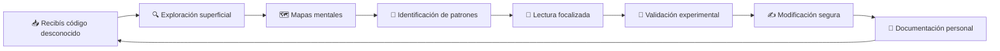
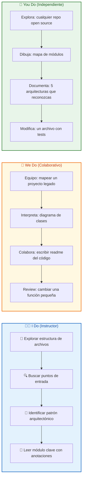
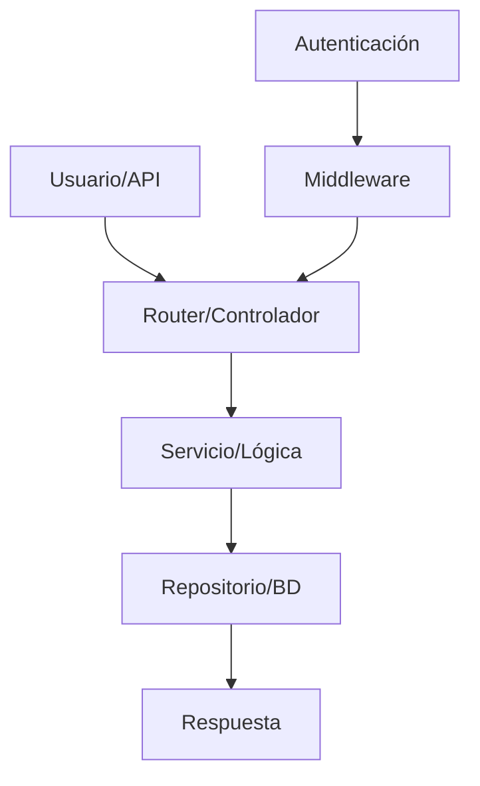

## 🎯 ¿Qué vas a aprender

En este contenido desarrollarás la habilidad de entender cualquier base de código desconocida de forma rápida y eficiente:

- 👁️‍🗨️ Por qué leer código es una habilidad diferente a escribir código
- 🗺️ Cómo construir un mapa mental de proyectos desconocidos en 30 minutos
- 🔍 Patrones para navegar código legacy sin perderte
- 🛠️ Herramientas que aceleran la lectura de código
- ⚠️ Errores comunes que hacen perder horas a los desarrolladores
- 🧠 Cómo entrenar tu mente para leer código como un senior
- 📝 Checklist y sistema reproducible para cualquier proyecto nuevo

---

# MASTERCLASS: Cómo Leer Código de Otras Personas Rápido y Eficaz 👁️‍🗨️ — La Habilidad Olvidada de los Desarrolladores Senior

## 🎬 INTRODUCCIÓN: POR QUÉ ESTA MASTERCLASS ES DIFERENTE

La mayoría de las guías de programación te enseñan a escribir código: sintaxis, patrones, arquitectura, testing. Pero muy pocas te enseñan la habilidad más usada en la vida real de un desarrollador: **leer el código de otra persona**.

Según estudios de la industria, un desarrollador pasa entre el **60% y el 80%** de su tiempo leyendo código que no escribió. Y a pesar de eso, casi nadie entrena sistemáticamente esta habilidad.

En esta masterclass, te explico la sistemática de un desarrollador senior para enfrentarse a cualquier base de código —sea legacy, de terceros, o tu propio proyecto pasado— y entenderla lo suficiente como para modificarla con seguridad.

> **🎯 Objetivo de Aprendizaje** — Al final de esta guía, tendrás un sistema paso a paso para enfrentarte a cualquier código desconocido, construir un mapa mental del proyecto y hacer tu primer cambio sin miedo.

> **⚠️ Advertencia educativa** — Este contenido es formativo. Siempre hacé un backup y validá tus cambios en un entorno de prueba antes de modificar código en producción.

---

## 🗺️ MAPA DEL WORKFLOW DE LECTURA DE CÓDIGO



| 🚀 Fase | ❓ Pregunta que responde | 🎁 Output principal |
|---------|--------------------------|---------------------|
| **Exploración** | ¿Dónde están los archivos principales? | 🗂️ Estructura del proyecto |
| **Mapas mentales** | ¿Cómo se conectan los módulos? | 🧩 Diagrama de dependencias |
| **Patrones** | ¿Qué convenciones sigue el código? | 📏 Reglas del proyecto |
| **Lectura focalizada** | ¿Dónde está la lógica que necesito modificar? | 🎯 Archivos relevantes |
| **Validación** | ¿Entiendo realmente cómo funciona? | 🧪 Prueba confirmatoria |
| **Modificación** | ¿Cómo cambio esto sin romper nada? | ✍️ Cambio atómico |
| **Documentación** | ¿Qué aprendí para la próxima vez? | 📓 Notas de contexto |



---

## 🧠 PARTE 1: LA MENTALIDAD DEL LECTOR DE CÓDIGO

### 1.1 Leer Código es una Habilidad Diferente ✍️

Escribir código y leer código activan áreas cognitivas distintas. Cuando escribís, creás estructura nueva. Cuando leés, reconstruís el pensamiento de otra persona.

| Escribir código | Leer código |
|-----------------|-------------|
| Autor de la estructura | Intérprete de la estructura |
| Flujo controlado | Flujo desconocido |
| Decisiones conscientes | Decisiones que alguien más tomó |
| Comprensión completa | Comprensión parcial suficiente |

> **💡 Concepto Clave**: Leer código no requiere entender TODO el proyecto. Requiere entender lo suficiente para hacer cambios seguros. Eso es la **lectura dirigida**.

### 1.2 Los Niveles de Comprensión

```python
class CodeComprehensionLevel:
    def __init__(self):
        self.levels = {
            "navegacion": "Puedo moverme entre archivos sin perderme",
            "patrones": "Reconozco las convenciones del proyecto",
            "flujo": "Entiendo el flujo de datos principal",
            "detalle": "Puedo explicar qué hace cada función",
            "prediccion": "Puedo anticipar el impacto de un cambio"
        ]

    def current_level(self, task_complexity):
        if task_complexity == "simple":
            return "navegacion"
        elif task_complexity == "media":
            return "flujo"
        elif task_complexity == "compleja":
            return "detalle"
        else:
            return "prediccion"
```

| Nivel | Cuándo lo necesitás | Tiempo estimado |
|-------|---------------------|-----------------|
| **Navegación** | Encontrar un archivo | 5-10 min |
| **Patrones** | Seguir la convención del equipo | 15-30 min |
| **Flujo** | Agregar una feature pequeña | 30-60 min |
| **Detalle** | Refactorizar una sección | 1-3 horas |
| **Predicción** | Cambio arquitectónico | 3+ horas |

### 1.3 Errores Mentales al Leer Código 🚫

| Error mental | Síntoma | Corrección |
|--------------|---------|------------|
| **Tengo que entender todo** | Te perdés en detalles irrelevantes | Definí el scope primero: qué necesitás resolver |
| **El código está mal escrito** | Juzgás antes de entender | Primero entendé, después evaluá |
| **Me rindo después de 10 minutos** | No encontrás lo que buscás | Seguí un mapa, no un impulso |
| **Leo linealmente** | Perdés el contexto | Saltá entre archivos relacionados |

---

## 🗺️ PARTE 2: EXPLORACIÓN SUPERFICIAL — LOS PRIMEROS 30 MINUTOS

### 2.1 La Técnica de los 3 Archivos

Todo proyecto tiene 3 archivos que te dicen más que 100 archivos de lógica:

| Archivo | Información que te da | Dónde encontrarlo |
|---------|----------------------|-------------------|
| **README** | Propósito, instalación, ejecución | Raíz del proyecto |
| **package.json / requirements.txt / go.mod** | Dependencias, scripts, entrypoints | Raíz del proyecto |
| **Estructura de carpetas** | Organización, módulos, tecnologías | Raíz del proyecto |

### 2.2 Checklist de Exploración Superficial

| Paso | Acción | Tiempo |
|------|--------|--------|
| 1 | Leer README completo | 5 min |
| 2 | Revisar archivo de dependencias | 3 min |
| 3 | Mapear estructura de carpetas | 7 min |
| 4 | Buscar punto de entrada (index, main, app) | 5 min |
| 5 | Identificar frameworks y tecnologías | 5 min |
| 6 | Ejecutar el proyecto si es posible | 5 min |

### 2.3 Código: Exploración Automática

```bash
# Script rápido para conocer un proyecto nuevo
echo "=== Estructura ==="
tree -L 2 -I 'node_modules|.git|dist'

echo "=== Entrypoints ==="
grep -r "main()" --include="*.js" --include="*.py" --include="*.ts" -l

echo "=== Dependencias principales ==="
cat package.json | jq '.dependencies, .devDependencies' 2>/dev/null || cat requirements.txt

echo "=== Última modificación ==="
git log --oneline -5
```

> **💡 Tip**: Si el proyecto no tiene README o está desactualizado, empezá por el archivo de configuración del framework. Esa es la verdadera fuente de verdad.

---

## 🔍 PARTE 3: CONSTRUCCIÓN DE MAPAS MENTALES

### 3.1 El Mapa de Contexto

Cuando entrás a un proyecto nuevo, tu cerebro no sabe nada. Necesitás construir un mapa mínimo viable:

```text
MAPEO MÍNIMO:

1. ¿Qué hace este proyecto?
   - Propósito en una frase

2. ¿Quién lo usa?
   - Usuarios internos, clientes, API

3. ¿Cómo se ejecuta?
   - Comandos, entrypoints, flujo principal

4. ¿Qué tecnologías usa?
   - Lenguaje, frameworks, bases de datos

5. ¿Quién lo mantiene?
   - Equipo, documentación, responsables
```

### 3.2 Diagrama de Flujo del Proyecto



### 3.3 Herramientas de Mapeo

| Herramienta | Uso | Cuándo |
|-------------|-----|--------|
| **CodeSee** | Mapas visuales interactivos | Proyectos JS/TS |
| **Sourcegraph** | Búsqueda semántica y navegación | Cualquier lenguaje |
| **cTags / cScope** | Navegación por definiciones | Proyectos C/JS/Python |
| **Doxygen / Sphinx** | Documentación automática | Proyectos con docs |
| **Mermaid / Draw.io** | Diagramas manuales | Tu comprensión personal |

---

## 🧩 PARTE 4: IDENTIFICACIÓN DE PATRONES

### 4.1 Patrones de Código que Te Dicen Todo

Todo código sigue patrones, aunque no estén documentados. Tu trabajo es encontrarlos:

| Patrón | Señal | Ejemplo |
|--------|-------|---------|
| **MVC/MVVM** | Carpetas `models/`, `views/`, `controllers/` | Separación de responsabilidades |
| **Clean Architecture** | Capas `domain/`, `application/`, `infrastructure/` | Inversión de dependencias |
| **Microservicios** | Múltiples `docker-compose.yml`, carpetas separadas | Servicios independientes |
| **Event-Driven** | Eventos, brokers, colas | Comunicación asincrónica |
| **Monolito Modular** | Carpetas como `users/`, `orders/`, `payments/` | Módulos dentro del mismo deploy |

### 4.2 Tabla de Detección Rápida

| Pregunta | Si la respuesta es sí, probablemente es... |
|----------|---------------------------------------------|
| ¿Hay una carpeta `src/` o `app/`? | Estructura convencional |
| ¿Los archivos terminan en `.controller`, `.service`, `.repository`? | Arquitectura en capas |
| ¿Hay `middleware` o `filters`? | Pipeline de procesamiento |
| ¿Las rutas están en un solo archivo? | Enrutamiento centralizado |
| ¿Hay múltiples archivos de configuración? | Configuración por entorno |

### 4.3 El Patrón del Dpto

```text
Cuando no entiendes algo:
1. Buscá el archivo de configuración del framework
2. Encontrá el archivo que importa ese archivo
3. Ese archivo es tu punto de entrada REAL
4. Desde ahí, trazá las llamadas hacia abajo
```

---

## 📖 PARTE 5: LECTURA FOCALIZADA — DÓNDE MIRAR Y QUÉ OMITIR

### 5.1 La Técnica del Zoom In / Zoom Out

```
ZOOM OUT (5 minutos):
- ¿Qué hace la función en una frase?
- ¿Qué recibe? ¿Qué devuelve?
- ¿Qué errores puede lanzar?

ZOOM IN (15 minutos):
- ¿Cómo lo hace paso a paso?
- ¿Qué dependencias tiene?
- ¿Qué side effects genera?

ZOOM OUT AGAIN (5 minutos):
- ¿Cómo se integra con el resto?
- ¿Qué pasa si lo elimino?
```

### 5.2 Cómo Leer una Función Nueva

```python
# Ejemplo de función a leer
def process_order(order_id: int, user_id: int) -> dict:
    order = db.query(Order).filter_by(id=order_id).first()
    if not order or order.user_id != user_id:
        raise PermissionError("No autorizado")
    total = sum(item.price * item.quantity for item in order.items)
    order.status = "processed"
    db.commit()
    return {"total": total, "status": order.status}
```

**Lectura focalizada:**
1. **Nombre y parámetros**: `process_order` recibe un `order_id` y un `user_id`
2. **Validación**: Verifica que la orden existe y pertenece al usuario
3. **Cálculo**: Suma el total de items
4. **Mutación**: Cambia el estado a `processed`
5. **Persistencia**: Guarda en BD
6. **Retorno**: Devuelve total y estado

> **💡 Tip**: No leas cada línea como poesía. Leer código es como leer un mapa: necesitás las carreteras principales, no cada hoja de cada árbol.

### 5.3 Errores de Lectura Focalizada

| Error | Síntoma | Solución |
|-------|---------|----------|
| **Leer tests como especificación** | Malinterpretás el comportamiento | Los tests son ejemplos, no la verdad |
| **Ignorar comentarios** | Te perdés en código ofuscado | Leé comentarios como contexto del autor |
| **Seguir todo** | Te perdés en rabbit holes | Definí un objetivo de lectura antes de empezar |
| **No correr el código** | Suponés cosas que no son así | Ejecutá casos reales con breakpoints |

---

## 🧪 PARTE 6: VALIDACIÓN EXPERIMENTAL — LEER NO BASTA, TENÉS QUE PROBAR

### 6.1 El Protocolo de Lectura + Ejecución

```
1. Encontrá el punto de entrada (tests, main, CLI)
2. Ejecutá el flujo que te interesa con un debugger o logs
3. Observá el estado real de los datos
4. Compará con tu comprensión teórica
5. Ajustá tu mapa mental
```

### 6.2 Cómo Usar el Debugger como Lector

| Acción | Propósito |
|--------|-----------|
| **Breakpoint en entrypoint** | Ver el estado inicial |
| **Step over lógica de negocio** | Seguir el flujo sin entrar en detalles innecesarios |
| **Inspeccionar variables** | Ver los datos reales en cada paso |
| **Logs condicionales** | Filtrar solo lo que te importa |

### 6.3 Código: Session de Debug para Lectura

```python
# Ejemplo: leer una función desconocida mediante ejecución
def debug_read(function, *args, **kwargs):
    print(f"=== Entrada: {args}, {kwargs} ===")
    result = function(*args, **kwargs)
    print(f"=== Salida: {result} ===")
    print(f"=== Tipo: {type(result)} ===")
    return result

# Uso: ejecutá la función con datos de prueba
# y compará la salida con tu comprensión teórica
```

---

## ✍️ PARTE 7: MODIFICACIÓN SEGURA — CAMBIAR SIN ROMPER

### 7.1 El Principio del Cambio Atómico

```
Regla: Hacé UN cambio pequeño, validalo, y solo entonces mergealo.

Cambio atómico:
1. Modificá una sola función o comportamiento
2. Ejecutá tests existentes
3. Ejecutá tu nuevo caso de prueba
4. Revisá que no haya side effects visibles
5. Commit con mensaje descriptivo
```

### 7.2 Checklist de Modificación Segura

| Paso | Acción | Verificación |
|------|--------|--------------|
| 1 | Backup o branch | `git checkout -b change/feature-x` |
| 2 | Leer el código que vas a modificar | Comprendés el flujo actual |
| 3 | Escribir un test que falle primero | Tu test describe el cambio deseado |
| 4 | Hacer el cambio mínimo | Solo lo necesario |
| 5 | Ejecutar tests | Todo verde |
| 6 | Revisar diff | Cambios atómicos, no refactors mezclados |
| 7 | Documentar tu cambio | Comentario o nota si es necesario |

---

## 🤝 PARTE 8: I DO / WE DO / YOU DO

### 8.1 I Do — Lectura Dirigida de un Proyecto Legado

**Objetivo**: entender un módulo desconocido en 20 minutos.

| Paso | Acción | Resultado |
|------|--------|-----------|
| 1 | Clonar o abrir un proyecto desconocido | Proyecto abierto |
| 2 | Leer README y estructura de carpetas | Contexto general |
| 3 | Buscar punto de entrada del módulo relevante | Entrypoint identificado |
| 4 | Leer funciones principales con comentarios | Mapa mental del flujo |
| 5 | Ejecutar un caso de prueba o script | Validación empírica |

### 8.2 We Do — Mapeo Colaborativo de un Repositorio

**Escenario**: el equipo debe modificar un módulo legacy.

| Actividad | Responsable | Entregable |
|-----------|-------------|------------|
| Mapeo de carpetas | Equipo completo | Diagrama de estructura |
| Identificación de patrones | Senior | Lista de convenciones |
| Lectura focalizada | Pair programming | Documentación de flujos |
| Validación experimental | QA / DevOps | Scripts de prueba |

### 8.3 You Do — Tu Primer Proyecto Desconocido

| Día | Tarea | Entregable |
|-----|--------|-----------|
| 1 | Elegir un repo open source pequeño | URL del repositorio |
| 2 | Mapear su estructura y arquitectura | Mapa mental o diagrama |
| 3 | Identificar 3 patrones de código | Lista con ejemplos |
| 4 | Leer y explicar un módulo completo | Notas o documento |
| 5 | Hacer un cambio mínimo (tip, fix docs) | PR mergeado |

### 8.4 I Do — El Arte de las Anotaciones

**Objetivo**: crear un sistema de notas mientras leés código.

```markdown
# Notas de Proyecto: [nombre]

## Arquitectura
- Patrón: [MVC / Clean Arch / etc]
- Entrypoint: [archivo]
- Configuración: [archivos de config]

## Módulos Clave
| Módulo | Responsabilidad | Archivo principal |
|--------|----------------|-------------------|
| users | Gestión de usuarios | src/users/service.py |
| orders | Procesamiento de órdenes | src/orders/processor.py |

## Decisiones que no entiendo
- ¿Por qué usa X en lugar de Y?
- ¿Qué hace exactamente la función Z?

## Cómo correr los tests
```bash
pytest tests/
```
```

### 8.5 We Do — Code Review como Ejercicio de Lectura

**Escenario**: hacer un code review de un PR en equipo.

| Acción | Pregunta a responder |
|--------|----------------------|
| Ver cambios | ¿Qué intenta solucionar este PR? |
| Leer archivos modificados | ¿El cambio está aislado? |
| Identificar patrones rotos | ¿Respeta las convenciones del proyecto? |
| Probar localmente | ¿Funciona como espera el autor? |

### 8.6 You Do — Tu Sistema de Lectura de Código

| Componente | Tu elección |
|------------|-------------|
| IDE + extensiones | VS Code / IntelliJ / Vim |
| Herramientas de navegación | Sourcegraph / ctags / ripgrep |
| Formato de notas | Markdown / Notion / Obsidian |
| Ritual de entrada | Leer README → Mapa → Entrypoint |

---

## 📚 GLOSARIO RÁPIDO

| 📚 Término | 📝 Definición |
|------------|---------------|
| **Legacy** | Código antiguo sin documentación actualizada |
| **Codebase** | Conjunto completo de archivos de un proyecto |
| **Entrypoint** | Archivo desde donde se ejecuta la aplicación |
| **Side effect** | Efecto secundario no explícito de una función |
| **Refactor** | Modificación interna sin cambiar comportamiento externo |
| **Mental model** | Representación mental de cómo funciona el código |
| **Code review** | Revisión de código por pares |
| **Atomic change** | Cambio pequeño, aislado y verificable |
| **Debugger** | Herramienta para ejecutar código paso a paso |
| **Tests como spec** | Usar tests como documentación ejecutable |

---

## 📝 PREGUNTAS DE VERIFICACIÓN

1. **🎯 Aplica**: Abrí cualquier repo open source que te interese. ¿Cuál es su punto de entrada y qué hace en una frase?

2. **🔍 Analiza**: ¿Por qué leer código es diferente a escribirlo? Menciona 3 diferencias cognitivas.

3. **🎨 Diseña**: Dibujá el mapa mental de un proyecto que hayas tocado recientemente.

4. **💭 Reflexiona**: ¿Cuánto tiempo perdés promedio por semana tratando de entender código ajeno? ¿Qué harías para reducirlo?

5. **🧩 Integra**: Conectá exploración superficial, mapas mentales y validación experimental. ¿En qué orden los aplicarías para un proyecto que no corre?

---

## 🌟 REFLEXIÓN FINAL

Leer código rápido no es un don. Es una habilidad entrenable que se compone de: curiosidad, sistemática y herramientas.

> 👁️‍🗨️ El mejor desarrollador no es el que escribe más código. Es el que entiende más código, más rápido y con menos errores.

- 🗺️ **Mapa antes de código**: entendé la estructura antes de profundizar
- 🧠 **Patrones antes de detalles**: las convenciones son tu brújula
- 🧪 **Ejecución antes de creer**: el código miente, los tests no
- ✍️ **Notas antes de olvidar**: documentá para tu yo futuro

La próxima vez que te enfrentés a un código desconocido, no entrés en pánico. Aplicá el sistema, respirá profundo, y empezá por el README.
