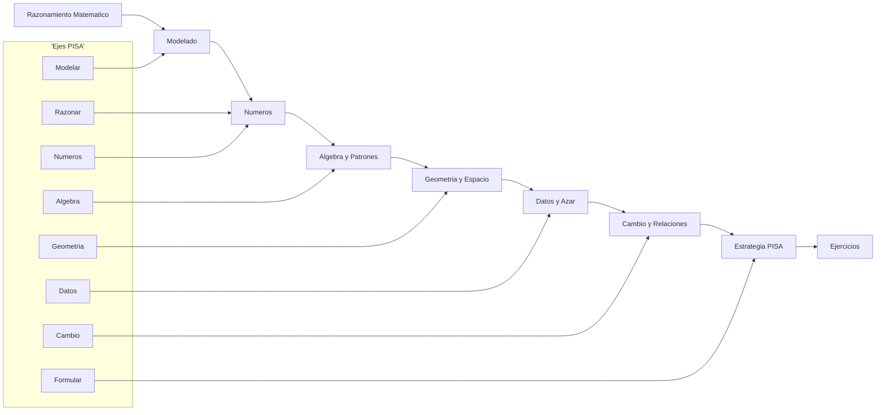
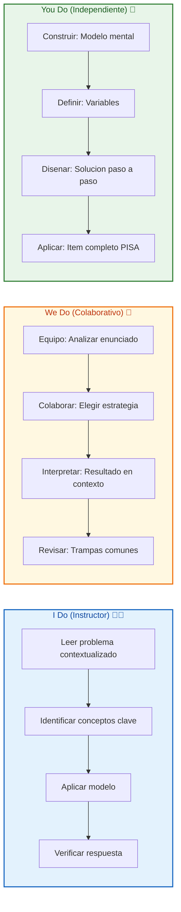
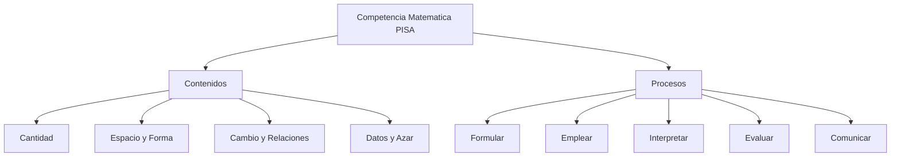
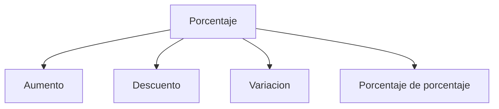
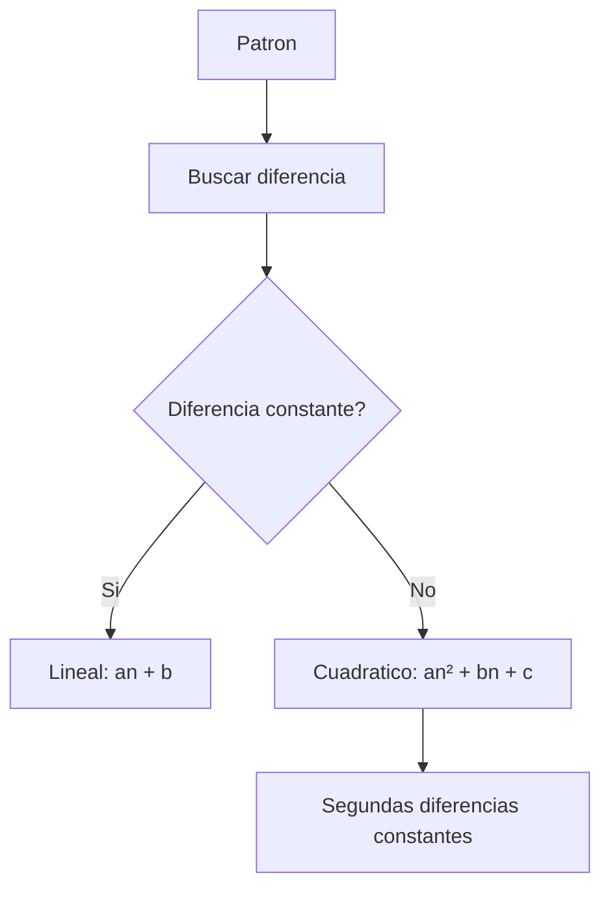
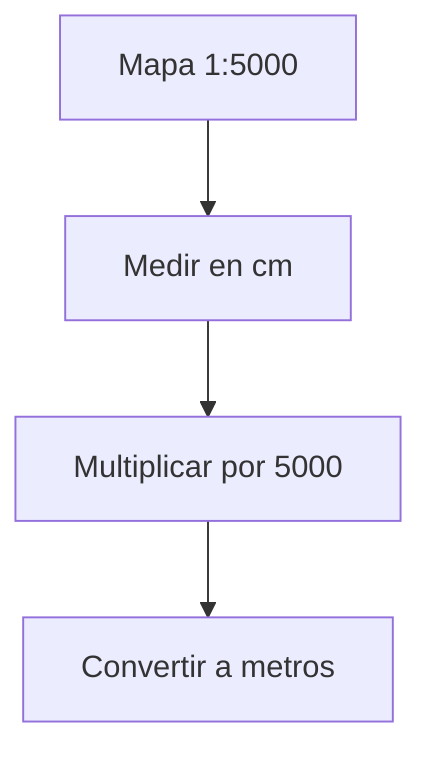
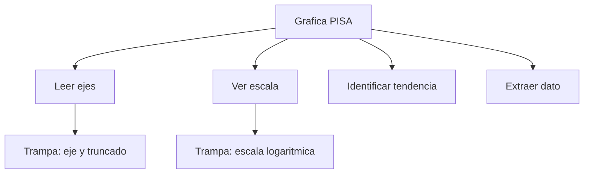

# MASTERCLASS: Matemáticas para Aprobar PISA — Los Fundamentos que Sí Evalúan 🎯📐

## INTRODUCCIÓN: POR QUÉ ESTE MASTERCLASS ES DIFERENTE 🚀

Las pruebas PISA no evalúan cuántas fórmulas te sabés de memoria. Evalúan si podés **usar las matemáticas para resolver problemas reales**. Un estudiante que entiende el razonamiento detrás de un problema de descuento, una gráfica de población o un plano de arquitectura va a sacar mejor puntaje que alguien que solo repite algoritmos.

Este masterclass propone otro camino: en vez de memorizar tablas de multiplicar o fórmulas de área, vas a entrenar las **8 competencias matemáticas que PISA realmente mide**. Si entendés cómo piensa PISA, podés anticipar el tipo de pregunta, leerla rápido y atacar el razonamiento correcto.

La meta no es sacar 100 de 100 por suerte. La meta es **convertirte en un solucionador de problemas**: leer el contexto, elegir la herramienta matemática correcta, aplicarla y explicar tu respuesta.

> **Objetivo de Aprendizaje** 🎯 — Al final de esta guía, conocerás los 8 ejes que evalúa PISA, sabrás modelar problemas contextualizados, dominarás números, álgebra, geometría, datos y azar, cambio y relaciones, y tendrás una estrategia de ataque para cualquier ítem PISA.

> **Advertencia educativa** ⚠️ — Esta guía es formativa. PISA es una evaluación internacional compleja; el mejor resultado viene de práctica contextualizada, comprensión profunda y entrenamiento en lectura crítica.

---

## MAPA DEL MASTERCLASS 🗺️



| Fase | Pregunta que responde | Output principal |
|------|-----------------------|------------------|
| **Razonamiento** | ¿Qué pide el problema? | Interpretación |
| **Modelado** | ¿Cómo lo convierto en matemática? | Modelo |
| **Números** | ¿Opero correctamente? | Cálculo |
| **Álgebra** | ¿Veo el patrón? | Fórmula |
| **Geometría** | ¿Cómo es el espacio? | Esquema |
| **Datos** | ¿Qué dicen los números? | Gráfica/tabla |
| **Cambio** | ¿Cómo varía? | Función |
| **Estrategia** | ¿Cómo ataco el ítem? | Plan de acción |



---

## PARTE 1: CÓMO PIENSA PISA — LA MENTALIDAD QUE HACE FALTA 🧠

### 1.1 PISA no evalúa memoria, evalúa competencia

PISA no te pregunta "¿cuál es la fórmula del área del círculo?" Te pregunta: "Si una mesa circular tiene diámetro X, ¿cuánto mantel necesitas?" La fórmula está en el enunciado o es evidente. Lo que evalúa es si podés **traducir palabras a matemática**.

| Lo que NO evalúa PISA ❌ | Lo que SÍ evalúa PISA ✅ |
|---------------------------|--------------------------|
| Fórmulas de memoria | Aplicación flexible |
| Cálculo mental rápido | Estrategia de solución |
| Repetir procedimientos | Razonar y justificar |
| Conocer definiciones | Modelar problemas |
| Resolver ejercicios aislados | Leer contexto y actuar |

> **La frase del profe** 🌟 — *"PISA no busca calculadoras humanas. Busca personas que piensen con números. Si entendés el problema, el cálculo viene solo."*

### 1.2 Los 8 ejes de competencia matemática PISA

PISA organiza la evaluación en tres **contenidos** y cinco **procesos**:

| Contenido | Procesos |
|-----------|----------|
| **Quantity** (números, operaciones, magnitudes) | **Formular** problemas |
| **Space and shape** (geometría, planos, mapas) | **Emplear** conceptos |
| **Change and relations** (funciones, tasas) | **Interpretar** resultados |
| **Data and chance** (estadística, probabilidad) | **Evaluar** soluciones |
| | **Comunicar** razonamiento |



### 1.3 La estrategia universal para cualquier ítem PISA

| Paso | Acción | Pregunta clave |
|------|--------|----------------|
| 1 | Leer el contexto | ¿De qué habla el problema? |
| 2 | Subrayar datos | ¿Qué números me dan? |
| 3 | Identificar la pregunta | ¿Qué me piden calcular? |
| 4 | Elegir la herramienta | ¿Qué concepto aplico? |
| 5 | Resolver | ¿Tiene sentido el camino? |
| 6 | Verificar | ¿La respuesta es razonable? |
| 7 | Comunicar | ¿Puedo explicar mi razonamiento? |

> **Tip** 💡 — En PISA, la respuesta "correcta" suele ser la que muestra mejor razonamiento, no solo el número final. A veces hay que elegir la mejor estrategia, no la más rápida.

---

## PARTE 2: NÚMEROS Y CANTIDAD — LA BASE DE TODO 🔢

### 2.1 Lo que evalúa PISA en números

PISA evalúa si podés **operar con números en contexto**: porcentajes, tasas, proporciones, redondeo y estimación. No es aritmética pura: es aritmética con historia.

| Tema | Ejemplo PISA | Competencia |
|------|--------------|-------------|
| **Porcentajes** | Descuentos, aumentos, IVA | Interpretar tasa de cambio |
| **Proporciones** | Recetas, mezclas, escalas | Relacionar magnitudes |
| **Razones** | Velocidad, densidad, precios unitarios | Comparar cantidades |
| **Estimación** | "¿Cuánto cuesta aproximadamente?" | Sentido numérico |
| **Redondeo** | Presupuestos, precisiones | Aproximación útil |

### 2.2 Porcentajes: el tema más repetido

Los porcentajes aparecen en el 60% de los ítems de cantidad. Tenés que dominar:

| Operación | Fórmula mental | Ejemplo |
|-----------|----------------|---------|
| **Aumento** | `valor · (1 + p/100)` | Precio $100 + 20% = $120 |
| **Descuento** | `valor · (1 - p/100)` | Precio $100 - 15% = $85 |
| **Variación porcentual** | `(nuevo - viejo) / viejo · 100` | De 50 a 60 = 20% |
| **Porcentaje de porcentaje** | `p1% de p2%` | 10% de 20% = 2% |



> **Tip** 💡 — En PISA, los porcentajes vienen embebidos en historias: descuentos en tiendas, crecimiento de población, inflación. Leé el cuento antes de calcular.

### 2.3 Proporciones y razones

Una **proporción** es una igualdad entre dos razones: `a/b = c/d`. Una **razón** compara dos cantidades: `a:b`.

| Situación | Razón | Interpretación |
|-----------|-------|----------------|
| 3 manzanas por $2 | 3:2 | 3 manzanas cuestan lo mismo que 2 dólares |
| 60 km en 1 hora | 60:1 | Velocidad de 60 km/h |
| Mezcla 2:1 de agua y jugo | 2:1 | Por cada 2 partes de agua, 1 de jugo |

### 2.4 I Do — Resolver problema de porcentaje 👨‍🏫

**Problema:** una camiseta cuesta $80. Tiene un descuento del 25%. ¿Cuánto pagás?

| Paso | Acción | Resultado |
|------|--------|-----------|
| 1 | Identificar descuento | 25% de $80 |
| 2 | Calcular | 0.25 · 80 = $20 |
| 3 | Restar | 80 - 20 = $60 |
| 4 | O usar fórmula directa | 80 · (1 - 0.25) = $60 |

### 2.5 We Do — Proporciones en recetas 🤝

**Problema:** una receta para 4 personas usa 3 huevos. ¿Cuántos huevos para 10 personas?

| Paso | Acción | Resultado |
|------|--------|-----------|
| 1 | Plantear proporción | 4 personas / 3 huevos = 10 personas / x huevos |
| 2 | Resolver | x = (10 · 3) / 4 = 7.5 huevos |

> **Tip** 💡 — En PISA, las proporciones aparecen en mapas, planos, recetas y conversiones de moneda. Identificá la relación "unidades por unidad" y mantene la igualdad.

---

## PARTE 3: ÁLGEBRA Y PATRONES — LA MAGIA DE LAS x 🧙‍♂️

### 3.1 Lo que evalúa PISA en álgebra

PISA no evalúa si podés factorizar polinomios de grado 5. Evalúa si podés **ver patrones, expresar relaciones con letras y resolver ecuaciones simples en contexto**.

| Tema | Ejemplo PISA | Competencia |
|------|--------------|-------------|
| **Patrones** | "Si la fila 1 tiene 2 sillas, la fila 2 tiene 4, la fila 3 tiene 6... ¿cuántas en la fila 15?" | Reconocer secuencia |
| **Expresiones algebraicas** | "El perímetro de un rectángulo es 2l + 2w" | Traducir palabras a símbolos |
| **Ecuaciones lineales** | "Si 3x + 5 = 20, ¿cuánto es x?" | Despejar y resolver |
| **Funciones** | "Un taxi cobra $5 + $2 por km. ¿Cuánto por 8 km?" | Modelar relación |
| **Inecuaciones** | "Debés tener al menos 18 años" | Representar restricción |

### 3.2 El poder de la letra x

En PISA, la `x` no es un misterio: es un **espacio vacío que representa un número desconocido**.

| En palabras | En álgebra |
|-------------|------------|
| "El doble de un número más 3" | `2x + 3` |
| "Un número menos 7" | `x - 7` |
| "El triple de un número" | `3x` |
| "Un número dividido por 4" | `x/4` |

> **Tip** 💡 — Si no sabés por dónde empezar, reemplazá la incógnita por "un número" y armá la frase en palabras. Después convertila a símbolos.

### 3.3 Patrones y secuencias

Muchos ítems PISA esconden ecuaciones detrás de patrones visuales o numéricos.

| Patrón | Regla | Término 10 |
|--------|-------|------------|
| 2, 4, 6, 8... | `2n` | 20 |
| 1, 4, 9, 16... | `n²` | 100 |
| 1, 3, 6, 10... | `n(n+1)/2` | 55 |



### 3.4 I Do — Expresar un problema en álgebra 👨‍🏫

**Problema:** "Un número más el doble de ese número es 18. ¿Cuál es el número?"

| Paso | Acción | Resultado |
|------|--------|-----------|
| 1 | Definir variable | x = el número |
| 2 | Expresar "el doble" | 2x |
| 3 | Expresar "más" | x + 2x |
| 4 | Plantear ecuación | x + 2x = 18 |
| 5 | Resolver | 3x = 18 → x = 6 |

### 3.5 We Do — Encontrar la regla de un patrón 🤝

**Problema:** la figura 1 tiene 3 cuadraditos, la figura 2 tiene 5, la figura 3 tiene 7... ¿cuántos tiene la figura 20?

| Figura | Cuadraditos | Patrón |
|--------|-------------|--------|
| 1 | 3 | 2·1 + 1 |
| 2 | 5 | 2·2 + 1 |
| 3 | 7 | 2·3 + 1 |
| n | ? | 2n + 1 |
| 20 | ? | 2·20 + 1 = 41 |

---

## PARTE 4: GEOMETRÍA Y ESPACIO — DIBUJAR PARA ENTENDER 📐

### 4.1 Lo que evalúa PISA en geometría

PISA evalúa si podés **interpretar planos, mapas, figuras 3D y transformaciones** para resolver problemas prácticos: ¿cuánto material necesitás? ¿cuál es el camino más corto? ¿cuánto pintura cubre la pared?

| Tema | Ejemplo PISA | Competencia |
|------|--------------|-------------|
| **Perímetro y área** | "¿Cuánto césped para un jardín rectangular?" | Medir y calcular |
| **Volumen** | "¿Cuánta agua cabe en un tanque?" | Pensamiento 3D |
| **Escalas** | "En un mapa 1:5000, ¿cuánto mide realmente?" | Interpretar proporción |
| **Ángulos** | "¿Qué ángulo forma el brazo del reloj a las 3:15?" | Visualizar |
| **Transformaciones** | "Reflejar un diseño en un espejo" | Simetría |
| **Coordenadas** | "Ubicar un punto en un plano cartesiano" | Espacio abstracto |

### 4.2 Fórmulas que sí necesitás conocer

PISA suele dar las fórmulas, pero es útil reconocerlas:

| Figura | Perímetro | Área | Volumen |
|--------|-----------|------|---------|
| Cuadrado | `4l` | `l²` | — |
| Rectángulo | `2(l + a)` | `l · a` | — |
| Círculo | `2πr` | `πr²` | — |
| Esfera | — | — | `(4/3)πr³` |
| Cubo | — | — | `l³` |

### 4.3 Escalas: el truco visual

Una escala `1:5000` significa que **1 cm en el mapa = 5000 cm en la realidad** (o 50 metros).

| Paso | Acción | Ejemplo |
|------|--------|---------|
| 1 | Medir en mapa | 3 cm |
| 2 | Multiplicar por escala | 3 · 5000 = 15000 cm |
| 3 | Convertir a unidades útiles | 15000 cm = 150 m |



### 4.4 I Do — Calcular área de un jardín 👨‍🏫

**Problema:** un jardín rectangular mide 12 m de largo y 8 m de ancho. ¿Cuánto césped necesitás?

| Paso | Acción | Resultado |
|------|--------|-----------|
| 1 | Identificar forma | Rectángulo |
| 2 | Fórmula | Área = largo · ancho |
| 3 | Sustituir | 12 · 8 |
| 4 | Calcular | 96 m² |

### 4.5 We Do — Interpretar escala de mapa 🤝

**Problema:** un mapa tiene escala 1:10000. La distancia entre dos puntos en el mapa es 5 cm. ¿Cuál es la distancia real?

| Paso | Acción | Resultado |
|------|--------|-----------|
| 1 | Escala | 1 cm = 10000 cm = 100 m |
| 2 | Medir | 5 cm |
| 3 | Calcular | 5 · 100 = 500 m |

---

## PARTE 5: DATOS Y AZAR — LEER EL MUNDO COMO UN GRÁFICO 📊

### 5.1 Lo que evalúa PISA en datos

PISA evalúa si podés **leer tablas, gráficas y estadísticas básicas** para sacar conclusiones: ¿cuál es la tendencia? ¿qué grupo es mayor? ¿es razonable esta afirmación?

| Tema | Ejemplo PISA | Competencia |
|------|--------------|-------------|
| **Tablas** | "¿Cuánto vendió la región sur en mayo?" | Extraer dato |
| **Gráficas de barras** | "Comparar ventas por mes" | Comparar categorías |
| **Gráficas de línea** | "¿Cuál fue la temperatura máxima?" | Ver tendencia |
| **Pictogramas** | "Cada icono representa 10 personas" | Interpretar símbolo |
| **Media y mediana** | "¿Cuál es el ingreso promedio?" | Estadística básica |
| **Probabilidad** | "¿Qué es más probable: lluvia o sol?" | Comparar chances |

### 5.2 Cómo leer cualquier gráfica en 3 pasos

| Paso | Pregunta | Acción |
|------|----------|--------|
| 1 | ¿Qué muestra? | Título y ejes |
| 2 | ¿Qué dice? | Tendencias, máximos, mínimos |
| 3 | ¿Qué concluyo? | Respuesta en contexto |

### 5.3 Trampas visuales en gráficas PISA

| Trampa ❌ | Por qué pica | Cómo evitarla ✅ |
|-----------|--------------|-----------------|
| Eje y que no empieza en 0 | Exagera diferencias | Fijarse en la escala |
| Barras de anchos distintos | Engaña la comparación | Verificar proporción |
| Pictogramas con iconos creciendo en área | Multiplica la impresión | Comparar valores numéricos |
| Títulos tendenciosos | Influye interpretación | Leer datos, no el título |



### 5.4 I Do — Interpretar tabla de datos 👨‍🏫

**Tabla:** ventas por región y mes.

| Región | Enero | Febrero | Marzo |
|--------|-------|---------|-------|
| Norte | 120 | 150 | 180 |
| Sur | 90 | 110 | 130 |
| Este | 200 | 180 | 160 |

**Pregunta:** ¿En qué mes la región norte superó a la región este por primera vez?

| Paso | Acción | Resultado |
|------|--------|-----------|
| 1 | Comparar enero | Norte 120 vs Este 200 → No |
| 2 | Comparar febrero | Norte 150 vs Este 180 → No |
| 3 | Comparar marzo | Norte 180 vs Este 160 → Sí |

### 5.5 We Do — Leer gráfica de línea 🤝

**Gráfica:** temperatura máxima diaria durante una semana.

| Día | Temperatura (°C) |
|-----|------------------|
| Lunes | 22 |
| Martes | 25 |
| Miércoles | 24 |
| Jueves | 28 |
| Viernes | 30 |
| Sábado | 27 |
| Domingo | 23 |

**Pregunta:** ¿Cuál fue la variación entre la temperatura máxima y mínima de la semana?

| Paso | Acción | Resultado |
|------|--------|-----------|
| 1 | Máximo | Viernes: 30°C |
| 2 | Mínimo | Lunes: 22°C |
| 3 | Variación | 30 - 22 = 8°C |

---

## PARTE 6: CAMBIO Y RELACIONES — CÓMO VARÍA EL MUNDO 📈

### 6.1 Lo que evalúa PISA en cambio

PISA evalúa si podés **interpretar tasas, tendencias, crecimiento y decrecimiento** en gráficas y tablas. No necesitás derivadas: necesitás entender qué significa "aumenta", "disminuye" y "cambia de ritmo".

| Tema | Ejemplo PISA | Competencia |
|------|--------------|-------------|
| **Tasas** | "¿A cuánto asciende el costo por km?" | Relacionar magnitudes |
| **Crecimiento** | "La población creció 2% anual" | Proyectar |
| **Decrecimiento** | "El tanque se vacía 5 litros por hora" | Predecir agotamiento |
| **Gráficas de cambio** | "¿Cuándo cambia la tendencia?" | Identificar punto de inflexión |
| **Funciones lineales** | "Costo fijo + costo variable" | Modelar |

### 6.2 Tipos de cambio

| Tipo | Gráfica | Ejemplo |
|------|---------|---------|
| **Lineal** | Recta | Crecimiento a ritmo constante |
| **Exponencial** | Curva que se acelera | Población que se duplica |
| **Decrecimiento** | Curva que cae | Desintegración radiactiva |
| **Cíclico** | Onda | Temperatura anual |

### 6.3 I Do — Interpretar tasa de cambio 👨‍🏫

**Problema:** un tanque de agua se llena a razón de 3 litros por minuto. Si ya tiene 20 litros, ¿cuánto habrá después de 15 minutos?

| Paso | Acción | Resultado |
|------|--------|-----------|
| 1 | Identificar tasa | 3 L/min |
| 2 | Calcular agua añadida | 3 · 15 = 45 L |
| 3 | Sumar inicial | 20 + 45 = 65 L |

### 6.4 We Do — Identificar punto de inflexión 🤝

**Problema:** un gráfico muestra la temperatura de un líquido que se calienta, se mantiene 5 minutos hirviendo y luego se enfría.

| Fase | Cambio |
|------|--------|
| Calentamiento | Temperatura sube |
| Hervor | Temperatura constante |
| Enfriamiento | Temperatura baja |

> **Tip** 💡 — En PISA, los gráficos de cambio a menudo tienen tramposidades: la escala del eje x no es uniforme, o la línea no empieza en 0. Mirá los números, no solo la forma.

---

## PARTE 7: PROBABILIDAD Y AZAR — ENTENDER LA INCERTIDUMBRE 🎲

### 7.1 Lo que evalúa PISA en probabilidad

PISA evalúa si podés **comparar probabilidades, entender experimentos aleatorios y evitar falacias**. No pide fórmulas complejas: pide sentido común probabilístico.

| Tema | Ejemplo PISA | Competencia |
|------|--------------|-------------|
| **Frecuencia relativa** | "De 100 lanzamientos, 45 salieron cara" | Interpretar dato |
| **Probabilidad simple** | "Probabilidad de sacar un 6 en un dado" | Regla de Laplace |
| **Comparación** | "¿Qué es más probable: A o B?" | Ordenar chances |
| **Falacias** | "Después de 5 cruces, surely sale cara" | Reconocer independencia |
| **Muestreo** | "¿Es representativa esta encuesta?" | Sesgo |

### 7.2 Regla de Laplace

```text
P(evento) = Casos favorables / Casos posibles
```

| Experimento | Casos favorables | Casos posibles | Probabilidad |
|-------------|------------------|----------------|--------------|
| Dado, que salga 3 | 1 | 6 | 1/6 |
| Moneda, que salga cara | 1 | 2 | 1/2 |
| Baraja, sacar un as | 4 | 52 | 1/13 |

### 7.3 La falacia del apostador

Después de 5 cruces seguidos, mucha gente cree que "ya debe salir cara". **Falso**. Cada lanzamiento es independiente: la probabilidad sigue siendo 1/2.

> **La frase del profe** 🌟 — *"La probabilidad no tiene memoria. El dado no 'recuerda' que salió 6 la última vez."*

### 7.4 I Do — Calcular probabilidad simple 👨‍🏫

**Problema:** en una bolsa hay 8 bolas azules y 4 rojas. ¿Probabilidad de sacar una roja?

| Paso | Acción | Resultado |
|------|--------|-----------|
| 1 | Casos favorables | 4 (rojas) |
| 2 | Casos posibles | 8 + 4 = 12 |
| 3 | Probabilidad | 4/12 = 1/3 |

### 7.5 We Do — Comparar probabilidades 🤝

**Problema:** tenés dos dados. ¿Es más probable sacar suma 7 o suma 8?

| Suma | Combinaciones |
|------|---------------|
| 7 | (1,6), (2,5), (3,4), (4,3), (5,2), (6,1) = 6 |
| 8 | (2,6), (3,5), (4,4), (5,3), (6,2) = 5 |

**Conclusión:** suma 7 es más probable (6/36 vs 5/36).
